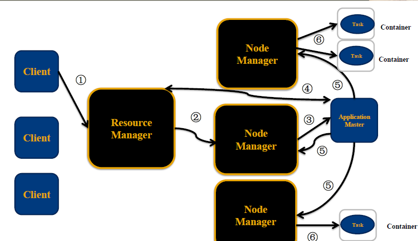
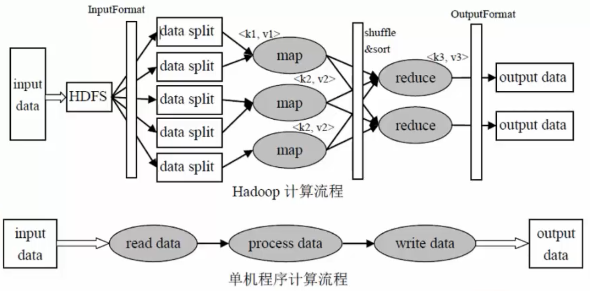
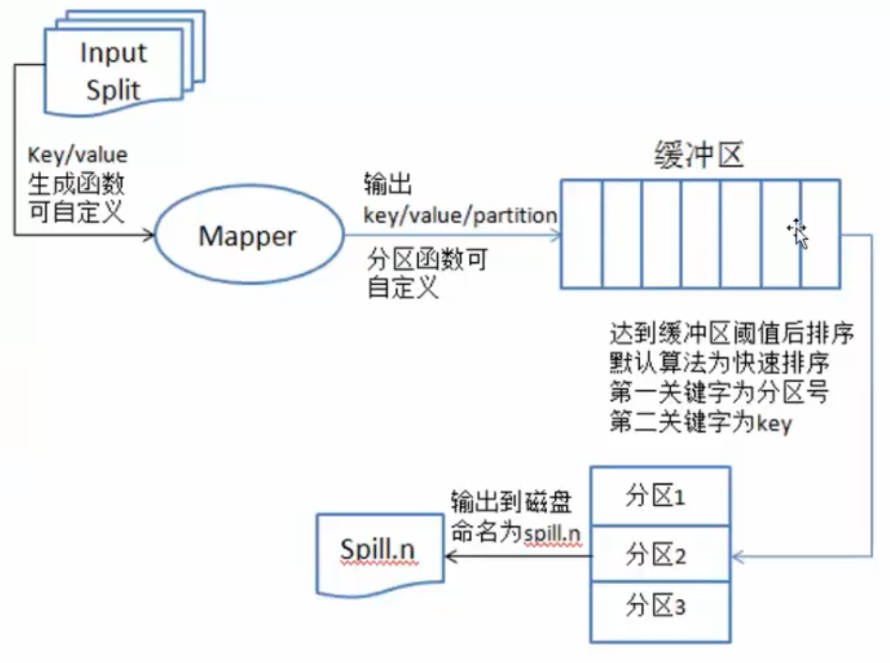
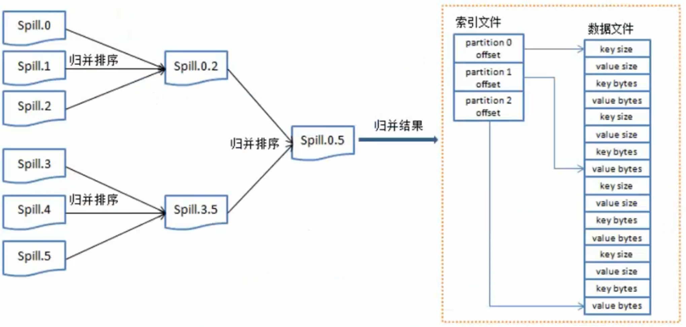
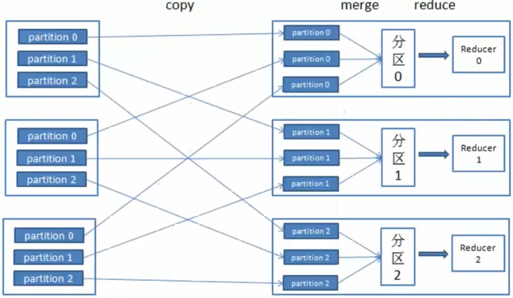
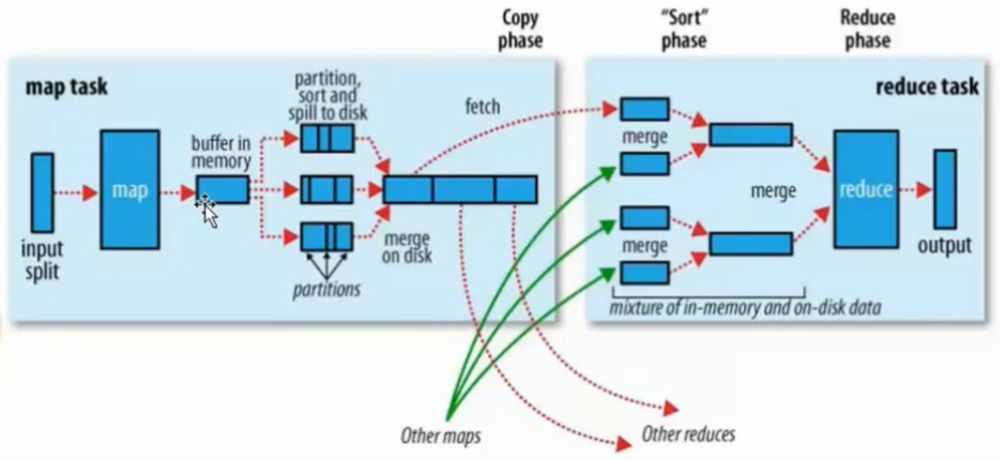
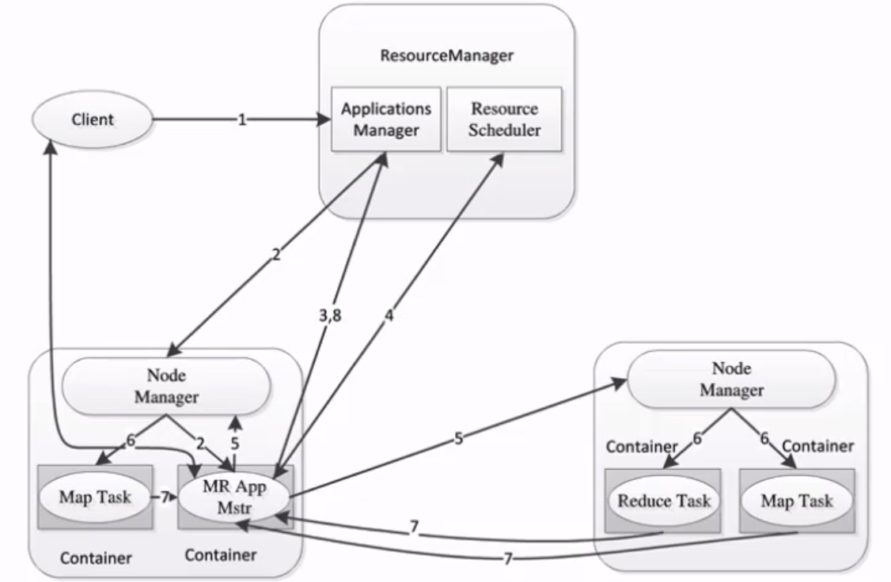
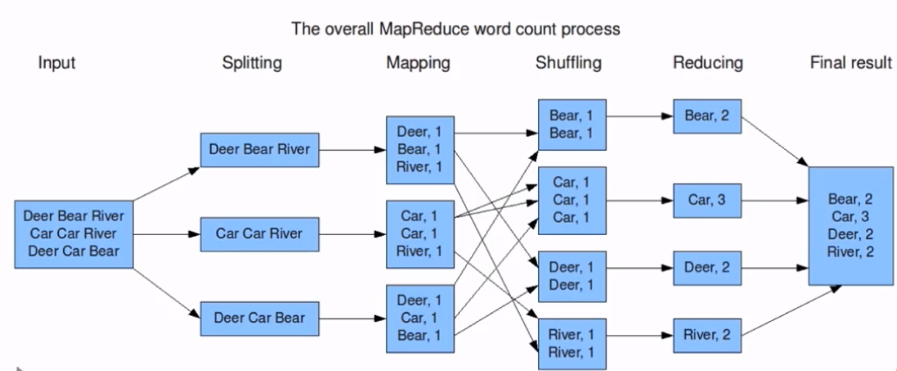

# Hadoop

## 概述

Apache™ Hadoop®  是一个开源的, **可靠的**(reliable), **可扩展**的(scalable)**分布式计算框架**

特点
```
- 允许使用简单的编程模型跨计算机集群分布式处理大型数据集
- 可扩展: 从单个服务器扩展到数千台计算机，每台计算机都提供本地计算和存储
- 可靠的: 不依靠硬件来提供高可用性(high-availability)，而是在应用层检测和处理故障，从而在计算机集群之上提供高可用服务
```

使用场景
```
- 搭建大型数据仓库
- PB级数据的存储、处理、分析、统计等业务
    - 搜索引擎
    - 日志分析
    - 数据挖掘
    - 商业智能
```

优势

```
- 高可靠
    - 数据存储: 数据块多副本
    - 数据计算: 某个节点崩溃, 会自动重新调度作业计算
- 高扩展性
    - 存储/计算资源不够时，可以横向的线性扩展机器
    - 一个集群中可以包含数以千计的节点
    - 集群可以使用廉价机器，成本低
- Hadoop生态系统成熟
```

## 安装部署

- 下载

下载jdk 和 hadoop 放到 ~/software目录下 然后解压到 ~/app目录下

```shell
tar -zxvf 压缩包名字 -C ~/app/

# 配置文件
core-site.xml  	# 指定hdfs的访问方式
hdfs-site.xml  	# 指定namenode 和 datanode 的数据存储位置
mapred-site.xml # 配置mapreduce
yarn-site.xml  	# 配置yarn
```

- 配置

环境变量

```shell
vi ~/.bash_profile
export JAVA_HOME=/home/hadoop/app/jdk1.8.0_91
export PATH=$JAVA_HOME/bin:$PATH
export HADOOP_HOME=/home/hadoop/app/hadoop......
export PATH=$HADOOP_HOME/bin:$PATH

#保存退出后
source ~/.bash_profile
```

修改配置文件

```shell
# 1.修改hadoop-env.sh
cd etc/hadoop
vi hadoop-env.sh
#找到下面内容添加java home
export_JAVA_HOME=/home/hadoop/app/jdk1.8.0_91

# 2.修改core-site.xml 在 <configuration>节点中添加
<property>
  <name>fs.default.name</name>
  <value>hdfs://hadoop000:8020</value>
</property>

# 3.修改hdfs-site.xml 在 configuration节点中添加
<property>
    <name>dfs.namenode.name.dir</name>
    <value>/home/hadoop/app/tmp/dfs/name</value>
</property>
<property>
    <name>dfs.datanode.data.dir</name>
    <value>/home/hadoop/app/tmp/dfs/data</value>
</property>
<property>
    <name>dfs.replication</name>
    <value>1</value>
</property>

# 4.修改 mapred-site.xml在configuration节点中添加
# 默认没有这个 从模板文件复制 
cp mapred-site.xml.template mapred-site.xml  
# 修改
<property>
    <name>mapreduce.framework.name</name>
    <value>yarn</value>
</property>

# 5.修改yarn-site.xml的configuration节点中添加
<property>
    <name>yarn.nodemanager.aux-services</name>
    <value>mapreduce_shuffle</value>
</property>

# 6.来到hadoop的bin目录格式化
./hadoop namenode -format (这个命令只运行一次)
```

- 启动

```shell
# 启动hdfs,yarn
sbin/start-dfs.sh
sbin/start-yarn.sh

# 停止hdfs,yarn
sbin/stop-dfs.sh
sbin/stop-yarn.sh
```

- 验证

```shell
jps
```

## 核心组件

- **Hadoop Common**: The common utilities that support the other Hadoop modules.

hadoop的通用组件

包含了其他hadoop模块要用到的库文件和工具

- **Hadoop Distributed File System (HDFS™)**: A distributed file system that provides high-throughput access to application data.

分布式文件系统

运行于通用硬件上的分布式文件系统，高吞吐，高可靠

源自于Google的GFS论文, 论文发表于2003年10月，HDFS是GFS的开源实现，HDFS的特点:扩展性&容错性&海量数量存储，将文件切分成指定大小的数据块, 并在多台机器上保存多个副本，数据切分、多副本、容错等操作对用户是透明的。

- **Hadoop MapReduce**: A YARN-based system for parallel processing of large data sets.

分布式计算

用于处理超大数据集计算的MapReduce编程模型的实现

源于Google的MapReduce论文，论文发表于2004年12月，MapReduce是GoogleMapReduce的开源实现，MapReduce特点:扩展性&容错性&海量数据离线处理。

- **Hadoop YARN**: A framework for job scheduling and cluster resource management.

资源调度系统

用于管理集群中的计算资源并在这些资源上调度用户应用。

YARN特点:扩展性&容错性&多框架资源统一调度

## 发行版本

- Apache Hadoop

```
- 开源社区版
- 最新的Hadoop版本都是从Apache Hadoop发布的
- 涉及的组件Hadoop Hive Flume可能存在版本不兼容的问题
```

- CDH:[Cloudera Distributed Hadoop](http://archive.cloudera.com/cdh5/cdh/5/)

```
- Cloudera 在社区版的基础上做了一些修改
- hadoop-2.6.0-cdh-5.7.0 和 Flume*****-cdh5.7.0 cdh版本一致 的各个组件配合是有不会有兼容性问题
- CDH版本的这些组件 没有全部开源
- 新版更新版本比社区版慢
```

- HDP: Hortonworks Data Platform

## 关联项目

1. Apache Ambari是一种基于Web的工具，支持Apache Hadoop集群的供应、管理和监控。Apache Ambari 支持HDFS、MapReduce、Hive、Pig、Hbase、Zookeepr、Sqoop和Hcatalog等的集中管理。也是5个顶级hadoop管理工具之一。
2. Avro™:数据序列化系统
3. Cassandra是一套开源分布式NoSQL数据库系统。它最初由Facebook开发，用于储存收件箱等简单格式数据，集GoogleBigTable的数据模型与Amazon Dynamo的完全分布式的架构于一身，Facebook于2008将 Cassandra 开源。
4. chukwa 是一个开源的用于监控大型分布式系统的数据收集系统。这是构建在 hadoop 的 HDFS 和MapReduce框架之上的，继承了 hadoop 的可伸缩性和健壮性。Chukwa 还包含了一个强大和灵活的工具集，可用于展示、监控和分析已收集的数据。
5. hive是基于Hadoop的一个数据仓库工具，可以将结构化的数据文件映射为一张数据库表，并提供简单的sql查询功能，可以将sql语句转换为MapReduce任务进行运行。
6. Mahout 提供一些可扩展的机器学习领域经典算法的实现，旨在帮助开发人员更加方便快捷地创建智能应用程序。Mahout包含许多实现，包括聚类、分类、推荐过滤、频繁子项挖掘。此外，通过使用 Apache Hadoop 库，Mahout 可以有效地扩展到云中。
7. Apache Pig 是一个高级过程语言，适合于使用 Hadoop 和 MapReduce 平台来查询大型半结构化数据集。通过允许对分布式数据集进行类似 SQL 的查询，Pig 可以简化 Hadoop 的使用。
8. Apache Spark 是专为大规模数据处理而设计的快速通用的计算引擎。Spark是UC Berkeley AMP lab开源的类Hadoop MapReduce的通用并行框架，拥有MapReduce所具有的优点；但是Job中间输出结果可以保存在内存中，从而不再需要读写HDFS，因此Spark能更好地适用于数据挖掘与机器学习等需要迭代的MapReduce的算法。由`spark core, spark sql, spark streaming, spark ML, spark MLlib`组成
9. Tez 是 Apache 最新的支持 DAG 作业的开源计算框架。它允许开发者为最终用户构建性能更快、扩展性更好的应用程序。Hadoop传统上是一个大量数据批处理平台。但是，有很多用例需要近乎实时的查询处理性能。还有一些工作则不太适合MapReduce，例如机器学习。Tez的目的就是帮助Hadoop处理这些用例场景。
10. ZooKeeper是一个分布式的，开放源码的分布式应用程序协调服务，是Google的Chubby一个开源的实现，是Hadoop和Hbase的重要组件。它是一个为分布式应用提供一致性服务的软件，提供的功能包括：配置维护、域名服务、分布式同步、组服务等。
11. HBase是一个分布式的、高可靠性、高性能、面向列、可伸缩的分布式存储系统，该技术来源于Fay Chang所撰写的Google论文“Bigtable：一个结构化数据的分布式存储系统”。就像Bigtable利用了Google文件系统（File System）所提供的分布式数据存储一样，HBase在Hadoop之上提供了类似于Bigtable的能力。
12. Flume:日志收集框架
13. Sqoop:数据交换框架，例如：关系型数据库与HDFS之间的数据交换
14. Kafka: 消息队列
15. Storm: 分布式的流式计算框架，不适合python操作storm 
16. Flink: 分布式的流式计算框架

## 大数据与互联网

分布式系统执行任务瓶颈: 延迟高 MapReduce 几分钟 Spark几秒钟

**互联网产品要求**：1.毫秒级响应(1秒以内完成)，2.需要通过大数据实现 统计分析 数据挖掘 关联推荐 用户画像

**大数据平台**：整合网站应用和大数据系统之间的差异, 将应用产生的数据导入到大数据系统, 经过处理计算后再导出给应用程序使用

**互联网大数据平台架构**


数据采集

```
- App/Web 产生的数据&日志同步到大数据系统
- 数据库同步:Sqoop 日志同步:Flume 打点: Kafka
- 不同数据源产生的数据质量可能差别很大
    - 数据库 也许可以直接用
    - 日志 爬虫 大量的清洗,转化处理 
```

数据处理

```
- 大数据存储与计算的核心
- 数据同步后导入HDFS
- MapReduce Hive Spark 读取数据进行计算 结果再保存到HDFS
- MapReduce Hive Spark 离线计算, HDFS 离线存储
    - 离线计算通常针对(某一类别)全体数据, 比如 历史上所有订单
    - 离线计算特点: 数据规模大, 运行时间长
- 流式计算
    - 淘宝双11 每秒产生订单数 监控宣传
    - Storm(毫秒) SparkStreaming(秒)
```

数据输出与展示

```
- HDFS需要把数据导出交给应用程序, 让用户实时展示  ECharts
    - 淘宝卖家量子魔方
- 给运营和决策层提供各种统计报告, 数据需要写入数据库
    - 很多运营管理人员, 上班后就会登陆后台数据系统
```

任务调度系统

```
将上面三个部分整合起来
```


## HDFS

### shell

[参考文档](http://hadoop.apache.org/docs/r1.0.4/cn/hdfs_shell.html)

调用文件系统(FS)Shell命令应使用 `bin/hadoop fs <args>`的形式

```shell
hadoop fs -ls <args>  
# 如果是文件，则按照如下格式返回文件信息：文件名 <副本数> 文件大小 修改日期 修改时间 权限 用户ID 组ID 
# 如果是目录，则返回它直接子文件的一个列表，就像在Unix中一样。目录返回列表的信息如下：目录名 <dir> 修改日期 修改时间 权限 用户ID 组ID 

hadoop fs -text <src> 
# 将源文件输出为文本格式。允许的格式是zip和TextRecordInputStream。

hadoop fs -cat <src>
# 查看源文件内容

hadoop fs -mv URI [URI …] <dest>
# 将文件从源路径移动到目标路径。这个命令允许有多个源路径，此时目标路径必须是一个目录。不允许在不同的文件系统间移动文件。 

hadoop fs -put <localsrc> ... <dst>
# 从本地文件系统中复制单个或多个源路径到目标文件系统。也支持从标准输入中读取输入写入目标文件系统。

hadoop fs -rm URI [URI …]
# 删除指定的文件。只删除非空目录和文件。请参考rmr命令了解递归删除。
```

### 设计思路

- 分布式文件系统的设计思路

    


- HDFS的设计目标
    - 适合运行在通用硬件(commodity hardware)上的分布式文件系统
    - 高度容错性的系统，适合部署在廉价的机器上
    - HDFS能提供高吞吐量的数据访问，非常适合大规模数据集上的应用
    - 容易扩展，为用户提供性能不错的文件存储服务

### 架构


- 1个NameNode/NN(Master)  带 DataNode/DN(Slaves) (Master-Slave结构)
- 1个文件会被拆分成多个Block
- NameNode(NN)
    - 负责客户端请求的响应
    - 负责元数据（文件的名称、副本系数、Block存放的DN）的管理
        - 元数据 MetaData 描述数据的数据
    - 监控DataNode健康状况 10分钟没有收到DataNode报告认为Datanode死掉了
- DataNode(DN)
    - 存储用户的文件对应的数据块(Block)
    - 要定期向NN发送心跳信息，汇报本身及其所有的block信息，健康状况
- 分布式集群NameNode和DataNode部署在不同机器上

- HDFS优缺点
    - 优点
        - 数据冗余 硬件容错
        - 适合存储大文件
        - 处理流式数据
        - 可构建在廉价机器上
    - 缺点
        - 不能用于低延迟的数据访问
        - 不适用于小文件存储

### 执行流程

1. 客户端向NameNode发出写文件请求。

2. 检查是否已存在文件、检查权限。若通过检查，直接先将操作写入EditLog，并返回输出流对象。 
    （注：WAL，write ahead log，先写Log，再写内存，因为EditLog记录的是最新的HDFS客户端执行所有的写操作。如果后续真实写操作失败了，由于在真实写操作之前，操作就被写入EditLog中了，故EditLog中仍会有记录，我们不用担心后续client读不到相应的数据块，因为在第5步中DataNode收到块后会有一返回确认信息，若没写成功，发送端没收到确认信息，会一直重试，直到成功）

3. client端按128MB的块切分文件。

4. client将NameNode返回的分配的可写的DataNode列表和Data数据一同发送给最近的第一个DataNode节点，此后client端和NameNode分配的多个DataNode构成pipeline管道，client端向输出流对象中写数据。client每向第一个DataNode写入一个packet，这个packet便会直接在pipeline里传给第二个、第三个…DataNode。 
    （注：并不是写好一个块或一整个文件后才向后分发）

5. 每个DataNode写完一个块后，会返回确认信息。 
    （注：并不是每写完一个packet后就返回确认信息，个人觉得因为packet中的每个chunk都携带校验信息，没必要每写一个就汇报一下，这样效率太慢。正确的做法是写完一个block块后，对校验信息进行汇总分析，就能得出是否有块写错的情况发生）

6. 写完数据，关闭输输出流。

7. 发送完成信号给NameNode。

（注：发送完成信号的时机取决于集群是强一致性还是最终一致性，强一致性则需要所有DataNode写完后才向NameNode汇报。最终一致性则其中任意一个DataNode写完后就能单独向NameNode汇报，HDFS一般情况下都是强调强一致性） 

### 高可用保证

数据存储故障容错
```
- 磁盘介质在存储过程中受环境或者老化影响,数据可能错乱
- 对于存储在 DataNode 上的数据块，计算并存储校验和（CheckSum)
- 读取数据的时候, 重新计算读取出来的数据校验和, 校验不正确抛出异常, 从其它
```
DataNode上读取备份数据
```
- 磁盘故障容错
    - DataNode 监测到本机的某块磁盘损坏
    - 将该块磁盘上存储的所有 BlockID 报告给 NameNode
    - NameNode 检查这些数据块在哪些DataNode上有备份,
    - 通知相应DataNode, 将数据复制到其他服务器上
- DataNode故障容错
    - 通过心跳和NameNode保持通讯
    - 超时未发送心跳, NameNode会认为这个DataNode已经宕机
    - NameNode查找这个DataNode上有哪些数据块, 以及这些数据在其它DataNode服务器上的存储情况
    - 从其它DataNode服务器上复制数据
```
NameNode故障容错
```
- 主从热备，必须通过zookeeper（secondary namenode来处理namenode数据的备份）
- zookeeper配合 master节点选举，负责数据一致性保证
```


## YARN

Yet Another Resource Negotiator, 另一种资源协调者

通用资源管理系统，为上层应用提供统一的资源管理和调度，为集群在利用率、资源统一管理和数据共享等方面带来了巨大好处

### 架构



- ResourceManager: RM 资源管理器
    ​	整个集群同一时间提供服务的RM只有一个，负责集群资源的统一管理和调度
    ​	处理客户端的请求： submit, kill
    ​	监控我们的NM，一旦某个NM挂了，那么该NM上运行的任务需要告诉我们的AM来如何进行处理
- NodeManager: NM 节点管理器
    ​	整个集群中有多个，负责自己本身节点资源管理和使用
    ​	定时向RM汇报本节点的资源使用情况
    ​	接收并处理来自RM的各种命令：启动Container
    ​	处理来自AM的命令
- ApplicationMaster: AM
    ​	每个应用程序对应一个：MR、Spark，负责应用程序的管理
    ​	为应用程序向RM申请资源（core、memory），分配给内部task
    ​	需要与NM通信：启动/停止task，task是运行在container里面，AM也是运行在container里面
- Container 容器: 封装了CPU、Memory等资源的一个容器,是一个任务运行环境的抽象
- Client: 提交作业 查询作业的运行进度,杀死作业

### 执行流程

1，Client提交作业请求

2，ResourceManager 进程和 NodeManager 进程通信，根据集群资源，为用户程序分配第一个Container(容器)，并将 ApplicationMaster 分发到这个容器上面

3，在启动的Container中创建ApplicationMaster

4，ApplicationMaster启动后向ResourceManager注册进程,申请资源

5，ApplicationMaster申请到资源后，向对应的NodeManager申请启动Container,将要执行的程序分发到NodeManager上

6，Container启动后，执行对应的任务

7，Tast执行完毕之后，向ApplicationMaster返回结果

8，ApplicationMaster向ResourceManager 请求kill

## MapReduce

源于Google的MapReduce论文(2004年12月)

Hadoop的MapReduce是Google论文的开源实现

MapReduce优点: 海量数据离线处理&易开发

MapReduce缺点: 实时流式计算

### 分治思想

```
- 数钱实例：一堆钞票，各种面值分别是多少
    - 单点策略
        - 一个人数所有的钞票，数出各种面值有多少张
    - 分治策略
        - 每个人分得一堆钞票，数出各种面值有多少张
        - 汇总，每个人负责统计一种面值
    - 解决数据可以切割进行计算的应用
```

### 原理

- 单机程序计算流程

输入数据--->读取数据--->处理数据--->写入数据--->输出数据

- Hadoop计算流程

input data：输入数据

InputFormat：对数据进行切分，格式化处理

map：将前面切分的数据做map处理(将数据进行分类，输出(k,v)键值对数据)

shuffle&sort:将相同的数据放在一起，并对数据进行排序处理

reduce：将map输出的数据进行hash计算，对每个map数据进行统计计算

OutputFormat：格式化输出数据











map：将数据进行处理

buffer in memory：达到80%数据时，将数据锁在内存上，将这部分输出到磁盘上

partitions：在磁盘上有很多"小的数据"，将这些数据进行归并排序。

merge on disk：将所有的"小的数据"进行合并。

reduce：不同的reduce任务，会从map中对应的任务中copy数据

​		在reduce中同样要进行merge操作

### 架构

- MapReduce架构 1.X
    - JobTracker:负责接收客户作业提交，负责任务到作业节点上运行，检查作业的状态
    - TaskTracker：由JobTracker指派任务，定期向JobTracker汇报状态，在每一个工作节点上永远只会有一个TaskTracker


- MapReduce2.X架构

    - ResourceManager：负责资源的管理，负责提交任务到NodeManager所在的节点运行，检查节点的状态
    - NodeManager：由ResourceManager指派任务，定期向ResourceManager汇报状态

    

### 编程模型

MapReduce编程分Map和Reduce阶段
```
- 将作业拆分成Map阶段和Reduce阶段
- Map阶段： Map Tasks 分：把复杂的问题分解为若干"简单的任务"
- Reduce阶段: Reduce Tasks 合：reduce
```
MapReduce编程执行步骤
```
- 准备MapReduce的输入数据
- 准备Mapper数据
- Shuffle
- Reduce处理
- 结果输出
```
用户只需要实现两个函数接口

```python
#  Map(in_key,in_value)
(out_key,intermediate_value) list

# Reduce(out_key,intermediate_value) list
out_value list
```

- 使用`Hadoop Streaming`实现word Count词频统计案例



`Mapper`

```python
# Mapper
import sys

#输入为标准输入stdin
for line in sys.stdin:
    #删除开头和结尾的空行
    line = line.strip()
    #以默认空格分隔单词到words列表
    words = line.split()
    for word in words:
        #输出所有单词，格式为“单词 1”以便作为Reduce的输入
        print("%s %s"%(word,1))
```
`Reducer`
```python
# Reducer
import sys

current_word = None
current_count = 0
word = None

#获取标准输入，即mapper.py的标准输出
for line in sys.stdin:
    #删除开头和结尾的空行
    line = line.strip()

    #解析mapper.py输出作为程序的输入，以tab作为分隔符
    word,count = line.split()

    #转换count从字符型到整型
    try:
        count = int(count)
    except ValueError:
        #count非数字时，忽略此行
        continue

    #要求mapper.py的输出做排序（sort）操作，以便对连续的word做判断
    if current_word == word:
        current_count += count
    else :
        #出现了一个新词
        #输出当前word统计结果到标准输出
        if current_word :
            print('%s\t%s' % (current_word,current_count))
        #开始对新词的统计
        current_count = count
        current_word = word

#输出最后一个word统计
if current_word == word:
    print("%s\t%s"% (current_word,current_count))
```

模拟查看输出

```shell
cat xxx.txt|python3 mapper.py|sort|python3 reducer.py
```

编写`streaming.sh`脚本文件，通过Hadoop Streaming 提交作业到Hadoop集群

```shell
STREAM_JAR_PATH="/root/bigdata/hadoop/share/hadoop/tools/lib/hadoop-streaming-2.9.1.jar"    # hadoop streaming jar包所在位置
INPUT_FILE_PATH_1="/The_Man_of_Property.txt"  #要进行词频统计的文档在hdfs中的路径
OUTPUT_PATH="/output"                         #MR作业后结果的存放路径，执行任务前应不存在

hadoop fs -rm -r -skipTrash $OUTPUT_PATH    # 输出路径如果之前存在 先删掉否则会报错

hadoop jar $STREAM_JAR_PATH \   
		-input $INPUT_FILE_PATH_1 \ # 指定输入文件位置
		-output $OUTPUT_PATH \      #指定输出结果位置
		-mapper "python map.py" \   #指定mapper执行的程序
		-reducer "python red.py" \  # 指定reduce阶段执行的程序
		-file ./mapper.py \            # 通过-file 把python源文件分发到集群的每一台机器上  
		-file ./reducer.py
```

执行脚本文件

```shell
./streaming.sh
```

查看执行结果

```shell
hadoop fs -ls /output
hadoop fs -cat /output/part-0000
```

### python交互

使用python开发在Hadoop上运行的程序, mrjob是最简单的方式

mrjob程序可以在本地测试运行也可以部署到Hadoop集群上运行

如果不想成为hadoop专家, 但是需要利用Hadoop写MapReduce代码,mrJob是很好的选择

- 安装

```
pip install mrjob
```

- mrjob实现WordCount

编写python代码`mr_word_count.py`

```python
from mrjob.job import MRJob

# 创建一个类继承MRJob
class MRWordFrequencyCount(MRJob):
	# 重写mapper，reducer方法
    def mapper(self, _, line):
        yield "chars", len(line)
        yield "words", len(line.split())
        yield "lines", 1

    def reducer(self, key, values):
        yield key, sum(values)


if __name__ == '__main__':
    # 调用MRJob.run()方法开启整个流程
    MRWordFrequencyCount.run()
```

执行代码

```shell
python mr_word_count.py myfile.txt
```

- 运行MRJOB的不同方式

1、内嵌方式`-r inline`

特点是调试方便，启动单一进程模拟任务执行状态和结果，默认(-r inline)可以省略，输出文件使用 `> output-file `或`-o output-file`
```shell
# 比如下面两种运行方式是等价的
python word_count.py -r inline input.txt > output.txt
python word_count.py input.txt > output.txt
```
2、本地方式`-r local`

用于本地模拟Hadoop调试，与内嵌(inline)方式的区别是启动了多进程执行每一个任务。
```shell
python word_count.py -r local input.txt > output1.txt
```
3、Hadoop方式`-r hadoop`

用于hadoop环境，支持Hadoop运行调度控制参数，如：
```shell
python word_count.py -r hadoop hdfs:///test.txt -o  hdfs:///output

# 1)指定Hadoop任务调度优先级(VERY_HIGH|HIGH)
--jobconf mapreduce.job.priority=VERY_HIGH。

# 2)Map及Reduce任务个数限制
--jobconf mapreduce.map.tasks=2  --jobconf mapreduce.reduce.tasks=5

# 3)虚拟环境下python环境需要指定python位置
--python-bin /miniconda2/envs/py36/bin/python
```

- mrjob实现topN统计

```python
import sys
from mrjob.job import MRJob,MRStep
import heapq

class TopNWords(MRJob):
    def mapper(self, _, line):
        if line.strip() != "":
            for word in line.strip().split():
                yield word,1

    #介于mapper和reducer之间，用于临时的将mapper输出的数据进行统计
    def combiner(self, word, counts):
        yield word,sum(counts)

    def reducer_sum(self, word, counts):
        yield None,(sum(counts),word)

    #利用heapq将数据进行排序，将最大的2个取出
    def top_n_reducer(self,_,word_cnts):
        for cnt,word in heapq.nlargest(2,word_cnts):
            yield word,cnt
    
	#实现steps方法用于指定自定义的mapper，comnbiner和reducer方法
    def steps(self):
        return [
            MRStep(mapper=self.mapper,
                   combiner=self.combiner,
                   reducer=self.reducer_sum),
            MRStep(reducer=self.top_n_reducer)
        ]

def main():
    TopNWords.run()

if __name__=='__main__':
    main()
```

- Mrjob文件合并

两个文件的合并类似数据库中两张表的合并

```
# 两张数据表
uid uname
01 user1 
02 user2
03 user3
uid orderid order_price
01   01     80
01   02     90
02   03    82
02   04    95
```

实现对两个数据表进行join操作，显示效果为每个用户的所有订单信息

```python
# 效果
"01:user1"	"01:80,02:90"
"02:user2"	"03:82,04:95"

# python代码
from mrjob.job import MRJob
import os
import sys
class UserOrderJoin(MRJob):
    SORT_VALUES = True
    # 二次排序参数：http://mrjob.readthedocs.io/en/latest/job.html
    def mapper(self, _, line):
        fields = line.strip().split('\t')
        if len(fields) == 2:
            # user data
            source = 'A'
            user_id = fields[0]
            user_name = fields[1]
            yield  user_id,[source,user_name] # 01 [A,user1]
        elif len(fields) == 3:
            # order data
            source ='B'
            user_id = fields[0]
            order_id = fields[1]
            price = fields[2]
            yield user_id,[source,order_id,price] #01 ['B',01,80]['B',02,90]
        else :
            pass

    def reducer(self,user_id,values):
        '''
        每个用户的订单列表
        "01:user1"	"01:80,02:90"
        "02:user2"	"03:82,04:95"

        :param user_id:
        :param values:[A,user1]  ['B',01,80]
        :return:
        '''
        values = [v for v in values]
        if len(values)>1 :
            user_name = values[0][1]
            order_info = [':'.join([v[1],v[2]]) for v in values[1:]] #[01:80,02:90]
            yield ':'.join([user_id,user_name]),','.join(order_info)


def main():
    UserOrderJoin.run()

if __name__ == '__main__':
    main()
```

实现对两个数据表进行join操作，显示效果为每个用户所下订单的订单总量和累计消费金额

```python
# 效果
"01:user1"	[2, 170]
"02:user2"	[2, 177]

# python代码
from mrjob.job import MRJob
import os
import sys
class UserOrderJoin(MRJob):
    # 二次排序参数：http://mrjob.readthedocs.io/en/latest/job.html
    SORT_VALUES = True

    def mapper(self, _, line):
        fields = line.strip().split('\t')
        if len(fields) == 2:
            # user data
            source = 'A'
            user_id = fields[0]
            user_name = fields[1]
            yield  user_id,[source,user_name]
        elif len(fields) == 3:
            # order data
            source ='B'
            user_id = fields[0]
            order_id = fields[1]
            price = fields[2]
            yield user_id,[source,order_id,price]
        else :
            pass


    def reducer(self,user_id,values):
        '''
        统计每个用户的订单数量和累计消费金额
        :param user_id:
        :param values:
        :return:
        '''
        values = [v for v in values]
        user_name = None
        order_cnt = 0
        order_sum = 0
        if len(values)>1:
            for v in values:
                if len(v) ==  2 :
                    user_name = v[1]
                elif len(v) == 3:
                    order_cnt += 1
                    order_sum += int(v[2])
            yield ":".join([user_id,user_name]),(order_cnt,order_sum)


def main():
    UserOrderJoin().run()

if __name__ == '__main__':
    main()	
```

