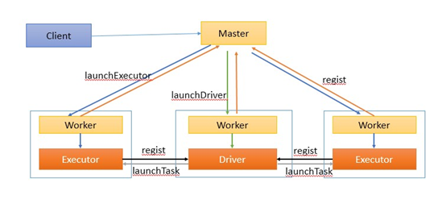
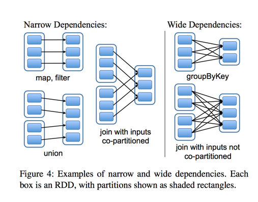
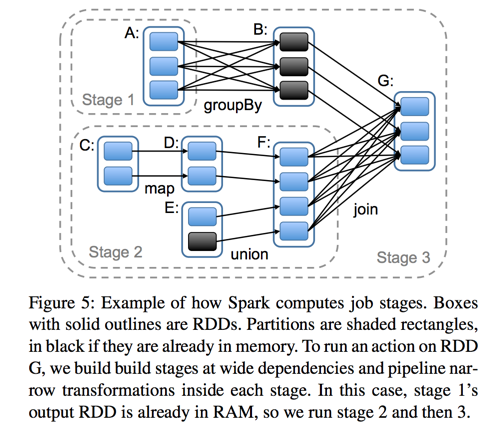
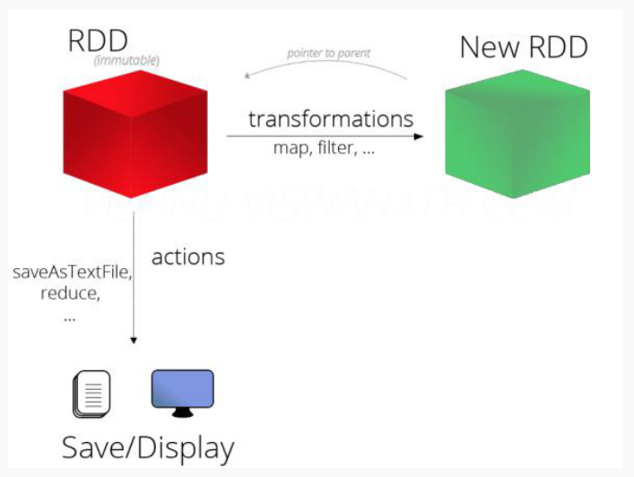
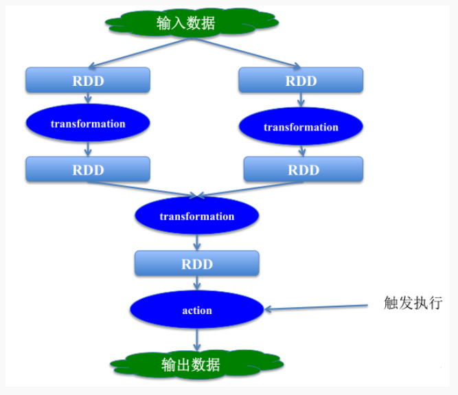

# spark-core

## 概述

基于内存的计算引擎，它的计算速度非常快。但是仅仅只涉及到数据的计算，并没有涉及到数据的存储。

- 产生背景

MapReduce框架局限性
```
- Map结果写磁盘，Reduce写HDFS，多个MR之间通过HDFS交换数据
- 任务调度和启动开销大
- 无法充分利用内存
- 不适合迭代计算（如机器学习、图计算等等），交互式处理（数据挖掘）
- 不适合流式处理（点击日志分析）
- MapReduce编程不够灵活，仅支持Map和Reduce两种操作
```

Hadoop生态圈
```
- 批处理：MapReduce、Hive、Pig
- 流式计算：Storm
- 交互式计算：Impala、presto
```
- 特点

优点

```
1、速度快（比mapreduce在内存中快100倍，在磁盘中快10倍）
- spark中的job中间结果可以不落地，可以存放在内存中。
- mapreduce中map和reduce任务都是以进程的方式运行着，而spark中的job是以线程方式运行在进程中。
2、易用性（可以通过java/scala/python/R开发spark应用程序）
3、通用性（可以使用spark sql/spark streaming/mlib/Graphx）
4、兼容性（spark程序可以运行在standalone/yarn/mesos）
```

缺点

```
吃内存，不太稳定
```

spark生态

```
离线计算：spark core, spark sql
实时/流式计算：spark streaming
交互式计算：spark sql dataframe
机器学习：spark ML
```


## 安装部署

- 下载/编译

低版本存在已经编译好的版本，就直接下载spark[安装包](http://spark.apache.org/downloads.html)

高版本不存在cdh的编译版本，可以从官网下载源码版本，指定高版本hadoop进行编译

编译步骤：

1，安装java(JDK 1.7及以上)

```shell
export JAVA_HOME=/xxx
export JRE_HOME=/xxx
export CLASSPATH=.:$JAVA_HOME/lib/dt.jar:$JAVA_HOME/lib/tools.jar:$JRE_HOME/lib:$CLASSPATH
export PATH=$JAVA_HOME/bin:$PATH
```

2，安装Maven， 版本为3.3.9或者以上

下载地址：https://mirrors.tuna.tsinghua.edu.cn/apache//maven/maven-3/3.3.9/binaries

配置MAVEN_HOME

```shell
export MAVEN_HOME=/xxx
export PATH=$MAVEN_HOME/bin:$PATH
```

3，下载spark源码

4，增加cdh的repository

解压spark的源码包，编辑pom.xml文件， 在repositories节点 加入如下配置：

```xml
<repository>
        <id>cloudera</id>
        <url>https://repository.cloudera.com/artifactory/cloudera-repos/</url></repository>
```

5，编译

设置内存
```shell
export MAVEN_OPTS="-Xmx2g -XX:ReservedCodeCacheSize=512m"
```
开始编译

```shell
./dev/make-distribution.sh --name 2.6.0-cdh5.7.0 --tgz  -Pyarn -Phadoop-2.6 -Phive -Phive-thriftserver -Dhadoop.version=2.6.0-cdh5.7.0 -DskipTests clean package
```

源码编译后，bin目录下的文件可能不存在可执行权限，需要通过chmod指令添加可执行权限
```shell
chmod +x xxx
```
- 规划spark安装目录，解压安装包重命名安装目录

- 修改配置

环境变量

```shell
export SPARK_HOME=/xxx/spark2.x
export PATH=\$PATH:\$SPARK_HOME/bin
```
配置文件
```shell
#  spark-env.sh(需要将spark-env.sh.template重命名)
cp spark-env.sh.template spark-env.sh
vi spark-env.sh
# 添加配置信息
export JAVA_HOME=java_home_path  #  配置java环境变量
export PYSPARK_PYTHON=/xx/pythonx_home/bin/pythonx  # 配置PYTHON环境
export SPARK_MASTER_HOST=node-teach  # 配置master的地址
export SPARK_MASTER_PORT=7077  # 配置master的端口
```

- 启动spatk集群（standalone）

启动服务

```shell
# 进入到$SPARK_HOME/sbin目录
cd xxx
# 启动Master	
./start-master.sh -h 192.168.199.188
# 启动Slave
 ./start-slave.sh spark://192.168.199.188:7077
```

jps查看进程

```shell
jps
"""
27073 Master
27151 Worker
"""
```

- 关闭防火墙

```shell
systemctl stop firewalld
```

- 通过SPARK WEB UI查看Spark集群及Spark
    - http://192.168.199.188:8080/  监控Spark集群
    - http://192.168.199.188:4040/  监控Spark Job

## 相关概念

- spark集群架构(Standalone模式)

    

    - Application

        用户自己写的Spark应用程序，批处理作业的集合。Application的main方法为应用程序的入口，用户通过Spark的API，定义了RDD和对RDD的操作。

    - Master和Worker

        整个集群分为 Master 节点和 Worker 节点，相当于 Hadoop 的 Master 和 Slave 节点。

        - Master：Standalone模式中主控节点，负责接收Client提交的作业，管理Worker，并命令Worker启动Driver和Executor。
        - Worker：Standalone模式中slave节点上的守护进程，负责管理本节点的资源，定期向Master汇报心跳，接收Master的命令，启动Driver和Executor。

    - Client：客户端进程，负责提交作业到Master。

    - Driver： 一个Spark作业运行时包括一个Driver进程，也是作业的主进程，负责作业的解析、生成Stage并调度Task到Executor上。包括DAGScheduler，TaskScheduler。

    - Executor：即真正执行作业的地方，一个集群一般包含多个Executor，每个Executor接收Driver的命令Launch Task，一个Executor可以执行一到多个Task。

- Spark作业相关概念

    - Stage：一个Spark作业一般包含一到多个Stage。

    - Task：一个Stage包含一到多个Task，通过多个Task实现并行运行的功能。

    - DAGScheduler： 实现将Spark作业分解成一到多个Stage，每个Stage根据RDD的Partition个数决定Task的个数，然后生成相应的Task set放到TaskScheduler中。

    - TaskScheduler：实现Task分配到Executor上执行。

        



## RDD

### 概述

RDD（Resilient Distributed Dataset）叫做弹性分布式数据集，是Spark中最基本的数据抽象，它代表一个不可变、可分区、里面的元素可并行计算的集合
```
- Dataset:一个数据集，简单的理解为集合，用于存放数据的
- Distributed：它的数据是分布式存储，并且可以做分布式的计算
- Resilient：弹性的
	- 它表示的是数据可以保存在磁盘，也可以保存在内存中
	- 数据分布式也是弹性的
	- 弹性:并不是指他可以动态扩展，而是容错机制。
    	- RDD会在多个节点上存储，就和hdfs的分布式道理是一样的。hdfs文件被切分为多个block存储在各个节点上，而RDD是被切分为多个partition。不同的partition可能在不同的节点上
    	- spark读取hdfs的场景下，spark把hdfs的block读到内存就会抽象为spark的partition。
   	 	- spark计算结束，一般会把数据做持久化到hive，hbase，hdfs等等。我们就拿hdfs举例，将RDD持久化到hdfs上，RDD的每个partition就会存成一个文件，如果文件小于128M，就可以理解为一个partition对应hdfs的一个block。反之，如果大于128M，就会被且分为多个block，这样，一个partition就会对应多个block。
```

### 创建

创建sparkContent

```python
# SparkContext代表了和Spark集群的链接, 在Spark集群中通过SparkContext来创建RDD
# SparkConf创建SparkContext的时候需要一个SparkConf， 用来传递Spark应用的基本信息
conf = SparkConf().setAppName(appName).setMaster(master)
sc = SparkContext(conf=conf)
```

进入pyspark环境

```shell
pyspark
```

可以在spark UI中看到当前的Spark作业 在浏览器访问当前centos的4040端口

- 不同方式创建RDD

通过内存中的数据创建RDD

```python
# 调用SparkContext的parallelize方法并且传入已有的可迭代对象或者集合
data = [1, 2, 3, 4, 5]
distData = sc.parallelize(data)

# 在通过parallelize方法创建RDD 的时候可以指定分区数量
distData = sc.parallelize(data, 5)
distData.reduce(lambda a, b: a + b)

# Spark将为群集的每个分区（partition）运行一个任务（task）。 通常，可以根据CPU核心数量指定分区数量（每个CPU有2-4个分区）如未指定分区数量，Spark会自动设置分区数。
```

通过外部数据创建RDD

```python
# PySpark可以从Hadoop支持的任何存储源创建RDD，包括本地文件系统，HDFS，Cassandra，HBase，Amazon S3等,支持整个目录、多文件、通配符,支持压缩文件
rdd1 = sc.textFile('file:///home/hadoop/tmp/word.txt')
rdd1.collect()
```

### 常用操作





#### trans

- 概述

从一个已经存在的数据集创建一个新的数据集

比如， map就是一个transformation 操作，把数据集中的每一个元素传给一个函数并**返回一个新的RDD**，代表transformation操作的结果

```
rdd a ----->transformation ----> rdd b
```

所有的transformation操作都是惰性的（lazy）
```
- 不会立即计算结果
- 只记下应用于数据集的transformation操作
- 只有调用action一类的操作之后才会计算所有transformation
- 这种设计使Spark运行效率更高
- 例如map reduce 操作，map创建的数据集将用于reduce，map阶段的结果不会返回，仅会返回reduce结果。
```

- `map`


`map(func)`将func函数作用到数据集的每一个元素上，生成一个新的RDD返回

``` python
rdd1 = sc.parallelize([1,2,3,4,5,6,7,8,9],3)
rdd2 = rdd1.map(lambda x: x+1)
rdd2.collect()
"""
[2, 3, 4, 5, 6, 7, 8, 9, 10]
"""

rdd1 = sc.parallelize([1,2,3,4,5,6,7,8,9],3)
def add(x):
    return x+1
rdd2 = rdd1.map(add)
rdd2.collect()
"""
[2, 3, 4, 5, 6, 7, 8, 9, 10]
"""
```

- `mapPartitions`

类似`map`，但是`map`是一条一条传给里面函数的，`mapPartitions`数据是一部分一部分传给函数的

应用场景：数据处理的时候，需要连接其他资源，如果一条一条处理，会处理一条连一次，一份一份处理可以多条数据连接一次其他资源，可以提高效率

- `filter`

`filter(func)`选出所有func返回值为true的元素，生成一个新的RDD返回

```python
rdd1 = sc.parallelize([1,2,3,4,5,6,7,8,9],3)
rdd2 = rdd1.map(lambda x:x*2)
rdd3 = rdd2.filter(lambda x:x>4)
rdd3.collect()
"""
[6, 8, 10, 12, 14, 16, 18]
"""
```

- flatmap


flatMap会先执行map的操作，再将所有对象合并为一个对象

```python
rdd1 = sc.parallelize(["a b c","d e f","h i j"])
rdd2 = rdd1.flatMap(lambda x:x.split(" "))
rdd2.collect()
"""
['a', 'b', 'c', 'd', 'e', 'f', 'h', 'i', 'j']
"""

# flatMap和map的区别：flatMap在map的基础上将结果合并到一个list中
rdd1 = sc.parallelize(["a b c","d e f","h i j"])
rdd2 = rdd1.map(lambda x:x.split(" "))
rdd2.collect()
"""
[['a', 'b', 'c'], ['d', 'e', 'f'], ['h', 'i', 'j']]
"""
```

- union


对两个RDD求并集

```python
rdd1 = sc.parallelize([("a",1),("b",2)])
rdd2 = sc.parallelize([("c",1),("b",3)])
rdd3 = rdd1.union(rdd2)
rdd3.collect()
"""
[('a', 1), ('b', 2), ('c', 1), ('b', 3)]
"""
```

- intersection


对两个RDD求交集

```python
rdd1 = sc.parallelize([("a",1),("b",2)])
rdd2 = sc.parallelize([("c",1),("b",3)])
rdd3 = rdd1.union(rdd2)
rdd4 = rdd3.intersection(rdd2)
rdd4.collect()
"""
[('c', 1), ('b', 3)]
"""
```

- groupByKey


以元组中的第0个元素作为key，进行分组，返回一个新的RDD

```python
rdd1 = sc.parallelize([("a",1),("b",2)])
rdd2 = sc.parallelize([("c",1),("b",3)])
rdd3 = rdd1.union(rdd2)
rdd4 = rdd3.groupByKey()
rdd4.collect()
"""
[('a', <pyspark.resultiterable.ResultIterable object at 0x7fba6a5e5898>), ('c', <pyspark.resultiterable.ResultIterable object at 0x7fba6a5e5518>), ('b', <pyspark.resultiterable.ResultIterable object at 0x7fba6a5e5f28>)]
"""

# groupByKey之后的结果中 value是一个Iterable
result = rdd4.collect()
result[2]
"""
('b', <pyspark.resultiterable.ResultIterable object at 0x7fba6c18e518>)
"""
result[2][1]
"""
<pyspark.resultiterable.ResultIterable object at 0x7fba6c18e518>
"""
list(result[2][1])
"""
[2, 3]
"""
```

- reduceByKey


将key相同的键值对，按照Function进行计算

```python
rdd = sc.parallelize([("a", 1), ("b", 1), ("a", 1)])
rdd.reduceByKey(lambda x,y:x+y).collect()
"""
[('b', 1), ('a', 2)]
"""
```

- sortByKey


`sortByKey(ascending=True, numPartitions=None, keyfunc=<function RDD.<lambda>>)`

按照key进行排序

```python
>>> tmp = [('a', 1), ('b', 2), ('1', 3), ('d', 4), ('2', 5)]
>>> sc.parallelize(tmp).sortByKey().first()
('1', 3)
>>> sc.parallelize(tmp).sortByKey(True, 1).collect()
[('1', 3), ('2', 5), ('a', 1), ('b', 2), ('d', 4)]
>>> sc.parallelize(tmp).sortByKey(True, 2).collect()
[('1', 3), ('2', 5), ('a', 1), ('b', 2), ('d', 4)]
>>> tmp2 = [('Mary', 1), ('had', 2), ('a', 3), ('little', 4), ('lamb', 5)]
>>> tmp2.extend([('whose', 6), ('fleece', 7), ('was', 8), ('white', 9)])
>>> sc.parallelize(tmp2).sortByKey(True, 3, keyfunc=lambda k: k.lower()).collect()
[('a', 3), ('fleece', 7), ('had', 2), ('lamb', 5),...('white', 9), ('whose', 6)]
```

#### action

- 概述

会触发之前rdd的tansformation，获取对数据进行运算操作之后的结果

比如， reduce 就是一个action操作，使用某个函数聚合RDD所有元素的操作，并**返回最终计算结果**

- collect


返回一个list，list中包含 RDD中的所有元素

只有当数据量较小的时候使用Collect 因为所有的结果都会加载到内存中

- reduce


**reduce**将**RDD**中元素两两传递给输入函数，同时产生一个新的值，新产生的值与RDD中下一个元素再被传递给输入函数直到最后只有一个值为止。

```shell
>>> rdd1 = sc.parallelize([1,2,3,4,5])
>>> rdd1.reduce(lambda x,y : x+y)
15
```

- first


返回RDD的第一个元素

```python
>>> sc.parallelize([2, 3, 4]).first()
2
```

- take


`take(num)`返回RDD的前N个元素

``` shell
>>> sc.parallelize([2, 3, 4, 5, 6]).take(2)
[2, 3]
>>> sc.parallelize([2, 3, 4, 5, 6]).take(10)
[2, 3, 4, 5, 6]
>>> sc.parallelize(range(100), 100).filter(lambda x: x > 90).take(3)
[91, 92, 93]
```

- count

返回RDD中元素的个数

```
>>> sc.parallelize([2, 3, 4]).count()
3
```

#### persist

*persist*操作用于将数据缓存 可以缓存在内存中 也可以缓存到磁盘上， 也可以复制到磁盘的其它节点上

### 示例

- wordcount

编写代码

```python
import sys
from pyspark.sql import SparkSession

if __name__ == '__main__':

    if len(sys.argv) != 2:
        print("Usage: avg <input>", file=sys.stderr)
        sys.exit(-1)

    spark = SparkSession.builder.appName("test").getOrCreate()
	sc = spark.sparkContext

    counts = sc.textFile(sys.argv[1]) \
            .flatMap(lambda line: line.split(" ")) \
            .map(lambda x: (x, 1)) \
            .reduceByKey(lambda a, b: a + b)

    output = counts.collect()

    for (word, count) in output:
    	print("%s: %i" % (word, count))

    sc.stop()
```

将代码上传到服务器

在服务器上执行

```shell
spark-submit --master local wc.py file:///root/bigdata/data/spark_test.log
```

- 通过spark实现点击流日志分析

数据示例

```shell
#每条数据代表一次访问记录 包含了ip 访问时间 访问的请求方式 访问的地址...信息
194.237.142.21 - - [18/Sep/2013:06:49:18 +0000] "GET /wp-content/uploads/2013/07/rstudio-git3.png HTTP/1.1" 304 0 "-" "Mozilla/4.0 (compatible;)"
183.49.46.228 - - [18/Sep/2013:06:49:23 +0000] "-" 400 0 "-" "-"
163.177.71.12 - - [18/Sep/2013:06:49:33 +0000] "HEAD / HTTP/1.1" 200 20 "-" "DNSPod-Monitor/1.0"
163.177.71.12 - - [18/Sep/2013:06:49:36 +0000] "HEAD / HTTP/1.1" 200 20 "-" "DNSPod-Monitor/1.0"
101.226.68.137 - - [18/Sep/2013:06:49:42 +0000] "HEAD / HTTP/1.1" 200 20 "-" "DNSPod-Monitor/1.0"
101.226.68.137 - - [18/Sep/2013:06:49:45 +0000] "HEAD / HTTP/1.1" 200 20 "-" "DNSPod-Monitor/1.0"
60.208.6.156 - - [18/Sep/2013:06:49:48 +0000] "GET /wp-content/uploads/2013/07/rcassandra.png HTTP/1.0" 200 185524 "http://cos.name/category/software/packages/" "Mozilla/5.0 (Windows NT 6.1) AppleWebKit/537.36 (KHTML, like Gecko) Chrome/29.0.1547.66 Safari/537.36"
222.68.172.190 - - [18/Sep/2013:06:49:57 +0000] "GET /images/my.jpg HTTP/1.1" 200 19939 "http://www.angularjs.cn/A00n" "Mozilla/5.0 (Windows NT 6.1) AppleWebKit/537.36 (KHTML, like Gecko) Chrome/29.0.1547.66 Safari/537.36"
222.68.172.190 - - [18/Sep/2013:06:50:08 +0000] "-" 400 0 "-" "-"
```

访问的pv：网站的总访问量

```python
from pyspark.sql import SparkSession

spark = SparkSession.builder.appName("pv").getOrCreate()
sc = spark.sparkContext
rdd1 = sc.textFile("file:///root/bigdata/data/access.log")
#把每一行数据记为("pv",1)
rdd2 = rdd1.map(lambda x:("pv",1)).reduceByKey(lambda a,b:a+b)
rdd2.collect()
sc.stop()
```

访问的uv：网站的独立用户访问量

```python
from pyspark.sql import SparkSession

spark = SparkSession.builder.appName("pv").getOrCreate()
sc = spark.sparkContext
rdd1 = sc.textFile("file:///root/bigdata/data/access.log")
#对每一行按照空格拆分，将ip地址取出
rdd2 = rdd1.map(lambda x:x.split(" ")).map(lambda x:x[0])
#把每个ur记为1
rdd3 = rdd2.distinct().map(lambda x:("uv",1))
rdd4 = rdd3.reduceByKey(lambda a,b:a+b)
rdd4.saveAsTextFile("hdfs:///uv/result")
sc.stop()
```

访问的topN

```python
from pyspark.sql import SparkSession

spark = SparkSession.builder.appName("topN").getOrCreate()
sc = spark.sparkContext
rdd1 = sc.textFile("file:///root/bigdata/data/access.log")
#对每一行按照空格拆分，将url数据取出，把每个url记为1
rdd2 = rdd1.map(lambda x:x.split(" ")).filter(lambda x:len(x)>10).map(lambda x:(x[10],1))
#对数据进行累加，按照url出现次数的降序排列
rdd3 = rdd2.reduceByKey(lambda a,b:a+b).sortBy(lambda x:x[1],ascending=False)
#取出序列数据中的前n个
rdd4 = rdd3.take(5)
rdd4.collect()
sc.stop()
```

- ip地址查询

```python
"""
1、 加载城市ip段信息，获取ip起始数字和结束数字，经度，纬度
2、 加载日志数据，获取ip信息，然后转换为数字，和ip段比较
3、 比较的时候采用二分法查找，找到对应的经度和纬度
4，对相同的经度和纬度做累计求和
"""

from pyspark.sql import SparkSession

def ip_transform(ip):  
    """
	255.255.255.255 0~255 256  2^8 8位2进制数
	将ip转换为特殊的数字形式  223.243.0.0|223.243.191.255|  255 2^8
	11011111‬
	00000000
	1101111100000000
	       11110011‬
	11011111111100110000000000000000
	"""
    ips = ip.split(".")#[223,243,0,0] 32位二进制数
    ip_num = 0
    for i in ips:
        ip_num = int(i) | ip_num << 8
    return ip_num


def binary_search(ip_num, broadcast_value):
    """二分法查找ip对应的行的索引"""
    start = 0
    end = len(broadcast_value) - 1
    while (start <= end):
        mid = int((start + end) / 2)
        if ip_num >= int(broadcast_value[mid][0]) and ip_num <= int(broadcast_value[mid][1]):
            return mid
        if ip_num < int(broadcast_value[mid][0]):
            end = mid
        if ip_num > int(broadcast_value[mid][1]):
            start = mid

def main():
    spark = SparkSession.builder.appName("test").getOrCreate()
    sc = spark.sparkContext
    city_id_rdd = sc.textFile("file:///home/hadoop/app/tmp/data/ip.txt").map(lambda x:x.split("|")).map(lambda x: (x[2], x[3], x[13], x[14]))
    # 创建一个广播变量
    """
    - 要统计Ip所对应的经纬度, 每一条数据都会去查询ip表
	- 每一个task 都需要这一个ip表, 默认情况下, 所有task都会去复制ip表
	- 实际上 每一个Worker上会有多个task, 数据也是只需要进行查询操作的, 所以这份数据可以共享,没必要每个task复制一份
	- 可以通过广播变量, 通知当前worker上所有的task, 来共享这个数据,避免数据的多次复制,可以大大降低内存的开销
	- sparkContext.broadcast(要共享的数据)
    """
    city_broadcast = sc.broadcast(city_id_rdd.collect())
    dest_data = sc.textFile("file:///home/hadoop/app/tmp/data/20090121000132.394251.http.format").map(
        lambda x: x.split("|")[1])
    #根据取出对应的位置信息
    def get_pos(x):
        city_broadcast_value = city_broadcast.value
        #根据单个ip获取对应经纬度信息
        def get_result(ip):
            ip_num = ip_transform(ip)
            index = binary_search(ip_num, city_broadcast_value)
            #((纬度,精度),1)
            return ((city_broadcast_value[index][2], city_broadcast_value[index][3]), 1)

        x = map(tuple,[get_result(ip) for ip in x])
        return x

    dest_rdd = dest_data.mapPartitions(lambda x: get_pos(x)) #((纬度,精度),1)
    result_rdd = dest_rdd.reduceByKey(lambda a, b: a + b)
    print(result_rdd.collect())
    sc.stop()

if __name__ == '__main__':
    main()
```

