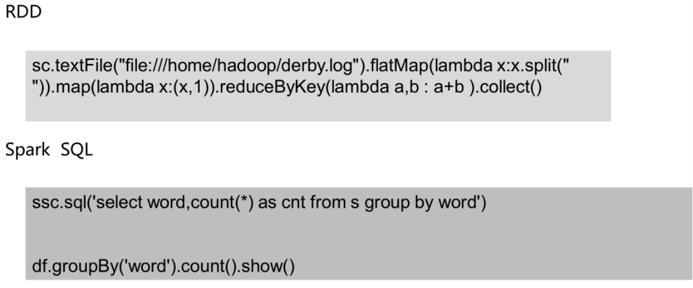
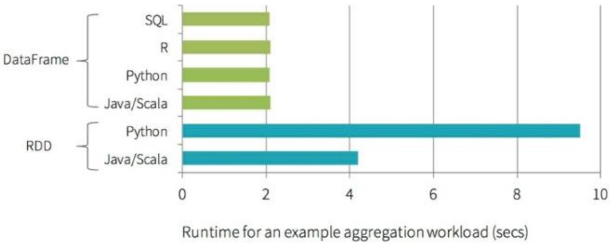
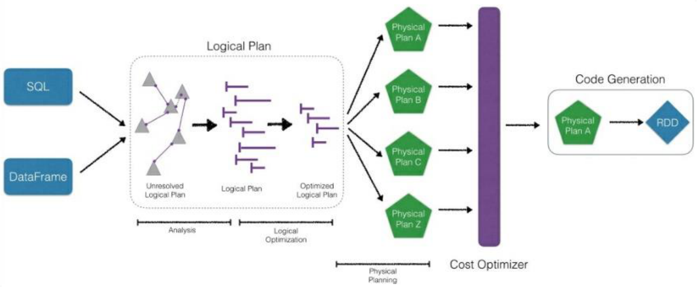

# spark-sql

## 概述

spark-sql是spark中用于处理结构化数据的一个模块

- 特性

```
易整合
统一的数据源访问
兼容hive
提供了标准的数据库连接（jdbc/odbc）
```

- 优势

1. 写更少代码



2. 性能提升高
    

python操作RDD，转换为可执行代码，运行在java虚拟机，涉及两个不同语言引擎之间的切换，进行进程间通信很耗费性能。

DataFrame
```
- 是RDD为基础的分布式数据集，类似于传统关系型数据库的二维表，dataframe记录了对应列的名称和类型
- dataFrame引入schema和off-heap(使用操作系统层面上的内存)
    - 1、解决了RDD的缺点
    - 序列化和反序列化开销大
    - 频繁的创建和销毁对象造成大量的GC
    - 2、丢失了RDD的优点
    - RDD编译时进行类型检查
    - RDD具有面向对象编程的特性
```


用scala/python编写的RDD比Spark SQL编写转换的RDD慢，涉及到执行计划
```
- CatalystOptimizer：Catalyst优化器
- ProjectTungsten：钨丝计划，为了提高RDD的效率而制定的计划
- Code gen：代码生成器
```




直接编写RDD也可以自实现优化代码，但是远不及SparkSQL前面的优化操作后转换的RDD效率高，快1倍左右

优化引擎：类似mysql等关系型数据库基于成本的优化器

首先执行逻辑执行计划，然后转换为物理执行计划(选择成本最小的)，通过Code Generation最终生成为RDD

Language-independent API

用任何语言编写生成的RDD都一样，而使用spark-core编写的RDD，不同的语言生成不同的RDD

Schema

结构化数据，可以直接看出数据的详情

在RDD中无法看出，解释性不强，无法告诉引擎信息，没法详细优化。

## DataFrame

### 概述

在Spark语义中，DataFrame是一个分布式的**行集合**，可以想象为一个关系型数据库的表，或者一个带有列名的Excel表格。

它和RDD一样，有这样一些特点

```
- Immuatable：一旦RDD、DataFrame被创建，就不能更改，只能通过transformation生成新的RDD、DataFrame
- Lazy Evaluations：只有action才会触发Transformation的执行
- Distributed：DataFrame和RDD一样都是分布式的
- dataframe和dataset统一，dataframe只是dataset[ROW]的类型别名。由于Python是弱类型语言，只能使用DataFrame
```
DataFrame vs RDD
```
- RDD：分布式的对象的集合，Spark并不知道对象的详细模式信息
- DataFrame：分布式的Row对象的集合，其提供了由列组成的详细模式信息，使得Spark SQL可以进行某些形式的执行优化。
- DataFrame和普通的RDD的逻辑框架区别如下所示：
			Name Age Height
person		String Int Double

- 左侧的RDD Spark框架本身不了解 Person类的内部结构。
- 右侧的DataFrame提供了详细的结构信息（schema——每列的名称，类型）
- DataFrame还配套了新的操作数据的方法，DataFrame API（如df.select())和SQL(select id, name from xx_table where ...)。
- DataFrame还引入了off-heap,意味着JVM堆以外的内存, 这些内存直接受操作系统管理（而不是JVM）。
- RDD是分布式的Java对象的集合。DataFrame是分布式的Row对象的集合。DataFrame除了提供了比RDD更丰富的算子以外，更重要的特点是提升执行效率、减少数据读取以及执行计划的优化。
- DataFrame的抽象后，我们处理数据更加简单了，甚至可以用SQL来处理数据了
- 通过DataFrame API或SQL处理数据，会自动经过Spark 优化器（Catalyst）的优化，即使你写的程序或SQL不仅高效，也可以运行的很快。
- DataFrame相当于是一个带着schema的RDD
```

Pandas DataFrame vs Spark DataFrame
```
- Cluster Parallel：集群并行执行
- Lazy Evaluations: 只有action才会触发Transformation的执行
- Immutable：不可更改
- Pandas rich API：比Spark SQL api丰富
```

### 创建

基于RDD创建

```python
from pyspark.sql import SparkSession
from pyspark.sql import Row

spark = SparkSession.builder.appName('test').getOrCreate()
sc = spark.sparkContext
# spark.conf.set("spark.sql.shuffle.partitions", 6)
# ================直接创建==========================
l = [('Ankit',25),('Jalfaizy',22),('saurabh',20),('Bala',26)]
rdd = sc.parallelize(l)
#为数据添加列名
people = rdd.map(lambda x: Row(name=x[0], age=int(x[1])))
#创建DataFrame
schemaPeople = spark.createDataFrame(people)
```

基于csv、json、parquet、orc、jdbc

```python
csvDF = spark.read.format("csv").option("header", "true").load("iris.csv")   

jsonDF = spark.read.json("xxx.json")
jsonDF = spark.read.format('json').load('xxx.json')

parquetDF = spark.read.parquet("xxx.parquet")

jdbcDF = spark.read.format("jdbc").option("url","jdbc:mysql://localhost:3306/db_name").option("dbtable","table_name").option("user","xxx").option("password","xxx").load()
```

### Api

从csv中读取数据

```python
# ==================从csv读取======================
#加载csv类型的数据并转换为DataFrame
df = spark.read.format("csv"). \
    option("header", "true") \
    .load("iris.csv")

#显示数据结构
df.printSchema()
#显示前10条数据
df.show(10)
#统计总量
df.count()
#列名
df.columns
```

增加一列

```python
# ===============增加一列(或者替换) withColumn===========
#定义一个新的列，数据为其他某列数据的两倍
#如果操作的是原有列，可以替换原有列的数据
df.withColumn('newWidth',df.SepalWidth * 2).show()
```

删除一列

```python
# ==========删除一列  drop=========================
#删除一列
df.drop('cls').show()
```

统计信息

```python
#================ 统计信息 describe================
df.describe().show()
#计算某一列的描述信息
df.describe('cls').show()   
```

提取部分列

```python
# ===============提取部分列 select==============
df.select('SepalLength','SepalWidth').show()
```

基本统计功能

```python
# ==================基本统计功能 distinct count=====
df.select('cls').distinct().count()
```

分组统计

```python
# 分组统计 groupby(colname).agg({'col':'fun','col2':'fun2'})
df.groupby('cls').agg({'SepalWidth':'mean','SepalLength':'max'}).show()

# avg(), count(), countDistinct(), first(), kurtosis(),
# max(), mean(), min(), skewness(), stddev(), stddev_pop(),
# stddev_samp(), sum(), sumDistinct(), var_pop(), var_samp() and variance()
```

自定义的汇总方法

```python
# 自定义的汇总方法
import pyspark.sql.functions as fn
#调用函数并起一个别名
df.agg(fn.count('SepalWidth').alias('width_count'),fn.countDistinct('cls').alias('distinct_cls_count')).show()
```

拆分数据集

```python
#====================数据集拆成两部分 randomSplit ===========
#设置数据比例将数据划分为两部分
trainDF, testDF = df.randomSplit([0.6, 0.4])
```

采样数据

```python
# ================采样数据 sample===========
#withReplacement：是否有放回的采样
#fraction：采样比例
#seed：随机种子
sdf = df.sample(False,0.2,100)
```

查看两个数据集在类别上的差异

```python
#查看两个数据集在类别上的差异 subtract，确保训练数据集覆盖了所有分类
diff_in_train_test = testDF.select('cls').subtract(trainDF.select('cls'))
diff_in_train_test.distinct().count()
```

交叉表

```python
# ================交叉表 crosstab=============
df.crosstab('cls','SepalLength').show()
```

udf：自定义函数

```python
#================== 综合案例 + udf================
# 测试数据集中有些类别在训练集中是不存在的，找到这些数据集做后续处理
trainDF,testDF = df.randomSplit([0.99,0.01])

diff_in_train_test = trainDF.select('cls').subtract(testDF.select('cls')).distinct().show()

#首先找到这些类，整理到一个列表
not_exist_cls = trainDF.select('cls').subtract(testDF.select('cls')).distinct().rdd.map(lambda x :x[0]).collect()

#定义一个方法，用于检测
def should_remove(x):
    if x in not_exist_cls:
        return -1
    else :
        return x

#创建udf，udf函数需要两个参数：
# Function
# Return type (in my case StringType())

#在RDD中可以直接定义函数，交给rdd的transformatioins方法进行执行
#在DataFrame中需要通过udf将自定义函数封装成udf函数再交给DataFrame进行调用执行

from pyspark.sql.types import StringType
from pyspark.sql.functions import udf


check = udf(should_remove,StringType())

resultDF = trainDF.withColumn('New_cls',check(trainDF['cls'])).filter('New_cls <> -1')

resultDF.show()
```

## json

### 概述

Spark SQL能够自动将JSON数据集以结构化的形式加载为一个DataFrame

读取一个JSON文件可以用`SparkSession.read.json`方法

- 从JSON到DataFrame

指定DataFrame的schema

1，通过反射自动推断，适合静态数据

2，程序指定，适合程序运行中动态生成的数据

加载json数据

```python
#使用内部的schema
jsonDF = spark.read.json("xxx.json")
jsonDF = spark.read.format('json').load('xxx.json')

#指定schema
jsonDF = spark.read.schema(jsonSchema).json('xxx.json')
```

嵌套结构的JSON
```python
# 重要的方法
get_json_object
get_json
explode
```

### 静态json

通过反射自动推断schema，适合静态数据

无嵌套结构的json数据

```python
from pyspark.sql import SparkSession
spark =  SparkSession.builder.appName('json_demo').getOrCreate()
sc = spark.sparkContext

# ==========================================
#                无嵌套结构的json
# ==========================================
jsonString = [
"""{ "id" : "01001", "city" : "AGAWAM",  "pop" : 15338, "state" : "MA" }""",
"""{ "id" : "01002", "city" : "CUSHMAN", "pop" : 36963, "state" : "MA" }"""
]
```

从json字符串数组得到DataFrame

```python
# 从json字符串数组得到rdd有两种方法
# 1. 转换为rdd，再从rdd到DataFrame
# 2. 直接利用spark.createDataFrame()，见后面例子

jsonRDD = sc.parallelize(jsonString)   # stringJSONRDD
jsonDF =  spark.read.json(jsonRDD)  # convert RDD into DataFrame
jsonDF.printSchema()
jsonDF.show()
```

直接从文件生成DataFrame

```python
# -- 直接从文件生成DataFrame
#只有被压缩后的json文件内容，才能被spark-sql正确读取，否则格式化后的数据读取会出现问题
jsonDF = spark.read.json("xxx.json")
# or
# jsonDF = spark.read.format('json').load('xxx.json')

jsonDF.printSchema()
jsonDF.show()

jsonDF.filter(jsonDF.pop>4000).show(10)
#依照已有的DataFrame，创建一个临时的表(相当于mysql数据库中的一个表)，这样就可以用纯sql语句进行数据操作
jsonDF.createOrReplaceTempView("tmp_table")

resultDF = spark.sql("select * from tmp_table where pop>4000")
resultDF.show(10)
```

### 动态json

动态json需要通过程序指定schema

没有嵌套结构的json

```python
jsonString = [
"""{ "id" : "01001", "city" : "AGAWAM",  "pop" : 15338, "state" : "MA" }""",
"""{ "id" : "01002", "city" : "CUSHMAN", "pop" : 36963, "state" : "MA" }"""
]

jsonRDD = sc.parallelize(jsonString)

from pyspark.sql.types import *

#定义结构类型
#StructType：schema的整体结构，表示JSON的对象结构
#XXXStype:指的是某一列的数据类型
jsonSchema = StructType() \
  .add("id", StringType(),True) \
  .add("city", StringType()) \
  .add("pop" , LongType()) \
  .add("state",StringType())

jsonSchema = StructType() \
  .add("id", LongType(),True) \
  .add("city", StringType()) \
  .add("pop" , DoubleType()) \
  .add("state",StringType())

reader = spark.read.schema(jsonSchema)

jsonDF = reader.json(jsonRDD)
jsonDF.printSchema()
jsonDF.show()
```

带有嵌套结构的json

```python
from pyspark.sql.types import *
jsonSchema = StructType([
    StructField("id", StringType(), True),
    StructField("city", StringType(), True),
    StructField("loc" , ArrayType(DoubleType())),
    StructField("pop", LongType(), True),
    StructField("state", StringType(), True)
])

reader = spark.read.schema(jsonSchema)
jsonDF = reader.json('data/nest.json')
jsonDF.printSchema()
jsonDF.show(2)
jsonDF.filter(jsonDF.pop>4000).show(10)
```

## 数据清洗

数据去重

```python
'''
1.删除重复数据

groupby().count()：可以看到数据的重复情况
'''
df = spark.createDataFrame([
  (1, 144.5, 5.9, 33, 'M'),
  (2, 167.2, 5.4, 45, 'M'),
  (3, 124.1, 5.2, 23, 'F'),
  (4, 144.5, 5.9, 33, 'M'),
  (5, 133.2, 5.7, 54, 'F'),
  (3, 124.1, 5.2, 23, 'F'),
  (5, 129.2, 5.3, 42, 'M'),
], ['id', 'weight', 'height', 'age', 'gender'])

# 查看重复记录
#无意义重复数据去重：数据中行与行完全重复
# 1.首先删除完全一样的记录
df2 = df.dropDuplicates()

#有意义去重：删除除去无意义字段之外的完全重复的行数据
# 2.其次，关键字段值完全一模一样的记录（在这个例子中，是指除了id之外的列一模一样）
# 删除某些字段值完全一样的重复记录，subset参数定义这些字段
df3 = df2.dropDuplicates(subset = [c for c in df2.columns if c!='id'])
# 3.有意义的重复记录去重之后，再看某个无意义字段的值是否有重复（在这个例子中，是看id是否重复）
# 查看某一列是否有重复值
import pyspark.sql.functions as fn
df3.agg(fn.count('id').alias('id_count'),fn.countDistinct('id').alias('distinct_id_count')).collect()
# 4.对于id这种无意义的列重复，添加另外一列自增id

df3.withColumn('new_id',fn.monotonically_increasing_id()).show()
```

缺失值处理

```python
'''
2.处理缺失值
2.1 对缺失值进行删除操作(行，列)
2.2 对缺失值进行填充操作(列的均值)
2.3 对缺失值对应的行或列进行标记
'''
df_miss = spark.createDataFrame([
(1, 143.5, 5.6, 28,'M', 100000),
(2, 167.2, 5.4, 45,'M', None),
(3, None , 5.2, None, None, None),
(4, 144.5, 5.9, 33, 'M', None),
(5, 133.2, 5.7, 54, 'F', None),
(6, 124.1, 5.2, None, 'F', None),
(7, 129.2, 5.3, 42, 'M', 76000),],
 ['id', 'weight', 'height', 'age', 'gender', 'income'])

# 1.计算每条记录的缺失值情况

df_miss.rdd.map(lambda row:(row['id'],sum([c==None for c in row]))).collect()
[(1, 0), (2, 1), (3, 4), (4, 1), (5, 1), (6, 2), (7, 0)]

# 2.计算各列的缺失情况百分比
df_miss.agg(*[(1 - (fn.count(c) / fn.count('*'))).alias(c + '_missing') for c in df_miss.columns]).show()

# 3、删除缺失值过于严重的列
# 其实是先建一个DF，不要缺失值的列
df_miss_no_income = df_miss.select([
c for c in df_miss.columns if c != 'income'
])

# 4、按照缺失值删除行（threshold是根据一行记录中，缺失字段的百分比的定义）
df_miss_no_income.dropna(thresh=3).show()

# 5、填充缺失值，可以用fillna来填充缺失值，
# 对于bool类型、或者分类类型，可以为缺失值单独设置一个类型，missing
# 对于数值类型，可以用均值或者中位数等填充

# fillna可以接收两种类型的参数：
# 一个数字、字符串，这时整个DataSet中所有的缺失值都会被填充为相同的值。
# 也可以接收一个字典｛列名：值｝这样

# 先计算均值，并组织成一个字典
means = df_miss_no_income.agg( *[fn.mean(c).alias(c) for c in df_miss_no_income.columns if c != 'gender']).toPandas().to_dict('records')[0]
# 然后添加其它的列
means['gender'] = 'missing'

df_miss_no_income.fillna(means).show()
```

异常值处理

```python
'''
3、异常值处理
异常值：不属于正常的值 包含：缺失值，超过正常范围内的较大值或较小值
分位数去极值
中位数绝对偏差去极值
正态分布去极值
上述三种操作的核心都是：通过原始数据设定一个正常的范围，超过此范围的就是一个异常值
'''
df_outliers = spark.createDataFrame([
(1, 143.5, 5.3, 28),
(2, 154.2, 5.5, 45),
(3, 342.3, 5.1, 99),
(4, 144.5, 5.5, 33),
(5, 133.2, 5.4, 54),
(6, 124.1, 5.1, 21),
(7, 129.2, 5.3, 42),
], ['id', 'weight', 'height', 'age'])
# 设定范围 超出这个范围的 用边界值替换

# approxQuantile方法接收三个参数：参数1，列名；参数2：想要计算的分位点，可以是一个点，也可以是一个列表（0和1之间的小数），第三个参数是能容忍的误差，如果是0，代表百分百精确计算。

cols = ['weight', 'height', 'age']

bounds = {}
for col in cols:
    quantiles = df_outliers.approxQuantile(col, [0.25, 0.75], 0.05)
    IQR = quantiles[1] - quantiles[0]
    bounds[col] = [
        quantiles[0] - 1.5 * IQR,
        quantiles[1] + 1.5 * IQR
        ]

>>> bounds
{'age': [-11.0, 93.0], 'height': [4.499999999999999, 6.1000000000000005], 'weight': [91.69999999999999, 191.7]}

# 为异常值字段打标志
outliers = df_outliers.select(*['id'] + [( (df_outliers[c] < bounds[c][0]) | (df_outliers[c] > bounds[c][1]) ).alias(c + '_o') for c in cols ])
outliers.show()
#
# +---+--------+--------+-----+
# | id|weight_o|height_o|age_o|
# +---+--------+--------+-----+
# |  1|   false|   false|false|
# |  2|   false|   false|false|
# |  3|    true|   false| true|
# |  4|   false|   false|false|
# |  5|   false|   false|false|
# |  6|   false|   false|false|
# |  7|   false|   false|false|
# +---+--------+--------+-----+

# 再回头看看这些异常值的值，重新和原始数据关联

df_outliers = df_outliers.join(outliers, on='id')
df_outliers.filter('weight_o').select('id', 'weight').show()
# +---+------+
# | id|weight|
# +---+------+
# |  3| 342.3|
# +---+------+

df_outliers.filter('age_o').select('id', 'age').show()
# +---+---+
# | id|age|
# +---+---+
# |  3| 99|
# +---+---+
```

