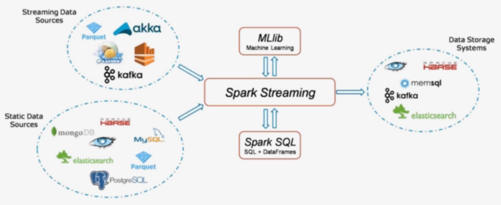
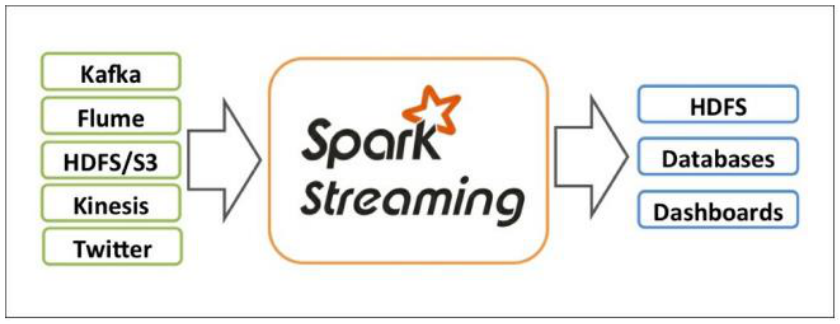
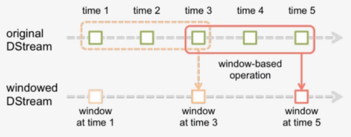
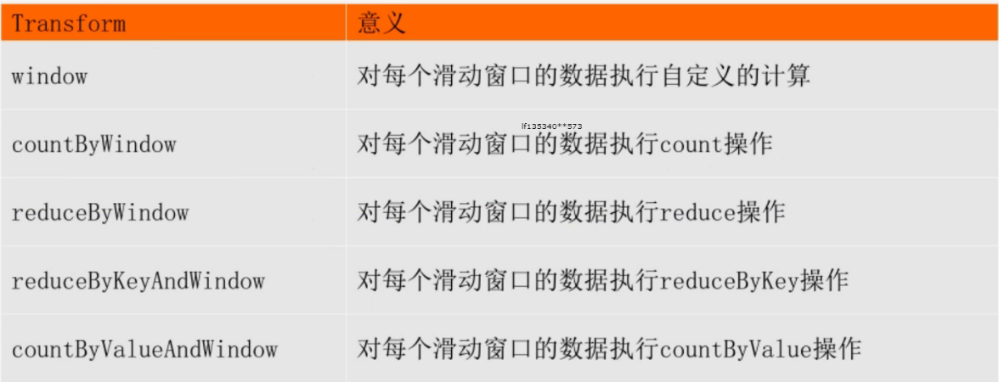
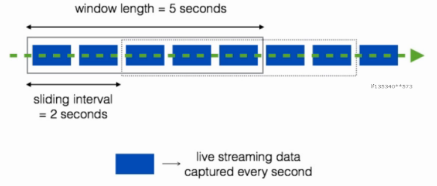

# spark-streaming

## 概述

它是一个可扩展，高吞吐具有容错性的流式计算框架

吞吐量：单位时间内成功传输数据的数量

之前我们接触的spark-core和spark-sql都是处理属于离线批处理任务，数据一般都是在固定位置上，通常我们写好一个脚本，每天定时去处理数据，计算，保存数据结果。这类任务通常是T+1(一天一个任务)，对实时性要求不高。



但在企业中存在很多实时性处理的需求，例如：双十一的京东阿里，通常会做一个实时的数据大屏，显示实时订单。这种情况下，对数据实时性要求较高，仅仅能够容忍到延迟1分钟或几秒钟。



**实时计算框架对比**

Storm

- 流式计算框架
- 以record为单位处理数据
- 也支持micro-batch方式（Trident）

Spark

- 批处理计算框架
- 以RDD为单位处理数据
- 支持micro-batch流式处理数据（Spark Streaming）

对比：

- 吞吐量：Spark Streaming优于Storm
- 延迟：Spark Streaming差于Storm

## 构成组件

- Streaming Context
```
- 一旦一个Context已经启动(调用了Streaming Context的start()),就不能有新的流算子(Dstream)建立或者是添加到context中
- 一旦一个context已经停止,不能重新启动(Streaming Context调用了stop方法之后 就不能再次调 start())
- 在JVM(java虚拟机)中, 同一时间只能有一个Streaming Context处于活跃状态, 一个SparkContext创建一个Streaming Context
- 在Streaming Context上调用Stop方法, 也会关闭SparkContext对象, 如果只想仅关闭Streaming Context对象,设置stop()的可选参数为false
- 一个SparkContext对象可以重复利用去创建多个Streaming Context对象(不关闭SparkContext前提下), 但是需要关一个再开下一个
```
- DStream (离散流)
```
- 代表一个连续的数据流
- 在内部, DStream由一系列连续的RDD组成
- DStreams中的每个RDD都包含确定时间间隔内的数据
- 任何对DStreams的操作都转换成了对DStreams隐含的RDD的操作
- 数据源
    - 基本源
        - TCP/IP Socket
        - FileSystem
    - 高级源
        - Kafka
        - Flume
```

## 编码步骤

Spark Streaming编码步骤
```
1，创建一个StreamingContext
2，从StreamingContext中创建一个数据对象
3，对数据对象进行Transformations操作
4，输出结果
5，开始和停止
```

利用Spark Streaming实现WordCount

```python
"""
需求：监听某个端口上的网络数据，实时统计出现的不同单词个数。
1，需要安装一个nc工具：sudo yum install -y nc
2，执行指令：nc -lk 9999 -v
"""
import os
# 配置spark driver和pyspark运行时，所使用的python解释器路径
PYSPARK_PYTHON = "/home/hadoop/miniconda3/envs/datapy365spark23/bin/python"
JAVA_HOME='/home/hadoop/app/jdk1.8.0_191'
SPARK_HOME = "/home/hadoop/app/spark-2.3.0-bin-2.6.0-cdh5.7.0"
# 当存在多个版本时，不指定很可能会导致出错
os.environ["PYSPARK_PYTHON"] = PYSPARK_PYTHON
os.environ["PYSPARK_DRIVER_PYTHON"] = PYSPARK_PYTHON
os.environ['JAVA_HOME']=JAVA_HOME
os.environ["SPARK_HOME"] = SPARK_HOME

from pyspark import SparkContext
from pyspark.streaming import StreamingContext

if __name__ == "__main__":
    
    sc = SparkContext("local[2]",appName="NetworkWordCount")
    #参数2：指定执行计算的时间间隔
    ssc = StreamingContext(sc, 1)
    #监听ip，端口上的上的数据
    lines = ssc.socketTextStream('localhost',9999)
    #将数据按空格进行拆分为多个单词
    words = lines.flatMap(lambda line: line.split(" "))
    #将单词转换为(单词，1)的形式
    pairs = words.map(lambda word:(word,1))
    #统计单词个数
    wordCounts = pairs.reduceByKey(lambda x,y:x+y)
    #打印结果信息，会使得前面的transformation操作执行
    wordCounts.pprint()
    #启动StreamingContext
    ssc.start()
    #等待计算结束
    ssc.awaitTermination()
```

## 状态操作

在Spark Streaming中存在两种状态操作

- UpdateStateByKey
- Windows操作

使用有状态的transformation，需要开启Checkpoint

- spark streaming 的容错机制
- 它将足够多的信息checkpoint到某些具备容错性的存储系统如hdfs上，以便出错时能够迅速恢复

### updateStateByKey

Spark Streaming实现的是一个实时批处理操作，每隔一段时间将数据进行打包，封装成RDD，是无状态的。

无状态：指的是每个时间片段的数据之间是没有关联的。

需求：想要将一个大时间段（1天），即多个小时间段的数据内的数据持续进行累积操作

一般超过一天都是用RDD或Spark SQL来进行离线批处理

如果没有UpdateStateByKey，我们需要将每一秒的数据计算好放入mysql中取，再用mysql来进行统计计算

Spark Streaming中提供这种状态保护机制，即updateStateByKey

步骤：

- 首先，要定义一个state，可以是任意的数据类型
- 其次，要定义state更新函数--指定一个函数如何使用之前的state和新值来更新state
- 对于每个batch，Spark都会为每个之前已经存在的key去应用一次state更新函数，无论这个key在batch中是否有新的数据。如果state更新函数返回none，那么key对应的state就会被删除
- 对于每个新出现的key，也会执行state更新函数

举例：词统计。

```python
"""
需求：监听网络端口的数据，获取到每个批次的出现的单词数量，并且需要把每个批次的信息保留下来
"""

import os
# 配置spark driver和pyspark运行时，所使用的python解释器路径
PYSPARK_PYTHON = "/home/hadoop/miniconda3/envs/datapy365spark23/bin/python"
JAVA_HOME='/home/hadoop/app/jdk1.8.0_191'
SPARK_HOME = "/home/hadoop/app/spark-2.3.0-bin-2.6.0-cdh5.7.0"
# 当存在多个版本时，不指定很可能会导致出错
os.environ["PYSPARK_PYTHON"] = PYSPARK_PYTHON
os.environ["PYSPARK_DRIVER_PYTHON"] = PYSPARK_PYTHON
os.environ['JAVA_HOME']=JAVA_HOME
os.environ["SPARK_HOME"] = SPARK_HOME
from pyspark.streaming import StreamingContext
from pyspark.sql.session import SparkSession

# 创建SparkContext
spark = SparkSession.builder.master("local[2]").getOrCreate()
sc = spark.sparkContext

ssc = StreamingContext(sc, 3)
#开启检查点
ssc.checkpoint("checkpoint")

#定义state更新函数
def updateFunc(new_values, last_sum):
    return sum(new_values) + (last_sum or 0)

lines = ssc.socketTextStream("localhost", 9999)
# 对数据以空格进行拆分，分为多个单词
counts = lines.flatMap(lambda line: line.split(" ")) \
    .map(lambda word: (word, 1)) \
    .updateStateByKey(updateFunc=updateFunc)#应用updateStateByKey函数
    
counts.pprint()

ssc.start()
ssc.awaitTermination()
```

### Windows

- 窗口长度L：运算的数据量
- 滑动间隔G：控制每隔多长时间做一次运算

每隔G秒，统计最近L秒的数据



**操作细节**

- Window操作是基于窗口长度和滑动间隔来工作的
- 窗口的长度控制考虑前几批次数据量
- 默认为批处理的滑动间隔来确定计算结果的频率

**相关函数**



- Smart computation
- invAddFunc

```python
reduceByKeyAndWindow(func,invFunc,windowLength,slideInterval,[num,Tasks])
```

func:正向操作，类似于updateStateByKey

invFunc：反向操作


例如在热词时，在上一个窗口中可能是热词，这个一个窗口中可能不是热词，就需要在这个窗口中把该次剔除掉

典型案例：热点搜索词滑动统计，每隔10秒，统计最近60秒钟的搜索词的搜索频次，并打印出最靠前的3个搜索词出现次数。



监听网络端口的数据，每隔3秒统计前6秒出现的单词数量

```python
import os
# 配置spark driver和pyspark运行时，所使用的python解释器路径
PYSPARK_PYTHON = "/home/hadoop/miniconda3/envs/datapy365spark23/bin/python"
JAVA_HOME='/home/hadoop/app/jdk1.8.0_191'
SPARK_HOME = "/home/hadoop/app/spark-2.3.0-bin-2.6.0-cdh5.7.0"
# 当存在多个版本时，不指定很可能会导致出错
os.environ["PYSPARK_PYTHON"] = PYSPARK_PYTHON
os.environ["PYSPARK_DRIVER_PYTHON"] = PYSPARK_PYTHON
os.environ['JAVA_HOME']=JAVA_HOME
os.environ["SPARK_HOME"] = SPARK_HOME
from pyspark import SparkContext
from pyspark.streaming import StreamingContext
from pyspark.sql.session import SparkSession

def get_countryname(line):
    country_name = line.strip()

    if country_name == 'usa':
        output = 'USA'
    elif country_name == 'ind':
        output = 'India'
    elif country_name == 'aus':
        output = 'Australia'
    else:
        output = 'Unknown'

    return (output, 1)

if __name__ == "__main__":
	#定义处理的时间间隔
    batch_interval = 1 # base time unit (in seconds)
    #定义窗口长度
    window_length = 6 * batch_interval
    #定义滑动时间间隔
    frequency = 3 * batch_interval

    #获取StreamingContext
    spark = SparkSession.builder.master("local[2]").getOrCreate()
	sc = spark.sparkContext
	ssc = StreamingContext(sc, batch_interval)
    
    #需要设置检查点
    ssc.checkpoint("checkpoint")

    lines = ssc.socketTextStream('localhost', 9999)
    addFunc = lambda x, y: x + y
    invAddFunc = lambda x, y: x - y
    #调用reduceByKeyAndWindow，来进行窗口函数的调用
    window_counts = lines.map(get_countryname) \
        .reduceByKeyAndWindow(addFunc, invAddFunc, window_length, frequency)
	#输出处理结果信息
    window_counts.pprint()

    ssc.start()
    ssc.awaitTermination()
```

## 对接kafka

### 对接方式

在前面的案例中，我们监听了来自网络端口的数据，实现了WordCount，但是在实际开发中并不是这样。我们更多的是接收来自高级数据源的数据，例如Kafka。

下面我们来介绍如何利用Spark Streaming对接Kafka


以下两种方式都是为了数据可靠性：

- Receiver-based Approach：由Receiver来对接数据，Receiver接收到数据后会将日志预先写入到hdfs上（WAL），同时也会将数据做副本传输到其他的Worker节点。在读取数据的过程中，Receiver是从Zookeeper中获取数据的偏移信息。
- Direct Approach（No Receivers）：没有Receiver接收信息，由Spark Streaming直接对接Kafka的broker，获取数据和数据的偏移信息。

上述两种方式中，Direct Approach方式更加可靠，不需要Spark Streaming自己去保证维护数据的可靠性，而是由善于处理这类工作的Kafka来做。

**对应代码**

- KafkaUtils.createStream(ssc,zkQuorum,"spark-streaming-consumer",{topic:1})
- KafkaUtils.createDirectStream(ssc,[topic],{"metadata.broker.list":'localhost:9092'})

**Direct API的好处**

- **简化的并行**：在Receiver的方式中我们提到创建多个Receiver之后利用union来合并成一个Dstream的方式提高数据传输并行度。而在Direct方式中，**Kafka中的partition与RDD中的partition是一一对应**的并行读取Kafka数据，这种映射关系也更利于理解和优化。
- **高效**：在Receiver的方式中，为了达到0数据丢失需要将数据存入Write Ahead Log中，这样在Kafka和日志中就保存了两份数据，浪费！而第二种方式不存在这个问题，只要我们Kafka的数据保留时间足够长，我们都能够从Kafka进行数据恢复。
- **精确一次**：在Receiver的方式中，使用的是Kafka的高阶API接口从Zookeeper中获取offset值，这也是传统的从Kafka中读取数据的方式，但由于Spark Streaming消费的数据和Zookeeper中记录的offset不同步，这种方式偶尔会造成数据重复消费。而第二种方式，直接使用了简单的低阶Kafka API，Offsets则利用Spark Streaming的checkpoints进行记录，消除了这种不一致性。

### 准备工作

配置spark streaming kafka开发环境

```properties
# 1.下载spark streaming集成kafka的jar包spark-streaming-kafka-0-8-assembly_2.11-2.3.0.jar
# 2.将jar包放置到spark的jars目录下
# 3.编辑spark/conf目录下的spark-defaults.conf，添加如下两条配置
spark.driver.extraClassPath=$SPAKR_HOME/jars/spark-streaming-kafka-0-8-assembly_2.11-2.3.0.jar
spark.executor.extraClassPath=$SPARK_HOME/jars/spark-streaming-kafka-0-8-assembly_2.11-2.3.0.jar
#driver和executor对应的两个路径一致
```

测试配置是否成功

```shell
# 启动zookeeper
zkServer.sh start
# 启动kafka
kafka-server-start.sh config/server.properties
# 创建topic
bin/kafka-topics.sh --create --zookeeper localhost:2181 --replication-factor 1 --partitions 1 --topic test
"""
replication-factor：副本数量
partitions：分区数量
出现Created topic "test"，说明创建成功
"""
# 查看所有topic
bin/kafka-topics.sh --list --zookeeper localhost:2181
```

通过Pycharm远程连接Centos 创建代码

通过KafkaUtils 成功连接Kafka 创建DStream对象说明连接成功

```python
import os
# 配置spark driver和pyspark运行时，所使用的python解释器路径
PYSPARK_PYTHON = "/home/hadoop/miniconda3/envs/datapy365spark23/bin/python"
JAVA_HOME='/home/hadoop/app/jdk1.8.0_191'
SPARK_HOME = "/home/hadoop/app/spark-2.3.0-bin-2.6.0-cdh5.7.0"
# 当存在多个版本时，不指定很可能会导致出错
os.environ["PYSPARK_PYTHON"] = PYSPARK_PYTHON
os.environ["PYSPARK_DRIVER_PYTHON"] = PYSPARK_PYTHON
os.environ['JAVA_HOME']=JAVA_HOME
os.environ["SPARK_HOME"] = SPARK_HOME
from pyspark.streaming import StreamingContext
from pyspark.streaming.kafka import KafkaUtils
from pyspark.sql.session import SparkSession

sc = sparkContext（'master[2]','kafkastreamingtest'
ssc = StreamingContext(sc,3)
#createDirectStream 连接kafka数据源获取数据
# 参数1 streamingcontext
#参数2 topic的名字
# 参数3 kafka broker地址
ks = KafkaUtils.createDirectStream(ssc,["topic1"],{"metadata.broker.list":"localhost:9092"})
```

### 案例实现

需求：利用Spark Streaming不断处理来自Kafka生产者生产的数据，并统计出现的单词数量

编写producer.py，用于生产数据

```python
from kafka import KafkaProducer
import time

#创建KafkaProducer，连接broker
producer = KafkaProducer(bootstrap_servers='localhost:9092')

#每隔一段时间发送一端字符串数据到broker
def send_data():
    for i in range(60):
        # (key,value) 参数2 是value 
        producer.send('topic_name',"hello,kafka,spark,streaming,kafka")
        time.sleep(2)
send_data()
```

编辑Spark Streaming代码，统计单词出现的数量

```python
from pyspark.streaming import StreamingContext
from pyspark.streaming.kafka import KafkaUtils
from pyspark.sql.session import SparkSession

topic="topic_name"

spark = SparkSession.builder.master("local[2]").getOrCreate()
sc = spark.sparkContext
ssc = StreamingContext(sc,3)

#创建direct连接，指定要连接的topic和broker地址
ks = KafkaUtils.createDirectStream(ssc,[topic],{"metadata.broker.list":"localhost:9092"})
#(None,内容)
ks.pprint()
#（key,value)
#以下代码每操作一次，就打印输出一次
lines = ks.map(lambda x:x[1])
lines.pprint()

words = lines.flatMap(lambda line:line.split(","))
#words.pprint()

pairs = words.map(lambda word:(word,1))
#pairs.pprint()

counts = pairs.reduceByKey(lambda x,y:x+y)
counts.pprint()

ssc.start()
#等待计算结束
ssc.awaitTermination()
```

开启Spark Streaming消费数据，将产生的日志结果存储到日志中
```
spark-submit xxx.py>a.log
```
开启producer.py，生产数据
```
python3 producer.py
```
通过浏览器观察运算过程
```
http://node-teach:4040
```
分析生成的日志内容

    -------------------------------------------
    Time: 2018-12-11 01:31:21
    -------------------------------------------
    (None, 'hello,kafka,spark,streaming,kafka')
    (None, 'hello,kafka,spark,streaming,kafka')
    (None, 'hello,kafka,spark,streaming,kafka')
    (None, 'hello,kafka,spark,streaming,kafka')
    
    -------------------------------------------
    Time: 2018-12-11 01:02:33
    -------------------------------------------
    hello,kafka,spark,streaming,kafka
    hello,kafka,spark,streaming,kafka
    
    -------------------------------------------
    Time: 2018-12-11 01:02:33
    -------------------------------------------
    hello
    kafka
    spark
    streaming
    kafka
    hello
    kafka
    spark
    streaming
    kafka
    
    -------------------------------------------
    Time: 2018-12-11 01:02:33
    -------------------------------------------
    ('hello', 1)
    ('kafka', 1)
    ('spark', 1)
    ('streaming', 1)
    ('kafka', 1)
    ('hello', 1)
    ('kafka', 1)
    ('spark', 1)
    ('streaming', 1)
    ('kafka', 1)
    
    -------------------------------------------
    Time: 2018-12-11 01:02:33
    -------------------------------------------
    ('streaming', 2)
    ('hello', 2)
    ('kafka', 4)
    ('spark', 2)
    
    -------------------------------------------
    Time: 2018-12-11 01:02:36
    -------------------------------------------
    
    -------------------------------------------
    Time: 2018-12-11 01:02:36
    -------------------------------------------

## 对接flume

flume作为日志实时采集的框架，可以与SparkStreaming实时处理框架进行对接，flume实时产生数据，sparkStreaming做实时处理。

Spark Streaming对接FlumeNG有两种方式，一种是FlumeNG将消息**Push**推给Spark Streaming，还有一种是Spark Streaming从flume 中**Pull**拉取数据。

### Pull方式

- 准备
```shell
# 1.安装flume1.6以上
# 2.下载依赖包
spark-streaming-flume-assembly_2.11-2.3.0.jar放入到flume的lib目录下
# 3.写flume的agent，注意既然是拉取的方式，那么flume向自己所在的机器上产数据就行
```
编写flume-pull.conf配置文件

```properties
simple-agent.sources = netcat-source
simple-agent.sinks = spark-sink
simple-agent.channels = memory-channel
 
# source
simple-agent.sources.netcat-source.type = netcat
simple-agent.sources.netcat-source.bind = localhost
simple-agent.sources.netcat-source.port = 44444

# Describe the sink
simple-agent.sinks.spark-sink.type = org.apache.spark.streaming.flume.sink.SparkSink
simple-agent.sinks.spark-sink.hostname = localhost
simple-agent.sinks.spark-sink.port = 41414
 
# Use a channel which buffers events in memory
simple-agent.channels.memory-channel.type = memory
 
# Bind the source and sink to the channel
simple-agent.sources.netcat-source.channels = memory-channel
simple-agent.sinks.spark-sink.channel=memory-channel
```

启动flume
```shell
flume-ng agent -n simple-agent -f flume-pull.conf -Dflume.root.logger=INFO,console
```
- 编写word count代码

```python
from pyspark import SparkContext
from pyspark.streaming import StreamingContext
from pyspark.streaming.flume import FlumeUtils

sc=SparkContext("local[2]","FlumeWordCount_Pull")
#处理时间间隔为2s
ssc=StreamingContext(sc,2)

#利用flume工具类创建pull方式的流
lines = FlumeUtils.createPollingStream(ssc, [("localhost",41414)])

lines1=lines.map(lambda x:x[1])
counts = lines1.flatMap(lambda line:line.split(" "))\
        .map(lambda word:(word,1))\
        .reduceByKey(lambda a,b:a+b)
counts.pprint()
#启动spark streaming应用
ssc.start()
#等待计算终止
ssc.awaitTermination()
```

- 启动

```
bin/spark-submit --jars xxx/spark-streaming-flume-assembly_2.11-2.3.0.jar xxx/flume_pull.py
```

### push方式

- 准备

大部分操作和之前一致

flume配置

```properties
simple-agent.sources = netcat-source
simple-agent.sinks = avro-sink
simple-agent.channels = memory-channel

simple-agent.sources.netcat-source.type = netcat
simple-agent.sources.netcat-source.bind = localhost
simple-agent.sources.netcat-source.port = 44444

simple-agent.sinks.avro-sink.type = avro
simple-agent.sinks.avro-sink.hostname = localhost
simple-agent.sinks.avro-sink.port = 41414
simple-agent.channels.memory-channel.type = memory
simple-agent.sources.netcat-source.channels = memory-channel

simple-agent.sources.netcat-source.channels = memory-channel
simple-agent.sinks.avro-sink.channel=memory-channel
```

- 代码

```python
from pyspark import SparkContext
from pyspark.streaming import StreamingContext
from pyspark.streaming.flume import FlumeUtils

sc=SparkContext("local[2]","FlumeWordCount_Push")
#处理时间间隔为2s
ssc=StreamingContext(sc,2)
#创建push方式的DStream
lines = FlumeUtils.createStream(ssc, "localhost",41414)
lines1=lines.map(lambda x:x[1].strip())
#对1s内收到的字符串进行分割
words=lines1.flatMap(lambda line:line.split(" "))
#映射为（word，1）元祖
pairs=words.map(lambda word:(word,1))
wordcounts=pairs.reduceByKey(lambda x,y:x+y)
wordcounts.pprint()
#启动spark streaming应用
ssc.start()
#等待计算终止
ssc.awaitTermination()
```

