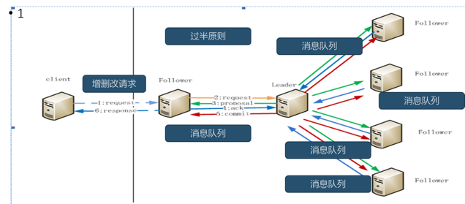
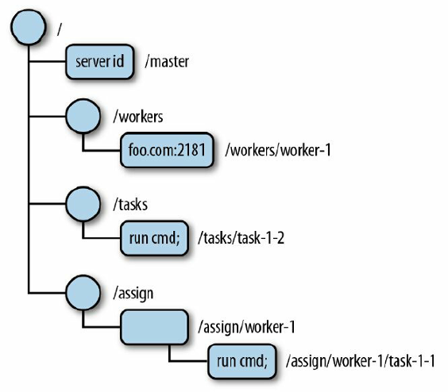

# Zookeeper
## 概述

**ZooKeeper是一种分布式协调服务**，用于管理大型主机。在分布式环境中协调和管理服务是一个复杂的过程。

ZooKeeper通过其简单的架构和API解决了这个问题。ZooKeeper允许开发人员专注于核心应用程序逻辑，而不必担心应用程序的分布式特性。

ZooKeeper框架最初是在“Yahoo!"上构建的，用于以简单而稳健的方式访问他们的应用程序。 后来，Apache ZooKeeper成为Hadoop，HBase和其他分布式框架使用的有组织服务的标准。 例如，Apache HBase使用ZooKeeper跟踪分布式数据的状态。

应用场景

```
1.分布式环境下的统一命名服务
2.分布式环境下的配置管理
3.数据发布/订阅
4.分布式环境下的分布式锁
5.集群管理问题
```

## 安装配置

在安装ZooKeeper之前，请确保你的系统是在以下任一操作系统上运行：

```
任意Linux OS - 支持开发和部署。适合演示应用程序。
Windows OS - 仅支持开发。
Mac OS - 仅支持开发。
```

### 安装

ZooKeeper服务器是用Java创建的，它在JVM上运行。你需要使用JDK 6或更高版本。

- Java

```python
# 1.验证系统中java版本
java -version
# 2.若没有或版本过低，则去java官网下载jdk
# 3.提取文件
cd /path/to/download/
tar -zxvf jdk-8u181-linux-x64.gz
# 4.移动到/usr/local/jdk目录
sudo mkdir /usr/local/jdk
sudo mv jdk1.8.0_181 /usr/local/jdk
# 5.设置终端启动快捷路径
vim ~/.bashrc
export JAVA_HOME=/usr/local/jdk/jdk1.8.0_181
export PATH=$PATH:$JAVA_HOME/bin
 
source ~/.bashrc
# 6.验证是否ok
java -version
```

- zookeeper

```python
# 1.下载Zookeeper
访问以下链接并下载最新版本：http://zookeeper.apache.org/releases.html
# 2.提取tar文件
cd /path/to/download/
tar -zxvf zookeeper-3.4.12.tar.gz
cd zookeeper-3.4.12
mkdir data
mkdir /var/bjsxt/zookeeper/datalog  # 创建日志文件夹
# 3.编辑配置文件
vi conf/zoo.cfg
# 4.若zookeeper做集群
echo 1 > /opt/zookeeper-3.4.6/data/myid  # 写下当前zookeeper的编号
scp -r zookeeper-3.4.12/ 其他服务器合理位置
echo xxx > /opt/zookeeper-3.4.6/data/myid  # 分别改写其他服务器上的编号
```

配置信息

```shell
tickTime = 2000  # 发送心跳间隔时间，单位毫秒
dataDir = /path/to/zookeeper/data  # ZooKeeper保存数据的目录
dataLogDir=/var/bjsxt/zookeeper/datalog # 日志目录
clientPort = 2181  # 客户端连接 ZooKeeper服务器的端口，ZooKeeper会监听这个端口，接受客户端的访问请求。

# 获取zookeeper为集群部署，则需配置如下选项
initLimit=5  # 这个配置项是用来配置 ZooKeeper 接受客户端（这里所说的客户端不是用户连接ZooKeeper服务器的客户端，而是 ZooKeeper 服务器集群中follower或observer连接到 Leader的Follower 服务器）初始化连接时最长能忍受多少个心跳时间间隔数。当已经超过 5 个心跳的时间（也就是 tickTime）长度后 ZooKeeper 服务器还没有收到客户端的返回信息，那么表明这个客户端连接失败。总的时间长度就是 5*2000=10秒
syncLimit=2  # 这个配置项标识 Leader 与 Follower 之间发送消息，请求和应答时间长度，最长不能超过多少个tickTime 的时间长度，总的时间长度就是 4*2000=8 秒
server.1=server2:2881:3881
server.2=server3:2881:3881  
server.3=node4:2881:3881  #observer（表示对应节点不参与投票）
# server.A=B：C：D：其 中 A是一个数字，表示这个是第几号服务器；B是这个服务器的ip地址；C表示的是这个服务器与集群中的Leader服务器交换信息的端口；D表示的是万一集群中的 Leader 服务器挂了，需要一个端口来重新进行选举，选出一个新的Leader，而这个端口就是用来执行选举时服务器相互通信的端口。如果是伪集群的配置方式，由于B都是一样，所以不同的ZooKeeper实例通信端口号不能一样，所以要给它们分配不同的端口号。
```

### 使用

```python
# 启动zookeeper服务器
bin/zkServer.sh start
# 停止zookeeper服务器
bin/zkServer.sh stop
# 检查zookeeper服务器状态
bin/zkServer.sh status

# 启动CLI，需确保zk服务器启动状态
bin/zkCli.sh
# 退出cli
quit
```

## 相关功能

- zookeeper会话

客户端通过TCP协议与独立服务器或者一个集群中的某个服务器建立会话连接。

会话提供顺序保障，即同一个会话中的请求以FIFO的顺序执行。如果客户端有多个并发会话，FIFO顺序在多个会话之间未必能够保持。

如果连接的Server出现问题，在没有超过Timeout时间时，可以连接其他节点。ZooKeeper客户端透明地转移一个会话到不同的服务器。

同一session期内的特性不变

当一个会话因某种原因终止，在这个会话期间创建的临时节点将会消失。

Leader产生一个唯一的session，放到消息队列，让所有server知道

过半机制：保证session创建成功或者失败 

- 监听

监视是一种简单的机制，使客户端收到关于ZooKeeper集合中的更改的通知。客户端可以在读取特定znode时设置Watches。Watches会向注册的客户端发送任何znode（客户端注册表）更改的通知。

Znode更改是与znode相关的数据的修改或znode的子项中的更改。只触发一次watches。如果客户端想要再次通知，则必须通过另一个读取操作设置watches来完成。

当连接会话过期时，客户端将与服务器断开连接，相关的watches也将被删除。

可以设置观察点的操作：`exists,getChildren,getData`

可以触发观察的操作：`create,delete,setData`

- 广播

ZooKeeper的核心是原子广播，这个机制保证了各个server之间的信息同步。实现这个机制的协议叫做ZAB协议。

ZAB协议有两种模式：恢复模式、广播模式

**恢复模式**：

当服务启动或者在领导者崩溃后，ZAB就进入了恢复模式。当领导者被选举出来，且大多数server的完成了和leader的状态同步以后，恢复模式就结束了。状态同步保证了leader和follower以及observer具有相同的系统状态

**广播模式**：

需要保证proposal被按顺序处理，因此zk采用了递增的事务id号(zxid)来保证。所有的提议(proposal)都在被提出的时候加上了zxid(比如：0x1000000300000002)。

epoch也称为纪元数字。实现中zxid是一个64位的数字，它高32位是epoch用来标识leader关系是否改变，每次一个leader被选出来，它都会有一个新的epoch，低32位是个递增计数。



- 集群特点

| 特点       | 说明                                                         |
| ---------- | ------------------------------------------------------------ |
| 最终一致性 | 为客户端展示同一个视图                                       |
| 可靠性     | 如果消息被一台服务器接受，那么它将被所有的服务器接受         |
| 实时性     | zookeeper不能保证两个客户端能同时得到刚更新的数据，如果需要最新数据，应该在读数据之前调用`sync()`接口 |
| 独立性     | 各个Client之间互不干预                                       |
| 原子性     | 更新只能成功或者失败，没有中间状态                           |
| 顺序性     | 所有Server，同一消息发布顺序一致                             |

- 集群状态

选举模式 安其内

广播模式 壤其外

- Server状态

LOOKING：当前Server不知道leader是谁，正在搜寻

LEADING：当前Server即为选举出来的leader

FOLLOWING：leader已经选举出来，当前Server与之同步

- 主从分工

模型

```
Leader Follower+

一写多读
 Leader负责增删改，Follower负责读和投票
```

角色

```
- 领导者（leader）
负责进行投票的发起和决议，更新系统状态，（增删改）

- 学习者（learner）
包括跟随者（follower）和观察者（observer），follower用于接受客户端请求并向客户端返回结果，在操作过程中参与投票

- Observer
可以接受客户端连接，将写请求转发给leader，但observer不参加投票过程，只同步leader的状态，observer的目的是为了扩展系统，提高读取速度

- 客户端（client）
请求发起方  
```

分工

```
网络分区/脑裂：过半通过

谁年龄大myid：
1 2 **3**  （同时启动）
1 **2**  3  （逐一启动）

谁数据新：
  3 3 4  事务id（zxid）大的当领导


 3台机器 挂一台 2>3/2

 5台机器 挂了1台 4>5/2（可以工作） 挂3台 2！>5/2（集群无法工作）
```

## 数据结构



上图描述了用于内存表示的ZooKeeper文件系统的树结构（ZooKeeper的数据保存形式）。

```
ZK有一个最开始的节点 /
ZK的节点叫做znode节点
每个znode节点都可存储数据,最多可存储1MB
每个znode节点（临时节点除外）都可创建自己的子节点
每个znode节点都是一个路径（通过路径来定位这个节点）
每个路径名都是唯一的。
多个znode节点共同形成了znode树
Znode树的维系实在内存中，目的是供用户快速的查询
```

- Znode的类型

Znode被分为持久（persistent）节点，临时（ephemeral）节点和顺序（sequential）节点。

**持久节点** - 即使在创建该特定znode的客户端断开连接后，持久节点仍然存在。默认情况下，除非另有说明，否则所有znode都是持久的。

**临时节点** - 客户端活跃时，临时节点就是有效的。当客户端与ZooKeeper集合断开连接时，临时节点会自动删除。因此，只有临时节点不允许有子节点。如果临时节点被删除，则下一个合适的节点将填充其位置。临时节点在leader选举中起着重要作用。

**顺序节点** - 顺序节点可以是持久的或临时的。当一个新的znode被创建为一个顺序节点时，ZooKeeper通过将10位的序列号附加到原始名称来设置znode的路径。例如，如果将具有路径 **/myapp** 的znode创建为顺序节点，则ZooKeeper会将路径更改为 **/myapp0000000001** ，并将下一个序列号设置为0000000002。如果两个顺序节点是同时创建的，那么ZooKeeper不会对每个znode使用相同的数字。顺序节点在锁定和同步中起重要作用。

## 客户端命令

```shell
ls / # 查看
get /zk01	# 查看节点信息
set /zk01 hello  # 更新节点内容

# 删除节点
delete /zk01	# 只能删除有子节点为空的节点

# 创建节点
create /zk01 '' # 创建普通持久节点，需有初始化内容
create -e /zl02 abc  # 创建普通临时节点
create -s /zk03 abc  # 创建顺序持久节点
create -s -e /zk04 abc	# 创建顺序临时节点
```

## python交互

kazoo是Python连接操作ZooKeeper的客户端库。我们可以通过kazoo来使用ZooKeeper。

- 安装

```shell
pip install kazoo
```

- 使用

连接zookeeper

```python
from kazoo.client import KazooClient

zk = KazooClient(hosts='127.0.0.1:2181')
# 启动连接
zk.start() 
# 停止连接
zk.stop()
```

创建节点

```python
# 创建节点路径，但不能设置节点数据值
zk.ensure_path("/my/favorite")

# 创建节点，并设置节点保存数据，ephemeral表示是否是临时节点，sequence表示是否是顺序节点
zk.create("/my/favorite/node", b"a value", ephemeral=True, sequence=True)
```

读取节点

```python
# 获取子节点列表
children = zk.get_children("/my/favorite")

# 获取节点数据data 和节点状态stat
data, stat = zk.get("/my/favorite")
```

设置监视

```python
def my_func(event):
    # 检查最新的节点数据
    pass

# 当子节点发生变化的时候，调用my_func
children = zk.get_children("/my/favorite/node", watch=my_func)
```
