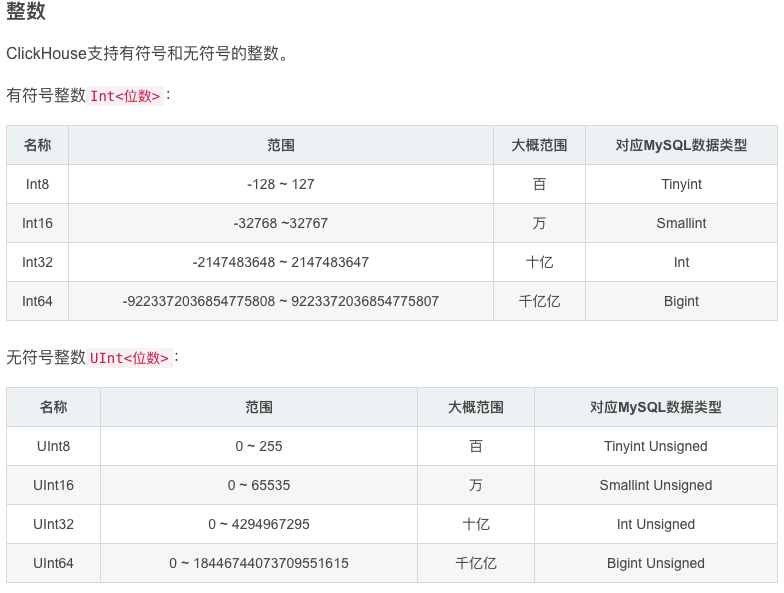

# ClickHouse

[文档](https://clickhouse.tech/docs/zh/)

ClickHouse是一个用于联机分析(OLAP)的列式数据库管理系统(DBMS)。

常见的列式数据库有： Vertica、 Paraccel (Actian Matrix，Amazon Redshift)、 Sybase IQ、 Exasol、 Infobright、 InfiniDB、 MonetDB (VectorWise， Actian Vector)、 LucidDB、 SAP HANA、 Google Dremel、 Google PowerDrill、 Druid、 kdb+。

## 特性

优点

```
真正的列式数据库管理系统
数据压缩
数据的磁盘存储
多核心并行处理
多服务器分布式处理
支持SQL
向量引擎
实时的数据更新
索引
适合在线查询
支持近似计算
自适应连接算法
支持数据复制和数据完整性
角色的访问控制
```

限制

```
没有完整的事务支持。
缺少高频率，低延迟的修改或删除已存在数据的能力。仅能用于批量删除或修改数据，但这符合 GDPR。
稀疏索引使得ClickHouse不适合通过其键检索单行的点查询。
```

## 数据库引擎

使用的所有表都是由数据库引擎所提供的。

默认情况下，ClickHouse使用数据库引擎Atomic，该引擎提供可配置的[表引擎](https://clickhouse.tech/docs/zh/engines/database-engines/)和[所有支持的SQL语法](https://clickhouse.tech/docs/zh/engines/database-engines/).

除此之外，您还可以选择使用以下的数据库引擎：Mysql

### MaterializeMySQL

使用 MySQL 中存在的所有表以及这些表中的所有数据创建 ClickHouse 数据库。ClickHouse 服务器用作 MySQL 副本。它读取 binlog 并执行 DDL 和 DML 查询。此功能是实验性的。

创建数据库

```sql
CREATE DATABASE [IF NOT EXISTS] db_name [ON CLUSTER cluster]
ENGINE = MaterializeMySQL('host:port', ['database' | database], 'user', 'password') [SETTINGS ...]
```

使用示例

```sql
# mysql
CREATE DATABASE db;
CREATE TABLE db.test (a INT PRIMARY KEY, b INT);
INSERT INTO db.test VALUES (1, 11), (2, 22);
DELETE FROM db.test WHERE a=1;
ALTER TABLE db.test ADD COLUMN c VARCHAR(16);
UPDATE db.test SET c='Wow!', b=222;
SELECT * FROM test;

# clickhouse
CREATE DATABASE mysql ENGINE = MaterializeMySQL('localhost:3306', 'db', 'user', '***');
SHOW TABLES FROM mysql;
SELECT * FROM mysql.test;  # 插入数据
SELECT * FROM mysql.test;  # 删除数据，增加和更新列
```

### Mysql

MySQL引擎用于将远程的MySQL服务器中的表映射到ClickHouse中，并允许您对表进行`INSERT`和`SELECT`查询，以方便您在ClickHouse与MySQL之间进行数据交换。

`MySQL`数据库引擎会将对其的查询转换为MySQL语法并发送到MySQL服务器中，因此您可以执行诸如`SHOW TABLES`或`SHOW CREATE TABLE`之类的操作。

但您无法对其执行以下操作：`RENAME,CREATE TABLE,ALTER`

```sql
CREATE DATABASE [IF NOT EXISTS] db_name [ON CLUSTER cluster]
ENGINE = MySQL('host:port', ['database' | database], 'user', 'password')
```

> 支持的类型对应

| MySQL                            | ClickHouse                                                   |
| -------------------------------- | ------------------------------------------------------------ |
| UNSIGNED TINYINT                 | [UInt8](https://clickhouse.tech/docs/zh/sql-reference/data-types/int-uint/) |
| TINYINT                          | [Int8](https://clickhouse.tech/docs/zh/sql-reference/data-types/int-uint/) |
| UNSIGNED SMALLINT                | [UInt16](https://clickhouse.tech/docs/zh/sql-reference/data-types/int-uint/) |
| SMALLINT                         | [Int16](https://clickhouse.tech/docs/zh/sql-reference/data-types/int-uint/) |
| UNSIGNED INT, UNSIGNED MEDIUMINT | [UInt32](https://clickhouse.tech/docs/zh/sql-reference/data-types/int-uint/) |
| INT, MEDIUMINT                   | [Int32](https://clickhouse.tech/docs/zh/sql-reference/data-types/int-uint/) |
| UNSIGNED BIGINT                  | [UInt64](https://clickhouse.tech/docs/zh/sql-reference/data-types/int-uint/) |
| BIGINT                           | [Int64](https://clickhouse.tech/docs/zh/sql-reference/data-types/int-uint/) |
| FLOAT                            | [Float32](https://clickhouse.tech/docs/zh/sql-reference/data-types/float/) |
| DOUBLE                           | [Float64](https://clickhouse.tech/docs/zh/sql-reference/data-types/float/) |
| DATE                             | [日期](https://clickhouse.tech/docs/zh/sql-reference/data-types/date/) |
| DATETIME, TIMESTAMP              | [日期时间](https://clickhouse.tech/docs/zh/sql-reference/data-types/datetime/) |
| BINARY                           | [固定字符串](https://clickhouse.tech/docs/zh/sql-reference/data-types/fixedstring/) |

其他的MySQL数据类型将全部都转换为[字符串](https://clickhouse.tech/docs/zh/sql-reference/data-types/string/)。

同时以上的所有类型都支持[可为空](https://clickhouse.tech/docs/zh/sql-reference/data-types/nullable/)。

使用示例

```sql
# mysql
USE test;
CREATE TABLE `mysql_table` (
  `int_id` INT NOT NULL AUTO_INCREMENT,
  `float` FLOAT NOT NULL,
  PRIMARY KEY (`int_id`)
);
insert into mysql_table (`int_id`, `float`) VALUES (1,2);
select * from mysql_table;

# clickHouse
# 创建MySQL类型的数据库，同时与MySQL服务器交换数据
CREATE DATABASE mysql_db ENGINE = MySQL('localhost:3306', 'test', 'my_user', 'user_password')
SHOW DATABASES
SHOW TABLES FROM mysql_db
SELECT * FROM mysql_db.mysql_table
INSERT INTO mysql_db.mysql_table VALUES (3,4)
SELECT * FROM mysql_db.mysql_table
```

### 延时引擎Lazy

在距最近一次访问间隔`expiration_time_in_seconds`时间段内，将表保存在内存中，仅适用于 *Log引擎表

由于针对这类表的访问间隔较长，对保存大量小的 *Log引擎表进行了优化，

```sql
CREATE DATABASE testlazy ENGINE = Lazy(expiration_time_in_seconds);
```

### Atomic

它支持非阻塞 DROP 和 RENAME TABLE 查询以及原子 EXCHANGE TABLES t1 AND t2 查询。默认情况下使用原子数据库引擎。

```sql
CREATE DATABASE test ENGINE = Atomic;
```

## 表引擎

表引擎（即表的类型）决定了：
```
- 数据的存储方式和位置，写到哪里以及从哪里读取数据
- 支持哪些查询以及如何支持。
- 并发数据访问。
- 索引的使用（如果存在）。
- 是否可以执行多线程请求。
- 数据复制参数。
```
### 合并树家族

适用于高负载任务的最通用和功能最强大的表引擎。这些引擎的共同特点是可以快速插入数据并进行后续的后台数据处理。 MergeTree系列引擎支持数据复制（使用[Replicated*](https://clickhouse.tech/docs/zh/engines/table-engines/mergetree-family/replication/#table_engines-replication) 的引擎版本），分区和一些其他引擎不支持的其他功能。

```shell
MergeTree
ReplacingMergeTree  	# 删除重复数据
SummingMergeTree  		# 汇总重复数据
AggregatingMergeTree 	# 聚合数据
CollapsingMergeTree		# 折叠合并数据
VersionedCollapsingMergeTree
GraphiteMergeTree
```

### 日志系列

具有最小功能的[轻量级引擎](https://clickhouse.tech/docs/zh/engines/table-engines/log-family/)。当您需要快速写入许多小表（最多约100万行）并在以后整体读取它们时，该类型的引擎是最有效的。

```
TinyLog
StripeLog
Log
```

### 集成

用于与其他的数据存储与处理系统集成的引擎。

```
Kafka
MySQL
ODBC
JDBC
HDFS
```

### 特别

用于其他特定功能的引擎

```
Distributed
MaterializedView
Dictionary
Merge
File
Null
Set
Join
URL
View
Memory
Buffer
```

### 虚拟列

虚拟列是表引擎组成的一部分，它在对应的表引擎的源代码中定义。

您不能在 `CREATE TABLE` 中指定虚拟列，并且虚拟列不会包含在 `SHOW CREATE TABLE` 和 `DESCRIBE TABLE` 的查询结果中。虚拟列是只读的，所以您不能向虚拟列中写入数据。

如果想要查询虚拟列中的数据，您必须在SELECT查询中包含虚拟列的名字。`SELECT *` 不会返回虚拟列的内容。

若您创建的表中有一列与虚拟列的名字相同，那么虚拟列将不能再被访问。我们不建议您这样做。为了避免这种列名的冲突，虚拟列的名字一般都以下划线开头。

## 数据类型

[参考](https://cookcode.blog.csdn.net/article/details/108827707)

### 基础类型

#### 数值类型

ClickHouse的数值类型和Numpy的数值类型类似，比如`int32`、`int64`、`uint32`、`float32` 和`float64`等。

- 整数


- 浮点数


- 

数值类型



### 复合类型

### 特殊类型


### 表中字段

- 字段类型

```
无符号整数：UInt
有符号整数：Int
浮点数：Float
可变字符串：String
固定长度字符串：FixedString
日期和时间：DateTime、Date
数组：Array
嵌套类型：Nested，在desc <table> 时，可以看到嵌套内的字段被描述为一个数组类型，比如
ParsedParams.Key1为Array(String)
ParsedParams.ValueDouble为Array(Float64)
```

- 默认值

默认值 的处理方面， ClickHouse 中，默认值总是有的，如果没有显示式指定的话，会按字段类型处理：
```
- 数字类型， `0` 。
- 字符串，空字符串。
- 数组，空数组。
- 日期， `0000-00-00` 。
- 时间， `0000-00-00 00:00:00` 。
- `NULLs` 是不支持的。
```
同时，在字段类型方面，如果没有明确指定字段类型，但是指定了默认值，则默认值表达式的返回值类型，作为字段类型。如果即指定了字段类型，也指定了默认值表达式，那么对开默认值表达式的结果，相当于会有一个类型转换。

- 物化列

指定 `MATERIALIZED` 表达式，即将一个列作为 物化列 处理了，这意味着这个列的值不能从 `insert` 语句获取，只能是自己计算出来的。同时， 物化列 也不会出现在 `select *` 的结果中

```sql
create table t (a MATERIALIZED (b+1), b UInt16) ENGINE = Memory;

insert into t(b) values (1);
select * from t;
select a, b from t;
```

- 表达式列

`ALIAS` 表达式列某方面跟物化列相同，就是它的值不能从 `insert` 语句获取。不同的是， 物化列是会真正保存数据（这样查询时不需要再计算），而 表达式列 不会保存数据（这样查询时总是需要计算），只是在查询时返回表达式的结果。

```sql
create table t (a ALIAS (b+1), b UInt16) ENGINE = Memory;

insert into t(b) values (1);
select * from t;
select a, b from t;
```


