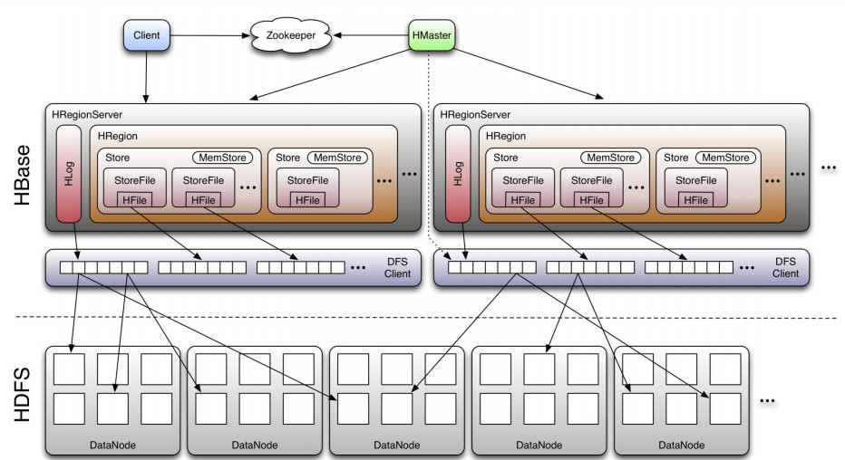
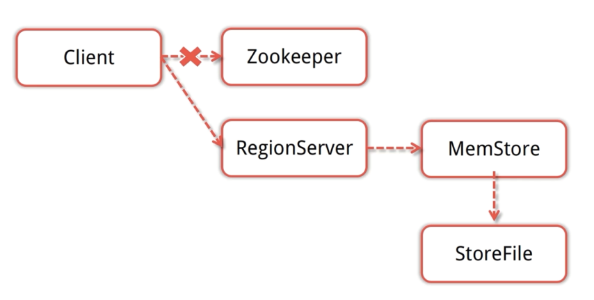
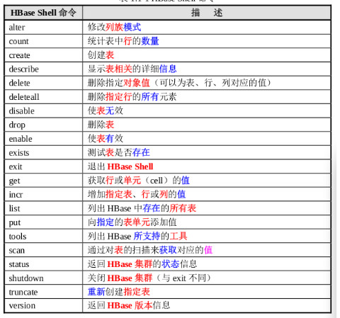

# Hbase

## 概述

HBase是一个分布式的、面向列的开源数据库

HBase是Google BigTable的开源实现

HBase不同于一般的关系数据库, 适合非结构化数据存储

BigTable是Google设计的分布式数据存储系统，用来处理海量的数据的一种非关系型的数据库。适合大规模海量数据，PB级数据；分布式、并发数据处理，效率极高；易于扩展，支持动态伸缩；适用于廉价设备；不适用于传统关系型数据的存储；

在hadoop生态中地位

```
- HBase是Apache基金会顶级项目
- HBase基于HDFS进行数据存储
- HBase可以存储超大数据并适合用来进行大数据的实时查询
```

HBase与HDFS
```
- HBase建立在Hadoop文件系统上, 利用了HDFS的容错能力
- HBase提供对数据的随机实时读/写访问功能
- HBase内部使用哈希表, 并存储索引, 可以快速查找HDFS中数据
```

HBase与Hive

```
- 共同点
都可以处理海量数据
文件都保存在hdfs上
- 区别
hbase的计算不是通过mapreduce实现的，是自己重新实现了CRUD
hbase可以有集群，通过zookeeper实现集群管理
hbase提供对数据的随机实时读写访问
hive是通过mapreduce实现数据查询的，只能做离线计算
```

使用场景

```
- 瞬间写入量很大
- 大量数据需要长期保存, 且数量会持续增长
- HBase不适合有join, 多级索引, 表关系复杂的数据模型
```

## 安装部署

- 下载安装包 http://archive.cloudera.com/cdh5/cdh/5/hbase-1.2.0-cdh5.7.0.tar.gz

- 配置伪分布式环境


环境变量配置

```shell
export HBASE_HOME=/usr/local/development/hbase-1.2.4
export PATH=$HBASE_HOME/bin:$PATH
```

配置hbase-env.sh

```shell
export JAVA_HOME=/usr/local/development/jdk1.7.0_15
export HBASE_MANAGES_ZK=false  # 如果你是使用hbase自带的zk就是true，如果使用自己的zk就是false
```

配置hbase-site.xml

```xml
<property>
      <name>hbase.rootdir</name>　　--hbase持久保存的目录
      <value>hdfs://hadoop001:8020/opt/hbase</value>   
</property>
<property>
      <name>hbase.cluster.distributed</name>  --是否是分布式
      <value>true</value>
</property>
<property>     
          <name>hbase.zookeeper.property.clientPort</name>    --指定要连接zk的端口
          <value>2181</value>    
</property>    
<property>        
          <name>hbase.zookeeper.property.dataDir</name>            <value>/home/hadoop/app/hbase/zkData</value>    
</property>          
```

- 启动hbase（启动的hbase的时候要保证hadoop集群已经启动）

```shell
/hbase/bin/start-hbase.sh
```

## 数据模型

- 数据库事务

HBase 支持特定场景下的 ACID，即对行级别的 操作保证完全的 ACID

- CAP定理

一致性、可用性、分区容错性这三个特性中，HBase保证了分区容错性和强一致性。

- 表结构
```
- NameSpace
关系型数据库的"数据库"(database)

- 表(table)
用于存储管理数据，具有稀疏的、面向列的特点。HBase中的每一张表，就是所谓的大表(Bigtable)，可以有上亿行，上百万列。对于为值为空的列，并不占用存储空间，因此表可以设计的非常稀疏。

- 行(Row)
在表里面,每一行代表着一个数据对象,每一行都是以一个行键(Row Key)来进行唯一标识的, 行键并没有什么特定的数据类型, 以二进制的字节来存储

- 列(Column)
HBase的列由 Column family 和 Column qualifier 组成, 由冒号: 进行行间隔, 如 family: qualifier

- 行键(RowKey)
类似于MySQL中的主键，HBase根据行键来快速检索数据，一个行键对应一条记录。与MySQL主键不同的是，HBase的行键是天然固有的，每一行数据都存在行键。

- 列族(ColumnFamily)
是列的集合。列族在表定义时需要指定，而列在插入数据时动态指定。列中的数据都是以二进制形式存在，没有数据类型。在物理存储结构上，每个表中的每个列族单独以一个文件存储。一个表可以有多个列簇。

- 列修饰符(*Column* *Qualifier*) 
列族中的数据通过列标识来进行映射, 可以理解为一个键值对(key-value), 列修饰符(*Column* *Qualifier*) 就是key 对应关系型数据库的列

- 时间戳(TimeStamp)
是列的一个属性，是一个64位整数。由行键和列确定的单元格，可以存储多个数据，每个数据含有时间戳属性，数据具有版本特性。可根据版本(VERSIONS)或时间戳来指定查询历史版本数据，如果都不指定，则默认返回最新版本的数据。

- 区域(Region)
HBase自动把表水平划分成的多个区域，划分的区域随着数据的增大而增多。
```

## 面向列的数据库

HBase与传统关系数据库的区别

<table>
  <tr>
    <th></th>
    <th>HBase</th>
    <th>关系型数据库</th>
  </tr>
  <tr>
    <td> 数据库大小 </td>
    <td> PB级别  </td>
    <td>GB TB</td>
  </tr>
  <tr>
    <td> 数据类型 </td>
    <td> Bytes </td>
    <td> 丰富的数据类型 </td>
  </tr>
    <tr>
    <td> 事务支持 </td>
    <td> ACID只支持单个Row级别 </td>
    <td> 全面的ACID支持, 对Row和表</td>
  </tr>
  <tr>
    <td> 索引 </td>
    <td> 只支持Row-key </td>
    <td> 支持 </td>
  </tr>
    <tr>
    <td> 吞吐量 </td>
    <td> 百万写入/秒 </td>
    <td> 数千写入/秒</td>
  </tr>
</table>


关系型数据库中数据示例

<table>
  <tr>
    <th>ID</th>
    <th>FILE NAME</th>
    <th>FILE PATH</th>
    <th>FILE TYPE</th>
    <th>FILE SIZE</th>
    <th>CREATOR</th>
  </tr>
  <tr>
    <td> 1 </td>
    <td> file1.txt  </td>
    <td>/home</td>
    <td> txt </td>
    <td> 1024 </td>
    <td> tom </td>
  </tr>
  <tr>
    <td> 2 </td>
    <td> file2.txt  </td>
    <td>/home/pics</td>
    <td> jpg </td>
    <td> 5032 </td>
    <td> jerry </td>
  </tr>
</table>


同样数据保存到列式数据库中

<table>
<tr>
<th>RowKey</th>
<th>FILE INFO</th>
<th>SAVE INFO</th>
</tr>
<tr>
<td> 1 </td>
<td> name:file1.txt
type:txt
size:1024</td>
<td>path:/home/pics
creator:Jerry
</td>
</tr>
<tr>
<td> 2 </td>
<td>name:file2.jpg
type:jpg
size:5032</td>
<td> path:/home
creator:Tom</td>
</tr>
</table>

## 基础架构



**Client**

- ①与zookeeper通信, 找到数据入口地址
- ②使用HBase RPC机制与HMaster和HRegionServer进行通信；
- ③Client与HMaster进行通信进行管理类操作；
- ④Client与HRegionServer进行数据读写类操作。

**Zookeeper**

- ①保证任何时候，集群中只有一个running master，避免单点问题；
- ②存贮所有Region的寻址入口，包括-ROOT-表地址、HMaster地址；
- ③实时监控Region Server的状态，将Region server的上线和下线信息，实时通知给Master；
- ④存储Hbase的schema，包括有哪些table，每个table有哪些column family。

**HMaster**

可以启动多个HMaster，通过Zookeeper的Master Election机制保证总有一个Master运行。

角色功能：

- ①为Region server分配region；
- ②负责region server的负载均衡；
- ③发现失效的region serve并重新分配其上的region；
- ④HDFS上的垃圾文件回收；
- ⑤处理用户对表的增删改查操作。

**HRegionServer**

HBase中最核心的模块，主要负责响应用户I/O请求，向HDFS文件系统中读写数据。

作用：

- ①维护Master分配给它的region，处理对这些region的IO请求；
- ②负责切分在运行过程中变得过大的region。
- 此外，HRegionServer管理一系列HRegion对象，每个HRegion对应Table中一个Region，HRegion由多个HStore组成，每个HStore对应Table中一个Column Family的存储，Column Family就是一个集中的存储单元，故将具有相同IO特性的Column放在一个Column Family会更高效。

**HStore**

- HBase存储的核心，由MemStore和StoreFile组成。



- 用户写入数据的流程为：client访问ZK, ZK返回RegionServer地址-> client访问RegionServer写入数据 -> 数据存入MemStore，一直到MemStore满 -> Flush成StoreFile

**HRegion**

- 一个表最开始存储的时候，是一个region。
- 一个Region中会有个多个store，每个store用来存储一个列簇。如果只有一个column family，就只有一个store。
- region会随着插入的数据越来越多，会进行拆分。默认大小是10G一个。

**HLog**

- 在分布式系统环境中，无法避免系统出错或者宕机，一旦HRegionServer意外退出，MemStore中的内存数据就会丢失，引入HLog就是防止这种情况。

## 模块协作

- HBase启动
    - HMaster启动, 注册到Zookeeper, 等待RegionServer汇报
    - RegionServer注册到Zookeeper, 并向HMaster汇报
    - 对各个RegionServer(包括失效的)的数据进行整理, 分配Region和meta信息
- RegionServer失效
    - HMaster将失效RegionServer上的Region分配到其他节点
    - HMaster更新hbase: meta 表以保证数据正常访问
- HMaster失效
    - 处于Backup状态的其他HMaster节点推选出一个转为Active状态
    - 数据能正常读写, 但是不能创建删除表, 也不能更改表结构

## 表设计

- 设计HBase表时需要注意的特点
    - HBase中表的索引是通过rowkey实现的
    - 在表中是通过Row key的字典顺序来对数据进行排序的, 表中Region的划分通过起始Rowkey和结束Rowkey来决定的
    - 所有存储在HBase中的数据都是二进制字节, 没有数据类型
    - 原子性只在行内保证, HBase表中没有多行事务
    - 列族(Column Family)在表创建之前就要定义好
    - 列族中的列标识(Column Qualifier)可以在表创建后动态插入数据的时候添加
    - 不同的column family保存在不同的文件中。
- 如何设计HBase表
    - Row key的结构该如何设置, Row key中又该包含什么样的信息
    - 表中应该有多少的列族，不宜过多
    - 列族中应该存储什么样的数据
    - 每个列族中存储多少列数据
    - 列的名字分别是什么
    - cell中应该存储什么样的信息
    - 每个cell中存储多少个版本信息
- DDI  目的是为了克服HBase架构上的缺陷(join繁琐 只有row key索引等)
    - Denormalization (反规范化, 解决join麻烦的问题)
    - Duplication (数据冗余)
    - Intelligent keys(通过row key设计实现 索引 排序对读写优化) 

## Shell

可以通过HbaseUi界面查看表的信息

端口60010打不开的情况，是因为hbase 1.0 以后的版本，需要自己手动配置，在文件 hbase-site

```xml
<property>  
<name>hbase.master.info.port</name>  
<value>60010</value>  
</property> 
```
 

HBase DDL 和 DML 命令

<table>
  <tr>
    <th>名称</th>
    <th>命令表达式</th>
  </tr>
  <tr>
    <td> 创建表 </td>
   <td> create '表名', '列族名1','列族名2','列族名n' </td>
  </tr>
  <tr>
    <td> 添加记录 </td>
    <td> put '表名','行名','列名:','值 </td>
  </tr>
    <tr>
    <td> 查看记录 </td>
    <td> get '表名','行名' </td>
  </tr>
  <tr>
    <td> 查看表中的记录总数 </td>
    <td> count '表名' </td>
  </tr>
    <tr>
    <td> 删除记录 </td>
    <td> delete '表名', '行名','列名' </td>
  </tr>
  <tr>
    <td> 删除一张表 </td>
    <td> 第一步 disable '表名' 第二步 drop '表名' </td>
  </tr>
  <tr>
    <td> 查看所有记录 </td>
    <td> scan "表名称" </td>
  </tr>
  <tr>
    <td> 查看指定表指定列所有数据 </td>
    <td> scan '表名' ,{COLUMNS=>'列族名:列名'} </td>
  </tr>
   <tr>
    <td> 更新记录 </td>
    <td> 重写覆盖 </td>
  </tr>
</table>

连接集群

```
hbase shell
```

名称空间

```sql
# 创建名称空间
create_namespace 'test'

# 展示现有名称空间
list_namespace

# 显示某个名称空间下有哪些表
list_namespace_tables 'test'

# 展示表
list
```

表

```sql
# 展示表
describe '表名'

# 创建表
create 'user','base_info'
# 创建表的时候添加namespace
create 'test:user','base_info'

# 删除表
disable 'user'
drop 'user'

# 清空数据
truncate 'user'

#  删除表中的数据
delete 'user', 'rowkey_16', 'base_info:username'

# 操作列簇
alter 'user', NAME => 'f2'
alter 'user', 'delete' => 'f2'
```

插入/更新数据
```sql
#  put  ‘表名’，‘rowkey的值’，’列族：列标识符‘，’值‘
put 'user','rowkey_10','base_info:username','Tom'
put 'user','rowkey_10','base_info:birthday','2014-07-10'
put 'user','rowkey_10','base_info:sex','1'
put 'user','rowkey_10','base_info:address','Tokyo'

put 'user','rowkey_16','base_info:username','Mike'
put 'user','rowkey_16','base_info:birthday','2014-07-10'
put 'user','rowkey_16','base_info:sex','1'
put 'user','rowkey_16','base_info:address','beijing'

put 'user','rowkey_22','base_info:username','Jerry'
put 'user','rowkey_22','base_info:birthday','2014-07-10'
put 'user','rowkey_22','base_info:sex','1'
put 'user','rowkey_22','base_info:address','Newyork'

put 'user','rowkey_24','base_info:username','Nico'
put 'user','rowkey_24','base_info:birthday','2014-07-10'
put 'user','rowkey_24','base_info:sex','1'
put 'user','rowkey_24','base_info:address','shanghai'

put 'user','rowkey_25','base_info:username','Rose'
put 'user','rowkey_25','base_info:birthday','2014-07-10'
put 'user','rowkey_25','base_info:sex','1'
put 'user','rowkey_25','base_info:address','Soul'
```
查询数据
```sql
# 查询表中的所有数据
scan 'user'

# 查询某个rowkey的数据
get 'user','rowkey_16'

# 查询某个列簇的数据
get 'user','rowkey_16','base_info'
get 'user','rowkey_16','base_info:username'
get 'user', 'rowkey_16', {COLUMN => ['base_info:username','base_info:sex']}

# 查询某列几行数据
scan 'test',{COLUMNS => 'cf:a',LIMIT => 21}

# 查询你某表前5行
scan "test", LIMIT =>5
```
HBase 追加型数据库 会保留多个版本数据
```sql
desc 'user'
Table user is ENABLED
user
COLUMN FAMILIES DESCRIPTION
{NAME => 'base_info', VERSIONS => '1', EVICT_BLOCKS_ON_CLOSE => 'false', NEW_VERSION_B
HE_DATA_ON_WRITE => 'false', DATA_BLOCK_ENCODING => 'NONE', TTL => 'FOREVER', MI
ER => 'NONE', CACHE_INDEX_ON_WRITE => 'false', IN_MEMORY => 'false', CACHE_BLOOM
se', COMPRESSION => 'NONE', BLOCKCACHE => 'false', BLOCKSIZE => '65536'}

# - VERSIONS=>'1'说明最多可以显示一个版本 修改数据
put 'user','rowkey_10','base_info:username','Tom'

# 指定显示多个版本
get 'user','rowkey_10',{COLUMN=>'base_info:username',VERSIONS=>2}

# 修改可以显示的版本数量
alter 'user',NAME=>'base_info',VERSIONS=>10
```

## Hive on HBase

HBase用于在线业务服务，不适合做统计分析；Hive适合数据分析统计

- 使用场景

数据导入、不适合数据分析

- Hive表与Hbase表之间需要建立映射关系

```sql
create table hbase_table_1(key int, value string) stored by 'org.apache.hadoop.hive.hbase.HBaseStorageHadler' with serdeproperties("hbase.columns.mapping"=":key,cf1:val") tblproperties("hbase.table.name"="xyz")
```

- 不支持load data导入数据，要用insert方法创建新表加载数据

```sql
load data local inpath '/home/1.txt' overwrite int table a;
insert overwrite table hbase_a select * from a;
```

- hive on HBase实战

创建student表通过hive中创建在hbase中也会同时创建

```sql
crete table student1(no string, classno string, stuno string, score int) stored by 'org.apache.hadoop.hive.hbase.HBaseStorageHadler' with serdeproperties("hbase.columns.mapping"=":key,stuinfo:classno,stuinfo:stuno,stuinfo:score") tblproperties("hbase.table.name"="student")
```

从之前的student2表中insert数量

```sql
insert overwrite table student1 select reverse(classno) as key,classno,stuno,score from student;
```

