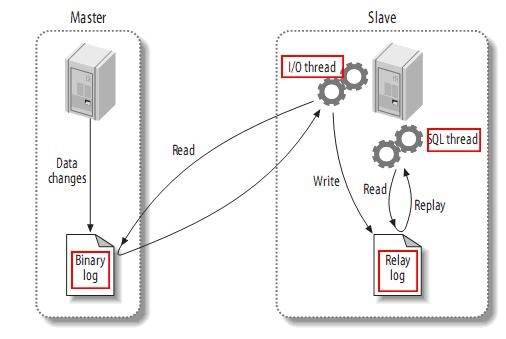

# 基础安装

## Windows(解压版)

- 下载与解压

```
在官网下载解压版，将其解压至要安装的位置D:\Program Files
```

- 配置my.ini文件

```
在文件夹根目录下，创建my.ini配置文件，做如下配置

[client]
# 客户端默认字符集
default-character-set=utf8

[mysqld]
# 端口号
port=3306
# 设置mysql的安装目录
basedir=D:\Program Files\Mysql\mysql-5.7.20-winx64
# 设置mysql的数据目录
datadir=D:\Program Files\Mysql\mysql-5.7.20-winx64\data
# 服务端默认字符集
character_set_server=utf8
# 允许最大连接数
max_connections=200
# 创建新表时将使用的默认存储引擎
default-storage-engine=INNODB 
sql_mode=NO_ENGINE_SUBSTITUTION,NO_AUTO_CREATE_USER
# 
#explicit_defaults_for_timestamp=FALSE
#skip-grant-tables
```

- 添加环境变量

```
在path中添加D:\Program Files\Mysql\mysql-5.7.20-winx64\bin;
```

- 安装mysql

```
进入Mysql安装目录下的bin文件夹，在此处以管理员身份打开cmd 
# 安装mysql
mysqld -install 
# 初始化data目录
mysqld –-initialize
# 启动服务
net start mysql
```

- 设置root管理员密码

```
新版本的mysql，root用户的密码不能为空，这时，我们的root是没有密码的，因此我们需要设置。
win+R，输入services.msc，打开服务，找到MySQL服务，关闭它。
进入mysql安装目录的bin文件夹，然后打开cmd，输入命令：
mysqld --defaults-file="D:\Program Files\Mysql\mysql-5.7.20-winx64\my.ini" --console --skip-grant-tables
这是打开mysql的安全模式。（这个cmd别关）
另外进入mysql安装目录的bin文件夹,再打开一个cmd，输入命令：
mysql -u root -p
此时cmd显示Enter password：
直接敲Enter键，成功进入mysql
输入sql语句如下：
use mysql;　　显示Database changed
update user set authentication_string=password("mysql") where user="root";　　显示：Query OK,1 rows affected(0.01 sec) Rows matched:1 Changed:1 Warnings:1
flush privileges;　　显示：Query OK,0 rows affected (0.00 sec)
quit
完成，这样就把root用户的密码设置为mysql了。 
```

- 初次运行

```
登录后，需要在正常模式下，再设一次root用户的密码，输入：set password=password('mysql');

打开root操作数据库的全部权限：
use mysql;
show tables;
select host,user from user;
update user set host='%' where user='root';
quit
net stop mysql
net start mysql
```

- 卸载

```
1. 执行卸载命令。mysql自己的卸载命令是 mysql -remove，正常情况下可以这样卸载。但在安装出错的情况下此命令无法执行，还可以在管理员权限下执行系统的删除服务命令: SC delete mysql

2. 卸载完成后去注册表管理器中将mysql相关的注册表文件夹全部删除。cmd下执行regedit.exe可以进入注册表管理器。

3. 删除mysql文件夹的全部内容。如果只是重装的话，也一定记得删除data文件夹中的内容，否则重装后会出现上面那种错误而无法启动mysql服务，手动初始化也会失败。

4. 我执行完1.2.3步就卸载完成，可以重装了，看网上说如果还卸载不干净，将其他可能存在mysql数据的文件也全部删除即可。
```

## Windows（安装版）

- 安装

```
1. 打开 mysql 安装文件 （mysql-installer-community-5.7.19.0.msi）

1. 选择默认的开发模式
2. 检查依赖项
3. 开始安装
4. 安装完成
5. 进行配置设置
6. MySQL 服务设置，单机模式/经典复制模式
7. 选择开发机配置类型，端口默认 3306
8. 设置 mysql root 用户的密码
9. 配置 mysql 在 windows 系统中的后台运行服务
10. 跳过插件和扩展
11. 应用配置
12. 进行路由设置
13. 跳过路由设置
14. 进行 MySQL 实例测试
15. 输入刚刚设置的 root 用户的密码，点击【Check】测试能否连接
    上已经运行的 MySQL 服务
16. 执行设置
17. 安装完成，跳过开启 Workbench 和 Shell 客户端。
18. 安装完成，跳过开启 Workbench 和 Shell 客户端。

可能出 现的错误
在安装 MySQL Server 5.7.19 时，如果该项安装失败，可以先退出MySQL 安装程序，然后安装所依赖补丁包程序后再次进行 MySQL 安装程序进行安装。
vcredist_x64.exe
vcredist_x86.exe
```

## Ubuntu

- 服务器

```
# 安装(ubuntu命令行)
sudo apt-get install mysql-server
# 安装开发版依赖
sudo libmysqld-dev 
sudo libmysqlclient-dev 
# 启动服务
sudo service mysql start 
# 查看进程中是否存在mysql服务
ps ajx|grep mysql
# 停止服务
sudo service mysql stop
# 重启服务
sudo service mysql restart
```

- 配置

> 配置文件目录为/etc/mysql/mysql.cnf
>
> 进入conf.d目录，打开mysql.cnf，发现并没有配置
>
> 进入mysql.conf.d目录，打开mysql.cnf，可以看到配置项

```
bind-address表示服务器绑定的ip，默认为127.0.0.1
port表示端口，默认为3306
datadir表示数据库目录，默认为/var/lib/mysql
general_log_file表示普通日志，默认为/var/log/mysql/mysql.log
log_error表示错误日志，默认为/var/log/mysql/error.logsu
```

- 客户端

```
# 安装客户端
sudo apt-get install mysql-client
# 帮助文档
mysql --help
# 基本连接
mysql -uroot -pmysql
# 退出
quit/exit/ctrl+d
```

- 更改root用户密码

```shell
# 进入root账户下
mysql -uroot -p
# 修改密码
select user();
set password=password('mysql'); 
flush privileges;
exit;
```

## Mac

- 安装

```
brew install mysql
```

- 启动

```shell
# 服务端
# 启动
brew services start mysql  # 开机启动
brew services restart mysql  # 重启
mysql.server start  # 临时启动

mysqld -u 用户名
$PATH/support-files/mysql.server start # 推荐
# 关闭
$PATH/support-files/mysql.server stop

# 客户端
# 本地
mysql -uroot
mysql -u 用户名 -p
# 远程
mysql -h192.168.5.140 -uroot -pxxx -P5317
```

- 修改密码

```shell
# 设置密码
mysql_secure_installation

# 关闭服务
sudo $PATH/support-files/mysql.server stop
cd $PATH/bin
sudo su
./mysqld_safe --skip-grant-tables
alias mysql=$PATH
 
# 客户端
mysql -u 用户名
use mysql;
flush privileges;
set password for '用户名'@'localhost'='新密码';
# 方法二：
select user();
set password=password('123456'); 
flush privileges;
exit;
```

- 查找配置文件

```
mysqld --help --verbose | less

/usr/local/etc/my.cnf
```

# 主从同步

配置主从同步原因：

1. 数据备份，高可用

2. 配合读写分离，提高吞吐量

## 实现步骤

1. master将改变记录到二进制日志(binary log)中（这些记录叫做二进制日志事件，binary log events）；
2. slave将master的binary log events拷贝到它的中继日志(relay log)；
3. slave重做中继日志中的事件，将改变反映它自己的数据。



该过程的第一部分就是master记录二进制日志。在每个事务更新数据完成之前，master在二日志记录这些改变。MySQL将事务串行的写入二进制日志，即使事务中的语句都是交叉执行的。在事件写入二进制日志完成后，master通知存储引擎提交事务。

下一步就是slave将master的binary log拷贝到它自己的中继日志。首先，slave开始一个工作线程——I/O线程。I/O线程在master上打开一个普通的连接，然后开始binlog dump process。Binlog dump process从master的二进制日志中读取事件，如果已经跟上master，它会睡眠并等待master产生新的事件。I/O线程将这些事件写入中继日志。

SQL slave thread处理该过程的最后一步。SQL线程从中继日志读取事件，更新slave的数据，使其与master中的数据一致。只要该线程与I/O线程保持一致，中继日志通常会位于OS的缓存中，所以中继日志的开销很小。

此外，在master中也有一个工作线程：和其它MySQL的连接一样，slave在master中打开一个连接也会使得master开始一个线程。

**利用主从在达到高可用的同时，也可以通过读写分离提供吞吐量。**

## 配置步骤

```
有很多种配置主从同步的方法，可以总结为如下的步骤：
（1） 在主服务器上，必须开启二进制日志机制和配置一个独立的 ID
（2） 在每一个从服务器上，配置一个唯一的 ID，创建一个用来专门复制主服
务器数据的账号
（3） 在开始复制进程前，在主服务器上记录二进制文件的位置信息
（4） 如果在开始复制之前，数据库中已经有数据，就必须先创建一个数据快照
（可以使用 mysqldump 导出数据库，或者直接复制数据文件）
（5） 配置从服务器要连接的主服务器的 IP 地址和登陆授权，二进制日志文件
名和位置
```

## 详细方法

主和从的身份可以自己指定，我们将Ubuntu虚拟机中MySQL作为主服务器，将Windows 中的MySQL作为从服 务器。在主从设置前，要保证Ubuntu与Windows间的网络连通 。

### 备份主数据到从数据库

```
如果在设置主从同步前，主服务器上已有大量数据，可以使用 mysqldump 进
行数据备份并还原到从服务器以实现数据的复制。

1. 在主服务器 Ubuntu 上进行备份，执行命令：
mysqldump -uroot -pmysql --all-databases --lock-all-tables >
~/.master_db.sql

参数：
-u ：用户名
-p ：示密码
--all-databases ：导出所有数据库
--lock-all-tables ：执行操作时锁住所有表，防止操作时有数据修改
~/.master_db.sql :导出的备份数据（sql 文件）位置，可自己指定

2. 在从服务器 Windows 上进行数据还原
找到 Windows 上 mysql 命令的位置；
新打开的命令窗口，在这个窗口中可以执行类似在 Ubuntu 终端中执行的mysql 命令；
将从主服务器 Ubuntu 中导出的文件复制到从服务器 Windows 中，可以将其放在上面 mysql 命令所在的文件夹中，方便还原使用；
在刚打开的命令黑窗口中执行还原操作:
mysql –uroot –pmysql < master_db.sql
```

### 配置主服务器master(Ubuntu中的MySQL)

```
1. 编辑设置 mysqld 的配置文件，设置 log_bin 和 server-id
# 在命令行执行
sudo vim /etc/mysql/mysql.conf.d/mysqld.cnf
# 在配置文件中打开 log_bin 和 server-id

2. 重启 mysql 服务
sudo service mysql restart

3. 登入主服务器 Ubuntu 中的 mysql，创建用于从服务器同步数据使用的帐
号
# 登录mysql
mysql –uroot –pmysql
# 授权slave用户
GRANT REPLICATION SLAVE ON *.* TO 'slave'@'%' identified by
'slave';
# 刷险权限配置
FLUSH PRIVILEGES;

4. 获取主服务器的二进制日志信息
SHOW MASTER STATUS;
# File 为使用的日志文件名字，Position 为使用的文件位置，这两个参数
须记下，配置从服务器时会用到。
```

### 配置从服务器slave(Windows中的MySQL)

```
1. 找到 Windows 中 MySQL 的配置文件
2. 编辑 my.ini 文件，将 server-id 修改为 2，并保存退出。3. 重启mysql服务
方法一：
打开 windows 服务管理；可以在开始菜单中输入 services.msc 找到并运行；在打开的服务管理中找到 MySQL57，并重启该服务。
方法二：
net stop mysql
net start mysql
4. 进入 windows 的 mysql，设置连接到 master 主服务器
change master to master_host='192.168.203.129', master_user='slave',
master_password='slave',master_log_file='mysql-bin.000001',
master_log_pos=590;
注：
master_host：主服务器 Ubuntu 的 ip 地址
master_log_file: 前面查询到的主服务器日志文件名
master_log_pos: 前面查询到的主服务器日志文件位置
5. 开启同步，查看同步状态
start slave;
show slave status \G;
# 若输出的变量中Slave_IO_Running和Slave_SQL_Running值均为yes,则表示同步已经正常运行
```

### 测试主从同步

```
在 Ubuntu 的 MySQL 中（主服务器）创建一个数据库
在 Windows 的 MySQL 中（从服务器）查看新建的数据库是否存在
若存在，则测试ok！
```

### 从服务器关闭

```
以root用户登录mysql， 执行STOP SLAVE语句。
使用SHOW STATUS检查slave_open_temp_tables变量的值。
如果值为0，使用mysqladmin shutdown命令关闭从服务器。
如果值不为0，用START SLAVE重启从服务器线程。
后面再重复该以上过程看是否可以正常关闭了
```

