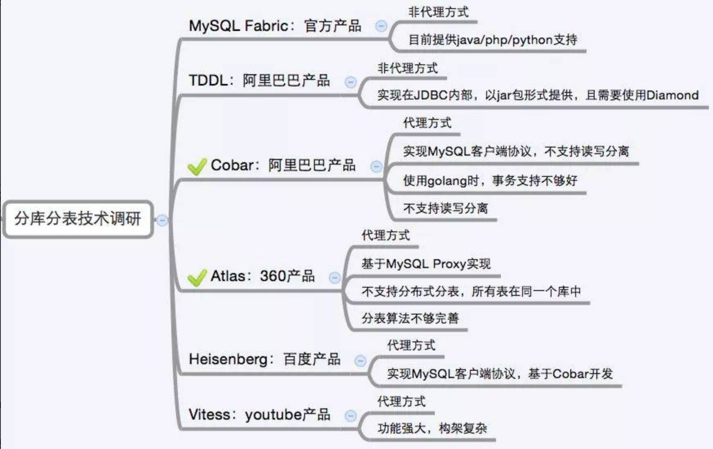

# 数据库知识

## 数据库类型

* 关系型：orcale、mysq、ms sql server、sqlite、clickhouse
* 非关系型：Redis, MongonDB，Hbase
* 列式存储：clickhouse、Hbase


## 数据库引擎

数据库引擎是用于存储、处理和保护数据的核心服务。利用数据库引擎可控制访问权限并快速处理事务，从而满足企业内大多数需要处理大量数据的应用程序的要求。 使用数据库引擎创建用于联机事务处理或联机分析处理数据的关系数据库。这包括创建用于存储数据的表和用于查看、管理和保护数据安全的数据库对象（如索引、视图和存储过程）。

在数据库引擎文档中，各主题的**顺序**遵循用于实现使用数据库引擎进行数据存储的系统的任务的主要顺序。

- 设计并创建数据库以保存系统所需的关系或XML文档
- 实现系统以访问和更改数据库中存储的数据。包括实现网站或使用数据的应用程序，还包括生成使用SQL Server工具和实用工具以使用数据的过程。
- 为单位或客户部署实现的系统
- 提供日常管理支持以优化数据库的性能

## 核心元素

* 数据行(记录)

* 数据列(字段)

* 数据表(数据行的集合)

* 数据库(数据表的集合)

## 数据完整性

### 数据类型

常用类型

```
- 整数：int，bit
- 小数：decimal
- 字符串：varchar,char
- 日期时间: date, time, datetime
- 枚举类型：enum

特别说明的类型如下：
- int(2)表示显示2位，不是存储2位
- decimal表示浮点数，如decimal(5,2)表示共存5位数，小数占2位
- char表示固定长度的字符串，如char(3)，如果填充'ab'时会补一个空格为`'ab '`
- varchar表示可变长度的字符串，如varchar(3)，填充'ab'时就会存储'ab'
- 字符串text表示存储大文本，当字符大于4000时推荐使用
- enum 只能使用集合中的一个值或null，
    set 只能使用集合中的多个值或null
- 对于图片、音频、视频等文件，不存储在数据库中，而是上传到某个服务器上，然后在表中存储这个文件的保存路径
```

数值类型

| 类型        | 字节 | 有符号范围                                 | 无符号范围               |
| ----------- | ---- | ------------------------------------------ | ------------------------ |
| tinyint     | 1    | -128 ~ 127                                 | 0 ~ 255                  |
| smallint    | 2    | -32768 ~ 32767                             | 0 ~ 65535                |
| MEDIUMINT   | 3    | -8388608 ~ 8388607                         | 0 ~ 16777215             |
| INT/INTEGER | 4    | -2147483648 ~2147483647                    | 0 ~ 4294967295           |
| BIGINT      | 8    | -9223372036854775808 ~ 9223372036854775807 | 0 ~ 18446744073709551615 |

字符串

| 类型    | 字节大小字节大小 | 示例                                                         |
| ------- | ---------------- | ------------------------------------------------------------ |
| CHAR    | 0-255            | 类型:char(3) 输入 'ab', 实际存储为'ab ', 输入'abcd' 实际存储为 'abc' |
| VARCHAR | 0-255            | 类型:varchar(3) 输 'ab',实际存储为'ab', 输入'abcd',实际存储为'abc' |
| TEXT    | 0-65535          | 大文本                                                       |
| blob    |                  | 二进制长文本数据                                             |

日期时间类型

| 类型      | 字节大小 | 示例                                                  |
| --------- | -------- | ----------------------------------------------------- |
| DATE      | 4        | '2020-01-01'                                          |
| TIME      | 3        | '12:29:59'                                            |
| DATETIME  | 8        | '2020-01-01 12:29:59'                                 |
| YEAR      | 1        | '2017'                                                |
| TIMESTAMP | 4        | '1970-01-01 00:00:01' UTC ~ '2038-01-01 00:00:01' UTC |

### 约束

- 主键primary key：物理上存储的顺序
- 非空not null：此字段不允许填写空值
- 惟一unique：此字段的值不允许重复
- 默认default：当不填写此值时会使用默认值，如果填写时以填写为准
- 外键foreign key：对关系字段进行约束，当为关系字段填写值时，会到关联的表中查询此值是否存在，如果存在则填写成功，如果不存在则填写失败并抛出异常

说明：虽然外键约束可以保证数据的有效性，但是在进行数据的crud（增加、修改、删除、查询）时，都会降低数据库的性能，所以不推荐使用，那么数据的有效性怎么保证呢？答：可以在逻辑层进行控制

### 事务

隔离级别

```python
read-uncommitted   	# 读未提交
read-committed		# 读已提交
repeatable-read		# 可重复读，不受其他事务影响
serializable		# 串行
```

## SQL语句 ##

*不区分大小写*

* **DQL**：数据查询语言，对数据进行查询，select
* **DML**：数据操作语言，对数据进行增删改，insert/update/delete
* **TPL**：事务处理语言，对事务进行处理，begin transaction/commit/rollback
* **DCL**：数据控制语言，进行授权与权限回收，grant/revoke
* **DDL**:数据定义语言，进行数据库表的管理，create/drop/alter
* **CCL**:指针控制语言，通过控制指针完成表的操作，declare cursor

## 数据库集群

### 基础

复制集Replication
```
数据库中数据相同，起到备份作用

高可用 High Available HA
```
分布式Distribution
``` 
数据库中数据不同，共同组成完整的数据集合
通常每个节点被称为一个分片（shard)
高吞吐 High Throughput
```
复制集与分布式可以单独使用，也可以组合使用（即每个分片都组建一个复制集）

### 主从

这个概念是从使用的角度来阐述问题的

主节点 -> 表示程序在这个节点上最先更新数据

从节点 -> 表示这个节点的数据是要通过复制主节点而来

复制集可选主从、主主、主主从从

分布式每个分片都是主，组合使用复制集的时候，复制集的是从

### 分布式id

对于分布式数据库，对于唯一key，需要做额外处理。有如下方案：

**uuid**

```
UUID是通用唯一识别码（Universally Unique Identifier)的缩写，开放软件基金会(OSF)规范定义了包括网卡MAC地址、时间戳、名字空间（Namespace）、随机或伪随机数、时序等元素。利用这些元素来生成UUID。

UUID是由128位二进制组成，一般转换成十六进制，然后用String表示。

550e8400-e29b-41d4-a716-446655440000

UUID的优点:
通过本地生成，没有经过网络I/O，性能较快
无序，无法预测他的生成顺序。(当然这个也是他的缺点之一)

UUID的缺点:
128位二进制一般转换成36位的16进制，太长了只能用String存储，空间占用较多。
不能生成递增有序的数字
```

**数据库主键自增**

```
大家对于唯一标识最容易想到的就是主键自增，这个也是我们最常用的方法。例如我们有个订单服务，那么把订单id设置为主键自增即可。有如下2种方法：
1.单独数据库 记录主键值
2.业务数据库分别设置不同的自增起始值和固定步长，如
第一台 start 1  step 9 
第二台 start 2  step 9 
第三台 start 3  step 9

优点:
简单方便，有序递增，方便排序和分页

缺点:
分库分表会带来问题，需要进行改造。
并发性能不高，受限于数据库的性能。
简单递增容易被其他人猜测利用，比如你有一个用户服务用的递增，那么其他人可以根据分析注册的用户ID来得到当天你的服务有多少人注册，从而就能猜测出你这个服务当前的一个大概状况。
数据库宕机服务不可用。
```

**redis**

```
Redis中有两个命令Incr，IncrBy,因为Redis是单线程的所以能保证原子性。

优点：
性能比数据库好，能满足有序递增。

缺点：
由于redis是内存的KV数据库，即使有AOF和RDB，但是依然会存在数据丢失，有可能会造成ID重复。
依赖于redis，redis要是不稳定，会影响ID生成。
```

**雪花算法-Snowflake**

```
Snowflake是Twitter提出来的一个算法，其目的是生成一个64bit的整数

1bit(符号位)+41bit(时间戳)+10bit(机器ID)+12bit(循环位)

1bit:一般是符号位，不做处理
41bit:用来记录时间戳，这里可以记录69年，如果设置好起始时间比如今年是2018年，那么可以用到2089年，到时候怎么办？要是这个系统能用69年，我相信这个系统早都重构了好多次了。
10bit:10bit用来记录机器ID，总共可以记录1024台机器，一般用前5位代表数据中心，后面5位是某个数据中心的机器ID
12bit:循环位，用来对同一个毫秒之内产生不同的ID，12位可以最多记录4095个，也就是在同一个机器同一毫秒最多记录4095个，多余的需要进行等待下毫秒。

上面只是一个将64bit划分的标准，当然也不一定这么做，可以根据不同业务的具体场景来划分，比如下面给出一个业务场景：
服务目前QPS10万，预计几年之内会发展到百万。
当前机器三地部署，上海，北京，深圳都有。
当前机器10台左右，预计未来会增加至百台。
这个时候我们根据上面的场景可以再次合理的划分62bit,QPS几年之内会发展到百万，那么每毫秒就是千级的请求，目前10台机器那么每台机器承担百级的请求，为了保证扩展，后面的循环位可以限制到1024，也就是2^10，那么循环位10位就足够了。
机器三地部署我们可以用3bit总共8来表示机房位置，当前的机器10台，为了保证扩展到百台那么可以用7bit 128来表示，时间位依然是41bit,那么还剩下64-10-3-7-41-1 = 2bit,还剩下2bit可以用来进行扩展。

1bit(符号位)+41bit(时间戳)+3bit(机房)+7bit(机器ID)+10bit(循环位)+2bit(扩展位)
```

> 时钟回拨

因为机器的原因会发生时间回拨，我们的雪花算法是强依赖我们的时间的，如果时间发生回拨，有可能会生成重复的ID，在我们上面的nextId中我们用当前时间和上一次的时间进行判断，如果当前时间小于上一次的时间那么肯定是发生了回拨，算法会直接抛出异常。可以稍后再生成。

## 查询速度慢

原因分析

```
1、没有索引或者没有用到索引(这是查询慢最常见的问题，是程序设计的缺陷)
2、I/O吞吐量小，形成了瓶颈效应。
3、没有创建计算列导致查询不优化。
4、内存不足
5、网络速度慢
6、查询出的数据量过大(可以采用多次查询，其他的方法降低数据量)
7、锁或者死锁(这也是查询慢最常见的问题，是程序设计的缺陷)
8、sp_lock,sp_who,活动的用户查看,原因是读写竞争资源。
9、返回了不必要的行和列
10、查询语句不好，没有优化
```

## 性能改善

### 常用措施

```
- 数据操作
避免使用select *，精确检索
减少or,使用多条语句和union
避免使用in，not in
减少like，使用fulltext
存储过程比多条语句快
导入数据时，关闭自动提交，导入完成后重建索引


- 数据库设计
正确的数据类型
不适用过长的主键名(尤其innodb)
建立索引便于检索，避免过多索引影响插入和更新
表的设计要符合三范式。
分表分库；
数据库的读写分离；
使用缓存，把经常访问到的数据而且不需要经常变化的数据放在缓存中；

- mysql配置
内存分配
缓冲区大小
制约的进程改善

- 硬件性能
采用 SSD，使用磁盘队列技术；
```
### SQL优化

1. 避免全表扫描，应考虑在 where 及 order by 涉及的列上建立索引；

2. 查询时使用select明确指明所要查询的字段，避免使用`select *`的操作；

3. SQL语句尽量大写，如

```sql
  SELECT name FROM t WHERE id=1
```

对于小写的sql语句，通常数据库在解析sql语句时，通常会先转换成大写再执行。

4. 尽量避免在 where 子句中使用!=或<>操作符， MySQL只有对以下操作符才使用索引：<，<=，=，>，>=，BETWEEN，IN，以及某些时候的LIKE；

```sql
  SELECT id FROM t WHERE name LIKE ‘abc%’
```

5. 对于模糊查询，如：

```sql
  SELECT id FROM t WHERE name LIKE ‘%abc%’
```

或者

```sql
  SELECT id FROM t WHERE name LIKE ‘%abc’
```

将导致全表扫描，应避免使用，若要提高效率，可以考虑全文检索；

6. 遵循最左原则，在where子句中写查询条件时把索引字段放在前面，如

```sql
  mobile为索引字段，name为非索引字段
  推荐
  SELECT ... FROM t WHERE mobile='13911111111' AND name='python'
  不推荐
  SELECT ... FROM t WHERE name='python' AND mobile='13911111111' 

  建立了复合索引 key(a, b, c)
  推荐
  SELECT ... FROM t WHERE a=... AND b=... AND c= ...
  SELECT ... FROM t WHERE a=... AND b=...
  SELECT ... FROM t WHERE a=...
  不推荐 (字段出现顺序不符合索引建立的顺序)
  SELECT ... FROM t WHERE b=... AND c=...
  SELECT ... FROM t WHERE b=... AND a=... AND c=...
  ...
```

7. 能使用关联查询解决的尽量不要使用子查询，如

```sql
子查询
SELECT article_id, title FROM t_article WHERE user_id IN (SELECT user_id FROM t_user  WHERE user_name IN ('itcast', 'itheima', 'python'))

关联查询(推荐)
SELECT b.article_id, b.title From t_user AS a INNER JOIN t_article AS b ON a.user_id=b.user_id WHERE a.user_name IN ('itcast', 'itheima', 'python');
```

能不使用关联查询的尽量不要使用关联查询；

8. 不需要获取全表数据的时候，不要查询全表数据，使用LIMIT来限制数据。

### 数据库优化

- 在进行表设计时，可适度增加冗余字段(反范式设计)，减少JOIN操作；
- 多字段表可以进行垂直分表优化，多数据表可以进行水平分表优化；
- 选择恰当的数据类型，如整型的选择；
- 对于强调快速读取的操作，可以考虑使用MyISAM数据库引擎；
- 对较频繁的作为查询条件的字段创建索引；唯一性太差的字段不适合单独创建索引，即使频繁作为查询条件；更新非常频繁的字段不适合创建索引；
- 编写SQL时使用上面的方式对SQL语句进行优化；
- 使用慢查询工具找出效率低下的SQL语句进行优化；
- 构建缓存，减少数据库磁盘操作；
- 可以考虑结合使用内存型数据库，如Redis，进行混合存储。

### 读写分离

在主从同步基础上实现读操作和写操作的分离。

- 对事务影响

对于写操作包括开启事务和提交或回滚要在一台机器上执行，分散到多台master执行后数据库原生的单机事务就失效了。

对于事务中同时包含读写操作，与事务隔离级别设置有关，如果事务隔离级别为read-uncommitted 或者 read-committed，读写分离没影响，如果隔离级别为repeatable-read、serializable，读写分离就有影响，因为在slave上会看到新数据，而正在事务中的master看不到新数据。

### 分库分表

- 分库分表前的问题

任何问题都是太大或者太小的问题，我们这里面对的数据量太大的问题。

用户请求量太大
```
因为单服务器TPS，内存，IO都是有限的。 

解决方法：分散请求到多个服务器上；
其实用户请求和执行一个sql查询是本质是一样的，都是请求一个资源，只是用户请求还会经过网关，路由，http服务器等。
```
单库太大
```
单个数据库处理能力有限；
单库所在服务器上磁盘空间不足；
单库上操作的IO瓶颈 

解决方法：切分成更多更小的库
```
单表太大
```
CRUD都成问题；
索引膨胀，查询超时 

解决方法：切分成多个数据集更小的表。
```
- 分库分表的方式方法

一般就是垂直切分和水平切分，这是一种结果集描述的切分方式，是物理空间上的切分。 

我们从面临的问题，开始解决，例如： 首先是用户请求量太大，我们就堆机器搞定（这不是本文重点）。

然后是单个库太大，这时我们要看是因为表多而导致数据多，还是因为单张表里面的数据多。 如果是因为表多而数据多，使用垂直切分，根据业务切分成不同的库。如果是因为单张表的数据量太大，这时要用水平切分，即把表的数据按某种规则切分成多张表，甚至多个库上的多张表。 

**分库分表的顺序应该是先垂直分，后水平分。** 因为垂直分更简单，更符合我们处理现实世界问题的方式。

**垂直拆分** 

垂直分表

```
也就是“大表拆小表”，基于列字段进行的。一般是表中的字段较多，将不常用的， 数据较大，长度较长（比如text类型字段）的拆分到“扩展表“。 一般是针对那种几百列的大表，也避免查询时，数据量太大造成的“跨页”问题。
```
垂直分库
```
垂直分库针对的是一个系统中的不同业务进行拆分，比如用户User一个库，商品Producet一个库，订单Order一个库。 切分后，要放在多个服务器上，而不是一个服务器上。为什么？ 我们想象一下，一个购物网站对外提供服务，会有用户，商品，订单等的CRUD。没拆分之前， 全部都是落到单一的库上的，这会让数据库的单库处理能力成为瓶颈。按垂直分库后，如果还是放在一个数据库服务器上， 随着用户量增大，这会让单个数据库的处理能力成为瓶颈，还有单个服务器的磁盘空间，内存，tps等非常吃紧。 所以我们要拆分到多个服务器上，这样上面的问题都解决了，以后也不会面对单机资源问题。

数据库业务层面的拆分，和服务的“治理”，“降级”机制类似，也能对不同业务的数据分别的进行管理，维护，监控，扩展等。 数据库往往最容易成为应用系统的瓶颈，而数据库本身属于“有状态”的，相对于Web和应用服务器来讲，是比较难实现“横向扩展”的。 数据库的连接资源比较宝贵且单机处理能力也有限，在高并发场景下，垂直分库一定程度上能够突破IO、连接数及单机硬件资源的瓶颈。
```
**水平拆分**

水平分表
```
针对数据量巨大的单张表（比如订单表），按照某种规则（RANGE,HASH取模等），切分到多张表里面去。 但是这些表还是在同一个库中，所以库级别的数据库操作还是有IO瓶颈。不建议采用。
```
水平分库分表
```
将单张表的数据切分到多个服务器上去，每个服务器具有相应的库与表，只是表中数据集合不同。 水平分库分表能够有效的缓解单机和单库的性能瓶颈和压力，突破IO、连接数、硬件资源等的瓶颈。
```
水平分库分表切分规则
```
1. RANGE
从0到10000一个表，10001到20000一个表；
2. HASH取模 离散化
一个商场系统，一般都是将用户，订单作为主表，然后将和它们相关的作为附表，这样不会造成跨库事务之类的问题。 取用户id，然后hash取模，分配到不同的数据库上。
3. 地理区域
比如按照华东，华南，华北这样来区分业务，七牛云应该就是如此。
4. 时间
按照时间切分，就是将6个月前，甚至一年前的数据切出去放到另外的一张表，因为随着时间流逝，这些表的数据 被查询的概率变小，所以没必要和“热数据”放在一起，这个也是“冷热数据分离”。
```
- 分库分表后面临的问题

事务支持
```
分库分表后，就成了分布式事务了。如果依赖数据库本身的分布式事务管理功能去执行事务，将付出高昂的性能代价； 如果由应用程序去协助控制，形成程序逻辑上的事务，又会造成编程方面的负担。
```
多库结果集合并（group by，order by）

跨库join
```
分库分表后表之间的关联操作将受到限制，我们无法join位于不同分库的表，也无法join分表粒度不同的表， 结果原本一次查询能够完成的业务，可能需要多次查询才能完成。 粗略的解决方法： 全局表：基础数据，所有库都拷贝一份。 字段冗余：这样有些字段就不用join去查询了。 系统层组装：分别查询出所有，然后组装起来，较复杂。
```
- 分库分表方案产品

目前市面上的分库分表中间件相对较多，其中基于代理方式的有MySQL Proxy和Amoeba， 基于Hibernate框架的是Hibernate Shards，基于jdbc的有当当sharding-jdbc， 基于mybatis的类似maven插件式的有蘑菇街的蘑菇街TSharding， 通过重写spring的ibatis template类的Cobar Client。

大公司的一些开源产品

