# 缓存

## 缓存架构

直观印象

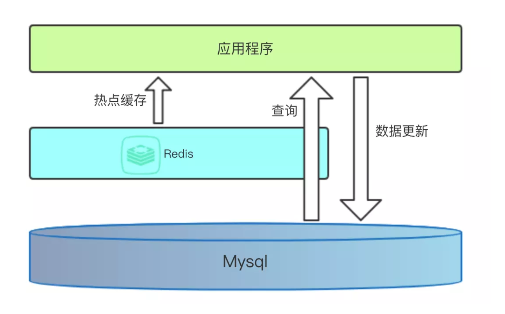

计算机体系机构中的缓存

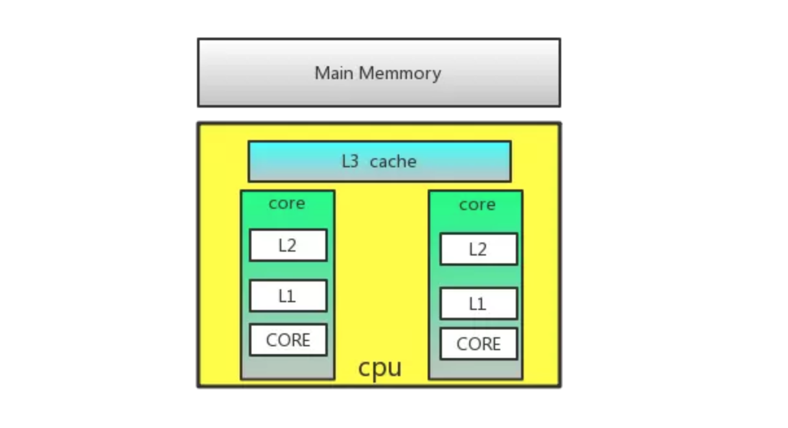

多级缓存

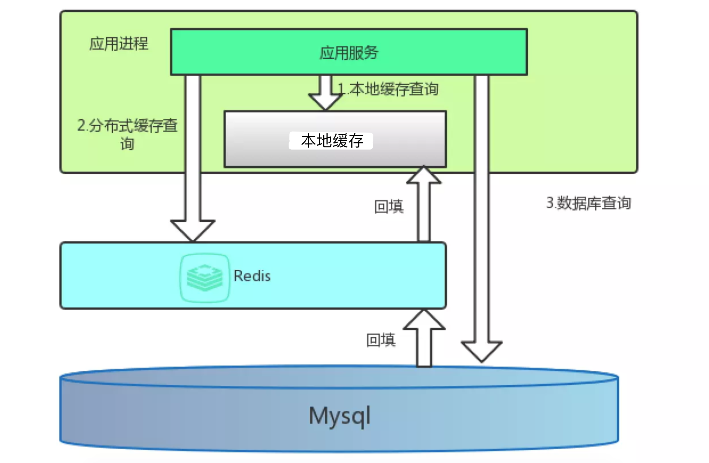

## 缓存数据

- 一个值
- 一个数据库对象、数据库查询结果
- 一个视图的响应结果
- 一个页面
- 一个站点

## 有效期与淘汰

- 有效期

有效期 TTL （Time to live)，设置有效期的作用：

1. 节省空间
2. 做到数据弱一致性，有效期失效后，可以保证数据的一致性

通用过期策略通常有以下三种：

**定时过期**

每个设置过期时间的key都需要创建一个定时器，到过期时间就会立即清除。该策略可以立即清除过期的数据，对内存很友好；但是会占用大量的CPU资源去处理过期的数据，从而影响缓存的响应时间和吞吐量。

**惰性过期**

只有当访问一个key时，才会判断该key是否已过期，过期则清除。该策略可以最大化地节省CPU资源，却对内存非常不友好。极端情况可能出现大量的过期key没有再次被访问，从而不会被清除，占用大量内存。

**定期过期**

每隔一定的时间，会扫描一定数量的数据库的expires字典中一定数量的key，并清除其中已过期的key。该策略是前两者的一个折中方案。通过调整定时扫描的时间间隔和每次扫描的限定耗时，可以在不同情况下使得CPU和内存资源达到最优的平衡效果。

- 淘汰机制

内存中缓存数据量大时，需要引入淘汰机制，常用淘汰策略如下：

**LRU**

LRU（Least recently used，最近最少使用）

LRU算法根据数据的历史访问记录来进行淘汰数据，其核心思想是“如果数据最近被访问过，那么将来被访问的几率也更高”。

基本思路

1. 新数据插入到列表头部；
2. 每当缓存命中（即缓存数据被访问），则将数据移到列表头部；
3. 当列表满的时候，将列表尾部的数据丢弃。

**LFU**

LFU（Least Frequently Used 最近最少使用算法）

它是基于“如果一个数据在最近一段时间内使用次数很少，那么在将来一段时间内被使用的可能性也很小”的思路。

LFU需要定期衰减。

## 缓存模式

- Cache Aside

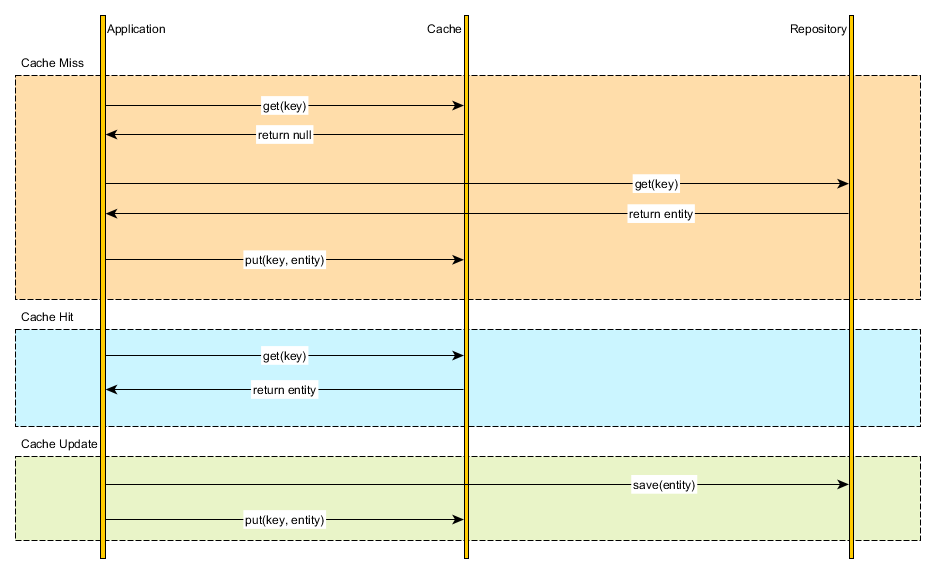

更新方式

**先更新数据库，再更新缓存。这种做法最大的问题就是两个并发的写操作导致脏数据**。如下图（以Redis和Mysql为例），两个并发更新操作，数据库先更新的反而后更新缓存，数据库后更新的反而先更新缓存。这样就会造成数据库和缓存中的数据不一致，应用程序中读取的都是脏数据。

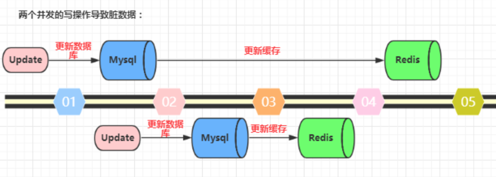

**先删除缓存，再更新数据库。这个逻辑是错误的，因为两个并发的读和写操作导致脏数据**。如下图（以Redis和Mysql为例）。假设更新操作先删除了缓存，此时正好有一个并发的读操作，没有命中缓存后从数据库中取出老数据并且更新回缓存，这个时候更新操作也完成了数据库更新。此时，数据库和缓存中的数据不一致，应用程序中读取的都是原来的数据（脏数据）。

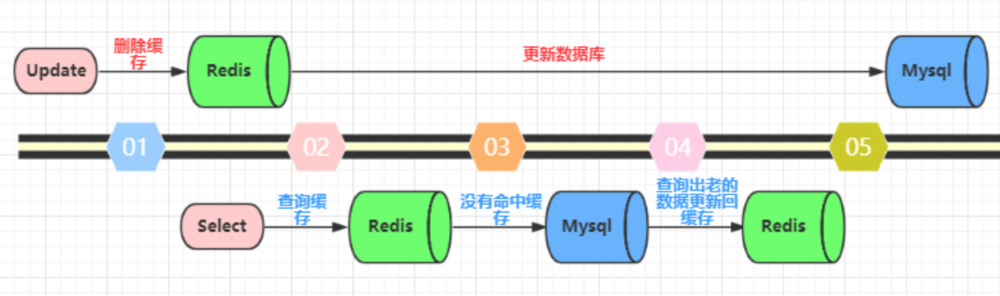

**先更新数据库，再删除缓存。**这种做法其实不能算是坑，在实际的系统中也推荐使用这种方式。但是这种方式理论上还是可能存在问题。如下图（以Redis和Mysql为例），查询操作没有命中缓存，然后查询出数据库的老数据。此时有一个并发的更新操作，更新操作在读操作之后更新了数据库中的数据并且删除了缓存中的数据。然而读操作将从数据库中读取出的老数据更新回了缓存。这样就会造成数据库和缓存中的数据不一致，应用程序中读取的都是原来的数据（脏数据）。

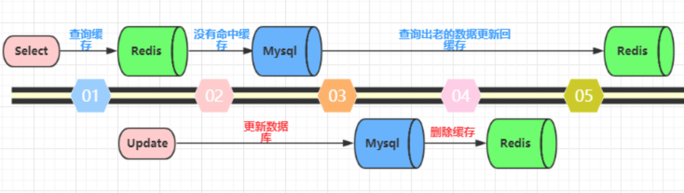

但是，仔细想一想，这种并发的概率极低。因为这个条件需要发生在读缓存时缓存失效，而且有一个并发的写操作。实际上数据库的写操作会比读操作慢得多，而且还要加锁，而读操作必需在写操作前进入数据库操作，又要晚于写操作更新缓存，所有这些条件都具备的概率并不大。但是为了避免这种极端情况造成脏数据所产生的影响，我们还是要为缓存设置过期时间。

- Read-through 通读

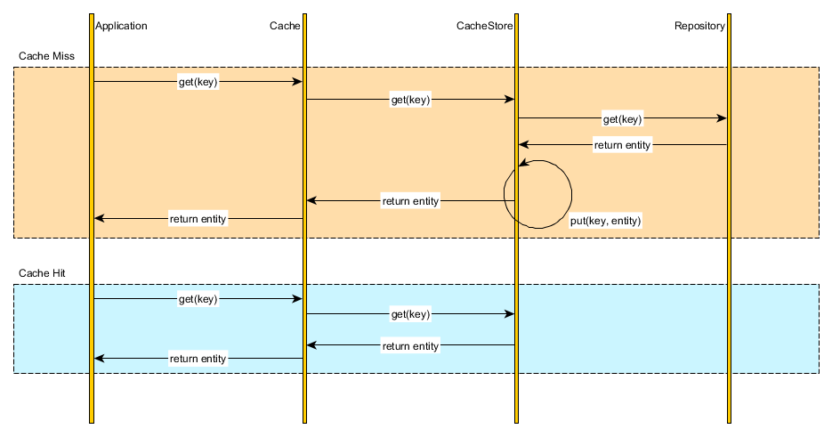

- Write-through 通写

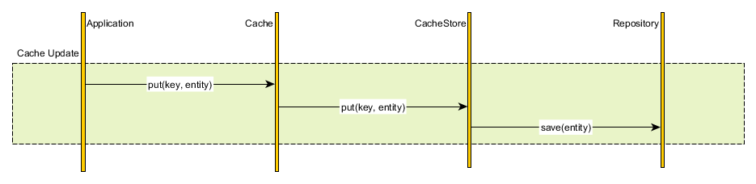

- Write-behind caching

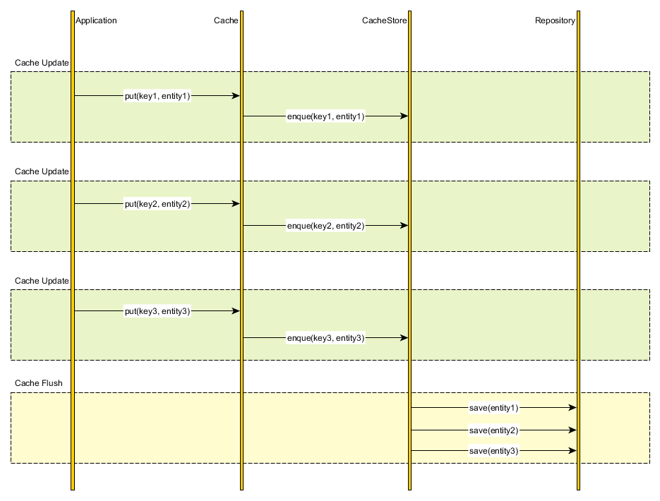

## 缓存问题

- 缓存穿透

缓存只是为了缓解数据库压力而添加的一层保护层，当从缓存中查询不到我们需要的数据就要去数据库中查询了。如果被黑客利用，频繁去访问缓存中没有的数据，那么缓存就失去了存在的意义，瞬间所有请求的压力都落在了数据库上，这样会导致数据库连接异常。

解决方案：

```
1约定:对于返回为NULL的可以缓存默认值，对于抛出异常的返回不进行缓存,注意不要把抛异常的也给缓存了。采用这种手段的会增加我们缓存的维护成本，需要在插入缓存的时候删除这个空缓存，当然我们可以通过设置较短的超时时间来解决这个问题。

2. 制定一些规则过滤一些不可能存在的数据，小数据用BitMap，大数据可以用布隆过滤器，比如你的订单ID 明显是在一个范围1-1000，如果不是1-1000之内的数据那其实可以直接给过滤掉。
```

- 缓存雪崩

缓存雪崩是指缓存不可用或者大量缓存由于超时时间相同在同一时间段失效，大量请求直接访问数据库，数据库压力过大导致系统雪崩。

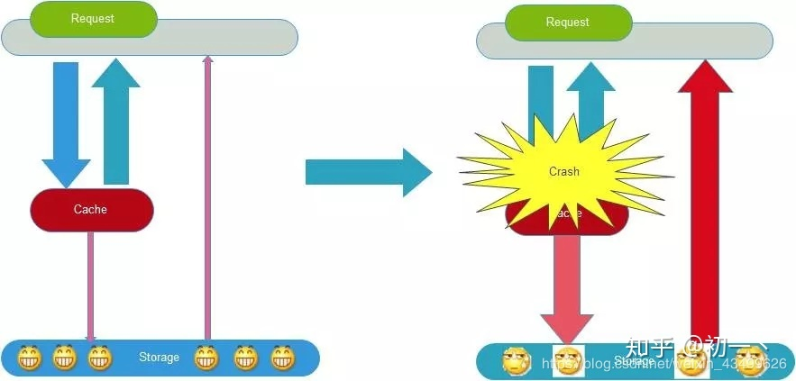

解决方案：
```
# 实施技术
1给缓存加上一定区间内的随机生效时间，不同的key设置不同的失效时间，避免同一时间集体失效。比如以前是设置10分钟的超时时间，那每个Key都可以随机8-13分钟过期，尽量让不同Key的过期时间不同。
2采用多级缓存，不同级别缓存设置的超时时间不同，及时某个级别缓存都过期，也有其他级别缓存兜底。
3利用加锁或者队列方式避免过多请求同时对服务器进行读写操作。

# 综合业务
1收缩业务提供范围，保障重点客户服务
2定期缓存备份，故障时重启
3提前演练异常，及时解决
```
## 缓存实现

缓存的数据类型、有效期、淘汰策略及持久存储问题等见缓存具体实现，如redis和django/Flask