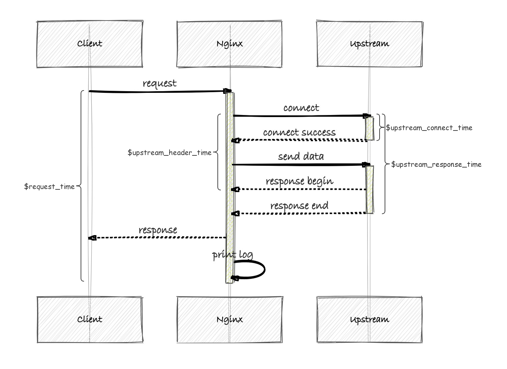

# Nginx使用

## 时间

[参考1](https://blog.csdn.net/zzhongcy/article/details/105819628)

[参考2](https://baijiahao.baidu.com/s?id=1736919580181978261&wfr=spider&for=pc)

### 定义

一个完整HTTP请求(非keep alive)生命周期的多个阶段（以下C指代客户端，N指代nginx服务器，S指代上游server）：

```
1. C向N发起TCP三次握手建立连接成功，C开始向N通过TCP发送HTTP请求具体数据(header/body...)
2. N开始接收到C发送的数据到全部接收完成
3. N作为代理向S发起TCP三次握手并建立连接成功，N开始向S发送HTTP数据
4. S开始接收N发送的数据并全部接收完成
5. S业务代码根据业务规则进行处理完成并生成HTTP响应结果
6. S开始将响应结果发送给N
7. N开始接收响应结果并接收header部分完成
8. N接收S返回的全部响应结果完成
9. N开始向C返回全部的HTTP响应结果
10. C开始接收N返回的数据并全部接收完成
11. N向C发起四次挥手关闭TCP连接

1~2和9～11速度直接受到C到N之间的网络质量影响，服务端虽然可以通过降低传输数据量、使用更快的协议(如HTTP3.0基于QUIC)等降低传输耗时，但无法起到决定性的作用，一般可视为超出了可优化的控制范围
3-8这6个阶段一般都发生在内网，即N与S都处于同一个机房(甚至同一个机架/同一台物理机上)，网络质量稳定且RTT基本在1ms内，网络耗时较少。
正常情况下其主要时间应集中在阶段5--各种业务逻辑处理数据并生成结果--这也正是一般后端优化的目标阶段。
```

`request_time`

```
单位s，2~10
起始时间为N接收到TCP包触发第一次可读event后，应用层正式读取数据前的时刻，而结束时间为应用层接收完全部数据，即将关闭连接前一时刻，即包括阶段2~10，不包括TCP四次挥手的时间。
```

`upstream_response_time`

```
单位s
起始时刻为N与S将建立连接前一刻，结束时间为N接收完S全部响应数据将关闭连接前一刻，即阶段3~10。
从上面的描述可以看出，$request_time肯定比$upstream_response_time值大；尤其是在客户端采用POST方式提交较大的数据，响应体比较大的时候。在客户端网络条件差的时候，$request_time还会被放大。
```

`upstream_connect_time`

```
单位s，3
起始时刻为N将与S建立连接前一刻，结束时刻为N与S建立连接成功后
```

`upstream_header_time`

```
单位s，3～7
起始时刻应为N与S将建立连接前一刻，结束时刻为建立连接成功并在应用层接收header数据完成
```

### 流程



程序的真正运行时间

```
程序真正的运行时间 = $upstream_header_time - $upstream_connect_time
$request_time 中包含了数据返回时间
$request_time 中包含了日志打印的时间
```

- 常见状况

`request_time`很大，但是`upstream_response_time`正常

```
upstream_response_time正常，说明程序执行完毕且正常返回，那么这个时候需要验证是数据返回过慢还是日志打印出现了阻塞。

原因：
数据返回慢可以通过抓包分析，通常来说是用户网络原因引起的；
日志打印出现阻塞，可能是机器io出现了问题，这个一般很容易发现；
还有可能是nginx配置了相关参数，导致了延迟关闭，这里只要根据问题现象一步一步排查即可。
也可能返回给客户端是https，大数据加解密耗时

解决方法
把你的服务器放在high-speed network高性能网络上，让client能够快速访问
使用缓存CND、Nginx缓存
或者将你的服务器靠近用户，多IDC进行对不同区域用户服务。如：中国IDC、韩国IDC
去掉一些低效率算法
调整服务器的TCP堆栈. 然而调整TCP堆栈不会有多大作用，因为内核默认配置已经做了优化调整了。
```

`upstream_header_time`正常，但是`request_time、upstream_response_time`很大

```
上游程序执行较慢、或发送数据量大，需要排查执行程序的相关慢日志
```

`upstream_connect_time`很大

```
可能是网络通信出现了问题
```

`upstream_header_time`很小，但是`upstream_response_time`很大

```
可能是数据回写nginx出现了问题
```

### 测试

命令

```shell
curl -o /dev/null -s -w speed_download:%{speed_download},"\n"time_namelookup:%{time_namelookup},"\n"time_connect:%{time_connect},"\n"time_pretransfer:%{time_pretransfer},"\n"time_starttransfer:%{time_starttransfer},"\n"time_total:%{time_total},"\n" "http://XXXX"
```

说明

```shell
time_namelookup
# DNS 域名解析的时候，就是把域名(http)转换成 ip 地址的过程
time_connect
# TCP 连接建立的时间，就是三次握手的时间
time_appconnect
# SSL/SSH 等上层协议建立连接的时间，比如 connect/handshake 的时间
time_redirect
# 从开始到最后一个请求事务的时间
time_pretransfer
# 从请求开始到响应开始传输的时间
time_starttransfer
# 从请求开始到第一个字节将要传输的时间
time_total
# 这次请求花费的全部时间
```

