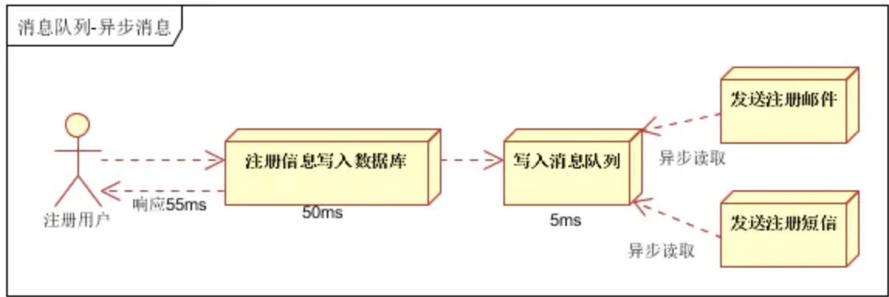
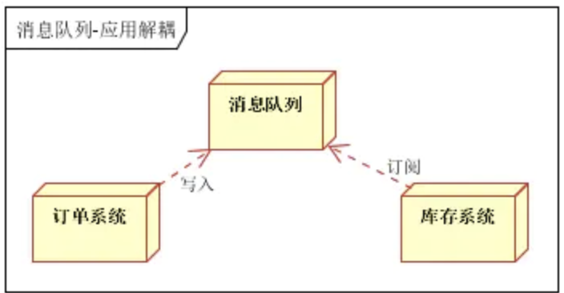
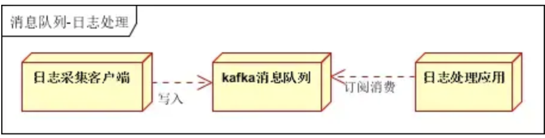
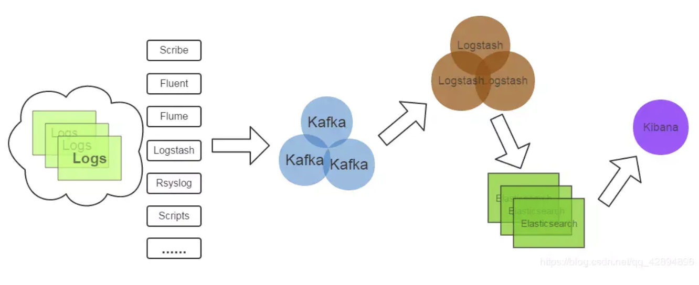
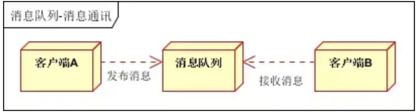
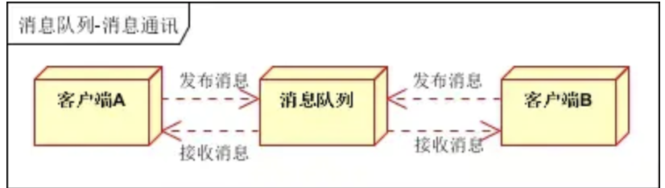
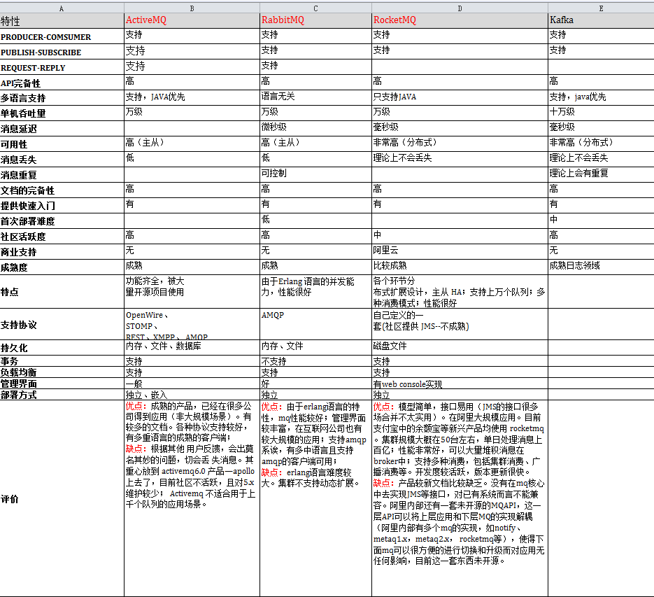

# 消息队列

[参考](https://blog.csdn.net/zhaohong_bo/article/details/90602135) [参考](https://www.jianshu.com/p/251b76643d47) [参考](https://blog.csdn.net/weixin_34310369/article/details/91924432)

**消息队列**是分布式系统中的重要组件，主要解决应用耦合、异步消息、流量削峰等问题。实现高性能、高可用、可伸缩和最终一致性架构。常见的消息队列有ActiveMQ、RabbitMQ、ZeroMQ、Kafka、MetaMQ和RocketMQ。

**MQTT**(消息队列遥测传输)是ISO 标准(ISO/IEC PRF 20922)下基于发布/订阅范式的消息协议。它工作在TCP/IP协议族上，是为硬件性能低下的远程设备以及网络状况糟糕的情况下而设计的发布/订阅型消息协议，为此，它需要一个消息中间件。Mosquitto、RabbitMQ、ActiveMQ和ZeroMQ都是极好的消息中间件

## 应用场景

### 异步处理

用户注册后，需要发注册邮件和注册短信。

- 传统的做法

**串行方式**：将注册信息写入数据库成功后，发送注册邮件，再发送注册短信。以上三个任务全部完成后，返回给客户。

**并行方式**：将注册信息写入数据库成功后，发送注册邮件的同时，发送注册短信。以上三个任务完成后，返回给客户端。与串行的差别是，并行的方式可以提高处理的时间。

假设三个业务节点每个使用50毫秒钟，不考虑网络等其他开销，则串行方式的时间是150毫秒，并行的时间可能是100毫秒。

因为CPU在单位时间内处理的请求数是一定的，假设CPU1秒内吞吐量是100次。则串行方式1秒内CPU可处理的请求量是7次（1000/150）。并行方式处理的请求量是10次（1000/100）

- 引入消息队列

将不是必须的业务逻辑，异步处理。改造后的架构如下

按照以上约定，用户的响应时间相当于是注册信息写入数据库的时间，也就是50毫秒。注册邮件，发送短信写入消息队列后，直接返回，因此写入消息队列的速度很快，基本可以忽略，因此用户的响应时间可能是50毫秒。因此架构改变后，系统的吞吐量提高到每秒20 QPS。比串行提高了3倍，比并行提高了两倍

### 应用解耦

用户下单后，订单系统需要通知库存系统。

- 传统的做法

订单系统调用库存系统的接口。

存在如下缺点：1. 假如库存系统无法访问，则订单减库存将失败，从而导致订单失败；2.订单系统与库存系统耦合

- 引入消息队列

订单系统：用户下单后，订单系统完成持久化处理，将消息写入消息队列，返回用户订单下单成功

库存系统：订阅下单的消息，采用拉/推的方式，获取下单信息，库存系统根据下单信息，进行库存操作

假如：在下单时库存系统不能正常使用。也不影响正常下单，因为下单后，订单系统写入消息队列就不再关心其他的后续操作了。实现订单系统与库存系统的应用解耦。

### 流量削峰

流量削锋也是消息队列中的常用场景，一般在秒杀或团抢活动中使用广泛。秒杀活动，一般会因为流量过大，导致流量暴增，应用挂掉。

- 引入消息队列

一般需要在应用前端加入消息队列。可以控制活动的人数；可以缓解短时间内高流量压垮应用。

用户的请求，服务器接收后，首先写入消息队列。假如消息队列长度超过最大数量，则直接抛弃用户请求或跳转到错误页面

秒杀业务根据消息队列中的请求信息，再做后续处理

### 日志处理

日志处理是指将消息队列用在日志处理中，比如Kafka的应用，解决大量日志传输的问题。

- 架构简化如下

日志采集客户端，负责日志数据采集，定时写入Kafka队列；

Kafka消息队列，负责日志数据的接收，存储和转发；

日志处理应用：订阅并消费kafka队列中的日志数据。

- 新浪kafaka日志处理应用案例

**Kafka**：接收用户日志的消息队列；

**Logstash**：做日志解析，统一成JSON输出给Elasticsearch；

**Elasticsearch**：实时日志分析服务的核心技术，一个schemaless，实时的数据存储服务，通过index组织数据，兼具强大的搜索和统计功能；

**Kibana**：基于Elasticsearch的数据可视化组件，超强的数据可视化能力是众多公司选择ELK stack的重要原因。

### 消息通讯

消息通讯是指，消息队列一般都内置了高效的通信机制，因此也可以用在纯的消息通讯。比如实现点对点消息队列，或者聊天室等。

- 点对点通讯

客户端A和客户端B使用同一队列，进行消息通讯。

- 聊天室通讯

客户端A，客户端B，客户端N订阅同一主题，进行消息发布和接收。实现类似聊天室效果。

## 常用组件

### 概述

**Kafka**是linkedin开源的MQ系统，主要特点是基于Pull的模式来处理消息消费，追求高吞吐量，一开始的目的就是用于日志收集和传输，0.8开始支持复制，不支持事务，适合产生大量数据的互联网服务的数据收集业务。

**RabbitMQ**是使用Erlang语言开发的开源消息队列系统，基于AMQP协议来实现。AMQP的主要特征是面向消息、队列、路由（包括点对点和发布/订阅）、可靠性、安全。AMQP协议更多用在企业系统内，对数据一致性、稳定性和可靠性要求很高的场景，对性能和吞吐量的要求还在其次。

**RocketMQ**是阿里开源的消息中间件，它是纯Java开发，具有高吞吐量、高可用性、适合大规模分布式系统应用的特点。RocketMQ思路起源于Kafka，但并不是Kafka的一个Copy，它对消息的可靠传输及事务性做了优化，目前在阿里集团被广泛应用于交易、充值、流计算、消息推送、日志流式处理、binglog分发等场景。

**ZeroMQ**只是一个网络编程的Pattern库，将常见的网络请求形式（分组管理，链接管理，发布订阅等）模式化、组件化，简而言之socket之上、MQ之下。对于MQ来说，网络传输只是它的一部分，更多需要处理的是消息存储、路由、Broker服务发现和查找、事务、消费模式（ack、重投等）、集群服务等。

**ActiveMQ**类似于ZemoMQ，它可以部署于代理模式和P2P模式。类似于RabbitMQ，它易于实现高级场景，而且只需付出低消耗。它被誉为消息中间件的“瑞士军刀”。要注意一点，ActiveMQ的下一代产品为**Apollo**。

**Mosquitto**是一款实现了消息推送协议 MQTT v3.1/v3.1.1 的开源消息代理软件,提供轻量级的,支持可发布/可订阅的的消息推送模式,使设备对设备之间的短消息通信变得简单,比如现在应用广泛的低功耗传感器, 手机、嵌入式计算机、微型控制器等移动设备。

**Redis**是一个基于Key-Value对的NoSQL数据库，开发维护很活跃。虽然它是一个Key-Value数据库存储系统，但它本身支持MQ功能，所以完全可以当做一个轻量级的队列服务来使用。

### 对比

对于RabbitMQ和Redis的入队和出队操作，各执行100万次，每10万次记录一次执行时间。测试数据分为128Bytes、512Bytes、1K和10K四个不同大小的数据。实验表明：入队时，当数据比较小时Redis的性能要高于RabbitMQ，而如果数据大小超过了10K，Redis则慢的无法忍受；出队时，无论数据大小，Redis都表现出非常好的性能，而RabbitMQ的出队性能则远低于Redis。

ZeroMQ 和 RabbitMQ/Kafka 不同，它只是一个异步消息库，在套接字的基础上提供了类似于消息代理的机制。使用 ZeroMQ 的话，需要对自己的业务代码进行改造，不利于服务解耦。

RabbitMQ 支持 AMQP（二进制），STOMP（文本），MQTT（二进制），HTTP（里面包装其他协议）等协议。

Kafka 使用自己的协议。Kafka 自身服务和消费者都需要依赖 Zookeeper。

RabbitMQ 在有大量消息堆积的情况下性能会下降，Kafka不会。毕竟AMQP设计的初衷不是用来持久化海量消息的，而Kafka一开始是用来处理海量日志的。

- 对比图1

- 对比图2

[本页](https://github.com/mqtt/mqtt.github.io/wiki/server-support)试图记录各种MQTT服务器（代理）支持的特性。这是针对它们对MQTT的支持；其中很多服务器具有比MQTT更广泛的功能。

| Server                                                       | QoS 0 | QoS 1 | QoS 2 | auth                                              | [Bridge](https://github.com/mqtt/mqtt.github.io/wiki/bridge_protocol) | [$SYS](https://github.com/mqtt/mqtt.github.io/wiki/conventions#%24sys) | SSL  | [Dynamic topics](https://github.com/mqtt/mqtt.github.io/wiki/are_topics_dynamic) | cluster | websockets | plugin system | Mqtt 5 support | Active development |
| ------------------------------------------------------------ | ----- | ----- | ----- | ------------------------------------------------- | ------------------------------------------------------------ | ------------------------------------------------------------ | ---- | ------------------------------------------------------------ | ------- | ---------- | ------------- | -------------- | ------------------ |
| [Aedes](https://github.com/moscajs/aedes)                    | ✔     | ✔     | ✔     | Username/Password                                 | **rm**                                                       | ✔                                                            | ✔    | ✔                                                            | ✔       | ✔          | ✔             | ✘              | ✔                  |
| [AWS IoT Services](https://aws.amazon.com/en/iot/)           | ✔     | ✔     | ✔     | Client certificates                               | ?                                                            | ✘                                                            | ✔    | §                                                            | ✔       | ✔          | ✘             | ✘              | ✔                  |
| [Apache ActiveMQ Artemis](http://activemq.apache.org/)       | ✔     | ✔     | ✔     | JAAS                                              | ✘                                                            | ✘                                                            | ✔    | ✔                                                            | ✔       | ✔          | ✔             | ✘              | ✔                  |
| [BevywiseIoTPlatform](https://www.bevywise.com/iot-platform/) | ✔     | ✔     | ✔     | Key based                                         | ✔                                                            | ✔                                                            | ✔    | ✔                                                            | ✔       | ✔          | **rm**        | ✘              | ✔                  |
| [ClearBlade](https://clearblade.com/)                        | ✔     | ✔     | ✔     | OAuth based User/Pass & Per-channel authorization | ?                                                            | ✔                                                            | ✔    | ✔                                                            | ✔       | ✔          | ?             | ✘              | ✔                  |
| [ejabberd](https://www.process-one.net/en/ejabberd)          | ✔     | ✔     | ✔     | ✔                                                 | ✔                                                            | ✔                                                            | ✔    | ✔                                                            | ✔       | ✔          | ✔             | ✔              | ✔                  |
| [emitter](https://github.com/emitter-io/emitter)             | ✔     | ✘     | ✘     | Per-channel authorization                         | ✘                                                            | ✘                                                            | ✔    | ✔                                                            | ✔       | ✔          | ✘             | ✘              | ✔                  |
| [EMQ X](https://www.emqx.io/)                                | ✔     | ✔     | ✔     | Username/Password, JWT, LDAP, ClientID, ...       | ✔                                                            | ✔                                                            | ✔    | ✔                                                            | ✔       | ✔          | ✔             | ✔              | ✔                  |
| [flespi](https://flespi.com/mqtt-broker)                     | ✔     | ✔     | ✔     | ✔                                                 | ✘                                                            | ✘                                                            | ✔    | ✔                                                            | ✔       | ✔          | ✘             | ✘              | ✔                  |
| [GnatMQ / M2MQTT](https://github.com/ppatierno/gnatmq)       | ✔     | ✔     | ✔     | Username/Password                                 | ✘                                                            | ✘                                                            | ✔    | ✔                                                            | ✘       | ✘          | ✘             | ✘              | ✔                  |
| [HBMQTT](https://github.com/beerfactory/hbmqtt)              | ✔     | ✔     | ✔     | Username/Password, Client certificates            | ✔                                                            | ✔                                                            | ✔    | ✔                                                            | ✘       | ✔          | ✔             | ✘              | ✔                  |
| [HiveMQ](http://www.hivemq.com/)                             | ✔     | ✔     | ✔     | Username/Password                                 | ✔                                                            | ✔                                                            | ✔    | ✔                                                            | ✔       | ✔          | ✔             | ✔              | ✔                  |
| [IBM IoT MessageSight](https://www.ibm.com/downloads/cas/QXL3EAWJ) | ✔     | ✔     | ✔     | Username/Password                                 | ✔                                                            | ✔                                                            | ✔    | ✔                                                            | ✔       | ✔          | ✔             | ✘              | ✔                  |
| [IBM Watson IoT Platform](https://www.ibm.com/us-en/marketplace/watson-iot-platform-message-gateway) | ✔     | ✔     | ✔     | ✔                                                 | ✔                                                            | ✔                                                            | ✔    | ✔                                                            | ✔       | ✔          | ✔             | ✘              | ✔                  |
| [IBM WebSphere MQ Middleware](https://www.ibm.com/support/knowledgecenter/SSFKSJ_7.5.0/com.ibm.mq.pro.doc/q001020_.htm) | ✔     | ✔     | ✔     | Username/Password, client certificate             | ✔                                                            | ✔                                                            | ✔    | ✔                                                            | ✔       | ✔          | ✘             | ✘              | ✔                  |
| [Jmqtt](https://github.com/Cicizz/jmqtt)                     | ✔     | ✔     | ✔     | Username/Password, Client certificates            | ✔                                                            | ✔                                                            | ✔    | ✔                                                            | ✘       | ✔          | ✔             | ✘              | ✔                  |
| [JoramMQ](http://mqtt.jorammq.com/)                          | ✔     | ✔     | ✔     | ✔                                                 | ✔                                                            | ✔                                                            | ✔    | ✔                                                            | ✔       | ✔          | ✔             | ✘              | ✘                  |
| [Mongoose](https://github.com/cesanta/mongoose)              | ✔     | ✔     | ✔     | ✔                                                 | ✔                                                            | ✘                                                            | ✔    | ✔                                                            | ✘       | ✔          | ✔             | ✘              | ✔                  |
| [moquette](https://github.com/andsel/moquette)               | ✔     | ✔     | ✔     | ?                                                 | ✔                                                            | ✘                                                            | ✔    | ✔                                                            | **rm**  | ✔          | ✘             | ✘              | ✔                  |
| [mosca](https://github.com/moscajs/mosca)                    | ✔     | ✔     | ✘     | ✔                                                 | ✘                                                            | ✘                                                            | ✔    | ✔                                                            | ✘       | ✔          | ✘             | ✘              | ✘                  |
| [mosquitto](https://mosquitto.org/)                          | ✔     | ✔     | ✔     | ✔                                                 | ✔                                                            | ✔                                                            | ✔    | ✔                                                            | §       | ✔          | ✔             | ✘              | ✔                  |
| [MQTT.js](https://github.com/mqttjs/MQTT.js)                 | ✔     | ✔     | ✔     | §                                                 | ✘                                                            | ✘                                                            | ✔    | ✔                                                            | ✘       | ✔          | ✘             | ✘              | ✔                  |
| [MQTTnet](https://github.com/chkr1011/MQTTnet)               | ✔     | ✔     | ✔     | §                                                 | §                                                            | §                                                            | ✔    | ✔                                                            | §       | §          | §             | **rm**         | ✔                  |
| [MqttWk](https://github.com/Wizzercn/MqttWk)                 | ✔     | ✔     | ✔     | ✔                                                 | ✔                                                            | ?                                                            | ✔    | ✔                                                            | ✔       | ✔          | ✘             | ✘              | ✔                  |
| [RabbitMQ](http://www.rabbitmq.com/blog/2012/09/12/mqtt-adapter/) | ✔     | ✔     | ✘     | SASL                                              | ✘                                                            | ✘                                                            | ✔    | ✔                                                            | ✔       | ✔          | ✔             | ✘              | ✔                  |
| [Software AG Universal Messaging](https://www.softwareag.com/de/products/az/universal_messaging/default.html) | ✔     | ✔     | ✔     | ✔                                                 | §                                                            | ✘                                                            | ✔    | ✔                                                            | §       | **rm**     | ✘             | ✘              | ✔                  |
| [Solace](http://dev.solacesystems.com/tech)                  | ✔     | ✔     | ✘     | Basic, client certificate, Kerberos               | §                                                            | ✔                                                            | ✔    | ✔                                                            | ✔       | ✔          | ✘             | ✘              | ✔                  |
| [SwiftMQ](http://www.swiftmq.com/landing/router/index.html)  | ✔     | ✔     | ✔     | ✔                                                 | ✔                                                            | ✘                                                            | ✔    | ✔                                                            | ✔       | ✘          | ✔             | ✘              | ✔                  |
| [TraferoTstack](https://github.com/trafero/tstack)           | ✔     | ✔     | ✔     | ✔                                                 | ✘                                                            | ✘                                                            | ✔    | ✔                                                            | ✘       | ✘          | ✘             | ✘              | ✘                  |
| [VerneMQ](https://vernemq.com/)                              | ✔     | ✔     | ✔     | Username/Password                                 | ✔                                                            | ✔                                                            | ✔    | ✔                                                            |         |            |               |                |                    |

> 功能

QoS 0：服务质量 0，最多传输一次。
QoS 1：服务质量1，至少传输一次。
QoS 2：服务质量2，仅仅传输一次。
auth：验证，身份验证授权。
bridge：桥接，服务器代理之间连接
$SYS：主题过滤器通配符，订阅后能够接收到所有以此通配符开头的主题的消息。
dynamic topics：动态主题
cluster：集群

> 说明

✔表示：支持✘表示：不支持？表示：未知§表示：查看限制rm表示：路线图（计划中）

- 已淘汰或已停产的软件/服务

2lemetry被Amazon AWS秘密收购，请参阅[techcrunch文章](https://techcrunch.com/2015/03/12/amazon-has-quietly-acquired-2lemetry-to-build-out-its-internet-of-things-strategy/?guccounter=1).。

Apache ActiveMQ Apollo已停产，请参阅[此链接](http://activemq.2283324.n4.nabble.com/Is-Apollo-Support-Cluster-Deployment-td4699916.html).。

JoramMQ似乎已停产。

IBM IoT Message gateway现在是IBM Watson IoT Platform](https://www.ibm.com/us-en/marketplace/watson-iot-platform-message-gateway)。

mosca已停产。

RSMB现在是Software AG Universal Messaging。但是，文档非常糟糕。

TraferoTstack自2017年以来未更新，因此未真正维护过。

- 限制

AWS IoT Services保留一些以`$`开头的主题。

ClearBlade保留一些以`$`开头的主题。

mosquitto集群是在后端级别（redis，amqp等）实现的。

MQTT.js将接受提供的用户名和密码进行的连接，但实际上不对连接进行身份验证。

Software AG Universal Messaging提供主动/主动群集（通过专有协议）和桥接（通过专有协议）。

Solace确实在经纪人之间提供了专有的桥梁解决方案。

MQTTnet提供了客户端和服务器实现。所有功能都可以根据需要扩展（或保留）。这主要面向.Net开发人员，以构建其自定义服务器和客户端实现。但是，该标准已经提供了许多功能。

## kRR对比

### 性能对比

- kafaka

Kafka的吞吐量高达17.3w/s。这主要取决于它的队列模式保证了写磁盘的过程是顺序IO。此时broker磁盘IO已达瓶颈。

- RabbitMQ

RabbitMQ的吞吐量5.95w/s，CPU资源消耗较高。它支持AMQP协议，实现非常重量级，为了保证消息的可靠性而降低了吞吐量。RabbitMQ在消息持久化场景下，吞吐量在2.6w/s左右。

- RocketMQ

RocketMQ吞吐量在11.6w/s，磁盘IO %util已接近100%。RocketMQ的消息写入内存后即返回ack，由单独的线程专门做刷盘操作，所有的消息均是顺序写文件。

### 消息存储

- Kafka

内存、磁盘、数据库。支持大量堆积。

Kafka的最小存储单元是分区，一个topic包含多个分区，在创建主题时，这些分区被分配在多个服务器上，通常一个broker一台服务器。

分区首先会均匀地分布在不同的服务器上，分区副本也会均匀的分布在不同的服务器上，确保负载均衡和高可用性，当新的broker加入集群的时候，部分副本会被移动到新的broker上。

根据配置文件中的目录清单，Kafka会把新的分区分配给目录清单里分区数最少的目录。

默认情况下，分区器使用轮询算法把消息均衡地分布在同一个主题的不同分区中，对于发送时指定了key的情况，会根据key的hashcode取模后的值存到对应的分区中。

- RabbitMQ

内存、磁盘。支持少量堆积。

RabbitMQ的消息分为持久化的消息和非持久化消息，不管是持久化的消息还是非持久化的消息都可以写入到磁盘。

持久化的消息在到达队列时就写入到磁盘，并且如果可以，持久化的消息也会在内存中保存一份备份，这样可以提高一定的性能，当内存吃紧的时候会从内存中清除。

非持久化的消息一般只存在于内存中，在内存紧张的时候会被换入到磁盘中，以节省内存。

引入镜像队列机制，可将重要队列“复制”到集群其他broker上，保证这些队列的消息不会丢失。

- RocketMQ

磁盘。支持大量堆积。

commitLog文件存放实际的消息数据，每个commitLog上限是1G，满了之后会自动新建一个commitLog文件保存数据。

ConsumeQueue队列只存放offset、size、tagcode，非常小，分布在多个broker上。

ConsumeQueue相当于CommitLog的索引文件，消费者消费时会从consumeQueue中查找消息在commitLog中的offset，再去commitLog中查找元数据。

ConsumeQueue存储格式的特性，保证了写过程的顺序写盘（写CommitLog文件），大量数据IO都在顺序写同一个commitLog，满1G了再写新的。

加上RocketMQ是累计4K才强制从PageCache中刷到磁盘（缓存），所以高并发写性能突出。

### 负载均衡

- Kafka

支持负载均衡。

1）一个broker通常就是一台服务器节点

对于同一个Topic的不同分区，Kafka会尽力将这些分区分布到不同的Broker服务器上，zookeeper保存了broker、主题和分区的元数据信息。

分区首领会处理来自客户端的生产请求，Kafka分区首领会被分配到不同的broker服务器上，让不同的broker服务器共同分担任务。

每一个broker都缓存了元数据信息，客户端可以从任意一个broker获取元数据信息并缓存起来，根据元数据信息知道要往哪里发送请求。

2）Kafka的消费者组订阅同一个topic，会尽可能地实现每个消费者分配到相同数量的分区，分摊负载。

当消费者加入或者退出消费者组的时候，还会触发再均衡，为每一个消费者重新分配分区，分摊负载。

Kafka的负载均衡大部分是自动完成的，分区的创建也是Kafka完成的，隐藏了很多细节，避免了繁琐的配置和人为疏忽造成的负载问题。

3）发送端由topic和key来决定消息发往哪个分区，如果key为null，那么会使用轮询算法将消息均衡地发送到同一个topic的不同分区中。如果key不为null，那么会根据key的hashcode取模计算出要发往的分区。

- RabbitMQ

对负载均衡的支持不好。

1）消息被投递到哪个队列是由交换器和key决定的，交换器、路由键、队列都需要手动创建。

RabbitMQ客户端发送消息要和broker建立连接，需要事先知道broker上有哪些交换器和队列。

通常要声明要发送的目标队列。假设大部分繁重任务的队列都创建在同一个broker上，那么这个broker的负载就会过大。

RabbitMQ的备份交换器会把找不到队列的消息保存到一个专门的队列中。

使用镜像队列机制建立RabbitMQ集群可以解决这个问题，形成master-slave的架构，master节点会均匀分布在不同的服务器上，让每一台服务器分摊负载。slave节点只是负责转发，在master失效时会选择加入时间最长的slave成为master。

当新节点加入镜像队列的时候，队列中的消息不会同步到新的slave中，除非调用同步命令，但是调用命令后，队列会阻塞，不能在生产环境中调用同步命令。

2）当RabbitMQ队列拥有多个消费者的时候，队列收到的消息将以轮询的分发方式发送给消费者。每条消息只会发送给订阅列表里的一个消费者，不会重复。

这种方式非常适合扩展，而且是专门为并发程序设计的。

如果某些消费者的任务比较繁重，那么可以设置basicQos限制信道上消费者能保持的最大未确认消息的数量，在达到上限时，RabbitMQ不再向这个消费者发送任何消息。

3）对于RabbitMQ而言，客户端与集群建立的TCP连接不是与集群中所有的节点建立连接，而是挑选其中一个节点建立连接。

但是RabbitMQ集群可以借助HAProxy、LVS技术，或者在客户端使用算法实现负载均衡，引入负载均衡之后，各个客户端的连接可以分摊到集群的各个节点之中。

- RocketMQ

支持负载均衡。

一个broker通常是一个服务器节点，broker分为master和slave，master和slave存储的数据一样，slave从master同步数据。

1）nameserver与每个集群成员保持心跳，保存着Topic-Broker路由信息，同一个topic的队列会分布在不同的服务器上。

2）发送消息通过轮询队列的方式发送，每个队列接收平均的消息量。发送消息指定topic、tags、keys，无法指定投递到哪个队列（没有意义，集群消费和广播消费跟消息存放在哪个队列没有关系）。
 tags选填，类似于 Gmail 为每封邮件设置的标签，方便服务器过滤使用。
 keys选填，代表这条消息的业务关键词，服务器会根据 keys 创建哈希索引，设置后，可以在 Console 系统根据 Topic、Keys 来查询消息，由于是哈希索引，需保证 key 唯一。

3）RocketMQ的负载均衡策略规定：

Consumer数量应该小于等于Queue数量，如果Consumer超过Queue数量，那么多余的Consumer 将不能消费消息。

这一点和Kafka是一致的，RocketMQ会尽可能地为每一个Consumer分配相同数量的队列，分摊负载。

### 集群方式

- Kafka

天然的‘Leader-Slave’无状态集群，每台服务器既是Master也是Slave。

分区首领均匀地分布在不同的Kafka服务器上，分区副本也均匀地分布在不同的Kafka服务器上，所以每一台Kafka服务器既含有分区首领，同时又含有分区副本。

每一台Kafka服务器是某一台Kafka服务器的Slave，同时也是某一台Kafka服务器的leader。

Kafka的集群依赖于zookeeper，zookeeper支持热扩展，所有的broker、消费者、分区都可以动态加入移除，而无需关闭服务，与不依靠zookeeper集群的mq相比，这是最大的优势。

- RabbitMQ

支持简单集群，'复制'模式，对高级集群模式支持不好。

RabbitMQ的每一个节点，不管是单一节点系统或者是集群中的一部分，要么是内存节点，要么是磁盘节点，集群中至少要有一个是磁盘节点。

在RabbitMQ集群中创建队列，集群只会在单个节点创建队列进程和完整的队列信息（元数据、状态、内容），而不是在所有节点上创建。

引入镜像队列，可以避免单点故障，确保服务的可用性，但是需要人为地为某些重要的队列配置镜像。

- RocketMQ

常用 多对'Master-Slave' 模式，开源版本需手动切换Slave变成Master。

Name Server是一个几乎无状态节点，可集群部署，节点之间无任何信息同步。

Broker部署相对复杂，Broker分为Master与Slave，一个Master可以对应多个Slave，但是一个Slave只能对应一个Master。

Master与Slave的对应关系通过指定相同的BrokerName，不同的BrokerId来定义，BrokerId为0表示Master，非0表示Slave。

Master也可以部署多个。Broker与Name Server集群中的所有节点建立长连接，定时注册Topic信息到所有Name Server。

Consumer和Producer都会与Name Server集群中的其中一个节点（随机选择）建立长连接，定期从Name Server取Topic路由信息，并向提供Topic服务的Master建立长连接，且定时向Master发送心跳。Producer完全无状态，可集群部署。

Consumer既可以从Master订阅消息，也可以从Slave订阅消息，订阅规则由Broker配置决定。

客户端先找到NameServer, 然后通过NameServer再找到 Broker。

一个topic有多个队列，这些队列会均匀地分布在不同的broker服务器上。RocketMQ队列的概念和Kafka的分区概念是基本一致的，Kafka同一个topic的分区尽可能地分布在不同的broker上，分区副本也会分布在不同的broker上。

RocketMQ集群的slave会从master拉取数据备份，master分布在不同的broker上。

### 订阅发布

- Kafka

基于topic以及按照topic进行正则匹配的发布订阅模式。

1）发送

发送端由topic和key来决定消息发往哪个分区，如果key为null，使用轮询算法将消息均衡地发送到同一个topic的不同分区中。如果key不为null，根据key的hashcode取模计算出要发往的分区。

2）接收

consumer向群组协调器broker发送心跳来维持他们和群组的从属关系以及他们对分区的所有权关系，所有权关系一旦被分配就不会改变除非发生再均衡，consumer只会从对应的分区读取消息。
 Kafka限制consumer个数要少于分区个数,每个消息只会被同一个 Consumer Group的一个consumer消费（非广播）。
 Kafka的 Consumer Group订阅同一个topic，会尽可能地使得每一个consumer分配到相同数量的分区，不同 Consumer Group订阅同一个主题相互独立，同一个消息会被不同的 Consumer Group处理。

- RabbitMQ

提供了4种：direct、topic、headers和fanout。

1）发送

先要声明一个队列，这个队列会被创建或者已经被创建，队列是基本存储单元。

由exchange和key决定消息存储在哪个队列。

- direct 发送到和bindingKey完全匹配的队列。
- topic 路由key是含有"."的字符串，会发送到含有“*”、“#”进行模糊匹配的bingKey对应的队列。
- fanout 与key无关，会发送到所有和exchange绑定的队列
- headers 与key无关，消息内容的headers属性（一个键值对）和绑定键值对完全匹配时，会发送到此队列。此方式性能低一般不用

2）接收

RabbitMQ的队列是基本存储单元，不再被分区或者分片，对于已经创建了的队列，消费端要指定从哪一个队列接收消息。

当RabbitMQ队列拥有多个消费者的时候，队列收到的消息将以轮询的分发方式发送给消费者。每条消息只会发送给订阅列表里的一个消费者，不会重复。

这种方式非常适合扩展，而且是专门为并发程序设计的。

如果某些消费者的任务比较繁重，那么可以设置basicQos限制信道上消费者能保持的最大未确认消息的数量，在达到上限时，RabbitMQ不再向这个消费者发送任何消息。

- RocketMQ

基于topic/messageTag以及按照消息类型、属性进行正则匹配的发布订阅模式。

1）发送

发送消息通过轮询队列的方式发送，每个队列接收平均的消息量。发送消息指定topic、tags、keys，无法指定投递到哪个队列（没有意义，集群消费和广播消费跟消息存放在哪个队列没有关系）。

tags选填，类似于 Gmail 为每封邮件设置的标签，方便服务器过滤使用。目前只支 持每个消息设置一个 tag，所以也可以类比为 Notify 的 MessageType 概念。
 keys选填，代表这条消息的业务关键词，服务器会根据 keys 创建哈希索引，设置后， 可以在 Console 系统根据 Topic、Keys 来查询消息，由于是哈希索引，请尽可能 保证 key 唯一，例如订单号，商品 Id 等。

2）接收

**广播消费：** 一条消息被多个Consumer消费，即使Consumer属于同一个ConsumerGroup，消息也会被ConsumerGroup中的每个Consumer都消费一次。

**集群消费：** 一个 Consumer Group中的Consumer实例平均分摊消费消息。例如某个Topic有 9 条消息，其中一个Consumer Group有3个实例，那么每个实例只消费其中的 3 条消息。即每一个队列都把消息轮流分发给每个consumer。

### 消息确认

- Kafka

支持。

1）生产者确认机制

ack=0，不管消息是否成功写入分区
ack=1，消息成功写入首领分区后，返回成功
ack=all，消息成功写入所有分区后，返回成功。

2）消费者确认机制

自动或者手动提交分区偏移量，早期版本的Kafka偏移量是提交给Zookeeper的，这使得zookeeper的压力比较大，新版本的Kafka的偏移量是提交给Kafka服务器的，不再依赖于zookeeper群组，集群的性能更加稳定。

- RabbitMQ

支持。

1）生产者确认机制，消息被投递到所有匹配的队列后，返回成功。如果消息和队列是可持久化的，那么在写入磁盘后，返回成功。支持批量确认和异步确认。

2）消费者确认机制，设置autoAck为false，需要显式确认，设置autoAck为true，自动确认。

当autoAck为false的时候，RabbitMQ队列会分成两部分，一部分是等待投递给consumer的消息，一部分是已经投递但是没收到确认的消息。

如果一直没有收到确认信号，并且consumer已经断开连接，RabbitMQ会安排这个消息重新进入队列，投递给原来的消费者或者下一个消费者。

未确认的消息不会有过期时间，如果一直没有确认，并且没有断开连接，RabbitMQ会一直等待，RabbitMQ允许一条消息处理的时间可以很久很久。

- RocketMQ

支持。

### 消息重试

- Kafka

不支持，但是可以实现。

Kafka支持指定分区offset位置的回溯，可以实现消息重试。

- RabbitMQ

不支持，但是可以利用消息确认机制实现。

RabbitMQ消费者确认机制，设置autoAck为false。

当autoAck为false的时候，RabbitMQ队列会分成两部分，一部分是等待投递给consumer的消息，一部分是已经投递但是没收到确认的消息。

如果一直没有收到确认信号，并且consumer已经断开连接，RabbitMQ会安排这个消息重新进入队列，投递给原来的消费者或者下一个消费者。

- RocketMQ

支持。

消息消费失败的大部分场景下，立即重试99%都会失败，所以RocketMQ的策略是在消费失败时定时重试，每次时间间隔相同。

1）发送端的 send 方法本身支持内部重试，重试逻辑如下：
 至多重试3次；
 如果发送失败，则轮转到下一个broker；
 这个方法的总耗时不超过sendMsgTimeout 设置的值，默认 10s，超过时间不在重试。

2）接收端。

Consumer 消费消息失败后，要提供一种重试机制，令消息再消费一次。Consumer 消费消息失败通常可以分为以下两种情况：

由于消息本身的原因，例如反序列化失败，消息数据本身无法处理（例如话费充值，当前消息的手机号被注销，无法充值）等。定时重试机制，比如过 10s 秒后再重试。

由于依赖的下游应用服务不可用，例如 db 连接不可用，外系统网络不可达等。即使跳过当前失败的消息，消费其他消息同样也会报错。这种情况可以 sleep 30s，再消费下一条消息，减轻 Broker 重试消息的压力。

### 并发度

- Kafka

并发度高。

一个线程一个消费者，Kafka限制消费者的个数要小于等于分区数，如果要提高并行度，可以在消费者中再开启多线程，或者增加consumer实例数量。

- RabbitMQ

并发度极高。本身是用Erlang语言写的，并发性能高。

可在消费者中开启多线程，最常用的做法是一个channel对应一个消费者，每一个线程把持一个channel，多个线程复用connection的tcp连接，减少性能开销。

当RabbitMQ队列拥有多个消费者的时候，队列收到的消息将以轮询的分发方式发送给消费者。每条消息只会发送给订阅列表里的一个消费者，不会重复。

这种方式非常适合扩展，而且是专门为并发程序设计的。

如果某些消费者的任务比较繁重，那么可以设置basicQos限制信道上消费者能保持的最大未确认消息的数量，在达到上限时，RabbitMQ不再向这个消费者发送任何消息。

- RocketMQ

并发度高。

1）RocketMQ限制消费者的个数少于等于队列数，但是可以在消费者中再开启多线程，这一点和Kafka提高并行度的方法相同。

同一个 ConsumerGroup 下，通过增加 Consumer 实例数量来提高并行度，超过订阅队列数的 Consumer实例无效。
 提高单个 Consumer 的消费并行线程，通过修改参数consumeThreadMin、consumeThreadMax

2）同一个网络连接connection，客户端多个线程可以同时发送请求，连接会被复用，减少性能开销。

