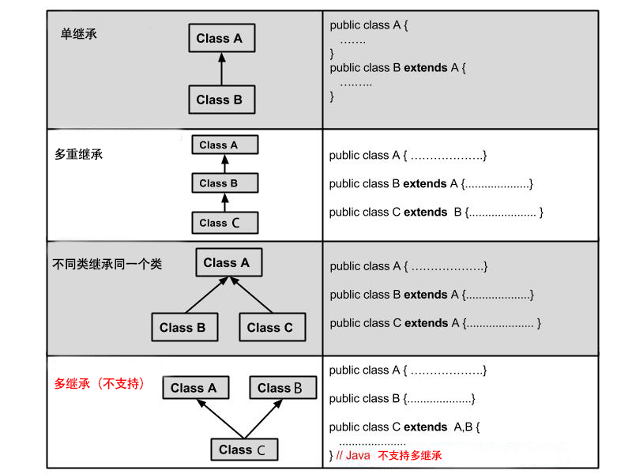

# 继承

继承是java面向对象编程技术的一块基石，因为它允许创建分等级层次的类。

继承就是子类继承父类的特征和行为，使得子类对象（实例）具有父类的实例域和方法，或子类从父类继承方法，使得子类具有父类相同的行为。

## 格式

在 Java 中通过 extends 关键字可以申明一个类是从另外一个类继承而来的，一般形式如下：

```java
class 父类 {
}
 
class 子类 extends 父类 {
}
```

## 类型

需要注意的是 Java 不支持多继承，但支持多重继承。



## 特性

- 子类拥有父类非 private 的属性、方法。
- 子类可以拥有自己的属性和方法，即子类可以对父类进行扩展。
- 子类可以用自己的方式实现父类的方法。
- Java 的继承是单继承，但是可以多重继承，单继承就是一个子类只能继承一个父类，多重继承就是，例如 A 类继承 B 类，B 类继承 C 类，所以按照关系就是 C 类是 B 类的父类，B 类是 A 类的父类，这是 Java 继承区别于 C++ 继承的一个特性。
- 提高了类之间的耦合性（继承的缺点，耦合度高就会造成代码之间的联系越紧密，代码独立性越差）。

## 关键字

继承可以使用 `extends` 和 `implements` 这两个关键字来实现继承，而且所有的类都是继承于` java.lang.Object`，当一个类没有继承的两个关键字，则默认继承object（这个类在 **java.lang** 包中，所以不需要 **import**）祖先类。

- extents

在 Java 中，类的继承是单一继承，也就是说，一个子类只能拥有一个父类，所以 extends 只能继承一个类。

```java
public class Animal { 
    private String name;   
    private int id; 
    public Animal(String myName, String myid) { 
        //初始化属性值
    } 
    public void eat() {  //吃东西方法的具体实现  } 
    public void sleep() { //睡觉方法的具体实现  } 
} 
 
public class Penguin  extends  Animal{ 
}
```

- implements

使用 implements 关键字可以变相的使java具有多继承的特性，使用范围为类继承接口的情况，可以同时继承多个接口（接口跟接口之间采用逗号分隔）。

```java
public interface A {
    public void eat();
    public void sleep();
}
 
public interface B {
    public void show();
}
 
public class C implements A,B {
}
```

- super/this

super关键字：我们可以通过super关键字来实现对父类成员的访问，用来引用当前对象的父类。

this关键字：指向自己的引用。

```java
class Animal {
  void eat() {
    System.out.println("animal : eat");
  }
}
 
class Dog extends Animal {
  void eat() {
    System.out.println("dog : eat");
  }
  void eatTest() {
    this.eat();   // this 调用自己的方法
    super.eat();  // super 调用父类方法
  }
}
 
public class Test {
  public static void main(String[] args) {
    Animal a = new Animal();
    a.eat();
    Dog d = new Dog();
    d.eatTest();
  }
}
```

## 构造器

子类是不继承父类的构造器（构造方法或者构造函数）的，它只是调用（隐式或显式）。

如果父类构造器没有参数，则在子类的构造器中不需要使用`super`关键字调用父类构造器，系统会自动调用父类的无参构造器。

如果父类的构造器带有参数，则必须在子类的构造器中显式地通过 `super`关键字调用父类的构造器并配以适当的参数列表。注意必须为子类构造方法中第一句代码。

```java
class SuperClass {
  private int n;
  SuperClass(){
    System.out.println("SuperClass()");
  }
  SuperClass(int n) {
    System.out.println("SuperClass(int n)");
    this.n = n;
  }
}
// SubClass 类继承
class SubClass extends SuperClass{
  private int n;
  
  SubClass(){ // 自动调用父类的无参数构造器
    System.out.println("SubClass");
  }  
  
  public SubClass(int n){ 
    super(300);  // 调用父类中带有参数的构造器
    System.out.println("SubClass(int n):"+n);
    this.n = n;
  }
}
// SubClass2 类继承
class SubClass2 extends SuperClass{
  private int n;
  
  SubClass2(){
    super(300);  // 调用父类中带有参数的构造器
    System.out.println("SubClass2");
  }  
  
  public SubClass2(int n){ // 自动调用父类的无参数构造器
    System.out.println("SubClass2(int n):"+n);
    this.n = n;
  }
}
public class TestSuperSub{
  public static void main (String args[]){
    System.out.println("------SubClass 类继承------");
    SubClass sc1 = new SubClass();
    SubClass sc2 = new SubClass(100); 
    System.out.println("------SubClass2 类继承------");
    SubClass2 sc3 = new SubClass2();
    SubClass2 sc4 = new SubClass2(200); 
  }
}
```


