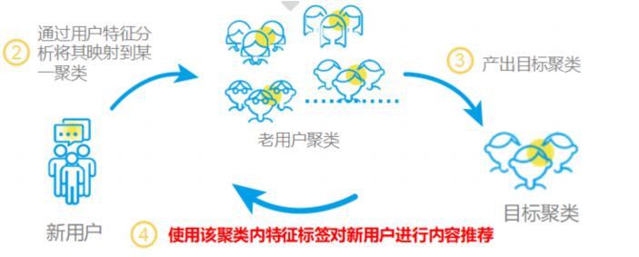
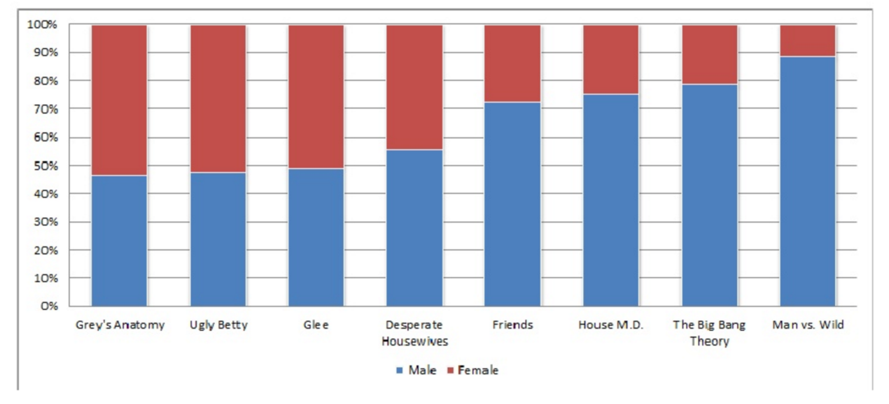
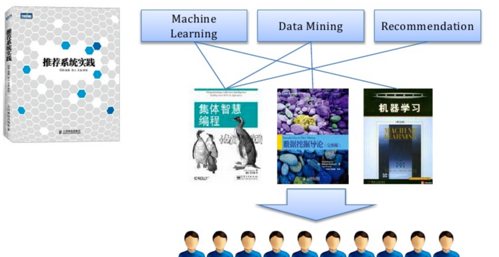

### 推荐系统的冷启动问题

- 推荐系统冷启动概念

  - ⽤户冷启动：如何为新⽤户做个性化推荐
  - 物品冷启动：如何将新物品推荐给⽤户（协同过滤）
  - 系统冷启动：⽤户冷启动+物品冷启动
  - 本质是推荐系统依赖历史数据，没有历史数据⽆法预测⽤户偏好

- 用户冷启动

  - 1.收集⽤户特征

    - ⽤户注册信息：性别、年龄、地域

    - 设备信息：定位、⼿机型号、app列表

    - 社交信息、推⼴素材、安装来源

      

  - 2 引导用户填写兴趣

    

  - 3 使用其它站点的行为数据, 例如腾讯视频&QQ音乐 今日头条&抖音

  - 4 新老用户推荐策略的差异

    - 新⽤户在冷启动阶段更倾向于热门排⾏榜，⽼⽤户会更加需要长尾推荐
    - Explore Exploit⼒度
    - 使⽤单独的特征和模型预估

  - 举例 性别与电视剧的关系

  

  

- 物品冷启动

  - 给物品打标签
  - 利用物品的内容信息，将新物品先投放给曾经喜欢过和它内容相似的其他物品的用户。

  

- 系统冷启动
  - 基于内容的推荐 系统早期
  - 基于内容的推荐逐渐过渡到协同过滤
  - 基于内容的推荐和协同过滤的推荐结果都计算出来 加权求和得到最终推荐结果