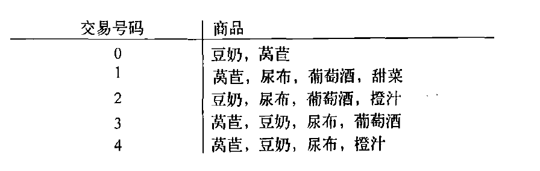

## 基于关联规则的推荐

基于关联规则的推荐思想类似基于物品的协同过滤推荐

**“啤酒与尿布”**

关联分析中最有名的例子就是“啤酒与尿布”。

据报道，在美国沃尔玛超市会发现一个很有趣的现象：货架上啤酒与尿布竟然放在一起售卖，这看似两者毫不相关的东西，为什么会放在一起售卖呢？

原来，在美国，妇女们经常会嘱咐她们的丈夫下班以后给孩子买一点尿布回来，而丈夫在买完尿布后，大都会顺手买回一瓶自己爱喝的啤酒（由此看出美国人爱喝酒）。商家通过对一年多的原始交易记录进行详细的分析，发现了这对神奇的组合。于是就毫不犹豫地将尿布与啤酒摆放在一起售卖，通过它们的关联性，互相促进销售。“啤酒与尿布”的故事一度是营销界的神话。

那么问题来了，**商家是如何发现啤酒与尿布两者之间的关联性呢？**

这里我们可以使用数据挖掘中的关联规则挖掘技术，目的就是为了找出两个对象（如X,Y）之间的关联性。一旦找出二者关联性，那么就可以根据它来进行推荐。

**基于关联规则的推荐**

一般我们可以找出用户购买的所有物品数据里频繁出现的项集活序列，来做频繁集挖掘，找到满足支持度阈值的关联物品的频繁N项集或者序列。如果用户购买了频繁N项集或者序列里的部分物品，那么我们可以将频繁项集或序列里的其他物品按一定的评分准则推荐给用户，这个评分准则可以包括支持度，置信度和提升度等。

常用的关联推荐算法有Apriori，FP-Growth

#### 关联分析

关联分析是一种在大规模数据集中寻找有趣关系的任务。 这些关系可以有两种形式:

- 频繁项集（frequent item sets）是指经常出现在一块的物品的集合。
- 关联规则（associational rules）是暗示两种物品之间可能存在很强的关系。

从大规模数据集中寻找物品间的隐含关系被称作关联分析(association analysis)或者关联规则学习（association rule learning）

#### 关联性衡量指标

假设我们下图所示的一份数据集

确定X， Y的关联性，需要用两个指标来衡量：

- **支持度（support）**

  支持度是针对项集而言的

  项集的支持度被定义为数据集中包含该项集的记录所占的比例

  那么项集`{豆奶}`的支持度就是4/5，那么项集`{豆奶, 莴苣}`的支持度就是3/5

- **置信度（confidence）**

  置信度也成为可信度，是针对一个关联规则而言的，如`{豆奶}` >>>`{莴苣}`，表示`{豆奶}`之于`{莴苣}`的关联程度（注意：`{莴苣}` >>>`{豆奶}`不等价于`{豆奶}` >>>`{莴苣}`）

  `{豆奶}` >>>`{莴苣}`的置信度 = 支持度(`{豆奶, 莴苣}`)/支持度(`{豆奶}`)，即3/4

  `{莴苣}` >>>`{豆奶}`的置信度 = 支持度(`{豆奶, 莴苣}`)/支持度(`{莴苣}`)，即3/4

  注意：这里他们俩的置信度相等纯属巧合

如果不考虑关联规则的支持度和置信度，那么在数据库中会存在着无穷多的关联规则。因此我们为了提取出真正的频繁项集和关联规则，必须指定一个最小支持度阈值和最小置信度阈值，因为对于支持度和置信度太低的关联规则基本没有什么使用价值。

- **最小支持度**：

  它表示了一组物品集在统计意义上需要满足的最低程度

- **最小可信度**

  它反映了关联规则的最低可靠程度

**同时满足最小可信度阈值和最小支持度阈值的关联规则被称为强关联规则。**比如啤酒与尿布。

比如这里，如果我们假设最小支持度阈值为50%，最小可信度阈值为70%，那么这里`{豆奶}` >>>`{莴苣}`和`{莴苣}` >>>`{豆奶}`都属于符合条件的两条关联规则，分别表示：

- 同时购买豆奶和莴苣的顾客占全部顾客的60%
- `{豆奶}` >>>`{莴苣}`：在购买豆奶的用户中，有75%的顾客会购买莴苣
- `{莴苣}` >>>`{豆奶}`：在购买莴苣的用户中，有75%的顾客会购买豆奶