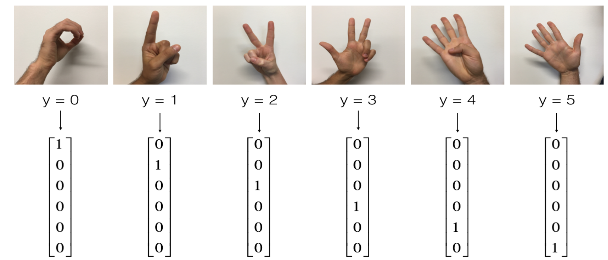

# 手势识别

## SIGNS数据集

识别图中的手势，以促进从语言障碍者到不懂手语的人的通信。

**训练集**：1080个图像（64乘64像素）的符号表示从0到5的数字（每个数字180个图像）。

**测试集**：120张图片（64乘64像素）的符号，表示从0到5的数字（每个数字20张图片）。



## 卷积网络

```python
import tensorflow as tf
import h5py
import matplotlib.pyplot as plt
from tensorflow.python.framework import ops
import numpy as np
import math
"""
使用卷积网络进行手势识别
设定好固定的网路结构：
layer1：
conv1:padding 'SAME',8个filters:3 x 3 x 3,strides:1
RELU
pool1:1：window 2 x 2, sride 2, padding 'SAME'
layer2：
conv2:16个filters:3 x 3 x 8,strides:1,padding 'SAME'
RELU
pool1:1：window 2 x 2, sride 2, padding 'SAME'

卷积网络流程
1、输入初始特征数据，[batch, 64, 64, 3]
layer1:
conv1: 8个filter , 3 * 3 * 3,stride =1, padding="SAME"
[batch, 64, 64, 3] --->[batch, 64,64, 8]
relu: 形状不变
pool1: 窗口：2 * 2，stride:2
[batch, 64,64, 8]---> [batch, 32,32, 8]
layer2 :
conv2: 16个filter , 3 * 3 * 8,stride =1, padding="SAME"
[batch, 32, 32, 8] --->[batch, 32, 32, 16]
relu: 形状不变
pool2: 窗口：2 * 2，stride:2
[batch,32, 32, 16]---> [batch,16, 16, 16]
FC: 6个全连接层神经元输出
[batch, 16 * 16 * 16] --> [batch, 6]
"""


def load_dataset():
    """加载数据"""
    # 获取训练集图片特征值和目标值
    train_dataset = h5py.File('./datasets/signs/train_signs.h5', 'r')
    X_train_orig = np.array(train_dataset["train_set_x"][:])
    Y_train_orig = np.array(train_dataset["train_set_y"][:])
    # 获取测试集图片特征值和目标值
    test_dataset = h5py.File('./datasets/signs/test_signs.h5', 'r')
    X_test_orig = np.array(test_dataset["test_set_x"][:])
    Y_test_orig = np.array(test_dataset["test_set_y"][:])
    # 对目标值形状进行转换
    Y_train_orig = Y_train_orig
    Y_test_orig = Y_test_orig
    X_train = X_train_orig / 255
    X_test = X_test_orig / 255
    Y_train = one_hot_convert(Y_train_orig)
    Y_test = one_hot_convert(Y_test_orig)

    print("训练集的总样本数" + str(X_train.shape[0]))
    print("测试集的总样本数" + str(X_test.shape[0]))
    print("训练集特征值形状" + str(X_train.shape))
    print("训练集目标值形状" + str(Y_train.shape))
    print("测试集特征值形状" + str(X_test.shape))
    print("测试集目标值" + str(Y_test.shape))
    return X_train, Y_train, X_test, Y_test


def model(X_train, Y_train, X_test, Y_test, learning_rate=0.009, num_epochs=100, minibatch_size=64):
    """
    训练数据
    :param X_train: 训练数据特征
    :param Y_train:训练数据目标
    :param X_test: 测试数据特征
    :param Y_test: 测试数据特征
    :param learning_rate: 学习率
    :param num_epochs: 迭代次数
    :param minibatch_size:批次数量
    """
    # 设置图
    ops.reset_default_graph()
    # 获取训练数据的形状
    (m, n_H0, n_W0, n_C0) = X_train.shape

    n_y = Y_train.shape[1]
    # 创建占位符
    X, Y = create_palceholders(n_H0, n_W0, n_C0, n_y)
    # 初始化参数
    parameters = initialize_parameters()
    # 前向传播，进行卷积神经网络
    Z3 = forward_propagation(X, parameters)
    # 计算损失
    cost = compute_cost(Z3, Y)
    # 使用Adam优化器进行反向传播优化参数
    optimizer = tf.train.AdamOptimizer(learning_rate).minimize(cost)
    # 计算准确率

    # 初始化所有变量
    init = tf.global_variables_initializer()
    # 开启会话
    with tf.Session() as sess:
        # 运行变化初始化
        sess.run(init)

        # 训练损失，每次迭代打乱顺序种子
        costs = []
        seed = 3

        # 迭代训练优化
        # 迭代所有样本次数
        # 100次
        for epoch in range(num_epochs):

            # 创建Mini-batch
            minibatch_cost = 0.
            num_minibatches = int(m / minibatch_size)
            # 每次获取顺序不一样
            seed = seed + 1

            # [ minibatch, minibatch, minibatch, minibatch, ....]
            # 每次训练使用一个minibatch
            minibatches = random_mini_batches(X_train, Y_train, minibatch_size, seed)

            for minibatch in minibatches:
                (minibatch_X, minibatch_Y) = minibatch

                # 运行优化器、损失
                _, temp_cost = sess.run([optimizer, cost], feed_dict={X: minibatch_X, Y: minibatch_Y})

                minibatch_cost += temp_cost / num_minibatches

            # 打印损失
            if epoch % 5 == 0:
                print("迭代次数： %i: 损失大小为：%f" % (epoch, minibatch_cost))
                costs.append(minibatch_cost)

        # 计算预测值，并计算测试时候准确率
        predict_op = tf.argmax(Z3, 1)
        correct_prediction = tf.equal(predict_op, tf.argmax(Y, 1))
        accuracy = tf.reduce_mean(tf.cast(correct_prediction, "float"))
        test_accuracy = accuracy.eval({X: X_test, Y: Y_test})
        print("在测试集上运行的准确率：", test_accuracy)

        # 绘制关于目标函数损失值变化的图
        plt.plot(np.squeeze(costs))
        plt.ylabel("损失值")
        plt.xlabel("迭代次数")
        plt.title("损失变化效果")
        plt.show()

        return test_accuracy, parameters


def one_hot_convert(Y):
    """one-hot变换"""
    # # np
    # res = np.eye(6)[np.array([1,2,3,5,0]).reshape(-1)]
    # # pd
    # import pandas as pd
    # res = np.array(pd.get_dummies(np.array([1,2,3, 5, 0])))
    # # sklearn
    # from sklearn.preprocessing import LabelBinarizer, OneHotEncoder
    # encoder = LabelBinarizer()
    # res = encoder.fit_transform(np.array([1,2,3,5,0]))
    # encoder = OneHotEncoder()
    # res = encoder.fit_transform(np.array([1,2,3,5,0]).reshape(-1, 1)).toarray()
    # # tf
    res = tf.keras.utils.to_categorical(Y)
    return res


def create_palceholders(n_H0, n_W0, n_C0, n_y):
    """创建占位符"""
    X = tf.placeholder('float', shape=[None, n_H0, n_W0, n_C0])
    Y = tf.placeholder('float', shape=[None, n_y])
    return X, Y


def initialize_parameters():
    """初始化参数"""
    tf.set_random_seed(1)

    W1 = tf.get_variable("W1", [3, 3, 3, 8], initializer=tf.contrib.layers.xavier_initializer(seed=0))
    W2 = tf.get_variable("W2", [3, 3, 8, 16], initializer=tf.contrib.layers.xavier_initializer(seed=0))

    parameters = {"W1": W1,
                  "W2": W2}

    return parameters


def random_mini_batches(X, Y, mini_batch_size=64, seed=0):
    """
    创建每批次固定数量特征值和目标值
    :param X: 图片特征
    :param Y: 图片目标值
    :param mini_batch_size: 每批次样本数
    :param seed: 打乱顺序
    :return:
    """
    # 总共样本数以及装有若干mini_batch_size的列表
    m = X.shape[0]
    mini_batches = []
    # 每次运行打乱样本顺序
    np.random.seed(seed)
    permutation = list(np.random.permutation(m))
    shuffled_X = X[permutation]
    shuffled_Y = Y[permutation]
    # 循环获取固定mini_batch_size大小的样本列表
    num_complete_minibatches = math.floor(m / mini_batch_size)
    for k in range(0, num_complete_minibatches):
        mini_batch_X = X[k * mini_batch_size: k * mini_batch_size + mini_batch_size]
        mini_batch_Y = Y[k * mini_batch_size: k * mini_batch_size + mini_batch_size]
        mini_batch = (mini_batch_X, mini_batch_Y)
        mini_batches.append(mini_batch)
    # 剩余的样本
    if m % mini_batch_size != 0:
        mini_batch_X = X[num_complete_minibatches * mini_batch_size: m]
        mini_batch_Y = Y[num_complete_minibatches * mini_batch_size: m]
        mini_batch = (mini_batch_X, mini_batch_Y)
        mini_batches.append(mini_batch)
    return mini_batches


def forward_propagation(X, parameters):
    """
    前向传播
    CONV_1 -> RELU -> MAXPOOL_1 -> CONV_2 -> RELU -> MAXPOOL_2 -> FLATTEN -> FC
    :param X: 输入图片数据
    :param parameters: 参
    """
    # Z = tf.nn.conv2d(X, W, strides=[1, 1, 1, 1], padding='SAME')
    # A = tf.nn.relu(Z)
    # P = tf.nn.max_pool(A, ksize=[1, 2, 2, 1], strides=[1, 2, 2, 1], padding='SAME'
    # 1.取出参数数据
    W1 = parameters["W1"]
    W2 = parameters["W2"]
    # 2.layer1
    Z1 = tf.nn.conv2d(X, W1, strides=[1, 1, 1, 1], padding="SAME")
    A1 = tf.nn.relu(Z1)
    P1 = tf.nn.max_pool(A1, ksize=[1, 2, 2, 1], strides=[1, 2, 2, 1], padding="SAME")
    # 3.layer2
    Z2 = tf.nn.conv2d(P1, W2, strides=[1, 1, 1, 1], padding="SAME")
    A2 = tf.nn.relu(Z2)
    P2 = tf.nn.max_pool(A2, ksize=[1, 2, 2, 1], strides=[1, 2, 2, 1], padding="SAME")
    # 4.全连接层
    # 展开
    P2 = tf.contrib.layers.flatten(P2)
    # 输出单元
    Z3 = tf.contrib.layers.fully_connected(P2, 6, activation_fn=None)
    return Z3


def compute_cost(Z3, Y):
    """损失计算"""
    res = tf.nn.softmax_cross_entropy_with_logits(logits=Z3, labels=Y)
    cost = tf.reduce_mean(res)
    return cost


if __name__ == '__main__':
    X_train, Y_train, X_test, Y_test = load_dataset()
    _, parameters = model(X_train, Y_train, X_test, Y_test)

```

