# 循环神经网络

## 网络原理

**循环(递归)神经网络**（**RNN**）是神经网络的一种。RNN将状态在自身网络中循环传递，可以接受时间序列结构输入。

- 类型

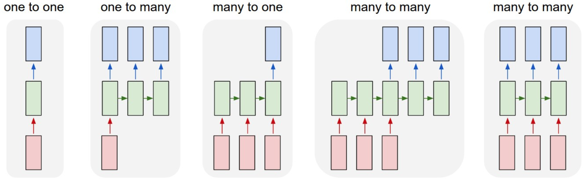

一对一：固定的输入到输出，**如图像分类**
一对多：固定的输入到序列输出，**如图像的文字描述**
多对一：序列输入到输出，**如情感分析，分类正面负面情绪**
多对多：序列输入到序列的输出，**如机器翻译,称之为编解码网络**
同步多对多：同步序列输入到同步输出，**如文本生成，视频每一帧的分类，也称之为序列生成**

### 序列模型

定义

```
通常在自然语言、音频、视频以及其它序列数据的模型。
```

类型

```
语音识别，输入一段语音输出对应的文字
情感分类，输入一段表示用户情感的文字，输出情感类别或者评分
机器翻译，两种语言的互相翻译
```

CNN效果不好的原因

```
序列数据前后之间是有很强的关联性
序列数据的输入输出长度不固定
```

### 基础循环网络

#### 概述

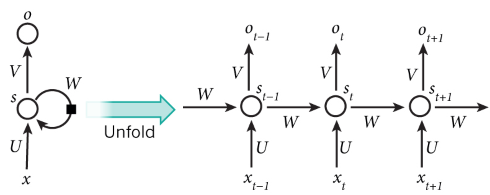

- 元素

$x_t$ :表示每一个时刻的输入

$o_t$:表示每一个时刻的输出

$s_t$:表示每一个隐层的输出

中间的小圆圈代表隐藏层的一个unit(单元)

所有单元的**参数共享**

- 通用公式

$$
s_0 = 0 \\
s_t = g_1(U_{x_t}+W_{x_{t-1}}+b_a)\\
o_t = g_2(V_{s_t}+b_y)
$$

$g_1,g_2$:表示激活函数，$g_1$:tanh/relu, $g_2$:sigmoid、softmax

循环神经网络的输出值$o_t$，是受前面历次输入值$x_{t-1},x_{t},x_{t+1}$影响

#### 生成案例

通常对于整个序列给一个开始和结束标志，start,end标志。

- s 我 昨天 上学 迟到 了 e

输入到网络当中的是一个个的分词结果，每一个词的输入是一个时刻。

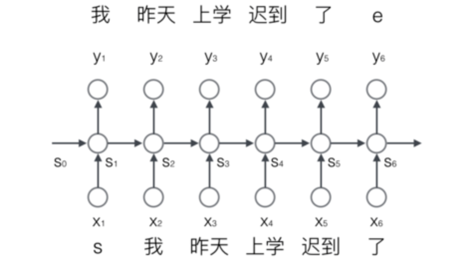

#### 词的表示

为了能够让整个网络能够理解我们的输入（英文/中文等），需要将词进行用向量表示。

- 建立一个包含所有序列词的词典包含（**开始和标志的两个特殊词，以及没有出现过的词用等**），每个词在词典里面有一个唯一的编号。
- 任意一个词都可以用一个N维的one-hot向量来表示。其中，N是词典中包含的词的个数

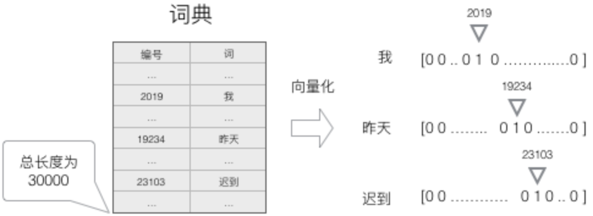

我们就得到了一个高维、**稀疏**的向量（稀疏是指绝大部分元素的值都是0）

#### softmax输出

RNN这种模型，**每一个时刻的输出**是下一个最可能的词，可以用概率表示，总长度为词的总数长度

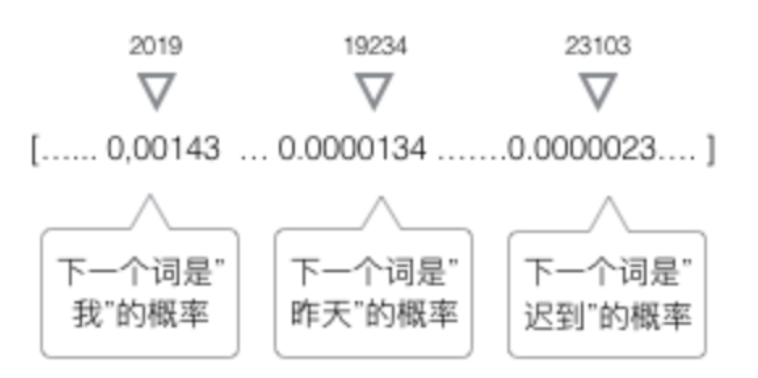

每一个时刻的输出 $s_t$ 都是词的总数长度，接上softmax回归即可

#### 矩阵运算

对于网络当中某一时刻的公式中
$$
\mathrm{s}_t=relu(U\mathrm{x}_t+W\mathrm{s}_{t-1})\\
o_{t} = softmax(V{s_t})
$$
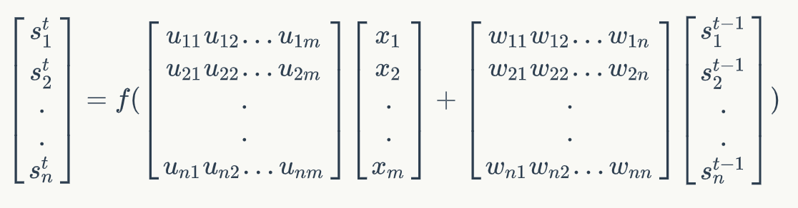

1、形状表示:

[n, m]x [m, 1] +[n, n]x [n, 1] = [n, 1]

则**矩阵U的维度是n x m，矩阵W的维度是n x n**

m：词的个数，n：为输出s的维度

注:此步骤可以简化：[u,w] x [$\frac{x}{s}$ ] = [n, n+m] x [n +m, 1] = [n, 1]

2、形状表示：[m, n] x [n, 1] = [m, 1]

**矩阵V维度：[m, n]**

**总结：其中的n是可以人为去进行设置。**

#### 交叉熵损失

总损失定义：

一整个序列（一个句子）作为一个训练实例，总误差就是各个时刻词的误差之和。
$$
E_{t}(y_{t},\hat{y_{t}}) = -y_{t}log(\hat{y_{t}})\\

E(y,\hat{y}) = \sum_{t}E_{t}(y_{t},\hat{y_{t}})=-\sum_{t}y_{t}log(\hat{y_{t}})
$$

在这里，$ y_t$ 是时刻 t 上正确的词，$ \hat y_{t}$是预测出来的词

#### 完整计算流程


$$
\mathrm{s}^t=tanh(U\mathrm{x}^t+W\mathrm{s}^{t-1}+b_a)\\
o^{t} = softmax(V{s^t + b_y})
$$

#### 时序反向传播算法

对于RNN来说有一个时间概念，需要把梯度沿时间通道传播的 BP 算法，所以称为Back Propagation Through Time-BPTT

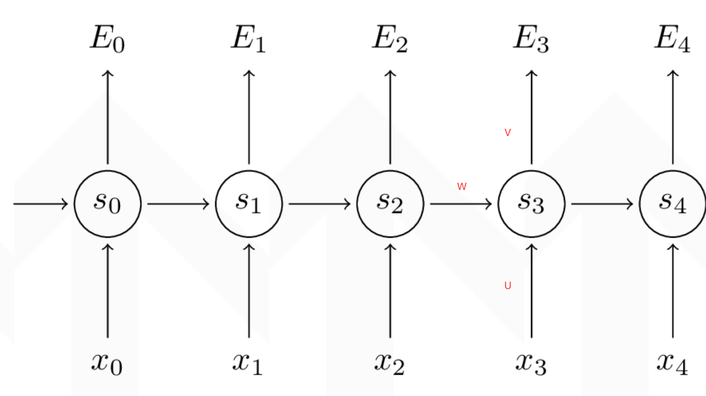

我们的目标是计算误差关于**参数U、V和W以及两个偏置bx,by的梯度**，然后使用梯度下降法学习出好的参数。由于这三组参数是共享的，我们需要将一个训练实例在每时刻的梯度相加。

- 1、**要求：每个时间的梯度都计算出来t=0,t=1,t=2,t=3,t=4，然后加起来的梯度, 为每次W更新的梯度值。**
- 2、求不同参数的导数步骤：
    - 最后一个cell:
        - 计算最后一个时刻交叉熵损失对于s_t的梯度，记忆交叉熵损失对于$s^t$ ,V,by的导数
        - 按照图中顺序计算
    - 最后一个前面的cell:
        - 第一步：求出当前层损失对于当前隐层状态输出值 $s^{t}$  的梯度 + 上一层相对于 $s^{t}$ 的损失
        - 第二步：计算tanh激活函数的导数
        - 第三步：计算 $Ux_t + Ws_{t-1} + b_{a}$ 的对于不同参数的导数

$$
\mathrm{s}^t=tanh(U\mathrm{x}^t+W\mathrm{s}^{t-1}+b_a)\\
o^{t} = softmax(V{s^t + b_y})
$$

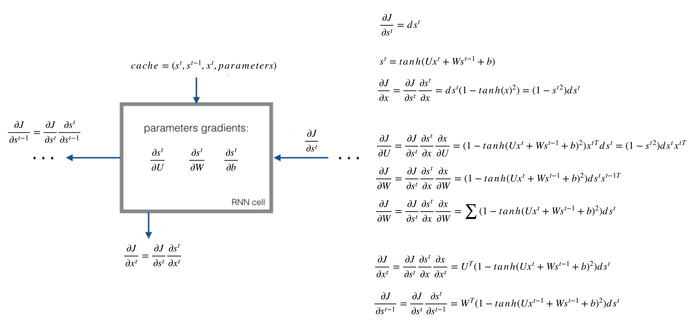

#### 梯度消失与梯度爆炸

由于RNN当中也存在链式求导规则，并且其中序列的长度位置。所以

- 如果矩阵中有非常小的值，并且经过矩阵相乘N次之后，梯度值快速的以指数形式收缩，较远的时刻梯度变为0。
- 如果矩阵的值非常大，就会出现梯度爆炸

#### 案例

手写一个RNN的前向传播以及反向传播

```python
import numpy as np

"""
手写RNN前向传播
s_t = tanh(Ux_t+Ws_{t-1}+b_a)
o_t = softmax(Vs_t+b_y)
"""


def softmax(x):
    e_x = np.exp(x - np.max(x))
    return e_x / e_x.sum(axis=0)


def rnn_cell_forward(x_t, s_prev, parameters):
    """
    单个RNN-cell 的前向传播过程
    :param x_t: 单元的输入
    :param s_prev: 上一个单元的输入
    :param parameters: 单元中的参数，字典
    :return: s_next, out_pred, cache
    """
    # 获取参数
    U = parameters["U"]
    W = parameters["W"]
    V = parameters["V"]
    ba = parameters["ba"]
    by = parameters["by"]
    # 隐层的输出
    s_next = np.tanh(np.dot(U, x_t) + np.dot(W, s_prev) + ba)
    # 计算当前cell输出预测结果
    out_pred = softmax(np.dot(V, s_next) + by)
    # 存储当前单元的结果，用于反向传播计算
    cache = (s_next, s_prev, x_t, parameters)

    return s_next, out_pred, cache


def rnn_forward(x, s0, parameters):
    """
    对多个Cell的RNN进行前向传播
    :param x: T个时刻的X总输入形状(m, 1, T)
    :param a0: 隐层第一次输入
    :param parameters: 参数,U,W,V,ba,by
    :return: s, y, caches
    """

    # 根据x输入的形状确定cell的个数(3, 1, T)
    # m是词的个数
    # 获取序列的长度，时刻数
    m, _, T = x.shape
    # 获取输入的n，定义隐层输出大小状态
    m, n = parameters["V"].shape

    # 初始化缓存
    caches = []
    # 初始化所有cell的s，用于保存所有cell的隐层结果
    # 初始化所有cell的输出y，保存所有输出结果
    s = np.zeros((n, 1, T))
    y = np.zeros((m, 1, T))

    # 初始化第一个s_0
    s_next = s0

    # 根据cell的个数循环，并保存每组的数据
    for t in range(T):
        # 更新每个隐层的输出计算结果，s, o, cache
        s_next, out_pred, cache = rnn_cell_forward(x[:, :, t], s_next, parameters)
        # 保存隐层的输出值s_next
        s[:, :, t] = s_next
        # 保存cell的云厕纸out_pred
        y[:, :, t] = out_pred
        #  保存每个cell缓存结果
        caches.append(cache)

    return s, y, caches


"""
需要计算的梯度变量
ds_next:表示当前cell的损失对输出s_t的导数
dtanh:表示当前cell的损失对激活函数的导数
dx_t:表示当前cell的损失对输入x_t的导数
dU:表示当前cell的损失对U的导数
ds_prev:表示当前cell的损失对上一个cell的输入的导数
dW:表示当前cell的损失对W的导数
dba:表示当前cell的损失对dba的导数
"""


def rnn_cell_backward(ds_next, cache):
    """
    对单个cell进行反向传播，每个cell的右边输入梯度
    :param ds_next: 当前隐层输出结果相对于损失的导数
    :param cache: 每个cell的缓存
    :return: gradients，该cell的6个梯度值
    """
    # 获取cache中的缓存值及参数
    (s_next, s_prev, x_t, paramters) = cache
    U = parameters["U"]
    W = parameters["W"]
    V = parameters["V"]
    ba = parameters["ba"]
    by = parameters["by"]
    # 根据公式进行反向传播
    # 计算tanh的倒数
    dtanh = (1 - s_next ** 2) * ds_next
    # 计算U的梯度值
    dU = np.dot(dtanh, x_t.T)
    # 计算W的梯度值
    dW = np.dot(dtanh, s_prev.T)
    # 计算ba的梯度值
    # 保持计算之后U维度不变
    dba = np.sum(dtanh, axis=1, keepdims=1)
    # 计算x_t的导数
    dx_t = np.dot(U.T, dtanh)
    # 计算s_prev的导数
    ds_prev = np.dot(W.T, dtanh)
    # 把所有的导数保存到字典当中返回
    gradients = {"dtanh": dtanh, "dU": dU, "dW": dW, "dba": dba, "dx_t": dx_t, "ds_prev": ds_prev}

    return gradients


# 假设知道了所有时刻相对于损失的ds的梯度值
def rnn_backward(ds, caches):
    """
    对给定的一个序列进行RNN的发现反向传播
    :param ds:
    :param caches:
    :return:
    """
    # 获取第一个cell的数据参数输入输出值
    (s1, s0, x_1, parameters) = caches[0]
    # 获取总共cell的数量以及m和n的值
    n, _, T = ds.shape
    m, _ = x_1.shape
    # 初始化梯度值
    dx = np.zeros((m, 1, T))
    dU = np.zeros((n, m))
    dW = np.zeros((n, n))
    dba = np.zeros((n, 1))
    ds0 = np.zeros((n, 1))
    ds_prevt = np.zeros((n, 1))

    # 循环从后往前进行反向传播
    for t in reversed(range(T)):
        # 根据时间T的s梯度，以及缓存计算当前的cell的反向传播梯度
        gradients = rnn_cell_backward(ds[:, :, t] + ds_prevt, caches[t])
        # 获取梯度准备进行更新
        dx_t, ds_prevt, dUt, dWt, dbat = gradients["dx_t"], gradients["ds_prev"], gradients["dU"], \
                                         gradients["dW"], gradients["dba"]
        # 进行每次t时间上的梯度相加，最为最终更新的梯度
        dx[:, :, t] = dx_t
        dU += dUt
        dW += dWt
        dba += dbat
    # 最后ds0的输出梯度值
    ds0 = ds_prevt
    # 存储更新的梯度到字典当中

    gradients = {"dx": dx, "ds0": ds0, "dU": dU, "dW": dW, "dba": dba}

    return gradients

if __name__ == '__main__':
    # 前向传播
    # 单个cell，m=3是词的个数，n=5表示5个时刻,为自定义数字
    # np.random.seed(1)
    # x_t = np.random.randn(3, 1)
    # s_prev = np.random.randn(5, 1)
    # U = np.random.randn(5, 3)
    # W = np.random.randn(5, 5)
    #
    # V = np.random.randn(3, 5)
    # ba = np.random.randn(5, 1)
    # by = np.random.randn(3, 1)
    # parameters = {"U": U, "W": W, "V": V, "ba": ba, "by": by}
    #
    # s_next, out_pred, cache = rnn_cell_forward(x_t, s_prev, parameters)
    # print("s_next = ", s_next)
    # print("s_next.shape = ", s_next.shape)
    # print("out_pred =", out_pred)
    # print("out_pred.shape = ", out_pred.shape)

    # 定义了4个cell，每个词形状(3, 1)
    # x = np.random.randn(3, 1, 4)
    # s0 = np.random.randn(5, 1)
    #
    # W = np.random.randn(5, 5)
    # U = np.random.randn(5, 3)
    # V = np.random.randn(3, 5)
    # ba = np.random.randn(5, 1)
    # by = np.random.randn(3, 1)
    # parameters = {"U": U, "W": W, "V": V, "ba": ba, "by": by}
    #
    # s, y, caches = rnn_forward(x, s0, parameters)
    # print("s = ", s)
    # print("s.shape = ", s.shape)
    # print("y =", y)
    # print("y.shape = ", y.shape)

    # 反向传播
    np.random.seed(1)

    # 定义了4个cell，每个词形状(3, 1)
    x = np.random.randn(3, 1, 4)
    s0 = np.random.randn(5, 1)

    W = np.random.randn(5, 5)
    U = np.random.randn(5, 3)
    V = np.random.randn(3, 5)
    ba = np.random.randn(5, 1)
    by = np.random.randn(3, 1)
    parameters = {"U": U, "W": W, "V": V, "ba": ba, "by": by}

    s, y, caches = rnn_forward(x, s0, parameters)
    # 随机给一每个4个cell的隐层输出的导数结果（真实需要计算损失的导数）
    ds = np.random.randn(5, 1, 4)

    gradients = rnn_backward(ds, caches)

    print(gradients)

```

### LSTM

长短记忆网络（Long Short Term Memory，简称LSTM）是RNN的一种变形。

普通RNN存在梯度消失等缺点，因此不能有效地保留长时间的记忆信息。LSTM对隐藏层做了改进，有效克服了梯度消失等缺点。与普通RNN只有激活层的机构不同，增加了记忆体（cell state）的信息流，它负责把记忆信息从序列的初始位置传递到序列的末端，并通过4个相互交互的门单元，来控制着在每一时间步t对记忆信息值进行修改。

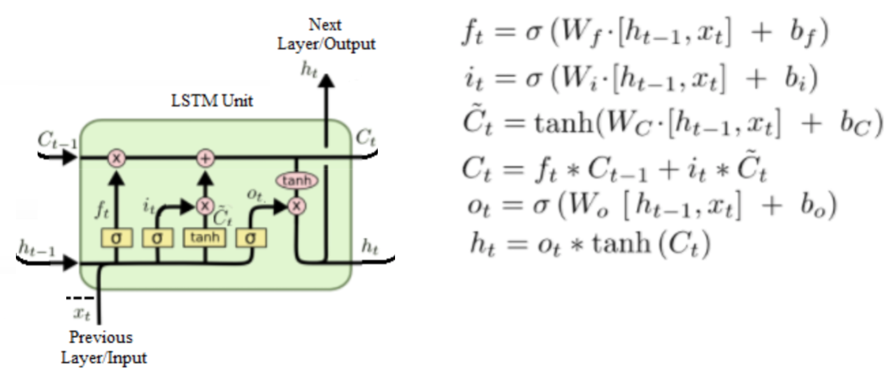

其中，$h_t$ :为该cell单元的输出，$c_t$:为隐层的状态

四个门：遗忘门f、输入门i、候选门c、输出门o

- 忘记门

忘记门（Forget Gate Layer），其作用是控制着要从前面的记忆中丢弃多少信息。通过一个激活函数实现
$$
f_t = \sigma(W_f \cdot [h_{t-1}, x_t] + b_f)
$$
通过将上一隐层的输出信息 $h_{t-1}$ 和当前的输入 $x_t$ 进行线性组合后，利用sigmoid激活函数，将函数值压缩，得到一个在[0, 1]之间的阈值。当函数值接近1时，表示记忆体保留的信息就越多，当函数值接近于0时，表示记忆体丢弃的信息就越多。

- 输入门

输入门（Input Gate Layer），决定了当前时刻的输入信息 $x_t$，有多少信息将被添加到记忆信息流中，与忘记门计算公式几乎一致，通过一个激活函数实现
$$
i_t = \sigma(W_f \cdot [h_{t-1}, x_t] + b_i)
$$

- 候选门

候选门（Candidate Layer），用来计算当前输入与过去的记忆所具有的信息总量，其计算过程如下
$$
\tilde{C_t} = tanh(W_C \cdot [h_{t-1}, x_t] + b_C)
$$
记忆的更新由两部分组成，第一部分是通过忘记门过滤去的部分记忆，大小为  $f_t \times C_{t-1}$；第二部分是添加当前新增的数据信息，添加的比例由输入门额控制，大小为 $i_t \times \tilde{C_t}$。将两部分进行组合，得到更新后的记忆信息 $C_t$ 为
$$
C_t = f_t \times C_{t-1} + i_t \times \tilde{C_t}
$$

- 输出门

输出门（Output Gate Layer），控制着有多少记忆信息将被用于下一阶段的更新中，即由 $C_t$ 求解 $h_t$ 的过程中，输出门的计算公式
$$
o_t = \sigma(W_o \cdot [h_{t-1}, x_t] + b_o)
$$
$o_t$ 是一个大小在0和1之间的权重值，传递给下一阶段的记忆信息为
$$
h_t = o_t \times tanh(C_t)
$$

### GRU

门控循环单元，简称GRU。

GRU在LSTM的基础上进行了简化，主要包括两main的改造：一是将输入门与忘记门组合为一个新的门单元，称为更新门（update gate）；另一个是将记忆单元 $C_t$ 与隐藏单元 $h_t$组合为一个统一的单元，称为重置门（reset gage）

- 本质解决问题

**为了解决短期记忆问题，每个递归单元能够自适应捕捉不同尺度的依赖关系**

解决梯度消失的问题，在隐层输出的地方$h_t,h_{t-1}$的关系用加法而不是RNN当中乘法+激活函数

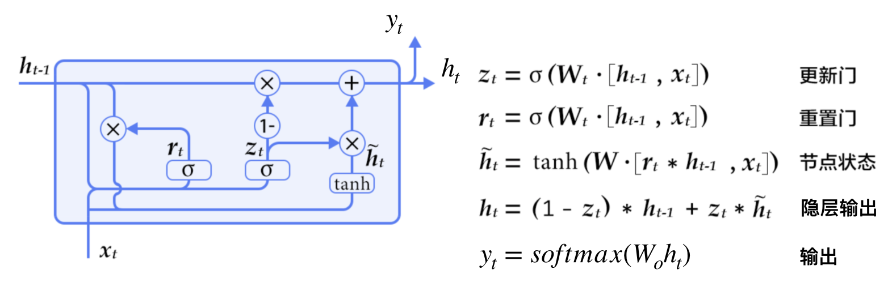

- 重置门

将LSTM记忆单元 $C_t$ 与隐藏单元 $h_t$组合，重置门决定了过去的记忆与当前的输入的组合方式。

- 更新门

LSTM的输入门与忘记门组合成更新门，更新门定义了过去的记忆有多少能被保存

如果将重置门设置为 1，更新门设置为 0，那么将再次获得标准 RNN 模型

## 词嵌入

### 原理

- one_hot问题

1. 假设有10000个词，每个词的向量长度都为10000，整体大小太大

2. 没能表示出词与词之间的关系：有一定相似性的词，取任意两个向量计算内积都为0

- 定义

定义：指把一个维数为所有词的数量的高维空间**嵌入到一个维数低得多的连续向量空间中**，每个单词或词组被映射为实数域上的向量。

> 注：这个维数通常不定，不同实现算法指定维度都不一样，通常在30~500之间。

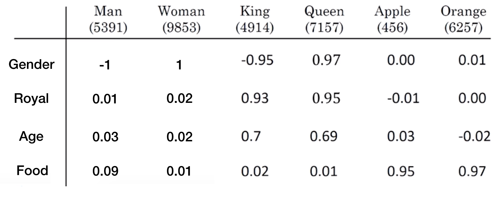

- 特点

1. 能够体现出词与词之间的关系：比如说我们用Man - Woman,或者Apple - Orange，都能得到一个向量

2. 能够得到相似词，例如Man - Woman = King - ?

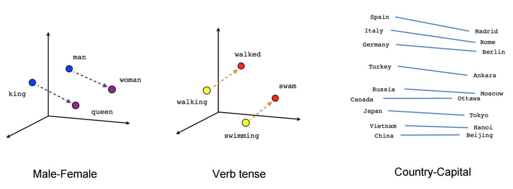

- 算法类别

Bengio等人在一系列论文中使用了神经概率语言模型使机器习得词语的分布式表示。

2013年，谷歌托马斯·米科洛维（Tomas Mikolov）领导的团队发明了一套工具word2vec来进行词嵌入。

> skip-gram

算法学习实现：https://www.tensorflow.org/tutorials/representation/word2vec

> CBow

下载gensim库

```
pip install gensim
```

### 案例

- 训练语料

[搜狗新闻中文语料(2.7G)](http://www.sogou.com/labs/resource/cs.php)

做中文分词处理之后的结果

- 代码

```python
import sys
import multiprocessing
from gensim.models import Word2Vec
from gensim.models.word2vec import LineSentence


def save_model():
    """
    保存模型
    :return:
    """
    if len(sys.argv) < 3:
        sys.exit(1)

    # inp表示语料分词，outp表示模型
    inp, outp = sys.argv[1:3]
    """
    Word2Vec(LineSentence(inp), size=400, window=5, min_count=5)
    # 参数
    LineSentence(inp)：把word2vec训练模型的磁盘存储文件，转换成所需要的格式,如：[[“sentence1”],[”sentence1”]]
    size：是每个词的向量维度
    window：是词向量训练时的上下文扫描窗口大小，窗口为5就是考虑前5个词和后5个词
    min-count：设置最低频率，默认是5，如果一个词语在文档中出现的次数小于5，那么就会丢弃
    # 方法：
    inp:分词后的文本
    save(outp1):保存模型
    """
    model = Word2Vec(LineSentence(inp), size=400, window=5, min_count=5, workers=multiprocessing.cpu_count())
    model.save(outp)


def predict_model():
    """
    测试模型
    :return:
    """
    """
    model = gensim.models.Word2Vec.load("*.model")
    model.most_similar('警察')
    model.similarity('男人','女人')
    most_similar(positive=['女人', '丈夫'], negative=['男人'], topn=1)
    """
    model = Word2Vec.load("./model/corpus.model")
    res = model.most_similar("警察")
    print(res)


if __name__ == '__main__':
    # 保存模型
    save_model()
    """
    终端运行python trainword2vec.py ./corpus_seg.txt ./model/*
    """
    # 测试模型
    predict_model()
```

## seq2seq与Attention

### seq2seq

seq2seq模型是在2014年，是由Google Brain团队和Yoshua Bengio 两个团队各自独立的提出来。

- 定义

seq2seq是一个**Encoder–Decoder 结构**的网络，它的输入是一个序列，输出也是一个序列， **Encoder 中将一个可变长度的信号序列变为固定长度的向量表达**，**Decoder 将这个固定长度的向量变成可变长度的目标的信号序列**

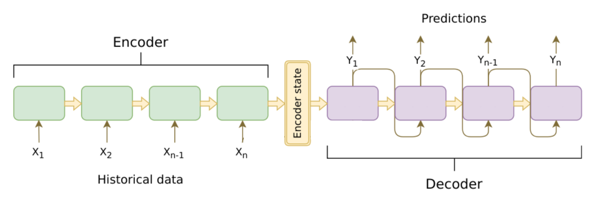

注：Cell可以用 RNN ，GRU，LSTM 等结构。

相当于将RNN模型当中的 $s^{0}$ 输入变成一个encoder

- 条件语言模型理解

> 编解码器作用

编码器的作用是把一个不定长的输入序列 $x_{1},\ldots,x_{t}$ 输出到一个编码状态 $C $

解码器输出 $y^{t}$ 的条件概率将基于之前的输出序列 $y^{1}, y^{t-1}$ 和编码状态 $C$ 

> 最大似然估计

$argmax {P}(y_1, \ldots, y_{T'} \mid x_1, \ldots, x_T)$，给定输入的序列，使得输出序列的概率值最大。

根据最大似然估计，最大化输出序列的概率
$$
\begin{align}
{P}(y_1, \ldots, y_{T'} \mid x_1, \ldots, x_T) 
& = \prod_{t'=1}^{T'} {P}(y_{t'} \mid y_1, \ldots, y_{t'-1}, x_1, \ldots, x_T) \\
&= \prod_{t'=1}^{T'} {P}(y_{t'} \mid y_1, \ldots, y_{t'-1}, {C})
\end{align}
$$
由于这个公式需要求出：
$$
P(y^{1}|C) * P(y^{2}|y^{1},C)*P(y^{3}|y^{2},y^{2},y^{1},C)...
$$
这个概率连乘会非常非常小不利于计算存储，所以需要对公式取对数计算：
$$
\log{P}(y_1, \ldots, y_{T'} \mid x_1, \ldots, x_T) = \sum_{t'=1}^{T'} \log{P}(y_{t'} \mid y_1, \ldots, y_{t'-1}, {C})
$$
所以这样就变成了
$$
P(y^{1}|C)+ P(y^{2}|y^{1},C)+P(y^{3}|y^{2},y^{2},y^{1},C)...
$$
概率相加。**这样也可以看成输出结果通过softmax就变成了概率最大，而损失最小的问题，输出序列损失最小化。**

- 应用场景

机器翻译

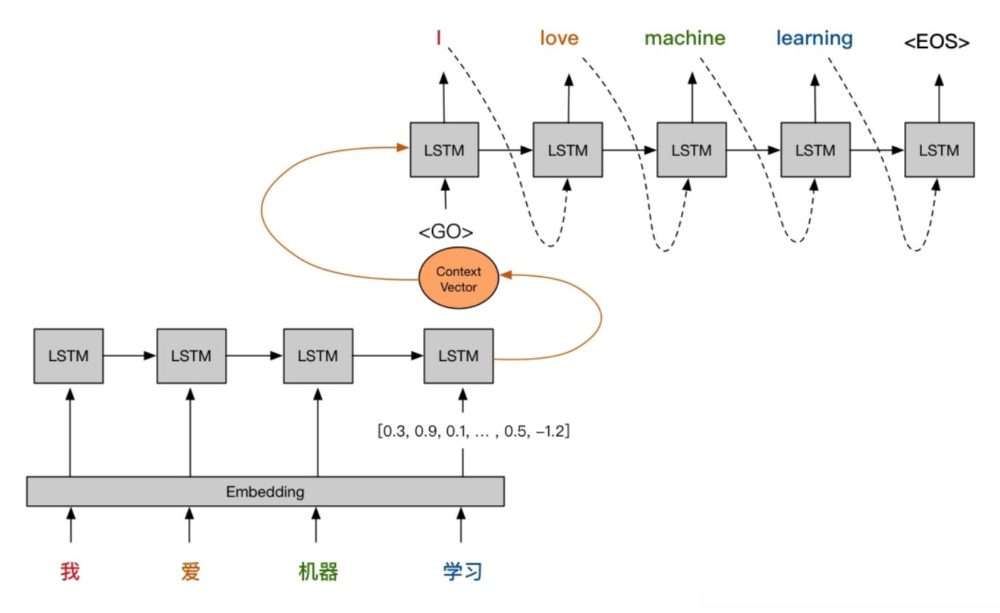

聊天机器人

### Attention

- 长句子问题

对于更长的句子，seq2seq就显得力不从心了，无法做到准确的翻译，一下是通常BLEU的分数随着句子的长度变化，可以看到句子非常长的时候，分数就很低。

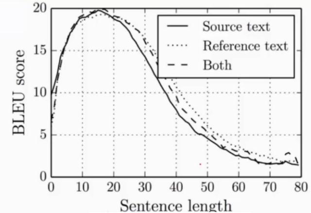

本质原因：在Encoder-Decoder结构中，Encoder把所有的输入序列都编码成一个统一的语义特征 $C$ 再解码，**因此， $C$ 中必须包含原始序列中的所有信息，它的长度就成了限制模型性能的瓶颈。**当要翻译的句子较长时，一个$C$ 可能存不下那么多信息，就会造成翻译精度的下降。

- 定义

建立Encoder的隐层状态输出到Decoder对应输出y**所需要的上下文信息**

目的：增加编码器信息输入到解码器中相同时刻的联系，其它时刻信息减弱

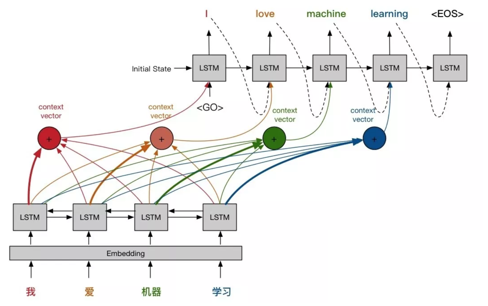

- 公式

注意上述的几个细节，颜色的连接深浅不一样，假设Encoder的时刻记为 $t$ ,而Decoder的时刻记为 $t^{'}$。
$$
{c}_{t'} = \sum_{t=1}^T \alpha_{t' t}{h}_t
$$
$ \alpha_{t^{'}t}$ 为参数，在网络中训练得到

理解：蓝色的解码器中的cell举例子
$$
\alpha_{41}h_{1}+\alpha_{42}h_{2} + \alpha_{43}h_{3} + \alpha_{44}h_{4} = c_{4}
$$

> $\alpha_{t^{'}t}$ 的N个权重系数由来？

1. 权重系数通过softmax计算：
$$
\alpha_{t' t} = \frac{\exp(e_{t' t})}{ \sum_{k=1}^T \exp(e_{t' k}) },\quad t=1,\ldots,T
$$
2. 
$$
e_{t' t} = g({s}_{t' - 1}, {h}_t)= {v}^\top \tanh({W}_s {s} + {W}_h {h})
$$

$e_{t' t}$ 是由t时刻的编码器隐层状态输出和解码器$t^{'}-1$时刻的隐层状态输出计算出来的

$s$ 为解码器隐层状态输出，$h$为编码器隐层状态输出

$v,W_{s},W_{h}$都是网络学习的参数

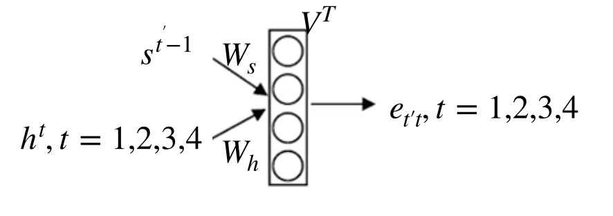

### 机器翻译案例

- 案例

使用简单的“日期转换”任务代替翻译任务，为了不然训练时间变得太长。

网络将输入以各种可能格式（例如“1958年8月29日”，“03/30/1968”，“1987年6月24日”）编写的日期，并将其翻译成标准化的机器可读日期（例如“1958 -08-29“，”1968-03-30“，”1987-06-24“）。使用seq2seq网络学习以通用机器可读格式YYYY-MM-DD输出日期。

安装扩展包

```
pip install faker  # 生成数据包
pip install tqdm  # python扩展包
pip install babel  # 代码转换器包
pip install keras==2.2.4  # 深度学习库
```

- 代码实现

实现步骤

```
1.模型参数确定
encoder和decoder时间序列的长度定义（找到最长的，机构要比样本中的长度长）
手动指定encoder和decoder的输出值大小
2.加载日期的特征和目标数据
统计特征值和目标值所有词的个数：37(包含结尾符号)、11
将原始数据转换成数字形式
数字形式进行one_hot编码
3.训练模型逻辑
4.测试模型效果

```

> 综合代码

nmt_utils.py

```python
import numpy as np
from faker import Faker
import random
from tqdm import tqdm
from babel.dates import format_date
from keras.utils import to_categorical
import keras.backend as K
import matplotlib.pyplot as plt

fake = Faker()
fake.seed(12345)
random.seed(12345)

# Define format of the data we would like to generate
FORMATS = ['short',
           'medium',
           'long',
           'full',
           'full',
           'full',
           'full',
           'full',
           'full',
           'full',
           'full',
           'full',
           'full',
           'd MMM YYY', 
           'd MMMM YYY',
           'dd MMM YYY',
           'd MMM, YYY',
           'd MMMM, YYY',
           'dd, MMM YYY',
           'd MM YY',
           'd MMMM YYY',
           'MMMM d YYY',
           'MMMM d, YYY',
           'dd.MM.YY']

# change this if you want it to work with another language
LOCALES = ['en_US']

def load_date():
    """
        Loads some fake dates 
        :returns: tuple containing human readable string, machine readable string, and date object
    """
    dt = fake.date_object()

    try:
        human_readable = format_date(dt, format=random.choice(FORMATS),  locale='en_US') # locale=random.choice(LOCALES))
        human_readable = human_readable.lower()
        human_readable = human_readable.replace(',','')
        machine_readable = dt.isoformat()
        
    except AttributeError as e:
        return None, None, None

    return human_readable, machine_readable, dt

def load_dataset(m):
    """
        Loads a dataset with m examples and vocabularies
        :m: the number of examples to generate
    """
    
    human_vocab = set()
    machine_vocab = set()
    dataset = []
    Tx = 30
    

    for i in tqdm(range(m)):
        h, m, _ = load_date()
        if h is not None:
            dataset.append((h, m))
            human_vocab.update(tuple(h))
            machine_vocab.update(tuple(m))
    
    human = dict(zip(sorted(human_vocab) + ['<unk>', '<pad>'], 
                     list(range(len(human_vocab) + 2))))
    inv_machine = dict(enumerate(sorted(machine_vocab)))
    machine = {v:k for k,v in inv_machine.items()}
 
    return dataset, human, machine

def preprocess_data(dataset, human_vocab, machine_vocab, Tx, Ty):
    
    X, Y = zip(*dataset)
    
    X = np.array([string_to_int(i, Tx, human_vocab) for i in X])
    Y = [string_to_int(t, Ty, machine_vocab) for t in Y]
    
    Xoh = np.array(list(map(lambda x: to_categorical(x, num_classes=len(human_vocab)), X)))
    Yoh = np.array(list(map(lambda x: to_categorical(x, num_classes=len(machine_vocab)), Y)))

    return X, np.array(Y), Xoh, Yoh

def string_to_int(string, length, vocab):
    """
    Converts all strings in the vocabulary into a list of integers representing the positions of the
    input string's characters in the "vocab"
    
    Arguments:
    string -- input string, e.g. 'Wed 10 Jul 2007'
    length -- the number of time steps you'd like, determines if the output will be padded or cut
    vocab -- vocabulary, dictionary used to index every character of your "string"
    
    Returns:
    rep -- list of integers (or '<unk>') (size = length) representing the position of the string's character in the vocabulary
    """
    
    #make lower to standardize
    string = string.lower()
    string = string.replace(',','')
    
    if len(string) > length:
        string = string[:length]
        
    rep = list(map(lambda x: vocab.get(x, '<unk>'), string))
    
    if len(string) < length:
        rep += [vocab['<pad>']] * (length - len(string))
    
    #print (rep)
    return rep


def softmax(x, axis=1):
    """Softmax activation function.
    # Arguments
        x : Tensor.
        axis: Integer, axis along which the softmax normalization is applied.
    # Returns
        Tensor, output of softmax transformation.
    # Raises
        ValueError: In case `dim(x) == 1`.
    """
    ndim = K.ndim(x)
    if ndim == 2:
        return K.softmax(x)
    elif ndim > 2:
        e = K.exp(x - K.max(x, axis=axis, keepdims=True))
        s = K.sum(e, axis=axis, keepdims=True)
        return e / s
    else:
        raise ValueError('Cannot apply softmax to a tensor that is 1D')

```

rnn_nmt.py

```python
from nmt_utils import *
from keras.optimizers import Adam
from keras.models import Model
from keras.layers import LSTM, Bidirectional
from keras.layers import Input, Dense, RepeatVector, Concatenate, Dot, Activation

import numpy as np


class Seq2seq(object):
    """
    序列模型进行日期的翻译
    """

    def __init__(self, Tx=30, Ty=10, n_x=32, n_y=64):
        # 定义网络相关参数
        self.model_param = {
            "Tx": Tx,  # 定义encoder序列最大长度
            "Ty": Ty,  # 定义decoder序列最大长度
            "n_x": n_x,  # encoder的隐层输出值大小
            "n_y": n_y,  # decoder的隐层输出值大小和cell输出值大小
        }

    def load_data(self, m):
        """
        指定获取m条数据，加载数据
        :param m: 数据的总样本数
        :return:
            dataset:[('9 may 1998', '1998-05-09'), ('10.09.70', '1970-09-10')]
            x_vocab:翻译前的格式对应数字{' ': 0, '.': 1, '/': 2, '0': 3, '1': 4, '2': 5, '3': 6, '4': 7,....}
            y_vocab:翻译后的格式对应数字{'-': 0, '0': 1, '1': 2, '2': 3, '3': 4, '4': 5, '5': 6, '6': 7, '7': 8, '8': 9, '9': 10}
        """
        """
        加载数据
            from nmt_utils import *
        """
        # 获取3个值：数据集，特征词的字典映射，目标词字典映射
        dataset, x_vocab, y_vocab = load_dataset(m)

        # 获取处理好的数据：特征x以及目标y的one_hot编码
        X, Y, X_onehot, Y_onehot = preprocess_data(dataset, x_vocab, y_vocab, self.model_param["Tx"],
                                                   self.model_param["Ty"])

        print("整个数据集特征值的形状:", X_onehot.shape)
        print("整个数据集目标值的形状:", Y_onehot.shape)

        # 打印数据集
        print("查看第一条数据集格式：特征值:%s, 目标值: %s" % (dataset[0][0], dataset[0][1]))
        print(X[0], Y[0])
        print("one_hot编码：", X_onehot[0], Y_onehot[0])

        # 添加一些参数到model_param中
        # 添加特征词个不重复个数以及目标词的不重复个数
        self.model_param["x_vocab"] = x_vocab
        self.model_param["y_vocab"] = y_vocab

        self.model_param["x_vocab_size"] = len(x_vocab)
        self.model_param["y_vocab_size"] = len(y_vocab)

        return X_onehot, Y_onehot

    def get_encoder(self):
        """
        获取encoder属性
        :return:
        """
        """
        编码器：使用双向LSTM（隐层传递有双向值传递）
        from keras.layers import LSTM, Bidirectional
        LSTM(units, return_sequences=False,name="")
            units: 正整数, units状态输出的维度
            return_sequences:布尔类型 是否返回输出序列
            return:LSTM layer
        Bidirectional(layer, merge_mode='concat')
            对RNN、LSTM进行双向装饰
            layer:RNN layer或者LSTM layer
            merge_mode:将RNN/LSTM的前向和后向输出值进行合并
                {'sum', 'mul', 'concat', 'ave', None}
        """
        self.encoder = Bidirectional(LSTM(self.model_param["n_x"], return_sequences=True, name="bidirectional_1"),
                                     merge_mode="concat")
        return None

    def get_decoder(self):
        """
        获取decoder属性
        :return:
        """
        self.decoder = LSTM(self.model_param["n_y"], return_state=True)
        return None

    def get_attention(self):
        """
        定义Attention的结构
        :return:attention结构
        """
        """
        1、定义结构
        2、实现输入输出结果 
        """
        # 定义RepeatVector复制多个维度
        repeator = RepeatVector(self.model_param["Tx"])
        # 进行矩阵拼接
        concatenator = Concatenate(axis=-1)
        # 定义Dense
        densor1 = Dense(10, activation="tanh", name="Dense1")  # 进行全连接层10个神经元
        densor2 = Dense(1, activation="relu", name="Dense2")  # 接着relu函数
        # softmax
        activator = Activation(softmax, name="attention_weights")
        # context计算
        dotor = Dot(axes=1)  # 相当于np.dot
        # 将结构存储在attention当中
        self.attention = {
            "repeator": repeator,
            "concatenator": concatenator,
            "densor1": densor1,
            "densor2": densor2,
            "activator": activator,
            "dotor": dotor
        }

        return None

    def computer_one_attention(self, a, s_prev):
        """
        逻辑函数：利用定义好的attention结构计算alpha系数与a对应输出
        :param a: encoder的所有输出t'时刻，隐层状态值(m, Tx, 2*n_a)
        :param s_prev: LSTM的初始隐层状态值，decoder的输出t'-1，形状(smaple, n_s)
        :return: context
        """
        """
        1.扩展s_prev的维度到encoder的所有时刻
        2.进行s_prev和a进行拼接
        3.进行全连接计算得到e，经过激活函数relu计算出e'
        4.e'进行softmax计算，得到系数
        5.系数与a进行计算得到context
        """
        # 扩展s_prev的维度到encoder的所有时刻
        s_prev = self.attention["repeator"](s_prev)
        # 进行s_prev和a进行拼接
        concat = self.attention["concatenator"]([a, s_prev])
        # 进行全连接计算得到e，经过激活函数relu计算出e'
        e = self.attention["densor1"](concat)
        en = self.attention["densor2"](e)
        # e'进行softmax计算，得到系数
        alphas = self.attention["activator"](en)
        # 系数与a进行计算得到context
        context = self.attention["dotor"]([alphas, a])
        return context

    def get_output_layer(self):
        """
        获取输出层
        :return:
        """
        """
        from keras.layer import Dense
        指定一个普通的全连接层，并且可以指定激活函数
        Dense(units, activation=None)
        神经元个数（输出大小）
            activation=None：激活函数
        """
        self.output_layer = Dense(self.model_param["y_vocab_size"], activation=softmax)
        return None

    def init_seq2seq(self):
        """
        初始化网络结构
        :return:
        """
        """
        在训练中有一些模型结构，所以现需要定义这些结构统一初始化，这些模型结构作为整个Seq2Seq类的属性，初始化逻辑。
        """
        # 添加encoder属性
        self.get_encoder()
        # 添加decoder属性
        self.get_decoder()
        # 添加attention属性
        self.get_attention()
        # 添加get_output_layer属性
        self.get_output_layer()
        return None

    def model(self):
        """
        定义整个网络模型
        :return:
        """
        """
        步骤1、定义模型的输入
           Input(shape=(self.model_param["Tx"], self.model_param["x_vocab_size"]), name="X)
        步骤2：使用encoder的双向LSTM结构得输出a
        步骤3：循环decoder的Ty次序列输入，获取decoder最后输出
            1: 定义decoder第t'时刻的注意力结构并输出context
                context = self.computer_one_attention(a, s)(需要实现Attention结构的计算过程)
            2: 对"context" 和初始两个状态s0,c0输入到deocder当中,返回两个输出
                s, _, c = self.decoder(context, initial_state=[s, c])
            3: 应用 Dense layere获取deocder的t'时刻的输出 
                out = self.output_layer(s)
        步骤 4: 创建model实例，定义输入输出
            from keras.models import Model
        """
        # 1.定义encoder的输入X(30, 37)
        X = Input(shape=(self.model_param["Tx"], self.model_param["x_vocab_size"]), name="X")
        s0 = Input(shape=(self.model_param["n_y"],), name="s0")
        c0 = Input(shape=(self.model_param["n_y"],), name="c0")
        s = s0
        c = c0
        # 定义一个装有输出的列表
        outputs = []
        # 2.输入到encoder中，得到a
        a = self.encoder(X)
        # 3.计算输出结果，循环decoder当中的t'的时刻计算每个LSTM的输出结果
        for t in range(self.model_param["Ty"]):
            # a.循环计算每一个时刻的context
            context = self.computer_one_attention(a, s)
            # b.输入s0,c0,context到某个时刻decoder得到下次的输出s,c
            # 因为是LSTM结构，所以有两个隐层状态，其中s可以用作输出
            s, _, c = self.decoder(context, initial_state=[s, c])
            # c.s输出到最后一层softmax得到预测结果
            out = self.output_layer(s)
            # 精decoder中t'时刻的输出装入列表
            outputs.append(out)
        # 4.创建model实例
        model = Model(inputs=(X, s0, c0), outputs=outputs)

        return model

    def train(self, X_onehot, Y_onehot):
        """
        训练
        :param X_onehot: 特征值的one_hot编码
        :param Y_onehot: 目标值的one_hot编码
        :return:
        """
        """
        训练步骤
        （1）定义好网络的输入输出格式
        （2）定义好优化器
            选择Adam，参数lr=0.005, beta_1=0.9, beta_2=0.999, epsilon=None, decay=0.001
            from keras.optimizers import Adam
            model.compile(loss='categorical_crossentropy', optimizer='adam', metrics=['accuracy'])
        （3）模型训练
            model.fit(inputs, outputs, epochs=1,batch_size=100)
        """
        # 利用网络结构定义好模型输入输出
        model = self.model()
        # 定义优化器
        opt = Adam(lr=0.005, beta_1=0.9, beta_2=0.999, epsilon=None, decay=0.001)
        model.compile(loss='categorical_crossentropy', optimizer="adam", metrics=['accuracy'])
        s0 = np.zeros((10000, self.model_param['n_y']))
        c0 = np.zeros((10000, self.model_param["n_y"]))
        outputs = list(Y_onehot.swapaxes(0, 1))
        # 输入x已经decoder中LSTM的两个初始值
        model.fit([X_onehot, s0, c0], outputs, epochs=1, batch_size=100)
        return None

    def test(self):
        """
        测试
        :return:
        """
        model = self.model()
        model.load_weights("./models/model.h5")
        example = "1 march 2001"
        source = string_to_int(example, self.model_param["Tx"], self.model_param["x_vocab"])
        source = np.expand_dims(
            np.array(list(map(lambda x: to_categorical(x, num_classes=self.model_param["x_vocab_size"]), source))),
            axis=0)
        s0 = np.zeros((10000, self.model_param["n_y"]))
        c0 = np.zeros((10000, self.model_param["n_y"]))
        prediction = model.predict([source, s0, c0])
        prediction = np.argmax(prediction, axis=-1)
        output = [dict(zip(self.model_param["y_vocab"].values(), self.model_param["y_vocab"].keys()))[int(i)] for i in
                  prediction]
        print("source:", example)
        print("output:", ''.join(output))
        return None


if __name__ == '__main__':
    s2s = Seq2seq()
    X_onehot, Y_onehot = s2s.load_data(10000)
    s2s.init_seq2seq()
    # s2s.train(X_onehot, Y_onehot)
    s2s.test()
```

### 集束搜索

- 问题引入

我们在找到一个合适的句子的时候，一个很直观的方法是在生成第一个词y^{1}*y*1分布之后，根据条件语言模型挑选出最有可能的第一个词y^{1}*y*1 ，然后生成第二个词y^{2}*y*2的概率分布挑选第二个词y^{2}*y*2，依此类推，始终是选择每一个最大概率的词，这种方法在机器翻译领域其实并不管用，我们来举个例子

```python
法语句子"Jane visite l'Afrique en septembre."
翻译1-Jane is visiting Africa in September.
翻译2-Jane is going to be visiting Africa in September.
```

翻译1显然比翻译2要更好，更加简洁的表达了意思。

如果该算法挑选了$ y^{1},y^{2}$, ('Jane' , 'is')，那么在英语中"is going"更加常见，因此在选择 $y^{3}$ ='going'，于是对于合适的句法来说"**Jane is visiting**"相比"**Jane is going**"会有更高的概率使用，所以有时候真正需要的是一次性挑选整个单词序列$y^{1},y^{2},y^{3},...,y^{t}$使得整体的条件概率最大。

- 集束搜索流程

> 定义

在Beam Search中有一个参数B，叫做beam width(集束宽)，用来表示在每一次筛选时挑top B的结果。

举例

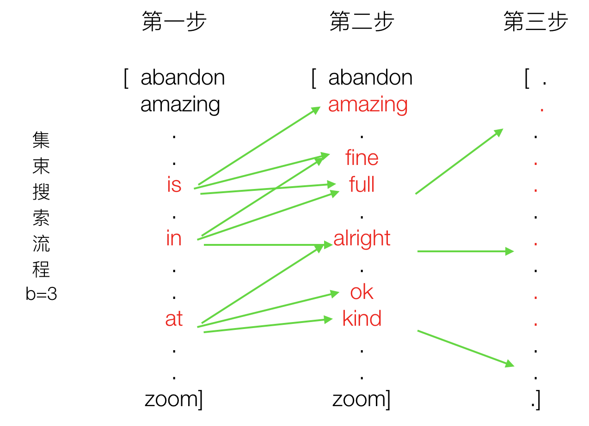

第一次：选出概率最大的三个词

第二次：选择上一步三个词，每个词对应三个概率最大的词（可能存在重复）

....

假设只有两步，那么得到9个结果。最终我们要从中选出三组结果
```
- is fine
- in alright
- at alright
```
那么这三个句子就是我们需要的结果。

### BLEU

> 机器翻译的自动评估方法

对于上述筛选的结果我们可以让一些语言专家进行评估选出最合适的。当然有大量人力也是可以这样去做，但是我们希望系统能够自动选择一个最合适的翻译句子。需要提供两个

1、衡量机器翻译结果越接近人工翻译结果的数值指标

2、一套人工翻译的高质量参考译文

- 定义

BLEU的全名为：bilingual evaluation understudy（双语互译质量评估辅助工具），它是用来评估机器翻译质量的工具。

判断两个句子的相似程度

- N-gram Precision（多元精度得分）方法

这里的N是什么意思，我们通过一个例子来理解一下。

```python
候选翻译：    the    the    the    the    the    the    the
参考翻译：    the    cat    is    on    the    mat    
参考翻译：    there    is    a    cat    on    the    mat
```

两个句子，S1和S2，S1里头的词出现在S2里头越多，就说明这两个句子越一致。记做$\frac{number1}{number2}$。上面例子，候选翻译的词7个词the都在参考翻译中出现，记做分子得分7，候选翻译一共就7个词，分母为7。7/7=1，该候选翻译显然不行！！这个时候**N=1，选出一个词**

> 改进

原因：常用词干扰、选词的粒度太小(the)

使用N-gram,多元词组：{“the cat”, “cat is”, “is on”, “on the”, “the mat”}

**同样还是一个词的时候的改进**

过滤常见词（the on is ...so on）

公式计算（分子）
$$
Count_{w_i,j}^{clip} = min(Count_{w_i},Ref_{j}\_Count_{w_i})
$$
统计候选区域

$Count_{w_i}$：候选翻译中单词$w_i$ 出现过的个数，如上表就是对“the”的计数为7

$Ref_{j}\_Count_{w_i}$:词$w_i$ 在第个 $j$ 参考翻译里出现的次数

$$
{Count}^{clip} = max(Count_{w_i,j}^{clip}), i=1,2,{...}
$$

作用：选出候选翻译在参考翻译中最大的计数

$Count_{w_i,j}^{clip}$：第 $j$ 个参考翻译，$w_{i}$ 计数

$Count^{clip}$：在所有参考翻译中的 $w_i$ 综合计数

仍然以上面的例子来看：$Ref_{1}\_Count_{'the'}=2$，则$Count_{'the',1}^{clip}=min(7,2)=2,Count_{'the',2}^{clip}=1$，所以综合计数为$Count^{clip}=max(1,2)=2$，**分母不变，仍是候选句子的n-gram个数。这里分母为7。**得分P = 2/7=0.28

**多个改进的多元精度（modified n-gram precision）进行组合**

n-gram下的可以衡量翻译的流程性，当我们对不同尺度的词进行统计出来，计算精度的时候，结果为

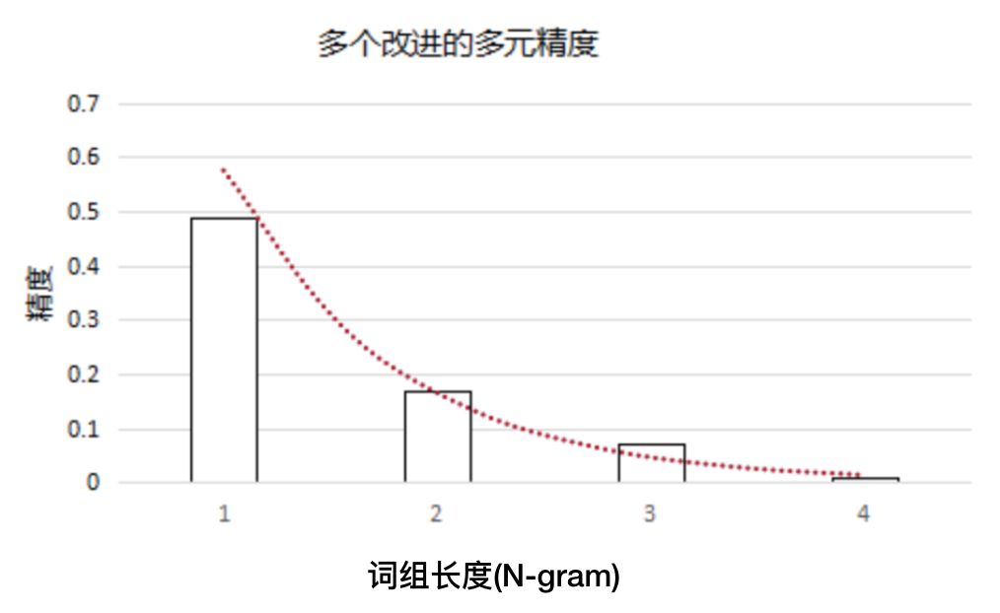

随着n-gram的增大，精度得分总体上成指数下降的。采取**几何加权平均**，并且将各n-gram的作用视为等重要的，即取权重服从均匀分布：
$$
p_{ave}=\sqrt[\sum_{n=1}^{N}w_{n}]{\prod_{n=1}^Np_{n}^{w_{n}}}=\frac{1}{\sum_{n=1}^{N}w_{n}}exp(\sum_{i=1}^{N}w_{n}*log^{p_{n}})=exp(\frac{1}{N}*\sum_{i=1}^{N}log^{p_{n}})
$$
上面图的理解就为：
$$
p_{ave}=exp(\frac{1}{4}*(log^{p_{1}}+log^{p_{2}}+log^{p_{3}}+log^{p_{4}}))
$$
**进行短句惩罚**

```
候选翻译：    the    cat                    
参考翻译：    the    cat    is    on    the    mat    
参考翻译：    there    is    a    cat    on    the    mat
```

这样就很容易的高分，所以就需要一个有效的乘惩罚机制。我们设c为候选翻译，r为参考翻译。则有下面的公式
$$
BP=\lbrace^{1,ifc>r}_{e^{1-\frac{r}{c}},ifc \leq r}
$$
**最终BLEU值得计算公式**
$$
BLEU=BP*exp(\sum_{n=1}^{N}w_{n}*log^{p_{n}})
$$
