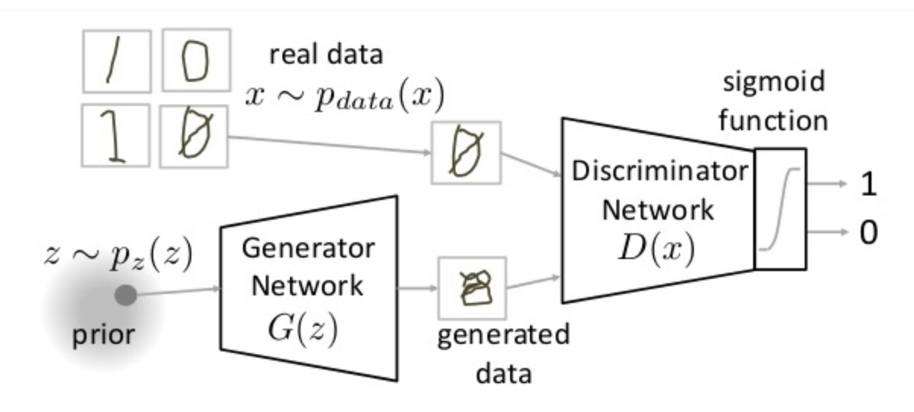
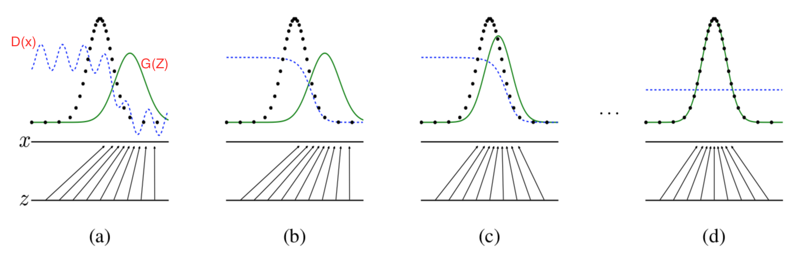
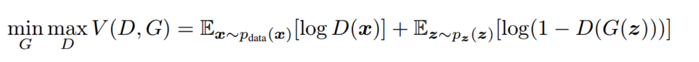
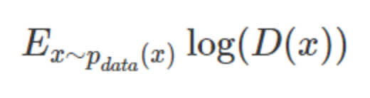
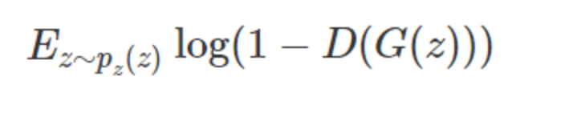
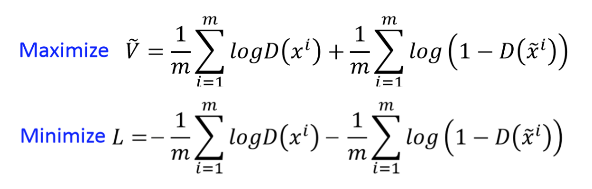
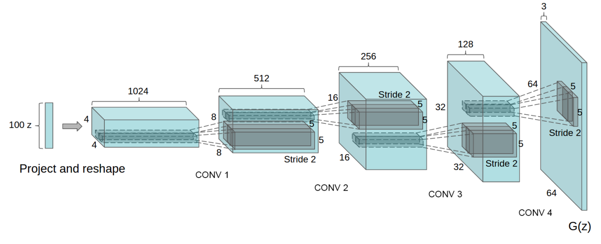

# GAN

GAN是非监督式学习的一种方法，在2014年被提出。

GAN主要用途：

- 生成以假乱真的图片
- 生成视频、模型

## 原理

### 定义

生成对抗网络(Generative Adversarial Network，简称GAN)，主要结构包括一个**生成器**G（Generator）和一个**判别器**D（Discriminator）。



- 生成器（Generator），能够输入一个向量，输出需要生成固定大小的像素图像
- 判别器（Discriminator），用来判别图片是真的还是假的，输入图片（训练的数据或者生成的数据），输出为判别图片的标签

### 理解

思想：**从训练库里获取很多训练样本，从而学习这些训练案例生成的概率分布**



黑色虚线：真是样本的分布
绿色实线：生成样本的分布
蓝色虚线：判别器判断的概率分布
$z$ 表示噪声，$z$ 到 $x$ 表示生成器生成的分布映射

- 过程分析：

> 定义GAN结构生成数据

(a)状态处于最初始的状态，生成器生成的分布和真实分布区别较大，并且判别器判别出样本的概率不稳定

> 在真实数据上训练 n epochs判别器，产生fake(假数据)并训练判别器识别为假

通过多次训练判别器来达到(b)(*b*)样本状态，此时判别样本区分得非常显著

> 训练生成器达到欺骗判别器的效果

训练生成器之后达到(c)样本状态，此时生成器分布相比之前，逼近了真实样本分布。经过多次反复训练迭代之后。

最终希望能够达到(d)状态，生成样本分布拟合于真实样本分布，并且判别器分辨不出样本是生成的还是真实的。

### 损失



$V(G,D)$ :表示P_ x和 P_z 的差异程度。

$ \max \limits_DV(D, G)$ :固定生成器G, 尽可能地让判别器能够最大化地判别出样本来自于真实数据还是生成的数据

$\min \limits_G L$:固定判别器D的条件下得到生成器G，能够最小化真实样本与生成样本的差异。

**整个优化我们其实只看做一个部分：**

判别器：相当于一个分类器，判断图片的真伪，二分类问题，使用交叉熵损失

对于真实样本：对数预测概率损失，提高预测的概率



对于生成样本：对数预测概率损失，降低预测概率



最终可以这样



### 结构

G、D结构是两个网络，特点是能够反向传播可导计算要介绍G、D结构，需要区分不同版本的GAN。

- 2014年最开始的模型：
    - G、D都是multilayer perceptron（MLP）
    - 缺点：实践证明训练难度大，效果不行
- 2015：使用卷积神经网络+GAN（DCGAN（Deep Convolutional GAN））
    - 改进：
        - 1、判别器D中取出pooling，全部变成卷积、生成器G中使用反卷积（下图）
        - 2、D、G中都增加了BN层
        - 3、去除了所有的全连接层
        - 4、判别器D中全部使用Leaky ReLU，生成器除了最后输出层使用tanh其它层全换成ReLU




## 案例

GAN生成手写数字图像

```python
from keras.datasets import mnist
from keras.layers import Input, Dense, Reshape, Flatten, Dropout
from keras.layers import BatchNormalization, Activation, ZeroPadding2D
from keras.layers.advanced_activations import LeakyReLU
from keras.layers.convolutional import UpSampling2D, Conv2D
from keras.models import Sequential, Model
from keras.optimizers import Adam
import numpy as np
import matplotlib.pyplot as plt


class DCGAN():
    def __init__(self):
        # 输入图片的形状
        self.img_rows = 28
        self.img_cols = 28
        self.channels = 1
        self.img_shape = (self.img_rows, self.img_cols, self.channels)

    def init_model(self):
        """
        初始化GAN模型结构D,G
        :return:
        """
        """
        1.建立D判别器CNN结构，初始化判别器训练优化参数
        2.联合建立G生成器CNN结构，初始化生成器训练优化参数
            输入噪点数据，输出预测的类别概率
            注意生成器训练时，判别器不进行训练
            from keras.optimizers import Adam
        """
        # 生成原始噪点数据大小
        self.latent_dim = 100
        # 获取定义好的优化器
        optimizer = Adam(0.0002, 0.5)
        # 1.建立判别器D参数
        self.discriminator = self.build_discriminator()
        self.discriminator.compile(loss="binary_crossentropy", optimizer=optimizer, metrics=['accuracy'])
        # 2.建立生成器G参数
        # 损失，判别器输出结果与目标值的交叉熵损失
        self.generator = self.build_generator()
        # 定义输出的躁点数据机构，输入到生成器当中，得到图片
        z = Input(shape=(self.latent_dim,))
        img = self.generator(z)
        # 图片要输入到判别器得到预测结果
        self.discriminator.trainable = False  # 需停止判别器训练
        valid = self.discriminator(img)
        # 损失
        # 训练生成器欺骗判别器
        self.combined = Model(z, valid)
        self.combined.compile(loss="binary_crossentropy", optimizer=optimizer)

        return None

    def build_discriminator(self):
        """
        定义模型判别器
        :return:
        """
        """
        from keras.layers import Input, Dense, Reshape, Flatten, Dropout 
        from keras.layers import BatchNormalization, Activation, ZeroPadding2D 
        from keras.layers.advanced_activations import LeakyReLU 
        from keras.layers.convolutional import UpSampling2D, Conv2D 
        from keras.models import Sequential, Model
        """
        model = Sequential()

        model.add(Conv2D(32, kernel_size=3, strides=2, input_shape=self.img_shape, padding="same"))
        model.add(LeakyReLU(alpha=0.2))
        model.add(Dropout(0.25))
        model.add(Conv2D(64, kernel_size=3, strides=2, padding="same"))
        model.add(ZeroPadding2D(padding=((0, 1), (0, 1))))
        model.add(BatchNormalization(momentum=0.8))
        model.add(LeakyReLU(alpha=0.2))
        model.add(Dropout(0.25))
        model.add(Conv2D(128, kernel_size=3, strides=2, padding="same"))
        model.add(BatchNormalization(momentum=0.8))
        model.add(LeakyReLU(alpha=0.2))
        model.add(Dropout(0.25))
        model.add(Conv2D(256, kernel_size=3, strides=1, padding="same"))
        model.add(BatchNormalization(momentum=0.8))
        model.add(LeakyReLU(alpha=0.2))
        model.add(Dropout(0.25))
        model.add(Flatten())
        model.add(Dense(1, activation='sigmoid'))

        model.summary()

        img = Input(shape=self.img_shape)
        validity = model(img)

        return Model(img, validity)

    def build_generator(self):
        """
        定义模型生成器，CNN结构
        :return:
        """
        model = Sequential()

        model.add(Dense(128 * 7 * 7, activation="relu", input_dim=self.latent_dim))
        model.add(Reshape((7, 7, 128)))
        model.add(UpSampling2D())
        model.add(Conv2D(128, kernel_size=3, padding="same"))
        model.add(BatchNormalization(momentum=0.8))
        model.add(Activation("relu"))
        model.add(UpSampling2D())
        model.add(Conv2D(64, kernel_size=3, padding="same"))
        model.add(BatchNormalization(momentum=0.8))
        model.add(Activation("relu"))
        model.add(Conv2D(self.channels, kernel_size=3, padding="same"))
        model.add(Activation("tanh"))

        model.summary()

        noise = Input(shape=(self.latent_dim,))
        img = model(noise)

        return Model(noise, img)

    def train(self, epochs, batch_size=32):
        """
        训练模型
        :param epochs:
        :param batch_size:
        :return:
        """
        """
        from keras.datasets import mnist
        import matplotlib.pyplot as plt
        import numpy as np
        model:train_on_batch(feature, target)
        """
        # 加载手写数字
        (X_train, _), (_, _) = mnist.load_data()
        # 进行归一化
        X_train = X_train / 127.5 - 1.  # (60000, 28, 28)
        X_train = np.expand_dims(X_train, axis=3)  # 扩展维度
        # 正负样本的目标值建立
        # batch_size大小真实样本的目标值是1假样本的目标值是0
        valid = np.ones((batch_size, 1))
        fake = np.zeros((batch_size, 1))
        for epoch in range(epochs):
            # 1.训练判别器
            # 选择随机的一些真实样本
            idx = np.random.randint(0, X_train.shape[0], batch_size)
            imgs = X_train[idx]
            # 生成器产生假样本
            noise = np.random.normal(0, 1, (batch_size, self.latent_dim))
            gen_imgs = self.generator.predict(noise)
            # 训练判别器过程
            d_loss_real = self.discriminator.train_on_batch(imgs, valid)
            d_loss_fake = self.discriminator.train_on_batch(gen_imgs, fake)
            # 计算平均两部分损失
            d_loss = np.add(d_loss_real, d_loss_fake) / 2
            # 2.训练生成器，停止判别器
            # 用目标值为1去训练，目的使得生成器生成的样本越来越接近真实样本
            g_loss = self.combined.train_on_batch(noise, valid)
            # 打印结果
            print("迭代次数:%d, D判别器损失: %f, 准确率: %.2f, G生成器损失: %f]" % (epoch, d_loss[0], 100 * d_loss[1], g_loss))

            # 保存生成的图片
            if epoch % 50 == 0:
                self.save_imgs(epoch)
        return None

    def save_imgs(self, epoch):
        """
        保存生成的图片
        :param epoch:
        :return:
        """
        r, c = 5, 5
        noise = np.random.normal(0, 1, (r * c, self.latent_dim))
        gen_imgs = self.generator.predict(noise)

        # Rescale images 0 - 1
        gen_imgs = 0.5 * gen_imgs + 0.5

        fig, axs = plt.subplots(r, c)
        cnt = 0
        for i in range(r):
            for j in range(c):
                axs[i, j].imshow(gen_imgs[cnt, :, :, 0], cmap='gray')
                axs[i, j].axis('off')
                cnt += 1
        fig.savefig("./images/mnist_%d.png" % epoch)
        plt.close()
        return None


if __name__ == '__main__':
    dc = DCGAN()
    dc.init_model()
    dc.train(epochs=40000, batch_size=32)

```

