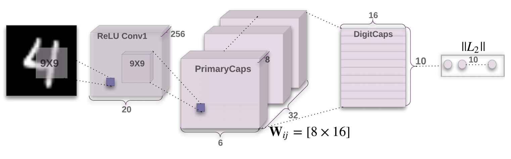

# CapsuleNet

## 引入

- 问题

2017年，CapsuleNet的出现是Hinton大佬对于卷积神经网络等的思考，想去构建一种新的网络结构, 如何克服CNN存在的问题的，那CN网络又存在什么问题：

> CNN的目标不正确

1、CNN对于旋转类型图片不确定

CNN会认为下图的R是两个不同的字母，而这是由网络结构所带来的，这也造成了CNN所需的训练集要很大。

2、CNN对于图片整体结构关系不确定

对于下面这张人脸图，CNN会认为这是张正确的图，因为只要存在一些关键结构即可，没有结构之间的联系

解决了图像识别中的**“毕加索问题”**

- 解决

Hinton认为人的视觉系统会有不一样的做法

人的视觉系统会建立坐标框架，坐标框架是参与到识别过程中，识别过程受到了空间概念的支配

## 原理

- 定义

**胶囊神经网络（CapsuleNet）**是一种机器学习系统，该方法试图更接近地模仿生物神经组织，该想法是将称为胶囊的结构添加到CNN当中。

论文地址：https://arxiv.org/pdf/1710.09829.pdf

- 改进特点

> 添加一个Capsule层

Capsule 是一组神经元，其**输入输出向量表示特定实体类型的实例化参数（即特定物体、概念实体等出现的概率与某些属性）**。

假设有手写数字10类别的分类任务，比如说10 x 16，输出表示了图像中存在的特定实体16个的各种性质。例如姿势（位置，大小，方向）、变形、速度、反射率，色彩、纹理等等。

> 输入输出向量的长度表示了某个实体出现的概率，所以它的值必须在 0 到 1 之间。

- 结构

第一个卷积层：使用了256个9×9 卷积核，步幅为 1，ReLU 激活函数。输出的张量才能是20×20×256

第二个卷积层：作为Capsule层的输入而构建相应的张量结构。

​	32个,9×9 的卷积核，步幅为 2下做卷积, 得到6×6×32的张量，等价于 6×6×1×32

​	8 次不同权重的 Conv2d 操作，得到6 x 6 x 8 x 32

​	理解：6×6×32=1152Capsule单元，每个向量长度为8

第三层:有10个标准的Capsule单元，每个Capsule的输出向量有16 个元素，10 X 16

​	参数：$W_{i,j}$有1152×10个，每个是8×16的向量

- 效果

Capsules on MNIST达到约0.25%的错误率，相比之前CNN0.39%的错误率提高

