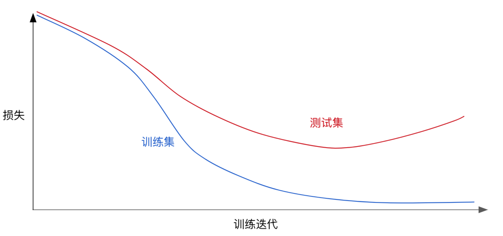
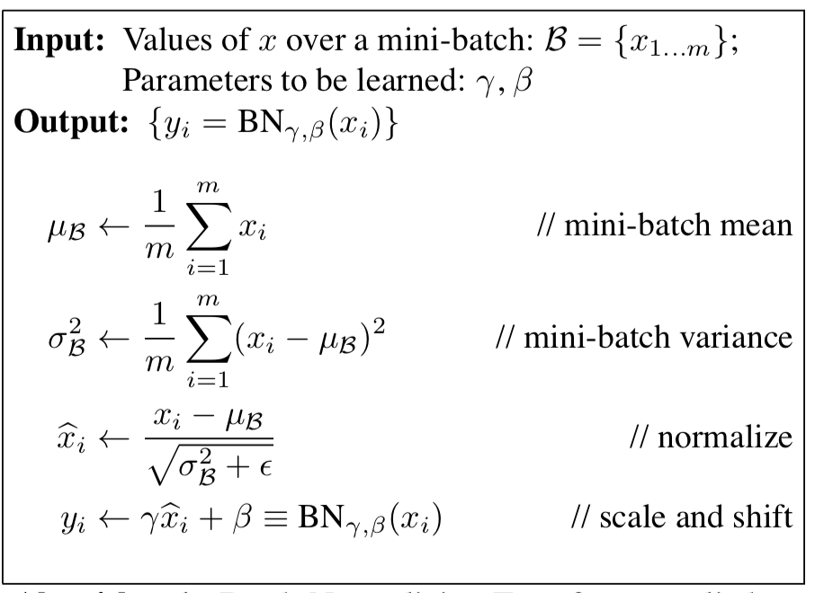

#  深度学习进阶

## 单层多层的原理

- 单层

单层感知机是最简单的神经网络模型，它仅有输入层和输出层构成。

单层感知机本质上是在高纬空间中，构造出合理的边界超平面，把不同类别的数据集分离，因此，对于线性可分，或者近似线性可分的数据集有很好的效果，但对于线性不可分数据，就没有办法仅通过一个超平面来分离数据了。所以单层感知机学习能力有限。

- 多层

在输入和输出层之间引入隐藏层，则会让网络有更强大的学习能力，可以解决非线性问题。

从理论角度来说，Kurt Hornik在1991年提出的全局逼近定理提供了理论的依据：对于含有一个隐藏层的前馈神经网络，如果隐藏层可以由任意多的神经元构成，那么神经网络能够逼近实数范围内的任意连续函数。

从应用角度来说，对于分类问题，隐藏层的作用就是把线性不可分的数据，通过线性变换（预激活阶段）和非线性的激活（激活阶段）的操作，使得数据在输出层变成线性可分。

## 激活函数

激活函数的作用是为了在神经网络中引入非线性的学习和处理能力。通过引入隐藏层，模型能力的提升并不是应为添加了隐藏层，而是在于隐藏层神经元中引入了激活函数。

使用线性激活函数和不使用激活函数、直接使用 Logistic 回归没有区别，那么无论神经网络有多少层，输出都是输入的线性组合，与**没有隐藏层**效果相当，就成了最原始的感知器了。

涉及到网络的优化时候，会有不同的激活函数选择有一个问题是神经网络的隐藏层和输出单元用什么激活函数。之前我们都是选用 sigmoid 函数，但有时其他函数的效果会好得多，大多数通过实践得来，没有很好的解释性。

激活函数的性质：非线性、可微性、单调性

- sigmoid

    

sigmoid函数把输入的数据压缩到[0,1]范围内，处于中间部分的数据变化大，重要特征会集中在这一部分区域，称为活跃区，相反，处于两侧的数据变化较小，神经元处于抑制状态。

函数的表达形式
$$
f(x) = \frac{1}{1+e^{-x}}
$$
越来越少被采用的原因：

1. 利用反向传播来训练时，会产生梯度小时的问题，导致训练效果不理想
2. 经过处理后的输出数据是一个非负值，这种不平衡性会增加梯度的不确定性

- tanh


它把数值区间压缩到[-1,1]，可以看作对sigmoid函数进行了伸缩

函数的表达形式
$$
tanh(x) = \frac{e^x-e^{-x}}{e^x+e^{-x}}=2\sigma(2x)-1
$$
与sigmoid相比，tanh具有更稳定的梯度，这是因为经过处理的输出数据均值为0，相当于进行了归一化处理。

tanh函数的导数区间为[0, 1]，比sigmoid的导数区间要大，在反向传播的过程中，衰减速度要更慢。

由于其导数小于1，在反向传播中，同样无法避免梯度消失的问题。

- ReLU


函数表达式与导数表达式
$$
f(x)=\max(0, x)\\
f'(x) = \begin{cases}
1, & x>0\\
0, & x\le0
\end{cases}
$$


与sigmoid相比，具有如下优点

1. 单侧抑制：当输入小于0时，神经元处于抑制态，相反，当输入大于0时，神经元处于激活态。
2. 相对宽阔的兴奋边界：只要大于0，神经元就会处于激活状态。
3. 稀疏激活性：sigmoid和tanh实际上把抑制态的神经元设置为一个非常小的值，但是仍然会参与到计算中。ReLU则直接将抑制态的神经元设置为0，使得这些神经元不再参与到后续的计算过程中，所以，收敛速度要远快于其他的激活函数。

但是，设置为0的简单处理导致神经网络的训练在后期变得脆弱。此时，被称为“dying ReLU”。原因主要是ReLU对抑制态的处理过于极端，导致后续的训练中，抑制态神经元将不再参与后面的运算。

- Leaky ReLU


Leaky-ReLU是ReLU的改进版，也是为了解决“dying ReLU”而提出。这个很小的 实数 $\alpha$ 能有效缓解稀疏性导致的训练脆弱问题。

函数形式
$$
f(x)=\begin{cases}
x, & x\ge 0\\
\alpha x, & x<0
\end{cases}
$$

- elu

参数小于0时，使用$\alpha(\exp(x)-1)$，大于等于0时，输出参数值，值域$(-\alpha, \inf)$

函数形式
$$
f(x) = x <0 ?\alpha(e^x-1):x
$$

- softmax

归一化的指数函数，将K维的实数域压缩到K维的值域(0,1)，数值总和为1。

在概率论中，这个公式描述了一个有K中不同取值的离散变量的分布，常出现在其他多类别分类算法中。

函数形式
$$
f(x)_j = \frac{e^{x_j}}{\sum_i^Ke^{x_i}}, j=1,\cdots,K
$$

- softplus

将原始值从任意实数区间投影到正实数区间(0,inf)

函数形式
$$
f(x) = \ln(1 + \exp(x))
$$

- softsign

作用类似三角函数，将实数域上的数值投影到区间(-1,1)

函数形式
$$
f(x) = \frac{x}{1+||x||}
$$

## 多分类

### softmax回归

对于**多分类问题**，用 N表示种类个数，那么神经网络的输出层的神经元个数必须为$L[output]=N$, 每个神经元的输出依次对应属于N个类别当中某个具体类别的概率，即 $P(y=N_1|x),\cdots,P(y=N_n|x)$。

输出层即

$$
Z^{[L]} = W^{[L]}a^{[L-1]} + b^{[L]}
$$

Z的输出值个数为类别个数.

需要对所有的输出结果进行一下softmax公式计算

$$
a^{[L]}_i = \frac{e^{Z^{[L]}_i}}{\sum^C_{i=1}e^{Z^{[L]}_i}}
$$

并且满足
$$
\sum^C_{i=1}a^{[L]}_i = 1
$$

### 交叉熵损失

逻辑回归的损失也可以这样表示
$$
\begin{aligned}
J(\theta) 
&= -\frac{1}{m}\bigg[\sum_{i=1}^{m}{(1-y^{(i)})\log{(1-h_\theta(x^{(i)}))}+y^{(i)}\log h_\theta(x^{(i)})}\bigg] \\
&= -\frac{1}{m}\bigg[\sum_{i=1}^m\sum_{j=0}^1{1\{y^{(i)}=j\}\log{p(y^{(i)}=j|x^{(i)}; \theta})}\bigg]

\end{aligned}
$$
对于softmax回归（逻辑回归代价函数的推广，都可称之为交叉熵损失），它的代价函数公式为：
$$
L(\hat y, y) = -\sum^C_{j=1}y_j\log\hat y_j
$$
总损失函数可以记为
$$
J = \frac{1}{m}\sum^m_{i=1}L(\hat y, y)
$$
对于真实值会进行一个one-hot编码，每一个样本的所属类别都会在某个类别位置上标记。


上图中，交叉熵损失为
$$
0\log(0.10)+0\log(0.05)+\cdots+0log(0.10)
$$
one_hot示例


代码示例

```python
import os

import numpy as np
import tensorflow as tf

"""
使用2层全连接神经网络对Mnist数据集进行多分类
1.网络设计
神经网络除了输入层之外采取两个层：1.隐层中64个神经元，2.输出层（全连接层）设置10个神经元(用于区分0～9)
2.确定网络结构及形状
1层：输入x[None, 784],权重[784, 64],偏置[64],输出[None, 64]
2层：输入[None, 64],权重[64, 10],偏置[10],输出[None, 10]
3.流程
获取数据、前向传播（网络结构定义）、损失计算、反向传播（梯度下降优化）
"""
# 定义一个是否训练、预测的标志
tf.app.flags.DEFINE_integer("is_train", 2, "训练or预测")

FLAGS = tf.app.flags.FLAGS


def full_connected_nn():
    # 1.获取数据
    # tensorflow旧的加载Mnist数据集方式
    # from tensorflow.examples.tutorials.mnist import input_data
    # res = input_data.read_data_sets('./datasets/minist_data', one_hot=True)
    # print(res.train.images.shape, res.train.labels.shape, res.test.images.shape, res.test.labels.shape)
    # # (55000, 784) (55000,) (10000, 784) (10000,)
    # print(res.train.images[0])
    # tensorflow新的加载Mnist数据集方式
    mnist = tf.keras.datasets.mnist
    (train_image, train_label), (test_image, test_label) = mnist.load_data()
    print(train_image.shape, train_label.shape, test_image.shape, test_label.shape)
    # (60000, 28, 28) (60000,) (10000, 28, 28) (10000,)
    # 对数据集的特征值做处理，对目标值做one-hot处理
    train_image = train_image.reshape(train_image.shape[0], 784).astype(np.float32) / 255
    test_image = test_image.reshape(test_image.shape[0], 784).astype(np.float32) / 255
    train_label = tf.keras.utils.to_categorical(train_label, num_classes=10)
    test_label = tf.keras.utils.to_categorical(test_label, num_classes=10)
    print(train_label.shape)  # (60000, 10)

    # 定义占位符，Mnist数据实时提供给placeholder
    # 输入[None, 784],输出[None, 10]
    with tf.variable_scope("mnist_data"):
        x = tf.placeholder(tf.float32, [None, 784], name="feature")
        y_true = tf.placeholder(tf.int32, [None, 10], name="label")

    # 2.前向传播
    # 1层：输入x[None, 784],权重[784, 64],偏置[64],输出[None, 64]
    # 2层：输入[None, 64],权重[64, 10],偏置[10],输出[None, 10]
    with tf.variable_scope("fc_model"):
        # 随机化初始权重和偏置参数，使用OP定义
        # 1层
        weight_1 = tf.Variable(tf.random_normal([784, 64], mean=0.0, stddev=1.0), name="weightes_1")
        biases_1 = tf.Variable(tf.random_normal([64], mean=0.0, stddev=1.0), name='biases_1')
        # 2层
        weight_2 = tf.Variable(tf.random_normal([64, 10], mean=0.0, stddev=1.0), name="weightes_2")
        biases_2 = tf.Variable(tf.random_normal([10], mean=0.0, stddev=1.0), name='biases_2')
        # 矩阵运算，全连接层输出结果
        y_1 = tf.matmul(x, weight_1) + biases_1
        y_predict = tf.matmul(y_1, weight_2) + biases_2

    # 3.softmax回归及交叉熵损失计算
    with tf.variable_scope("softmax_cross"):
        # 先进行网络输出的值的概率计算softmax,再进行交叉熵损失计算
        all_loss = tf.nn.softmax_cross_entropy_with_logits(labels=y_true, logits=y_predict)
        # 平均损失
        loss = tf.reduce_mean(all_loss)

    # 4.梯度下降优化损失
    with tf.variable_scope("optimizer"):
        train_op = tf.train.GradientDescentOptimizer(0.1).minimize(loss)

    # 5.得出每次训练的准确率
    with tf.variable_scope("accuracy"):
        # 求出每个样本是否相等的一个列表
        equal_list = tf.equal(tf.argmax(y_true, 1), tf.argmax(y_predict, 1))
        # 计算相等的样本的比例
        accuracy = tf.reduce_mean(tf.cast(equal_list, tf.float32))

    # 1.收集要在tensorboard观察的张量值
    tf.summary.scalar("losses", loss)
    tf.summary.scalar("acc", accuracy)
    tf.summary.histogram("w1", weight_1)
    tf.summary.histogram("b1", biases_1)
    tf.summary.histogram("w2", weight_2)
    tf.summary.histogram("b2", biases_2)

    # 2.合并所有变量op
    merged = tf.summary.merge_all()

    # 创建模型保存和加载
    saver = tf.train.Saver()

    # 开启会话进行训练
    with tf.Session() as sess:
        # 初始化变量op
        init_op = tf.global_variables_initializer()
        sess.run(init_op)
        # tensorboard可视化
        # 创建一个events文件实例
        file_writer = tf.summary.FileWriter('./tmp/summary/', graph=sess.graph)
        # 加载本地模型继续训练或者拿来进行预测测试集
        if os.path.exists("./tmp/modelckpt/checkpoint"):
            saver.restore(sess, "./tmp/modelckpt/fc_nn_model")
        if FLAGS.is_train == 1:
            # 循环训练
            for i in range(1200):
                # 每批给50个样本
                mnist_x, mnist_y = train_image[50 * i:50 * (i + 1)], train_label[50 * i:50 * (i + 1)]
                _, loss_run, acc_run, summary = sess.run([train_op, loss, accuracy, merged],
                                                         feed_dict={x: mnist_x, y_true: mnist_y})
                print("第 %d 步的50个样本损失为：%f , 准确率为：%f" % (i, loss_run, acc_run))

                # 3.运行合变量op，写入事件文件当中
                file_writer.add_summary(summary, i)

                # 每隔100步保存一次模型
                if i % 100 == 0:
                    saver.save(sess, "./tmp/modelckpt/fc_nn_model")
        else:
            # 进行预测
            for i in range(100):
                image, label = test_image[1 * i:1 * (i + 1)], test_label[1 * i:1 * (i + 1)]
                # 直接运行网络的输出预测结果
                print("第 %d 样本，真实的图片数字为：%d, 神经网络预测的数字为：%d " % (
                    i,
                    tf.argmax(label, 1).eval(),
                    tf.argmax(sess.run(y_predict, feed_dict={x: image, y_true: label}), 1).eval()
                ))


if __name__ == '__main__':
    full_connected_nn()

```

## 梯度下降改进

### 问题提出

- 梯度消失

在梯度函数上出现的以指数级递增或者递减的情况分别称为**梯度爆炸**或者**梯度消失**。

假设$g(z) = z, b^{[l]} = 0$，对于目标输出有：$\hat{y} = W^{[L]}W^{[L-1]}...W^{[2]}W^{[1]}X$

对于$W^{[l]}$的值大于 1 的情况，激活函数的值将以指数级递增；

对于$W^{[l]}$的值小于 1 的情况，激活函数的值将以指数级递减。

在计算梯度时，根据不同情况梯度函数也会以指数级递增或递减，导致训练导数难度上升，梯度下降算法的步长会变得非常小，需要训练的时间将会非常长。

梯度消失的源头在于激活函数，如sigmoid函数和tanh函数，它们的导数数值范围都小于1，以sigmoid为例，范围[0,1/4]，当对激活函数求导后，$\frac{\partial L(f(x),y)}{\partial a^k(x)_i}$ 取值都要比上一层减少1/4，则梯度的计算随着层数的增加而呈现指数级的递减趋势，离输出层越远，梯度减少越明显。

- 局部最优


**鞍点（saddle）**是函数上的导数为零，但不是轴上局部极值的点。通常梯度为零的点是上图所示的鞍点，而非局部最小值。减少损失的难度也来自误差曲面中的鞍点，而不是局部最低点。


在训练较大的神经网络、存在大量参数，并且成本函数被定义在较高的维度空间时，困在极差的局部最优基本不会发生

**鞍点附近的平稳段会使得学习非常缓慢，而这也是需要后面的动量梯度下降法、RMSProp 以及 Adam 优化算法能够加速学习的原因，它们能帮助尽早走出平稳段。**

### 解决方法

#### 初始化参数策略

为什么要随机初始化权重？

如果在初始时将两个隐藏神经元的参数设置为相同的大小，那么两个隐藏神经元对输出单元的影响也是相同的，通过反向梯度下降去进行计算的时候，会得到同样的梯度大小，所以在经过多次迭代后，两个隐藏层单位仍然是对称的。无论设置多少个隐藏单元，其最终的影响都是相同的，那么多个隐藏神经元就没有了意义。

在初始化的时候，W 参数要进行随机初始化，不可以设置为 0。b 因为不存在上述问题，可以设置为 0。

以 2 个输入，2 个隐藏神经元为例：

```py
W = np.random.rand(2,2)* 0.01
b = np.zeros((2,1))
```

初始化权重的值选择？

这里将 W 的值乘以 0.01（或者其他的常数值）的原因是为了使得权重 W 初始化为较小的值，**这是因为使用 sigmoid 函数或者 tanh 函数作为激活函数时，W 比较小，则 Z=WX+b 所得的值趋近于 0，梯度较大，能够提高算法的更新速度。而如果 W 设置的太大的话，得到的梯度较小，训练过程因此会变得很慢。**

ReLU 和 Leaky ReLU 作为激活函数时不存在这种问题，因为在大于 0 的时候，梯度均为 1。

#### 批梯度下降

批梯度下降(Batch Gradient Descent)

> 批梯度下降法(btach)，即同时处理整个训练集

其在更新参数时使用所有的样本来进行更新。对整个训练集进行梯度下降法的时候，我们必须处理整个训练数据集，然后才能进行一步梯度下降，即每一步梯度下降法需要对整个训练集进行一次处理，如果训练数据集很大的时候，处理速度就会比较慢。

**所以换一种方式，每次处理训练数据的一部分进行梯度下降法，则我们的算法速度会执行的更快。**

小批量梯度下降(Mini-Batch Gradient Descent)

> Mini-Batch 梯度下降法（小批量梯度下降法）每次同时处理固定大小的数据集。

使用 Mini-Batch 梯度下降法，对整个训练集的一次遍历(epoch)只做 mini-batch个样本的梯度下降，一直循环整个训练集。

随机梯度下降(stochastic gradient descent)

> mini-batch 的大小为 1，即是随机梯度下降法

- 代价函数区别

batch梯度下降法和Mini-batch 梯度下降法代价函数的变化趋势如下：


- 优化影响

batch 梯度下降法
```
- 对所有m个训练样本执行一次梯度下降，每一次迭代时间较长，训练过程慢；
- 相对噪声低一些，成本函数总是向减小的方向下降。
```
随机梯度下降法(Mini-Batch=1)：
```
- 对每一个训练样本执行一次梯度下降，训练速度快，但丢失了向量化带来的计算加速；
- 有很多噪声，需要适当减小学习率，成本函数总体趋势向全局最小值靠近，但永远不会收敛，而是一直在最小值附近波动。
````
因此，选择一个合适的大小进行 Mini-batch 梯度下降，可以实现快速学习，也应用了向量化带来的好处，且成本函数的下降处于前两者之间。

- 大小选择

如果训练样本的大小比较小，如 $m\le2000$ 时，选择 batch 梯度下降法；

如果训练样本的大小比较大，选择 Mini-Batch 梯度下降法。为了和计算机的信息存储方式相适应，代码在 mini-batch 大小为 2 的幂次时运行要快一些。典型的大小为$2^6, 2^7,2^8,2^9$,mini-batch 的大小要符合 CPU/GPU 内存。

需要根据经验快速尝试，找到能够最有效地减少成本函数的值。

那么第二种方式是通过优化梯度下降过程，会比梯度下降算法的速度更快些

#### 动量梯度下降

- 指数加权平均

**指数加权平均（Exponentially Weight Average）**是一种常用的序列数据处理方式，通常用在序列场景如金融序列分析、温度变化序列分析。

指数加权的公式即：
$$
S_t = \begin{cases} Y_1, &t = 1 \\ \beta S_{t-1} + (1-\beta)Y_t, &t > 1 \end{cases}
$$
其中$Y_{t}$ 为 $t$下的实际值，$S_{t}$为$t$下加权平均后的值，$\beta$ 为权重值。

通过指数加权公式，对$S=Y$ 进行平滑处理，$\beta$ 越大相当于求取平均利用前面的数据比重的越多**，曲线自然就会越平滑而且越滞后。这些系数被称作**偏差修正（Bias Correction）


- 动量梯度下降

**动量梯度下降（Gradient Descent with Momentum）**是**计算梯度的指数加权平均数**，并利用该值来更新参数值。动量梯度下降法的整个过程为：
$$
S_{dW^{[l]}} = \beta S_{dW^{[l]}} + (1 - \beta) dW^{[l]}\\
S_{db^{[l]}} = \beta S_{db^{[l]}} + (1 - \beta) db^{[l]}\\
W^{[l]} := W^{[l]} - \alpha S_{dW^{[l]}}\\
b^{[l]} := b^{[l]} - \alpha S_{db^{[l]}}
$$
使用动量梯度下降时，通过累加过去的梯度值来减少抵达最小值路径上的波动，加速了收敛，因此在横轴方向下降得更快，从而得到图中红色或者紫色的曲线。**当前后梯度方向一致时，动量梯度下降能够加速学习；而前后梯度方向不一致时，动量梯度下降能够抑制震荡。**

我们可以这样形象的理解，小球在向下运动过程中会有加速度，导致越来越快，由于$\beta$ 的存在使得不会一直加速运行。

#### RMSProp算法

**RMSProp（Root Mean Square Prop）**算法是在对梯度进行指数加权平均的基础上，引入平方和平方根
$$
s_{dw}=\beta s_{dw} + (1−\beta)(dw)^2 \\

s_{db} = \beta s_{db} + (1 - \beta)(db)^2\\

w := w - \alpha \frac{dw}{\sqrt{s_{dw} + \epsilon}}\\

b := b - \alpha \frac{db}{\sqrt{s_{db} + \epsilon}}
$$
其中 $\epsilon$是一个非常小的数，防止分母太小导致不稳定,当 dw 或 db 较大时，$(dw)^{2}, (db)^{2}$会较大，进而$s_{dw}$也会较大，最终使得$\frac{db}{\sqrt{s_{db} + \epsilon}}$等结果变得非常小。

最终RMSProp 有助于减少抵达最小值路径上的摆动，并允许使用一个更大的学习率 α，从而加快算法学习速度。

#### Adam算法

**Adam 优化算法（Adaptive Moment Estimation，自适应矩估计）**将 Momentum 和 RMSProp 算法结合在一起。

假设用每一个 mini-batch 计算 dW、db，第 $t$ 次迭代时：
$$
v_{dW} = \beta_1 v_{dW} + (1 - \beta_1) dW\\
v_{db} = \beta_1 v_{db} + (1 - \beta_1) db\\

v^{corrected}_{dW^{[l]}} = \frac{v_{dW^{[l]}}}{1 - (\beta_1)^t}\\
v^{corrected}_{db^{[l]}} = \frac{v_{db^{[l]}}}{1 - (\beta_1)^t}\\

s_{dW} = \beta_2 s_{dW} + (1 - \beta_2) {(dW)}^2\\
s_{db} = \beta_2 s_{db} + (1 - \beta_2) {(db)}^2\\
s^{corrected}_{dW^{[l]}} = \frac{s_{dW^{[l]}}}{1 - (\beta_1)^t}\\
s^{corrected}_{db^{[l]}} = \frac{s_{db^{[l]}}}{1 - (\beta_1)^t}
$$
其中 $l$ 为某一层，$t$ 为移动平均第次的值

Adam 算法的参数更新：
$$
W:=W- \alpha\frac{v^{corrected}_{dW}}{\sqrt{s^{corrected}_{dW}} + \epsilon}\\
b:=b- \alpha\frac{v^{corrected}_{db}}{\sqrt{s^{corrected}_{db}} + \epsilon}
$$

代码示例

基础代码

```python
# utils.py
import numpy as np
import matplotlib.pyplot as plt
import h5py
import scipy.io
import sklearn
import sklearn.datasets


def sigmoid(x):
    """
    Compute the sigmoid of x

    Arguments:
    x -- A scalar or numpy array of any size.

    Return:
    s -- sigmoid(x)
    """
    s = 1 / (1 + np.exp(-x))
    return s


def relu(x):
    """
    Compute the relu of x

    Arguments:
    x -- A scalar or numpy array of any size.

    Return:
    s -- relu(x)
    """
    s = np.maximum(0, x)

    return s


def initialize_parameters(layer_dims):
    """
    Arguments:
    layer_dims -- python array (list) containing the dimensions of each layer in our network

    Returns:
    parameters -- python dictionary containing your parameters "W1", "b1", ..., "WL", "bL":
                    W1 -- weight matrix of shape (layer_dims[l], layer_dims[l-1])
                    b1 -- bias vector of shape (layer_dims[l], 1)
                    Wl -- weight matrix of shape (layer_dims[l-1], layer_dims[l])
                    bl -- bias vector of shape (1, layer_dims[l])

    Tips:
    - For example: the layer_dims for the "Planar Data classification model" would have been [2,2,1].
    This means W1's shape was (2,2), b1 was (1,2), W2 was (2,1) and b2 was (1,1). Now you have to generalize it!
    - In the for loop, use parameters['W' + str(l)] to access Wl, where l is the iterative integer.
    """

    np.random.seed(3)
    parameters = {}
    L = len(layer_dims)  # number of layers in the network

    for l in range(1, L):
        parameters['W' + str(l)] = np.random.randn(layer_dims[l], layer_dims[l - 1]) * np.sqrt(2 / layer_dims[l - 1])
        parameters['b' + str(l)] = np.zeros((layer_dims[l], 1))

        assert (parameters['W' + str(l)].shape == layer_dims[l], layer_dims[l - 1])
        assert (parameters['W' + str(l)].shape == layer_dims[l], 1)

    return parameters


def compute_cost(a3, Y):
    """
    Implement the cost function

    Arguments:
    a3 -- post-activation, output of forward propagation
    Y -- "true" labels vector, same shape as a3

    Returns:
    cost - value of the cost function
    """
    m = Y.shape[1]

    logprobs = np.multiply(-np.log(a3), Y) + np.multiply(-np.log(1 - a3), 1 - Y)
    cost = 1. / m * np.sum(logprobs)

    return cost


def forward_propagation(X, parameters):
    """
    Implements the forward propagation (and computes the loss) presented in Figure 2.

    Arguments:
    X -- input dataset, of shape (input size, number of examples)
    parameters -- python dictionary containing your parameters "W1", "b1", "W2", "b2", "W3", "b3":
                    W1 -- weight matrix of shape ()
                    b1 -- bias vector of shape ()
                    W2 -- weight matrix of shape ()
                    b2 -- bias vector of shape ()
                    W3 -- weight matrix of shape ()
                    b3 -- bias vector of shape ()

    Returns:
    loss -- the loss function (vanilla logistic loss)
    """

    # retrieve parameters
    W1 = parameters["W1"]
    b1 = parameters["b1"]
    W2 = parameters["W2"]
    b2 = parameters["b2"]
    W3 = parameters["W3"]
    b3 = parameters["b3"]

    # LINEAR -> RELU -> LINEAR -> RELU -> LINEAR -> SIGMOID
    z1 = np.dot(W1, X) + b1
    a1 = relu(z1)
    z2 = np.dot(W2, a1) + b2
    a2 = relu(z2)
    z3 = np.dot(W3, a2) + b3
    a3 = sigmoid(z3)

    cache = (z1, a1, W1, b1, z2, a2, W2, b2, z3, a3, W3, b3)

    return a3, cache


def backward_propagation(X, Y, cache):
    """
    Implement the backward propagation presented in figure 2.

    Arguments:
    X -- input dataset, of shape (input size, number of examples)
    Y -- true "label" vector (containing 0 if cat, 1 if non-cat)
    cache -- cache output from forward_propagation()

    Returns:
    gradients -- A dictionary with the gradients with respect to each parameter, activation and pre-activation variables
    """
    m = X.shape[1]
    (z1, a1, W1, b1, z2, a2, W2, b2, z3, a3, W3, b3) = cache

    dz3 = 1. / m * (a3 - Y)
    dW3 = np.dot(dz3, a2.T)
    db3 = np.sum(dz3, axis=1, keepdims=True)

    da2 = np.dot(W3.T, dz3)
    dz2 = np.multiply(da2, np.int64(a2 > 0))
    dW2 = np.dot(dz2, a1.T)
    db2 = np.sum(dz2, axis=1, keepdims=True)

    da1 = np.dot(W2.T, dz2)
    dz1 = np.multiply(da1, np.int64(a1 > 0))
    dW1 = np.dot(dz1, X.T)
    db1 = np.sum(dz1, axis=1, keepdims=True)

    gradients = {"dz3": dz3, "dW3": dW3, "db3": db3,
                 "da2": da2, "dz2": dz2, "dW2": dW2, "db2": db2,
                 "da1": da1, "dz1": dz1, "dW1": dW1, "db1": db1}

    return gradients


def predict(X, y, parameters):
    """
    This function is used to predict the results of a  n-layer neural network.

    Arguments:
    X -- data set of examples you would like to label
    parameters -- parameters of the trained model

    Returns:
    p -- predictions for the given dataset X
    """

    m = X.shape[1]
    p = np.zeros((1, m), dtype=np.int)

    # Forward propagation
    a3, caches = forward_propagation(X, parameters)

    # convert probas to 0/1 predictions
    for i in range(0, a3.shape[1]):
        if a3[0, i] > 0.5:
            p[0, i] = 1
        else:
            p[0, i] = 0

    print("Accuracy: " + str(np.mean((p[0, :] == y[0, :]))))

    return p


def load_dataset():
    np.random.seed(3)
    train_X, train_Y = sklearn.datasets.make_moons(n_samples=300, noise=.2)
    train_X = train_X.T
    train_Y = train_Y.reshape((1, train_Y.shape[0]))
    return train_X, train_Y
```

训练数据

```python
import numpy as np
import matplotlib.pyplot as plt
import math
import sklearn
import sklearn.datasets

from utils import initialize_parameters, forward_propagation, compute_cost, backward_propagation
from utils import load_dataset, predict


def random_mini_batches(X, Y, mini_batch_size=64, seed=0):
    """
    创建每批次固定数量特征值和目标值
    """

    np.random.seed(seed)
    m = X.shape[1]
    mini_batches = []

    # 对所有数据进行打乱
    permutation = list(np.random.permutation(m))

    shuffled_X = X[:, permutation]
    shuffled_Y = Y[:, permutation].reshape((1, m))

    # 循环将每批次数据按照固定格式装进列表当中
    num_complete_minibatches = math.floor(
        m / mini_batch_size)

    # 所有训练数据分成多少组
    for k in range(0, num_complete_minibatches):
        mini_batch_X = shuffled_X[:, k * mini_batch_size: (k + 1) * mini_batch_size]
        mini_batch_Y = shuffled_Y[:, k * mini_batch_size: (k + 1) * mini_batch_size]
        mini_batch = (mini_batch_X, mini_batch_Y)
        mini_batches.append(mini_batch)

    # 最后剩下的样本数量mini-batch < mini_batch_size
    if m % mini_batch_size != 0:
        mini_batch_X = shuffled_X[:, num_complete_minibatches * mini_batch_size:]
        mini_batch_Y = shuffled_Y[:, num_complete_minibatches * mini_batch_size:]
        mini_batch = (mini_batch_X, mini_batch_Y)
        mini_batches.append(mini_batch)

    return mini_batches


def initialize_momentum(parameters):
    """
    初始化网络中每一层的动量梯度下降的指数加权平均结果参数
    parameters['W' + str(l)] = Wl
    parameters['b' + str(l)] = bl
    return:
    v['dW' + str(l)] = velocity of dWl
    v['db' + str(l)] = velocity of dbl
    """
    # 得到网络的层数
    L = len(parameters) // 2
    v = {}

    # 初始化动量参数
    for l in range(L):
        v["dW" + str(l + 1)] = np.zeros(parameters['W' + str(l + 1)].shape)
        v["db" + str(l + 1)] = np.zeros(parameters['b' + str(l + 1)].shape)

    return v


def update_parameters_with_momentum(parameters, gradients, v, beta, learning_rate):
    """
    动量梯度下降算法实现
    """
    # 得到网络的层数
    L = len(parameters) // 2

    # 动量梯度参数更新
    for l in range(L):

        # 开始
        v["dW" + str(l + 1)] = beta * v['dW' + str(l + 1)] + (1 - beta) * (gradients['dW' + str(l + 1)])
        v["db" + str(l + 1)] = beta * v['db' + str(l + 1)] + (1 - beta) * (gradients['db' + str(l + 1)])
        parameters["W" + str(l + 1)] = parameters['W' + str(l + 1)] - learning_rate * v['dW' + str(l + 1)]
        parameters["b" + str(l + 1)] = parameters['b' + str(l + 1)] - learning_rate * v['db' + str(l + 1)]
        # 结束

    return parameters, v


def initialize_adam(parameters):
    """
    初始化Adam算法中的参数
    """
    # 得到网络的参数
    L = len(parameters) // 2
    v = {}
    s = {}

    # 利用输入，初始化参数v,s
    for l in range(L):

        v["dW" + str(l + 1)] = np.zeros(parameters['W' + str(l + 1)].shape)
        v["db" + str(l + 1)] = np.zeros(parameters['b' + str(l + 1)].shape)
        s["dW" + str(l + 1)] = np.zeros(parameters['W' + str(l + 1)].shape)
        s["db" + str(l + 1)] = np.zeros(parameters['b' + str(l + 1)].shape)

    return v, s


def update_parameters_with_adam(parameters, gradients, v, s, t, learning_rate=0.01,
                                beta1=0.9, beta2=0.999, epsilon=1e-8):
    """
    更新Adam算法网络的参数
    """
    # 网络大小
    L = len(parameters) // 2
    v_corrected = {}
    s_corrected = {}

    # 更新所有参数
    for l in range(L):
        # 对梯度进行移动平均计算. 输入: "v, gradients, beta1". 输出: "v".
        # 开始
        v["dW" + str(l + 1)] = beta1 * v['dW' + str(l + 1)] + (1 - beta1) * gradients['dW' + str(l + 1)]
        v["db" + str(l + 1)] = beta1 * v['db' + str(l + 1)] + (1 - beta1) * gradients['db' + str(l + 1)]
        # 结束

        # 计算修正结果. 输入: "v, beta1, t". 输出: "v_corrected".
        # 开始
        v_corrected["dW" + str(l + 1)] = v['dW' + str(l + 1)] / (1 - np.power(beta1, t))
        v_corrected["db" + str(l + 1)] = v['db' + str(l + 1)] / (1 - np.power(beta1, t))
        # 结束

        # 平方梯度的移动平均值. 输入: "s, gradients, beta2". 输出: "s".
        # 开始
        s["dW" + str(l + 1)] = beta2 * s['dW' + str(l + 1)] + (1 - beta2) * np.power(gradients['dW' + str(l + 1)], 2)
        s["db" + str(l + 1)] = beta2 * s['db' + str(l + 1)] + (1 - beta2) * np.power(gradients['db' + str(l + 1)], 2)
        # 结束

        # 计算修正的结果. 输入: "s, beta2, t". 输出: "s_corrected".
        # 开始
        s_corrected["dW" + str(l + 1)] = s['dW' + str(l + 1)] / (1 - np.power(beta2, t))
        s_corrected["db" + str(l + 1)] = s['db' + str(l + 1)] / (1 - np.power(beta2, t))
        # 结束

        # 更新参数. 输入: "parameters, learning_rate, v_corrected, s_corrected, epsilon". 输出: "parameters".
        # 开始
        parameters["W" + str(l + 1)] = parameters['W' + str(l + 1)] - learning_rate * v_corrected[
            'dW' + str(l + 1)] / np.sqrt(s_corrected['dW' + str(l + 1)] + epsilon)
        parameters["b" + str(l + 1)] = parameters['b' + str(l + 1)] - learning_rate * v_corrected[
            'db' + str(l + 1)] / np.sqrt(s_corrected['db' + str(l + 1)] + epsilon)
        # 结束

    return parameters, v, s


def model(X, Y, optimizer, learning_rate=0.0007, mini_batch_size=64, beta=0.9,
          beta1=0.9, beta2=0.999, epsilon=1e-8, num_epochs=10000, print_cost=True):
    """
    模型逻辑
    定义一个三层网络（不包括输入层）
    第一个隐层：5个神经元
    第二个隐层：2个神经元
    输出层：1个神经元
    """
    # 计算网络的层数
    layers_dims = [train_X.shape[0], 5, 2, 1]

    L = len(layers_dims)
    costs = []
    t = 0
    seed = 10

    # 初始化网络结构
    parameters = initialize_parameters(layers_dims)

    # 初始化优化器参数
    if optimizer == "momentum":
        v = initialize_momentum(parameters)
    elif optimizer == "adam":
        v, s = initialize_adam(parameters)

    # 优化逻辑
    for i in range(num_epochs):

        # 每次迭代所有样本顺序打乱不一样
        seed = seed + 1
        # 获取每批次数据
        minibatches = random_mini_batches(X, Y, mini_batch_size, seed)

        # 开始

        for minibatch in minibatches:

            # Mini-batch每批次的数据
            (minibatch_X, minibatch_Y) = minibatch

            # 前向传播minibatch_X, parameters，返回a3, caches
            a3, caches = forward_propagation(minibatch_X, parameters)

            # 计算损失，a3, minibatch_Y，返回cost
            cost = compute_cost(a3, minibatch_Y)

            # 反向传播，返回梯度
            gradients = backward_propagation(minibatch_X, minibatch_Y, caches)

            # 更新参数
            if optimizer == "momentum":

                parameters, v = update_parameters_with_momentum(parameters, gradients, v, beta, learning_rate)

            elif optimizer == "adam":
                t = t + 1
                parameters, v, s = update_parameters_with_adam(parameters, gradients, v, s,
                                                               t, learning_rate, beta1, beta2, epsilon)

        # 结束

        # 每个1000批次打印损失
        if print_cost and i % 1000 == 0:
            print("第 %i 次迭代的损失值: %f" % (i, cost))
        if print_cost and i % 100 == 0:
            costs.append(cost)

    # 画出损失的变化
    plt.plot(costs)
    plt.ylabel('cost')
    plt.xlabel('epochs (per 100)')
    plt.title("损失图")
    plt.show()

    return parameters


if __name__ == '__main__':

    train_X, train_Y = load_dataset()

    parameters = model(train_X, train_Y, optimizer="adam")

    predictions = predict(train_X, train_Y, parameters)

```
#### 学习率衰减

如果设置一个固定的学习率 α

- 在最小值点附近，由于不同的 batch 中存在一定的噪声，因此不会精确收敛，而是始终在最小值周围一个较大的范围内波动。
- 如果随着时间慢慢减少学习率 α 的大小，在初期 α 较大时，下降的步长较大，能以较快的速度进行梯度下降；而后期逐步减小 α 的值，即减小步长，有助于算法的收敛，更容易接近最优解。

最常用的学习率衰减方法：
$$
\alpha = \frac{1}{1 + decay\_rate * epoch\_num} * \alpha_0
$$
其中，decay_rate为衰减率（超参数），epoch_num为将所有的训练样本完整过一遍的次数。

还有一种指数衰减
$$
\alpha = 0.95^{epoch\_num} * \alpha_0
$$
对于大型的数据模型，需要使用这些方式去自动进行学习率衰减。而一些小型网络可以直接手动进行调整

那么最后我们来看一张动态度，表示不同优化的算法的效果图


#### 标准化输入

对网络输入的特征进行标准化，能够缓解梯度消失或者梯度爆炸

标准化公式：
$$
x = \frac{x - \mu}{\sigma}
$$
这个公式其实与特征工程中的处理是一样的，$\mu$为平均值，$\sigma$为标准差。标准化的目的是所有特征的平均值为0,标准差为1。


标准化后，对损失函数带来好处：

这样的话，对于梯度下降无论从哪个位置开始迭代，都能以相对较少的迭代次数找到全局最优解。可以加速网络的学习。

理解这个原理，其实还是最初的这样的公式：$z={w}_1{x}_1+{w}_2{x}_2 + ... + {w}_n{x}_n + b$

如果激活函数的输入X近似设置成均值为 0，标准方差为 1，神经元输出 z 的方差就正则化到1了。虽然没有解决梯度消失和爆炸的问题，**但其在一定程度上确实减缓了梯度消失和爆炸的速度。**

标准化前的损失函数


标准化后的损失函数


## 正则化

### 偏差方差

- 数据集划分
```
- 训练集（train set）：用训练集对算法或模型进行**训练**过程；
- 验证集（development set）：利用验证集（又称为简单交叉验证集，hold-out cross validation set）进行**交叉验证**，**选择出最好的模型**；
- 测试集（test set）：最后利用测试集对模型进行测试，对学习方法进行评估。
```
在**小数据量**的时代，如 100、1000、10000 的数据量大小，可以将数据集按照以下比例进行划分：
```
- 无验证集的情况：70% / 30%
- 有验证集的情况：60% / 20% / 20%
```
而在如今的**大数据时代**，拥有的数据集的规模可能是百万级别的，所以验证集和测试集所占的比重会趋向于变得更小。
```
- 100 万数据量：98% / 1% / 1%
- 超百万数据量：99.5% / 0.25% / 0.25%
```
以上这些比例可以根据数据集情况选择。

- 偏差与方差意义

**“偏差-方差分解”（bias-variance decomposition）**是解释学习算法泛化性能的一种重要工具。

泛化误差可分解为偏差、方差与噪声，**泛化性能**是由**学习算法的能力**、**数据的充分性**以及**学习任务本身的难度**所共同决定的。
```
- 偏差：度量了学习算法的期望预测与真实结果的偏离程度，即刻画了学习算法本身的拟合能力
- 方差：度量了同样大小的训练集的变动所导致的学习性能的变化，即刻画了数据扰动所造成的影响
- 噪声：表达了在当前任务上任何学习算法所能够达到的期望泛化误差的下界，即刻画了学习问题本身的难度。
```
那么偏差、方差与我们的数据集划分到底有什么关系呢？

1、训练集的错误率较小，而验证集/测试集的错误率较大，**说明模型存在较大方差，可能出现了过拟合**

2、训练集和测试集的错误率都较大，且两者相近，**说明模型存在较大偏差，可能出现了欠拟合**

3、训练集和测试集的错误率都较小，且两者相近，说明方差和偏差都较小，这个模型效果比较好。

所以我们最终总结，**方差一般指的是数据模型得出来了，能不能对未知数据的扰动预测准确**。而**偏差说明在训练集当中就已经误差较大了，基本上在测试集中没有好的效果。**

所以如果我们的模型出现了较大的方差或者同时也有较大的偏差，该怎么去解决?

- 解决方法

对于高方差，有以下几种方式：
```
- 获取更多的数据，使得训练能够包含所有可能出现的情况
- 正则化（Regularization）
- 寻找更合适的网络结构
```
对于高偏差，有以下几种方式：
```
- 扩大网络规模，如添加隐藏层或者神经元数量
- 寻找合适的网络架构，使用更大的网络结构，如AlexNet
- 训练时间更长一些
```
不断尝试，直到找到低偏差、低方差的框架。

### 正则化

正则化，即在成本函数中加入一个正则化项(惩罚项)，惩罚模型的复杂度，防止网络过拟合

- 逻辑回归中L1与L2正则化

逻辑回归的参数W数量根据特征的数量而定，那么正则化如下

> L2

逻辑回归的损失函数中增加L2正则化
$$
J(w,b) = \frac{1}{m}\sum_{i=1}^mL(\hat{y}^{(i)},y^{(i)})+\frac{\lambda}{2m}{||w||}^2_2
$$
其中的L2范数可以理解：
$$
\frac{\lambda}{2m}{||w||}^2_2=\frac{\lambda}{2m}\sum_{j=1}^{n_x}w^2_j = \frac{\lambda}{2m}w^Tw
$$

解释：所有w参数的平方和的结果

> L1

逻辑回归的损失函数中增加L1正则化
$$
J(w,b) = \frac{1}{m}\sum_{i=1}^mL(\hat{y}^{(i)},y^{(i)}) + \frac{\lambda}{2m}{||w||}_1
$$
其中L2范数可以理解为：
$$
\frac{\lambda}{2m}{||w||}_1 = \frac{\lambda}{2m}\sum_{j=1}^{n_x}{|w_j|}
$$

注：其中，λ 为正则化因子，是**超参数**。由于 L1 正则化最后得到 w 向量中将存在大量的 0，使模型变得稀疏化，因此 L2 正则化更加常用。

- 正则化项理解

在损失函数中增加一项，那么其实梯度下降是要减少损失函数的大小，对于L2或者L1来讲都是要去减少这个正则项的大小，那么也就是会减少W权重的大小。这是我们一个直观上的感受。

接下来我们通过方向传播来理解这个其中的L2，对于损失函数我们要反向传播求参数梯度：
$$
dW = \frac{\partial L}{\partial w}+ \frac{\lambda}{m} {W}
$$
前面的默认损失函数的梯度计算结果默认为backprop，那么更新的参数就为
$$
W := W - \alpha dW \\ 

\begin{align}
W : 
&= W - \alpha(\frac{\partial L}{\partial w} + \frac{\lambda}{m}W)\\
&=W - \frac{\alpha \lambda}{m}W - \alpha*\frac{\partial L}{\partial w}
\end{align}
$$
所以每次更新的时候都会让$W(1 - \frac{\alpha \lambda}{m})$，这个系数永远小于1，所以我们通常称L2范数为**权重衰减**。

- 神经网络中的正则化

神经网络中的正则化与逻辑回归相似，只不过参数W变多了，每一层都有若干个权重，可以理解成一个矩阵
$$
J(w^{[1]}, b^{[1]},\cdots,w^{[L]}, b^{[L]})=\frac{1}{m}\sum_{i=1}^m{L(\hat{y}^{(i)}, y^{(i)})} + \frac{\lambda}{2m}\sum_{l=1}^{L}{||w^{[l]}||_F^2}
$$
我们把$w^{[l]}$理解某一层神经元的权重参数，其中这是加入了L2范数，可以是

$$
{\begin{Vmatrix}w^{[l]}\end{Vmatrix}}^2_F = \sum^{n^{[l-1]}}_{i=1}\sum^{n^{[l]}}_{j=1}(w^{[l]}_{ij})^2
$$
对于矩阵的L2范数，有个专业名称叫**弗罗贝尼乌斯范数（Frobenius Norm）**

- 正则化为何防止过拟合

正则化因子设置的足够大的情况下，为了使成本函数最小化，权重矩阵 W 就会被设置为接近于 0 的值，**直观上**相当于消除了很多神经元的影响，那么大的神经网络就会变成一个较小的网络。

在加入正则化项后，当λ增大，导致$W^{[l]}$减小，$Z^{[l]} = W^{[l]}a^{[l-1]} + b^{[l]}$ 便会减小。由tanh激活函数可知，在 $z$ 较小（接近于 0）的区域里，函数近似线性，所以每层的函数就近似线性函数，整个网络就成为一个简单的近似线性的网络，因此不会发生过拟合。

### Droupout正则化

Droupout论文地址：http://jmlr.org/papers/volume15/srivastava14a.old/srivastava14a.pdf

Droupout：随机的对神经网络每一层进行丢弃部分神经元操作。


对于网络的每一层会进行设置保留概率，即keep_prob。假设keep_prob为0.8，那么也就是在每一层所有神经元有20% 的概率直接失效，可以理解为0.

- Inverted droupout

这种方式会对每层进行如下代码操作

```python
# 假设设置神经元保留概率
keep_prob = 0.8
# 随机建立一个标记1 or 0的矩阵，表示随机失活的单元，占比20%
dl = np.random.rand(al.shape[0], al.shape[1]) < keep_prob
# 让a1对应d1的为0地方结果为0
al = np.multiply(al, dl)

# 为了测试的时候，每一个单元都参与进来
al /= keep_prob
```

训练练的时候只有占比为p*p*的隐藏层单元参与训练。

增加最后一行代码的原因，在预测的时候，所有的隐藏层单元都需要参与进来，就需要测试的时候将输出结果除以以p*p*使下一层的输入规模保持不变。

假设keep_prob=p=0.8

$z^{l}=w^{l}a^{l-1}+b^{l}$，当 $l-1$ 层有比例为 $1-p=0.2$ 单元drop后，$a^{l-1}$大约会变为原来的80%，为了保证 $l$ 层的 $z$ 值期望（可以理解为均值）不变，所以要在 $a^{l-1}$ 与dropout矩阵乘积后的权重进行扩大，要乘以 $\frac{1}{p}=10/8$ (增大)

> 注：原始：(1+1+1+1+1+1+1+1+1+1)/10 = 1,现在其中20%失效，则平均值为0.8，所以0.8 * (10/8) = 1. 相当于其中8个神经元参数增大了(10/8)倍

- droupout为何有效

加入了 dropout 后，输入的特征都存在被随机清除的可能，所以该神经元不会再特别依赖于任何一个输入特征，也就是不会给任何一个输入特征设置太大的权重。通过传播过程，dropout 将产生和 L2 正则化相同的**收缩权重**的效果。

对于不同的层，设置的keep_prob大小也不一致，神经元较少的层，会设keep_prob为 1.0，而神经元多的层则会设置比较小的keep_prob

通常被使用在计算机视觉领域，图像拥有更多的特征，场景容易过拟合，效果被实验人员证明是很不错的。

调试时候使用技巧：

dropout 的缺点是成本函数无法被明确定义，因为每次会随机消除一部分神经元，所以参数也无法确定具体哪一些，在反向传播的时候带来计算上的麻烦，也就无法保证当前**网络是否损失函数下降的**。如果要使用droupout，会先关闭这个参数，保证损失函数是单调下降的，确定网络没有问题，再次打开droupout才会有效。

代码示例

基础代码

```python
# utils.py
import numpy as np
import matplotlib.pyplot as plt
import sklearn
import sklearn.datasets
import sklearn.linear_model
import scipy.io


def sigmoid(x):
    """
    Compute the sigmoid of x

    Arguments:
    x -- A scalar or numpy array of any size.

    Return:
    s -- sigmoid(x)
    """
    s = 1 / (1 + np.exp(-x))
    return s


def relu(x):
    """
    Compute the relu of x

    Arguments:
    x -- A scalar or numpy array of any size.

    Return:
    s -- relu(x)
    """
    s = np.maximum(0, x)

    return s

def initialize_parameters(layer_dims):
    """
    Arguments:
    layer_dims -- python array (list) containing the dimensions of each layer in our network
    
    Returns:
    parameters -- python dictionary containing your parameters "W1", "b1", ..., "WL", "bL":
                    W1 -- weight matrix of shape (layer_dims[l], layer_dims[l-1])
                    b1 -- bias vector of shape (layer_dims[l], 1)
                    Wl -- weight matrix of shape (layer_dims[l-1], layer_dims[l])
                    bl -- bias vector of shape (1, layer_dims[l])
                    
    Tips:
    - For example: the layer_dims for the "Planar Data classification model" would have been [2,2,1]. 
    This means W1's shape was (2,2), b1 was (1,2), W2 was (2,1) and b2 was (1,1). Now you have to generalize it!
    - In the for loop, use parameters['W' + str(l)] to access Wl, where l is the iterative integer.
    """
    
    np.random.seed(3)
    parameters = {}
    L = len(layer_dims) # number of layers in the network

    for l in range(1, L):
        parameters['W' + str(l)] = np.random.randn(layer_dims[l], layer_dims[l-1]) / np.sqrt(layer_dims[l-1])
        parameters['b' + str(l)] = np.zeros((layer_dims[l], 1))
        
        assert(parameters['W' + str(l)].shape == layer_dims[l], layer_dims[l-1])
        assert(parameters['W' + str(l)].shape == layer_dims[l], 1)

        
    return parameters


def forward_propagation(X, parameters):
    """
    Implements the forward propagation (and computes the loss) presented in Figure 2.
    
    Arguments:
    X -- input dataset, of shape (input size, number of examples)
    parameters -- python dictionary containing your parameters "W1", "b1", "W2", "b2", "W3", "b3":
                    W1 -- weight matrix of shape ()
                    b1 -- bias vector of shape ()
                    W2 -- weight matrix of shape ()
                    b2 -- bias vector of shape ()
                    W3 -- weight matrix of shape ()
                    b3 -- bias vector of shape ()
    
    Returns:
    loss -- the loss function (vanilla logistic loss)
    """
        
    # retrieve parameters
    W1 = parameters["W1"]
    b1 = parameters["b1"]
    W2 = parameters["W2"]
    b2 = parameters["b2"]
    W3 = parameters["W3"]
    b3 = parameters["b3"]
    
    # LINEAR -> RELU -> LINEAR -> RELU -> LINEAR -> SIGMOID
    Z1 = np.dot(W1, X) + b1
    A1 = relu(Z1)
    Z2 = np.dot(W2, A1) + b2
    A2 = relu(Z2)
    Z3 = np.dot(W3, A2) + b3
    A3 = sigmoid(Z3)
    
    cache = (Z1, A1, W1, b1, Z2, A2, W2, b2, Z3, A3, W3, b3)
    
    return A3, cache


def backward_propagation(X, Y, cache):
    """
    Implement the backward propagation presented in figure 2.
    
    Arguments:
    X -- input dataset, of shape (input size, number of examples)
    Y -- true "label" vector (containing 0 if cat, 1 if non-cat)
    cache -- cache output from forward_propagation()
    
    Returns:
    gradients -- A dictionary with the gradients with respect to each parameter, activation and pre-activation variables
    """
    m = X.shape[1]
    (Z1, A1, W1, b1, Z2, A2, W2, b2, Z3, A3, W3, b3) = cache
    
    dZ3 = A3 - Y
    dW3 = 1./m * np.dot(dZ3, A2.T)
    db3 = 1./m * np.sum(dZ3, axis=1, keepdims = True)
    
    dA2 = np.dot(W3.T, dZ3)
    dZ2 = np.multiply(dA2, np.int64(A2 > 0))
    dW2 = 1./m * np.dot(dZ2, A1.T)
    db2 = 1./m * np.sum(dZ2, axis=1, keepdims = True)
    
    dA1 = np.dot(W2.T, dZ2)
    dZ1 = np.multiply(dA1, np.int64(A1 > 0))
    dW1 = 1./m * np.dot(dZ1, X.T)
    db1 = 1./m * np.sum(dZ1, axis=1, keepdims = True)
    
    gradients = {"dZ3": dZ3, "dW3": dW3, "db3": db3,
                 "dA2": dA2, "dZ2": dZ2, "dW2": dW2, "db2": db2,
                 "dA1": dA1, "dZ1": dZ1, "dW1": dW1, "db1": db1}
    
    return gradients


def update_parameters(parameters, grads, learning_rate):
    """
    Update parameters using gradient descent
    
    Arguments:
    parameters -- python dictionary containing your parameters:
                    parameters['W' + str(i)] = Wi
                    parameters['b' + str(i)] = bi
    grads -- python dictionary containing your gradients for each parameters:
                    grads['dW' + str(i)] = dWi
                    grads['db' + str(i)] = dbi
    learning_rate -- the learning rate, scalar.
    
    Returns:
    parameters -- python dictionary containing your updated parameters 
    """
    
    n = len(parameters) // 2 # number of layers in the neural networks

    # Update rule for each parameter
    for k in range(n):
        parameters["W" + str(k+1)] = parameters["W" + str(k+1)] - learning_rate * grads["dW" + str(k+1)]
        parameters["b" + str(k+1)] = parameters["b" + str(k+1)] - learning_rate * grads["db" + str(k+1)]
        
    return parameters


def predict(X, y, parameters):
    """
    This function is used to predict the results of a  n-layer neural network.
    
    Arguments:
    X -- data set of examples you would like to label
    parameters -- parameters of the trained model
    
    Returns:
    p -- predictions for the given dataset X
    """
    
    m = X.shape[1]
    p = np.zeros((1,m), dtype = np.int)
    
    # Forward propagation
    a3, caches = forward_propagation(X, parameters)
    
    # convert probas to 0/1 predictions
    for i in range(0, a3.shape[1]):
        if a3[0,i] > 0.5:
            p[0,i] = 1
        else:
            p[0,i] = 0

    # print results

    #print ("predictions: " + str(p[0,:]))
    #print ("true labels: " + str(y[0,:]))
    print("Accuracy: "  + str(np.mean((p[0,:] == y[0,:]))))
    
    return p


def compute_cost(a3, Y):
    """
    Implement the cost function
    
    Arguments:
    a3 -- post-activation, output of forward propagation
    Y -- "true" labels vector, same shape as a3
    
    Returns:
    cost - value of the cost function
    """
    m = Y.shape[1]
    
    logprobs = np.multiply(-np.log(a3),Y) + np.multiply(-np.log(1 - a3), 1 - Y)
    cost = 1./m * np.nansum(logprobs)
    
    return cost


def load_dataset():
    data = scipy.io.loadmat('datasets/data.mat')
    train_X = data['X'].T
    train_Y = data['y'].T
    test_X = data['Xval'].T
    test_Y = data['yval'].T
    # plt.scatter(train_X[0, :], train_X[1, :], c=train_Y, s=40, cmap=plt.cm.Spectral);
    return train_X, train_Y, test_X, test_Y
```

训练数据

```python
import numpy as np
import matplotlib.pyplot as plt

from utils import initialize_parameters, compute_cost, forward_propagation, backward_propagation, update_parameters
from utils import load_dataset, predict, sigmoid, relu


# -------
# 1、带有正则化的计算损失函数
# 2、正则化后的反向传播计算
# -------
def compute_cost_with_regularization(A3, Y, parameters, lambd):
    """
    损失函数中增加L2正则化
    """
    m = Y.shape[1]
    W1 = parameters["W1"]
    W2 = parameters["W2"]
    W3 = parameters["W3"]

    # 计算交叉熵损失
    cross_entropy_cost = compute_cost(A3, Y)

    # 开始
    L2_regularization_cost = (1. / m) * (lambd / 2) * \
                             (np.sum(np.square(W1)) + np.sum(np.square(W2)) + np.sum(np.square(W3)))

    cost = cross_entropy_cost + L2_regularization_cost
    # 结束

    return cost


def backward_propagation_with_regularization(X, Y, cache, lambd):
    """
    对增加了L2正则化后的损失函数进行反向传播计算
    """

    m = X.shape[1]
    (Z1, A1, W1, b1, Z2, A2, W2, b2, Z3, A3, W3, b3) = cache

    dZ3 = A3 - Y

    dW3 = 1. / m * (np.dot(dZ3, A2.T) + lambd * W3)
    db3 = 1. / m * np.sum(dZ3, axis=1, keepdims=True)

    dA2 = np.dot(W3.T, dZ3)
    dZ2 = np.multiply(dA2, np.int64(A2 > 0))
    dW2 = 1. / m * (np.dot(dZ2, A1.T) + lambd * W2)
    db2 = 1. / m * np.sum(dZ2, axis=1, keepdims=True)

    dA1 = np.dot(W2.T, dZ2)
    dZ1 = np.multiply(dA1, np.int64(A1 > 0))
    dW1 = 1. / m * (np.dot(dZ1, X.T) + lambd * W1)
    db1 = 1. / m * np.sum(dZ1, axis=1, keepdims=True)

    gradients = {"dZ3": dZ3, "dW3": dW3, "db3": db3, "dA2": dA2,
                 "dZ2": dZ2, "dW2": dW2, "db2": db2, "dA1": dA1,
                 "dZ1": dZ1, "dW1": dW1, "db1": db1}

    return gradients

# ----------
# 1、droupout前向传播过程
# 2、droupout反向传播过程
# ----------

def forward_propagation_with_dropout(X, parameters, keep_prob=0.5):
    """
    带有dropout的前向传播
    """

    np.random.seed(1)

    W1 = parameters["W1"]
    b1 = parameters["b1"]
    W2 = parameters["W2"]
    b2 = parameters["b2"]
    W3 = parameters["W3"]
    b3 = parameters["b3"]

    # LINEAR -> RELU -> LINEAR -> RELU -> LINEAR -> SIGMOID
    # 计算第一层输出
    Z1 = np.dot(W1, X) + b1
    A1 = relu(Z1)

    # 开始
    # 初始化一个矩阵
    D1 = np.random.rand(A1.shape[0], A1.shape[1])
    # 标记为0和1
    D1 = D1 < keep_prob
    # 对于A1中的部分结果丢弃
    A1 = np.multiply(A1, D1)
    # 保持原来的期望值
    A1 /= keep_prob
    # 结束

    # 计算第二层输出
    Z2 = np.dot(W2, A1) + b2
    A2 = relu(Z2)

    # 开始
    D2 = np.random.rand(A2.shape[0], A2.shape[1])
    D2 = D2 < keep_prob
    A2 = np.multiply(A2, D2)
    A2 /= keep_prob
    # 结束

    # 最后一层输出
    Z3 = np.dot(W3, A2) + b3
    A3 = sigmoid(Z3)

    cache = (Z1, D1, A1, W1, b1, Z2, D2, A2, W2, b2, Z3, A3, W3, b3)

    return A3, cache


def backward_propagation_with_dropout(X, Y, cache, keep_prob):
    """
    droupout的反向传播
    """

    m = X.shape[1]
    (Z1, D1, A1, W1, b1, Z2, D2, A2, W2, b2, Z3, A3, W3, b3) = cache

    dZ3 = A3 - Y
    dW3 = 1. / m * np.dot(dZ3, A2.T)
    db3 = 1. / m * np.sum(dZ3, axis=1, keepdims=True)
    dA2 = np.dot(W3.T, dZ3)
    dA2 = np.multiply(dA2, D2)
    dA2 /= keep_prob

    dZ2 = np.multiply(dA2, np.int64(A2 > 0))
    dW2 = 1. / m * np.dot(dZ2, A1.T)
    db2 = 1. / m * np.sum(dZ2, axis=1, keepdims=True)

    dA1 = np.dot(W2.T, dZ2)
    dA1 = np.multiply(dA1, D1)
    dA1 /= keep_prob

    dZ1 = np.multiply(dA1, np.int64(A1 > 0))
    dW1 = 1. / m * np.dot(dZ1, X.T)
    db1 = 1. / m * np.sum(dZ1, axis=1, keepdims=True)

    gradients = {"dZ3": dZ3, "dW3": dW3, "db3": db3, "dA2": dA2,
                 "dZ2": dZ2, "dW2": dW2, "db2": db2, "dA1": dA1,
                 "dZ1": dZ1, "dW1": dW1, "db1": db1}

    return gradients


def model(X, Y, learning_rate=0.3, num_iterations=30000, lambd=0, keep_prob=1):
    """
    使用三层网络，激活函数为：LINEAR->RELU->LINEAR->RELU->LINEAR->SIGMOID.
    第一个隐层：20个神经元
    第二个隐层：3个神经元
    输出层：1个神经元
    """

    grads = {}
    costs = []
    m = X.shape[1]
    layers_dims = [X.shape[0], 20, 3, 1]

    # 初始化网络参数
    parameters = initialize_parameters(layers_dims)

    # 梯度下降循环逻辑
    for i in range(0, num_iterations):

        # 前向传播计算
        # LINEAR -> RELU -> LINEAR -> RELU -> LINEAR -> SIGMOID.
        # 如果keep_prob=1，进行正常前向传播
        # 如果keep_prob<1，说明需要进行droupout计算
        if keep_prob == 1:
            a3, cache = forward_propagation(X, parameters)
        elif keep_prob < 1:
            a3, cache = forward_propagation_with_dropout(X, parameters, keep_prob)

        # 计算损失
        # 如果传入lambd不为0，判断加入正则化
        if lambd == 0:
            cost = compute_cost(a3, Y)
        else:
            cost = compute_cost_with_regularization(a3, Y, parameters, lambd)

        # 只允许选择一个，要么L2正则化，要么Droupout
        assert (lambd == 0 or keep_prob == 1)

        if lambd == 0 and keep_prob == 1:
            grads = backward_propagation(X, Y, cache)
        elif lambd != 0:
            grads = backward_propagation_with_regularization(X, Y, cache, lambd)
        elif keep_prob < 1:
            grads = backward_propagation_with_dropout(X, Y, cache, keep_prob)

        # 更新参数
        parameters = update_parameters(parameters, grads, learning_rate)

        # 每10000词打印损失结果
        if i % 10000 == 0:
            print("迭代次数为 {}: 损失结果大小：{}".format(i, cost))
            costs.append(cost)

    # 画出损失变化结果图
    plt.plot(costs)
    plt.ylabel('损失')
    plt.xlabel('迭代次数')
    plt.title("损失变化图，学习率为" + str(learning_rate))
    plt.show()

    return parameters


if __name__ == '__main__':

    train_X, train_Y, test_X, test_Y = load_dataset()

    parameters = model(train_X, train_Y, keep_prob=0.86)

    print("训练集的准确率:")
    predictions_train = predict(train_X, train_Y, parameters)

    print("测试集的准确率:")
    predictions_test = predict(test_X, test_Y, parameters)
```

### 早停止法

通常我们在训练验证的时候，发现过拟合。可以得到下面这张损失图



通常不断训练之后，损失越来越小。但是到了一定之后，模型学到的过于复杂（过于拟合训练集上的数据的特征）造成测试集开始损失较小，后来又变大。模型的w参数会越来越大，那么可以在测试集损失减小一定程度之后停止训练。

但是这种方法治标不治本，得从根本上解决数据或者网络的问题。

### 数据增强

数据增强指通过**剪切、旋转/反射/翻转变换、缩放变换、平移变换、尺度变换、对比度变换、噪声扰动、颜色变换**等一种或多种组合数据增强变换的方式**来增加数据集的大小**。

即使卷积神经网络被放在不同方向上，卷积神经网络对平移、视角、尺寸或照度（或以上组合）保持不变性，都会认为是一个物体。

- 数据增强类别

那么我们应该在机器学习过程中的什么位置进行数据增强？在向模型输入数据之前增强数据集。

离线增强。预先进行所有必要的变换，从根本上增加数据集的规模（例如，通过翻转所有图像，保存后数据集数量会增加2倍）。

在线增强，或称为动态增强。可通过对即将输入模型的小批量数据的执行相应的变化，这样同一张图片每次训练被随机执行一些变化操作，相当于不同的数据集了。

那么我们的代码中也是进行这种在线增强。

- 数据增强技术

翻转、旋转、剪裁、平移、缩放等

## 调优与BN

### 调优

我们经常会涉及到参数的调优，也称之为超参数调优。

算法层面：

- 学习率$\alpha$
- $\beta1,\beta2, \epsilon$: Adam 优化算法的超参数，常设为 0.9、0.999、$10^{-8}$
- $\lambda$：正则化网络参数，

网络层面：

- hidden units：各隐藏层神经元个数
- layers：神经网络层数

>  调参技巧

对于调参，通常采用跟机器学习中介绍的网格搜索一致，让所有参数的可能组合在一起，得到N组结果。然后去测试每一组的效果去选择。

合理的参数设置

```
- 学习率\alpha：0.0001、0.001、0.01、0.1，跨度稍微大一些。
- 算法参数\beta， 0.999、0.9995、0.998等，尽可能的选择接近于1的值
```

注：而指数移动平均值参数：β 从 0.9 （相当于近10天的影响）增加到 0.9005 对结果（1/(1-β)）几乎没有影响，而 β 从 0.999 到 0.9995 对结果的影响会较大，因为是指数级增加。通过介绍过的式子理解$S_{100} = 0.1Y_{100} + 0.1 * 0.9Y_{99} + 0.1 * {(0.9)}^2Y_{98} + ...$

>  运行

通常我们有这么多参数组合，每一个组合运行训练都需要很长时间，但是如果资源允许的话，可以同时并行的训练多个参数模型，并观察效果。如果资源不允许的话，还是得一个模型一个模型的运行，并时刻观察损失的变化

**所以对于这么多的超参数，调优是一件复杂的事情，怎么让这么多的超参数范围，工作效果还能达到更好，训练变得更容易呢？**

### BN

批标准化Batch Normalization论文地址：https://arxiv.org/abs/1502.03167

之前我们对输入特征 X 使用了标准化处理。标准化化后的优化得到了加速。

对于深层网络呢？我们接下来看一下这个公式，这是向量的表示。表示每Mini-batch有m个样本。

m个样本的向量表示
$$
Z^{[L]} = W^{[L]}A^{[L-1]}+b^{[L]}\\
A^{[L]}=g^{[L]}(Z^{[L]})\\
输入A^{[L-1]}, 输出A^{[L]}
$$
深层网络当中不止是初始的特征输入，而到了隐藏层也有输出结果，**所以我们是否能够对隐层的输入$Z^{[L]}$进行标准化，注意这里不是经过激活函数之后的$A^{[L]}$


- 标准化公式

所以假设对于上图第二个四个神经元隐层。记做$Z^{[l]}$，那么这一层会涉及多个z,所以我们默认用$z^{[l]}_{[i]}$,为了简单显示去掉了$l$层这个标识,所以对于标准化中的平均值，以及方差
$$
\mu = \frac{1}{m} \sum_i z^{(i)}\\

\sigma^2 = \frac{1}{m} \sum_i {(z_i - \mu)}^2 \\

z_{norm}^{(i)} = \frac{z^{(i)} - \mu}{\sqrt{\sigma^2 + \epsilon}}
$$
其中 $\epsilon$ 是为了防止分母为0，取值$10^{-8}$。这样使得所有的l层输入$z^{[l]}$ 为 0，方差为 1。但是原文的作者不想让隐藏层单元总是含有平均值 0 和方差 1，他认为也许隐藏层单元有了不同的分布会更有意义。因此，我们会增加这样的加权
$$
\tilde z^{(i)} = \gamma z^{(i)}_{norm} + \beta
$$
其中，$\gamma$ 和 $\beta$ 都是模型的学习参数（如同W和b一样），所以可以用各种梯度下降算法来更新 $\gamma$ 和 $\beta$ 的值，如同更新神经网络的权重一样。

> 为什么要使用这样两个参数

如果**各隐藏层的输入均值在靠近0的区域，即处于激活函数的线性区域，不利于训练非线性神经网络，从而得到效果较差的模型。**因此，需要用 γ 和 β 对标准化后的结果做进一步处理。

- 过程图


每一层中都会有两个参数$\beta, \gamma$。

注：原论文的公式图



- 为什么批标准化能够是优化过程变得简单

我们之前在原文中标记了一个问题叫做叫做"internal covariate shift"。这个词翻译叫做协变量偏移，但是并不是很好理解。那么有一个解释叫做 **在网络当中数据的分布会随着不同数据集改变** 。这是网络中存在的问题。那我们一起来看一下数据本身分布是在这里会有什么问题。


也就是说如果我们在训练集中的数据分布如左图，那么网络当中学习到的分布状况也就是左图。那对于给定一个测试集中的数据，分布不一样。这个网络可能就不能准确去区分。这种情况下，一般要对模型进行重新训练。

**Batch Normalization的作用就是减小Internal Covariate Shift 所带来的影响，让模型变得更加健壮，鲁棒性（Robustness）更强。即使输入的值改变了，由于 Batch Normalization 的作用，使得均值和方差保持固定（由每一层$\gamma$和$\beta$决定），限制了在前层的参数更新对数值分布的影响程度，因此后层的学习变得更容易一些。Batch Normalization 减少了各层 W 和 b 之间的耦合性，让各层更加独立，实现自我训练学习的效果**

Batch Normalization 也起到微弱的正则化效果，但是不要将 Batch Normalization 作为正则化的手段，而是当作加速学习的方式。**Batch Normalization主要解决的还是反向传播过程中的梯度问题（梯度消失和爆炸）。**

