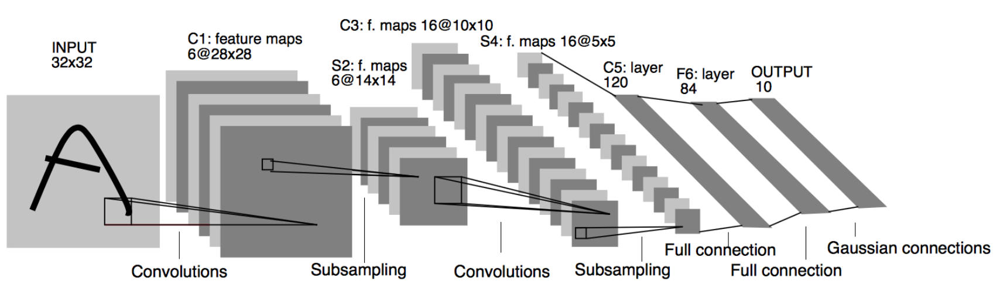
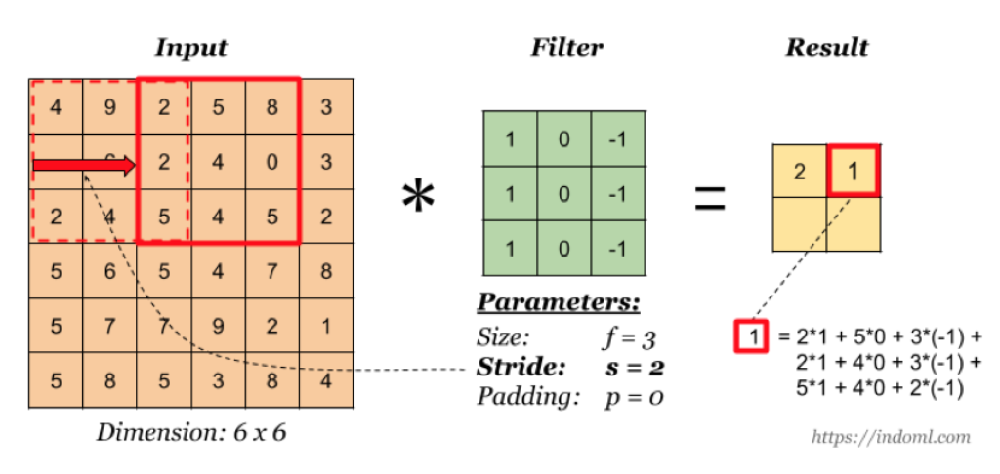
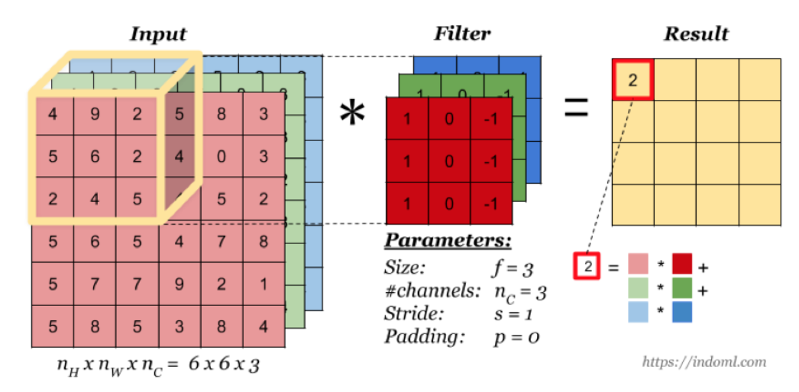
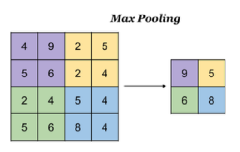
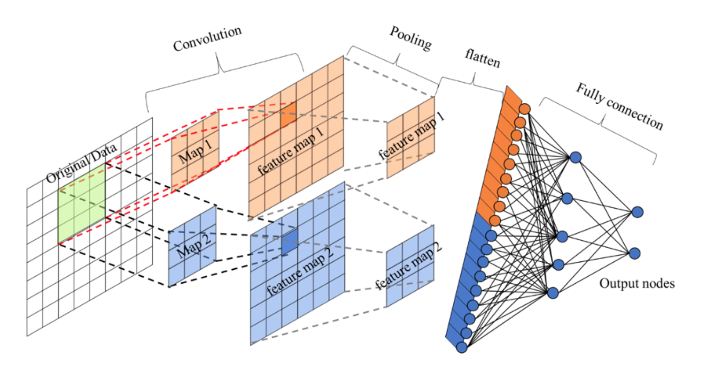
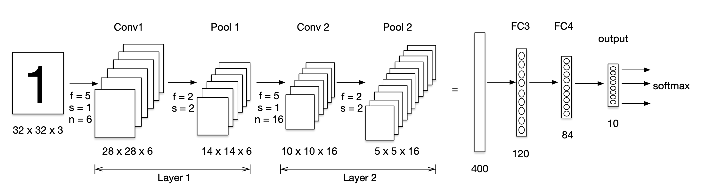
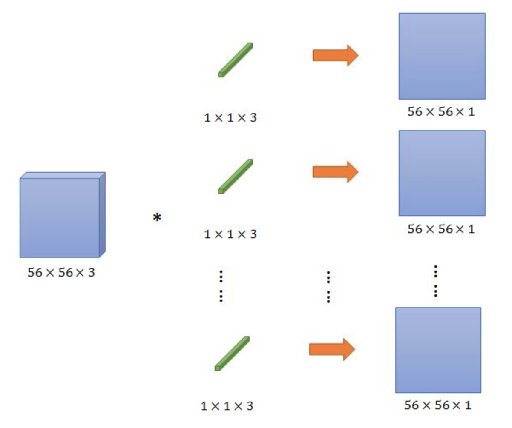
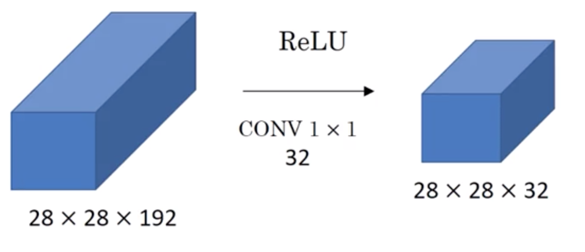
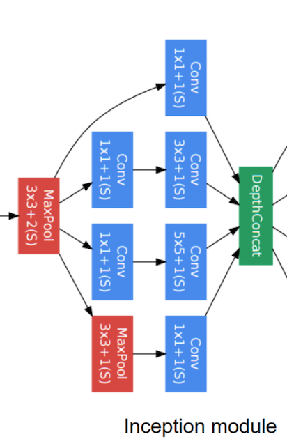
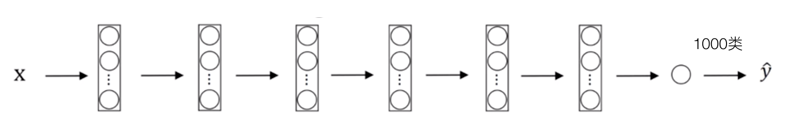

# 卷积神经网络

## CNN原理

### 网络组成

卷积神经网络由**一个或多个卷积层、池化层以及全连接层等组成**。与其他深度学习结构相比，卷积神经网络在图像等方面能够给出更好的结果。这一模型也可以使用**反向传播算法**进行训练。相比较其他浅层或深度神经网络，卷积神经网络需要考量的参数更少，使之成为一种颇具吸引力的深度学习结构。



其中包含了几个主要结构

- **卷积层（Convolutions）**
- **池化层（Subsampling）**
- 全连接层（Full connection）
- 激活函数

### 卷积层

#### 概述

目的
```
卷积运算的目的是提取输入的不同特征，某些卷积层可能只能提取一些低级的特征如边缘、线条和角等层级，更多层的网路能从低级特征中迭代提取更复杂的特征。
```
参数：
```
size:卷积核/过滤器大小，选择有1*1、3*3、5*5
padding：零填充，Valid、Same
stride:步长，通常默认为1
```

- 计算公式

输入体积大小 $H_1*W_1*D_1$

四个超参数：Filter数量K，Filter大小F，步长S，零填充大小P

输出 体积大小 $H_2*W_2*D_2$
$$
H_2 = (H_1-F+2P)/S +1\\
W_2 = (W_1-F+2P)/S + 1\\
D_2 = K
$$

- 卷积运算过程


假设是一张5 X 5 的单通道图片，通过使用3 X 3 大小的卷积核运算得到一个 3 X 3大小的运算结果（图片像素数值仅供参考）

缺点：图像变小、边缘信息丢失

- 设计单个卷积Filter的计算公式

假设神经网络某层 $l$ 的输入：

inputs: $ n_{h}^{[l -1]},n_{w}^{[l -1]},n_{c}^{[l -1]}$

卷积层参数设置：

$f^{[l]}$ :filter的大小
$p^{[l]}$ :padding的大小
$s^{[l]}$ :stride大小
$n_{c}^{[l]$} :filter的总数量

outputs：$n_{h}^{[l]},n_{w}^{[l]},n_{c}^{[l]}$

所以通用的表示每一层：

每个Filter：$f^{[l]} * f^{[l]} * n_{c}^{[l -1]}$

权重Weights：$f^{[l]} * f^{[l]} * n_{c}^{[l -1]} * n_{c}^{[l]}$

应用激活函数Activations：$a^{[l]} = n_{h}^{[l]},n_{w}^{[l]},n_{c}^{[l]}$ 

偏差bias：$1 * 1 * 1 * n_{c}^{[l]}$，通常会用4维度来表示

之前的式子我们就可以简化成,假设多个样本编程向量的形式
$$
Z^{[l]} = W^{[l]} * X^{[l-1]} + b^{[l]}\\

A^{[l]} = g(Z^{[l]})
$$
#### 零填充

零填充：在图片像素的最外层加上若干层0值，若一层，记做p =1。

作用：因为0在权重乘积和运算中对最终结果不造成影响，也就避免了图片增加了额外的干扰信息。

- 形式

Valid :不填充，也就是最终大小为
$$
(N - F + 1) * (N - F + 1)
$$
Same：输出大小与原图大小一致，那么
$$
(N + 2P - F + 1)*(N + 2P - F + 1)\\
P = \frac{F-1}{2}
$$

- 奇数维度的过滤器原因


1. 如果F不是奇数而是偶数个，那么最终计算结果不是一个整数，造成0.5,1.5.....这种情况，这样填充不均匀，所以也就是为什么卷积核默认都去使用奇数维度大小
2. 奇数维度的过滤器有中心，便于指出过滤器的位置

当然这个都是一些假设的原因，最终原因还是在F对于计算结果的影响。所以通常选择奇数维度的过滤器，是大家约定成俗的结果，可能也是基于大量实验奇数能得出更好的结果。

####  步长



如图为步长为2的输出结果。

对于输入图片大小为N，过滤器大小为F，步长为S，零填充为P
$$
(\frac{N + 2P - F}{S} + 1),(\frac{N + 2P - F}{S} + 1)
$$

#### 多通道

当输入有多个通道（channel）时(例如图片可以有 RGB 三个通道)，卷积核需要拥有相同的channel数,每个卷积核 channel 与输入层的对应 channel 进行卷积，将每个 channel 的卷积结果按位相加得到最终的 Feature Map。



- 多卷积核

当有多个卷积核时，可以学习到多种不同的特征，对应产生包含多个 channel 的 Feature Map, 例如上图有两个 filter，所以 output 有两个 channel。**这里的多少个卷积核也可理解为多少个神经元。**


相当于我们把多个功能的卷积核的计算结果放在一起，比如水平边缘检测和垂直边缘检测器。

### 池化层

池化层主要对卷积层学习到的特征图进行亚采样（subsampling）处理

种类
```
最大池化：Max Pooling,取窗口内的最大值作为输出
平均池化：Avg Pooling,取窗口内的所有值的均值作为输出
```
意义
```
降低了后续网络层的输入维度，缩减模型大小，提高计算速度
提高了Feature Map 的鲁棒性，防止过拟合
```
池化超参数特点：不需要进行学习，不像卷积通过梯度下降进行更新.




### 全连接层

卷积层+激活层+池化层可以看成是CNN的特征学习/特征提取层，而学习到的特征（Feature Map）最终应用于模型任务（分类、回归）：

- 先对所有 Feature Map 进行扁平化（flatten, 即 reshape 成 1 x N 向量）
- 再接一个或多个全连接层，进行模型学习



## 经典分类网络

卷积的发展历史图


### LeNet-5

- 网络结构



激活层默认不画网络图当中，这个网络结构当时使用的是sigmoid和Tanh函数，还没有出现Relu函数

将卷积、激活、池化视作一层，即使池化没有参数

- 参数形状

|                |   shape    | size | parameters |
| :------------: | :--------: | :--: | ---------- |
|     Input      | (32,32,3)  | 3072 | 0          |
| Conv1(f=5,s=1) | (28,28,6)  | 4704 | 450+6      |
|     Pool1      | (14,14,6)  | 1176 | 0          |
| Conv2(f=5,s=1) | (10,10,16) | 1600 | 2400+16    |
|     Pool2      |  (5,5,16)  | 400  | 0          |
|      FC3       |  (120,1)   | 120  | 48000+120  |
|      FC4       |   (84,1)   |  84  | 10080+84   |
| Ouput:softmax  |   (10,1)   |  10  | 840+10     |

### AlexNet

2012年的AlexNet可以说是具有历史意义的一个网络结构。


特点

```
总参数量：60M=6000万，5层卷积+3层全连接
使用了非线性激活函数：ReLU
防止过拟合的方法：Dropout，数据扩充（Data augmentation）
批标准化层的使用
```

### 经典结构优化

整个过程：AlexNet—NIN—(VGG—GoogLeNet)—ResNet

- NIN:**引入1 \* 1卷积**
- VGG，斩获2014年分类第二（第一是GoogLeNet），定位任务第一。
```
- 参数量巨大,140M = 1.4亿
- 19layers
- VGG 版本
    - VGG16
    - VGG19
```
- GoogleNet

2014年比赛冠军的model，这个model证明了一件事：用更多的卷积，更深的层次可以得到更好的结构。（当然，它并没有证明浅的层次不能达到这样的效果）

```
- 500万的参数量
- 22layers
- 引入了Inception模块
    - Inception V1
    - Inception V2
    - Inception V3
    - Inception V4
```

#### 1*1卷积

目的

提出了一种新的深度网络结构，称为“网络中的网络”（NIN），增强接受域内局部贴片的模型判别能力。

做法
```
- 对于传统线性卷积核：采用线性滤波器，然后采用非线性激活。
- 提出MLP卷积取代传统线性卷积核
```
作用或优点
```
1.多个1x1的卷积核级联加上配合激活函数，将feature map由多通道的线性组合变为非线性组合（信息整合），提高特征抽象能力（Multilayer Perceptron,缩写MLP,就是一个多层神经网络）
2.1x1的卷积核操作还可以实现卷积核通道数的降维和升维，实现参数的减小化
```



从图中，看到1 x 1卷积的过程，那么这里先假设只有3个1x1Filter，那么最终结果还是56x56x3。但是每一个FIlter的三个参数的作用

**看作是对三个通道进行了线性组合。**

我们甚至可以把这几个FIlter可以看成就是一个简单的神经元结构，每个神经元参数数量与前面的通道数量相等。

通常在卷积之后会加入非线性激活函数，在这里之后加入激活函数，就可以理解成一个简单的MLP网络了。

#### 通道数变化

那么对于1x1网络对通道数的变化，其实并不是最重要的特点，因为毕竟3 x 3,5 x 5都可以带来通道数的变化，

- 保持通道数不变
- 提升通道数
- 减少通道数

而1x1卷积的参数并不多，我们拿下面的例子来看。



#### Inception层

这个结构其实还有名字叫盗梦空间结构。

目的

代替人手工去确定到底使用1x1,3x3,5x5还是是否需要max_pooling层，由网络自动去寻找适合的结构。并且节省计算。

特点
```
是每一个卷积/池化最终结果的长、宽大小一致
特殊的池化层，需要增加padding，步长为1来使得输出大小一致，并且选择32的通道数
最终结果28 x 28 x 256
   - 使用更少的参数，达到跟AlexNet或者VGG同样类似的输出结果
```

#### Inception改进

改进目的：减少计算，如5 x 5卷积那的运算量


上面的参数：5 x 5 x 32 x 192 =153600

下面的参数：192 x 16 + 5 x 5 x 16 x 32 = 3072 + 12800 = 15872

所以上面的结构会需要大量的计算，我们把这种改进的结构称之为网络的"瓶颈",网络缩小后扩大。

那么这样改变会影响网络的性能和效果吗？

GoogleNet就是如此，获得了非常好的效果。所以合理的设计网络当中的Inception结构能够减少计算，实现更好的效果。

### GoogleNet

包含了多个Inception结构



完整结构


## 迁移学习

### 概述

- 定义

迁移学习就是**利用数据、任务或模型之间的相似性，将在旧的领域学习过或训练好的模型，应用于新的领域这样的一个过程。**

两个任务的输入属于同一性质：要么同是图像、要么同是语音或其他

- 使用场景

1、当我们有海量的数据资源时，可以不需要迁移学习，**机器学习系统很容易从海量数据中学习到一个鲁棒性很强的模型。**但通常情况下，我们需要研究的领域可获得的数据极为有限，在少量的训练样本上精度极高，但是泛化效果极差。

2、训练成本，很少去从头开始训练一整个深度卷积网络，从头开始训练一个卷积网络通常需要较长时间且依赖于强大的 GPU 计算资源。

### 方法

最常见的称呼叫做fine tuning,即微调

已训练好的模型，称之为Pre-trained model

通常我们需要加载以训练好的模型，这些可以是一些机构或者公司在ImageNet等类似比赛上进行训练过的模型。TensorFlow同样也提供了相关模型地址：https://github.com/tensorflow/models/tree/master/research/slim

### 过程

这里我们举一个例子，假设有两个任务A和B，任务 A 拥有海量的数据资源且已训练好，但并不是我们的目标任务，任务 B 是我们的目标任务。下面的网络模型假设是已训练好的1000个类别模型



而B任务假设是某个具体场景如250个类别的食物识别，那么该怎么去做

1、建立自己的网络，在A的基础上，修改最后输出结构，并加载A的模型参数

2、根据数据大小调整

- 如果B任务数据量小，那么我们可以选择将A模型的所有的层进行freeze(可以通过Tensorflow的trainable=False参数实现)，而剩下的输出层部分可以选择调整参数训练
- 如果B任务的数据量大，那么我们可以将A中一半或者大部分的层进行freeze,而剩下部分的layer可以进行新任务数据基础上的微调

