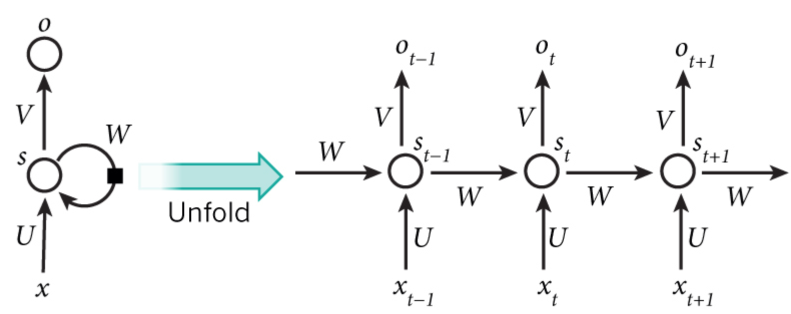
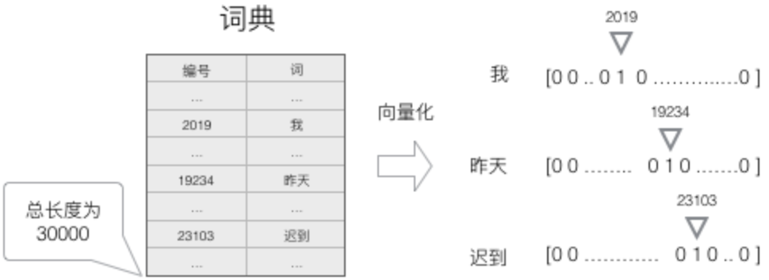
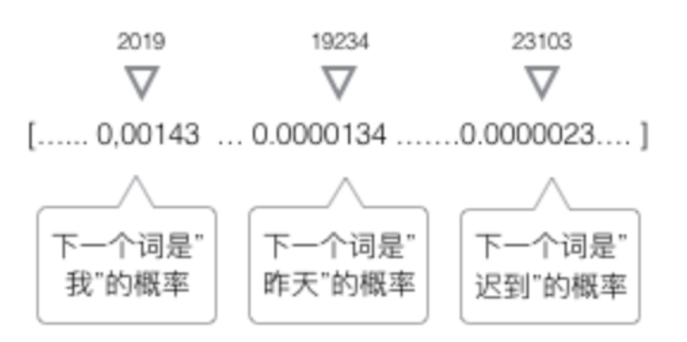
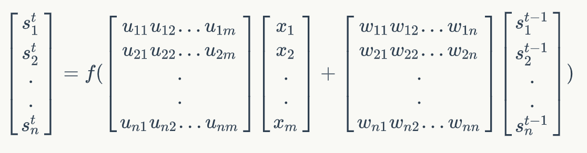
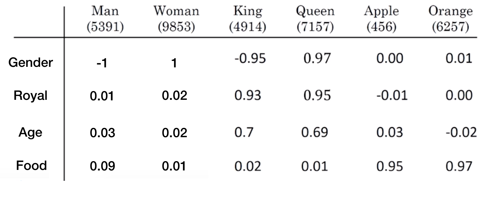
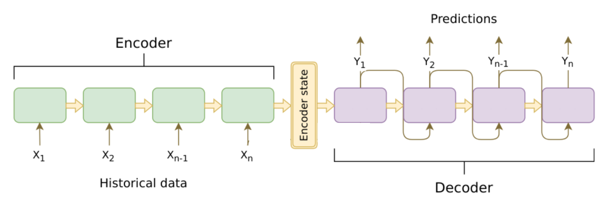

# 循环神经网络

## 网络原理

**循环(递归)神经网络**（**RNN**）是神经网络的一种。RNN将状态在自身网络中循环传递，可以接受时间序列结构输入。

- 类型


一对一：固定的输入到输出，**如图像分类**
一对多：固定的输入到序列输出，**如图像的文字描述**
多对一：序列输入到输出，**如情感分析，分类正面负面情绪**
多对多：序列输入到序列的输出，**如机器翻译,称之为编解码网络**
同步多对多：同步序列输入到同步输出，**如文本生成，视频每一帧的分类，也称之为序列生成**

### 序列模型

定义

```
通常在自然语言、音频、视频以及其它序列数据的模型。
```

类型

```
语音识别，输入一段语音输出对应的文字
情感分类，输入一段表示用户情感的文字，输出情感类别或者评分
机器翻译，两种语言的互相翻译
```

CNN效果不好的原因

```
序列数据前后之间是有很强的关联性
序列数据的输入输出长度不固定
```

### 基础循环网络

#### 概述



- 元素

$x_t$ :表示每一个时刻的输入

$o_t$:表示每一个时刻的输出

$s_t$:表示每一个隐层的输出

中间的小圆圈代表隐藏层的一个unit(单元)

所有单元的**参数共享**

- 通用公式

$$
s_0 = 0 \\
s_t = g_1(U_{x_t}+W_{x_{t-1}}+b_a)\\
o_t = g_2(V_{s_t}+b_y)
$$

$g_1,g_2$:表示激活函数，$g_1$:tanh/relu, $g_2$:sigmoid、softmax

循环神经网络的输出值$o_t$，是受前面历次输入值$x_{t-1},x_{t},x_{t+1}$影响

#### 生成案例

通常对于整个序列给一个开始和结束标志，start,end标志。

- s 我 昨天 上学 迟到 了 e

输入到网络当中的是一个个的分词结果，每一个词的输入是一个时刻。


#### 词的表示

为了能够让整个网络能够理解我们的输入（英文/中文等），需要将词进行用向量表示。

- 建立一个包含所有序列词的词典包含（**开始和标志的两个特殊词，以及没有出现过的词用等**），每个词在词典里面有一个唯一的编号。
- 任意一个词都可以用一个N维的one-hot向量来表示。其中，N是词典中包含的词的个数



我们就得到了一个高维、**稀疏**的向量（稀疏是指绝大部分元素的值都是0）

#### softmax输出

RNN这种模型，**每一个时刻的输出**是下一个最可能的词，可以用概率表示，总长度为词的总数长度



每一个时刻的输出 $s_t$ 都是词的总数长度，接上softmax回归即可

#### 矩阵运算

对于网络当中某一时刻的公式中
$$
\mathrm{s}_t=relu(U\mathrm{x}_t+W\mathrm{s}_{t-1})\\
o_{t} = softmax(V{s_t})
$$


1、形状表示:

[n, m]x [m, 1] +[n, n]x [n, 1] = [n, 1]

则**矩阵U的维度是n x m，矩阵W的维度是n x n**

m：词的个数，n：为输出s的维度

注:此步骤可以简化：[u,w] x [$\frac{x}{s}$ ] = [n, n+m] x [n +m, 1] = [n, 1]

2、形状表示：[m, n] x [n, 1] = [m, 1]

**矩阵V维度：[m, n]**

**总结：其中的n是可以人为去进行设置。**

#### 交叉熵损失

总损失定义：

一整个序列（一个句子）作为一个训练实例，总误差就是各个时刻词的误差之和。
$$
E_{t}(y_{t},\hat{y_{t}}) = -y_{t}log(\hat{y_{t}})\\

E(y,\hat{y}) = \sum_{t}E_{t}(y_{t},\hat{y_{t}})=-\sum_{t}y_{t}log(\hat{y_{t}})
$$

在这里，$ y_t$ 是时刻 t 上正确的词，$ \hat y_{t}$是预测出来的词

#### 完整计算流程


$$
\mathrm{s}^t=tanh(U\mathrm{x}^t+W\mathrm{s}^{t-1}+b_a)\\
o^{t} = softmax(V{s^t + b_y})
$$

#### 时序反向传播算法

对于RNN来说有一个时间概念，需要把梯度沿时间通道传播的 BP 算法，所以称为Back Propagation Through Time-BPTT


我们的目标是计算误差关于**参数U、V和W以及两个偏置bx,by的梯度**，然后使用梯度下降法学习出好的参数。由于这三组参数是共享的，我们需要将一个训练实例在每时刻的梯度相加。

- 1、**要求：每个时间的梯度都计算出来t=0,t=1,t=2,t=3,t=4，然后加起来的梯度, 为每次W更新的梯度值。**
- 2、求不同参数的导数步骤：
    - 最后一个cell:
        - 计算最后一个时刻交叉熵损失对于s_t的梯度，记忆交叉熵损失对于$s^t$ ,V,by的导数
        - 按照图中顺序计算
    - 最后一个前面的cell:
        - 第一步：求出当前层损失对于当前隐层状态输出值 $s^{t}$  的梯度 + 上一层相对于 $s^{t}$ 的损失
        - 第二步：计算tanh激活函数的导数
        - 第三步：计算 $Ux_t + Ws_{t-1} + b_{a}$ 的对于不同参数的导数

$$
\mathrm{s}^t=tanh(U\mathrm{x}^t+W\mathrm{s}^{t-1}+b_a)\\
o^{t} = softmax(V{s^t + b_y})
$$


#### 梯度消失与梯度爆炸

由于RNN当中也存在链式求导规则，并且其中序列的长度位置。所以

- 如果矩阵中有非常小的值，并且经过矩阵相乘N次之后，梯度值快速的以指数形式收缩，较远的时刻梯度变为0。
- 如果矩阵的值非常大，就会出现梯度爆炸

### GRU

- 门控循环单元


GRU增加了两个门，一个重置门（reset gate）和一个更新门（update gate）

重置门决定了**如何将新的输入信息与前面的记忆相结合**

更新门**定义了前面记忆保存到当前时间步的量**

如果将重置门设置为 1，更新门设置为 0，那么将再次获得标准 RNN 模型

- 本质解决问题

**为了解决短期记忆问题，每个递归单元能够自适应捕捉不同尺度的依赖关系**

解决梯度消失的问题，在隐层输出的地方$h_t,h_{t-1}$的关系用加法而不是RNN当中乘法+激活函数

### LSTM

- 长短记忆网络


$h_t$ :为该cell单元的输出

$c_t$:为隐层的状态

三个门：遗忘门f、更新门u、输出门o

- 作用

便于记忆更长距离的时间状态

## 词嵌入

### 原理

- one_hot问题

1. 假设有10000个词，每个词的向量长度都为10000，整体大小太大

2. 没能表示出词与词之间的关系：有一定相似性的词，取任意两个向量计算内积都为0

- 定义

定义：指把一个维数为所有词的数量的高维空间**嵌入到一个维数低得多的连续向量空间中**，每个单词或词组被映射为实数域上的向量。

> 注：这个维数通常不定，不同实现算法指定维度都不一样，通常在30~500之间。



- 特点

1. 能够体现出词与词之间的关系：比如说我们用Man - Woman,或者Apple - Orange，都能得到一个向量

2. 能够得到相似词，例如Man - Woman = King - ?


- 算法类别

Bengio等人在一系列论文中使用了神经概率语言模型使机器习得词语的分布式表示。

2013年，谷歌托马斯·米科洛维（Tomas Mikolov）领导的团队发明了一套工具word2vec来进行词嵌入。

> skip-gram

算法学习实现：https://www.tensorflow.org/tutorials/representation/word2vec

> CBow

下载gensim库

```
pip install gensim
```

### 案例

## seq2seq与Attention

### seq2seq

seq2seq模型是在2014年，是由Google Brain团队和Yoshua Bengio 两个团队各自独立的提出来。

- 定义

seq2seq是一个**Encoder–Decoder 结构**的网络，它的输入是一个序列，输出也是一个序列， **Encoder 中将一个可变长度的信号序列变为固定长度的向量表达**，**Decoder 将这个固定长度的向量变成可变长度的目标的信号序列**



注：Cell可以用 RNN ，GRU，LSTM 等结构。

相当于将RNN模型当中的 $s^{0}$ 输入变成一个encoder

- 条件语言模型理解

> 编解码器作用

编码器的作用是把一个不定长的输入序列 $x_{1},\ldots,x_{t}$ 输出到一个编码状态 $C $

解码器输出 $y^{t}$ 的条件概率将基于之前的输出序列 $y^{1}, y^{t-1}$ 和编码状态 $C$ 

> 最大似然估计

$argmax {P}(y_1, \ldots, y_{T'} \mid x_1, \ldots, x_T)$，给定输入的序列，使得输出序列的概率值最大。

根据最大似然估计，最大化输出序列的概率
$$
\begin{align}
{P}(y_1, \ldots, y_{T'} \mid x_1, \ldots, x_T) 
& = \prod_{t'=1}^{T'} {P}(y_{t'} \mid y_1, \ldots, y_{t'-1}, x_1, \ldots, x_T) \\
&= \prod_{t'=1}^{T'} {P}(y_{t'} \mid y_1, \ldots, y_{t'-1}, {C})
\end{align}
$$
由于这个公式需要求出：
$$
P(y^{1}|C) * P(y^{2}|y^{1},C)*P(y^{3}|y^{2},y^{2},y^{1},C)...
$$
这个概率连乘会非常非常小不利于计算存储，所以需要对公式取对数计算：
$$
\log{P}(y_1, \ldots, y_{T'} \mid x_1, \ldots, x_T) = \sum_{t'=1}^{T'} \log{P}(y_{t'} \mid y_1, \ldots, y_{t'-1}, {C})
$$
所以这样就变成了
$$
P(y^{1}|C)+ P(y^{2}|y^{1},C)+P(y^{3}|y^{2},y^{2},y^{1},C)...
$$
概率相加。**这样也可以看成输出结果通过softmax就变成了概率最大，而损失最小的问题，输出序列损失最小化。**

- 应用场景

机器翻译

聊天机器人

### Attention

- 长句子问题

对于更长的句子，seq2seq就显得力不从心了，无法做到准确的翻译，一下是通常BLEU的分数随着句子的长度变化，可以看到句子非常长的时候，分数就很低。


本质原因：在Encoder-Decoder结构中，Encoder把所有的输入序列都编码成一个统一的语义特征 $C$ 再解码，**因此， $C$ 中必须包含原始序列中的所有信息，它的长度就成了限制模型性能的瓶颈。**当要翻译的句子较长时，一个$C$ 可能存不下那么多信息，就会造成翻译精度的下降。

- 定义

建立Encoder的隐层状态输出到Decoder对应输出y**所需要的上下文信息**

目的：增加编码器信息输入到解码器中相同时刻的联系，其它时刻信息减弱


- 公式

注意上述的几个细节，颜色的连接深浅不一样，假设Encoder的时刻记为 $t$ ,而Decoder的时刻记为 $t^{'}$。
$$
{c}_{t'} = \sum_{t=1}^T \alpha_{t' t}{h}_t
$$
$ \alpha_{t^{'}t}$ 为参数，在网络中训练得到

理解：蓝色的解码器中的cell举例子
$$
\alpha_{4}{1}h_{1}+\alpha_{4}{2}h_{2} + \alpha_{4}{3}h_{3} + \alpha_{4}{4}h_{4} = c_{4}
$$

> $\alpha_{t^{'}t}$ 的N个权重系数由来？

1. 权重系数通过softmax计算：
$$
\alpha_{t' t} = \frac{\exp(e_{t' t})}{ \sum_{k=1}^T \exp(e_{t' k}) },\quad t=1,\ldots,T
$$
2. 
$$
e_{t' t} = g({s}_{t' - 1}, {h}_t)= {v}^\top \tanh({W}_s {s} + {W}_h {h})
$$

$e_{t' t}$ 是由t时刻的编码器隐层状态输出和解码器$t^{'}-1$时刻的隐层状态输出计算出来的

$s$ 为解码器隐层状态输出，$h$为编码器隐层状态输出

$v,W_{s},W_{h}$都是网络学习的参数


### 机器翻译案例

### 集束搜索

### BLEU

