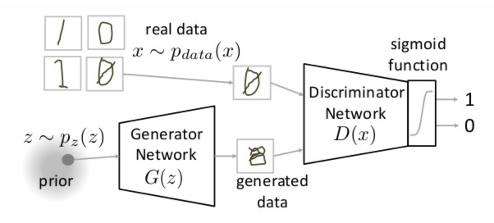
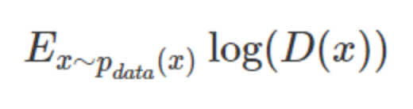
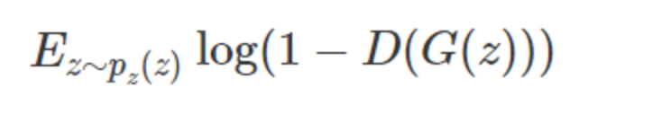
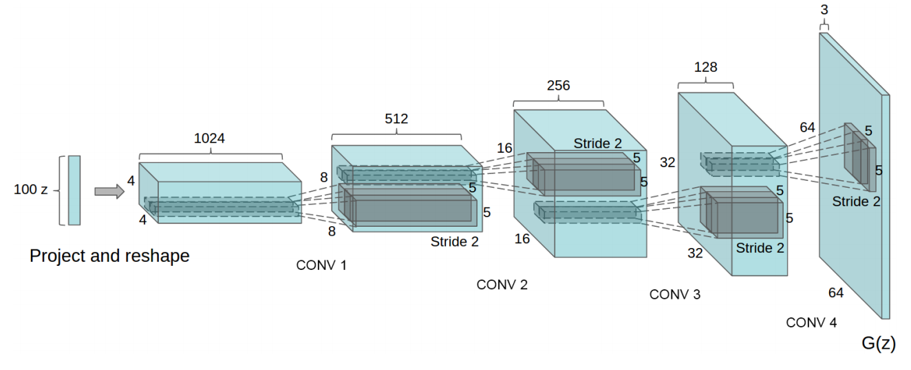

# GAN

GAN是非监督式学习的一种方法，在2014年被提出。

GAN主要用途：

- 生成以假乱真的图片
- 生成视频、模型

## 原理

### 定义

生成对抗网络(Generative Adversarial Network，简称GAN)，主要结构包括一个**生成器**G（Generator）和一个**判别器**D（Discriminator）。

- 生成器（Generator），能够输入一个向量，输出需要生成固定大小的像素图像
- 判别器（Discriminator），用来判别图片是真的还是假的，输入图片（训练的数据或者生成的数据），输出为判别图片的标签

### 理解

思想：**从训练库里获取很多训练样本，从而学习这些训练案例生成的概率分布**

黑色虚线：真是样本的分布
绿色实线：生成样本的分布
蓝色虚线：判别器判断的概率分布
$z$ 表示噪声，$z$ 到 $x$ 表示生成器生成的分布映射

- 过程分析：

> 定义GAN结构生成数据

(a)状态处于最初始的状态，生成器生成的分布和真实分布区别较大，并且判别器判别出样本的概率不稳定

> 在真实数据上训练 n epochs判别器，产生fake(假数据)并训练判别器识别为假

通过多次训练判别器来达到(b)(*b*)样本状态，此时判别样本区分得非常显著

> 训练生成器达到欺骗判别器的效果

训练生成器之后达到(c)样本状态，此时生成器分布相比之前，逼近了真实样本分布。经过多次反复训练迭代之后。

最终希望能够达到(d)状态，生成样本分布拟合于真实样本分布，并且判别器分辨不出样本是生成的还是真实的。

### 损失

$V(G,D)$ :表示P_ x和 P_z 的差异程度。

$ \max \limits_DV(D, G)$ :固定生成器G, 尽可能地让判别器能够最大化地判别出样本来自于真实数据还是生成的数据

$\min \limits_G L$:固定判别器D的条件下得到生成器G，能够最小化真实样本与生成样本的差异。

**整个优化我们其实只看做一个部分：**

判别器：相当于一个分类器，判断图片的真伪，二分类问题，使用交叉熵损失

对于真实样本：对数预测概率损失，提高预测的概率

对于生成样本：对数预测概率损失，降低预测概率

最终可以这样

### 结构

G、D结构是两个网络，特点是能够反向传播可导计算要介绍G、D结构，需要区分不同版本的GAN。

- 2014年最开始的模型：
    - G、D都是multilayer perceptron（MLP）
    - 缺点：实践证明训练难度大，效果不行
- 2015：使用卷积神经网络+GAN（DCGAN（Deep Convolutional GAN））
    - 改进：
        - 1、判别器D中取出pooling，全部变成卷积、生成器G中使用反卷积（下图）
        - 2、D、G中都增加了BN层
        - 3、去除了所有的全连接层
        - 4、判别器D中全部使用Leaky ReLU，生成器除了最后输出层使用tanh其它层全换成ReLU

## 案例

