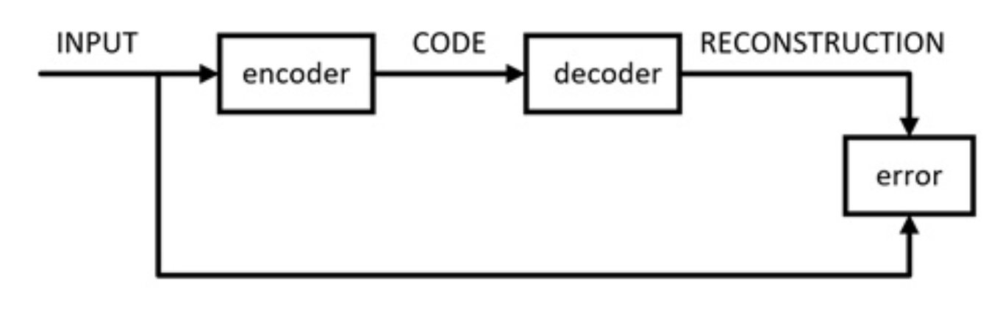

# 自动编码器

自编码器的应用主要有两个方面

- 数据去噪
- 进行可视化而降维

自编码器可以学习到比PCA等技术更好的数据投影

## 原理

- 定义


自动编码器是一种数据的压缩算法，一种使用神经网络学习数据值编码的无监督方式。

- 原理



搭建一个自动编码器需要完成下面三样工作：
```
1.搭建编码器
2.搭建解码器
3.设定一个损失函数，用以衡量由于压缩而损失掉的信息。

编码器和解码器一般都是参数化的方程，并关于损失函数可导，通常情况是使用神经网络。
```
- 类别
```
- 普通自编码器
    编解码网络使用全连接层
- 多层自编码器
- 卷积自编码器
    编解码器使用卷积结构
- 正则化自编码器
    降噪自编码器
```
## 案例

### 普通

### 深度

### 卷积

### 降噪

