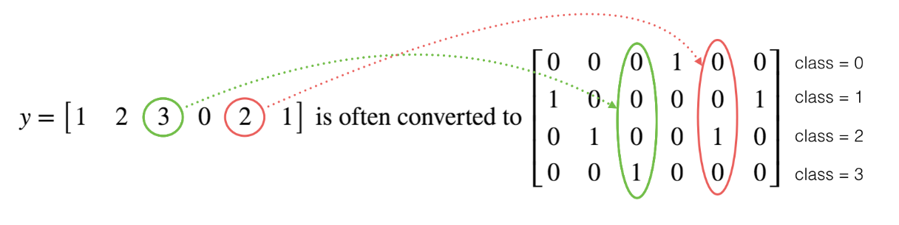

#  深度学习进阶

## 多分类

### softmax回归

对于**多分类问题**，用 N表示种类个数，那么神经网络的输出层的神经元个数必须为$L[output]=N$, 每个神经元的输出依次对应属于N个类别当中某个具体类别的概率，即 $P(y=N_1|x),\cdots,P(y=N_n|x)$。

输出层即

$$
Z^{[L]} = W^{[L]}a^{[L-1]} + b^{[L]}
$$

Z的输出值个数为类别个数.

需要对所有的输出结果进行一下softmax公式计算

$$
a^{[L]}_i = \frac{e^{Z^{[L]}_i}}{\sum^C_{i=1}e^{Z^{[L]}_i}}
$$

并且满足
$$
\sum^C_{i=1}a^{[L]}_i = 1
$$

### 交叉熵损失

逻辑回归的损失也可以这样表示
$$
\begin{aligned}
J(\theta) 
&= -\frac{1}{m}\bigg[\sum_{i=1}^{m}{(1-y^{(i)})\log{(1-h_\theta(x^{(i)}))}+y^{(i)}\log h_\theta(x^{(i)})}\bigg] \\
&= -\frac{1}{m}\bigg[\sum_{i=1}^m\sum_{j=0}^1{1\{y^{(i)}=j\}\log{p(y^{(i)}=j|x^{(i)}; \theta})}\bigg]

\end{aligned}
$$
对于softmax回归（逻辑回归代价函数的推广，都可称之为交叉熵损失），它的代价函数公式为：
$$
L(\hat y, y) = -\sum^C_{j=1}y_j\log\hat y_j
$$
总损失函数可以记为
$$
J = \frac{1}{m}\sum^m_{i=1}L(\hat y, y)
$$
对于真实值会进行一个one-hot编码，每一个样本的所属类别都会在某个类别位置上标记。

上图中，交叉熵损失为
$$
0\log(0.10)+0\log(0.05)+\cdots+0log(0.10)
$$
one_hot示例

## 梯度下降算法改进

## 正则化

## 调优与BN

