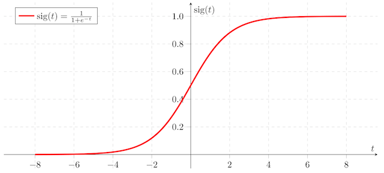
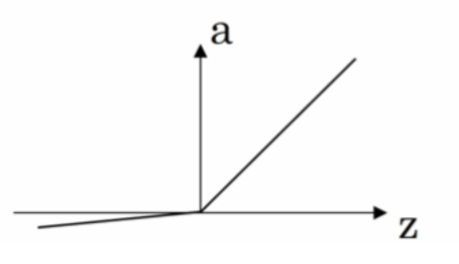

# 简单神经网络

**人工神经网络**(ANN)也简称为神经网络(NN)。是一种模仿生物神经网络结构和功能的计算模型。经典的神经网络结构包含三个层次的神经网络：输入层、隐藏层、输出层。

神经网络的特点

```
每个连接都有个权值，同一层神经元之间没有连接
神经元当中会含有激活函数
最后的输出结果对应的层也被称为全连接层
```

神经网络的用途

```
图像的分类、监测
自然语言处理：文本分类、聊天
```

## 激活函数

使用线性激活函数和不使用激活函数、直接使用 Logistic 回归没有区别，那么无论神经网络有多少层，输出都是输入的线性组合，与**没有隐藏层**效果相当，就成了最原始的感知器了。

涉及到网络的优化时候，会有不同的激活函数选择有一个问题是神经网络的隐藏层和输出单元用什么激活函数。之前我们都是选用 sigmoid 函数，但有时其他函数的效果会好得多，大多数通过实践得来，没有很好的解释性。

- sigmoid

  

函数值位于[0, 1]

- tanh


效果比sigmoid函数好，因为函数输出位于[-1, 1]。

注 :tanh 函数存在和 sigmoid 函数一样的缺点：当 z 趋紧无穷大（或无穷小），导数的梯度（即函数的斜率）就趋紧于 0，这使得梯度算法的速度会减慢。

- ReLU


当 z > 0 时，梯度始终为 1，从而提高神经网络基于梯度算法的运算速度，收敛速度远大于 sigmoid 和 tanh。然而当 z < 0 时，梯度一直为 0，但是实际的运用中，该缺陷的影响不是很大。

- Leaky ReLU



Leaky ReLU 保证在 z < 0 的时候，梯度仍然不为 0。理论上来说，Leaky ReLU 有 ReLU 的所有优点，但在实际操作中没有证明总是好于 ReLU，因此不常用。

## 单神经元网络
$$
z= w^T*x+b \\
\hat{y} =a= \sigma(z)\\
L(\hat{y},y) = -(y\log{a})-(1-y)\log(1-a) \\
J(w,b)= \frac{1}{m}\sum_{i=1}^mL(a^{(i)}, y^{(i)})
$$
前向计算过程


反向更新参数

$$
J = 0, W=np.zeros([n,1]), b={0} \\
Z= np.dot(W^T,X)+{b} \\
A = \sigma(Z) \\

dZ = {A}-{Y}\\
dW = \frac{1}{m}X{dZ}^{T} \\
db=\frac{1}{m}np.sum(dZ) \\

W := W - \alpha{dW} \\
b := b - \alpha{db}
$$
代码实现

```python
import numpy as np
import h5py


# 实现一个单神经元的神经网络
# 假设 hat{y} = a = \sigma(z) =  \sigma(w^Tx + b) = \singma(\theta^Tx)
# 激活函数 s = \sigma(z) = \frac{1}{1+e^{-z}}
# 损失函数 L(\hat{y}, y) = -(y\log a) - (1-y)\log(1-a)

def basic_sigmoid(x):
    """计算sigmoid函数"""
    s = 1 / (1 + np.exp(-x))
    return s


def sigmoid_derivative(x):
    """
    计算sigmoid函数相对于其输入x的梯度(也被称为斜率或导数)
    \sigma(z)(1-\sigma(z)
    """
    s = basic_sigmoid(x)
    ds = s(1 - s)
    return ds


# 1.加载数据
def load_dataset():
    train_dataset = h5py.File('datasets/train_catvnoncat.h5', "r")
    train_set_x_orig = np.array(train_dataset["train_set_x"][:])  # your train set features
    train_set_y_orig = np.array(train_dataset["train_set_y"][:])  # your train set labels

    test_dataset = h5py.File('datasets/test_catvnoncat.h5', "r")
    test_set_x_orig = np.array(test_dataset["test_set_x"][:])  # your test set features
    test_set_y_orig = np.array(test_dataset["test_set_y"][:])  # your test set labels

    classes = np.array(test_dataset["list_classes"][:])  # the list of classes

    train_set_y_orig = train_set_y_orig.reshape((1, train_set_y_orig.shape[0]))
    test_set_y_orig = test_set_y_orig.reshape((1, test_set_y_orig.shape[0]))

    return train_set_x_orig, train_set_y_orig, test_set_x_orig, test_set_y_orig, classes


train_x, train_y, test_x, test_y, classes = load_dataset()
print("训练集的样本数: ", train_x.shape[0])
print("测试集的样本数: ", test_x.shape[0])
print("train_x形状: ", train_x.shape)
print("train_y形状: ", train_y.shape)
print("test_x形状: ", test_x.shape)
print("test_x形状: ", test_y.shape)
"""
训练集的样本数:  209
测试集的样本数:  50
train_x形状:  (209, 64, 64, 3)
train_y形状:  (1, 209)
test_x形状:  (50, 64, 64, 3)
test_x形状:  (1, 50)
"""
# 数据转换
train_x = train_x.reshape(train_x.shape[0], -1).T
test_x = test_x.reshape(test_x.shape[0], -1).T
print(train_x.shape, test_x.shape)
"""
(12288, 209) (12288, 50)
"""
train_x = train_x / 255
test_x = test_x / 255


# 2. 算法结构实现
# 初始化参数
def initialize_with_zero(shape):
    """
    创建一个形状为(shape, 1)的w参数和b=0
    返回 w,b
    """
    w = np.zeros((shape, 1))
    b = 0
    assert (w.shape == (shape, 1))
    assert (isinstance(b, float) or isinstance(b, int))
    return w, b


# 前向和反向传播
def propagate(w, b, X, Y):
    """
    参数：w,b,X,Y：网络参数和数据
    Return:
    损失cost、参数W的梯度dw、参数b的梯度db
    """
    m = X.shape[1]

    # 前向传播
    # w (n,1), x (n, m)
    A = basic_sigmoid(np.dot(w.T, X) + b)
    # 计算损失
    cost = -1 / m * np.sum(Y * np.log(A) + (1 - Y) * np.log(1 - A))
    # 反向传播
    dz = A - Y
    dw = 1 / m * np.dot(X, dz.T)
    db = 1 / m * np.sum(dz)

    assert (dw.shape == w.shape)
    assert (db.dtype == float)
    cost = np.squeeze(cost)
    assert (cost.shape == ())

    grads = {"dw": dw,
             "db": db}

    return grads, cost


# 优化参数
def optimize(w, b, X, Y, num_iterations, learning_rate):
    """
    参数：
    w:权重,b:偏置,X特征,Y目标值,num_iterations总迭代次数,learning_rate学习率
    Returns:
    params:更新后的参数字典
    grads:梯度
    costs:损失结果
    """
    costs = []
    for i in range(num_iterations):
        # 梯度更新计算函数
        grads, cost = propagate(w, b, X, Y)
        # 取出两个部分参数的梯度
        dw = grads['dw']
        db = grads['db']
        # 按照梯度下降公式计算
        w = w - learning_rate * dw
        b = b - learning_rate * db

        if i % 100 == 0:
            costs.append(cost)
            print(f'损失结果{i}:{cost}')

    params = {"w": w,
              "b": b}

    grads = {"dw": dw,
             "db": db}

    return params, grads, costs


# 预测结果
def predict(w, b, X):
    """
    利用训练好的参数预测
    return：预测结果
    """
    m = X.shape[1]
    Y_prediction = np.zeros((1, m))
    w = w.reshape(X.shape[0], 1)
    # 计算结果
    A = basic_sigmoid(np.dot(w.T, X) + b)
    for i in range(A.shape[1]):
        if A[0, i] <= 0.5:
            Y_prediction[0, i] = 0
        else:
            Y_prediction[0, i] = 1
    assert (Y_prediction.shape == (1, m))
    return Y_prediction


def model(X_train, Y_train, X_test, Y_test, num_iterations=2000, learning_rate=0.5):
    """

    """
    # 初始化参数
    w, b = initialize_with_zero(X_train.shape[0])
    # 梯度下降
    params, grads, costs = optimize(w, b, X_train, Y_train, num_iterations, learning_rate)
    # 获取训练的参数
    w = params['w']
    b = params['b']

    Y_prediction_train = predict(w, b, X_train)
    Y_prediction_test = predict(w, b, X_test)

    print("训练集准确率: {} ".format(100 - np.mean(np.abs(Y_prediction_train - Y_train)) * 100))
    print("测试集准确率: {} ".format(100 - np.mean(np.abs(Y_prediction_test - Y_test)) * 100))

    d = {"costs": costs,
         "Y_prediction_test": Y_prediction_test,
         "Y_prediction_train": Y_prediction_train,
         "w": w,
         "b": b,
         "learning_rate": learning_rate,
         "num_iterations": num_iterations}

    return d


if __name__ == '__main__':
    d = model(train_x, train_y, test_x, test_y, num_iterations=2000, learning_rate=0.05)

```

## 浅层神经网络


前向传播


$$
Z[1] =W[1]X+b[1] \\ 

{A}^{[1]}=tanh(Z^{[1]}) \\

Z^{[2]} = W^{[2]}A^{[1]}+b^{[2]}\\

A^{[2]}=\sigma(Z^{[2]})
$$
反向计算
$$
dZ[2]=A[2] − Y \\
dW^{[2]}=\frac{1}{m}dZ^{[2]}{A^{[1]}}^{T}  \\
db^{[2]}=\frac{1}{m}np.sum(dZ^{[2]}, axis=1) \\

dZ^{[1]} = {W^{[2]}}^{T}dZ^{[2]}*{(1-g(Z^{[1]})}^{2}={W^{[2]}}^{T}dZ^{[2]}*{(1-A^{[1]})}^{2}\\
dW^{[1]}=\frac{1}{m}dZ^{[1]}X^{T}\\
db^{[1]} = \frac{1}{m}np.sum(dZ^{[1]}, axis=1)
$$
代码示例

```python
import numpy as np


# 含有一个隐藏层的浅神经网络实现2分类
# 隐藏层使用tanh激活函数，最后使用sigmoid函数
# 损失函数：
# J = - \frac{1}{m} \sum\limits_{i = 0}^{m} \large\left(\small y^{(i)}\log\left(a^{[2] (i)}\right) +
# (1-y^{(i)})\log\left(1- a^{[2] (i)}\right)  \large  \right)

# 导入数据集
def load_planar_dataset():
    np.random.seed(1)
    m = 400
    N = int(m / 2)
    D = 2
    X = np.zeros((m, D))
    Y = np.zeros((m, 1), dtype='uint8')
    a = 4

    for j in range(2):
        ix = range(N * j, N * (j + 1))
        t = np.linspace(j * 3.12, (j + 1) * 3.12, N) + np.random.randn(N) * 0.2
        r = a * np.sin(4 * t) + np.random.randn(N) * 0.2
        X[ix] = np.c_[r * np.sin(t), r * np.cos(t)]
        Y[ix] = j

    X = X.T
    Y = Y.T

    return X, Y


X, Y = load_planar_dataset()
print('数据集特征值的形状:', X.shape)
print('数据集目标值的:', Y.shape)
print('样本数:', X.shape[1])
"""
数据集特征值的形状: (2, 400)
数据集目标值的: (1, 400)
样本数: 400
"""


# sigmoid函数
def sigmoid(x):
    s = 1 / (1 + np.exp(-x))
    return s


# 定义神经网络结构
def layer_sizes(X, Y):
    """
    网络输入输出及隐藏层神经元个数
    """
    # 输入层大小
    n_x = X.shape[0]
    # 隐层大小
    n_h = 4
    # 输出层大小
    n_y = Y.shape[0]
    return (n_x, n_h, n_y)


# 初始化模型参数
def initialize_parameters(n_x, n_h, n_y):
    """
    输入每层的神经元数量
    返回：隐层、输出层的参数
    """
    np.random.seed(2)

    # 创建隐层的两个参数
    # 让值小一些
    W1 = np.random.randn(n_h, n_x) * 0.01
    b1 = np.zeros((n_h, 1))

    # 创建输出层前对应的参数
    W2 = np.random.randn(n_y, n_h) * 0.01
    b2 = np.zeros((n_y, 1))

    # 检测维度是否符合要求
    assert (W1.shape == (n_h, n_x))
    assert (b1.shape == (n_h, 1))
    assert (W2.shape == (n_y, n_h))
    assert (b2.shape == (n_y, 1))

    parameters = {"W1": W1,
                  "b1": b1,
                  "W2": W2,
                  "b2": b2}

    return parameters


# 前向传播
def forward_propagation(X, parameters):
    """
    Argument:
    X:(n_feature, m)

    Returns:
    A2:最后一层的输出
    cache:用于反向传播计算的存储中间计算结果的字典
    """
    # 获取参数
    # 取出每一层的参数
    W1 = parameters['W1']
    b1 = parameters['b1']
    W2 = parameters['W2']
    b2 = parameters['b2']

    # 进行一层一层的运算
    Z1 = np.matmul(W1, X) + b1
    A1 = np.tanh(Z1)
    Z2 = np.dot(W2, A1) + b2
    A2 = sigmoid(Z2)

    assert (A2.shape == (1, X.shape[1]))

    cache = {"Z1": Z1,
             "A1": A1,
             "Z2": Z2,
             "A2": A2}

    return A2, cache


# 计算损失
def compute_cost(A2, Y, parameters):
    """
    parameters：最后一层输出，目标值，参数
    return:损失
    """
    m = Y.shape[1]

    logpro = np.multiply(np.log(A2), Y) + np.multiply((1 - Y), (np.log(1 - A2)))
    cost = - 1 / m * np.sum(logpro)

    cost = np.squeeze(cost)

    assert (isinstance(cost, float))

    return cost


# 反向传播
def backward_propagation(parameters, cache, X, Y):
    """
    parameters：
    cache：存储每层前向传播计算结果
    X：数据特征
    Y：数据目标值

    return:每个参数的梯度
    """
    # 得出训练样本数量
    m = X.shape[1]

    # 获取参数和缓存中的输出
    W1 = parameters['W1']
    W2 = parameters['W2']
    A1 = cache['A1']
    A2 = cache['A2']

    # 反向传播计算梯度
    # 最后一层的参数梯度计算
    dZ2 = A2 - Y
    dW2 = 1 / m * np.dot(dZ2, A1.T)
    db2 = 1 / m * np.sum(dZ2, axis=1, keepdims=True)

    # 隐藏层的参数梯度计算
    dZ1 = np.dot(W2.T, dZ2) * (1 - np.power(A1, 2))
    dW1 = 1 / m * np.dot(dZ1, X.T)
    db1 = 1 / m * np.sum(dZ1, axis=1, keepdims=True)

    grads = {"dW1": dW1,
             "db1": db1,
             "dW2": dW2,
             "db2": db2}

    return grads


# 更新梯度
def update_parameters(parameters, grads, learning_rate=0.005):
    """
    参数：网络参数，梯度，学习率
    返回更新之后的参数
    """
    # 获取参数以及梯度
    W1 = parameters['W1']
    b1 = parameters['b1']
    W2 = parameters['W2']
    b2 = parameters['b2']

    dW1 = grads['dW1']
    db1 = grads['db1']
    dW2 = grads['dW2']
    db2 = grads['db2']

    # 使用学习率更新参数
    W1 = W1 - learning_rate * dW1
    b1 = b1 - learning_rate * db1
    W2 = W2 - learning_rate * dW2
    b2 = b2 - learning_rate * db2

    parameters = {"W1": W1,
                  "b1": b1,
                  "W2": W2,
                  "b2": b2}

    return parameters


# 模型训练逻辑
def nn_model(X, Y, num_iterations=10000, print_cost=False):
    """
    """
    np.random.seed(3)
    n_x = layer_sizes(X, Y)[0]
    n_y = layer_sizes(X, Y)[2]

    # 初始化参数
    # 获取网络的层大小
    # 2, 4, 1
    n_x, n_h, n_y = layer_sizes(X, Y)
    parameters = initialize_parameters(n_x, n_h, n_y)
    W1 = parameters['W1']
    b1 = parameters['b1']
    W2 = parameters['W2']
    b2 = parameters['b2']

    # 循环
    for i in range(0, num_iterations):
        # 前向传播
        A2, cache = forward_propagation(X, parameters)
        # 计算损失
        cost = compute_cost(A2, Y, parameters)
        # 反向传播计算梯度
        grads = backward_propagation(parameters, cache, X, Y)
        # 利用梯度更新参数
        parameters = update_parameters(parameters, grads)
        if i % 1000 == 0:
            print("迭代次数 %i: %f" % (i, cost))

    return parameters


# 预测结果
def predict(parameters, X):
    # 计算概率值，以及判断类别
    A2, cache = forward_propagation(X, parameters)
    predictions = np.array([1 if x > 0.5 else 0 for x in A2.reshape(-1, 1)]).reshape(A2.shape)

    return predictions


if __name__ == '__main__':
    parameters = nn_model(X, Y, num_iterations=10000)
    predictions = predict(parameters, X)
    print('准确率: %d' % float((np.dot(Y, predictions.T) + np.dot(1 - Y,
                                                               1 - predictions.T)) / float(Y.size) * 100) + '%')

```

## 深层神经网络


前向传播


$$
z[1]=W[1]x+b[1],a[1] =g[1](z[1]) \\ 
z^{[2]} = W^{[2]}a^{[1]}+b^{[2]}, a^{[2]}=g^{[2]}(z^{[2]})\\
z^{[3]} = W^{[3]}a^{[2]}+b^{[3]},a^{[3]}=g^{[3]}(z^{[3]})\\
z^{[4]} = W^{[4]}a^{[3]}+b^{[4]},a^{[4]}=\sigma(z^{[4]})\\


z^{[L]} = W^{[L]}a^{[L-1]}+b^{[L]}, a^{[L]}=g^{[L]}(z^{[L]})
$$
反向传播


单个样本
$$
dZ^{[l]}=\frac{dJ}{da^{[l]}}\frac{da^{[l]}}{dZ^{[l]}}=da^{[l]}*g^{[l]}{'}(Z^{[l]})\\

dW^{[l]}=\frac{dJ}{dZ^{[l]}}\frac{dZ^{[l]}}{dW^{[l]}}=dZ^{[l]}\cdot a^{[l-1]}\\

db^{[l]}=\frac{dJ}{dZ^{[l]}}\frac{dZ^{[l]}}{db^{[l]}}=dZ^{[l]}\\

da^{[l-1]}=W^{[l]T}\cdot dZ^{[l]}
$$
多个样本
$$
dZ^{[l]}=dA^{[l]}*g^{[l]}{'}(Z^{[l]})\\
dW^{[l]}=\frac{1}{m}dZ^{[l]}\cdot {A^{[l-1]}}^{T}\\
db^{[l]}=\frac{1}{m}np.sum(dZ^{[l]},axis=1)\\
dA^{[l]}=W^{[l+1]T}\cdot dZ^{[l+1]}
$$

- 参数与超参数

**参数**即是我们在过程中想要模型学习到的信息（**模型自己能计算出来的**），例如 W[l]W[l]，b[l]b[l]。而**超参数（hyper parameters）**即为控制参数的输出值的一些网络信息（**需要人经验判断**）。超参数的改变会导致最终得到的参数 W[l]，b[l] 的改变。

典型的超参数有：
```
- 学习速率：α
- 迭代次数：N
- 隐藏层的层数：L
- 每一层的神经元个数：n[1]，n[2]，...
- 激活函数 g(z) 的选择
```
当开发新应用时，预先很难准确知道超参数的最优值应该是什么。因此，通常需要尝试很多不同的值。应用深度学习领域是一个很大程度基于经验的过程。

> 参数初始化

为什么要随机初始化权重？

如果在初始时将两个隐藏神经元的参数设置为相同的大小，那么两个隐藏神经元对输出单元的影响也是相同的，通过反向梯度下降去进行计算的时候，会得到同样的梯度大小，所以在经过多次迭代后，两个隐藏层单位仍然是对称的。无论设置多少个隐藏单元，其最终的影响都是相同的，那么多个隐藏神经元就没有了意义。

在初始化的时候，W 参数要进行随机初始化，不可以设置为 0。b 因为不存在上述问题，可以设置为 0。

以 2 个输入，2 个隐藏神经元为例：

```py
W = np.random.rand(2,2)* 0.01
b = np.zeros((2,1))
```

初始化权重的值选择？

这里将 W 的值乘以 0.01（或者其他的常数值）的原因是为了使得权重 W 初始化为较小的值，**这是因为使用 sigmoid 函数或者 tanh 函数作为激活函数时，W 比较小，则 Z=WX+b 所得的值趋近于 0，梯度较大，能够提高算法的更新速度。而如果 W 设置的太大的话，得到的梯度较小，训练过程因此会变得很慢。**

ReLU 和 Leaky ReLU 作为激活函数时不存在这种问题，因为在大于 0 的时候，梯度均为 1。

