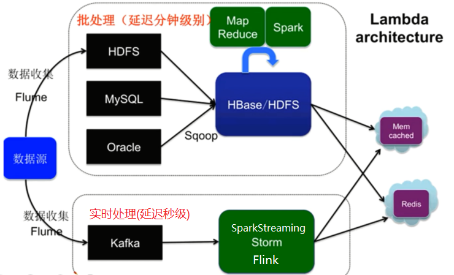

## 二 推荐系统设计

### 2.1 推荐系统要素

- UI 和 UE(前端界面)
- 数据 (Lambda架构)
- 业务知识
- 算法

### 2.2 推荐系统架构

- 推荐系统整体架构

  

- 大数据Lambda架构

  - 由Twitter工程师Nathan Marz(storm项目发起人)提出

  - Lambda系统架构提供了一个结合实时数据和Hadoop预先计算的数据环境和混合平台, 提供一个实时的数据视图

  - 分层架构

    - 批处理层
      - 数据不可变, 可进行任何计算, 可水平扩展
      - 高延迟  几分钟~几小时(计算量和数据量不同)
      - 日志收集 Flume
      - 分布式存储 Hadoop hdfs
      - 分布式计算 Hadoop MapReduce & spark
      - 视图存储数据库
        - nosql(HBase/Cassandra)
        - Redis/memcache
        - MySQL
    - 实时处理层
      - 流式处理, 持续计算
      - 存储和分析某个窗口期内的数据
      - 最终正确性(Eventual accuracy)
      - 实时数据收集 flume & kafka
      - 实时数据分析  spark streaming/storm/flink
    - 服务层
      - 支持随机读
      - 需要在非常短的时间内返回结果
      - 读取批处理层和实时处理层结果并对其归并

  - Lambda架构图

    

- 推荐算法架构

  - 召回阶段(海选)
    - 召回决定了最终推荐结果的天花板
    - 常用算法:
      - 协同过滤(基于用户 基于物品的)
      - 基于内容 (根据用户行为总结出自己的偏好 根据偏好 通过文本挖掘技术找到内容上相似的商品)
      - 基于隐语义
  - 排序阶段
    - 召回决定了最终推荐结果的天花板, 排序逼近这个极限, 决定了最终的推荐效果
    - CTR预估 (点击率预估 使用LR算法)  估计用户是否会点击某个商品 需要用户的点击数据
  - 策略调整

- 推荐系统的整体架构

  

  