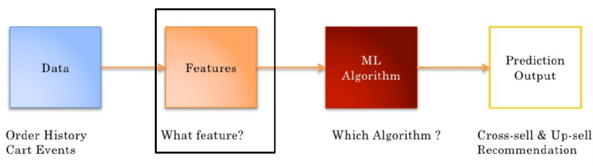
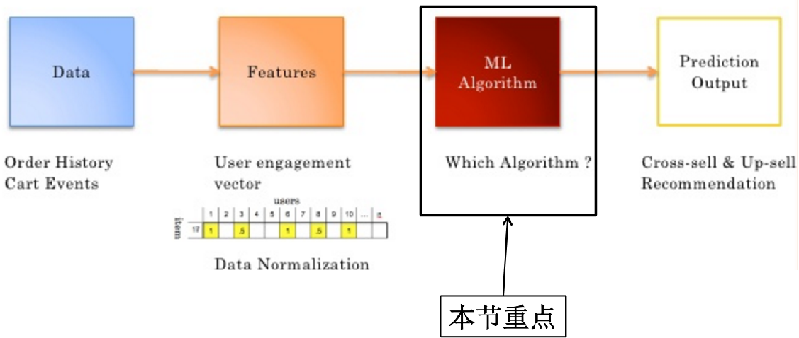
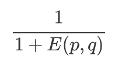
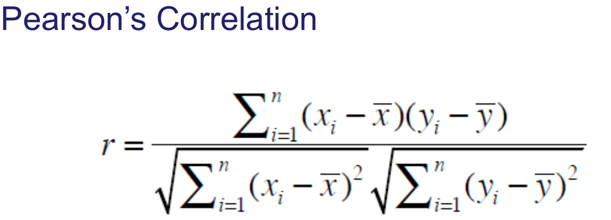
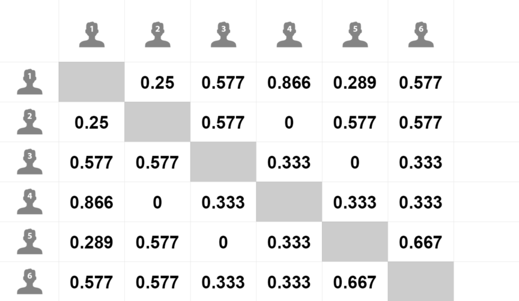
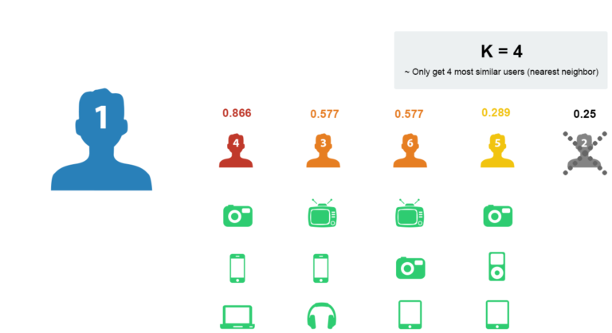
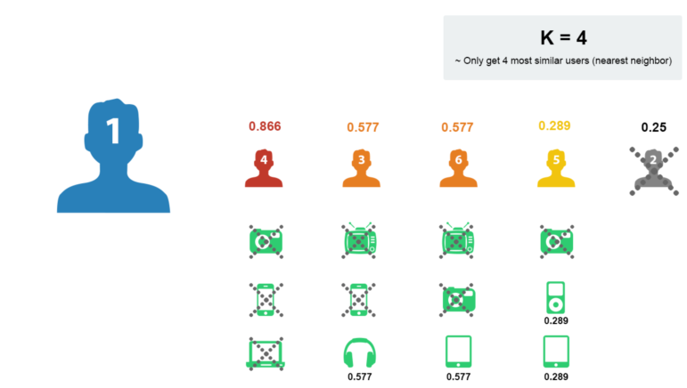
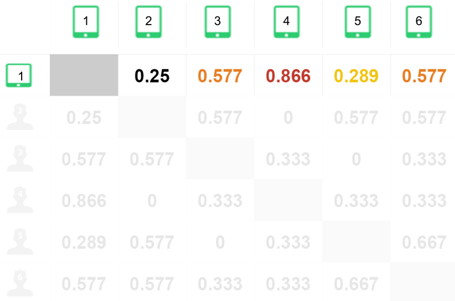
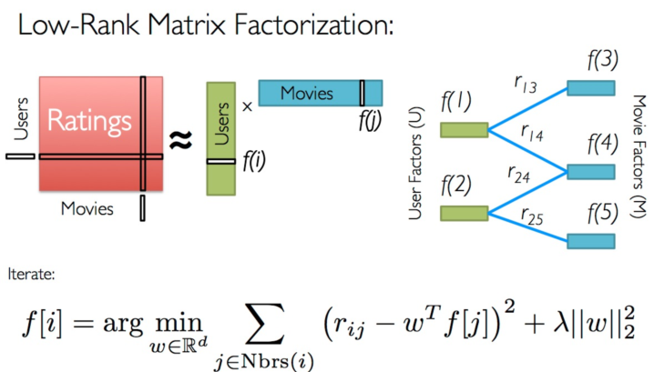

## 推荐算法

- 推荐模型构建流程
- 推荐算法概述
- 基于协同过滤的推荐算法
- 协同过滤实现

### 一 推荐模型构建流程

Data(数据)->Features(特征)->ML Algorithm(机器学习算法)->Prediction Output(预测输出)

- 数据清洗/数据处理


- 数据来源
  - 显性数据
    - Rating 打分
    - Comments 评论/评价
  - 隐形数据
    -  Order history 历史订单
    -  Cart events    加购物车
    -  Page views    页面浏览
    -  Click-thru      点击
    -  Search log     搜索记录
- 数据量/数据能否满足要求
- 特征工程



- 从数据中筛选特征
  - 一个给定的商品，可能被拥有类似品味或需求的用户购买
  - 使用用户行为数据描述商品


- 用数据表示特征

  - 将所有用户行为合并在一起 ，形成一个user-item 矩阵

    

- 选择合适的算法



- 产生推荐结果

  

### 二 最经典的推荐算法：协同过滤推荐算法（Collaborative Filtering）

算法思想：**物以类聚，人以群分**

基本的协同过滤推荐算法基于以下假设：

- “跟你喜好**相似的人**喜欢的东西你也很有可能喜欢” ：基于用户的协同过滤推荐（User-based CF）
- “跟你喜欢的东西**相似的东西**你也很有可能喜欢 ”：基于物品的协同过滤推荐（Item-based CF）

实现协同过滤推荐有以下几个步骤：

1. **找出最相似的人或物品：TOP-N相似的人或物品**

   通过计算两两的相似度来进行排序，即可找出TOP-N相似的人或物品

2. **根据相似的人或物品产生推荐结果**

   利用TOP-N结果生成初始推荐结果，然后过滤掉用户已经有过记录的物品或明确表示不感兴趣的物品

以下是一个简单的示例，数据集相当于一个用户对物品的购买记录表：打勾表示用户对物品的有购买记录

- 关于相似度计算这里先用一个简单的思想：如有两个同学X和Y，X同学爱好[足球、篮球、乒乓球]，Y同学爱好[网球、足球、篮球、羽毛球]，可见他们的共同爱好有2个，那么他们的相似度可以用：2/3 * 2/4 = 1/3 ≈ 0.33 来表示。

  User-Based CF

  

  Item-Based CF

  

  

  通过前面两个demo，相信大家应该已经对协同过滤推荐算法的设计与实现有了比较清晰的认识。


### 三 相似度计算(Similarity Calculation)


- 相似度的计算方法

  - 数据分类
    - 实数值(物品评分情况)
    - 布尔值(用户的行为 是否点击 是否收藏)
  - 欧氏距离, 是一个欧式空间下度量距离的方法. 两个物体, 都在同一个空间下表示为两个点, 假如叫做p,q, 分别都是n个坐标, 那么欧式距离就是衡量这两个点之间的距离. 欧氏距离不适用于布尔向量之间

  

  ​	欧氏距离的值是一个非负数, 最大值正无穷, 通常计算相似度的结果希望是[-1,1]或[0,1]之间,一般可以使用

  ​	如下转化公式:

  ​	

- 杰卡德相似度&余弦相似度&皮尔逊相关系数
  - 余弦相似度
    - 度量的是两个向量之间的夹角, 用夹角的余弦值来度量相似的情况
    - 两个向量的夹角为0是,余弦值为1, 当夹角为90度是余弦值为0,为180度是余弦值为-1
    - 余弦相似度在度量文本相似度, 用户相似度 物品相似度的时候较为常用
    - 余弦相似度的特点, 与向量长度无关,余弦相似度计算要对向量长度归一化, 两个向量只要方向一致,无论程度强弱, 都可以视为'相似'
  - 皮尔逊相关系数Pearson
    - 实际上也是一种余弦相似度, 不过先对向量做了中心化, 向量a b 各自减去向量的均值后, 再计算余弦相似度
    - 皮尔逊相似度计算结果在-1,1之间 -1表示负相关, 1表示正相关
    - 度量两个变量是不是同增同减
    - 皮尔逊相关系数度量的是两个变量的变化趋势是否一致, **不适合计算布尔值向量之间的相关度**
  - 杰卡德相似度 Jaccard
    - 两个集合的交集元素个数在并集中所占的比例, 非常适用于布尔向量表示
    - 分子是两个布尔向量做点积计算, 得到的就是交集元素的个数
    - 分母是两个布尔向量做或运算, 再求元素和
  - 余弦相似度适合用户评分数据(实数值), 杰卡德相似度适用于隐式反馈数据(0,1布尔值)(是否收藏,是否点击,是否加购物车)


- 余弦相似度

  

- 皮尔逊相关系数







- 计算出用户1和其它用户之间的相似度


- 按照相似度大小排序, K近邻 如K取4: 


- 取出近邻用户的购物清单



- 去除用户1已经购买过的商品



- 在剩余的物品中根据评分排序


- 物品相似度计算
  - 余弦相似度对绝对值大小不敏感带来的问题
    - 用户A对两部电影评分分别是1分和2分, 用户B对同样这两部电影进行评分是4分,5分 用余弦相似度计算,两个用户的相似度达到0.98    
    - 可以采用改进的余弦相似度, 先计算向量每个维度上的均值, 然后每个向量在各个维度上都减去均值后,在计算余弦相似度, 用调整的余弦相似度计算得到的相似度是-0.1


- 物品相似度计算案例


- 找出物品1的相似商品





- 选择最近似的物品


- 基于用户与物品的协同过滤比较


### 协同过滤推荐算法代码实现：

- 构建数据集：

  ```python
  users = ["User1", "User2", "User3", "User4", "User5"]
  items = ["Item A", "Item B", "Item C", "Item D", "Item E"]
  # 构建数据集
  datasets = [
      ["buy",None,"buy","buy",None],
      ["buy",None,None,"buy","buy"],
      ["buy",None,"buy",None,None],
      [None,"buy",None,"buy","buy"],
      ["buy","buy","buy",None,"buy"],
  ]
  ```

- 计算时我们数据通常都需要对数据进行处理，或者编码，目的是为了便于我们对数据进行运算处理，比如这里是比较简单的情形，我们用1、0分别来表示用户的是否购买过该物品，则我们的数据集其实应该是这样的：

  ```python
  users = ["User1", "User2", "User3", "User4", "User5"]
  items = ["Item A", "Item B", "Item C", "Item D", "Item E"]
  # 用户购买记录数据集
  datasets = [
      [1,0,1,1,0],
      [1,0,0,1,1],
      [1,0,1,0,0],
      [0,1,0,1,1],
      [1,1,1,0,1],
  ]
  import pandas as pd
  
  df = pd.DataFrame(datasets,
                    columns=items,
                    index=users)
  print(df)
  ```

- 有了数据集，接下来我们就可以进行相似度的计算，不过对于相似度的计算其实是有很多专门的相似度计算方法的，比如余弦相似度、皮尔逊相关系数、杰卡德相似度等等。这里我们选择使用杰卡德相似系数[0,1]

  ```python
  # 直接计算某两项的杰卡德相似系数
  from sklearn.metrics import jaccard_similarity_score
  # 计算Item A 和Item B的相似度
  print(jaccard_similarity_score(df["Item A"], df["Item B"]))
  
  
  # 计算所有的数据两两的杰卡德相似系数
  from sklearn.metrics.pairwise import pairwise_distances
  # 计算用户间相似度
  user_similar = 1 - pairwise_distances(df, metric="jaccard")
  user_similar = pd.DataFrame(user_similar, columns=users, index=users)
  print("用户之间的两两相似度：")
  print(user_similar)
  
  # 计算物品间相似度
  item_similar = 1 - pairwise_distances(df.T, metric="jaccard")
  item_similar = pd.DataFrame(item_similar, columns=items, index=items)
  print("物品之间的两两相似度：")
  print(item_similar)
  ```

  有了两两的相似度，接下来就可以筛选TOP-N相似结果，并进行推荐了

- User-Based CF

  ```python
  import pandas as pd
  import numpy as np
  from pprint import pprint
  
  users = ["User1", "User2", "User3", "User4", "User5"]
  items = ["Item A", "Item B", "Item C", "Item D", "Item E"]
  # 用户购买记录数据集
  datasets = [
      [1,0,1,1,0],
      [1,0,0,1,1],
      [1,0,1,0,0],
      [0,1,0,1,1],
      [1,1,1,0,1],
  ]
  
  df = pd.DataFrame(datasets,
                    columns=items,
                    index=users)
  
  # 计算所有的数据两两的杰卡德相似系数
  from sklearn.metrics.pairwise import pairwise_distances
  # 计算用户间相似度
  user_similar = 1 - pairwise_distances(df, metric="jaccard")
  user_similar = pd.DataFrame(user_similar, columns=users, index=users)
  print("用户之间的两两相似度：")
  print(user_similar)
  
  topN_users = {}
  # 遍历每一行数据
  for i in user_similar.index:
      # 取出每一列数据，并删除自身，然后排序数据
      _df = user_similar.loc[i].drop([i])
      _df_sorted = _df.sort_values(ascending=False)
  
      top2 = list(_df_sorted.index[:2])
      topN_users[i] = top2
  
  print("Top2相似用户：")
  pprint(topN_users)
  
  rs_results = {}
  # 构建推荐结果
  for user, sim_users in topN_users.items():
      rs_result = set()    # 存储推荐结果
      for sim_user in sim_users:
          # 构建初始的推荐结果
          rs_result = rs_result.union(set(df.ix[sim_user].replace(0,np.nan).dropna().index))
      # 过滤掉已经购买过的物品
      rs_result -= set(df.ix[user].replace(0,np.nan).dropna().index)
      rs_results[user] = rs_result
  print("最终推荐结果：")
  pprint(rs_results)
  ```

- Item-Based CF

  ```python
  import pandas as pd
  import numpy as np
  from pprint import pprint
  
  users = ["User1", "User2", "User3", "User4", "User5"]
  items = ["Item A", "Item B", "Item C", "Item D", "Item E"]
  # 用户购买记录数据集
  datasets = [
      [1,0,1,1,0],
      [1,0,0,1,1],
      [1,0,1,0,0],
      [0,1,0,1,1],
      [1,1,1,0,1],
  ]
  
  df = pd.DataFrame(datasets,
                    columns=items,
                    index=users)
  
  # 计算所有的数据两两的杰卡德相似系数
  from sklearn.metrics.pairwise import pairwise_distances
  # 计算物品间相似度
  item_similar = 1 - pairwise_distances(df.T, metric="jaccard")
  item_similar = pd.DataFrame(item_similar, columns=items, index=items)
  print("物品之间的两两相似度：")
  print(item_similar)
  
  topN_items = {}
  # 遍历每一行数据
  for i in item_similar.index:
      # 取出每一列数据，并删除自身，然后排序数据
      _df = item_similar.loc[i].drop([i])
      _df_sorted = _df.sort_values(ascending=False)
  
      top2 = list(_df_sorted.index[:2])
      topN_items[i] = top2
  
  print("Top2相似物品：")
  pprint(topN_items)
  
  rs_results = {}
  # 构建推荐结果
  for user in df.index:    # 遍历所有用户
      rs_result = set()
      for item in df.ix[user].replace(0,np.nan).dropna().index:   # 取出每个用户当前已购物品列表
          # 根据每个物品找出最相似的TOP-N物品，构建初始推荐结果
          rs_result = rs_result.union(topN_items[item])
      # 过滤掉用户已购的物品
      rs_result -= set(df.ix[user].replace(0,np.nan).dropna().index)
      # 添加到结果中
      rs_results[user] = rs_result
  
  print("最终推荐结果：")
  pprint(rs_results)
  ```

**关于协同过滤推荐算法使用的数据集**

在前面的demo中，我们只是使用用户对物品的一个购买记录，类似也可以是比如浏览点击记录、收听记录等等。这样数据我们预测的结果其实相当于是在预测用户是否对某物品感兴趣，对于喜好程度不能很好的预测。

因此在协同过滤推荐算法中其实会更多的利用用户对物品的“评分”数据来进行预测，通过评分数据集，我们可以预测用户对于他没有评分过的物品的评分。其实现原理和思想和都是一样的，只是使用的数据集是用户-物品的评分数据。

**关于用户-物品评分矩阵**

用户-物品的评分矩阵，根据评分矩阵的稀疏程度会有不同的解决方案

- 稠密评分矩阵

  

- 稀疏评分矩阵

  

这里先介绍稠密评分矩阵的处理，稀疏矩阵的处理相对会复杂一些，我们到后面再来介绍。

#### 使用协同过滤推荐算法对用户进行评分预测

- 数据集：

  **目的：预测用户1对物品E的评分**

- 构建数据集：注意这里构建评分数据时，对于缺失的部分我们需要保留为None，如果设置为0那么会被当作评分值为0去对待

  ```python
  users = ["User1", "User2", "User3", "User4", "User5"]
  items = ["Item A", "Item B", "Item C", "Item D", "Item E"]
  # 用户购买记录数据集
  datasets = [
      [5,3,4,4,None],
      [3,1,2,3,3],
      [4,3,4,3,5],
      [3,3,1,5,4],
      [1,5,5,2,1],
  ]
  ```

- 计算相似度：对于评分数据这里我们采用皮尔逊相关系数[-1,1]来计算，-1表示强负相关，+1表示强正相关

  > pandas中corr方法可直接用于计算皮尔逊相关系数

  ```python
  df = pd.DataFrame(datasets,
                    columns=items,
                    index=users)
  
  print("用户之间的两两相似度：")
  # 直接计算皮尔逊相关系数
  # 默认是按列进行计算，因此如果计算用户间的相似度，当前需要进行转置
  user_similar = df.T.corr()
  print(user_similar.round(4))
  
  print("物品之间的两两相似度：")
  item_similar = df.corr()
  print(item_similar.round(4))
  ```

  ```
  # 运行结果：
  用户之间的两两相似度：
          User1   User2   User3   User4   User5
  User1  1.0000  0.8528  0.7071  0.0000 -0.7921
  User2  0.8528  1.0000  0.4677  0.4900 -0.9001
  User3  0.7071  0.4677  1.0000 -0.1612 -0.4666
  User4  0.0000  0.4900 -0.1612  1.0000 -0.6415
  User5 -0.7921 -0.9001 -0.4666 -0.6415  1.0000
  物品之间的两两相似度：
          Item A  Item B  Item C  Item D  Item E
  Item A  1.0000 -0.4767 -0.1231  0.5322  0.9695
  Item B -0.4767  1.0000  0.6455 -0.3101 -0.4781
  Item C -0.1231  0.6455  1.0000 -0.7206 -0.4276
  Item D  0.5322 -0.3101 -0.7206  1.0000  0.5817
  Item E  0.9695 -0.4781 -0.4276  0.5817  1.0000
  ```

  可以看到与用户1最相似的是用户2和用户3；与物品A最相似的物品分别是物品E和物品D。

  **注意：**我们在预测评分时，往往是通过与其有正相关的用户或物品进行预测，如果不存在正相关的情况，那么将无法做出预测。这一点尤其是在稀疏评分矩阵中尤为常见，因为稀疏评分矩阵中很难得出正相关系数。

- **评分预测：**

  **User-Based CF 评分预测：使用用户间的相似度进行预测**

  关于评分预测的方法也有比较多的方案，下面介绍一种效果比较好的方案，该方案考虑了用户本身的评分评分以及近邻用户的加权平均相似度打分来进行预测：
  $$
  pred(u,i)=\hat{r}_{ui}=\cfrac{\sum_{v\in U}sim(u,v)*r_{vi}}{\sum_{v\in U}|sim(u,v)|}
  $$
  我们要预测用户1对物品E的评分，那么可以根据与用户1最近邻的用户2和用户3进行预测，计算如下：

  ​	
  $$
  pred(u_1, i_5) =\cfrac{0.85*3+0.71*5}{0.85+0.71} = 3.91
  $$
  最终预测出用户1对物品5的评分为3.91

  **Item-Based CF 评分预测：使用物品间的相似度进行预测**

  这里利用物品相似度预测的计算同上，同样考虑了用户自身的平均打分因素，结合预测物品与相似物品的加权平均相似度打分进行来进行预测
  $$
  pred(u,i)=\hat{r}_{ui}=\cfrac{\sum_{j\in I_{rated}}sim(i,j)*r_{uj}}{\sum_{j\in I_{rated}}sim(i,j)}
  $$
  我们要预测用户1对物品E的评分，那么可以根据与物品E最近邻的物品A和物品D进行预测，计算如下：
  $$
  pred(u_1, i_5) = \cfrac {0.97*5+0.58*4}{0.97+0.58} = 4.63
  $$
  对比可见，User-Based CF预测评分和Item-Based CF的评分结果也是存在差异的，因为严格意义上他们其实应当属于两种不同的推荐算法，各自在不同的领域不同场景下，都会比另一种的效果更佳，但具体哪一种更佳，必须经过合理的效果评估，因此在实现推荐系统时这两种算法往往都是需要去实现的，然后对产生的推荐效果进行评估分析选出更优方案。

### 基于模型的方法

- 思想
  - 通过机器学习算法，在数据中找出模式，并将用户与物品间的互动方式模式化
  - 基于模型的协同过滤方式是构建协同过滤更高级的算法

- 近邻模型的问题

  - 物品之间存在相关性, 信息量并不随着向量维度增加而线性增加
  - 矩阵元素稀疏, 计算结果不稳定,增减一个向量维度, 导致近邻结果差异很大的情况存在

- 算法分类
  - 基于图的模型
  - **基于矩阵分解的方法**

- 基于图的模型

  - 基于邻域的模型看做基于图的模型的简单形式

  

  - 原理
    - 将用户的行为数据表示为二分图
    - 基于二分图为用户进行推荐
    - 根据两个顶点之间的路径数、路径长度和经过的顶点数来评价两个顶点的相关性

- 基于矩阵分解的模型

  - 原理

    - 根据用户与物品的潜在表现，我们就可以预测用户对未评分的物品的喜爱程度

    - 把原来的大矩阵, 近似分解成两个小矩阵的乘积, 在实际推荐计算时不再使用大矩阵, 而是使用分解得到的两个小矩阵  

    - 用户-物品评分矩阵A是M X N维, 即一共有M个用户, n个物品 我们选一个很小的数 K (K<< M, K<<N)

    - 通过计算得到两个矩阵U V  U是M * K矩阵 , 矩阵V是 N * K

      $U_{m*k} V^{T}_{n*k} 约等于 A_{m*n}$

      类似这样的计算过程就是矩阵分解

  - 基于矩阵分解的方法
    - ALS交替最小二乘
      - ALS-WR(加权正则化交替最小二乘法): alternating-least-squares with weighted-λ –regularization
      - 将用户(user)对商品(item)的评分矩阵分解为两个矩阵：一个是用户对商品隐含特征的偏好矩阵，另一个是商品所包含的隐含特征的矩阵。在这个矩阵分解的过程中，评分缺失项得到了填充，也就是说我们可以基于这个填充的评分来给用户做商品推荐了。
    - SVD奇异值分解矩阵

- ALS方法

  

  - ALS的矩阵分解算法常应用于推荐系统中，将用户(user)对商品(item)的评分矩阵，分解为用户对商品隐含特征的偏好矩阵，和商品在隐含特征上的映射矩阵。
  - 与传统的矩阵分解SVD方法来分解矩阵R(R∈ℝm×n)不同的是，ALS(alternating least squares)希望找到两个低维矩阵，以 R̃ =XY 来逼近矩阵R，其中 ，X∈ℝm×d，Y∈ℝd×n，这样，将问题的复杂度由O(m*n)转换为O((m+n)*d)。
  - 计算X和Y过程：首先用一个小于1的随机数初始化Y，并根据公式求X，此时就可以得到初始的XY矩阵了，根据平方差和得到的X，重新计算并覆盖Y，计算差平方和，反复进行以上两步的计算，直到差平方和小于一个预设的数，或者迭代次数满足要求则停止

