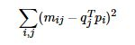
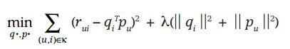
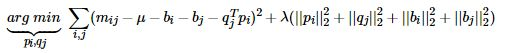
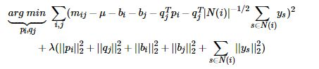

## 基于矩阵分解的CF算法

#### 矩阵分解发展史

**Traditional SVD:**

通常SVD矩阵分解指的是SVD（奇异值）分解技术，在这我们姑且将其命名为Traditional SVD（传统并经典着）其公式如下：

Traditional SVD分解的形式为3个矩阵相乘，中间矩阵为奇异值矩阵。如果想运用SVD分解的话，有一个前提是要求矩阵是稠密的，即矩阵里的元素要非空，否则就不能运用SVD分解。

很显然我们的数据其实绝大多数情况下都是稀疏的，因此如果要使用Traditional SVD，一般的做法是先用均值或者其他统计学方法来填充矩阵，然后再运用Traditional SVD分解降维，但这样做明显对数据的原始性造成一定影响。

**FunkSVD（LFM）**

刚才提到的Traditional SVD首先需要填充矩阵，然后再进行分解降维，同时存在计算复杂度高的问题，因为要分解成3个矩阵，所以后来提出了Funk SVD的方法，它不在将矩阵分解为3个矩阵，而是分解为2个用户-隐含特征，项目-隐含特征的矩阵，Funk SVD也被称为最原始的LFM模型

借鉴线性回归的思想，通过最小化观察数据的平方来寻求最优的用户和项目的隐含向量表示。同时为了避免过度拟合（Overfitting）观测数据，又提出了带有L2正则项的FunkSVD，上公式：

以上两种最优化函数都可以通过梯度下降或者随机梯度下降法来寻求最优解。

**BiasSVD:**

在FunkSVD提出来之后，出现了很多变形版本，其中一个相对成功的方法是BiasSVD，顾名思义，即带有偏置项的SVD分解：

它基于的假设和Baseline基准预测是一样的，但这里将Baseline的偏置引入到了矩阵分解中

**SVD++:**

人们后来又提出了改进的BiasSVD，被称为SVD++，该算法是在BiasSVD的基础上添加了用户的隐式反馈信息：

显示反馈指的用户的评分这样的行为，隐式反馈指用户的浏览记录、购买记录、收听记录等。

SVD++是基于这样的假设：在BiasSVD基础上，认为用户对于项目的历史浏览记录、购买记录、收听记录等可以从侧面反映用户的偏好。

