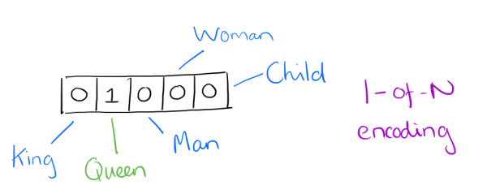
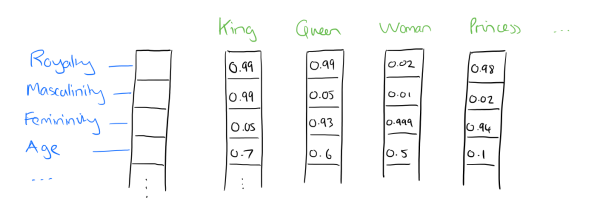

## 基于内容的电影推荐：物品冷启动处理


利用Word2Vec可以计算电影所有标签词之间的关系程度，可用于计算电影之间的相似度

#### word2vec原理简介

- word2vec是google在2013年开源的一个NLP(Natural Language Processing自然语言处理) 工具，它的特点是将所有的词向量化，这样词与词之间就可以定量的去度量他们之间的关系，挖掘词之间的联系。

- one-hot vector VS. word vector
  - 用向量来表示词并不是word2vec的首创
  - 最早的词向量是很冗长的，它使用是词向量维度大小为整个词汇表的大小，对于每个具体的词汇表中的词，将对应的位置置为1。
  - 比如下面5个词组成词汇表，词"Queen"的序号为2， 那么它的词向量就是(0,1,0,0,0)同样的道理，词"Woman"的词向量就是(0,0,0,1,0)。

  

- one hot vector的问题

  - 如果词汇表非常大，如达到万级别，这样每个词都用万维的向量来表示浪费内存。这样的向量除了一个位置是1，其余位置全部为0，表达效率低(稀疏)，需要降低词向量的维度
  - 难以发现词之间的关系，以及难以捕捉句法（结构）和语义（意思）之间的关系
  - Dristributed representation可以解决One hot representation的问题，它的思路是通过训练，将每个词都映射到一个较短的词向量上来。所有的这些词向量就构成了向量空间，进而可以用普通的统计学的方法来研究词与词之间的关系。这个较短的词向量维度一般需要我们在训练时指定。
  - 比如下图我们将词汇表里的词用"Royalty(王位)","Masculinity(男性气质)", "Femininity(女性气质)"和"Age"4个维度来表示，King这个词对应的词向量可能是(0.99,0.99,0.05,0.7)。当然在实际情况中，我们并不一定能对词向量的每个维度做一个很好的解释。

  

- 有了用Dristributed representation表示的较短的词向量，就可以较容易的分析词之间的关系，比如将词的维度降维到2维，用下图的词向量表示我们的词时，发现：$\vec{King} - \vec{Man} + \vec{Woman} = \vec{Queen}$ 

  

- 什么是word vector（词向量）

  - 每个单词被表征为多维的浮点数，每一维的浮点数的数值大小表示了它与另一个单词之间的“距离”，表征的结果就是语义相近的词被映射到相近的集合空间上，好处是这样单词之间就是可以计算的：

  <table>
      <th>
      <td> animal </td>
      <td> pet </td>
      </th>
  <tr>
   <td> dog </td>
   <td> -0.4 </td>
   <td> 0.02 </td>
  </tr>
  <tr>
   <td> lion </td>
   <td> 0.2 </td>
   <td> 0.35 </td>
  </tr>
  </table>

  animal那一列表示的就是左边的词与animal这个概念的”距离“

- #### Word2Vec

  ##### 两个重要模型：CBOW和Skip-Gram

  - 介绍：CBOW把一个词从词窗剔除。在CBOW下给定*n*词围绕着词*w*，word2vec预测一个句子中其中一个缺漏的词*c*，即以概率$p(c|w)$来表示。相反地，Skip-gram给定词窗中的文本，预测当前的词$p(w|c)$。

  - 原理：拥有差不多上下文的两个单词的意思往往是相近的

  - **Continuous Bag-of-Words(CBOW)** 连续词袋向量

    - 

    - 功能：通过上下文预测当前词出现的概率

    - 原理分析

      假设文本如下：“the florid <u>prose of</u> **the** <u>nineteenth century.</u>”

      想象有个滑动窗口，中间的词是关键词，两边为相等长度的文本来帮助分析。文本的长度为7，就得到了7个one-hot向量，作为神经网络的输入向量，训练目标是：最大化在给定前后文本情况下输出正确关键词的概率，比如给定("prose","of","nineteenth","century")的情况下，要最大化输出"the"的概率，用公式表示就是

      P("the"|("prose","of","nineteenth","century"))

    - 特性

      - hidden layer只是将权重求和，传递到下一层，是线性的

  - **Continuous Skip-gram**

    - 
    - 功能：根据当前词预测上下文
    - 原理分析
      - 和CBOW相反，则我们要求的概率就变为P(Context(w)|w)

- **总结：**word2vec算法可以计算出每个词语的一个词向量，我们可以用它来表示该词的语义层面的含义

#### Word2Vec使用

```python
from gensim.models import TfidfModel

import pandas as pd
import numpy as np


def get_movie_dataset():
    # 加载基于所有电影的标签
    # all-tags.csv来自ml-latest数据集中
    # 由于ml-latest-small中标签数据太多，因此借助其来扩充
    _tags = pd.read_csv("datasets/ml-latest-small/all-tags.csv", usecols=range(1, 3)).dropna()
    tags = _tags.groupby("movieId").agg(list)

    # 加载电影列表数据集
    movies = pd.read_csv("datasets/ml-latest-small/movies.csv", index_col="movieId")
    # 将类别词分开
    movies["genres"] = movies["genres"].apply(lambda x: x.split("|"))
    # 为每部电影匹配对应的标签数据，如果没有将会是NAN
    movies_index = set(movies.index) & set(tags.index)
    new_tags = tags.loc[list(movies_index)]
    ret = movies.join(new_tags)

    # 构建电影数据集，包含电影Id、电影名称、类别、标签四个字段
    # 如果电影没有标签数据，那么就替换为空列表
    movie_dataset = pd.DataFrame(
        map(
            lambda x: (x[0], x[1], x[2], x[2]+x[3]) if x[3] is not np.nan else (x[0], x[1], x[2], []), ret.itertuples())
        , columns=["movieId", "title", "genres","tags"]
    )

    movie_dataset.set_index("movieId", inplace=True)
    return movie_dataset


def create_movie_profile(movie_dataset):
    '''
    使用tfidf，分析提取topn关键词
    :param movie_dataset:
    :return:
    '''
    dataset = movie_dataset["tags"].values

    from gensim.corpora import Dictionary
    dct = Dictionary(dataset)
    corpus = [dct.doc2bow(line) for line in dataset]

    model = TfidfModel(corpus)

    _movie_profile = []
    for i, data in enumerate(movie_dataset.itertuples()):
        mid = data[0]
        title = data[1]
        genres = data[2]
        vector = model[corpus[i]]
        movie_tags = sorted(vector, key=lambda x: x[1], reverse=True)[:30]
        topN_tags_weights = dict(map(lambda x: (dct[x[0]], x[1]), movie_tags))
        # 将类别词的添加进去，并设置权重值为1.0
        for g in genres:
            topN_tags_weights[g] = 1.0
        topN_tags = [i[0] for i in topN_tags_weights.items()]
        _movie_profile.append((mid, title, topN_tags, topN_tags_weights))

    movie_profile = pd.DataFrame(_movie_profile, columns=["movieId", "title", "profile", "weights"])
    movie_profile.set_index("movieId", inplace=True)
    return movie_profile

movie_dataset = get_movie_dataset()
movie_profile = create_movie_profile(movie_dataset)

import gensim, logging

logging.basicConfig(format='%(asctime)s : %(levelname)s : %(message)s', level=logging.INFO)

sentences = list(movie_profile["profile"].values)

model = gensim.models.Word2Vec(sentences, window=3, min_count=1, iter=20)

while True:
    words = input("words: ")  # action
    ret = model.wv.most_similar(positive=[words], topn=10)
    print(ret)
    
```

Doc2Vec是建立在Word2Vec上的，用于直接计算以文档为单位的文档向量，这里我们将一部电影的所有标签词，作为整个文档，这样可以计算出每部电影的向量，通过计算向量之间的距离，来判断用于计算电影之间的相似程度。

这样可以解决物品冷启动问题

#### Doc2Vec使用

```python
from gensim.models import TfidfModel

import pandas as pd
import numpy as np

from pprint import pprint


def get_movie_dataset():
    # 加载基于所有电影的标签
    # all-tags.csv来自ml-latest数据集中
    # 由于ml-latest-small中标签数据太多，因此借助其来扩充
    _tags = pd.read_csv("datasets/ml-latest-small/all-tags.csv", usecols=range(1, 3)).dropna()
    tags = _tags.groupby("movieId").agg(list)

    # 加载电影列表数据集
    movies = pd.read_csv("datasets/ml-latest-small/movies.csv", index_col="movieId")
    # 将类别词分开
    movies["genres"] = movies["genres"].apply(lambda x: x.split("|"))
    # 为每部电影匹配对应的标签数据，如果没有将会是NAN
    movies_index = set(movies.index) & set(tags.index)
    new_tags = tags.loc[list(movies_index)]
    ret = movies.join(new_tags)

    # 构建电影数据集，包含电影Id、电影名称、类别、标签四个字段
    # 如果电影没有标签数据，那么就替换为空列表
    movie_dataset = pd.DataFrame(
        map(
            lambda x: (x[0], x[1], x[2], x[2]+x[3]) if x[3] is not np.nan else (x[0], x[1], x[2], []), ret.itertuples())
        , columns=["movieId", "title", "genres","tags"]
    )

    movie_dataset.set_index("movieId", inplace=True)
    return movie_dataset


def create_movie_profile(movie_dataset):
    '''
    使用tfidf，分析提取topn关键词
    :param movie_dataset:
    :return:
    '''
    dataset = movie_dataset["tags"].values

    from gensim.corpora import Dictionary
    dct = Dictionary(dataset)
    corpus = [dct.doc2bow(line) for line in dataset]

    model = TfidfModel(corpus)

    _movie_profile = []
    for i, data in enumerate(movie_dataset.itertuples()):
        mid = data[0]
        title = data[1]
        genres = data[2]
        vector = model[corpus[i]]
        movie_tags = sorted(vector, key=lambda x: x[1], reverse=True)[:30]
        topN_tags_weights = dict(map(lambda x: (dct[x[0]], x[1]), movie_tags))
        # 将类别词的添加进去，并设置权重值为1.0
        for g in genres:
            topN_tags_weights[g] = 1.0
        topN_tags = [i[0] for i in topN_tags_weights.items()]
        _movie_profile.append((mid, title, topN_tags, topN_tags_weights))

    movie_profile = pd.DataFrame(_movie_profile, columns=["movieId", "title", "profile", "weights"])
    movie_profile.set_index("movieId", inplace=True)
    return movie_profile

movie_dataset = get_movie_dataset()
movie_profile = create_movie_profile(movie_dataset)

import gensim, logging
from gensim.models.doc2vec import Doc2Vec, TaggedDocument

logging.basicConfig(format='%(asctime)s : %(levelname)s : %(message)s', level=logging.INFO)

documents = [TaggedDocument(words, [movie_id]) for movie_id, words in movie_profile["profile"].iteritems()]

# 训练模型并保存
model = Doc2Vec(documents, vector_size=100, window=3, min_count=1, workers=4, epochs=20)
from gensim.test.utils import get_tmpfile
fname = get_tmpfile("my_doc2vec_model")
model.save(fname)


words = movie_profile["profile"].loc[6]
print(words)
inferred_vector = model.infer_vector(words)
sims = model.docvecs.most_similar([inferred_vector], topn=10)
print(sims)
```

