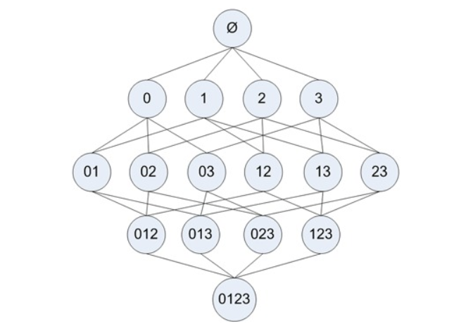
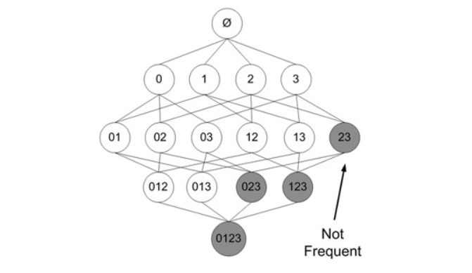

## 关键规则挖掘算法（一）Apriori算法

#### Apriori算法原理

Apriori算法是著名的关联规则挖掘算法。

假如我们在经营一家商品种类并不多的杂货店，我们对哪些经常在一起被购买的商品非常感兴趣。我们只有四种商品：商品0、商品1、商品2、商品3。那么所有可能被一起购买的商品组合都有哪些？这些商品组合可能著有一种商品，比如商品0，也可能包括两种、三种或所有四种商品。但我们不关心某人买了两件商品0以及四件商品2的情况，只关心他购买了一种或多种商品。

下图显示了物品之间所有可能的组合：

- 图中使用物品的编号0来表示物品0本身。
- 图中从上往下的第一个集合是$\phi$，表示空集或不包含任何物品的集合。
- 物品集合之间的连线表明两个或者更多集合可以组合形成一个更大的集合。



**目标：**我们的目标是找到经常在一起购买的物品集合。我们使用集合的支持度来度量其出现的频率。

> 一个集合的支持度是指有多少比例的交易记录包含该集合。

**问题：** 如何对一个给定的集合，比如`{0，3}`，来计算其支持度？

- 我们可以遍历毎条记录并检查该记录包含0和3，如果记录确实同时包含这两项，那么就增加总计数值。在扫描完所有数据之后，使用统计得到的总数除以总的交易记录数，就可以得到支持度。

**注意：**上述过程和结果只是针对单个集合{0,3}。要获得每种可能集合的支持度就需要多次重复上述过程。我们可以数一下图中的集合数目，会发现即使对于仅有4种物品的集合，也需要遍历数据15次。而随着物品数目的增加遍历次数会急剧增长。对于包含N种物品的数据集共有$2^{N-1}$种项集组合。而且实际上出售10 000或更多种物品的商店并不少见。即使只出售100种商品的商店也会有$1.26 * 10^{30}$种可能的项集组合。这样的运算量，其实即使是对于现在的很多计算机而言，也需要很长的时间才能完成运算。

**Apriori算法的原理可以帮我们减少可能感兴趣的项集，降低所需的计算时间。**

Apriori算法原理：

- 如果某个项集是频繁的，那么它的所有子集都是频繁的，例如，假设`{1,2}`是频繁的，那么`{1}`和`{2}`也一定是频繁的。

- 将这个原理取反会发现：如果一个项集是非频繁的，那么它的所有超集也是非频繁的

  如下图中，已知项集`{2,3}`是非频繁的，那么可立即判断出项集`{0,2,3}`、`{1,2,3}`、`{0,1,2,3}`都是非频繁的，因此这些项集的支持度也就不需要再计算

  

**Apriori算法的一般过程：**

1. 收集数据：使用任意方法。
2. 准备数据：任何数据类型都可以，因为我们只保存集合。
3. 分析数据：使用任意方法。
4. 训练算法：使用Apriori算法来找到频繁项集。
5. 测试算法：不需要测试过程。
6. 使用算法：用于发现频繁项集以及物品之间的关联规则。

#### Apriori算法实现


实现数据集扫描方法：

```python
from numpy import *


def loadDataSet():
    '''
    加载数据集
    :return: dataset
    '''
    return [[1, 3, 4], [2, 3, 5], [1, 2, 3, 5], [2, 5]]

def createC1(dataSet):
    '''
    创建C1候选项集，C1是所有大小为1的候选项集的列表
    :param dataSet:
    :return: C1
    '''
    # C1是所有大小为1的候选项集的列表
    C1 = []
    # 遍历数据集，逐个添加到C1中
    for record in dataSet:
        for item in record:
            if not [item] in C1:
                C1.append([item])
    C1.sort()
    # 使用不变集合存储C1内部的每个候选项集，那么就可以将其作为字典的Key，如果是list类型不能直接作为字典的Key
    return list(map(frozenset, C1))

def scanDataset(dataset, ck, minSupport):
    '''
    扫描数据集，判断频繁项集
    :param dataset:
    :param ck: ck是所有大小为k的候选项集的列表
    :param minSupport: 设置的最小支持度阈值
    :return: 符合条件的项集、每个项集的支持度
    '''
    # 存储项集的出现次数
    selectedSetCount = {}
    for record in dataset:    # 遍历每一条记录
        for candidateSet in ck:
            # 判断当前候选项集是不是当前记录的子集
            if candidateSet.issubset(record):    
                if candidateSet not in selectedSetCount:
                    selectedSetCount[candidateSet] = 1
                else:
                    selectedSetCount[candidateSet] += 1
    # 计算总条目数
    numItems = float(len(dataset))
    # 存储符合条件的项集
    retList = []
    # 存储项集的支持度
    supportData = {}
    for key in selectedSetCount:
        # 计算支持度
        support = selectedSetCount[key] / numItems
        if support >= minSupport:
            retList.insert(0, key)
        supportData[key] = support
    return retList, supportData

if __name__ == '__main__':
    from pprint import pprint
    dataset = loadDataSet()
    c1 = createC1(dataset)
    pprint(scanDataset(dataset, c1, 0.5))
```

实现频繁项集挖掘：

```python
......

def createCk(lastFrequentItems, k):
    '''
    根据k-1项的频繁项集列表生成k项的候选项集
    :param lastFrequentItems: k-1项的频繁项集
    :param k: 第k个项集
    :return: ck项集
    '''
    retList = []
    lenLk = len(lastFrequentItems)
    
    for i in range(lenLk):
        for j in range(i+1, lenLk):
            # 因为新构建的ck项集，特征是任意一个k项集其中k-1项都必须存在于lastCk中
            # 通过以下判断，能筛选出那些符合要求的k-1项
            L1 = list(lastFrequentItems[i])[:k-2]; L2 = list(lastFrequentItems[j])[:k-2]
            L1.sort(); L2.sort()
            if L1==L2:
                retList.append(lastFrequentItems[i] | lastFrequentItems[j])
    return retList

def apriori(dataSet, minSupport=0.5):
    C1 = createC1(dataSet)
    k1FrequentItems, supportData = scanDataset(dataSet, C1, minSupport)
    frequentItemsList = [k1FrequentItems]
    # 应为k=1的频繁项集已经找到，因此从k=2继续
    k = 2
    while True:
        # 根据k-1的频繁项集，创建k候选集，
        # k-1-1是因为列表下表从0开始
        ck = createCk(frequentItemsList[k-1-1], k)
        # 再次扫描数据集，找出新的k项频繁项集
        newFrequentItems, supK = scanDataset(dataSet, ck, minSupport)
        # 更新项集的支持度
        supportData.update(supK)
        # 如果无法生成新的频繁项集，那么推出循环
        if len(newFrequentItems) == 0:
            break
        # 存储所有的频繁项集
        frequentItemsList.append(newFrequentItems)
        k += 1
    return frequentItemsList, supportData

if __name__ == '__main__':
    from pprint import pprint
    dataset = loadDataSet()
    c1 = createC1(dataset)

    pprint(apriori(dataset, 0.3))
```

实现关联规则挖掘：

```python
......
def generateRules(frequentItemsList, supportData, minConf=0.7):
    # 存储关联规则
    ruleList = []
    # 从含有2项item的频繁项集开始遍历，计算两两的置信度
    for i in range(1, len(frequentItemsList)):
        # 遍历每一阶段的频繁项集
        for frequentItem in frequentItemsList[i]:
            print(frequentItem)
            subItems = [frozenset([item]) for item in frequentItem]
            print(subItems)
            if (i == 1):
                # 先计算2项item的频繁项集的置信度，并将关联规则存储到ruleList
                calculateConfidence(frequentItem, subItems, supportData, ruleList, minConf)
            else:
                # 然后使用递归依次计算3到k项item频繁项集之间两两的置信度，并提取关联规则
                rulesFromRecursive(frequentItem, subItems, supportData, ruleList, minConf)
    return ruleList

def calculateConfidence(frequentItem, subItems, supportData, ruleList, minConf=0.7):
    # 存储符合最小置信度阈值的item
    retList = []
    for subItem in subItems:
        #支持度({豆奶, 莴苣})/支持度({豆奶})
        # 计算置信度[frozenset({2, 3}), frozenset({3, 5}), frozenset({2, 5}), frozenset({1, 3})],
        conf = supportData[frequentItem]/supportData[frequentItem-subItem]
        if conf >= minConf:
            print("Rule：", frequentItem-subItem, '-->', subItem, 'confidence:', conf)
            ruleList.append((frequentItem-subItem, subItem, conf))
            retList.append(subItem)
    return retList

def rulesFromRecursive(frequentItem, subItems, supportData, ruleList, minConf=0.7):
    m = len(subItems[0])    # 判断当前子项集的长度
    if (len(frequentItem) > (m + 1)): #frozenset({2, 3, 5})
        # 根据子项集得出CK候选集
        ck = createCk(subItems, m+1)
        # 根据候选集再筛选出符合最小置信度的item集合
        newItems = calculateConfidence(frequentItem, ck, supportData, ruleList, minConf)
        # 如果符合要求的item至少有2个，那么继续递归
        if (len(newItems) > 1):
            rulesFromRecursive(frequentItem, newItems, supportData, ruleList, minConf)

if __name__ == '__main__':
    from pprint import pprint
    dataset = loadDataSet()
    c1 = createC1(dataset)
    # pprint(scanDataset(dataset, c1, 0.5))

    pprint(generateRules(*apriori(dataset, 0.3)))
```

面向对象封装

```python
from numpy import *

def loadDataSet():
    '''
    加载数据集
    :return: dataset
    '''
    return [[1, 3, 4], [2, 3, 5], [1, 2, 3, 5], [2, 5]]

class AssociationRule(object):

    def __init__(self, minSupport=0.5, minConf=0.7):
        self.minSupport = minSupport
        self.minConf = minConf
        self.dataset = None

    def fit(self, dataset):
        self.dataset = dataset
        self.frequentItemsList, self.supportData = self.apriori(dataset)

    def _createC1(self, dataset):
        '''
        创建C1候选项集，C1是所有大小为1的候选项集的列表
        :return: C1
        '''
        # C1是所有大小为1的候选项集的列表
        C1 = []
        # 遍历数据集，逐个添加到C1中
        for record in dataset:
            for item in record:
                if not [item] in C1:
                    C1.append([item])
        C1.sort()
        # 使用不变集合存储C1内部的每个候选项集，那么就可以将其作为字典的Key，如果是list类型不能直接作为字典的Key
        return list(map(frozenset, C1))

    def _scanDataset(self, ck):
        '''
        扫描数据集，判断频繁项集
        :param ck: ck是所有大小为k的候选项集的列表
        :return: 符合条件的项集、每个项集的支持度
        '''
        # 存储项集的出现次数
        selectedSetCount = {}
        for record in self.dataset:  # 遍历每一条记录
            for candidateSet in ck:
                # 判断当前候选项集是不是当前记录的子集
                if candidateSet.issubset(record):
                    if candidateSet not in selectedSetCount:
                        selectedSetCount[candidateSet] = 1
                    else:
                        selectedSetCount[candidateSet] += 1
        # 计算总条目数
        numItems = float(len(self.dataset))
        # 存储符合条件的项集
        retList = []
        # 存储项集的支持度
        supportData = {}
        for key in selectedSetCount:
            # 计算支持度
            support = selectedSetCount[key] / numItems
            if support >= self.minSupport:
                retList.insert(0, key)
            supportData[key] = support
        return retList, supportData

    def _createCk(self, lastFrequentItems, k):
        '''
        根据k-1项的频繁项集列表生成k项的候选项集
        :param lastFrequentItems: k-1项的频繁项集
        :param k: 第k个项集
        :return: ck项集
        '''
        retList = []
        lenLk = len(lastFrequentItems)
        for i in range(lenLk):
            for j in range(i + 1, lenLk):
                # 因为新构建的ck项集，特征是任意一个k项集其中k-1项都必须存在于lastCk中
                # 通过以下判断，能筛选出那些符合要求的k-1项
                L1 = list(lastFrequentItems[i])[:k - 2]
                L2 = list(lastFrequentItems[j])[:k - 2]
                L1.sort()
                L2.sort()
                if L1 == L2:
                    retList.append(lastFrequentItems[i] | lastFrequentItems[j])
        return retList

    def apriori(self, dataset):
        C1 = self._createC1(dataset)
        k1FrequentItems, supportData = self._scanDataset(C1)
        frequentItemsList = [k1FrequentItems]
        # 应为k=1的频繁项集已经找到，因此从k=2继续
        k = 2
        while True:
            # 根据k-1的频繁项集，创建k候选集，
            # k-1-1是因为列表下表从0开始
            ck = self._createCk(frequentItemsList[k - 1 - 1], k)
            # 再次扫描数据集，找出新的k项频繁项集
            newFrequentItems, supK = self._scanDataset(ck)
            # 更新项集的支持度
            supportData.update(supK)
            # 如果无法生成新的频繁项集，那么推出循环
            if len(newFrequentItems) == 0:
                break
            # 存储所有的频繁项集
            frequentItemsList.append(newFrequentItems)
            k += 1
        return frequentItemsList, supportData

    def generateRules(self):
        # 存储关联规则
        ruleList = []
        # 从含有2项item的频繁项集开始遍历，计算两两的置信度
        for i in range(1, len(self.frequentItemsList)):
            # 遍历每一阶段的频繁项集
            for frequentItem in self.frequentItemsList[i]:
                subItems = [frozenset([item]) for item in frequentItem]
                if (i == 1):
                    # 先计算2项item的频繁项集的置信度，并将关联规则存储到ruleList
                    self._calculateConfidence(frequentItem, subItems, self.supportData, ruleList)
                else:
                    # 然后使用递归依次计算3到k项item频繁项集之间两两的置信度，并提取关联规则
                    self._rulesFromRecursive(frequentItem, subItems, self.supportData, ruleList)
        return ruleList

    def _calculateConfidence(self, frequentItem, subItems, supportData, ruleList):
        # 存储符合最小置信度阈值的item
        retList = []
        for subItem in subItems:
            # 计算置信度
            conf = supportData[frequentItem] / supportData[frequentItem - subItem]
            if conf >= self.minConf:
                print("Rule：", frequentItem - subItem, '-->', subItem, 'confidence:', conf)
                ruleList.append((frequentItem - subItem, subItem, conf))
                retList.append(subItem)
        return retList

    def _rulesFromRecursive(self, frequentItem, subItems, supportData, ruleList):
        m = len(subItems[0])  # 判断当前子项集的长度
        if (len(frequentItem) > (m + 1)):
            # 根据子项集得出CK候选集
            ck = self._createCk(subItems, m + 1)
            # 根据候选集再筛选出符合最小置信度的item集合
            newItems = self._calculateConfidence(frequentItem, ck, supportData, ruleList)
            # 如果符合要求的item至少有2个，那么继续递归
            if (len(newItems) > 1):
                self._rulesFromRecursive(frequentItem, newItems, supportData, ruleList)


if __name__ == '__main__':
    from pprint import pprint
    dataset = loadDataSet()
    ar = AssociationRule()
    # pprint(scanDataset(dataset, c1, 0.5))
    ar.fit(dataset)
    pprint(ar.generateRules())

    # pprint(ar.generateRules(*ar.apriori(dataset, 0.3)))
```


