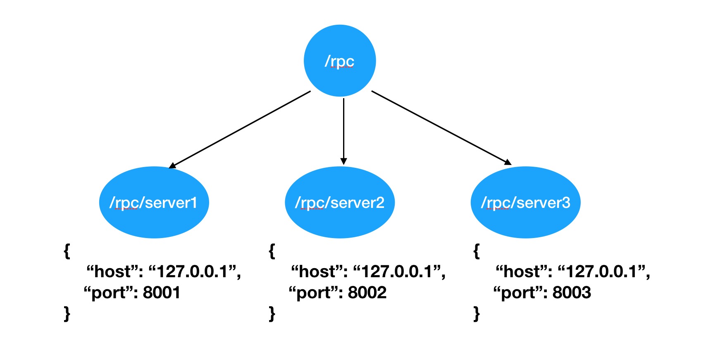

# Zookeeper
## 概述

- 简介

**ZooKeeper是一种分布式协调服务**，用于管理大型主机。在分布式环境中协调和管理服务是一个复杂的过程。

ZooKeeper通过其简单的架构和API解决了这个问题。ZooKeeper允许开发人员专注于核心应用程序逻辑，而不必担心应用程序的分布式特性。

ZooKeeper框架最初是在“Yahoo!"上构建的，用于以简单而稳健的方式访问他们的应用程序。 后来，Apache ZooKeeper成为Hadoop，HBase和其他分布式框架使用的有组织服务的标准。 例如，Apache HBase使用ZooKeeper跟踪分布式数据的状态。

- 概念

**层次命名空间**

下图描述了用于内存表示的ZooKeeper文件系统的树结构（ZooKeeper的数据保存形式）。ZooKeeper节点称为 **znode** 。每个znode由一个名称标识，并用路径(/)序列分隔。

**每个znode最多可存储1MB的数据**。



**Znode的类型**

Znode被分为持久（persistent）节点，顺序（sequential）节点和临时（ephemeral）节点。

**持久节点** - 即使在创建该特定znode的客户端断开连接后，持久节点仍然存在。默认情况下，除非另有说明，否则所有znode都是持久的。

**临时节点** - 客户端活跃时，临时节点就是有效的。当客户端与ZooKeeper集合断开连接时，临时节点会自动删除。因此，只有临时节点不允许有子节点。如果临时节点被删除，则下一个合适的节点将填充其位置。临时节点在leader选举中起着重要作用。

**顺序节点** - 顺序节点可以是持久的或临时的。当一个新的znode被创建为一个顺序节点时，ZooKeeper通过将10位的序列号附加到原始名称来设置znode的路径。例如，如果将具有路径 **/myapp** 的znode创建为顺序节点，则ZooKeeper会将路径更改为 **/myapp0000000001** ，并将下一个序列号设置为0000000002。如果两个顺序节点是同时创建的，那么ZooKeeper不会对每个znode使用相同的数字。顺序节点在锁定和同步中起重要作用。

**Watches（监视）**

监视是一种简单的机制，使客户端收到关于ZooKeeper集合中的更改的通知。客户端可以在读取特定znode时设置Watches。Watches会向注册的客户端发送任何znode（客户端注册表）更改的通知。

Znode更改是与znode相关的数据的修改或znode的子项中的更改。只触发一次watches。如果客户端想要再次通知，则必须通过另一个读取操作来完成。当连接会话过期时，客户端将与服务器断开连接，相关的watches也将被删除。

## 安装配置

在安装ZooKeeper之前，请确保你的系统是在以下任一操作系统上运行：
```
任意Linux OS - 支持开发和部署。适合演示应用程序。
Windows OS - 仅支持开发。
Mac OS - 仅支持开发。
```
### 安装

ZooKeeper服务器是用Java创建的，它在JVM上运行。你需要使用JDK 6或更高版本。

- Java

```python
# 1.验证系统中java版本
java -version
# 2.若没有或版本过低，则去java官网下载jdk
# 3.提取文件
cd /path/to/download/
tar -zxvf jdk-8u181-linux-x64.gz
# 4.移动到/usr/local/jdk目录
sudo mkdir /usr/local/jdk
sudo mv jdk1.8.0_181 /usr/local/jdk
# 5.设置终端启动快捷路径
vim ~/.bashrc
export JAVA_HOME=/usr/local/jdk/jdk1.8.0_181
export PATH=$PATH:$JAVA_HOME/bin
 
source ~/.bashrc
# 6.验证是否ok
java -version
```

- zookeeper

```python
# 1.下载Zookeeper
访问以下链接并下载最新版本：http://zookeeper.apache.org/releases.html
# 2.提取tar文件
cd /path/to/download/
tar -zxvf zookeeper-3.4.12.tar.gz
cd zookeeper-3.4.12
mkdir data
# 3.创建配置文件
vi conf/zoo.cfg

tickTime = 2000
dataDir = /path/to/zookeeper/data
clientPort = 2181
```

### 使用

启动与停止zookeeper

```python
# 启动zookeeper服务器
bin/zkServer.sh start
# 启动CLI
bin/zkCli.sh

# 停止zookeeper服务器
bin/zkServer.sh stop
```

## python交互

kazoo是Python连接操作ZooKeeper的客户端库。我们可以通过kazoo来使用ZooKeeper。

- 安装

```
pip install kazoo
```

- 使用

连接zookeepe

```python
from kazoo.client import KazooClient

zk = KazooClient(hosts='127.0.0.1:2181')
# 启动连接
zk.start() 
# 停止连接
zk.stop()
```

创建节点

```python
# 创建节点路径，但不能设置节点数据值
zk.ensure_path("/my/favorite")

# 创建节点，并设置节点保存数据，ephemeral表示是否是临时节点，sequence表示是否是顺序节点
zk.create("/my/favorite/node", b"a value", ephemeral=True, sequence=True)
```

读取节点

```python
# 获取子节点列表
children = zk.get_children("/my/favorite")

# 获取节点数据data 和节点状态stat
data, stat = zk.get("/my/favorite")
```

设置监视

```python
def my_func(event):
    # 检查最新的节点数据
    pass

# 当子节点发生变化的时候，调用my_func
children = zk.get_children("/my/favorite/node", watch=my_func)
```

## 