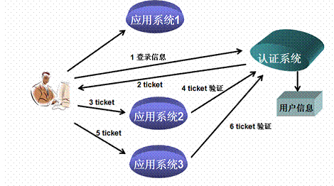
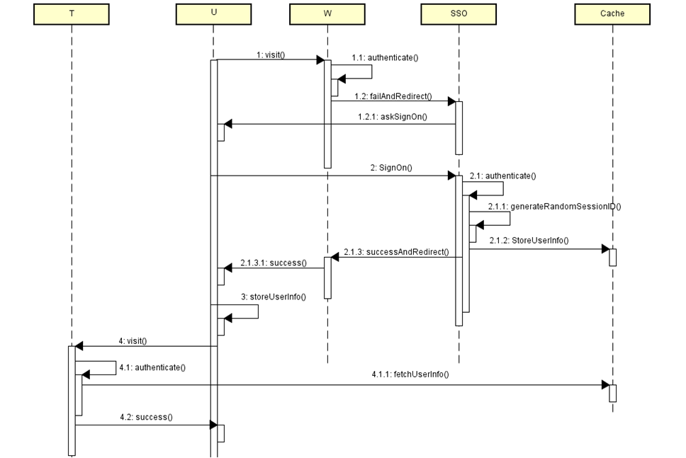
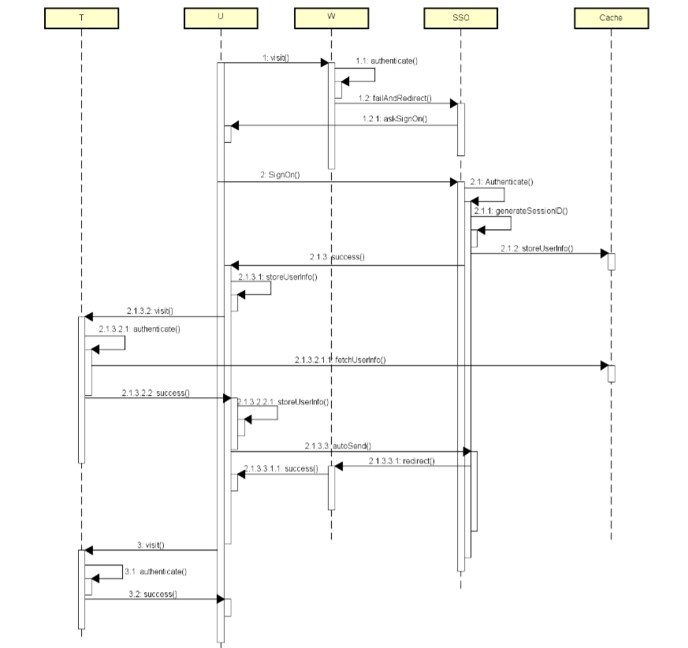
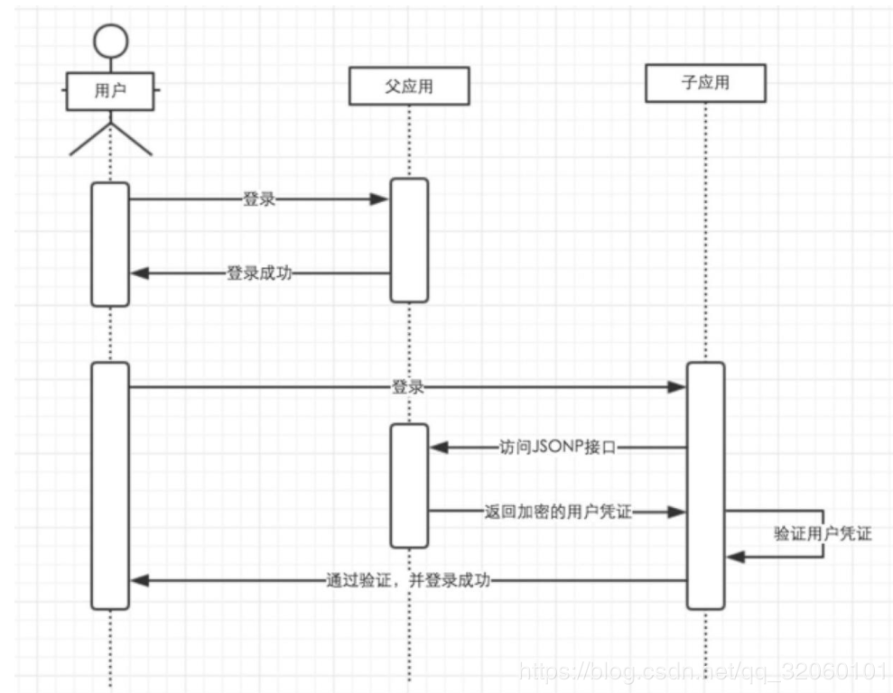
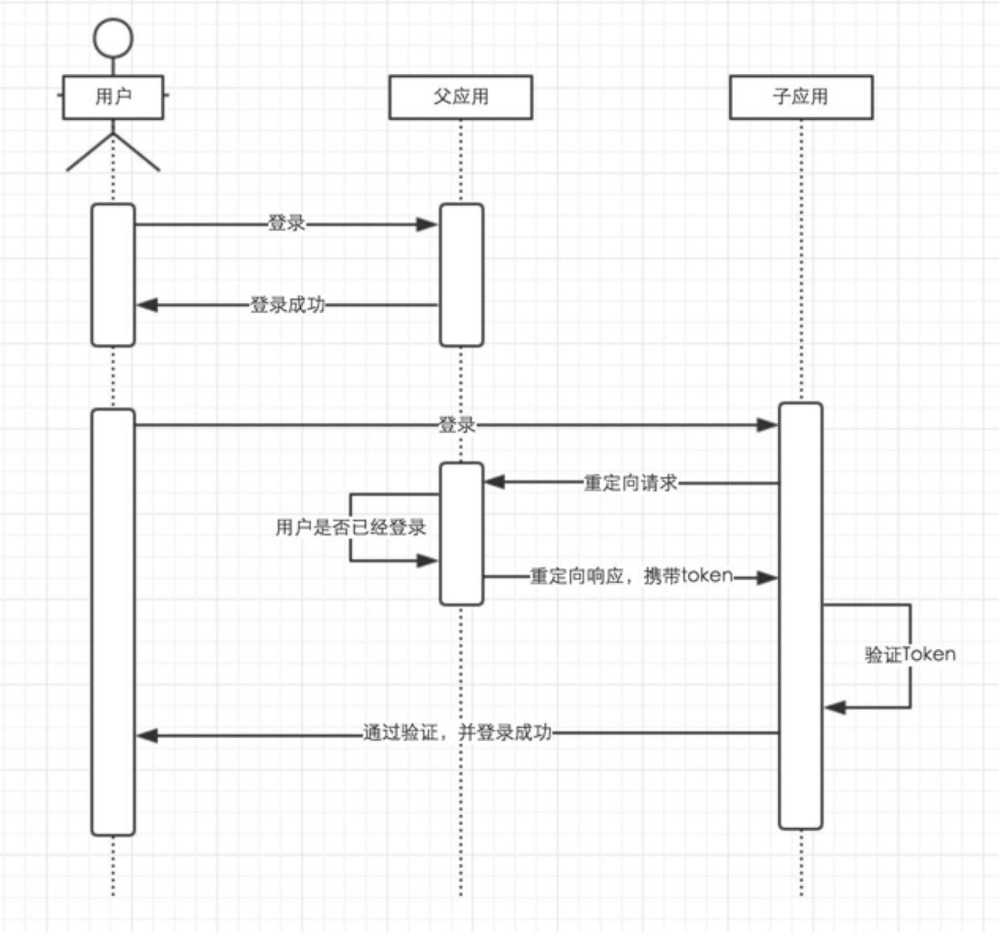
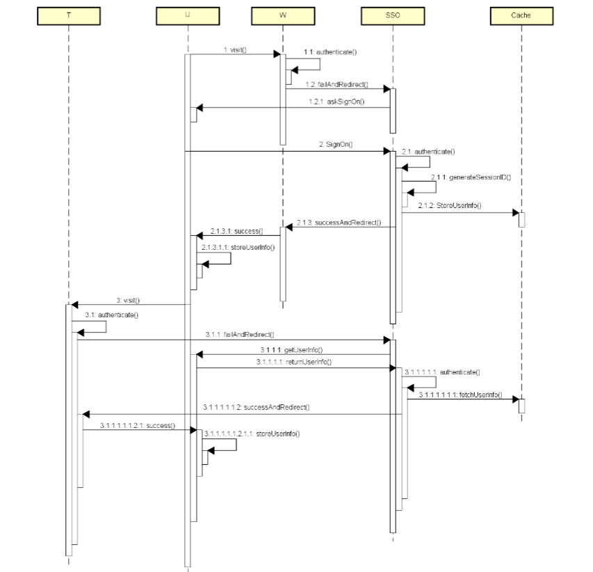

# 单点登录

## 原理概述

单点登录（Single Sign On，SSO）常用于多服务器共存的大型网站，即一次用户认证，即可访问旗下所有网站。一次用户退出，即不能访问所有的网站。

- 选型

多个系统同步各自登录认证

```
由于需要维护多个登录信息，且需时时同步，存在维护麻烦、同步信息消耗性能问题
```

多个系统共用一个登录认证

```
易维护
```

- 访问过程



当用户第一次访问应用系统1的时候，因为还没有登录，会被引导到认证系统中进行登录；根据用户提供的登录信息，认证系统进行身份效验，如果通过效验，应该返回给用户一个认证的凭据－－ticket；用户再访问别的应用的时候，就会将这个ticket带上，作为自己认证的凭据，应用系统接受到请求之后会把ticket送到认证系统进行效验，检查ticket的合法性（4,6）。如果通过效验，用户就可以在不用再次登录的情况下访问应用系统2和应用系统3了。

- 技术点：

> 所有应用系统共享一个身份认证系统

统一的认证系统是SSO的前提之一。认证系统的主要功能是将用户的登录信息和用户信息库相比较，对用户进行登录认证；认证成功后，认证系统应该生成统一的认证标志（ticket），返还给用户。另外，认证系统还应该对ticket进行效验，判断其有效性。

> 所有应用系统能够识别和提取ticket信息

要实现SSO的功能，让用户只登录一次，就必须让应用系统能够识别已经登录过的用户。应用系统应该能对ticket进行识别和提取，通过与认证系统的通讯，能自动判断当前用户是否登录过，从而完成单点登录的功能。

- 特点

优点

```
- 提高用户的效率
用户不用多次登录
- 提高开发人员的效率
SSO 为开发人员提供了一个通用的身份验证框架。实际上，如果 SSO 机制是独立的，那么开发人员就完全不需要为身份验证操心。他们可以假设，只要对应用程序的请求附带一个用户名，身份验证就已经完成了
- 简化管理
管理用户帐号的负担就会减轻。简化的程度取决于应用程序，因为 SSO 只处理身份验证。所以，应用程序可能仍然需要设置用户的属性（比如访问特权）。
```

缺点

```
- 不利于重构
因为涉及到的系统很多，要重构必须要兼容所有的系统，可能很耗时
- 无人看守桌面
因为只需要登录一次，所有的授权的应用系统都可以访问，可能导致一些很重要的信息泄露。
```

## 实现方案

[参考1](https://www.cnblogs.com/niceyoo/p/11305143.html) [参考2](https://www.cnblogs.com/huqingan/p/12010546.html) [参考3](https://ken.io/note/sso-design-implement) [参考4](https://www.cnblogs.com/EzrealLiu/p/5559255.html)

### 共享Cookie

假设有W ( `www.weidai.com`)和 T( `trade.weidai.com` ) 两个系统，W和T 都通过S (`login.weidai.com`) 系统登录，当由U访问W再转向S 完成登录后，怎样做才能使 U 访问T 时不需要再一次通过 S 进行登录验证？

一个常见的做法是**共享Cookie**，即把用户信息（ 本文也会称之为UserInfo ）保存在cookie当中，因为 无论W 、T 或者 S 它们的Domain是一样的，W 、T 以及 S 可以共享此路径下的 cookie。

为提高安全性，cookie中 最好保存一个公共Session ID（ 请和WEB 自己生成的Seesion ID进行区分 ） ，而我们的公共缓存 Cache 中保存的 UserInfo 是一个由 **公共Session ID为Key** ，**以包含用户标识和口令的数据结构为Value的Map**



访问步骤
```
1. U访问W ，W进行验证，验证失败，跳转至SSO，要求U登录；

2. U通过SSO登录，SSO进行验证，成功并生成SessionID，随后将UserInfo（ SessionID、ID和口令）存储到公共缓存C中，跳转至W（携带SessionID），并允许U访问W；

3. U保存UserInfo(SessionID)至cookie（这里请将 U 看成一个浏览器，当下文有提到 U 保存XXX至Cookie时，读者请自行切换

4. U 再访问T(并携带在3中保存至cookie中的 UserInfo) ，T从公共缓存中拉取UserInfo 进行验证，成功则允许访问；
```
### 代理认证

当网址顶级域名不同时，采用同源共享Cookie的方法是无法做到免登的。

用户登录验证结束后，采用前端或后端请求其他关联网站，则生成关联网站对应的认证信息。

这种方式，需要维护一份相关网站列表。



访问步骤

```
1.U第一次访问W，W验证失败，跳转至SSO要求U进行登录验证；

2.登录并使各不同Domain下：
a.U给SSO发送登录请求，SSO验证成功，生成SessionID 并保存UserInfo；
b.返回给U的Response 将 UserInfo 存放至cookie中，Domain为SD；
c.将2中 cookie 内容作为query parameter 重定向至T，T验证后成功返回给U，也在Response 中设置 cookie；Domain为TD；
d.U自动访问SSO，SSO将请求重定向至W，完成U对W 的访问；

3.U再访问 T，验证成功并允许U进行访问；
```

- JSONP

对于跨域问题，可以使用JSONP实现。用户在父应用中登录后，跟Session匹配的Cookie会存到客户端中，当用户需要登录子应用的时候，授权应用访问父应用提供的JSONP接口，并在请求中带上父应用域名下的Cookie，父应用接收到请求，验证用户的登录状态，返回加密的信息，子应用通过解析返回来的加密信息来验证用户，如果通过验证则登录用户。

这种方式虽然能解决跨域问题，但是安全性其实跟把信任存储到Cookie是差不多的。如果一旦加密算法泄露了，攻击者可以在本地建立一个实现了登录接口的假冒父应用，通过绑定Host来把子应用发起的请求指向本地的假冒父应用，并作出回应。因为攻击者完全可以按照加密算法来伪造响应请求，子应用接收到这个响应之后一样可以通过验证，并且登录特定用户。



- 页面重定向

通过父应用和子应用来回重定向中进行通信，实现信息的安全传递。 
父应用提供一个GET方式的登录接口，用户通过子应用重定向连接的方式访问这个接口，如果用户还没有登录，则返回一个的登录页面，用户输入账号密码进行登录。如果用户已经登录了，则生成加密的Token，并且重定向到子应用提供的验证Token的接口，通过解密和校验之后，子应用登录当前用户。



### 分步认证

代理认证，在维护的页面列表比较少时还可以使用，当数据较多时，则较难维护，需要采用分步认证。

用户登录后，当第一次访问跨域系统W 时，跳到SSO复制一份至W的cookie中，过程结束；当访问T时，重复该处理动作。



访问步骤

```
1.用户U访问W ，W进行验证，验证失败，跳转至SSO，要求U登录；

2.U通过SSO登录，SSO进行验证，成功并生成SessionID，随后将UserInfo（ SessionID、ID和口令）存储到公共缓存C 中，跳转至W（携带SessionID），并允许U访问W；U保存UserInfo （ SessionID ） 至 cookie；

3.U访问T，T 进行验证，失败跳转至SSO，SSO将触发U请求SSO将验证信息随请求一并发给SSO，经SSO验证成功跳转至Ｔ，允许U对T 的访问；使U保存UserInfo（ SessionID）至cookie；
```

> 登录


我们先假设一个未登录的用户。
```
1. 第一次请求。请求网站A的`/home`网页，网站A检测出用户未登录，于是使用HTTP重定向，引导用于至认证网的登录页面去。
2. 第二次请求。这是由浏览器自主发起的，认证网响应出登录页面。
3. 第三次请求。用户输入账号密码进行登录，服务器认证成功后，种下Cookie，并重定向至网站的A的`/home`页面，但是带上了`token`。接收此次响应后，浏览器已有了认证网的Cookie，所以用户在认证网处于登录状态。
4. 第四次请求。浏览器自主发起的，网站A必须识别出`token`参数，并保存起来。在响应中，种下网站A的Cookie。此时用户在网站A也处于登录状态。
5.我们假设这个已经认证过的用户，去访问网站B。
6.在引导用户至认证网的登录页面时，因为用户在认证网处于登录状态，所以认证网直接重定向到网站B的`/profile`页面。
```

> 注销


sso认证中心一直监听全局会话的状态，一旦全局会话销毁，监听器将通知所有注册系统执行注销操作
```
1. 用户向系统1发起注销请求
2. 系统1根据用户与系统1建立的会话id拿到令牌，向sso认证中心发起注销请求
3. sso认证中心校验令牌有效，销毁全局会话，同时取出所有用此令牌注册的系统地址
4. sso认证中心向所有注册系统发起注销请求
5. 各注册系统接收sso认证中心的注销请求，销毁局部会话
6. sso认证中心引导用户至登录页面
```
## 验证方式

### Token

基于Token的认证方式需要注意的是，不同服务器必须使用**同一个缓存系统**。可以单独起一个服务器用作数据存储。这样一来，系统都可以根据`token`从缓存系统中解析出`用户实例`。

### OAuth

使用OAuth协议也可以实现单点登录功能，它就是API版本的单点登录。

### JWT

因为用户的状态已经被传送到了客户端，所以可以直接解析。

## 完整实现

[参考](https://www.cnblogs.com/lyzg/p/6132801.html)

### 方案介绍

本文主要是通过时序图的方式来介绍JWT SSO的实现原理，具体的技术实现暂时还没有，不过当你理解了这个方案的原理后，你会觉得最终的实现并不会特别复杂，你可以用任意的平台语言来实现它。下面的时序图，模拟了三个服务，分别是CAS、系统A、系统B，它们分别部署在cas.com，systemA.com和systemB.com；CAS这个服务用来管理SSO的会话；系统A和系统B代表着实际的业务系统。我从五个场景分别来说明这个SSO方案的实现细节。下面先来看第一个。

**场景一：用户发起对业务系统的第一次访问，假设他第一次访问的是系统A的some/page这个页面，它最终成功访问到这个页面的过程是：**

[](http://images2015.cnblogs.com/blog/459873/201612/459873-20161205095409866-1730460249.png)

**在这个过程里面，我认为理解的关键点在于：**

\1. 它用到了两个cookie(jwt和sid)和三次重定向来完成会话的创建和会话的传递；

\1. jwt的cookie是写在systemA.com这个域下的，所以每次重定向到systemA.com的时候，jwt这个cookie只要有就会带过去；

\2. sid的cookie是写在cas.com这个域下的，所以每次重定向到cas.com的时候，sid这个cookie只要有就会带过去；

\3. 在验证jwt的时候，如何知道当前用户已经创建了sso的会话？因为jwt的payload里面存储了之前创建的sso 会话的session id，所以当cas拿到jwt，就相当于拿到了session id，然后用这个session id去判断有没有的对应的session对象即可。

还要注意的是：CAS服务里面的session属于服务端创建的对象，所以要考虑session id唯一性以及session共享（假如CAS采用集群部署的话）的问题。session id的唯一性可以通过用户名密码加随机数然后用hash算法如md5简单处理；session共享，可以用memcached或者redis这种专门的支持集群部署的缓存服务器管理session来处理。

由于服务端session具有生命周期的特点，到期需自动销毁，所以不要自己去写session的管理，免得引发其它问题，到github里找开源的缓存管理中间件来处理即可。存储session对象的时候，只要用session id作为key，session对象本身作为value，存入缓存即可。session对象里面除了session id，还可以存放登录之后获取的用户信息等业务数据，方便业务系统调用的时候，从session里面返回会话数据。

**场景二：用户登录之后，继续访问系统A的其它页面，如some/page2，它的处理过程是：**

[](http://images2015.cnblogs.com/blog/459873/201612/459873-20161205095410976-351334861.png)

从这一步可以看出，即使登录之后，也要每次跟CAS校验jwt的有效性以及会话的有效性，其实jwt的有效性也可以放在业务系统里面处理的，但是会话的有效性就必须到CAS那边才能完成了。当CAS拿到jwt里面的session id之后，就能到session 缓存服务器里面去验证该session id对应的session对象是否存在，不存在，就说明会话已经销毁了（退出）。

**场景三：用户登录了系统A之后，再去访问其他系统如系统B的资源，比如系统B的some/page，它最终能访问到系统B的some/page的流程是：**

[](http://images2015.cnblogs.com/blog/459873/201612/459873-20161205095411929-1115573953.png)

这个过程的关键在于第一次重定向的时候，它会把sid这个cookie带回给CAS服务器，所以CAS服务器能够判断出会话是否已经建立，如果已经建立就跳过登录页的逻辑。

**场景四：用户继续访问系统B的其它资源，如系统B的some/page2：**

[](http://images2015.cnblogs.com/blog/459873/201612/459873-20161205095413069-1717587714.png)

这个场景的逻辑跟场景二完全一致。

**场景五：退出登录，假如它从系统B发起退出，最终的流程是：**

[](http://images2015.cnblogs.com/blog/459873/201612/459873-20161205124912241-1697231898.png)

最重要的是要清除sid的cookie，jwt的cookie可能业务系统都有创建，所以不可能在退出的时候还挨个去清除那些系统的cookie，只要sid一清除，那么即使那些jwt的cookie在下次访问的时候还会被传递到业务系统的服务端，由于jwt里面的sid已经无效，所以最后还是会被重定向到CAS登录页进行处理。

### 方案总结

**以上方案两个关键的前提：**

\1. 整个会话管理其实还是基于服务端的session来做的，只不过这个session只存在于CAS服务里面；

\2. CAS之所以信任业务系统的jwt，是因为这个jwt是CAS签发的，理论上只要认证通过，就可以认为这个jwt是合法的。

jwt本身是不可伪造，不可篡改的，但是不代表非法用户冒充正常用法发起请求，所以常规的几个安全策略在实际项目中都应该使用：

\1. 使用https

\2. 使用http-only的cookie，针对sid和jwt

\3. 管理好密钥

\4. 防范CSRF攻击。

尤其是CSRF攻击形式，很多都是钻代码的漏洞发生的，所以一旦出现CSRF漏洞，并且被人利用，那么别人就能用获得的jwt，冒充正常用户访问所有业务系统，这个安全问题的后果还是很严重的。考虑到这一点，为了在即使有漏洞的情况将损害减至最小，可以在jwt里面加入一个系统标识，添加一个验证，只有传过来的jwt内的系统标识与发起jwt验证请求的服务一致的情况下，才允许验证通过。这样的话，一个非法用户拿到某个系统的jwt，就不能用来访问其它业务系统了。

在业务系统跟CAS发起attach/validate请求的时候，也可以在CAS端做些处理，因为这个请求，在一次SSO过程中，一个系统只应该发一次，所以只要之前已经给这个系统签发过jwt了，那么后续 同一系统的attach/validate请求都可以忽略掉。

**总的来说，这个方案的好处有：**

\1. 完全分布式，跨平台，CAS以及业务系统均可采用不同的语言来开发；

\2. 业务系统如系统A和系统B，可实现服务端无状态

\3. 假如是自己来实现，那么可以轻易的在CAS里面集成用户注册服务以及第三方登录服务，如微信登录等。

**它的缺陷是：**

\1. 第一次登录某个系统，需要三次重定向（不过可以优化成两次）；

\2. 登录后的后续请求，每次都需要跟CAS进行会话验证，所以CAS的性能负载会比较大

\3. 登陆后的后续请求，每次都跟CAS交互，也会增加请求响应时间，影响用户体验。

### **本文小结**

本文从理论层面介绍了结合jwt来实现SSO的方案原理，希望它能帮助一些朋友更好的理解SSO以及它的实现方法。本文方案参考自CAS的实现流程，你可以从下面这个资料了解CAS的单点登录实现过程：

https://apereo.github.io/cas/4.1.x/protocol/CAS-Protocol.html

它的流程跟我这个差别不是特别大，但是从清晰层面来说，我写的还是要更明了一些，所以对比起来阅读，可能理解会更透彻些。

**另外，这个方案考虑地不一定很全面，所以要是您发现了其中的问题，还请您帮忙指正，非常感谢：）**