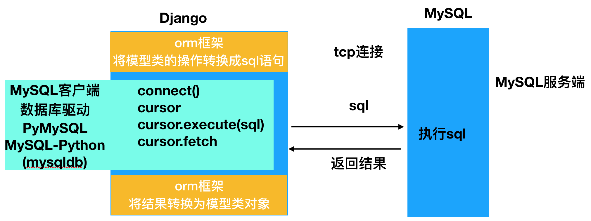

# 概述

## 作用

- 省去自己拼写SQL，保证SQL语法的正确性

- 一次编写可以适配多个数据库

- 防止注入攻击

- **在数据库表名或字段名发生变化时，只需修改模型类的映射，无需修改数据库操作的代码**

    (相比SQL的话，可能需要同步修改涉及到的每一个SQL语句)

## 使用方式

- 先创建模型类，再迁移到数据库中

优点：简单快捷，定义一次模型类即可，不用写sql

缺点：不能尽善尽美的控制创建表的所有细节问题，表结构发生变化的时候，也会难免发生迁移错误

- 先用原生SQL创建数据库表，再编写模型类作映射

优点：可以很好的控制数据库表结构的任何细节，避免发生迁移错误

缺点：可能编写工作多（编写sql与模型类，似乎有些牵强）