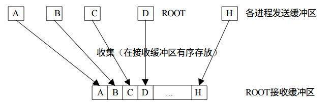

# MPI

[参考](https://www.jianshu.com/p/ee595dd0354a)

## 概述

- MPI

MPI 的全称是 Message Passing Interface，即消息传递接口。它是一种用于编写并行程序的标准，包括协议和和语义说明，他们指明其如何在各种实现中发挥其特性，有 MPICH、OpenMPI 等一些具体的实现，提供 Fortran、C、C++ 的相应编程接口。MPI 的目标是高性能，大规模性，和可移植性。MPI 在今天仍为高性能计算的主要模型。

MPI 的工作方式很好理解，我们可以同时启动一组进程，在同一个通信域中不同的进程都有不同的编号，程序员可以利用 MPI 提供的接口来给不同编号的进程分配不同的任务和帮助进程相互交流最终完成同一个任务。就好比包工头给工人们编上了工号然后指定一个方案来给不同编号的工人分配任务并让工人相互沟通完成任务。

MPI 的具体实现并没有提供 Python 的编程接口，这就使得我们没法直接地使用 Python 调用 MPI 实现高性能的计算，不过幸运的是，我们有 mpi4py。mpi4py 是一个构建在 MPI 之上的 Python 库，主要使用 Cython 编写，它以一种面向对象的方式提供了在 Python 环境下调用 MPI 标准的编程接口，这些接口是构建在 MPI-2 C++ 编程接口的基础之上的，因此和 C++ 的 MPI 编程接口非常类似，了解和有 C、C++ MPI 编程经验的人很容易地上手和使用 mpi4py 编写基于 MPI 的高性能并行计算程序。

- mpi4py

mpi4py 是一个构建在 MPI 之上的 Python 库，它使得 Python 的数据结构可以方便的在多进程中传递。

mpi4py 是一个很强大的库，它实现了很多 MPI 标准中的接口，包括点对点通信，集合通信、阻塞／非阻塞通信、组间通信等，基本上能用到的 MPI 接口都有相应的实现。不仅是任何可以被 pickle 的 Python 对象，mpi4py 对具有单段缓冲区接口的 Python 对象如 numpy 数组及内置的 bytes/string/array 等也有很好的支持并且传递效率很高。同时它还提供了 SWIG 和 F2PY 的接口能够将 C/C++ 或者 Fortran 程序在封装成 Python 后仍然能够使用 mpi4py 的对象和接口来进行并行处理。

- 信息传递

mpi4py 可以在不同的进程间传递任何可以被 pickle 系列化的内置和用户自定义 Python 对象，这些对象一般在发送阶段被 pickle 系列化为 ASCII 或二进制格式，然后在接收阶段恢复成对应的 Python 对象。

这种数据传递方式虽然简单通用，却并不高效，特别是在传递大量的数据时。对类似于数组这样的数据，准确来说是具有单段缓冲区接口（single-segment buffer interface）的 Python 对象，如 numpy 数组及内置的 bytes/string/array 等，可以用一种更为高效的方式直接进行传递，而不需要经过 pickle 系列化和恢复。

按照 mpi4py 的惯例，传递可以被 pickle 系列化的通用 Python 对象，可以使用通信子（Comm 类，后面会介绍）对象的以小写字母开头的方法，如 send()，recv()，bcast()，scatter()，gather() 等。但是如果要以更高效的方式传递具有单段缓冲区接口的 Python 对象，如 numpy 数组，则只能使用通信子对象的以大写字母开头的方法，如 Send()，Recv()，Bcast()，Scatter()，Gather() 等。

- MPI环境管理

mpi4py 提供了相应的接口 MPI.Init()，MPI.Init_thread() 和 MPI.Finalize() 来初始化和结束 MPI 环境。但是 mpi4py 通过在 **init**.py 中写入了初始化的操作，因此在我们 from mpi4py import MPI 的时候就已经自动初始化了 MPI 环境。

MPI_Finalize() 被注册到了 Python 的 C 接口 Py_AtExit()，这样在 Python 进程结束时候就会自动调用 MPI_Finalize()， 因此不再需要我们显式的去调用。

- 通信子(Communicator)

mpi4py 提供了相应的通信子的 Python 类，其中 MPI.Comm 是通信子的基类，在它下面继承了 MPI.Intracomm 和 MPI.Intercomm 两个子类，这跟 MPI 的 C++ 实现中是相同的。下图是通信子类的继承关系。

```
comm ---> intercomm
	 ---> intracomm ---> cartomm
	 				---> Distgraphcomm
	 				---> Graphcomm
```

同时它也提供了两个预定义的通信子对象：

```
- 包含所有进程的 MPI.COMM_WORLD；
- 只包含调用进程本身的 MPI.COMM_SELF。
```

可以由它们创建其它新的通信子。

可以通过通信子所定义的一些方法获取当前进程号、获取通信域内的进程数、获取进程组、对进程组进行集合运算、分割合并等等。

## 通信

### 点到点通信

点到点通信是消息传递系统最基本的功能，mpi4py 的点到点通信使得数据可以在一对进程之间互相传递，一端发送，一端接收。

mpi4py 中提供了一系列发送和接收函数用以在进程间传递带有 tag 的类型数据。数据的类型信息允许传递的数据在不同的计算机架构下进行相应的转换，同时也使得不经过 pickle 而高效地传递不连续的数据和用户自定义的数据变得可能。tag 使得接收端可以有选择性地进行消息的接收。


mpi4py 中的点到点通信包括阻塞、非阻塞和持续通信。下面分别对其做简要的介绍

- 阻塞通信


mpi4py 中最基本的发送和接收函数是阻塞式的，这些函数会阻塞程序的执行直到参与通信的数据缓冲区可以安全地被其它程序重用。MPI.Comm.Send()， MPI.Comm.Recv()，MPI.Comm.Sendrecv() 及其对应的 MPI.Comm.send()，MPI.Comm.recv()，MPI.Comm.sendrecv() 提供对阻塞通信的支持。

- 非阻塞通信

所有的阻塞通信函数都提供了一个对应的非阻塞的版本，这些非阻塞通信函数允许计算和通信的同时执行，这在一些情况下可以极大地提高计算性能。mpi4py 中的 MPI.Comm.Isend() 和 MPI.Comm.Irecv() 会分别初始化一个发送和接收操作，然后立即返回一个 MPI.Request 实例，在程序某个合适的地方可以调用 MPI.Request.Test()，MPI.Request.Wait() 和MPI.Request.Cancel() 来测试、等待或者取消本次通信。

阻塞通信与非阻塞通信的对比


非阻塞通信的消息发送和接收


- 持续通信

在某些情况下可能需要持续不断地发送和接收一些数据，这时可以用持续通信的方法来提高通信效率。持续通信是一种特殊的非阻塞通信，它能够有效地减小进程和通信控制之间的相应开销。在 mpi4py 中可以用 MPI.Comm.Send_init() 和 MPI.Comm.Recv_init() 来创建一个持续发送和接收的操作请求，它们会返回一个 MPI.Prequest 类的实例，然后可以用 MPI.Prequest.Start() 方法发起实际的通信操作。

### 集合通信

集合通信允许在一个通信组内的多个进程之间同时传递数据，集合通信的语法和语意与点到点通信是一致的，不过集合通信只有阻塞版本。

经常用到的集合通信操作有以下这些：

```
- 障同步（Barrier synchronization）操作；
- 全局通信，包括广播（Broadcast），收集（Gather）和发散（Scatter）；
- 全局规约，包括求和，最大，最小等。
```

MPI 组通信和点到点通信的一个重要区别就是，在某个进程组内所有的进程同时参加通信，mpi4py 提供了方便的接口让我们完成 Python 中的组内集合通信，方便编程同时提高程序的可读性和可移植性。

- 广播(Broadcast)

广播操作是典型的一对多通信，将根进程的数据复制到同组内其他所有进程中


- 发散(Scatter)

与广播不同，发散可以向不同的进程发送不同的数据，而不是完全复制


- 收集(Gather)

收集过程是发散过程的逆过程，每个进程将发送缓冲区的消息发送给根进程，根进程根据发送进程的进程号将各自的消息存放到自己的消息缓冲区中。



### 动态进程管理

在 MPI-1 规范中，一个 MPI 应用程序是静态的。一旦一个 MPI 程序运行起来后，就既不能增加也不能删除进程。MPI-2 规范没有了这些限制，它增加了一个进程管理模型，可以实现动态的进程管理，使得我们可以在 MPI 程序运行过程中创建新的进程或者与其它运行中的 MPI 程序建立通信连接。

在 mpi4py 中，可以调用 MPI.Intracomm.Spawn() 方法在一个组内通信子内创建一个新的独立的通信组，它会返回一个组间通信子（一个 MPI.Intercomm 类实例）。这个新创建的通信子（称作子通信子）可以通过调用 MPI.Comm.Get_parent() 来获得创建它的通信子，并与其进行组间的点到点或集合通信。

### 单边通信

单边通信，也称作远程内存访问（Remote Memory Access, RMA），这是对传统的双边，基于发送／接收（send/receive）的 MPI 通信模型的一个补充，单边通信是一种基于单边的推送／获取（put/get）MPI 通信模型。

在 mpi4py 中，可以通过 MPI.Win 类的实例实现单边通信。在一个通信子内调用MPI.Win.Create() 就可以创建一个 window 对象，这个 window 对象中包含着一个进程可被用于远程读写的内存缓冲区。调用 MPI.Win.Free() 可以释放掉一个不再需要的 window 对象。MPI.Win.Put()， MPI.Win.Get() 和 MPI.Win.Accumulate() 可以分别实现单边的远程读、写和规约操作。

### 并行I/O

MPI 支持并行 I/O 操作。在 mpi4py 中所有的 MPI 并行操作都是通过 MPI.File 类实例完成的。所有 MPI-2 中定义的30个用作并行 I/O 操作的方法在 mpi4py 中都有对应的实现。

## 安装

- 安装依赖

要正确地安装和使用 mpi4py，你需要先安装和设置好以下软件：

```
1.一个 MPI 实现软件，最好能支持 MPI-3 标准，并且最好是动态编译的。比较常用的 MPI 实现软件有 OpenMPI，MPICH 等。

2.Python 2.7，Python 3.3+。要写 Python 的并行程序，Python 自然是必不可少的。
```

- 安装mpi4py

查看mpicc执行路径

```
which mpicc
```

如果该命令输出对应的 **mpicc** 执行路径，你就可以进行下面的安装步骤了

如果没有输出，你需要把安装的 MPI 软件的 bin 目录添加到 **PATH** 环境变量，lib 目录添加到 **LD_LIBRARY_PATH** 环境变量，以使 **mpicc** 可以被搜索到。

- pip安装

使用 pip 安装 mpi4py 非常简单，如果你有 root 权限，直接在终端中输入下面的命令就行了：

```
$ pip install mpi4py
```
如果没有 root 权限，你可以安装 mpi4py 到自己的 $HOME 目录下，这样只能供你自己使用：

```
$ pip install mpi4py --user
```
保证安装的可执行文件路径 ~/.local/bin 添加到了 **PATH** 环境变量中，库文件路径 ~/.local/lib 添加到了 **LD_LIBRARY_PATH** 环境变量中。

- 源码安装

丛 [https://pypi.python.org/pypi/mpi4py](https://link.jianshu.com?t=https%3A%2F%2Fpypi.python.org%2Fpypi%2Fmpi4py) 上下载 mpi4py 安装包，然后解压安装包：

```
$ tar -xvzf mpi4py-X.Y.Z.tar.gz
$ cd mpi4py-X.Y.Z
```

编译安装包：

```
$ python setup.py build
```

编译完成后就可以安装了：

```
$ python setup.py install
```

或者

```
$ python setup.py install --user
```

### 测试 

现在可以写一段简单的程序来测试 mpi4py 是否安装好及能否正常使用：

```python
# mpi_helloworld.py

from mpi4py import MPI


comm = MPI.COMM_WORLD  # 通信器，定义了自己一套可互相通信的进程
size = comm.Get_size()
rank = comm.Get_rank()  # 函数返回调用它的那个进程的等级
node_name = MPI.Get_processor_name() # get the name of the node

print 'Hello world from process %d at %s.' % (rank, node_name)
```

### 运行

用下面的命令运行一个 Python 写的 MPI 程序：

```
$ mpiexec -n 3 python mpi_helloworld.py
Hello world from process 2 at node1.
Hello world from process 0 at node1.
Hello world from process 1 at node1.
```

也可以用一种较老的方式：

```
$ mpirun -np 3 python mpi_helloworld.py
Hello world from process 2 at node1.
Hello world from process 0 at node1.
Hello world from process 1 at node1.
```

其中 -n 或者 -np 指定使用多少个 MPI 进程来执行这个程序。

上面的命令会在单个节点（单台机器）上发起3个 MPI 进程来并行执行 `mpi_helloworld.py`，如果要在多个节点（多台机器）上并行执行程序，可以用下面的命令：

```
$ mpiexec -n 3 -host node1,node2,node3 python mpi_helloworld.py
Hello world from process 1 at node2.
Hello world from process 2 at node3.
Hello world from process 0 at node1.
```

其中 -host （或者 -H）后面指定所要使用的节点，这些节点以逗号分隔。如果节点很多也可以用选项 -hostfile 或者 -machinefile 指定一个文件，在这个文件中写入你需要使用的计算节点。更多的运行选项可以通过下面的命令获得：

```
$ mpiexec --help
```

## 实现

### 快速实现

#### 点对点

- 传递通用的python对象(阻塞方式)

这种方式非常简单易用，适用于任何可被 pickle 系列化的 Python 对象，但是在发送和接收端的 pickle 和 unpickle 操作却并不高效，特别是在传递大量的数据时。另外阻塞式的通信在消息传递时会阻塞进程的执行。

```python
# p2p_blocking.py

from mpi4py import MPI


comm = MPI.COMM_WORLD
rank = comm.Get_rank()

if rank == 0:
    data = {'a': 7, 'b': 3.14}
    print 'process %d sends %s' % (rank, data)
    comm.send(data, dest=1, tag=11)
elif rank == 1:
    data = comm.recv(source=0, tag=11)
    print 'process %d receives %s' % (rank, data)
```

运行结果如下：

```
$ mpiexec -n 2 python p2p_blocking.py
process 0 sends {'a': 7, 'b': 3.14}
process 1 receives {'a': 7, 'b': 3.14}
```

- 传递通用的python对象(非阻塞方式)

这种方式非常简单易用，适用于任何可被 pickle 系列化的 Python 对象，但是在发送和接收端的 pickle 和 unpickle 操作却并不高效，特别是在传递大量的数据时。非阻塞式的通信可以将通信和计算进行重叠从而大大改善性能。

```python
# p2p_non_blocking.py

from mpi4py import MPI


comm = MPI.COMM_WORLD
rank = comm.Get_rank()

if rank == 0:
    data = {'a': 7, 'b': 3.14}
    print 'process %d sends %s' % (rank, data)
    req = comm.isend(data, dest=1, tag=11)
    req.wait()
elif rank == 1:
    req = comm.irecv(source=0, tag=11)
    data = req.wait()
    print 'process %d receives %s' % (rank, data)
```

运行结果如下：

```
$ mpiexec -n 2 python p2p_non_blocking.py
process 0 sends {'a': 7, 'b': 3.14}
process 1 receives {'a': 7, 'b': 3.14}
```

- 传递numpy数组(高效快速的方式)

对类似于数组这样的数据，准确来说是具有单段缓冲区接口（single-segment buffer interface）的 Python 对象，如 numpy 数组及内置的 bytes/string/array 等，可以用一种更为高效的方式直接进行传递，而不需要经过 pickle 系列化和恢复。以这种方式传递数据需要使用通信子对象的以大写字母开头的方法，如 Send()，Recv()，Bcast()，Scatter()，Gather() 等。

```python
# p2p_numpy_array.py

import numpy
from mpi4py import MPI


comm = MPI.COMM_WORLD
rank = comm.Get_rank()

# passing MPI datatypes explicitly
if rank == 0:
    data = numpy.arange(10, dtype='i')
    print 'process %d sends %s' % (rank, data)
    comm.Send([data, MPI.INT], dest=1, tag=77)
elif rank == 1:
    data = numpy.empty(10, dtype='i')
    comm.Recv([data, MPI.INT], source=0, tag=77)
    print 'process %d receives %s' % (rank, data)

# automatic MPI datatype discovery
if rank == 0:
    data = numpy.arange(10, dtype=numpy.float64)
    print 'process %d sends %s' % (rank, data)
    comm.Send(data, dest=1, tag=13)
elif rank == 1:
    data = numpy.empty(10, dtype=numpy.float64)
    comm.Recv(data, source=0, tag=13)
    print 'process %d receives %s' % (rank, data)
```

运行结果如下：

```
$ mpiexec -n 2 python p2p_numpy_array.py
process 0 sends [0 1 2 3 4 5 6 7 8 9]
process 1 receives [0 1 2 3 4 5 6 7 8 9]
process 0 sends [0. 1. 2. 3. 4. 5. 6. 7. 8. 9.]
process 1 receives [0. 1. 2. 3. 4. 5. 6. 7. 8. 9.]
```

#### 聚合通信

##### 广播(Broadcast)

广播操作将根进程的数据复制到同组内其他所有进程中

- 广播通用的 Python 对象

```python
# bcast.py

from mpi4py import MPI


comm = MPI.COMM_WORLD
rank = comm.Get_rank()

if rank == 0:
    data = {'key1' : [7, 2.72, 2+3j],
            'key2' : ( 'abc', 'xyz')}
    print 'before broadcasting: process %d has %s' % (rank, data)
else:
    data = None
    print 'before broadcasting: process %d has %s' % (rank, data)

data = comm.bcast(data, root=0)
print 'after broadcasting: process %d has %s' % (rank, data)
```

运行结果如下：

```
$ mpiexec -n 2 python bcast.py
before broadcasting: process 0 has {'key2': ('abc', 'xyz'), 'key1': [7, 2.72, (2+3j)]}
after broadcasting: process 0 has {'key2': ('abc', 'xyz'), 'key1': [7, 2.72, (2+3j)]}
before broadcasting: process 1 has None
after broadcasting: process 1 has {'key2': ('abc', 'xyz'), 'key1': [7, 2.72, (2+3j)]}
```

- 广播numpy数组

```python
# Bcast.py

import numpy as np
from mpi4py import MPI


comm = MPI.COMM_WORLD
rank = comm.Get_rank()

if rank == 0:
    data = np.arange(10, dtype='i')
    print 'before broadcasting: process %d has %s' % (rank, data)
else:
    data = np.zeros(10, dtype='i')
    print 'before broadcasting: process %d has %s' % (rank, data)

comm.Bcast(data, root=0)

print 'after broadcasting: process %d has %s' % (rank, data)
```

运行结果如下：

```
$ mpiexec -n 2 python Bcast.py
before broadcasting: process 0 has [0 1 2 3 4 5 6 7 8 9]
after broadcasting: process 0 has [0 1 2 3 4 5 6 7 8 9]
before broadcasting: process 1 has [0 0 0 0 0 0 0 0 0 0]
after broadcasting: process 1 has [0 1 2 3 4 5 6 7 8 9]
```

##### 发散(Scatter)

发散操作从组内的根进程分别向组内其它进程散发不同的消息

- 发散通用的python对象

```python
# scatter.py

from mpi4py import MPI


comm = MPI.COMM_WORLD
size = comm.Get_size()
rank = comm.Get_rank()

if rank == 0:
    data = [ (i + 1)**2 for i in range(size) ]
    print 'before scattering: process %d has %s' % (rank, data)
else:
    data = None
    print 'before scattering: process %d has %s' % (rank, data)

data = comm.scatter(data, root=0)
print 'after scattering: process %d has %s' % (rank, data)
```

运行结果如下：

```
$ mpiexec -n 3 python scatter.py
before scattering: process 0 has [1, 4, 9]
after scattering: process 0 has 1
before scattering: process 1 has None
after scattering: process 1 has 4
before scattering: process 2 has None
after scattering: process 2 has 9

```

- 发散numpy数组

```python
# Scatter.py

import numpy as np
from mpi4py import MPI


comm = MPI.COMM_WORLD
size = comm.Get_size()
rank = comm.Get_rank()

sendbuf = None
if rank == 0:
    sendbuf = np.empty([size, 10], dtype='i')
    sendbuf.T[:, :] = range(size)
print 'before scattering: process %d has %s' % (rank, sendbuf)

recvbuf = np.empty(10, dtype='i')
comm.Scatter(sendbuf, recvbuf, root=0)
print 'after scattering: process %d has %s' % (rank, recvbuf)

```

运行结果如下：

```
$ mpiexec -n 3 python Scatter.py
before scattering: process 0 has [[0 0 0 0 0 0 0 0 0 0]
[1 1 1 1 1 1 1 1 1 1]
[2 2 2 2 2 2 2 2 2 2]]
before scattering: process 1 has None
before scattering: process 2 has None
after scattering: process 0 has [0 0 0 0 0 0 0 0 0 0]
after scattering: process 2 has [2 2 2 2 2 2 2 2 2 2]
after scattering: process 1 has [1 1 1 1 1 1 1 1 1 1]
```

##### 收集(Gather)

收集操作是发散的逆操作，根进程从其它进程收集不同的消息依次放入自己的接收缓冲区内

- 收集通用的python对象

```python
# gather.py

from mpi4py import MPI


comm = MPI.COMM_WORLD
size = comm.Get_size()
rank = comm.Get_rank()

data = (rank + 1)**2
print 'before gathering: process %d has %s' % (rank, data)

data = comm.gather(data, root=0)
print 'after scattering: process %d has %s' % (rank, data)
```

运行结果如下：

```
$ mpiexec -n 3 python gather.py
before gathering: process 0 has 1
after scattering: process 0 has [1, 4, 9]
before gathering: process 1 has 4
after scattering: process 1 has None
before gathering: process 2 has 9
after scattering: process 2 has None
```

- 收集numpy数组

```python
# Gather.py

import numpy as np
from mpi4py import MPI


comm = MPI.COMM_WORLD
size = comm.Get_size()
rank = comm.Get_rank()

sendbuf = np.zeros(10, dtype='i') + rank
print 'before gathering: process %d has %s' % (rank, sendbuf)

recvbuf = None
if rank == 0:
    recvbuf = np.empty([size, 10], dtype='i')

comm.Gather(sendbuf, recvbuf, root=0)
print 'after gathering: process %d has %s' % (rank, recvbuf)
```

运行结果如下：

```
$ mpiexec -n 3 python Gather.py
before gathering: process 0 has [0 0 0 0 0 0 0 0 0 0]
after gathering: process 0 has [[0 0 0 0 0 0 0 0 0 0]
[1 1 1 1 1 1 1 1 1 1]
[2 2 2 2 2 2 2 2 2 2]]
before gathering: process 1 has [1 1 1 1 1 1 1 1 1 1]
after gathering: process 1 has None
before gathering: process 2 has [2 2 2 2 2 2 2 2 2 2]
after gathering: process 2 has None

```

#### 函数性能差异

比较一下以小写字母开头的 send()/recv() 方法与以大写字母开头的 Send()/Recv() 方法在传递 numpy 数组时的性能差异

```python
# send_recv_timing.pu

import time
import numpy as np
from mpi4py import MPI


comm = MPI.COMM_WORLD
rank = comm.Get_rank()

if rank == 0:
    data = np.random.randn(10000).astype(np.float64)
else:
    data = np.empty(10000, dtype=np.float64)

comm.barrier()

# use comm.send() and comm.recv()
t1 = time.time()
if rank == 0:
    comm.send(data, dest=1, tag=1)
else:
    comm.recv(source=0, tag=1)
t2 = time.time()
if rank == 0:
    print 'time used by send/recv: %f seconds' % (t2 - t1)

comm.barrier()

# use comm.Send() and comm.Recv()
t1 = time.time()
if rank == 0:
    comm.Send(data, dest=1, tag=2)
else:
    comm.Recv(data, source=0, tag=2)
t2 = time.time()
if rank == 0:
    print 'time used by Send/Recv: %f seconds' % (t2 - t1)
```

运行结果如下：

```
$ mpiexec -n 2 python send_recv_timing.py
time used by send/recv: 0.000412 seconds
time used by Send/Recv: 0.000091 seconds
```

可以看出在代码几乎一样的情况下，以大写字母开头的 Send()/Recv() 方法对 numpy 数组的传递效率要高的多，因此在涉及 numpy 数组的并行操作时，应尽量选择以大写字母开头的通信方法。

以上通过几个简单的例子介绍了怎么在 Python 中利用 mpi4py 进行并行编程，可以看出 mpi4py 使得在 Python 中进行 MPI 并行编程非常容易，也比在 C、C++、Fortran 中调用 MPI 的应用接口进行并行编程要方便和灵活的多，特别是 mpi4py 提供的基于 pickle 的通用 Python 对象传递机制，使我们在编程过程中完全不用考虑所传递的数据类型和数据长度。这种灵活性和易用性虽然会有一些性能上的损失，但是在传递的数据量不大的情况下，这种性能损失是可以忽略的。当需要传递大量的数组类型的数据时，mpi4py 提供的以大写字母开头的通信方法使得数据可以以接近 C、C++、Fortran 的速度在不同的进程间高效地传递。对 numpy 数组，这种高效性却并不损失或很少损失其灵活性和易用性，因为 mpi4py 可以自动推断出 numpy 数组的类型及数据长度信息，因此一般情况下不用显式的指定。这给我们利用 numpy 的数组进行高性能的并行计算编程带来莫大的方便。

### 点对点通信

#### 概述

点到点通信要求必须有 send 和 recv 配对。比如说，如果多个发送进程向同一个目标进程连续发送两个消息，这两个消息都能与接收端的同一个 recv 匹配，则接收的顺序必须与发送的顺序一致。如果接收端进程同时也发起了两个连续的 recv，都与同一个消息匹配，且第一个 recv 仍在等待的状态下，第二个 recv 不能先于第一个操作收取第二个与其匹配的消息。消息传递中的 tag 具有决定性作用，如果进程使用的是单线程，且没有在接收消息操作中使用通配符（即 MPI.ANY_SOURCE）作为 tag，则发送的顺序与接收顺序严格匹配。

点到点通信共有12对，分别对应阻塞通信方式1组（4个）和非阻塞通信方式2组（分别为非重复的非阻塞和可重复的非阻塞），其中有一些还分为以小写字母开头的方法和以大写字母开头的方法，前者适用与可以被 pickle 系列化的任何 Python 对象，而后者对数组类型的数据通信更为高效。详细的分类见下表


可以看出这些发送函数都遵循一定的命名规范：[S/s]end，其中 B/b 表示缓存模式（Buffer），R/r 表示就绪模式（Ready），S/s 表示同步方式（Synchonous），I/i 表示立即发送，即非阻塞方式发送（Imediately）。不带任何前缀修饰的 Send/send 称为标准模式。I/i 可分别与 B/b，R/r，S/s 组合，得出如上表所示的各种通信模式。

消息通信的数据传递流程如下：

```
1. 发送端调用发送函数；
2. MPI 环境从发送缓冲区提取需要发送的数据，据此组装发送消息；
3. 将组装的消息发送给目标；
4. 接收端收取可匹配的消息，并将其解析到接收缓冲区
```

#### 标准阻塞通信

阻塞通信是指消息发送方的 send 调用需要接收方的 recv 调用的配合才可完成。即在发送的消息信封和数据被安全地“保存”起来之前，send 函数的调用不会返回。标准模式的阻塞 send 调用要求有接收进程的 recv 调用配合。

下面是 mpi4py 中用于标准阻塞点到点通信的方法接口（MPI.Comm 类的方法）：

```python
send(self, obj, int dest, int tag=0)
recv(self, buf=None, int source=ANY_SOURCE, int tag=ANY_TAG, Status status=None)

Send(self, buf, int dest, int tag=0)
Recv(self, buf, int source=ANY_SOURCE, int tag=ANY_TAG, Status status=None)


# 参数说明
以小写字母开头的 send 方法可以发送任意可被 pickle 系列化的 Python 对象 obj，在发送之前这个对象被 pickle 系列化为字符串或二进制数据，int 类型的 dest 指明发送的目的地（要接收该消息的进程的进程号），可选的 int 类型的 tag 指明发送消息的 tag。recv 方法可以有一个可选的 buf 参数以指明一个预先分配好的内存缓冲区作为接收缓冲区。在大多数情况下都用不着这个参数，只有在某些需要考虑优化消息接收的情况下，你可以预先分配一个足够大的内存缓冲区，并用这个缓冲区来反复接收多个消息。另外需要注意的是这个缓冲区中存放的是被 pickle 系列化了的字符串和二进制数据，你需要使用 pickle.loads 来恢复所接收的 Python 对象。可选的 int 类型的 source 指明接收的消息源（发送该消息的进程的进程号），可选的 tag 指明消息的 tag，另外一个可选的 status 参数可以传人一个 MPI.Status 对象。接收进程可指定通用接收信封即 MPI.ANY_SOURCE，MPI.ANY_TAG，接收来自任何源进程的任意 tag 消息。可见，send 和 recv 操作是非对称的，即发送方必须给出特定的目的地址，而接收方则可以从任意源接收谢谢。从任意源和任意 tag 接收的消息可能无法判断其来源，这时可以从 status 对象的相关属性中找到对应的信息。recv 方法返回所接收的 Python 对象。

以大写字母开头的 Send/Recv 方法具有几乎一样的参数，不同的是其第一个参数 buf 应该是一个长度为2或3的 list 或 tuple，类似于 [data, MPI.DOUBLE]，或者 [data, count, MPI.DOUBLE]，以指明发送/接收数据缓冲区，数据计数以及数据类型。当 count 省略时会利用 data 的字节长度和数据类型计算出对应的 count。对 numpy 数组，其计数和数据类型可以自动推断出来，因此可以直接以 data 作为第一个参数传给 buf。
```

- send/recv

```python
# send_recv.py
from mpi4py import MPI


comm = MPI.COMM_WORLD
rank = comm.Get_rank()

send_obj = {'a': [1, 2.4, 'abc', -2.3+3.4J],
            'b': {2, 3, 4}}

if rank == 0:
    comm.send(send_obj, dest=1, tag=11)
    recv_obj = comm.recv(source=1, tag=22)
elif rank == 1:
    recv_obj = comm.recv(source=0, tag=11)
    comm.send(send_obj, dest=0, tag=22)

print 'process %d receives %s' % (rank, recv_obj)
```

结果

```
$ mpiexec -n 2 python send_recv.py
process 0 receives {'a': [1, 2.4, 'abc', (-2.3+3.4j)], 'b': set([2, 3, 4])}
process 1 receives {'a': [1, 2.4, 'abc', (-2.3+3.4j)], 'b': set([2, 3, 4])}
```

- Send/Recv 

```python
# Send_Recv.py
import numpy as np
from mpi4py import MPI


comm = MPI.COMM_WORLD
rank = comm.Get_rank()

count = 10
send_buf = np.arange(count, dtype='i')
recv_buf = np.empty(count, dtype='i')

if rank == 0:
    comm.Send([send_buf, count, MPI.INT], dest=1, tag=11)
    # comm.Send([send_buf, MPI.INT], dest=1, tag=11)
    # comm.Send(send_buf, dest=1, tag=11)

    comm.Recv([recv_buf, count, MPI.INT], source=1, tag=22)
    # comm.Recv([recv_buf, MPI.INT], source=1, tag=22)
    # comm.Recv(recv_buf, source=1, tag=22)
elif rank == 1:
    comm.Recv([recv_buf, count, MPI.INT], source=0, tag=11)
    # comm.Recv([recv_buf, MPI.INT], source=0, tag=11)
    # comm.Recv(recv_buf, source=0, tag=11)

    comm.Send([send_buf, count, MPI.INT], dest=0, tag=22)
    # comm.Send([send_buf, MPI.INT], dest=0, tag=22)
    # comm.Send(send_buf, dest=0, tag=22)

print 'process %d receives %s' % (rank, recv_buf)
```

结果

```
$ mpiexec -n 2 python Send_Recv.py
process 0 receives [0 1 2 3 4 5 6 7 8 9]
process 1 receives [0 1 2 3 4 5 6 7 8 9]
```

- 使用一个预分配的内存缓冲区进行数据接收

```python
# send_recv_buf.py

import pickle
import numpy as np
from mpi4py import MPI


comm = MPI.COMM_WORLD
rank = comm.Get_rank()

send_obj = np.arange(10, dtype='i')
recv_buf = bytearray(2000) # pre-allocate a buffer for message receiving

if rank == 0:
    comm.send(send_obj, dest=1, tag=11)
elif rank == 1:
    recv_obj = comm.recv(recv_buf, source=0, tag=11)
    # print recv_buf
    print pickle.loads(recv_buf)

    print 'process %d receives %s' % (rank, recv_obj)
```

结果

```
$ mpiexec -n 2 python send_recv_buf.py
[0 1 2 3 4 5 6 7 8 9]
process 1 receives [0 1 2 3 4 5 6 7 8 9]
```

#### 缓冲阻塞通信

缓冲通信模式主要用于解开阻塞通信的发送和接收之间的耦合。有了缓冲机制，即使在接受端没有启动相应的接收的情况下，在完成其消息数据到缓冲区的转移后发送端的阻塞发送函数也可返回。其实标准通信模式中也存在缓冲机制，它使用的是 MPI 环境所提供的数据缓冲区，是有一定大小的。使用缓冲通信模式，我们可以自己分配和组装一块内存区域用作缓冲区，缓冲区的大小可以根据需要进行控制。但需要注意的是，当消息大小超过缓冲区容量时，程序会出错。

下面是 mpi4py 中用于缓冲阻塞点到点通信的方法接口（MPI.Comm 类的方法）：

```python
bsend(self, obj, int dest, int tag=0)
recv(self, buf=None, int source=ANY_SOURCE, int tag=ANY_TAG, Status status=None)

Bsend(self, buf, int dest, int tag=0)
Recv(self, buf, int source=ANY_SOURCE, int tag=ANY_TAG, Status status=None)

# 参数
这些方法调用中的参数是与[标准通信模式]的方法调用参数一样的。
```

另外我们会用到的装配和卸载用于通信的缓冲区的函数如下：

```
MPI.Attach_buffer(buf)
MPI.Detach_buffer()
```

- bsend/recv 

```python
# bsend_recv.py

from mpi4py import MPI


comm = MPI.COMM_WORLD
rank = comm.Get_rank()

# MPI.BSEND_OVERHEAD gives the extra overhead in buffered mode
BUFSISE = 2000 + MPI.BSEND_OVERHEAD
buf = bytearray(BUFSISE)

# Attach a user-provided buffer for sending in buffered mode
MPI.Attach_buffer(buf)

send_obj = {'a': [1, 2.4, 'abc', -2.3+3.4J],
            'b': {2, 3, 4}}

if rank == 0:
    comm.bsend(send_obj, dest=1, tag=11)
    recv_obj = comm.recv(source=1, tag=22)
elif rank == 1:
    recv_obj = comm.recv(source=0, tag=11)
    comm.bsend(send_obj, dest=0, tag=22)

print 'process %d receives %s' % (rank, recv_obj)

# Remove an existing attached buffer
MPI.Detach_buffer()
```

运行结果如下：

```
$ mpiexec -n 2 python bsend_recv.py
process 0 receives {'a': [1, 2.4, 'abc', (-2.3+3.4j)], 'b': set([2, 3, 4])}
process 1 receives {'a': [1, 2.4, 'abc', (-2.3+3.4j)], 'b': set([2, 3, 4])}
```

- Bsend/Recv

```python
# Bsend_recv.py

import numpy as np
from mpi4py import MPI


comm = MPI.COMM_WORLD
rank = comm.Get_rank()

# MPI.BSEND_OVERHEAD gives the extra overhead in buffered mode
BUFSISE = 2000 + MPI.BSEND_OVERHEAD
buf = bytearray(BUFSISE)

# Attach a user-provided buffer for sending in buffered mode
MPI.Attach_buffer(buf)

count = 10
send_buf = np.arange(count, dtype='i')
recv_buf = np.empty(count, dtype='i')

if rank == 0:
    comm.Bsend(send_buf, dest=1, tag=11)
    comm.Recv(recv_buf, source=1, tag=22)
elif rank == 1:
    comm.Recv(recv_buf, source=0, tag=11)
    comm.Bsend(send_buf, dest=0, tag=22)

print 'process %d receives %s' % (rank, recv_buf)

# Remove an existing attached buffer
MPI.Detach_buffer()
```

运行结果如下：

```
$ mpiexec -n 2 python Bsend_recv.py
process 0 receives [0 1 2 3 4 5 6 7 8 9]
process 1 receives [0 1 2 3 4 5 6 7 8 9]
```

在以上两个例程中，因为发送的数据量很小，即使不装配一个用于通信的缓冲区，程序一样可以工作（读者可以试一试），这时将使用 MPI 环境提供的缓冲区。但是当通信的数据量很大超过 MPI 环境提供的缓冲区容量时，就必须提供一个足够大的缓冲区以使程序能够正常工作。

可以用下面这个例程测试一下 MPI 环境提供的缓冲区大小。

```python
# attach_detach_buf.py

import numpy as np
from mpi4py import MPI


comm = MPI.COMM_WORLD
rank = comm.Get_rank()

max_msg_size = 2**10
BUFSISE = 32 * max_msg_size
mpi_buf = bytearray(BUFSISE)

# Attach a big user-provided buffer for sending in buffered mode
MPI.Attach_buffer(mpi_buf)

recv_buf = np.empty((max_msg_size,), np.float64)

if rank == 0:
    print '-' * 80
    print 'With an attached big buffer:'
    print

msg_size = 1
tag = 0
while msg_size <= max_msg_size:
    msg = np.random.random((msg_size,))
    if rank == 0:
        print 'Trying with size: ', msg_size

    comm.Bsend(msg, (rank+1)%2, tag)
    comm.Recv(recv_buf, (rank+1)%2, tag)

    if rank == 0:
        print 'Completed with size: ', msg_size

    msg_size *= 2
    tag += 1

# Remove an existing attached buffer
MPI.Detach_buffer()

if rank == 0:
    print
    print '-' * 80
    print 'Without an attached big buffer:'
    print

msg_size = 1
tag = 0
while msg_size <= max_msg_size:
    msg = np.random.random((msg_size,))
    if rank == 0:
        print 'Trying with size: ', msg_size

    comm.Bsend(msg, (rank+1)%2, tag)
    comm.Recv(recv_buf, (rank+1)%2, tag)

    if rank == 0:
        print 'Completed with size: ', msg_size

    msg_size *= 2
    tag += 1
```

运行结果如下：

```
$ mpiexec -n 2 python attach_detach_buf.py
--------------------------------------------------------------------------------
With an attached big buffer:

Trying with size:  1
Completed with size:  1
Trying with size:  2
Completed with size:  2
Trying with size:  4
Completed with size:  4
Trying with size:  8
Completed with size:  8
Trying with size:  16
Completed with size:  16
Trying with size:  32
Completed with size:  32
Trying with size:  64
Completed with size:  64
Trying with size:  128
Completed with size:  128
Trying with size:  256
Completed with size:  256
Trying with size:  512
Completed with size:  512
Trying with size:  1024
Completed with size:  1024

--------------------------------------------------------------------------------
Without an attached big buffer:

Trying with size:  1
Completed with size:  1
Trying with size:  2
Completed with size:  2
Trying with size:  4
Completed with size:  4
Trying with size:  8
Traceback (most recent call last):
Completed with size:  8
Trying with size:  16
Completed with size:  16
Trying with size:  32
Completed with size:  32
Trying with size:  64
Completed with size:  64
Trying with size:  128
Completed with size:  128
Trying with size:  256
Completed with size:  256
Trying with size:  512
Traceback (most recent call last):
File "attach_detach_buf.py", line 56, in <module>
File "attach_detach_buf.py", line 56, in <module>
        comm.Bsend(msg, (rank+1)%2, tag)
File "Comm.pyx", line 286, in mpi4py.MPI.Comm.Bsend (src/mpi4py.MPI.c:64922)
comm.Bsend(msg, (rank+1)%2, tag)
mpi4py.MPI.Exception: MPI_ERR_BUFFER: invalid buffer pointer
File "Comm.pyx", line 286, in mpi4py.MPI.Comm.Bsend (src/mpi4py.MPI.c:64922)
mpi4py.MPI.Exception: MPI_ERR_BUFFER: invalid buffer pointer
-------------------------------------------------------
Primary job  terminated normally, but 1 process returned
a non-zero exit code.. Per user-direction, the job has been aborted.
-------------------------------------------------------
--------------------------------------------------------------------------
mpiexec detected that one or more processes exited with non-zero status, thus causing
the job to be terminated. The first process to do so was:

Process name: [[45613,1],0]
Exit code:    1
--------------------------------------------------------------------------
```

可以看出，当我们提供一个大的缓冲区时就能够成功地收发大的消息，但是当我们卸载掉这个缓冲区后，再发送大的消息时就出错了。

#### 就绪阻塞通信

在就绪通信模式下，仅当对方的接收操作启动并准备就绪时，才可发送数据，否则可能导致错误或无法预知的结果。从语义上讲，就绪发送方式与同步和标准发送完全一致，这个动作仅仅是向 MPI 环境传递了一个额外的信息，告诉它对方的接收动作已经“就绪”，不必顾虑，而可直接了当执行相应的发送操作。基于这个信息可避免一系列的缓冲操作以及收/发双方的握手操作，使得 MPI 环境可对通信做更细致的优化以提高通信效率。对发送方而言，这也意味着发送缓冲区在发送函数返回之后即可被安全地用于其它操作。

下面是 mpi4py 中用于就绪阻塞点到点通信的方法接口（MPI.Comm 类的方法），**注意**：在就绪通信模式中只有只有以大写字母开头的 Rsend，没有以小写字母开头的 rsend。

```
Rsend(self, buf, int dest, int tag=0)
Recv(self, buf, int source=ANY_SOURCE, int tag=ANY_TAG, Status status=None)
```

Rsend/Recv 

```
# Rsend_Recv.py

import numpy as np
from mpi4py import MPI


comm = MPI.COMM_WORLD
rank = comm.Get_rank()

count = 10
send_buf = np.arange(count, dtype='i')
recv_buf = np.empty(count, dtype='i')

if rank == 0:
    comm.Rsend(send_buf, dest=1, tag=11)
    print 'process %d sends %s' % (rank, send_buf)
elif rank == 1:
    comm.Recv(recv_buf, source=0, tag=11)
    print 'process %d receives %s' % (rank, recv_buf)
```

运行结果如下：

```
$ mpiexec -n 2 python Rsend_Recv.py
process 0 sends [0 1 2 3 4 5 6 7 8 9]
process 1 receives [0 1 2 3 4 5 6 7 8 9]
```

因为没有以小写字母开头的 rsend，所以不能直接地发送通用的 Python 对象，但是我们可以手动地将其 pickle 系列化之后再用 Rsend 发送，如下：

```
# Rsend_Recv_obj.py

import pickle
from mpi4py import MPI


comm = MPI.COMM_WORLD
rank = comm.Get_rank()

send_obj = {'a': [1, 2.4, 'abc', -2.3+3.4J],
            'b': {2, 3, 4}}

recv_buf = bytearray(2000) # pre-allocate a buffer for message receiving

if rank == 0:
    comm.Rsend(pickle.dumps(send_obj), dest=1, tag=11)
    print 'process %d sends %s' % (rank, send_obj)
elif rank == 1:
    comm.Recv(recv_buf, source=0, tag=11)
    print 'process %d receives %s' % (rank, pickle.loads(recv_buf))

    # or simply use comm.recv
    # recv_obj = comm.recv(source=0, tag=11)
    # print 'process %d receives %s' % (rank, recv_obj)
```

运行结果如下：

```
$ mpiexec -n 2 python Rsend_Recv_obj.py
process 0 sends {'a': [1, 2.4, 'abc', (-2.3+3.4j)], 'b': set([2, 3, 4])}
process 1 receives {'a': [1, 2.4, 'abc', (-2.3+3.4j)], 'b': set([2, 3, 4])}
```

#### 同步阻塞通信

在同步通信模式下，不论接收端是否启动了接收动作，发送端都可在任何时候启动发送动作，但发送端需等待接受端的接收动作发起并开始接收数据之后才可能结束，即发送动作的结束不仅意味着发送缓冲区已经可以用于其它用途，而且还表示接收端也执行了一定程度的接收工作。对阻塞的同步通信模式而言，它实际上相当于提供了一个同步通信的约束，即双方进程到达一个确定的同步点之后，通信才可结束。也可以说阻塞模式的同步发送动作不是一个“本地”动作，而是一个与远程接收进程相连接的动作。

同步通信的通信协议为：发送端首先向接受端发起一个请求发送消息的申请，接受端的 MPI 环境会将这个请求保存下来，然后待相应的接收动作启动后为其返回一个消息发送许可，发送端据此信息再执行实际的消息发送。

下面是 mpi4py 中用于同步阻塞点到点通信的方法接口（MPI.Comm 类的方法）：

```
ssend(self, obj, int dest, int tag=0)
recv(self, buf=None, int source=ANY_SOURCE, int tag=ANY_TAG, Status status=None)

Ssend(self, buf, int dest, int tag=0)
Recv(self, buf, int source=ANY_SOURCE, int tag=ANY_TAG, Status status=None)
```

- ssend/recv 

```
# ssend_recv.py

from mpi4py import MPI


comm = MPI.COMM_WORLD
rank = comm.Get_rank()

send_obj = {'a': [1, 2.4, 'abc', -2.3+3.4J],
            'b': {2, 3, 4}}

if rank == 0:
    comm.ssend(send_obj, dest=1, tag=11)
    print 'process %d sends %s' % (rank, send_obj)
elif rank == 1:
    recv_obj = comm.recv(source=0, tag=11)
    print 'process %d receives %s' % (rank, recv_obj)
```

运行结果如下：

```
$ mpiexec -n 2 python ssend_recv.py
process 0 sends {'a': [1, 2.4, 'abc', (-2.3+3.4j)], 'b': set([2, 3, 4])}
process 1 receives {'a': [1, 2.4, 'abc', (-2.3+3.4j)], 'b': set([2, 3, 4])}
```

- Ssend/Recv

```python
# Ssend_Recv.py

import numpy as np
from mpi4py import MPI


comm = MPI.COMM_WORLD
rank = comm.Get_rank()

count = 10
send_buf = np.arange(count, dtype='i')
recv_buf = np.empty(count, dtype='i')

if rank == 0:
    comm.Ssend(send_buf, dest=1, tag=11)
    print 'process %d sends %s' % (rank, send_buf)
elif rank == 1:
    comm.Recv(recv_buf, source=0, tag=11)
    print 'process %d receives %s' % (rank, recv_buf)
```

运行结果如下：

```
$ mpiexec -n 2 python Ssend_Recv.py
process 0 sends [0 1 2 3 4 5 6 7 8 9]
process 1 receives [0 1 2 3 4 5 6 7 8 9]
```

#### 非阻塞通信

非阻塞通信将通信和计算进行重叠，在一些情况下可以大大改善性能。特别是在那些具有独立通信控制硬件的系统上，将更能发挥其优势。

非阻塞通信需要通过发送操作的 start 函数启动发送，但并不要求操作立即执行和结束，启动发送操作的 start 调用在 MPI 环境从发送数据区取走数据之前即可返回。然后再在适当时机通过发送操作的 complete 函数来结束通信。在 start 和 complete 之间可并发进行数据传输和计算。

类似地，非阻塞通信的接收操作会发起一个接收的 start 操作，并在其它时机再通过接收的 complete 操作确认接收动作实际完成。再接收的 start 和 complete 函数之间，接收数据和执行计算可并发进行。

与阻塞通信相对应，非阻塞通信也可使用4个模式，即标准、缓冲、同步和就绪，区别在于非阻塞通信的方法在前面加了一个 I/i 前缀，但是语义与阻塞通信的各个模式一一对应。

非阻塞发送可与阻塞接收相匹配，反之，阻塞发送也可与非阻塞接收相匹配。

在非阻塞通信中一般会通过非阻塞通信对象来管理通信动作完成与否的信息。非阻塞通信的发送和接收方法会分别初始化一个发送和接收操作，然后立即返回一个MPI.Request 实例，在程序某个合适的地方可以调用 MPI.Request.Test()，MPI.Request.Wait() 和MPI.Request.Cancel() 来测试、等待或者取消本次通信。如果需要进行多重的测试或等待，可以使用 MPI.Request.Testall()，MPI.Request.Testany()，MPI.Request.Testsome()，MPI.Request.Waitall()，MPI.Request.Waitany()，MPI.Request.Waitsome()方法。

##### 非重复的非阻塞通信

非重复非阻塞的标准通信模式是与[阻塞的标准通信模式](https://www.jianshu.com/p/ef0ab1090ec3)相对应的，其通信方法（MPI.Comm 类的方法）接口有一个前缀修饰 I/i，如下：

```
isend(self, obj, int dest, int tag=0)
irecv(self, buf=None, int source=ANY_SOURCE, int tag=ANY_TAG)

Isend(self, buf, int dest, int tag=0)
Irecv(self, buf, int source=ANY_SOURCE, int tag=ANY_TAG)
```

需要注意的是，上面虽然给出的是非阻塞的发送和非阻塞的接收方法，但非阻塞发送可与阻塞接收相匹配，反之，阻塞发送也可与非阻塞接收相匹配。

非阻塞的发送和接收都会返回一个 MPI.Request 对象，我们需要用到它的一些方法来等待、测试或是取消本次通信。具体来说，我们经常会用到的 MPI.Request 对象方法有：

```
test(self, Status status=None)
testall(type cls, requests, statuses=None)
testany(type cls, requests, Status status=None)
wait(self, Status status=None)
waitall(type cls, requests, statuses=None)
waitany(type cls, requests, Status status=None)

Test(self, Status status=None)
Testall(type cls, requests, statuses=None)
Testany(type cls, requests, Status status=None)
Testsome(type cls, requests, statuses=None)
Wait(self, Status status=None)
Waitall(type cls, requests, statuses=None)
Waitany(type cls, requests, Status status=None)
Waitsome(type cls, requests, statuses=None)

Cancel(self)
```

其中以小写字母开头的 test，wait 方法通常与以 i 开头的通信方法配合使用，而以大写字母开头的 Test， Wait 方法通常与以 I 开头的通信方法配合使用。这是因为 test 会返回一个二元 tuple，其第一个元素是一个 bool 值， True 表示操作完成，False 表示尚未完成，第二个元素为 None 或者为接收操作完成后所接收到的消息，wait 会返回 None 或者所接收到的消息。而 Test 和 Wait 方法则只会返回 True 或 False 以表明是否完成了相关操作，而不会返回所接收到消息。

- isend/irecv

```
# isend_irecv.py

from mpi4py import MPI


comm = MPI.COMM_WORLD
rank = comm.Get_rank()

send_obj = {'a': [1, 2.4, 'abc', -2.3+3.4J],
            'b': {2, 3, 4}}

if rank == 0:
    send_req = comm.isend(send_obj, dest=1, tag=11)
    send_req.wait()
    print 'process %d sends %s' % (rank, send_obj)
elif rank == 1:
    recv_req = comm.irecv(source=0, tag=11)
    recv_obj = recv_req.wait()
    print 'process %d receives %s' % (rank, recv_obj)
```

运行结果如下：

```
$ mpiexec -n 2 python isend_irecv.py 
process 0 sends {'a': [1, 2.4, 'abc', (-2.3+3.4j)], 'b': set([2, 3, 4])}
process 1 receives {'a': [1, 2.4, 'abc', (-2.3+3.4j)], 'b': set([2, 3, 4])}

```
- Isend/Irecv
```
# Isend_Irecv.py

import numpy as np
from mpi4py import MPI


comm = MPI.COMM_WORLD
rank = comm.Get_rank()

count = 10
send_buf = np.arange(count, dtype='i')
recv_buf = np.empty(count, dtype='i')

if rank == 0:
    send_req = comm.Isend(send_buf, dest=1, tag=11)
    send_req.Wait()
    print 'process %d sends %s' % (rank, send_buf)
elif rank == 1:
    recv_req = comm.Irecv(recv_buf, source=0, tag=11)
    recv_req.Wait()
    print 'process %d receives %s' % (rank, recv_buf)
```

运行结果如下：

```
$ mpiexec -n 2 python Isend_Irecv.py
process 0 sends [0 1 2 3 4 5 6 7 8 9]
process 1 receives [0 1 2 3 4 5 6 7 8 9]
```

##### 非重复非阻塞缓冲通信

非重复非阻塞的缓冲通信模式是与[阻塞的缓冲通信模式](https://www.jianshu.com/p/b6494fc4917e)相对应的，其通信方法（MPI.Comm 类的方法）接口有一个前缀修饰 I/i，如下：

```
ibsend(self, obj, int dest, int tag=0)
irecv(self, buf=None, int source=ANY_SOURCE, int tag=ANY_TAG)

Ibsend(self, buf, int dest, int tag=0)
Irecv(self, buf, int source=ANY_SOURCE, int tag=ANY_TAG)
```

这些方法调用中的参数是与[阻塞标准通信模式](https://www.jianshu.com/p/ef0ab1090ec3)的方法调用参数一样的。

需要注意的是，上面虽然给出的是非阻塞的发送和非阻塞的接收方法，但非阻塞发送可与阻塞接收相匹配，反之，阻塞发送也可与非阻塞接收相匹配。

- ibsend/irecv
```
# ibsend_irecv.py

from mpi4py import MPI


comm = MPI.COMM_WORLD
rank = comm.Get_rank()

# MPI.BSEND_OVERHEAD gives the extra overhead in buffered mode
BUFSISE = 2000 + MPI.BSEND_OVERHEAD
buf = bytearray(BUFSISE)

# Attach a user-provided buffer for sending in buffered mode
MPI.Attach_buffer(buf)

send_obj = {'a': [1, 2.4, 'abc', -2.3+3.4J],
            'b': {2, 3, 4}}

if rank == 0:
    send_req = comm.ibsend(send_obj, dest=1, tag=11)
    send_req.wait()
    print 'process %d sends %s' % (rank, send_obj)
elif rank == 1:
    recv_req = comm.irecv(source=0, tag=11)
    recv_obj = recv_req.wait()
    print 'process %d receives %s' % (rank, recv_obj)

# Remove an existing attached buffer
MPI.Detach_buffer()
```

运行结果如下：

```
$ mpiexec -n 2 python ibsend-irecv.py
process 0 sends {'a': [1, 2.4, 'abc', (-2.3+3.4j)], 'b': set([2, 3, 4])}
process 1 receives {'a': [1, 2.4, 'abc', (-2.3+3.4j)], 'b': set([2, 3, 4])}

```
- Ibsend/Irecv
```
# Ibsend_Irecv.py

import numpy as np
from mpi4py import MPI


comm = MPI.COMM_WORLD
rank = comm.Get_rank()

# MPI.BSEND_OVERHEAD gives the extra overhead in buffered mode
BUFSISE = 2000 + MPI.BSEND_OVERHEAD
buf = bytearray(BUFSISE)

# Attach a user-provided buffer for sending in buffered mode
MPI.Attach_buffer(buf)

count = 10
send_buf = np.arange(count, dtype='i')
recv_buf = np.empty(count, dtype='i')

if rank == 0:
    send_req = comm.Ibsend(send_buf, dest=1, tag=11)
    send_req.Wait()
    print 'process %d sends %s' % (rank, send_buf)
elif rank == 1:
    recv_req = comm.Irecv(recv_buf, source=0, tag=11)
    recv_req.Wait()
    print 'process %d receives %s' % (rank, recv_buf)

# Remove an existing attached buffer
MPI.Detach_buffer()
```

运行结果如下：

```
$ mpiexec -n 2 python Ibsend_Irecv.py
process 0 sends [0 1 2 3 4 5 6 7 8 9]
process 1 receives [0 1 2 3 4 5 6 7 8 9]
```

##### 非重复非阻塞就绪通信

非重复非阻塞的就绪通信模式是与[阻塞的就绪通信模式](https://www.jianshu.com/p/70c13aaf9a96)相对应的，其通信方法（MPI.Comm 类的方法）接口有一个前缀修饰 I/i，**注意**：在就绪通信模式中只有只有以大写字母开头的 Irsend，没有以小写字母开头的 irsend。

```
Irsend(self, buf, int dest, int tag=0)
Irecv(self, buf, int source=ANY_SOURCE, int tag=ANY_TAG)
```

这些方法调用中的参数是与[阻塞标准通信模式](https://www.jianshu.com/p/ef0ab1090ec3)的方法调用参数一样的。

需要注意的是，上面虽然给出的是非阻塞的发送和非阻塞的接收方法，但非阻塞发送可与阻塞接收相匹配，反之，阻塞发送也可与非阻塞接收相匹配。

下面给出非重复非阻塞就绪通信的使用例程：

```
# Irsend_Irecv.py

import numpy as np
from mpi4py import MPI


comm = MPI.COMM_WORLD
rank = comm.Get_rank()

count = 10
send_buf = np.arange(count, dtype='i')
recv_buf = np.empty(count, dtype='i')

if rank == 0:
    send_req = comm.Irsend(send_buf, dest=1, tag=11)
    send_req.Wait()
    print 'process %d sends %s' % (rank, send_buf)
elif rank == 1:
    recv_req = comm.Irecv(recv_buf, source=0, tag=11)
    recv_req.Wait()
    print 'process %d receives %s' % (rank, recv_buf)
```

运行结果如下：

```
$ mpiexec -n 2 python Irsend_Irecv.py
process 0 sends [0 1 2 3 4 5 6 7 8 9]
process 1 receives [0 1 2 3 4 5 6 7 8 9]
```

就绪通信模式要求对方的接收操作启动并准备就绪时，才可发送数据。在实际应用中，如果采用就绪的通信模式，应该确保对方的接收操作启动并准备就绪后再发送数据

##### 非重复非阻塞同步通信

非重复非阻塞的同步通信模式是与[阻塞的同步通信模式](https://www.jianshu.com/p/d34fd43d05ea)相对应的，其通信方法（MPI.Comm 类的方法）接口有一个前缀修饰 I/i，如下：

```
issend(self, obj, int dest, int tag=0)
irecv(self, buf=None, int source=ANY_SOURCE, int tag=ANY_TAG)

Issend(self, buf, int dest, int tag=0)
Irecv(self, buf, int source=ANY_SOURCE, int tag=ANY_TAG)
```

这些方法调用中的参数是与[阻塞标准通信模式](https://www.jianshu.com/p/ef0ab1090ec3)的方法调用参数一样的。

需要注意的是，上面虽然给出的是非阻塞的发送和非阻塞的接收方法，但非阻塞发送可与阻塞接收相匹配，反之，阻塞发送也可与非阻塞接收相匹配。

- issend/irecv

```
# issend_irecv.py

from mpi4py import MPI


comm = MPI.COMM_WORLD
rank = comm.Get_rank()

send_obj = {'a': [1, 2.4, 'abc', -2.3+3.4J],
            'b': {2, 3, 4}}

if rank == 0:
    send_req = comm.issend(send_obj, dest=1, tag=11)
    send_req.wait()
    print 'process %d sends %s' % (rank, send_obj)
elif rank == 1:
    recv_req = comm.irecv(source=0, tag=11)
    recv_obj = recv_req.wait()
    print 'process %d receives %s' % (rank, recv_obj)
```

运行结果如下：

```
$ mpiexec -n 2 python issend_irecv.py
process 0 sends {'a': [1, 2.4, 'abc', (-2.3+3.4j)], 'b': set([2, 3, 4])}
process 1 receives {'a': [1, 2.4, 'abc', (-2.3+3.4j)], 'b': set([2, 3, 4])}
```

- Issend/Irecv

```
# Issend_Irecv.py

import numpy as np
from mpi4py import MPI


comm = MPI.COMM_WORLD
rank = comm.Get_rank()

count = 10
send_buf = np.arange(count, dtype='i')
recv_buf = np.empty(count, dtype='i')

if rank == 0:
    send_req = comm.Issend(send_buf, dest=1, tag=11)
    send_req.Wait()
    print 'process %d sends %s' % (rank, send_buf)
elif rank == 1:
    recv_req = comm.Irecv(recv_buf, source=0, tag=11)
    recv_req.Wait()
    print 'process %d receives %s' % (rank, recv_buf)
```

运行结果如下：

```
$ mpiexec -n 2 python Issend_Irecv.py
process 0 sends [0 1 2 3 4 5 6 7 8 9]
process 1 receives [0 1 2 3 4 5 6 7 8 9]
```

##### 可重复的非阻塞通信

在实际的计算环境中，经常会在一个内部循环中重复使用相同的数据结构来传递不同的数据，此时将数据结构与发送/接收动作绑定可提高程序的效率，这可以通过可重复的非阻塞通信实现。重复的通信需借助通信请求对象 MPI.Prequest（MPI.Request 的子类对象）进行控制其发起、完成等。这样处理可减少 MPI 环境通信控制器与进程之间进行交互的开销。

可重复的非阻塞通信也有4个模式，即标准、缓冲、就绪和同步模式，这4个通信模式是与[阻塞通信](https://www.jianshu.com/p/6b55bc1009d1)，[非重复非阻塞通信](https://www.jianshu.com/p/5e2aeecba92b)的4个模式一一对应的。可重复的非阻塞通信的4个模式用到的（MPI.Comm 类）发送方法分别为 Send_int，Bsend_int，Rsend_int 和 Ssend_init，相应的接收方法为 Recv_int，用来管理重复启动通信的操作方法是 MPI.Prequest.Start，MPI.Prequest.Startall。**注意**：可重复的非阻塞通信只有以大写字母开头的方法，而没有提供与之对应的小写字母开头的方法，因此如果要发送和接收通用的 Python 对象，需要手动进行 pickle 系列化和恢复操作。

我们首先介绍可重复的非阻塞标准通信，其通信方法（MPI.Comm 类的方法）接口如下：

```
Send_init(self, buf, int dest, int tag=0)
Recv_init(self, buf, int source=ANY_SOURCE, int tag=ANY_TAG)
```

这些方法调用中的参数是与[阻塞标准通信模式](https://www.jianshu.com/p/ef0ab1090ec3)的方法调用参数一样的。

需要注意的是，上面虽然给出的是可重复非阻塞的发送和可重复非阻塞的接收方法，但实际上可重复非阻塞发送可与任何接收动作（阻塞接收，非重复非阻塞接收）匹配，反之，可重复非阻塞接收也可与任何发送动作（阻塞发送，非重复非阻塞发送）匹配。

非阻塞的发送和接收都会返回一个 MPI.Prequest 对象，它是 MPI.Request 子类对象，除了可以使用其所继承的 Test*/test*，Wait*/wait*，Cancel 等来等待、测试或是取消通信外，我们还会用到其另外两个方法来启动重复的通信操作，这两个方法是：

```
Start(self)
Startall(type cls, requests)
```

下面给出可重复非阻塞标准通信的使用例程：

```
# Send_init_Recv_init.py

import numpy as np
from mpi4py import MPI


comm = MPI.COMM_WORLD
rank = comm.Get_rank()

count = 10
send_buf = np.arange(count, dtype='i')
recv_buf = np.empty(count, dtype='i')

if rank == 0:
    send_req = comm.Send_init(send_buf, dest=1, tag=11)
    send_req.Start()
    send_req.Wait()
    print 'process %d sends %s' % (rank, send_buf)
elif rank == 1:
    recv_req = comm.Recv_init(recv_buf, source=0, tag=11)
    recv_req.Start()
    recv_req.Wait()
    print 'process %d receives %s' % (rank, recv_buf)
```

运行结果如下：

```
$ mpiexec -n 2 python Send_init_Recv_init.py
process 0 sends [0 1 2 3 4 5 6 7 8 9]
process 1 receives [0 1 2 3 4 5 6 7 8 9]
```

上面这个例程使用了可重复非阻塞的接收方法 Recv_init 来匹配可重复非阻塞的发送方法 Send_init，这不是必须的，下面给出一个阻塞的接收方法 Recv 来匹配可重复非阻塞的发送方法 Send_init 的例程。

```
# Send_init_Recv.py

import numpy as np
from mpi4py import MPI


comm = MPI.COMM_WORLD
rank = comm.Get_rank()
size = comm.Get_size()

count = 10
send_buf = np.arange(count, dtype='i') + 10 * rank
recv_buf = np.empty((size - 1, count), dtype='i')

if rank != 0:
    send_req = comm.Send_init(send_buf, dest=0, tag=rank)
    send_req.Start()
    send_req.Wait()
    print 'process %d sends %s' % (rank, send_buf)
else:
    for i in range(size - 1):
        comm.Recv(recv_buf[i], source=i+1, tag=i+1)
        print 'process %d receives %s' % (rank, recv_buf[i])
```

运行结果如下：

```
$ mpiexec -n 3 python Send_init_Recv.py
process 1 sends [10 11 12 13 14 15 16 17 18 19]
process 0 receives [10 11 12 13 14 15 16 17 18 19]
process 2 sends [20 21 22 23 24 25 26 27 28 29]
process 0 receives [20 21 22 23 24 25 26 27 28 29]
```

##### 可重复非阻塞缓冲通信

可重复非阻塞的缓冲通信模式是与[阻塞的缓冲通信模式](https://www.jianshu.com/p/b6494fc4917e)相对应的，其通信方法（MPI.Comm 类的方法）接口如下：

```
Bsend_init(self, buf, int dest, int tag=0)
Recv_init(self, buf, int source=ANY_SOURCE, int tag=ANY_TAG)
```

这些方法调用中的参数是与[阻塞标准通信模式](https://www.jianshu.com/p/ef0ab1090ec3)的方法调用参数一样的。

需要注意的是，上面虽然给出的是可重复非阻塞的发送和可重复非阻塞的接收方法，但实际上可重复非阻塞发送可与任何接收动作（阻塞接收，非重复非阻塞接收）匹配，反之，可重复非阻塞接收也可与任何发送动作（阻塞发送，非重复非阻塞发送）匹配。

下面给出可重复非阻塞缓冲通信的使用例程：

```
# Bsend_init_Recv_init.py

import numpy as np
from mpi4py import MPI


comm = MPI.COMM_WORLD
rank = comm.Get_rank()

# MPI.BSEND_OVERHEAD gives the extra overhead in buffered mode
BUFSISE = 2000 + MPI.BSEND_OVERHEAD
buf = bytearray(BUFSISE)

# Attach a user-provided buffer for sending in buffered mode
MPI.Attach_buffer(buf)

count = 10
send_buf = np.arange(count, dtype='i')
recv_buf = np.empty(count, dtype='i')

if rank == 0:
    send_req = comm.Bsend_init(send_buf, dest=1, tag=11)
    send_req.Start()
    send_req.Wait()
    print 'process %d sends %s' % (rank, send_buf)
elif rank == 1:
    recv_req = comm.Recv_init(recv_buf, source=0, tag=11)
    recv_req.Start()
    recv_req.Wait()
    print 'process %d receives %s' % (rank, recv_buf)

# Remove an existing attached buffer
MPI.Detach_buffer()
```

运行结果如下：

```
$ mpiexec -n 2 python Bsend_init_Recv_init.py
process 0 sends [0 1 2 3 4 5 6 7 8 9]
process 1 receives [0 1 2 3 4 5 6 7 8 9]
```

##### 可重复非阻塞的就绪通信

可重复非阻塞的就绪通信模式是与[阻塞的就绪通信模式](https://www.jianshu.com/p/70c13aaf9a96)相对应的，其通信方法（MPI.Comm 类的方法）接口如下：

```
Rsend_init(self, buf, int dest, int tag=0)
Recv_init(self, buf, int source=ANY_SOURCE, int tag=ANY_TAG)
```

这些方法调用中的参数是与[阻塞标准通信模式](https://www.jianshu.com/p/ef0ab1090ec3)的方法调用参数一样的。

需要注意的是，上面虽然给出的是可重复非阻塞的发送和可重复非阻塞的接收方法，但实际上可重复非阻塞发送可与任何接收动作（阻塞接收，非重复非阻塞接收）匹配，反之，可重复非阻塞接收也可与任何发送动作（阻塞发送，非重复非阻塞发送）匹配。

下面给出可重复非阻塞就绪通信的使用例程：

```
# Rsend_init_Recv_init.py

import numpy as np
from mpi4py import MPI


comm = MPI.COMM_WORLD
rank = comm.Get_rank()

count = 10
send_buf = np.arange(count, dtype='i')
recv_buf = np.empty(count, dtype='i')

if rank == 0:
    send_req = comm.Rsend_init(send_buf, dest=1, tag=11)
    send_req.Start()
    send_req.Wait()
    print 'process %d sends %s' % (rank, send_buf)
elif rank == 1:
    recv_req = comm.Recv_init(recv_buf, source=0, tag=11)
    recv_req.Start()
    recv_req.Wait()
    print 'process %d receives %s' % (rank, recv_buf)
```

运行结果如下：

```
$ mpiexec -n 2 python Rsend_init_Recv_init.py
process 0 sends [0 1 2 3 4 5 6 7 8 9]
process 1 receives [0 1 2 3 4 5 6 7 8 9]
```

就绪通信模式要求对方的接收操作启动并准备就绪时，才可发送数据。在实际应用中，如果采用就绪的通信模式，应该确保对方的接收操作启动并准备就绪后再发送数据。

##### 可重复非阻塞同步通信

可重复非阻塞的同步通信模式是与[阻塞的同步通信模式](https://www.jianshu.com/p/d34fd43d05ea)相对应的，其通信方法（MPI.Comm 类的方法）接口如下：

```
Ssend_init(self, buf, int dest, int tag=0)
Recv_init(self, buf, int source=ANY_SOURCE, int tag=ANY_TAG)
```

这些方法调用中的参数是与[阻塞标准通信模式](https://www.jianshu.com/p/ef0ab1090ec3)的方法调用参数一样的。

需要注意的是，上面虽然给出的是可重复非阻塞的发送和可重复非阻塞的接收方法，但实际上可重复非阻塞发送可与任何接收动作（阻塞接收，非重复非阻塞接收）匹配，反之，可重复非阻塞接收也可与任何发送动作（阻塞发送，非重复非阻塞发送）匹配。

下面给出可重复非阻塞同步通信的使用例程：

```
# Ssend_init_Recv_init.py

import numpy as np
from mpi4py import MPI


comm = MPI.COMM_WORLD
rank = comm.Get_rank()

count = 10
send_buf = np.arange(count, dtype='i')
recv_buf = np.empty(count, dtype='i')

if rank == 0:
    send_req = comm.Ssend_init(send_buf, dest=1, tag=11)
    send_req.Start()
    send_req.Wait()
    print 'process %d sends %s' % (rank, send_buf)
elif rank == 1:
    recv_req = comm.Recv_init(recv_buf, source=0, tag=11)
    recv_req.Start()
    recv_req.Wait()
    print 'process %d receives %s' % (rank, recv_buf)
```

运行结果如下：

```
$ mpiexec -n 2 python Ssend_init_Recv_init.py
process 0 sends [0 1 2 3 4 5 6 7 8 9]
process 1 receives [0 1 2 3 4 5 6 7 8 9]
```

#### 组合发送接收

组合发送接收操作比较适合接力通信的场合。在使用组合发送接收的时候要注意合理安排相关进程之间发送/接收操作的顺序，以避免死锁。

组合通信的发送操作，可被任何接收操作匹配，反之，组合通信的接收操作也可匹配任何其它类型的发送动作。

组合发送接收通信方法（MPI.Comm 类的方法）接口如下：

```
sendrecv(self, sendobj, int dest, int sendtag=0, recvbuf=None, int source=ANY_SOURCE, int recvtag=ANY_TAG, Status status=None)

Sendrecv(self, sendbuf, int dest, int sendtag=0, recvbuf=None, int source=ANY_SOURCE, int recvtag=ANY_TAG, Status status=None)
```

- sendrecv

```
# sendrecv.py

from mpi4py import MPI


comm = MPI.COMM_WORLD
rank = comm.Get_rank()
size = comm.Get_size()

tag = 123
left = rank - 1 if rank >=1 else size - 1
right = rank + 1 if rank < size - 1 else 0

send_obj = {'obj': rank}

recv_obj = comm.sendrecv(send_obj, dest=right, sendtag=tag, source=left, recvtag=tag)
print 'process %d sends %s' % (rank, send_obj)
print 'process %d receives %s' % (rank, recv_obj)
```

运行结果如下：

```
$ mpiexec -n 4 python sendrecv.py
process 0 sends {'obj': 0}
process 0 receives {'obj': 3}
process 1 sends {'obj': 1}
process 1 receives {'obj': 0}
process 2 sends {'obj': 2}
process 2 receives {'obj': 1}
process 3 sends {'obj': 3}
process 3 receives {'obj': 2}
```

- Sendrecv

```
# Sendrecv.py

import numpy as np
from mpi4py import MPI


comm = MPI.COMM_WORLD
rank = comm.Get_rank()
size = comm.Get_size()

tag = 123
left = rank - 1 if rank >=1 else size - 1
right = rank + 1 if rank < size - 1 else 0

count = 10
send_buf = np.arange(count, dtype='i') + 10 * rank
recv_buf = np.empty(count, dtype='i')

comm.Sendrecv(send_buf, dest=right, sendtag=tag, recvbuf=recv_buf, source=left, recvtag=tag)
print 'process %d sends %s' % (rank, send_buf)
print 'process %d receives %s' % (rank, recv_buf)
```

运行结果如下：

```
$ mpiexec -n 4 python Sendrecv.py
process 0 sends [0 1 2 3 4 5 6 7 8 9]
process 0 receives [30 31 32 33 34 35 36 37 38 39]
process 2 sends [20 21 22 23 24 25 26 27 28 29]
process 2 receives [10 11 12 13 14 15 16 17 18 19]
process 3 sends [30 31 32 33 34 35 36 37 38 39]
process 3 receives [20 21 22 23 24 25 26 27 28 29]
process 1 sends [10 11 12 13 14 15 16 17 18 19]
process 1 receives [0 1 2 3 4 5 6 7 8 9]
```

上面的例程通过组合发送接收操作实现了多个进程间的循环收发通信。

- Sendrecv_replace

组合发送操作方法 Sendrecv 还有一个变化的形式 Sendrecv_replace，它会复用发送缓冲区，即发送消息缓冲区同时也作为接收消息缓冲区，原有的发送消息缓冲区将被覆盖，其方法（MPI.Comm 类的方法）接口如下：

```
Sendrecv_replace(self, buf, int dest, int sendtag=0, int source=ANY_SOURCE, int recvtag=ANY_TAG, Status status=None)
```

下面给出其使用例程：

```
# Sendrecv_replace.py

import numpy as np
from mpi4py import MPI


comm = MPI.COMM_WORLD
rank = comm.Get_rank()
size = comm.Get_size()

tag = 123
left = rank - 1 if rank >=1 else size - 1
right = rank + 1 if rank < size - 1 else 0

count = 10
send_buf = np.arange(count, dtype='i') + 10 * rank

print 'process %d sends %s' % (rank, send_buf)
comm.Sendrecv_replace(send_buf, dest=right, sendtag=tag, source=left, recvtag=tag)
print 'process %d receives %s' % (rank, send_buf)
```

运行结果如下：

```
$ mpiexec -n 4 python Sendrecv_replace.py
process 3 sends [30 31 32 33 34 35 36 37 38 39]
process 1 sends [10 11 12 13 14 15 16 17 18 19]
process 1 receives [0 1 2 3 4 5 6 7 8 9]
process 0 sends [0 1 2 3 4 5 6 7 8 9]
process 0 receives [30 31 32 33 34 35 36 37 38 39]
process 3 receives [20 21 22 23 24 25 26 27 28 29]
process 2 sends [20 21 22 23 24 25 26 27 28 29]
process 2 receives [10 11 12 13 14 15 16 17 18 19]
```

#### 总结

通过前面的介绍可知，点到点通信有各种不同的模式，可分为阻塞通信，非重复非阻塞通信，可重复非阻塞通信，其中每一类还可分为标准、缓冲、就绪和同步模式。要理解各种模式通信的行为，关键是弄清楚各个模式对缓冲使用的方式。简言之，各个模式使用缓冲的特点可总结为：标准的 Send 实际利用了 MPI 环境提供的默认缓冲区；缓冲的 Bsend 实际相当于将 MPI 环境提供的缓冲区放在用户空间管理；就绪的 Rsend 实际相当于不要缓冲区，但发送端不能提前等待；同步的 Ssend 实际也相当于不要缓冲区，但允许等待。异步方式下各个模式工作原理也类似，只不过可将其理解为 MPI 环境会另起一个线程在后台做实际的消息传输，通过 MPI_Wait*，MPI_Test* 等机制与 MPI 进程的主线程进行通信和同步。

点到点通信特别需要注意的一件事就是预防死锁，导致死锁的原因有很多，其中最典型的是缓冲区争夺导致的死锁，比如下面这个例子：

```
# Send_Recv_small.py

import numpy as np
from mpi4py import MPI


comm = MPI.COMM_WORLD
rank = comm.Get_rank()
size = comm.Get_size()

other = 1 if rank == 0 else 0

count = 10
# count = 1024 # will lead to dead lock
send_buf = np.arange(count, dtype='i')
recv_buf = np.empty(count, dtype='i')

print 'process %d trying sending...' % rank
comm.Send(send_buf, dest=other, tag=12)
print 'process %d trying receiving...' % rank
comm.Recv(recv_buf, source=other, tag=12)
print 'process %d done.' % rank
```

运行结果如下：

```
$ mpiexec -n 2 python Send_Recv_small.py
process 0 trying sending...
process 0 trying receiving...
process 0 done.
process 1 trying sending...
process 1 trying receiving...
process 1 done.
```

上面这个例子中两个进程同时向对方发送且从对方接收消息，但因为发送和接收的消息比较小，并未超出 MPI 环境提供的默认缓冲区容量，所以能够顺利执行。现在我们试着将上例中的 `count` 改成 1024（或者更大，依赖于你的 MPI 环境配置），则运行结果如下：

```
$ mpiexec -n 2 python Send_Recv_small.py
process 0 trying sending...
process 1 trying sending...
```

两个进程都阻塞在 Send 处无法前进，原因是两者的发送操作都先于接收操作启动，当发送数据量超过 MPI 环境提供的默认缓冲区空间大小时，每个进程都要等待对方启动接收动作把这个“过量”的数据直接取走。但是因为使用的是阻塞发送，在没有完成接收之前，双方的发送函数都不会返回，因而接收动作都得不到执行，于是两个进程都因等待接收而阻塞在发送步骤上，程序出现了死锁。

对于这种类型的死锁，解决办法有如下几个：

1. 确保一次发送数据量小于 MPI 环境所能提供缓冲区容量；
2. 利用 MPI 环境消息发送接收的顺序性约束，调整语句的执行顺序；
3. 使用缓冲发送模式；
4. 使用非阻塞通信；
5. 利用组合发送接收。

我们不一一列举这些解决方案，只给出其中的一个例子，即调整语句的执行顺序来防止死锁，如下：

```
# Send_Recv_large.py

import numpy as np
from mpi4py import MPI


comm = MPI.COMM_WORLD
rank = comm.Get_rank()
size = comm.Get_size()

other = 1 if rank == 0 else 0

count = 1024
send_buf = np.arange(count, dtype='i')
recv_buf = np.empty(count, dtype='i')

if rank == 0:
    print 'process %d trying sending...' % rank
    comm.Send(send_buf, dest=other, tag=12)
    print 'process %d trying receiving...' % rank
    comm.Recv(recv_buf, source=other, tag=12)
    print 'process %d done.' % rank
elif rank == 1:
    print 'process %d trying receiving...' % rank
    comm.Recv(recv_buf, source=other, tag=12)
    print 'process %d trying sending...' % rank
    comm.Send(send_buf, dest=other, tag=12)
    print 'process %d done.' % rank
```

运行结果如下：

```
$ mpiexec -n 2 python Send_Recv_large.py
process 0 trying sending...
process 0 trying receiving...
process 0 done.
process 1 trying receiving...
process 1 trying sending...
process 1 done.
```

经过语句的调整，每个进程的发送操作都可优先匹配到对方的接收动作，待消息传输完毕后才进行下一次通信，因此可消除由缓冲区竞争所导致的死锁。

MPI 对消息传递的执行顺序有一定的规定，但 MPI 环境并不提供保证“公平性”的措施，具体如下：

- 顺序规定 
  - MPI 环境保证了消息传递的顺序，即先后发送的消息在接收端不会发生顺序颠倒。
  - 如果发送进程向同一个目标进程先后发送了 m1 和 m2 两个消息，即使 m1 和 m2 都与同一个接收函数匹配，接收进程也只能先接收 m1 再接收 m2。
  - 如果接收进程先后启动两个接收动作 r1 和 r2，都尝试接收同一个消息，则 r1 必须在 r2 之前接收到消息。
  - 但对使用了多线程的 MPI 环境而言，上述顺序规定不一定成立。
- 公平性 
  - MPI 环境并不提供保证“公平性”的措施，用户自己必须在程序设计中解决“操作饥饿”问题，例如进程 0 和进程 1 同时向进程 2 发送消息，并与其中的同一个接收操作相匹配，则只有一个进程的发送动作能够完成。

### 组与通信子

#### 概述

- 组（group）

所谓组，在 MPI 环境里就是指一组进程标识所组成的有序集合。组中的每个进程都有一个唯一的 rank 加以标识。组对象存在于通信子环境内，为通信子定义和描述通信参与者（进程），并提供表示和管理进程的若干功能。组内的每个进程与一个整数 rank 相联系，rank 的序列号是连续的并从 0 开始。mpi4py 有一个特殊的预定义组 MPI_GROUP_EMPTY，这是一个没有成员的组。预定义的常数 MPI_GROUP_NULL 是为无效组句柄使用的值。

**注意**：不要将 MPI_GROUP_EMPTY 与 MPI_GROUP_NULL 混淆，前者是一个空组的有效句柄，而后者则是一个无效句柄。前者可以在组操作中作为一个参数使用；后者在组释放时被返回，不能存在于一个有效参数中。

- 上下文（context）

上下文是通信子所具有的一个属性，它允许对通信空间进行划分。一个上下文所发送的消息不能被另一个上下文所接收。不同的库可使用彼此独立的上下文，彼此互不干扰。上下文不是显式的 MPI 对象；它们仅作为通信子实现的一部分而出现。

同一进程内的不同通信子有不同的上下文。上下文实质上是一个系统管理的标志，用于保证通信子在点对点和 MPI 定义的集合通信中的安全性。安全意味着同一通信子内的集合和点对点通信互不干扰，而且不同通信子上的通信也互不干扰。

在组间通信中（严格的点对点通信〕，每个通信子中都存放这两个上下文标志，一个在组 A 中用于发送，在组 B 中用于接收，第二个在组 B 中用于发送，在组 A 中用于接收。

- 通信子（communicator）

通信子定义了封装 MPI 通信的基本模型。通信子可分为两类：组内通信子（intra-communicator）和组间通信子（inter-communicator）。

- 通信子缓存（cache）

通信子提供了一种缓存机制，使得用户可为其关联属性。

- 组内通信子（intra-communicator）

组内通信子将组的概念和上下文的概念结合到一起，其包含了一个 group 实例，作为点到点和/或集合通信的通信上下文，并包含了虚拟进程拓扑和其它属性。每个 MPI 通信函数都要通过通信子确定其通信环境。每个通信子都包含了一组进程，消息的源和目的进程都由组内保存的进程 rank 加以区分。每个组都必然包含其宿主进程本身，即组内必然包含本地进程。

对于集合通信，组内通信子指明了一系列参加集合操作的进程（及它们的次序——当需要时〕。这样通信子就约束了通信的空间范围，而且通过 rank 提供了与机器无关的进程访问。

mpi4py 的 MPI 环境启动后，自动创建两个组内通信子，MPI.COMM_WORLD 和 MPI.COMM_SELF，前者包含了启动时的所有进程，后者则仅包含进程自身。另外，预定义的常数 MPI.COMM_NULL 是为无效通信子使用的值。

在 MPI 的静态进程模型中，所有参加计算的进程在 MPI 被初始化后都可得到。对于这种情况，MPI.COMM_WORLD 是所有进程在计算时都可获得的通信子；该通信子在所有进程具有同样的值。在进程可以动态加入 MPI 执行的 MPI 实现中，可能是这样的情形：一个进程开始一个 MPI 计算无需访问其它的进程。在这种情况下，MPI.COMM_WORLD 是合并所有进程的通信子，每一个加入的进程都可立即与之通信。因此 MPI.COMM_WORLD 可能在不同的进程中同时具有不同的值。

所有的 MPI 实现都要求提供 MPI.COMM_WORLD 通信子。在进程的生命期中不允许将其释放。与该通信子对应的组不是以预定义常数的形式出现的，但是可以使用 MPI.Comm.Get_group 来获取和访问它。MPI 不指明 MPI.COMM_WORLD 中进程序列号间的对应关系及其（与机器相关的〕绝对地址，MPI 也不指明任何主进程函数。

- 组间通信子（inter-communicator）

组间通信与组内通信是两个相对的概念，参与组内通信的进程，都属于相同的进程组，并在相同的组内通信子对象上下文环境中执行。相应地，组间通信子把两个组绑定在一起，共享通信上下文，用于管理两者之间的通信。组间通信常用于解决采取模块化结构设计的，在多个空间中运行的复杂应用中的通信问题。一个组内的进程要与另一个组的进程进行通信就要指定目标组和目标进程在目标组内的 rank 两个信息。

MPI 的进程总是属于某些进程组。我们称发起通信的进程所属进程组为本地组（local group），而称包含某次通信发起者所指定目标进程的组为远程组（remote group）。所谓远程组和本地组只是在一次通信过程中形成的相对的、临时的概念。

对点到点通信，通信双方所需指定的消息“信封”仍是（通信子，rank，tag），与组内通信不同的是，组间通信的 rank 总是远程组里的 rank。

#### 组管理 API

- 组的构建和取消 API

```
MPI.Comm.Get_group(self)
```

返回与通信子 comm 相关的组。

```
MPI.Group.Dup(self)
```

复制当前组而产生一个新的组。

```
MPI.Group.Free(self)
```

释放组对象。

```
MPI.Group.Union(type cls, Group group1, Group group2)
```

返回 `group1` 和 `group2` 的并集，得到一个新的组 `newgroup`，进程的 rank 序号为 `group1` 先，`group2` 后。

```
MPI.Group.Intersect(type cls, Group group1, Group group2)
MPI.Group.Intersection(type cls, Group group1, Group group2)
```

返回 `group1` 和 `group2` 的交集所形成的新的组 `newgroup`，进程的 rank 顺序同 `group1`。

```
MPI.Group.Difference(type cls, Group group1, Group group2)
```

返回一个新的组 `newgroup`， 包含在 `group1` 中出现但不在 `group2` 中出现的进程。进程的 rank 顺序同 `group1`。

```
MPI.Group.Incl(self, ranks)
```

由当前组中所列出的一组进程 `ranks` 而产生一个新的组 `newgroup`，这些进程在 `newgroup` 中将重新编号。如果 `ranks` 是一个空的列表，则返回的 `newgroup` 是 MPI.GROUP_EMPTY。

```
MPI.Group.Excl(self, ranks)
```

由当前组中不包含在 `ranks` 中的一组进程产生一个新的组 `newgroup`， 这些进程在 `newgroup` 中将重新编号。`ranks`中的每一个元素都必须是当前组中的有效的 rank 号。 如果 `ranks` 是一个空的列表，则返回的 `newgroup` 与原组相同。

```
MPI.Group.Range_incl(self, ranks)
```

将当前组中的 n 个 range 三元组所组成的列表 `ranks` 所包含的进程形成一个 `newgroup`，并返回这个 `newgroup`。 其中每一个 range三元组为下列形式 (first, last, stride)。例如，如果 ranks = [(1, 9, 2), (15, 20, 3), (21, 30, 2)]，则结果将包含如下进程 [1, 3, 5, 7, 9, 15, 18, 21, 23, 25, 27, 29]。

```
MPI.Group.Range_excl(self, ranks)
```

从当前组中除去n 个 range 三元组所组成的列表 `ranks` 所包含的进程后形成一个 `newgroup`，并返回这个 `newgroup`。

- 访问组的相关信息和属性

```
MPI.Group.Get_rank(self)
```

返回调用进程在给定组内的 rank，进程如果不在该组内则返回 MPI.UNDEFINED。**注意**：此信息也可以通过属性 `rank` 获取。

```
MPI.Group.Get_size(self)
```

返回指定组所包含的进程数。**注意**：此信息也可以通过属性 `size` 获取。

```
MPI.Group.Translate_ranks(type cls, Group group1, ranks1, Group group2=None)
```

返回进程组 `group1` 中的 n 个进程（由 `ranks1` 指定）在进程组 `group2` 中的编号。如果 `group2` 中不包含 `group1` 所指定的进程，则对应的返回值为 MPI.UNDEFINED。

```
MPI.Group.Compare(type cls, Group group1, Group group2)
```

如果 `group1` 和 `group2` 中所含进程以及相同进程的编号相同则返回 MPI.IDENT，如果二者所含进程完全相同但相同进程在二者中的编号不同则返回 MPI.SIMILAR，否则返回 MPI.UNEQUAL。

下面给出这些与组相关的 API 的使用例程。

```
# comm_group.py

import numpy as np
from mpi4py import MPI


comm = MPI.COMM_WORLD
rank = comm.Get_rank()
size = comm.Get_size()

# get the group associated with comm
grp = comm.Get_group()
print 'Group rank %d, group size: %d' % (grp.rank, grp.size)

# create a new group by duplicate `grp`
grp_new = grp.Dup()
print 'The duplicated new group:', grp_new
grp_new.Free()

print 'MPI.UNDEFINED:', MPI.UNDEFINED

# produce a group by include ranks 0, 1, 3 in `grp`
grp_incl = grp.Incl([0, 1, 3])
print 'rank %d in grp -> rank %d in grp_incl' % (rank, grp_incl.rank)
# produce a group by exclude ranks 1, 2 in `grp`
grp_excl = grp.Excl([1, 2])
print 'rank %d in grp -> rank %d in grp_excl' % (rank, grp_excl.rank)

grp_range_incl = grp.Range_incl([(0, 3, 2), (1, 2, 2)])
print 'rank %d in grp -> rank %d in grp_range_incl' % (rank, grp_range_incl.rank)
grp_range_excl = grp.Range_excl([(0, 3, 2), (1, 2, 2)])
print 'rank %d in grp -> rank %d in grp_range_excl' % (rank, grp_range_excl.rank)

# produce a group by combining `grp_incl` and `grp_excl`
grp_union = MPI.Group.Union(grp_incl, grp_excl)
print 'Size of grp_union: %d' % grp_union.size
# produce a group as the intersection of `grp_incl` and `grp_excl`
grp_intersect = MPI.Group.Intersect(grp_incl, grp_excl)
print 'Size of grp_intersect: %d' % grp_intersect.size
# grp_intersection = MPI.Group.Intersection(grp_incl, grp_excl)
# print 'Size of grp_intersection: %d' % grp_intersection.size
# produce a group from the difference of `grp_incl` and `grp_excl`
grp_diff = MPI.Group.Difference(grp_incl, grp_excl)
print 'Size of grp_diff: %d' % grp_diff.size

# translate the ranks of processes in `grp_incl` to those in `grp_excl`
print 'translate:', MPI.Group.Translate_ranks(grp_incl, [0, 1, 3], grp_excl)

print 'MPI.IDENT:', MPI.IDENT
print 'MPI.SIMILAR:', MPI.SIMILAR
print 'MPI.UNEQUAL:', MPI.UNEQUAL

# compare `grp_incl` and `grp_incl`
print MPI.Group.Compare(grp_incl, grp_incl)
# compare `grp_incl` and `grp_excl`
print MPI.Group.Compare(grp_incl, grp_excl)
```

运行结果如下：

```
$ mpiexec -n 4 python comm_group.py
Group rank 2, group size: 4
The duplicated new group: <mpi4py.MPI.Group object at 0x19af310>
MPI.UNDEFINED: -32766
rank 2 in grp -> rank -32766 in grp_incl
rank 2 in grp -> rank -32766 in grp_excl
rank 2 in grp -> rank 1 in grp_range_incl
rank 2 in grp -> rank -32766 in grp_range_excl
Size of grp_union: 3
Size of grp_intersect: 2
Size of grp_diff: 1
translate: array('i', [0, -32766, -32766])
MPI.IDENT: 0
MPI.SIMILAR: 2
MPI.UNEQUAL: 3
0
3
Group rank 3, group size: 4
The duplicated new group: <mpi4py.MPI.Group object at 0x27ab310>
MPI.UNDEFINED: -32766
rank 3 in grp -> rank 2 in grp_incl
rank 3 in grp -> rank 1 in grp_excl
rank 3 in grp -> rank -32766 in grp_range_incl
rank 3 in grp -> rank 0 in grp_range_excl
Size of grp_union: 3
Size of grp_intersect: 2
Size of grp_diff: 1
translate: array('i', [0, -32766, -32766])
MPI.IDENT: 0
MPI.SIMILAR: 2
MPI.UNEQUAL: 3
0
3
Group rank 0, group size: 4
The duplicated new group: <mpi4py.MPI.Group object at 0x2739310>
MPI.UNDEFINED: -32766
rank 0 in grp -> rank 0 in grp_incl
rank 0 in grp -> rank 0 in grp_excl
rank 0 in grp -> rank 0 in grp_range_incl
rank 0 in grp -> rank -32766 in grp_range_excl
Size of grp_union: 3
Size of grp_intersect: 2
Size of grp_diff: 1
translate: array('i', [0, -32766, -32766])
MPI.IDENT: 0
MPI.SIMILAR: 2
MPI.UNEQUAL: 3
0
3
Group rank 1, group size: 4
The duplicated new group: <mpi4py.MPI.Group object at 0x29fd310>
MPI.UNDEFINED: -32766
rank 1 in grp -> rank 1 in grp_incl
rank 1 in grp -> rank -32766 in grp_excl
rank 1 in grp -> rank 2 in grp_range_incl
rank 1 in grp -> rank -32766 in grp_range_excl
Size of grp_union: 3
Size of grp_intersect: 2
Size of grp_diff: 1
translate: array('i', [0, -32766, -32766])
MPI.IDENT: 0
MPI.SIMILAR: 2
MPI.UNEQUAL: 3
0
3
```

#### 通信子管理 API

访问通信子信息的操作属于本地操作，即其不需要在整个通信子范围内进行全局通信，但创建通信子的操作必须使用全局信息，因此要发生进程间通信。

- 通信子的创建和取消

```
MPI.Comm.Create(self, Group group)
```

在已有通信子 comm 环境下，利用 `group` 组创建新的通信子 `newcomm`，但不会复制原通信子中添加的属性信息。处于 comm 所关联组内的所有进程都会执行这个调用，对那些不在组 `group` 中的进程，返回的 `newcomm` 值为 MPI.COMM_NULL。**注意**：如果 `group` 不是 `comm` 所关联组的子集或者不同进程中变量 `group` 所包含的组内容不同，则会发生错误。

```
MPI.Comm.Dup(self, Info info=None)
```

完全复制当前通信子，包括其中添加过的属性信息。也可以通过属性的回调复制函数控制具体的复制行为。

```
MPI.Comm.Split(self, int color=0, int key=0)
```

将与 comm 相关联的组分解为不相交的子组，每个组中的进程具有不同的 `color` 值。每个组内进程的 rank 按照 `key` 参数所指定的方式定义，新通信域中各个进程的顺序编号根据 `key` 的大小决定，即 `key` 越小，则相应进程在原来通信域中的顺序编号也越小，若两个进程的 `key` 相同，则根据这两个进程在原来通信域中的顺序号决定新的编号。最后通过 `newcomm` 为每个子组创建一个相关联的通信子返回。执行过程中，某些进程可指定未定义的 `color` 值 MPI.UNDEFINED，此时其 `newcomm` 将返回 MPI.COMM_NULL。

```
MPI.Comm.Free(self)
```

将通信子对象标记为无效（设置为 MPI.COMM_NULL）以供回收。该函数适用于组间和组内通信。删除通信子对象时，对其属性可通过预定义的删除回调函数控制具体的删除方式。

- 访问通信子信息

```
MPI.Comm.Get_size(self)
MPI.Comm.Get_rank(self)
```

分别返回当前通信子新关联组内包含的进程数和本地进程的 rank 值。**注意**：此信息也可以通过属性 size 和 rank 分别获取。

```
MPI.Comm.Compare(type cls, Comm comm1, Comm comm2)
```

如果 `comm1` 和 `comm2` 引用自同一个对象，则返回值为 MPI.IDENT，如果与二者相关联的组内进程顺序和 rank 都相同，则返回 MPI.CONGRUENT，如果各组成员相同，但进程的 rank 值不同则返回 MPI.SIMILAR，否则返回 MPI.UNEQUAL。

- 通信子对象属性

```
group
```

通信子所关联的组。

```
info
```

通信子的 info 对象。

```
is_intra
is_inter
```

是否是组内通信子/组间通信子。

```
name
```

通信子的名字。

```
size
rank
```

通信子新关联组内包含的进程数和本地进程的 rank 值。

```
is_topo
topology
```

是否是拓扑通信子/拓扑通信子的类型。

下面给出这些与通信子相关的 API 的使用例程。

```
# comm_manage.py

import numpy as np
from mpi4py import MPI


comm = MPI.COMM_WORLD
rank = comm.Get_rank()
size = comm.Get_size()

# duplicate an existing communicator
comm_dup = comm.Dup()
print 'comm_dup:', comm_dup
comm_dup.Free()

# get the group associated with comm
grp = comm.Get_group()
# produce a group by exclude ranks 0 in `grp`
grp_excl = grp.Excl([0])
comm_excl = comm.Create(grp_excl)
if rank != 0:
    print 'rank of comm %d -> rank of comm_excl: %d' % (rank, comm_excl.rank)

# split comm into two new communicators according to `color`
color = rank % 2
comm_split = comm.Split(color=color, key=rank)
print 'size of comm_split: %d' % comm_split.size
print 'rank of comm %d -> rank of comm_split: %d' % (rank, comm_split.rank)

if rank == 0:
    print 'MPI.IDENT:', MPI.IDENT
    print 'MPI.CONGRUENT:', MPI.CONGRUENT
    print 'MPI.SIMILAR:', MPI.SIMILAR
    print 'MPI.UNEQUAL:', MPI.UNEQUAL

if rank != 0:
    print MPI.Comm.Compare(comm, comm_excl)
```

运行结果如下：

```
$ mpiexec -n 4 python comm_manage.py
comm_dup: <mpi4py.MPI.Intracomm object at 0x219d2f0>
comm_dup: <mpi4py.MPI.Intracomm object at 0x28f82f0>
rank of comm 1 -> rank of comm_excl: 0
size of comm_split: 2
rank of comm 1 -> rank of comm_split: 0
comm_dup: <mpi4py.MPI.Intracomm object at 0x1f7f2f0>
rank of comm 2 -> rank of comm_excl: 1
size of comm_split: 2
rank of comm 2 -> rank of comm_split: 1
3
comm_dup: <mpi4py.MPI.Intracomm object at 0x1ab12f0>
rank of comm 3 -> rank of comm_excl: 2
size of comm_split: 2
rank of comm 3 -> rank of comm_split: 1
3
3
size of comm_split: 2
rank of comm 0 -> rank of comm_split: 0
MPI.IDENT: 0
MPI.CONGRUENT: 1
MPI.SIMILAR: 2
MPI.UNEQUAL: 3
```

#### 组间通信方法

组间通信子对象在某些基于组内通信子对象的操作/访问函数中也可使用。

- 访问函数

```
MPI.Comm.Is_inter(self)
```

判断当前通信子是否是组间通信子。

```
MPI.Intercomm.Get_remote_size(self)
```

返回远程组包含的进程数。

```
MPI.Intercomm.Get_remote_group(self)
```

取得当前组间通信子的远程组对象。

- 构造与取消函数

组间通信的构造函数均为阻塞操作，并且要求所有本地组和远程组都不相交，否则将导致死锁。

```
MPI.Intracomm.Create_intercomm(self, int local_leader, Intracomm peer_comm, int remote_leader, int tag=0)
```

将两个组内通信子对象合并为组间通信子对象。要求两个组内通信子的本地组和远程组交集为空。此外，还要求至少各组内选中的两个 leader 进程能够实现通信，即两个 leader 至少要共同通过一个第三方 peer 通信子知道彼此 —— 知道彼此在 peer 通信子内的 rank 值（leader 可以是物理上的同一个进程）。在静态进程实现的 MPI 环境中，MPI.COMM_WORLD 通常可作为这个第三方的 peer 通信子。最后还要求各组内其它进程都能够知道本组 leader 的信息。实际执行这个操作时，在本地组和远程组执行集合操作，再加上两个组 leader 之间的点到点通信，因此两个组内的进程必须分别提供完全相同的 `local_comm` 和 `local_leader`， 而对 `remote_leader`，`local_leader` 和 `tag` 都不能使用通配符。**注意**：`local_leader` 是选定的本地组的进程的 rank 编号，而 `remote_leader` 则是选定的远程组的进程在 `peer_comm` 中的 rank 编号。

```
MPI.Intercomm.Merge(self, bool high=False)
```

将两个组间通信子对象合并为组内通信子对象。要求各组内进程提供完全相同的 `high` 参数值。如果一个组内的所有进程指定的 `high` 为 True 而另一个组所有进程指定的 `high` 为 False，则在新的组内通信子内 True 组的进程排在 False 组的进程前面。如果两个组内进程指定的 `high` 值相同，则排列顺序不确定。

下面给出组间通信的使用例程。

```
# inter_comm.py

import numpy as np
from mpi4py import MPI


comm = MPI.COMM_WORLD
rank = comm.Get_rank()
size = comm.Get_size()

print 'Is MPI.COMM_WORLD a inter-communicator:', comm.Is_inter()

# split comm into two new communicators according to `color`
color = rank % 2
comm_split = comm.Split(color=color, key=rank)

if color == 0:
    # create an inter-communicator by using rank 0 of local_comm and rank 1 of MPI.COMM_WORLD
    comm_inter = comm_split.Create_intercomm(0, comm, 1, tag=12)
    if comm_inter.rank == 0:
        # rank 0 of local_comm sends a message to rank 1 of the remote_comm
        send_obj = {'a': 1}
        comm_inter.send(send_obj, dest=1, tag=1)
        print 'rank %d of comm_inter with color 0 sends %s...' % (comm_inter.rank, send_obj)
elif color == 1:
    # create an inter-communicator by using rank 0 of local_comm and rank 0 of MPI.COMM_WORLD
    comm_inter = comm_split.Create_intercomm(0, comm, 0, tag=12)
    if comm_inter.rank == 1:
        # rank 1 of local_comm receives a message from rank 0 of the remote_comm
        recv_obj = comm_inter.recv(source=0, tag=1)
        print 'rank %d of comm_inter with color 1 receives %s...' % (comm_inter.rank, recv_obj)

print 'Is comm_inter a inter_communicator:', comm_inter.Is_inter()

# merge the two inter-communicators
if color == 0:
    high = True
elif color == 1:
    high = False
comm_merge = comm_inter.Merge(high=high)
print 'rank %d in MPI.COMM_WORLD -> rank %d in comm_merge' % (rank, comm_merge.rank)
```

运行结果如下：

```
$ mpiexec -n 4 python inter_comm.py
Is MPI.COMM_WORLD a inter-communicator: False
Is MPI.COMM_WORLD a inter-communicator: False
Is MPI.COMM_WORLD a inter-communicator: False
Is MPI.COMM_WORLD a inter-communicator: False
Is comm_inter a inter_communicator: True
rank 2 in MPI.COMM_WORLD -> rank 3 in comm_merge
Is comm_inter a inter_communicator: True
rank 1 in MPI.COMM_WORLD -> rank 0 in comm_merge
rank 1 of comm_inter with color 1 receives {'a': 1}...
Is comm_inter a inter_communicator: True
rank 3 in MPI.COMM_WORLD -> rank 1 in comm_merge
rank 0 of comm_inter with color 0 sends {'a': 1}...
Is comm_inter a inter_communicator: True
rank 0 in MPI.COMM_WORLD -> rank 2 in comm_merge
```

#### 总结

组在 MPI 环境中指的是一组进程标识所组成的有效集合，而通信子定义了封装 MPI 通信的基本模型。组对象存在于通信子环境内，为通信子定义和描述通信参与者（进程），并提供表示和管理进程的若干功能。组与通信子对象都可在运行时刻动态创建和删除。某进程可同时属于一个以上的组/通信子，分别在各自组/通信子内拥有唯一的 rank。

通信子可分为组内通信子和组间通信子。MPI.COMM_WORLD 和 MPI.COMM_SELF 是 mpi4py 中两个预定义的组内通信子，前者包含启动时的所有进程，而后者仅包含进程自身。组间通信子允许一个组内的进程与另一个组的进程进行通信。

从应用程序角度来看，组与通信子实际在功能上是一类，涉及组的操作为构造通信子对象的功能提供了一个底层支持。设计组与通信子机制的目的不外乎如下几个：

- 支持根据功能对任务进行分组——即构建任务组；
- 可将集合操作约束在某个子集合内；
- 为用户自定义虚拟拓扑提供支持；
- 确保通信安全。

### 集合通信

#### 概述

集合通信的主要功能是对一组进程进行通信、同步、计算等。

集合通信根据信息的传递方向可大致分为两大类：单向的集合操作和双向的集合操作。对于具有根进程的集合操作，如 Bcast，Scatter，Gather 等，传输通过根进程的一个参数来定义为单向，此时对包含了根进程的组，组中所有进程必须使用根所指定的参数进行调用，根进程集合操作的 `root` 参数则使用特殊的值 MPI.ROOT。所有与根处于相同组的其它进程使用 MPI.PROC_NULL。所有处于其它组的进程 （相对于根进程的远程组）必须调用集合操作并使其集合操作函数的 `root` 参数为根进程的 rank 值。相反的，如果操作不需要根进程，则传输为双向，如 Allgather，Allrecude，Alltoall 等。

另外，根据参与集合通信双方的进程数目，可大致分为三类：

- 一对多，如 Bcast，Scatter，Scatterv；
- 多对一，如 Gather，Gatherv，Reduce；
- 多对多，如 Allgather，Allgatherv，Allrecude，Reduce_scatter，Alltoall，Alltoallv，Alltoallw，Scan，Exscan。

此外，集合通信还包括一个同步操作 Barrier。

**注意**：集合通信调用可以和点对点通信共用一个通信子，MPI 保证由集合通信调用产生的消息不会和点对点调用产生的消息相混淆。

#### 广播

对组内通信子上的广播操作而言， 组内被标记为根的进程向组内所有其它进程发送消息。

对于组间通信子上的广播操作，其作用是以某个组内的某进程为根，向另外组的其它所有进程广播消息。参与广播操作的组间通信子内包含的所有进程都要参与执行 Bcast 函数，根进程所在的组内除根外的所有其它进程的 `root` 参数应该设置成 MPI.PROC_NULL，根进程的 `root` 参数使用 MPI.ROOT；另外组的所有进程的 `root` 参数为根进程在其所处组内的 rank 值。

需要**注意**的是，对于组间通信子上的广播操作，与根处于同一组的其它进程均不接收广播消息，而远程组的所有进程都可接收到广播消息。与此相对，在组内通信的广播操作中，根进程同样也要参与通信并接收来自其自身的消息。

- 方法接口

mpi4py 中的广播操作的方法（MPI.Comm 类的方法）接口为：

```
bcast(self, obj, int root=0)
Bcast(self, buf, int root=0)
```

其中以小写字母开头的 bcast 可以广播任意可被 pickle 系列化的 Python 对象 `obj`，并返回所接收到的 `obj`；以大写字母开头的 Bcast 只能广播具有单段缓冲区接口的类数组对象，如 numpy 数组，参数 `buf` 可以是一个长度为2或3的 list 或 tuple，类似于 `[data, MPI.DOUBLE]`，或者 `[data, count, MPI.DOUBLE]`，以指明发送/接收数据缓冲区，数据计数以及数据类型。当 `count` 省略时会利用 `data` 的字节长度和数据类型计算出对应的 `count`。对 numpy 数组，其计数和数据类型可以自动推断出来，因此可以直接以 `data` 作为第一个参数传给 `buf`。

- 例程

下面给出广播操作的使用例程。

```
# intra_comm_bcast.py

import numpy as np
from mpi4py import MPI


comm = MPI.COMM_WORLD
rank = comm.Get_rank()

# broadcast a generic object by using bcast
if rank == 1:
    obj = {'a': 1}
else:
    obj = None

obj = comm.bcast(obj, root=1)
print 'rank %d has %s' % (rank, obj)

# broadcast a numpy array by using Bcast
if rank == 2:
    ary = np.arange(10, dtype='i')
else:
    ary = np.empty(10, dtype='i')

comm.Bcast(ary, root=2)
print 'rank %d has %s' % (rank, ary)
```

运行结果如下：

```
$ mpiexec -n 3 python intra_comm_bcast.py
rank 1 has {'a': 1}
rank 2 has {'a': 1}
rank 0 has {'a': 1}
rank 1 has [0 1 2 3 4 5 6 7 8 9]
rank 0 has [0 1 2 3 4 5 6 7 8 9]
rank 2 has [0 1 2 3 4 5 6 7 8 9]

```

使用案例

```
# inter_comm_bcast.py

from mpi4py import MPI


comm = MPI.COMM_WORLD
rank = comm.Get_rank()

if rank == 1:
    obj = {'a': 1}
else:
    obj = None

# split comm into three new communicators according to `color`
color = rank % 3
comm_split = comm.Split(color=color, key=rank)
# group 0 with color = 0 -> rank = {0, 3, 6}
# group 1 with color = 1 -> rank = {1, 4, 7}
# group 2 with color = 2 -> rank = {2, 5, 8}

# broadcast `obj` from rank 0 of group1 (rank 1 of COMM_WORLD) to all process in group 2
if color == 1:
    # create an inter-communicator by using rank 0 of local_comm and rank 2 of MPI.COMM_WORLD
    comm_inter = comm_split.Create_intercomm(0, comm, 2, tag=12)
    if comm_inter.rank == 0:
        root = MPI.ROOT
    else:
        root = MPI.PROC_NULL
    comm_inter.bcast(obj, root=root)
elif color == 2:
    # create an inter-communicator by using rank 0 of local_comm and rank 1 of MPI.COMM_WORLD
    comm_inter = comm_split.Create_intercomm(0, comm, 1, tag=12)
    obj = comm_inter.bcast(obj, root=0)

print 'rank %d has %s...' % (rank, obj)
```

运行结果如下：

```
$ mpiexec -n 9 python inter_comm_bcast.py
rank 3 has None
rank 6 has None
rank 0 has None
rank 1 has {'a': 1}
rank 2 has {'a': 1}
rank 4 has None
rank 5 has {'a': 1}
rank 7 has None
rank 8 has {'a': 1}
```

#### 发散

对组内通信子对象，发散操作从组内的根进程分别向组内进程散发不同的消息。

对组间通信子对象，发散操作的函数调用应该包含组间通信子内的所有进程，且其中必须有一个组定义了根进程，数据将从根进程散发给根所处组之外组的所有进程。根进程的 `root` 参数使用 MPI.ROOT，根进程所处组内的其它进程 `root` 参数为 MPI.PROC_NULL，所有处于根进程之外组的进程使用相同的 `root` 参数——根进程在其组内的 rank。

- 方法接口

mpi4py 中的发散操作的方法（MPI.Comm 类的方法）接口为：

```
scatter(self, sendobj, int root=0)

Scatter(self, sendbuf, recvbuf, int root=0)
Scatterv(self, sendbuf, recvbuf, int root=0)
```

以小写字母开头的 scatter 可以散发一系列任意可被 pickle 系列化的 Python 对象 `sendobj`，这一系列对象的个数必须等于要接收消息的进程的数目。以大写字母开头的 Scatter 可以发散一个具有单段缓冲区接口的类数组对象，如 numpy 数组，参数 `sendbuf`/`recvbuf` 可以是一个长度为2或3的 list 或 tuple，类似于 `[data, MPI.DOUBLE]`，或者 `[data, count, MPI.DOUBLE]`，以指明发送/接收数据缓冲区，数据计数以及数据类型。当 `count` 省略时会利用 `data` 的字节长度和数据类型计算出对应的 `count`。对 numpy 数组，其计数和数据类型可以自动推断出来，因此可以直接以 `data` 作为参数传给 `sendbuf`/`recvbuf`。Scatterv 用于向各个进程散发不同长度的消息，它的第二个参数 `recvbuf` 可以与 Scatter 的对应参数一样设置，但是其第一个参数需要设置成类似于 `[data, count, displ, MPI.DOUBLE]`, 其中 `count` 和 `displ` 都是一个整数系列，`count` 指明发送给各个进程的数据个数，`displ` 指明应该发送给各个进程的数据段在发送数据缓冲区中的起始偏离。

对组内通信子对象的 Scatter 和 Scatterv，可以将其 `recvbuf` 参数设置成 MPI.IN_PLACE，此时根进程将不再向其自身传递数据，即被散发的发送数据仍将包含 n 个分段（其中 n 是组的 size），对其中编号对应于根进程的分段，在设置了 MPI.IN_PLACE 的情况下不再传递给根进程。

- 例程

下面给出发散操作的使用例程。

```
# scatter.py

"""
Demonstrates the usage of scatter, Scatter, Scatterv.

Run this with 4 processes like:
$ mpiexec -n 4 python scatter.py
"""

import numpy as np
from mpi4py import MPI


comm = MPI.COMM_WORLD
rank = comm.Get_rank()

# ------------------------------------------------------------------------------
# scatter a list of generic object by using scatter
if rank == 1:
    send_obj = [1.2, 'xxx', {'a': 1}, (2,)]
else:
    send_obj = None

# each process receives one of the element of send_obj from rank 1
#     rank 0   |   rank 1   |   rank 2   |   rank 3
#  ------------+------------+------------+------------
#      1.2     |   'xxx'    |  {'a': 1}  |   (2,)
recv_obj = comm.scatter(send_obj, root=1)
print 'scatter: rank %d has %s' % (rank, recv_obj)


# ------------------------------------------------------------------------------
# scatter a numpy array by using Scatter
if rank == 2:
    send_buf = np.arange(8, dtype='i')
else:
    send_buf = None
recv_buf = np.empty(2, dtype='i')

# each process receives two numbers of send_buf from rank 2
#     rank 0   |   rank 1   |   rank 2   |   rank 3
#  ------------+------------+------------+------------
#     [0, 1]   |   [2, 3]   |   [4, 5]   |   [6. 7]
comm.Scatter(send_buf, recv_buf, root=2)
print 'Scatter: rank %d has %s' % (rank, recv_buf)


# ------------------------------------------------------------------------------
# scatter a numpy array by using Scatter with MPI.IN_PLACE
if rank == 2:
    send_buf = np.arange(8, dtype='i')
else:
    send_buf = None
# initialize a receive buffer [-1, -1]
recv_buf = np.zeros(2, dtype='i') - 1

# each process other than the root receives two numbers of send_buf from rank 2
# but the root does not receive message from itself with MPI.IN_PLACE
#     rank 0   |   rank 1   |   rank 2   |   rank 3
#  ------------+------------+------------+------------
#     [0, 1]   |   [2, 3]   |  [-1, -1]  |   [6. 7]
if rank == 2:
    comm.Scatter(send_buf, MPI.IN_PLACE, root=2)
else:
    comm.Scatter(send_buf, recv_buf, root=2)
print 'Scatter: rank %d has %s with MPI.IN_PLACE' % (rank, recv_buf)


# ------------------------------------------------------------------------------
# scatter a numpy array by using Scatterv
if rank == 2:
    send_buf = np.arange(10, 20, dtype='i')
else:
    send_buf = None
recv_buf = np.empty(rank+1, dtype='i')
count = [1, 2, 3, 4]
displ = [0, 1, 3, 6]
# scatter 10 numbers from rank 2 to 4 processes with allocation:
#       rank 0   |   rank 1   |   rank 2   |   rank 3
#     -----------+------------+------------+-------------
#         10     |   11 12    |  13 14 15  | 16 17 18 19
# displ:  0          1           3           6

comm.Scatterv([send_buf, count, displ, MPI.INT], recv_buf, root=2)
print 'Scatterv: rank %d has %s' % (rank, recv_buf)
```

运行结果如下：

```
$ mpiexec -n 4 python scatter.py
scatter: rank 2 has {'a': 1}
Scatter: rank 2 has [4 5]
Scatter: rank 2 has [-1 -1] with MPI.IN_PLACE
Scatterv: rank 2 has [13 14 15]
scatter: rank 0 has 1.2
Scatter: rank 0 has [0 1]
Scatter: rank 0 has [0 1] with MPI.IN_PLACE
Scatterv: rank 0 has [10]
scatter: rank 1 has xxx
Scatter: rank 1 has [2 3]
Scatter: rank 1 has [2 3] with MPI.IN_PLACE
Scatterv: rank 1 has [11 12]
scatter: rank 3 has (2,)
Scatter: rank 3 has [6 7]
Scatter: rank 3 has [6 7] with MPI.IN_PLACE
Scatterv: rank 3 has [16 17 18 19]
```

#### 收集

收集操作是发散操作的逆操作，根进程从其它进程收集不同的消息依次放入自己的接收缓冲区内。

对组间通信子上的收集操作，其方法调用必须包含组间通信子内的所有进程，且其中根进程必须属于某个组。根进程的 `root` 参数需使用 MPI.ROOT，与根进程处在同一组的其它进程的 `root` 参数需设置成 MPI.PROC_NULL，而另一组的所有进程的 `root` 参数为根进程在其组内的 rank。数据将从另一组的所有进程收集到根进程中。

- 方法接口

mpi4py 中的收集操作的方法（MPI.Comm 类的方法）接口为：

```
gather(self, sendobj, int root=0)

Gather(self, sendbuf, recvbuf, int root=0)
Gatherv(self, sendbuf, recvbuf, int root=0)
```

这些方法的参数与[发散操作](https://www.jianshu.com/p/445281e025e8)对应的方法的参数类似。Gatherv 用于从各个进程收集不同长度的消息，它的第二个参数 `recvbuf` 需要设置成类似于 `[data, count, displ, MPI.DOUBLE]`, 其中 `count` 和 `displ` 都是一个整数系列，`count` 指明应该从各个进程收集来的数据个数，`displ` 指明从各个进程收集来的数据段应放到接收数据缓冲区中的起始偏离。

对组内通信子对象的 Gather 和 Gatherv，可以将其 `sendbuf` 参数设置成 MPI.IN_PLACE，此时根进程只会收集与其自身之外的所有其它进程的数据。

- 例程

下面给出收集操作的使用例程。

```
# gather.py

"""
Demonstrates the usage of gather, Gather, Gatherv.

Run this with 4 processes like:
$ mpiexec -n 4 python gather.py
"""

import numpy as np
from mpi4py import MPI


comm = MPI.COMM_WORLD
rank = comm.Get_rank()

# ------------------------------------------------------------------------------
# gather generic object from each process to root by using gather
if rank == 0:
    send_obj = 1.2
elif rank == 1:
    send_obj = 'xxx'
elif rank == 2:
    send_obj = {'a': 1}
else:
    send_obj = (2,)

recv_obj = comm.gather(send_obj, root=1)
print 'gather: rank %d has %s' % (rank, recv_obj)


# ------------------------------------------------------------------------------
# gather same length numpy arrays from each process to root by using Gather
send_buf = np.array([0, 1], dtype='i') + 2 * rank
if rank == 2:
    recv_buf = np.empty(8, dtype='i')
else:
    recv_buf = None

comm.Gather(send_buf, recv_buf, root=2)
print 'Gather: rank %d has %s' % (rank, recv_buf)


# ------------------------------------------------------------------------------
# gather same length numpy arrays from each process to root by using Gather with MPI.IN_PLACE
send_buf = np.array([0, 1], dtype='i') + 2 * rank
if rank == 2:
    # initialize a receive buffer with all -1
    recv_buf = np.zeros(8, dtype='i') - 1
else:
    recv_buf = None

# each process other than the root sends two numbers of send_buf to root
# but the root does not sends message to itself with MPI.IN_PLACE
#     rank 0   |   rank 1   |   rank 2   |   rank 3
#  ------------+------------+------------+------------
#     [0, 1]   |   [2, 3]   |  [-1, -1]  |   [6. 7]
if rank == 2:
    comm.Gather(MPI.IN_PLACE, recv_buf, root=2)
else:
    comm.Gather(send_buf, recv_buf, root=2)
print 'Gather: rank %d has %s with MPI.IN_PLACE' % (rank, recv_buf)


# ------------------------------------------------------------------------------
# gather a numpy array from each process to the root by using Gatherv
if rank == 0:
    send_buf = np.array([10, 11, 12], dtype='i')
elif rank == 1:
    send_buf = np.array([13], dtype='i')
elif rank == 2:
    send_buf = np.array([14, 15, 16, 17], dtype='i')
else:
    send_buf = np.array([18, 19], dtype='i')
if rank == 2:
    recv_buf = np.empty(10, dtype='i')
else:
    recv_buf = None
count = [3, 1, 4, 2]
displ = [0, 3, 4, 8]
# gather numpy arrays with different length to the root from each process with allocation:
#          rank 0   |   rank 1   |   rank 2    |   rank 3
#        -----------+------------+-------------+-------------
#         10 11 12  |     13     | 14 15 16 17 |   18 19
# displ:  0               3        4               8

comm.Gatherv(send_buf, [recv_buf, count, displ, MPI.INT], root=2)
print 'Gatherv: rank %d has %s' % (rank, recv_buf)
```

运行结果如下：

```
$ mpiexec -n 4 python gather.py
gather: rank 0 has None
Gather: rank 0 has None
Gather: rank 0 has None with MPI.IN_PLACE
Gatherv: rank 0 has None
gather: rank 3 has None
Gather: rank 3 has None
Gather: rank 3 has None with MPI.IN_PLACE
Gatherv: rank 3 has None
gather: rank 1 has [1.2, 'xxx', {'a': 1}, (2,)]
Gather: rank 1 has None
Gather: rank 1 has None with MPI.IN_PLACE
Gatherv: rank 1 has None
gather: rank 2 has None
Gather: rank 2 has [0 1 2 3 4 5 6 7]
Gather: rank 2 has [ 0  1  2  3 -1 -1  6  7] with MPI.IN_PLACE
Gatherv: rank 2 has [10 11 12 13 14 15 16 17 18 19]
```

#### 规约

对组内通信子上的规约操作，该操作对组内所有进程的数据进行某种规约后，将结果保存在根进程中。

对组间通信子上的规约操作，其方法调用必须包含组间通信子内的所有进程，且其中必须有一个组定义了根进程。根进程的 `root` 参数使用 MPI.ROOT，与根进程处在同一组的其它进程的 `root` 参数使用 MPI.PROC_NULL，所有处于另一组的进程的 `root` 参数为根进程在其组内的 rank。对另一组所有进程的数据进行规约后将传递到根进程中。

- 方法接口

mpi4py 中的规约操作的方法（MPI.Comm 类的方法）接口为：

```
reduce(self, sendobj, op=SUM, int root=0)
Reduce(self, sendbuf, recvbuf, Op op=SUM, int root=0)
```

以小写字母开头的 reduce 可规约任意可被 pickle 系列化的 Python 对象 `sendobj`。以大写字母开头的 Reduce 只能规约类数组对象，如 numpy 数组。参数 `sendbuf`/`recvbuf` 可以是一个长度为2或3的 list 或 tuple，类似于 `[data, MPI.DOUBLE]`，或者 `[data, count, MPI.DOUBLE]`，以指明发送/接收数据缓冲区，数据计数以及数据类型。当 `count` 省略时会利用 `data` 的字节长度和数据类型计算出对应的 `count`。对 numpy 数组，其计数和数据类型可以自动推断出来，因此可以直接以 `data` 作为参数传给 `sendbuf`/`recvbuf`。参数 `op` 指明用什么算符进行规约，其默认值是 MPI.SUM，即求和算符。

对组内通信子对象的 Reduce，根进程可以将其 `sendbuf` 参数设置成 MPI.IN_PLACE，此时根进程将从其接收缓冲区中提取数据，将其与其它进程的发送缓冲区中的数据进行规约然后将结果替换其自身的接收缓冲区。

- 内置规约算符

mpi4py 中提供了一系列内置的规约算符，如下：

| 算符       | 说明       |
| ---------- | ---------- |
| MPI.MAX    | 最大       |
| MPI.MIN    | 最小       |
| MPI.SUM    | 求和       |
| MPI.PROD   | 求积       |
| MPI.LAND   | 逻辑与     |
| MPI.BAND   | 位与       |
| MPI.LOR    | 逻辑或     |
| MPI.BOR    | 位或       |
| MPI.LXOR   | 逻辑异或   |
| MPI.BXOR   | 位异或     |
| MPI.MAXLOC | 最大及位置 |
| MPI.MINLOC | 最小及位置 |

此外还可以用以下方法自定义规约操作：

```
MPI.Op.Create(type cls, function, bool commute=False)
```

其中参数 `commute` 指明自定义的算符是否满足交换率。

- 例程

下面给出规约操作的使用例程。

```
# reduce.py

"""
Demonstrates the usage of reduce, Reduce.

Run this with 4 processes like:
$ mpiexec -n 4 python reduce.py
"""

import numpy as np
from mpi4py import MPI


comm = MPI.COMM_WORLD
rank = comm.Get_rank()

# ------------------------------------------------------------------------------
# reduce generic object from each process to root by using reduce
if rank == 0:
    send_obj = 0.5
elif rank == 1:
    send_obj = 2.5
elif rank == 2:
    send_obj = 3.5
else:
    send_obj = 1.5

# reduce by SUM: 0.5 + 2.5 + 3.5 + 1.5 = 8.0
recv_obj = comm.reduce(send_obj, op=MPI.SUM, root=1)
print 'reduce by SUM: rank %d has %s' % (rank, recv_obj)
# reduce by MAX: max(0.5, 2.5, 3.5, 1.5) = 3.5
recv_obj = comm.reduce(send_obj, op=MPI.MAX, root=2)
print 'reduce by MAX: rank %d has %s' % (rank, recv_obj)


# ------------------------------------------------------------------------------
# reduce numpy arrays from each process to root by using Reduce
send_buf = np.array([0, 1], dtype='i') + 2 * rank
if rank == 2:
    recv_buf = np.empty(2, dtype='i')
else:
    recv_buf = None

# Reduce by SUM: [0, 1] + [2, 3] + [4, 5] + [6, 7] = [12, 16]
comm.Reduce(send_buf, recv_buf, op=MPI.SUM, root=2)
print 'Reduce by SUM: rank %d has %s' % (rank, recv_buf)


# ------------------------------------------------------------------------------
# reduce numpy arrays from each process to root by using Reduce with MPI.IN_PLACE
send_buf = np.array([0, 1], dtype='i') + 2 * rank
if rank == 2:
    # initialize recv_buf with [-1, -1]
    recv_buf = np.zeros(2, dtype='i') - 1
else:
    recv_buf = None

# Reduce by SUM with MPI.IN_PLACE: [0, 1] + [2, 3] + [-1, -1] + [6, 7] = [7, 10]
if rank == 2:
    comm.Reduce(MPI.IN_PLACE, recv_buf, op=MPI.SUM, root=2)
else:
    comm.Reduce(send_buf, recv_buf, op=MPI.SUM, root=2)
print 'Reduce by SUM with MPI.IN_PLACE: rank %d has %s' % (rank, recv_buf)
```

运行结果如下：

```
$ mpiexec -n 4 python reduce.py
reduce by SUM: rank 2 has None
reduce by SUM: rank 3 has None
reduce by MAX: rank 3 has None
Reduce by SUM: rank 3 has None
Reduce by SUM with MPI.IN_PLACE: rank 3 has None
reduce by SUM: rank 0 has None
reduce by MAX: rank 0 has None
Reduce by SUM: rank 0 has None
Reduce by SUM with MPI.IN_PLACE: rank 0 has None
reduce by SUM: rank 1 has 8.0
reduce by MAX: rank 1 has None
Reduce by SUM: rank 1 has None
Reduce by SUM with MPI.IN_PLACE: rank 1 has None
reduce by MAX: rank 2 has 3.5
Reduce by SUM: rank 2 has [12 16]
Reduce by SUM with MPI.IN_PLACE: rank 2 has [ 7 10]
```

#### 全收集

对组内通信子上的全收集操作，将组内所有进程的发送缓冲区的数据连接在一起，并发送到所有进程的接收缓冲区内。

对组间通信子上的全收集操作，假定关联的组为 group A 和 group B，则 A 中的每一个进程贡献一个数据项，连接在一起保存到 B 的各个进程中，同时 B 的各个进程也将自己的数据项连接在一起发送给 A 的各个进程。因此 A 的发送缓冲区参数必须与 B 的接收缓冲区参数匹配，反之亦然。

组间通信子上的全收集操作可以是非对称的， group A 中的各进程所发送的数据量可能与 group B 中各进程发送的数据量不同，甚至在某个方向上某些进程的发送数据量可以为 0。

- 方法接口

mpi4py 中的全收集操作的方法（MPI.Comm 类的方法）接口为：

```
allgather(self, sendobj)

Allgather(self, sendbuf, recvbuf)
Allgatherv(self, sendbuf, recvbuf)
```

这些方法的参数与[收集操作](https://www.jianshu.com/p/87830981ead1)对应方法的参数类似，不同的是对全收集操作没有了 `root` 参数。

对组内通信子对象的 Allgather 和 Allgatherv，可以将其 `sendbuf` 参数设置成 MPI.IN_PLACE，此时 `recvbuf` 将被既用做发送缓冲区，又用作接收缓冲区，并且默认各进程需要从自己处接收到 `recvbuf` 的数据已经分别在正确的位置上。

- 例程

下面给出全收集操作的使用例程。

```
# allgather.py

"""
Demonstrates the usage of allgather, Allgather, Allgatherv.

Run this with 4 processes like:
$ mpiexec -n 4 python allgather.py
"""

import numpy as np
from mpi4py import MPI


comm = MPI.COMM_WORLD
rank = comm.Get_rank()

# ------------------------------------------------------------------------------
# gather generic object from each process by using allgather
if rank == 0:
    send_obj = 1.2
elif rank == 1:
    send_obj = 'xxx'
elif rank == 2:
    send_obj = {'a': 1}
else:
    send_obj = (2,)

recv_obj = comm.allgather(send_obj)
print 'allgather: rank %d has %s' % (rank, recv_obj)


# ------------------------------------------------------------------------------
# gather same length numpy arrays from each process by using Allgather
send_buf = np.array([0, 1], dtype='i') + 2 * rank
recv_buf = np.empty(8, dtype='i')

comm.Allgather(send_buf, recv_buf)
print 'Allgather: rank %d has %s' % (rank, recv_buf)


# ------------------------------------------------------------------------------
# gather same length numpy arrays from each process by using Allgather with MPI.IN_PLACE
# initialize a receive buffer for each process
recv_buf = np.zeros(8, dtype='i') - 1
if rank == 0:
    recv_buf[:2] = np.array([0, 1]) # [0, 1, -1, -1, -1, -1, -1, -1]
elif rank == 1:
    recv_buf[2:4] = np.array([2, 3]) # [-1, -1, 2, 3, -1, -1, -1, -1]
elif rank == 2:
    recv_buf[4:6] = np.array([4, 5]) # [-1, -1, -1, -1, 4, 5, -1, -1]
elif rank == 3:
    recv_buf[6:] = np.array([6, 7]) # [ -1, -1, -1, -1, -1, -1, 6, 7]

# with MPI.IN_PLACE, recv_buf is used as both a send and a receive buffer
comm.Allgather(MPI.IN_PLACE, recv_buf)
print 'Allgather: rank %d has %s with MPI.IN_PLACE' % (rank, recv_buf)


# ------------------------------------------------------------------------------
# gather numpy array with different length from each process by using Gatherv
if rank == 0:
    send_buf = np.array([10, 11, 12], dtype='i')
elif rank == 1:
    send_buf = np.array([13], dtype='i')
elif rank == 2:
    send_buf = np.array([14, 15, 16, 17], dtype='i')
else:
    send_buf = np.array([18, 19], dtype='i')
recv_buf = np.empty(10, dtype='i')
count = [3, 1, 4, 2]
displ = [0, 3, 4, 8]
# gather numpy arrays with different length to the root from each process with allocation:
#          rank 0   |   rank 1   |   rank 2    |   rank 3
#        -----------+------------+-------------+-------------
#         10 11 12  |     13     | 14 15 16 17 |   18 19
# displ:  0               3        4               8

comm.Allgatherv(send_buf, [recv_buf, count, displ, MPI.INT])
print 'Allgatherv: rank %d has %s' % (rank, recv_buf)
```

运行结果如下：

```
$ mpiexec -n 4 python allgather.py
allgather: rank 1 has [1.2, 'xxx', {'a': 1}, (2,)]
allgather: rank 2 has [1.2, 'xxx', {'a': 1}, (2,)]
allgather: rank 3 has [1.2, 'xxx', {'a': 1}, (2,)]
allgather: rank 0 has [1.2, 'xxx', {'a': 1}, (2,)]
Allgather: rank 3 has [0 1 2 3 4 5 6 7]
Allgather: rank 3 has [0 1 2 3 4 5 6 7] with MPI.IN_PLACE
Allgatherv: rank 3 has [10 11 12 13 14 15 16 17 18 19]
Allgather: rank 1 has [0 1 2 3 4 5 6 7]
Allgather: rank 1 has [0 1 2 3 4 5 6 7] with MPI.IN_PLACE
Allgatherv: rank 1 has [10 11 12 13 14 15 16 17 18 19]
Allgather: rank 2 has [0 1 2 3 4 5 6 7]
Allgather: rank 2 has [0 1 2 3 4 5 6 7] with MPI.IN_PLACE
Allgatherv: rank 2 has [10 11 12 13 14 15 16 17 18 19]
Allgather: rank 0 has [0 1 2 3 4 5 6 7]
Allgather: rank 0 has [0 1 2 3 4 5 6 7] with MPI.IN_PLACE
Allgatherv: rank 0 has [10 11 12 13 14 15 16 17 18 19]
```

#### 全规约

对组内通信子上的全规约操作，组内所有进程都作为根执行一次规约操作，操作完毕后所有进程接收缓冲区的数据均相同。这个操作等价于以某个进程作为根首先进行一次规约操作，然后执行一次广播操作，最后每个进程都得到相同的结果。

对组间通信子上的全规约操作，其关联的两个组 group A 和 group B 都要执行该方法调用，该操作使得 group A 中进程提供的规约结果将保存到 group B 的各进程中，反之亦然。

- 方法接口

mpi4py 中的全规约操作的方法（MPI.Comm 类的方法）接口为：

```
allreduce(self, sendobj, op=SUM)
Allreduce(self, sendbuf, recvbuf, Op op=SUM)
```

这些方法的参数与[规约操作](https://www.jianshu.com/p/900e197f93f0)对应方法的参数类似，不同的是对全规约操作没有了 `root` 参数。

对组内通信子对象的 Allreduce，可以将其 `sendbuf` 参数设置成 MPI.IN_PLACE，此时各进程将从自己的接收缓冲区中提取数据，经过规约操作后，将结果替换接收缓冲区中原来的内容。

- 例程

下面给出全规约操作的使用例程。

```
# allreduce.py

"""
Demonstrates the usage of allreduce, Allreduce.

Run this with 4 processes like:
$ mpiexec -n 4 python allreduce.py
"""

import numpy as np
from mpi4py import MPI


comm = MPI.COMM_WORLD
rank = comm.Get_rank()

# ------------------------------------------------------------------------------
# reduce generic object from each process by using allreduce
if rank == 0:
    send_obj = 0.5
elif rank == 1:
    send_obj = 2.5
elif rank == 2:
    send_obj = 3.5
else:
    send_obj = 1.5

# reduce by SUM: 0.5 + 2.5 + 3.5 + 1.5 = 8.0
recv_obj = comm.allreduce(send_obj, op=MPI.SUM)
print 'allreduce by SUM: rank %d has %s' % (rank, recv_obj)
# reduce by MAX: max(0.5, 2.5, 3.5, 1.5) = 3.5
recv_obj = comm.allreduce(send_obj, op=MPI.MAX)
print 'allreduce by MAX: rank %d has %s' % (rank, recv_obj)


# ------------------------------------------------------------------------------
# reduce numpy arrays from each process by using Allreduce
send_buf = np.array([0, 1], dtype='i') + 2 * rank
recv_buf = np.empty(2, dtype='i')

# Reduce by SUM: [0, 1] + [2, 3] + [4, 5] + [6, 7] = [12, 16]
comm.Allreduce(send_buf, recv_buf, op=MPI.SUM)
print 'Allreduce by SUM: rank %d has %s' % (rank, recv_buf)


# ------------------------------------------------------------------------------
# reduce numpy arrays from each process by using Allreduce with MPI.IN_PLACE
recv_buf = np.array([0, 1], dtype='i') + 2 * rank

# Reduce by SUM with MPI.IN_PLACE: [0, 1] + [2, 3] + [5, 6] + [6, 7] = [12, 16]
# recv_buf used as both send buffer and receive buffer
comm.Allreduce(MPI.IN_PLACE, recv_buf, op=MPI.SUM)
print 'Allreduce by SUM with MPI.IN_PLACE: rank %d has %s' % (rank, recv_buf)
```

运行结果如下：

```
$ mpiexec -n 4 python allreduce.py
allreduce by SUM: rank 2 has 8.0
allreduce by SUM: rank 0 has 8.0
allreduce by SUM: rank 1 has 8.0
allreduce by SUM: rank 3 has 8.0
allreduce by MAX: rank 3 has 3.5
allreduce by MAX: rank 2 has 3.5
allreduce by MAX: rank 0 has 3.5
Allreduce by SUM: rank 0 has [12 16]
allreduce by MAX: rank 1 has 3.5
Allreduce by SUM: rank 1 has [12 16]
Allreduce by SUM with MPI.IN_PLACE: rank 0 has [12 16]
Allreduce by SUM: rank 3 has [12 16]
Allreduce by SUM with MPI.IN_PLACE: rank 3 has [12 16]
Allreduce by SUM: rank 2 has [12 16]
Allreduce by SUM with MPI.IN_PLACE: rank 2 has [12 16]
Allreduce by SUM with MPI.IN_PLACE: rank 1 has [12 16]
```

#### 规约发散

对组内通信子上的规约发散操作，首先对各个进程所保有的输入向量实施规约操作，再将结果向量散发到各个进程。相当于以某个进程为根，执行一次规约操作后跟一次散发操作。

对组间通信子上的规约发散操作，对与之相关联的组 group A 和 group B，将 A 中所有进程提供的数据的规约结果散发到 B 的进程中，反之亦然。

- 方法接口

mpi4py 中的规约发散操作的方法（MPI.Comm 类的方法）接口为：

```
Reduce_scatter_block(self, sendbuf, recvbuf, Op op=SUM)
Reduce_scatter(self, sendbuf, recvbuf, recvcounts=None, Op op=SUM)
```

**注意**：没有对应的以小写字母开头的方法。Reduce_scatter 相对于 Reduce_scatter_block 多了一个 `recvcounts` 参数，用以指定每个进程接收到的数据个数，每个进程接收到的数据量可以不同，因此 Reduce_scatter 的散发步骤实际上执行的是 Scatterv 操作，而 Reduce_scatter_block 在散发步骤则执行的是 Scatter 操作，即散发到各个进程的数据量相同。

对组内通信子对象的 Reduce_scatter_block 和 Reduce_scatter，可以将其 `sendbuf` 参数设置成 MPI.IN_PLACE，此时 `recvbuf` 将既作为发送缓冲区又作为接收缓冲区，每个进程将从 `recvbuf` 中提取数据，并将规约后的结果填充到 `recvbuf` 中。当结果短于 `recvbuf` 的容量时，只会填充其起始部分。

- 例程

下面给出全规约操作的使用例程。

```
# reduce_scatter.py

"""
Demonstrates the usage of Reduce_scatter_block, Reduce_scatter.

Run this with 4 processes like:
$ mpiexec -n 4 python reduce_scatter.py
"""

import numpy as np
from mpi4py import MPI


comm = MPI.COMM_WORLD
rank = comm.Get_rank()


# ------------------------------------------------------------------------------
# reduce scatter a numpy array by using Reduce_scatter_block
send_buf = np.arange(8, dtype='i')
recv_buf = np.empty(2, dtype='i')

# first step: reduce
# rank 0  |  0  1  2  3  4  5  6  7
# rank 1  |  0  1  2  3  4  5  6  7
# rank 2  |  0  1  2  3  4  5  6  7
# rank 3  |  0  1  2  3  4  5  6  7
# --------+-------------------------
# SUM     |  0  4  8  12 16 20 24 28
# second step: scatter
#  rank 0  |  rank 1  | rank 2  |  rank 3
# ---------+----------+---------+---------
#   0 4    |   8 12   |  16 20  |  24 28
comm.Reduce_scatter_block(send_buf, recv_buf, op=MPI.SUM)
print 'Reduce_scatter_block by SUM: rank %d has %s' % (rank, recv_buf)

# ------------------------------------------------------------------------------
# reduce scatter a numpy array by using Reduce_scatter_block with MPI.IN_PLACE
recv_buf = np.arange(8, dtype='i')

# with MPI.IN_PLACE, recv_buf is used as both send buffer and receive buffer
# the first two elements of recv_buf will be filled with the scattered results
comm.Reduce_scatter_block(MPI.IN_PLACE, recv_buf, op=MPI.SUM)
print 'Reduce_scatter_block by SUM with MPI.IN_PLACE: rank %d has %s' % (rank, recv_buf)

# ------------------------------------------------------------------------------
# reduce scatter a numpy array by using Reduce_scatter
send_buf = np.arange(8, dtype='i')
recvcounts = [2, 3, 1, 2]
recv_buf = np.empty(recvcounts[rank], dtype='i')

# first step: reduce
# rank 0  |  0  1  2  3  4  5  6  7
# rank 1  |  0  1  2  3  4  5  6  7
# rank 2  |  0  1  2  3  4  5  6  7
# rank 3  |  0  1  2  3  4  5  6  7
# --------+-------------------------
# SUM     |  0  4  8  12 16 20 24 28
# second step: scatterv with [2, 3, 1, 2]
#  rank 0  |  rank 1  | rank 2  |  rank 3
# ---------+----------+---------+---------
#   0 4    |  8 12 16 |   20    |  24 28
comm.Reduce_scatter(send_buf, recv_buf, recvcounts=[2, 3, 1, 2], op=MPI.SUM)
print 'Reduce_scatter by SUM: rank %d has %s' % (rank, recv_buf)
```

运行结果如下：

```
$ mpiexec -n 4 python reduce_scatter.py
Reduce_scatter_block by SUM: rank 0 has [0 4]
Reduce_scatter_block by SUM: rank 1 has [ 8 12]
Reduce_scatter_block by SUM: rank 3 has [24 28]
Reduce_scatter_block by SUM with MPI.IN_PLACE: rank 0 has [0 4 2 3 4 5 6 7]
Reduce_scatter by SUM: rank 0 has [0 4]
Reduce_scatter_block by SUM: rank 2 has [16 20]
Reduce_scatter_block by SUM with MPI.IN_PLACE: rank 2 has [16 20  2  3  4  5  6  7]
Reduce_scatter by SUM: rank 2 has [20]
Reduce_scatter_block by SUM with MPI.IN_PLACE: rank 1 has [ 8 12  2  3  4  5  6  7]
Reduce_scatter by SUM: rank 1 has [ 8 12 16]
Reduce_scatter_block by SUM with MPI.IN_PLACE: rank 3 has [24 28  2  3  4  5  6  7]
Reduce_scatter by SUM: rank 3 has [24 28]
```

#### 全发散

对组内通信子上的全发散操作，组内所有进程都会执行散发操作，并从所有进程接收数据。

对组间通信子上的全发散操作，假定相关联的组为 group A 和 group B，group A 中的所有进程都会向 group B的各个进程散发消息，同时 group B 的各个进程也会向 group A 的各个进程散发消息。要求 group A 中进程 i 发送缓冲区的第 j 个位置，必须与 group B 中进程 j 接收缓冲区的第 i 个位置匹配；反之亦然。从 group A 到 group B 两个方向上传输的数据可以不对称，甚至在一个方向上传输的数据可以为 0。

- 方法接口

mpi4py 中的全发散操作的方法（MPI.Comm 类的方法）接口为：

```
alltoall(self, sendobj)

Alltoall(self, sendbuf, recvbuf)
Alltoallv(self, sendbuf, recvbuf)
Alltoallw(self, sendbuf, recvbuf)

# 参数
以小写字母开头的 alltoall 可以全发散一系列可被 pickle 系列化的 Python 对象 `sendobj`。**注意**：对组内通信子上的该操作，系列长度是组内的进程数 size，而对组间通信子上的该操作，系列长度应是另一组的进程数目，以保证散发的消息可被顺利接收。

以大写字母开头的 Alltoall 只能全发散具有单段缓冲区接口的类数组对象，如 numpy 数组。参数 `sendbuf`/`recvbuf` 可以是一个长度为2或3的 list 或 tuple，类似于 `[data, MPI.DOUBLE]`，或者 `[data, count, MPI.DOUBLE]`，以指明发送/接收数据缓冲区，数据计数以及数据类型。当 `count` 省略时会利用 `data` 的字节长度和数据类型计算出对应的 `count`。对 numpy 数组，其计数和数据类型可以自动推断出来，因此可以直接以 `data` 作为参数传给 `sendbuf`/`recvbuf`。

Alltoall 只能散发长度相同的数据量，而 Alltoallv 则可散发不同长度的数据量，为此需要设置发散缓冲区的偏移索引和发送数量数组，以及接收缓冲区的偏移索引和接收数量数组。具体来说，`sendbuf`/`recvbuf` 要设置成类似于 `[data, count, displ, MPI.DOUBLE]`, 其中 `count` 和 `displ` 都是一个整数系列，`count` 指明各个进程发送/接收的数据个数，`displ` 指明各个进程的数据段在发送/接收数据缓冲区中的起始偏离。因为要求进程 i 发送缓冲区的第 j 个位置必须与进程 j 接收缓冲区的第 i 个位置匹配，反之亦然，所以发送缓冲区的计数排列成的矩阵与接收缓冲区的计数排列成的矩阵应该互为转置矩阵。

Alltoallw 是对 Alltoallv 的进一步扩展，不仅可以发送不同长度的数据，还可以发送不同类型的数据，为此，它的参数 `send_buf`/`recv_buf` 需要分别指定发送/接收数据缓冲区，通信数据量数组，偏移信息数组和数据类型数组。**注意**：与 Alltoallv 不同的是，它的发送/接收数据偏移以字节为单位指定。因为要求进程 i 发送缓冲区的第 j 个位置必须与进程 j 接收缓冲区的第 i 个位置匹配，反之亦然，所以发送缓冲区的计数排列成的矩阵与接收缓冲区的计数排列成的矩阵应该互为转置矩阵，同时发送缓冲区的数据类型排列成的矩阵与接收缓冲区的数据类型排列成的矩阵应该互为转置矩阵。
```

对组内通信子对象的 Alltoall，Alltoallv 和 Alltoallw，可以将其 `sendbuf` 参数设置成 MPI.IN_PLACE，此时 `recvbuf` 将既作为发送缓冲区，又作为接收缓冲区。因为要求进程 i 发送缓冲区的第 j 个位置必须与进程 j 接收缓冲区的第 i 个位置匹配，反之亦然，所以缓冲区的计数排列成的矩阵以及数据类型排列成的矩阵都应该是对称的。

- 例程

下面给出全发散操作的使用例程。

```
# alltoall.py

"""
Demonstrates the usage of alltoall, Alltoall, Alltoallv, Alltoallw.

Run this with 4 processes like:
$ mpiexec -n 4 python alltoall.py
"""

import numpy as np
from mpi4py import MPI


comm = MPI.COMM_WORLD
rank = comm.Get_rank()

# ------------------------------------------------------------------------------
# alltoall
send_obj = [1.2, 'xy', {'a': 1}, (2,)]
recv_obj = comm.alltoall(send_obj)
print 'alltoall: rank %d has %s' % (rank, recv_obj)


# ------------------------------------------------------------------------------
# Alltoall
send_buf = np.arange(4, dtype='i')
recv_buf = np.empty(4, dtype='i')
comm.Alltoall(send_buf, recv_buf)
print 'Alltoall: rank %d has %s' % (rank, recv_buf)


# ------------------------------------------------------------------------------
# Alltoall with MPI.IN_PLACE
recv_buf = np.arange(4, dtype='i')
comm.Alltoall(MPI.IN_PLACE, recv_buf)
print 'Alltoall with MPI.IN_PLACE: rank %d has %s' % (rank, recv_buf)


# ------------------------------------------------------------------------------
# Alltoallv
send_buf = np.arange(8, dtype='i')
recv_buf = np.empty(8, dtype='i')
if rank == 0:
    send_cnt = [2, 3, 1, 2]
    send_dpl = [0, 2, 5, 6]
    recv_cnt = [2, 3, 2, 1]
    recv_dpl = [0, 2, 5, 7]
elif rank == 1:
    send_cnt = [3, 2, 2, 1]
    send_dpl = [0, 3, 5, 7]
    recv_cnt = [3, 2, 1, 2]
    recv_dpl = [0, 3, 5, 6]
elif rank == 2:
    send_cnt = [2, 1, 3, 2]
    send_dpl = [0, 2, 3, 6]
    recv_cnt = [1, 2, 3, 2]
    recv_dpl = [0, 1, 3, 6]
else:
    send_cnt = [1, 2, 2, 3]
    send_dpl = [0, 1, 3, 5]
    recv_cnt = [2, 1, 2, 3]
    recv_dpl = [0, 2, 3, 5]
# the matrix of recv_cnt should be the transpose of the matrix of send_cnt
#     [[2, 3, 1, 2],                    [[2, 3, 2, 1],
# A =  [3, 2, 2, 1],          B = A.T =  [3, 2, 1, 2],
#      [2, 1, 3, 2],                     [1, 2, 3, 2],
#      [1, 2, 2, 3]]                     [2, 1, 2, 3]]
comm.Alltoallv([send_buf, send_cnt, send_dpl, MPI.INT], [recv_buf, recv_cnt, recv_dpl, MPI.INT])
print 'Alltoallv: rank %d has %s' % (rank, recv_buf)


# ------------------------------------------------------------------------------
# Alltoallv with MPI.IN_PLACE
recv_buf = np.arange(8, dtype='i')
if rank == 0:
    cnt = [2, 3, 1, 2]
    dpl = [0, 2, 5, 6]
elif rank == 1:
    cnt = [3, 1, 2, 2]
    dpl = [0, 3, 4, 6]
elif rank == 2:
    cnt = [1, 2, 2, 3]
    dpl = [0, 1, 3, 5]
else:
    cnt = [2, 2, 3, 1]
    dpl = [0, 2, 4, 6]
# with MPI.IN_PLACE, the maxtrix of cnt should be symmetric
#            [[2, 3, 1, 2],
# A = A.T =   [3, 1, 2, 2],
#             [1, 2, 2, 3],
#             [2, 2, 3, 1]]
comm.Alltoallv(MPI.IN_PLACE, [recv_buf, cnt, dpl, MPI.INT])
print 'Alltoallv with MPI.IN_PLACE: rank %d has %s' % (rank, recv_buf)


# ------------------------------------------------------------------------------
# Alltoallw example 1
send_buf = bytearray(b"abcd")
recv_buf = bytearray(4)
cnt = [1, 1, 1, 1]
dpl = [0, 1, 2, 3]
typ = [MPI.CHAR, MPI.CHAR, MPI.CHAR, MPI.CHAR]
comm.Alltoallw([send_buf, cnt, dpl, typ], [recv_buf, cnt, dpl, typ])
# or
# comm.Alltoallw([send_buf, (cnt, dpl), typ], [recv_buf, (cnt, dpl), typ])
print 'Alltoallw1: rank %d has %s' % (rank, recv_buf)

# Alltoallw example 2
# create a send buffer as a numpy structured array with elements with different types
send_buf = np.array([('a', 1, 1.5, 3.2)], dtype=[('a', 'c'), ('b', 'i4'), ('c', 'f4'), ('d', 'f8')])
send_cnt = [1, 1, 1, 1]
send_dpl = [0, 1, 5, 9]
send_typ = [MPI.CHAR, MPI.INT, MPI.FLOAT, MPI.DOUBLE]
if rank == 0:
    recv_buf = np.empty(4, dtype='c')
    recv_cnt = [1, 1, 1, 1]
    recv_dpl = [0, 1, 2, 3]
    recv_typ = [MPI.CHAR, MPI.CHAR, MPI.CHAR, MPI.CHAR]
elif rank == 1:
    recv_buf = np.empty(4, dtype='i4')
    recv_cnt = [1, 1, 1, 1]
    recv_dpl = [0, 4, 8, 12]
    recv_typ = [MPI.INT, MPI.INT, MPI.INT, MPI.INT]
if rank == 2:
    recv_buf = np.empty(4, dtype='f4')
    recv_cnt = [1, 1, 1, 1]
    recv_dpl = [0, 4, 8, 12]
    recv_typ = [MPI.FLOAT, MPI.FLOAT, MPI.FLOAT, MPI.FLOAT]
elif rank == 3:
    recv_buf = np.empty(4, dtype='f8')
    recv_cnt = [1, 1, 1, 1]
    recv_dpl = [0, 8, 16, 24]
    recv_typ = [MPI.DOUBLE, MPI.DOUBLE, MPI.DOUBLE, MPI.DOUBLE]

comm.Alltoallw([send_buf, send_cnt, send_dpl, send_typ], [recv_buf, recv_cnt, recv_dpl, recv_typ])
print 'Alltoallw2: rank %d has %s' % (rank, recv_buf)


# ------------------------------------------------------------------------------
# Alltoallw with MPI.IN_PLACE
if rank == 0:
    recv_buf = np.array([('a', 1, 1.5, 3.2)], dtype=[('a', 'c'), ('b', 'i4'), ('c', 'f4'), ('d', 'f8')])
    recv_cnt = [1, 1, 1, 1]
    recv_dpl = [0, 1, 5, 9]
    recv_typ = [MPI.CHAR, MPI.INT, MPI.FLOAT, MPI.DOUBLE]
if rank == 1:
    recv_buf = np.array([(2, 2.5, 4.2, 'b')], dtype=[('b', 'i4'), ('c', 'f4'), ('d', 'f8'), ('a', 'c')])
    recv_cnt = [1, 1, 1, 1]
    recv_dpl = [0, 4, 8, 16]
    recv_typ = [MPI.INT, MPI.FLOAT, MPI.DOUBLE, MPI.CHAR]
if rank == 2:
    recv_buf = np.array([(3.5, 5.2, 'c', 3)], dtype=[('c', 'f4'), ('d', 'f8'), ('a', 'c'), ('b', 'i4')])
    recv_cnt = [1, 1, 1, 1]
    recv_dpl = [0, 4, 12, 13]
    recv_typ = [MPI.FLOAT, MPI.DOUBLE, MPI.CHAR, MPI.INT]
if rank == 3:
    recv_buf = np.array([(6.2, 'd', 4, 4.5)], dtype=[('d', 'f8'), ('a', 'c'), ('b', 'i4'), ('c', 'f4')])
    recv_cnt = [1, 1, 1, 1]
    recv_dpl = [0, 8, 9, 13]
    recv_typ = [MPI.DOUBLE, MPI.CHAR, MPI.INT, MPI.FLOAT]

# with MPI.IN_PLACE, both the maxtrix of cnt and typ should be symmetric
#            [[1, 1, 1, 1],                [[c, i, f, d],
# A = A.T =   [1, 1, 1, 1],      B = B.T =  [i, f, d, c],
#             [1, 1, 1, 1],                 [f, d, c, i],
#             [1, 1, 1, 1]]                 [d, c, i, f]]
comm.Alltoallw(MPI.IN_PLACE, [recv_buf, recv_cnt, recv_dpl, recv_typ])
print 'Alltoallw with MPI.IN_PLACE: rank %d has %s' % (rank, recv_buf)
```

运行结果如下：

```
$ mpiexec -n 4 python alltoall.py
alltoall: rank 0 has [1.2, 1.2, 1.2, 1.2]
alltoall: rank 2 has [{'a': 1}, {'a': 1}, {'a': 1}, {'a': 1}]
alltoall: rank 3 has [(2,), (2,), (2,), (2,)]
alltoall: rank 1 has ['xy', 'xy', 'xy', 'xy']
Alltoall: rank 0 has [0 0 0 0]
Alltoall: rank 2 has [2 2 2 2]
Alltoall: rank 1 has [1 1 1 1]
Alltoall: rank 3 has [3 3 3 3]
Alltoall with MPI.IN_PLACE: rank 0 has [0 0 0 0]
Alltoall with MPI.IN_PLACE: rank 2 has [2 2 2 2]
Alltoall with MPI.IN_PLACE: rank 1 has [1 1 1 1]
Alltoall with MPI.IN_PLACE: rank 3 has [3 3 3 3]
Alltoallv: rank 2 has [5 5 6 3 4 5 3 4]
Alltoallv: rank 0 has [0 1 0 1 2 0 1 0]
Alltoallv: rank 1 has [2 3 4 3 4 2 1 2]
Alltoallv: rank 3 has [6 7 7 6 7 5 6 7]
Alltoallv with MPI.IN_PLACE: rank 2 has [5 4 5 3 4 4 5 6]
Alltoallv with MPI.IN_PLACE: rank 0 has [0 1 0 1 2 0 0 1]
Alltoallv with MPI.IN_PLACE: rank 1 has [2 3 4 3 1 2 2 3]
Alltoallv with MPI.IN_PLACE: rank 3 has [6 7 6 7 5 6 7 7]
Alltoallw1: rank 0 has aaaa
Alltoallw1: rank 1 has bbbb
Alltoallw1: rank 2 has cccc
Alltoallw1: rank 3 has dddd
Alltoallw2: rank 0 has ['a' 'a' 'a' 'a']
Alltoallw2: rank 2 has [ 1.5  1.5  1.5  1.5]
Alltoallw2: rank 1 has [1 1 1 1]
Alltoallw2: rank 3 has [ 3.2  3.2  3.2  3.2]
Alltoallw with MPI.IN_PLACE: rank 1 has [(1,  2.5,  5.2, 'd')]
Alltoallw with MPI.IN_PLACE: rank 2 has [( 1.5,  4.2, 'c', 4)]
Alltoallw with MPI.IN_PLACE: rank 0 has [('a', 2,  3.5,  6.2)]
Alltoallw with MPI.IN_PLACE: rank 3 has [( 3.2, 'b', 3,  4.5)]
```

#### 扫描

**注意**：只有组内通信子支持扫描操作。

- 方法接口

mpi4py 中的扫描操作的方法（**MPI.Intracomm 类的方法**）接口为：

```
scan(self, sendobj, op=SUM)
exscan(self, sendobj, op=SUM)

Scan(self, sendbuf, recvbuf, Op op=SUM)
Exscan(self, sendbuf, recvbuf, Op op=SUM)
```

这些方法的参数与[规约操作](https://www.jianshu.com/p/900e197f93f0)相应的参数一致，参数 `op` 指明用什么算符进行规约，其默认值是 MPI.SUM，即求和算符，其它内置的规约算符可见[规约操作](https://www.jianshu.com/p/900e197f93f0)。

scan/Scan （也称作 inclusive scan），实际上是逐级执行规约操作，即进程 i 对进程 0, 1, ... , i 执行规约。

exscan/Exscan （也称作 exclusive scan），定义了一种“前缀扫描”操作，具体为：对进程 0，其接收缓冲区未定义；对进程 1，其接收缓冲区数据为进程 0 的发送缓冲区数据；对进程 i > 1，其接收缓冲区数据为进程 0, 1, ... , i - 1 发送缓冲区数据的规约。

对 Scan/Exscan，可将其 `sendbuf` 参数设置成 MPI.IN_PLACE，此时从 `recvbuf` 中提取数据进行逐级规约，然后将结果替换 `recvbuf` 的数据缓冲区。

- 例程

下面给出扫描操作的使用例程。

```
# scan.py

"""
Demonstrates the usage of scan, exscan, Scan, Exscan.

Run this with 4 processes like:
$ mpiexec -n 4 python scan.py
"""

import numpy as np
from mpi4py import MPI


comm = MPI.COMM_WORLD
rank = comm.Get_rank()

# ------------------------------------------------------------------------------
# scan
send_obj = [2.5, 0.5, 3.5, 1.5][rank]
recv_obj = comm.scan(send_obj)
# scan by SUM:
# rank 0: 2.5
# rank 1: 2.5 + 0.5 = 3.0
# rank 2: 2.5 + 0.5 + 3.5 = 6.5
# rank 3: 2.5 + 0.5 + 3.5 + 1.5 = 8.0
print 'scan with SUM: rank %d has %s' % (rank, recv_obj)
recv_obj = comm.scan(send_obj, op=MPI.MAX)
# scan by MAX:
# rank 0: 2.5
# rank 1: max(2.5, 0.5) = 2.5
# rank 2: max(2.5, 0.5, 3.5) = 3.5
# rank 3: max(2.5, 0.5, 3.5, 1.5) = 3.5
print 'scan with MAX: rank %d has %s' % (rank, recv_obj)


# ------------------------------------------------------------------------------
# exscan
recv_obj = comm.exscan(send_obj)
# scan by SUM:
# rank 0: None
# rank 1: 2.5
# rank 2: 2.5 + 0.5 = 3.0
# rank 3: 2.5 + 0.5 + 3.5 = 6.5
print 'exscan with SUM: rank %d has %s' % (rank, recv_obj)
recv_obj = comm.exscan(send_obj, op=MPI.MAX)
# scan by MAX:
# rank 0: None
# rank 1: 2.5
# rank 2: max(2.5, 0.5) = 2.5
# rank 3: max(2.5, 0.5, 3.5) = 3.5
print 'exscan with MAX: rank %d has %s' % (rank, recv_obj)


# ------------------------------------------------------------------------------
# Scan
send_buf = np.array([0, 1], dtype='i') + 2 * rank
recv_buf = np.empty(2, dtype='i')

comm.Scan(send_buf, recv_buf, op=MPI.SUM)
# Scan by SUM:
# rank 0: [0, 1]
# rank 1: [0, 1] + [2, 3] = [2, 4]
# rank 2: [0, 1] + [2, 3] + [4, 5] = [6, 9]
# rank 3: [0, 1] + [2, 3] + [4, 5] + [6, 7] = [12, 16]
print 'Scan by SUM: rank %d has %s' % (rank, recv_buf)

# ------------------------------------------------------------------------------
# Exscan
send_buf = np.array([0, 1], dtype='i') + 2 * rank
# initialize recv_buf with [-1, -1]
recv_buf = np.zeros(2, dtype='i') - 1

comm.Exscan(send_buf, recv_buf, op=MPI.SUM)
# Exscan by SUM:
# rank 0: [-1, -1]
# rank 1: [0, 1]
# rank 2: [0, 1] + [2, 3] = [2, 4]
# rank 3: [0, 1] + [2, 3] + [4, 5] = [6, 9]
print 'Exscan by SUM: rank %d has %s' % (rank, recv_buf)


# ------------------------------------------------------------------------------
# Scan with MPI.IN_PLACE
recv_buf = np.array([0, 1], dtype='i') + 2 * rank

comm.Scan(MPI.IN_PLACE, recv_buf, op=MPI.SUM)
# recv_buf used as both send buffer and receive buffer
# result same as Scan
print 'Scan by SUM with MPI.IN_PLACE: rank %d has %s' % (rank, recv_buf)


# ------------------------------------------------------------------------------
# Exscan with MPI.IN_PLACE
recv_buf = np.array([0, 1], dtype='i') + 2 * rank

comm.Exscan(MPI.IN_PLACE, recv_buf, op=MPI.SUM)
# recv_buf used as both send buffer and receive buffer
# rank 0: [0, 1]
# rank 1: [0, 1]
# rank 2: [0, 1] + [2, 3] = [2, 4]
# rank 3: [0, 1] + [2, 3] + [4, 5] = [6, 9]
print 'Exscan by SUM with MPI.IN_PLACE: rank %d has %s' % (rank, recv_buf)
```

运行结果如下：

```
$ mpiexec -n 4 python scan.py
scan with SUM: rank 0 has 2.5
scan with MAX: rank 0 has 2.5
exscan with SUM: rank 0 has None
exscan with MAX: rank 0 has None
scan with SUM: rank 1 has 3.0
scan with MAX: rank 1 has 2.5
exscan with SUM: rank 1 has 2.5
exscan with MAX: rank 1 has 2.5
scan with SUM: rank 2 has 6.5
scan with MAX: rank 2 has 3.5
exscan with SUM: rank 2 has 3.0
exscan with MAX: rank 2 has 2.5
scan with SUM: rank 3 has 8.0
scan with MAX: rank 3 has 3.5
exscan with SUM: rank 3 has 6.5
exscan with MAX: rank 3 has 3.5
Scan by SUM: rank 3 has [12 16]
Exscan by SUM: rank 3 has [6 9]
Scan by SUM with MPI.IN_PLACE: rank 3 has [12 16]
Scan by SUM: rank 0 has [0 1]
Exscan by SUM: rank 0 has [-1 -1]
Scan by SUM with MPI.IN_PLACE: rank 0 has [0 1]
Scan by SUM: rank 1 has [2 4]
Exscan by SUM: rank 1 has [0 1]
Scan by SUM with MPI.IN_PLACE: rank 1 has [2 4]
Scan by SUM: rank 2 has [6 9]
Exscan by SUM: rank 2 has [2 4]
Scan by SUM with MPI.IN_PLACE: rank 2 has [6 9]
Exscan by SUM with MPI.IN_PLACE: rank 1 has [0 1]
Exscan by SUM with MPI.IN_PLACE: rank 2 has [2 4]
Exscan by SUM with MPI.IN_PLACE: rank 3 has [6 9]
Exscan by SUM with MPI.IN_PLACE: rank 0 has [0 1]
```

#### 栅障同步

此为实施在通信子上的同步操作，会阻塞所有的进程直到所有的进程都调用此操作。如果是组间通信子，则会在组间通信子上的所有进程之间执行，但也允许当所有远程组中的进程进入 barrier 之后，所有本地组中的进程已经离开。

- 方法接口

mpi4py 中的栅障同步操作的方法（MPI.Comm 类的方法）接口为：

```
barrier(self)
Barrier(self)
```

barrier 和 Barrier 实施的操作相同，可以任意使用其中的一个。

**注意**：前面介绍的很多阻塞式的集合通信（如 Bcast，Scatter，Gather，Allgather 等）都隐式地包含着同步操作，因此并不需要显式地调用 Barrier 进行同步。但是在某些情况下，显式的同步操作对应保证程序的顺利执行却是必须的，如我们前面介绍的[点到点就绪通信模式](https://www.jianshu.com/p/70c13aaf9a96)，要求仅当对方的接收操作启动并准备就绪时才可发送数据，否则可能导致错误或无法预知的结果，一种保证发送操作晚于对方的接收操作的方式就是使用这里的栅障同步，让接收操作在 Barrier 之前，而让就绪的发送操作在 Barrier 之后。另一个常见的例子是，由一个进程创建一个目录或者文件，然后其它的进程向其中写入数据，此时必须保证创建目录/文件的操作在所有其它进程的写入之前，这可以由它们之间的 Barrier 来实现。

- 例程

下面给出栅障同步操作的使用例程。

```
# barrier.py

"""
Demonstrates the usage of barrier, Barrier.

Run this with 2 processes like:
$ mpiexec -n 2 python barrier.py
"""

import os
import shutil
import numpy as np
from mpi4py import MPI


comm = MPI.COMM_WORLD
rank = comm.Get_rank()

# ---------------------------------------------------------------------
# example 1
count = 10
send_buf = np.arange(count, dtype='i')
recv_buf = np.empty(count, dtype='i')

if rank == 0:
    comm.Rsend(send_buf, dest=1, tag=11)
    comm.Barrier() # synchronization here
    print 'process %d sends %s' % (rank, send_buf)
elif rank == 1:
    comm.Barrier() # synchronization here
    comm.Recv(recv_buf, source=0, tag=11)
    print 'process %d receives %s' % (rank, recv_buf)


# ---------------------------------------------------------------------
# example 2
temp_dir = './temp_dir'
temp_file = 'temp_file%d.txt' % rank
# rank 0 crates the directory first if necessary
if not os.path.isdir(temp_dir):
    if rank == 0:
        os.mkdir(temp_dir)
        print 'rank %d creates dir: %s' % (rank, temp_dir)

# synchronization before writing to temp_dir
comm.Barrier()

# each process creates its own file
open(temp_dir + '/' + temp_file, 'w').close()
print 'rank %d creates file: %s' % (rank, temp_dir + '/' + temp_file)

# synchronization before remove temp_dir
comm.Barrier()

# now remove temp_dir by rank 0
if rank == 0:
    shutil.rmtree(temp_dir)
    print 'rank %d removes dir: %s' % (rank, temp_dir)
```

运行结果如下：

```
$ mpiexec -n 2 python barrier.py
process 0 sends [0 1 2 3 4 5 6 7 8 9]
process 1 receives [0 1 2 3 4 5 6 7 8 9]
rank 0 creates dir: ./temp_dir
rank 1 creates file: ./temp_dir/temp_file1.txt
rank 0 creates file: ./temp_dir/temp_file0.txt
rank 0 removes dir: ./temp_dir
```

