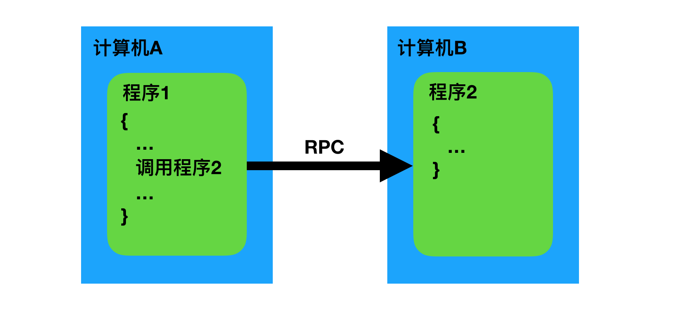
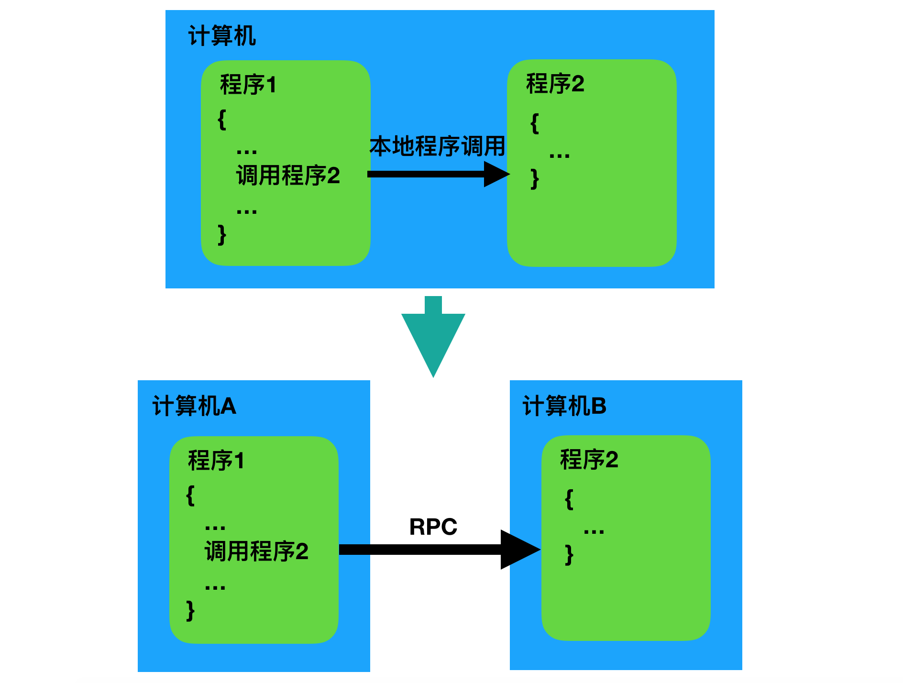
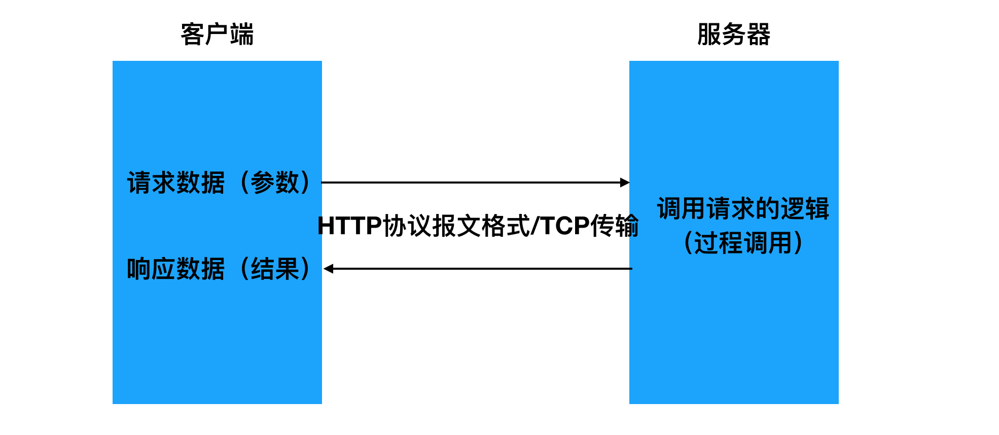
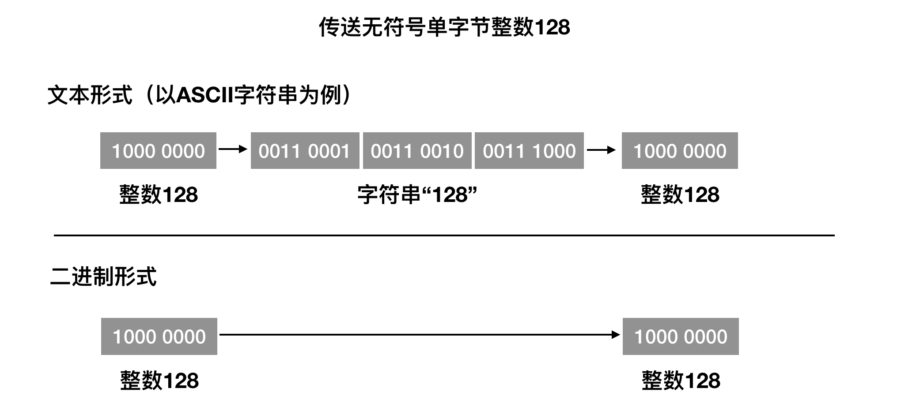
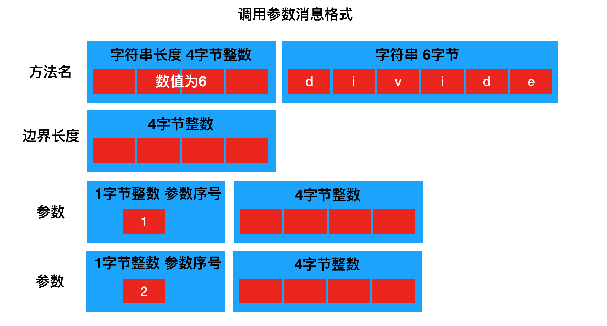

# RPC基本原理

## RPC简介

- 定义

**远程过程调用**（英语：**Remote Procedure Call**，缩写为 **RPC**，也叫**远程程序调用**）是一个计算机通信协议。该协议允许运行于一台计算机的程序调用另一台计算机的子程序，而程序员无需额外地为这个交互作用编程。如果涉及的软件采用面向对象编程，那么远程过程调用亦可称作**远程调用**或**远程方法调用**。



- 背景用途

在单台计算机中，我们可以通过程序调用来传递控制和数据；或者说通过程序调用，我们可以将多个程序组成一个整体来实现某个功能。

如果将这种调用机制推广到多台彼此间可以进行网络通讯的计算机，由多台计算机中的多个程序组成一个整体来实现某个功能，这也是可以的。调用的一方（发起远程过程调用，然后调用这方的环境挂起，参数通过网络传递给被调用方，被调用的一方执行程序，当程序执行完成后，产生的结果再通过网络回传给调用的一方，调用的一方恢复继续执行。这样一种原型思想，就是我们所说的RPC远程过程调用。



RPC这种思想最早可以追溯到1976年，RPC的发展到今天已经40年有余了。

如今的计算机应用中，单机性能上很难承受住产品的压力，需要不断扩充多台机器来提升整体的性能。同时为了充分利用这些集群里的计算机，需要对其从架构上进行划分，以提供不同的服务，服务间相互调用完成整个产品的功能。RPC就能帮助我们解决这些服务间的信息传递和调用。

- 概念说明

> 广义

我们可以将所有通过网络来进行通讯调用的实现统称为RPC。

按照这样来理解的话，那我们发现HTTP其实也算是一种RPC实现。



> 狭义

区别于HTTP的实现方式，在传输的数据格式上和传输的控制上独立实现。比如在机器间通讯传输的数据不采用HTTP协议的方式（分为起始行、header、body三部份），而是使用自定义格式的二进制方式。

我们更多时候谈到的RPC都是指代这种狭义上的理解。

- 优缺点

相比于传统HTTP的实现而言：

优点
```
- 效率高
- 发起RPC调用的一方，在编写代码时可忽略RPC的具体实现，如同编写本地函数调用一样
```
缺点
```
- 通用性不如HTTP好 因为传输的数据不是HTTP协议格式，所以调用双方需要专门实现的通信库，对于不同的编程开发语言，都要有相关实现。而HTTP作为一个标准协议，大部分的语言都已有相关的实现，通用性更好。
```
HTTP更多的面向用户与产品服务器的通讯。

RPC更多的面向产品内部服务器间的通讯。

## RPC结构

RPC的设计思想是力图**使远程调用中的通讯细节对于使用者透明**，调用双方无需关心网络通讯的具体实现。因而实现RPC要进行一定的封装。

RPC原理上是按如下结构流程进行实现的。


流程

```
1. 调用者（Caller, 也叫客户端、Client）以本地调用的方式发起调用；
2. Client stub（客户端存根，可理解为辅助助手）收到调用后，负责将被调用的方法名、参数等打包编码成特定格式的能进行网络传输的消息体；
3. Client stub将消息体通过网络发送给对端（服务端）
4. Server stub（服务端存根，同样可理解为辅助助手）收到通过网络接收到消息后按照相应格式进行拆包解码，获取方法名和参数；
5. Server stub根据方法名和参数进行本地调用；
6. 被调用者（Callee，也叫Server）本地调用执行后将结果返回给server stub;
7. Server stub将返回值打包编码成消息，并通过网络发送给对端（客户端）；
8. Client stub收到消息后，进行拆包解码，返回给Client；
9. Client得到本次RPC调用的最终结果。
```

**RPC的目标就是要2~8这些步骤都封装起来，让使用者对这些细节透明。**

在了解了RPC流程之后，为了实现RPC，我们还需要关注两点：

**消息协议**

客户端调用的参数和服务端的返回值这些在网络上传输的数据以何种方式打包编码和拆包解码。

我们可以使用HTTP协议中关于报文格式的规定（如此一来，就编程了HTTP通讯），也可以自己定义某种格式，让客户端与服务端双方都遵循此种格式。

**传输控制**

在网络中数据的收发传输控制具体如何实现。

## 消息协议

在实现RPC调用时，通讯双方传输的数据（消息）如何表达描述，设计时一般会考虑两个**目标**：

**性能高**

性能高包括两点：

1. 将原始数据转换为消息数据的速度快
2. 转换后的消息数据体积小

**跨语言**

RPC调用没有要求调用双方的编程语言必须相同，如果能做到跨语言调用是最好，这会方便产品开发中不同的功能服务以最合适的语言实现，然后使用RPC实现彼此调用。因此RPC调用中传输的消息数据应该尽量能让跟多的语言支持。

**本课程中仅以Python为例进行讲解。**

- 边界

在网络传输中，一方可能连续向另一方多次发送消息，收到数据的一方如何界定数据中包含几条消息，这便是消息边界问题。

考虑TCP传输控制协议，在一条TCP链接中可以多次发送数据，如果发送的数据过大，就会被TCP底层实现拆解为多个数据包依次发送；而如果发送的数据过小，又可能会将几条数据组装成一个数据包进行发送。

为了解决消息边界的问题，有两种较为常用的方法：**分割符法**和**长度声明法**。

> 分隔符法

顾名思义，就是在每条消息的结尾放置一种特殊的分割符（一种常用的分割符是\r\n），表示已到达本条消息的末尾。


> 长度声明法

长度声明法是在消息的起始位置，用一个固定长度的整数值（通常为4字节）声明本消息的长度，接收者先读取出长度声明，再按照声明的长度读取出相应大小的数据即可。


例如，HTTP协议同时运用了这两种方法：
```javascript
HTTP/1.0 200 OK\r\n
Server: Nginx\r\n
Content-Type: text/html; charset=utf-8\r\n
Content-Length: 5096\r\n
\r\n
//  此处为5096字节的数据
```
- 内容

在具体消息内容的表现形式上，可以使用文本，也可以使用二进制。

> 文本

我们可以将数据转换为具备某种格式的字符串（如 JSON），将字符串作为消息内容发送。

比如一个RPC调用请求，方法名为divide，参数为200和100，我们可以用JSON字符串的形式来表示这个消息内容：

```json
{
    "name": "divide",
    "params": {
        "num1": 200,
        "num2": 100
    }
}
```

采用JSON这种方式，大多数编程语言都已有JSON转换的工具，实现起来相对便捷。但是我们能够看到，形成的消息数据不够精简，数据中有较为无意义的，如"、{、}、,、空白字符等，在网络传输中会造成浪费。

> 二进制

二进制方式就是将数据在内存中的一些列原始二进制位或字节直接在网络中传送，而无需转换为字符串再传送。



我们能够看到，采用原始二进制传递，可以省去中间转换的环节，而且数据量也会大大减少，效率更高。

如果使用二进制的方式来传递上面举例的RPC调用请求，该如何组织数据呢？这就需要实现RPC机制的设计人员来制订一个调用双方都遵守的协议规则，不同的设计人员可能有不同的想法。

- 压缩

如果消息数据过大，为了减轻网络带宽的压力，可以考虑对消息数据进行压缩处理。

就如同我们平时对一些文件、视频等使用压缩软件进行压缩来减小大小一样，我们可以在构造好数据准备发送前，先用算法将数据进行压缩处理，然后通过网络发送到对端，对端收到数据后，先进行解压缩处理，然后得到原体积数据后再进行解析。

即使是比文本数据小的二进制数据，我们仍然可以进行压缩处理。

但是需要注意的是，压缩处理是一把双刃剑，虽然能减少数据量减轻带宽压力，但是同时额外增加了压缩和解压缩的过程，压缩和解压缩在处理的时候会有时间的消耗，会导致操作系统的负担加重。有时压缩的成本可能比减少数据量带来的收益还高，就得不偿失了。

所以是否采用压缩处理，要根据具体情况权衡利弊。

## 二进制消息协议实现

- 概述

我们现在实现一个RPC的服务接口定义，这个RPC调用可以完成除法操作。

```python
# 实现本地调用的话，很容易，定义一个函数divide
class InvalidOperation(Exception):
    """
    自定义非法操作异常
    """
    def __init__(self, message=None):
        self.message = message or 'invalid operation'

def divide(num1, num2=1):
     """
     除法
     :param num1: int
     :param num2: int, 默认值为1
     :return: float 商 或 InvalidOperation异常
     """
     if num2 == 0:
         raise InvalidOperation()
     val = num1 / num2
     return val
    
# 调用的时候，调用divde函数即可：

try:
    val = divide(200, 100)
except InvalidOperation as e:
    print(e.message)
else:
    print(val)
```

但是如果变成RPC调用的话，调用双方该以什么样的方式传递哪些消息数据呢？

我们使用二进制方式来实现消息协议。为了突出消息协议本身，我们不再进行额外压缩处理。

我们将上面的过程抽象成接口

```
float divide(1:int num1, 2:int num2=1) => InvalidOperation
```

消息协议分为两部分说明：

**调用请求消息**

```
方法名为divide
第1个调用参数为整型int，名为num1
第2个调用参数为整型int，名为num2，默认值为1
```



**调用返回消息**

```
正常返回float类型
错误会抛出InvalidOperation异常
```


- 实现

divide消息协议实现

```python
import struct
from io import BytesIO

class DivideProtocol(object):
    """
    float divide(1:int num1, 2:int num2=1)
    """
    def _read_all(self, size):
        """
        读取指定长度的字节
        :param size: 长度
        :return: 读取出的二进制数据
        """
        if isinstance(self.conn, BytesIO):
            # BytesIO类型，用于演示
            buff = b''
            have = 0
            while have < size:
                chunk = self.conn.read(size - have)
                have += len(chunk)
                buff += chunk
            return buff

        else:
            # socket类型
            buff = b''
            have = 0
            while have < size:
                chunk = self.conn.recv(size - have)
                have += len(chunk)
                buff += chunk
                # 客户端关闭了连接
                if len(chunk) == 0:
                    raise EOFError()
            return buff

    def args_encode(self, num1, num2=1):
        """
        对调用参数进行编码
        :param num1: int
        :param num2: int
        :return: 编码后的二进制数据
        """
        # 处理参数num1, 4字节整型
        buff = struct.pack('!B', 1)
        buff += struct.pack('!i', num1)

        # 处理参数num2, 4字节整型，如为默认值1，则不再放到消息中
        if num2 != 1:
            buff += struct.pack('!B', 2)
            buff += struct.pack('!i', num2)

        # 处理消息总长度，4字节无符号整型
        length = len(buff)

        # 处理方法名，字符串类型
        name = 'divide'
        # 字符串长度，4字节无符号整型
        msg = struct.pack('!I', len(name))
        msg += name.encode()

        msg += struct.pack('!I', length) + buff

        return msg

    def args_decode(self, connection):
        """
        获取调用参数并进行解码
        :param connection: 传输工具对象，如socket对象或者BytesIO对象，从中可以读取消息数据
        :return: 解码后的参数字典
        """
        # 保存到当前对象中，供_read_all方式使用
        self.conn = connection
        param_name_map = {
            1: 'num1',
            2: 'num2'
        }
        param_len_map = {
            1: 4,
            2: 4
        }
        # 用于保存解码后的参数字典
        args = dict()

        # 读取消息总长度，4字无节符号整数
        buff = self._read_all(4)
        length = struct.unpack('!I', buff)[0]

        # 记录已读取的长度
        have = 0

        # 读取第一个参数，4字节整型
        buff = self._read_all(1)
        have += 1
        param_seq = struct.unpack('!B', buff)[0]
        param_len = param_len_map[param_seq]
        buff = self._read_all(param_len)
        have += param_len
        args[param_name_map[param_seq]] = struct.unpack('!i', buff)[0]

        if have >= length:
            return args

        # 读取第二个参数，4字节整型
        buff = self._read_all(1)
        have += 1
        param_seq = struct.unpack('!B', buff)[0]
        param_len = param_len_map[param_seq]
        buff = self._read_all(param_len)
        have += param_len
        args[param_name_map[param_seq]] = struct.unpack('!i', buff)[0]

        return args

    def result_encode(self, result):
        """
        对调用的结果进行编码
        :param result: float 或 InvalidOperation对象
        :return: 编码后的二进制数据
        """
        if isinstance(result, float):
            # 没有异常，正常执行
            # 处理结果类型，1字节无符号整数
            buff = struct.pack('!B', 1)

            # 处理结果值, 4字节float
            buff += struct.pack('!f', result)
        else:
            # 发生了InvalidOperation异常
            # 处理结果类型，1字节无符号整数
            buff = struct.pack('!B', 2)

            # 处理异常结果值, 字符串
            # 处理字符串长度, 4字节无符号整数
            buff += struct.pack('!I', len(result.message))
            # 处理字符串内容
            buff += result.message.encode()

        return buff

    def result_decode(self, connection):
        """
        对调用结果进行解码
        :param connection: 传输工具对象，如socket对象或者BytesIO对象，从中可以读取消息数据
        :return: 结果数据
        """
        self.conn = connection

        # 取出结果类型, 1字节无符号整数
        buff = self._read_all(1)
        result_type = struct.unpack('!B', buff)[0]
        if result_type == 1:
            # float的结果值， 4字节float
            buff = self._read_all(4)
            result = struct.unpack('!f', buff)[0]
            return result
        else:
            # InvalidOperation对象
            # 取出字符串长度, 4字节无符号整数
            buff = self._read_all(4)
            str_len = struct.unpack('!I', buff)[0]
            buff = self._read_all(str_len)
            message = buff.decode()
            return InvalidOperation(message)
```

解析方法名实现

```python
class MethodProtocol(object):
    def __init__(self, connection):
        self.conn = connection

    def _read_all(self, size):
        """
        读取指定长度的字节
        :param size: 长度
        :return: 读取出的二进制数据
        """
        if isinstance(self.conn, BytesIO):
            # BytesIO类型，用于演示
            buff = b''
            have = 0
            while have < size:
                chunk = self.conn.read(size - have)
                have += len(chunk)
                buff += chunk

            return buff

        else:
            # socket类型
            buff = b''
            have = 0
            while have < size:
                print('have=%d size=%d' % (have, size))
                chunk = self.conn.recv(size - have)
                have += len(chunk)
                buff += chunk

                if len(chunk) == 0:
                    raise EOFError()

            return buff

    def get_method_name(self):
        # 获取方法名
        # 读取字符串长度，4字节无符号整型
        buff = self._read_all(4)
        str_len = struct.unpack('!I', buff)[0]

        # 读取字符串
        buff = self._read_all(str_len)
        name = buff.decode()
        return name
```

测试代码

```python
if __name__ == '__main__':
    proto = DivideProtocol()
    # 构造消息
    buff = BytesIO()
    # buff.write(proto.args_encode(100, 200))
    buff.write(proto.args_encode(100))
    # 解读消息
    buff.seek(0)
    name = MethodProtocol(buff).get_method_name()
    print(name)
    args = proto.args_decode(buff)
    print(args)
    buff.close()
```

## RPC传输

在构造好RPC消息数据后，就可以通过网络在调用双方进行传递了。

传递消息数据常用的有两种方式：**TCP** 和 **HTTP**

- TCP

由于TCP的可靠性，所以TCP是最常用的方式。我们可以直接借助socket工具进行TCP开发。

TCP服务端编写

```python
sock = socket.socket()  # 创建一个套接字
sock.bind()  # 绑定端口
sock.listen()  # 监听连接
sock.accept()  # 接受新连接
sock.close()  # 关闭服务器套接字
```

TCP客户端编写

```python
sock = socket.socket()  # 创建一个套接字
sock.connect()  # 连接远程服务器
sock.recv() # 读
sock.send()  # 尽可能地写
sock.sendall()  # 完全写
sock.close()  # 关闭
```

用TCP来进行实现传输控制实现

```python
import socket


class Channel(object):
    """
    连接通道
    """
    def __init__(self, host, port):
        self.host = host
        self.port = port

    def get_connection(self):
        """
        获取一个tcp连接
        """
        sock = socket.socket(socket.AF_INET, socket.SOCK_STREAM)
        sock.connect((self.host, self.port))
        return sock


class Server(object):
    """
    服务器
    """
    def __init__(self, host, port):
        self.sock = socket.socket(socket.AF_INET, socket.SOCK_STREAM)
        self.sock.setsockopt(socket.SOL_SOCKET, socket.SO_REUSEADDR, 1)
        self.host = host
        self.port = port
        self.sock.bind((host, port))
```

- HTTP

虽然HTTP属于网络层级中应用层的协议，但是我们仍然可以借助HTTP来帮助我们传递RPC消息。

我们可以将构造好的RPC消息数据嵌入到HTTP报文中的body部分，而对于HTTP的path路径等都无需关心。

```http
HTTP/1.0 POST /
Content-Type: binary
Content-Length: 5096

# 此处放置RPC消息数据
```

使用HTTP作为传输工具的好处是可以直接利用开发语言中已有的http库来进行通讯，无需自己操作socket的读写。但是通讯效率不如TCP高，所以不常用。

## RPC完整实现

- 消息协议

```python
import struct
from io import BytesIO
import socket


class InvalidOperation(Exception):
    def __init__(self, message=None):
        self.message = message or 'invalid operation'


class MethodProtocol(object):
    """
    解读方法名字
    """
    def __init__(self, connection):
        self.conn = connection

    def _read_all(self, size):
        """
        帮助我们读取二进制数据
        :param size: 想要读取的二进制数据大小
        :return: 二进制数据 bytes
        """
        # self.conn
        # 读取二进制数据
        # socket.recv(4) => ?4
        # BytesIO.read
        if isinstance(self.conn, BytesIO):
            buff = self.conn.read(size)
            return buff
        else:
            # socket
            have = 0
            buff = b''
            while have < size:
                chunk = self.conn.recv(size-have)
                buff += chunk
                l = len(chunk)
                have += l

                if l == 0:
                    # 表示客户端socket关闭了
                    raise EOFError()
            return buff

    def get_method_name(self):
        """
        提供方法名
        :return: str 方法名
        """
        # 读取字符串长度
        buff = self._read_all(4)
        length = struct.unpack('!I', buff)[0]

        # 读取字符串
        buff = self._read_all(length)
        name = buff.decode()
        return name


class DivideProtocol(object):
    """
    divide过程消息协议转换工具
    """
    def args_encode(self, num1, num2=1):
        """
        将原始的调用请求参数转换打包成二进制消息数据
        :param num1:  int
        :param num2:  int
        :return: bytes 二进制消息数据
        """
        name = 'divide'

        # 处理方法的名字 字符串
        # 处理字符串的长度
        buff = struct.pack('!I', 6)
        # 处理字符
        buff += name.encode()

        # 处理参数1
        # 处理序号
        buff2 = struct.pack('!B', 1)
        # 处理参数值
        buff2 += struct.pack('!i', num1)

        # 处理参数2
        if num2 != 1:
            # 处理序号
            buff2 += struct.pack('!B', 2)
            # 处理参数值
            buff2 += struct.pack('!i', num2)

        # 处理消息长度，边界设定
        length = len(buff2)
        buff += struct.pack('!I', length)

        buff += buff2

        return buff

    def _read_all(self, size):
        """
        帮助我们读取二进制数据
        :param size: 想要读取的二进制数据大小
        :return: 二进制数据 bytes
        """
        # self.conn
        # 读取二进制数据
        # socket.recv(4) => ?4
        # BytesIO.read
        if isinstance(self.conn, BytesIO):
            buff = self.conn.read(size)
            return buff
        else:
            # socket
            have = 0
            buff = b''
            while have < size:
                chunk = self.conn.recv(size-have)
                buff += chunk
                l = len(chunk)
                have += l

                if l == 0:
                    # 表示客户端socket关闭了
                    raise EOFError()
            return buff

    def args_decode(self, connection):
        """
        接收调用请求消息数据并进行解析
        :param connection: 连接对象 socket BytesIO
        :return: dict 包含了解析之后的参数
        """
        param_len_map = {
            1: 4,
            2: 4
        }
        param_fmt_map = {
            1: '!i',
            2: '!i'
        }
        param_name_map = {
            1: 'num1',
            2: 'num2'
        }

        # 保存用来返回的参数字典
        # args = {"num1": xxx, "num2": xxx}
        args = {}

        self.conn = connection
        # 处理方法名已经提前被处理（稍后实现）

        # 处理消息边界
        # 读取二进制数据
        # socket.recv(4) => ?4
        # BytesIO.read
        buff = self._read_all(4)
        # 将二进制数据转换为python的数据类型
        length = struct.unpack('!I', buff)[0]

        # 已经读取处理的字节数
        have = 0

        # 处理第一个参数
        # 处理参数序号
        buff = self._read_all(1)
        have += 1
        param_seq = struct.unpack('!B', buff)[0]

        # 处理参数值
        param_len = param_len_map[param_seq]
        buff = self._read_all(param_len)
        have += param_len
        param_fmt = param_fmt_map[param_seq]
        param = struct.unpack(param_fmt, buff)[0]

        param_name = param_name_map[param_seq]
        args[param_name] = param

        if have >= length:
            return args

        # 处理第二个参数
        # 处理参数序号
        buff = self._read_all(1)
        param_seq = struct.unpack('!B', buff)[0]

        # 处理参数值
        param_len = param_len_map[param_seq]
        buff = self._read_all(param_len)
        param_fmt = param_fmt_map[param_seq]
        param = struct.unpack(param_fmt, buff)[0]

        param_name = param_name_map[param_seq]
        args[param_name] = param

        return args

    def result_encode(self, result):
        """
        将原始结果数据转换为消息协议二进制数据
        :param result: 原始结果数据 float InvalidOperation
        :return: bytes 消息协议二进制数据
        """
        # 正常
        if isinstance(result, float):
            pass
            # 处理返回值类型
            buff = struct.pack('!B', 1)
            buff += struct.pack('!f', result)
            return buff
        # 异常
        else:
            # 处理返回值类型
            buff = struct.pack('!B', 2)
            # 处理返回值
            length = len(result.message)
            # 处理字符串长度
            buff += struct.pack('!I', length)
            # 处理字符
            buff += result.message.encode()
            return buff

    def result_decode(self, connection):
        """
        将返回值消息数据转换为原始返回值
        :param connection: socket BytesIO
        :return: float  InvalidOperation对象
        """
        self.conn = connection

        # 处理返回值类型
        buff = self._read_all(1)
        result_type = struct.unpack('!B', buff)[0]

        if result_type == 1:
            # 正常
            # 读取float数据
            buff = self._read_all(4)
            val = struct.unpack('!f', buff)[0]
            return val
        else:
            # 异常
            # 读取字符串的长度
            buff = self._read_all(4)
            length = struct.unpack('!I', buff)[0]

            # 读取字符串
            buff = self._read_all(length)
            message = buff.decode()

            return InvalidOperation(message)


class Channel(object):
    """
    用户客户端建立网络连接
    """
    def __init__(self, host, port):
        """

        :param host: 服务器地址
        :param port: 服务器端口号
        """
        self.host = host
        self.port = port

    def get_connection(self):
        """
        获取连接对象
        :return: 与服务器通讯的socket
        """
        sock = socket.socket(socket.AF_INET, socket.SOCK_STREAM)
        sock.connect((self.host, self.port))
        return sock

```

- Server

```python
class Server(object):
    """
    RPC服务器
    """
    def __init__(self, host, port, handlers):
        # 创建socket的工具对象
        sock = socket.socket(socket.AF_INET, socket.SOCK_STREAM)

        # 设置socket 重用地址
        sock.setsockopt(socket.SOL_SOCKET, socket.SO_REUSEADDR, 1)

        # 绑定地址
        sock.bind((host, port))
        self.host = host
        self.port = port
        self.sock = sock
        self.handlers = handlers

    def serve(self):
        """
        开启服务器运行，提供RPC服务
        :return:
        """
        # 开启服务器的监听，等待客户端的连接请求
        self.sock.listen(128)
        print("服务器开始监听")

        # 接受客户端的连接请求
        while True:
            client_sock, client_addr = self.sock.accept()
            print('与客户端%s建立了连接' % str(client_addr))

            # 交给ServerStub，完成客户端的具体的RPC调用请求
            stub = ServerStub(client_sock, self.handlers)
            try:
                while True:
                    stub.process()
            except EOFError:
                # 表示客户端关闭了连接
                print('客户端关闭了连接')
                client_sock.close()
```

- Client Stub 客户端存根

用户直接操作的对象，由client stub构造消息数据借助连接发送给服务端，并接收解析服务端的返回消息传递给用户。

```python
class ClientStub(object):
    """
    用来帮助客户端完成远程过程调用  RPC调用

    stub = ClientStub()
    stub.divide(200, 100)
    stub.add()
    """
    def __init__(self, channel):
        self.channel = channel
        self.conn = self.channel.get_connection()

    def divide(self, num1, num2=1):
        # 将调用的参数打包成消息协议的数据
        proto = DivideProtocol()
        args = proto.args_encode(num1, num2)

        # 将消息数据通过网络发送给服务器
        self.conn.sendall(args)

        # 接受服务器返回的返回值消息数据，并进行解析
        result = proto.result_decode(self.conn)

        # 将结果值（正常float 或 异常InvalidOperation）返回给客户端
        if isinstance(result, float):
            # 正常
            return result
        else:
            # 异常
            raise result
```

- Server Stub 服务端存根

帮助服务端接收调用消息数据并解析，在本地调用程序后将结果构造返回值消息返回给客户端。

```python
class ServerStub(object):
    """
    帮助服务端完成远端过程调用
    """
    def __init__(self, connection, handlers):
        """

        :param connection: 与客户端的连接
        :param handlers: 真正本地被调用的方法（函数 过程）
        class Handlers:

            @staticmethod
            def divide(num1, num2=1):
                pass

            def add():
                pass
        """
        self.conn = connection
        self.method_proto = MethodProtocol(self.conn)
        self.process_map = {
            'divide': self._process_divide,
        }
        self.handlers = handlers

    def process(self):
        """
        当服务端接受了一个客户端的连接，建立好连接后，完成远端调用处理
        :return:
        """
        # 接收消息数据，并解析方法的名字
        name = self.method_proto.get_method_name()

        # 根据解析获得的方法（过程）名，调用响应的过程协议，接受并解析消息数据
        # self.process_map[name]()
        _process = self.process_map[name]
        _process()

    def _process_divide(self):
        """
        处理除法过程调用
        :return:
        """
        # 创建用于除法过程调用参数协议数据解析的工具
        proto = DivideProtocol()
        # 解析调用参数消息数据
        args = proto.args_decode(self.conn)
        # args = {"num1": xxx, "num2": xxx}

        # 进行除法的本地过程调用
        # 将本地调用过程的返回值（包括可能的异常）打包成消息协议数据，通过网络返回给客户端
        try:
            val = self.handlers.divide(**args)
        except InvalidOperation as e:
            ret_message = proto.result_encode(e)
        else:
            ret_message = proto.result_encode(val)

        self.conn.sendall(ret_message)
```


- 测试

服务端server.py

```python
from services import Server
from services import InvalidOperation


class Handlers:
    @staticmethod
    def divide(num1, num2=1):
        """
        除法
        :param num1:
        :param num2:
        :return:
        """
        if num2 == 0:
            raise InvalidOperation()
        val = num1 / num2
        return val


if __name__ == '__main__':
    server = Server('127.0.0.1', 8000, Handlers)
    server.serve()
```

客户端client.py

```python
from services import ClientStub
from services import Channel
from services import InvalidOperation
import time

channel = Channel('127.0.0.1', '8000')
stub = ClientStub(channel)

for i in range(5):
    try:
        val = stub.divide(i*100, 10)
    except InvalidOperation as e:
        print(e.message)
    else:
        print(val)
    time.sleep(1)
```

## RPC服务器

在前面的实现中，我们只实现了RPC服务器的最简易模型——单进程单线程。

为了能让RPC服务器同时处理多个客户端的请求，提升性能，我们可以改写服务器，采用多线程、多进程等。

在此我们仅实现多线程模型，其余不再赘述。

```python
import threading

class ThreadServer(object):
    """
    多线程RPC服务器
    """
    def __init__(self, host, port, handlers):
        # 创建socket的工具对象
        sock = socket.socket(socket.AF_INET, socket.SOCK_STREAM)

        # 设置socket 重用地址
        sock.setsockopt(socket.SOL_SOCKET, socket.SO_REUSEADDR, 1)

        # 绑定地址
        sock.bind((host, port))
        self.host = host
        self.port = port
        self.sock = sock
        self.handlers = handlers

    def serve(self):
        """
        开启服务器运行，提供RPC服务
        :return:
        """
        # 开启服务器的监听，等待客户端的连接请求
        self.sock.listen(128)
        print("服务器开始监听")

        # 接受客户端的连接请求
        while True:
            client_sock, client_addr = self.sock.accept()
            print('与客户端%s建立了连接' % str(client_addr))

            # 创建子线程处理这个客户端
            t = threading.Thread(target=self.handle, args=(client_sock,))
            # 开启子线程执行
            t.start()

    def handle(self, client_sock):
        """
        子线程调用的方法，用来处理一个客户端的请求
        :return:
        """
        # 交给ServerStub，完成客户端的具体的RPC调用请求
        stub = ServerStub(client_sock, self.handlers)
        try:
            while True:
                stub.process()
        except EOFError:
            # 表示客户端关闭了连接
            print('客户端关闭了连接')
            client_sock.close()


```

