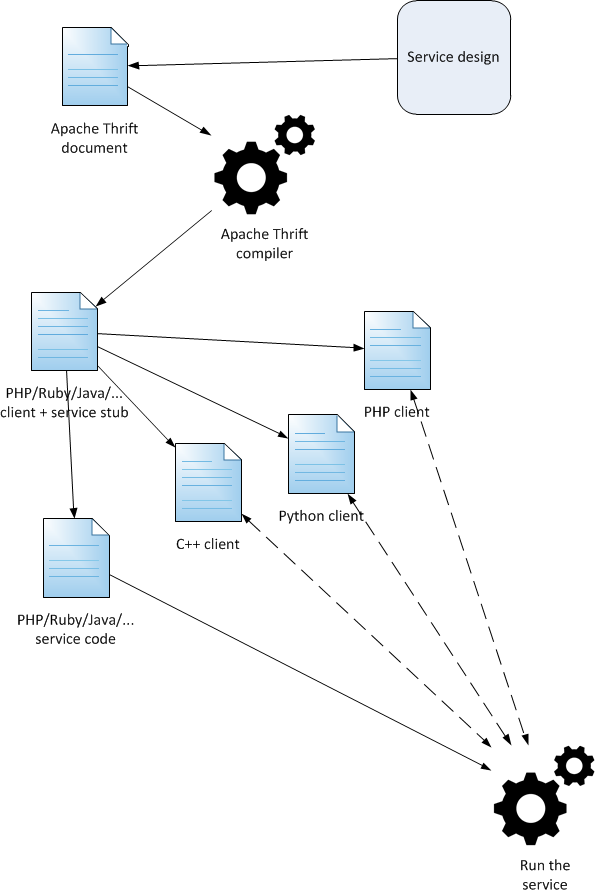

# Thrift

## 简介

**Thrift**是由Facebook为“大规模跨语言服务开发”而开发的，现在是Apache软件基金会的开源项目。

**Thrift**实现了一种接口描述语言和二进制通讯协议，用来定义和创建跨语言的服务。它被当作一个RPC框架来使用。

### 使用

如果现在要实现一个除法divide的RPC接口服务：

```python
float divide(1:int num1, 2:int num2=1) => InvalidOperation
```

如何使用Thrift来进行实现呢？

Thrift的基础库程序中已经提供了用于RPC通讯的底层基本消息协议和传输工具，也就是调用双方如何传输str、int、float等不同基本类型的数据无需我们自己再实现了。

但是对于不同的RPC接口是由不同个数不同类型的参数构成的，如上述divide服务就是有两个int类型的调用参数和float类型或InvalidOperation异常的返回值构成，也就是说发起调用时我们需要传递两个int类型的数据，调用完成返回值的时候，我们需要传递float类型或InvalidOperation异常，这些就需要我们利用Thrift提供的基础库自己写代码来实现。每个RPC接口服务都要定义出来，才能完成整个RPC调用。

若想调用双方使用不同的编程语言开发，即在不同的语言程序间完成RPC调用，那每个RPC接口服务都需要在调用方和被调用方使用不同的语言来定义。

上面的过程实际上是简单的重复工作。Thrift允许我们使用一种独立于任何编程语言的新的语言来定义接口服务，通常把这种语言成为**接口定义语言（IDL，Interface Definition Language）**，我们使用Thrift的IDL将接口定义在一个文本文件中（通常使用`.thrift`后缀名，成为接口定义文件），然后使用Thrift提供的编译器（compiler）根据这个文件生成所需要的语言的程序源代码。



生成得到不同接口的程序代码后，我们再编写客户端的调用代码和服务端的接口功能实现代码及启动代码，就可完成Thrift RPC的调用实现。

**总结使用方法如下**

1. 使用Thrift的IDL编写接口定义文件
2. 使用Thrift的编译器生成特定语言的接口程序源代码
3. 编写客户端和服务端程序

### 架构


**TProtocol** 提供了对基础类型数据进行不同方式编码的消息协议工具

**TTransport** 提供了对编码后的消息数据进行不同方式网路传输的传输工具

### 安装

安装依赖工具和库

```shell
sudo apt-get install automake bison flex g++ git libboost-all-dev libevent-dev \
libssl-dev libtool make pkg-config
```

安装Trhrift编译器和程序库

```shell
# 1.下载源文件
从https://thrift.apache.org/download下载Thrift源文件：
thrift-0.11.0.tar.gz 是可以在Linux或Mac安装的源文件
Thrift compiler for Windows (thrift-0.11.0.exe) 是Windows的安装文件
# 2.解压缩源文件
tar -zxvf thrift-0.11.0.tar.gz
# 3.配置安装过程
cd thrift-0.11.0
./configure --prefix=/usr/local/ --without-php --without-java --without-perl --without-nodejs  # --prefix表示安装到的路径，--without-PACKAGE表示不安装PACKAGE语言的库，如--without-php表示不安装php的Thrift基础程序库，其他configure选项参数可以通过 ./configure --help进行查看
# 4.解析执行、安装
sudo make
sudo make install
# 5.验证
thrift -version

```

安装Thrift的python包

>  注意
>
> 安装成功后对于选择安装的语言，调用Thrift的程序库实际上也安装完成。但是对于Python语言，Thrift会附带安装适用于Python 2的程序库（包），缺少了Python 3的程序库；同时，对于Ubuntu系统（或Debian系统），默认python的搜索包路径在dist-packages子目录下，而Thrift安装的Python程序包路径在site-packages子目录下，python程序不能直接导入thrift包。所以，对于Python语言，我们可以使用下面的方法自己安装thrift包。

```python
pip install thrift
```

## 接口定义语言IDL

Thrift的IDL可以使用下面的语法来定义描述接口。

### 数据类型

- 基本类型
```
- `bool`：布尔值，true 或 false
- `byte`：8 位有符号整数
- `i16`：16 位有符号整数
- `i32`：32 位有符号整数
- `i64`：64 位有符号整数
- `double`：64 位浮点数
- `string`：字符串
- `binary`：二进制数据
```
- 容器类型

可以包含多个数据（元素）的类型。
```python
list<type>
# 元素为type类型的列表，与python的list对应，如list<double>

set<type>
# 元素为type类型且唯一的集合，与python的set对应，如set<i32>

map<type1,type2>
# 键为type1类型值为type2类型的映射，与python的dict对应，如map<string,string>
```

- 常量类型

`const 常量类型 常量名称 = 常量值`，如

```c
const i32 INT32CONSTANT = 9853
const map<string,string> MAPCONSTANT = {'hello':'world', 'goodnight':'moon'}
```

- 枚举类型

`enum`，一组32位整数常量，在Python中以类保存枚举常量值。如

```c
enum Operation {
  ADD = 1,
  SUBTRACT = 2,
  MULTIPLY = 3,
}
```

也可以省略常量值，如

```c
enum Operation {
  ADD,
  SUBTRACT,
  MULTIPLY,
}
```

如果省略了常量值，则枚举中的第一个为1，其次递增。

- 结构体类型

`struct`，封装一组不同类型的数据，与Python中的类对应，如

```c
struct Work {
  1: i32 num1 = 0,
  2: i32 num2,
  3: Operation op,
  4: optional string comment,
}
```

**optional** 关键字表示该字段值可选，如果构建的结构体类型数据中可选字段没有设置值，则在编码生成的消息数据中不会包含可选字段。

- 异常类型

`exception`，可以自定义异常中包含的数据内容，与Python中的类对应，如

```python
exception InvalidOperation {
  1: i32 whatOp,
  2: string why
}
```

### 服务

- 接口

`service`，定义服务接口的方法和参数，如

```python
service BasicService {
    double divide(1:i32 num1, 2:i32 num2) throws (1:InvalidOperation e)
    oneway void ping()
}
```

说明：
```
- 方法可以不带参数，如带参数，须指明参数的序号和参数类型
- 方法名前须指明返回值类型，void表示没有返回值
- oneway 表示客户端发起请求后不再等待响应返回，oneway方法必须是void返回类型
- throws 表示可能抛出的异常
```
- 继承

使用`extends`可以继承扩展另一个服务，如

```python
include "base.thrift"
service Calculate extends base.BasicService {
    i32 calculate(1:base.Work w) throws (1:base.InvalidOperation e)
}
```

### 其他

- 注释别名

Thrfit支持多种注释方法

```c
#  单行注释
//  单行注释
/* 多行注释  */
```

使用`typedef`可以为类型起别名，如

```c
typedef i32 MyInteger
```

这里定义了一个新的类型MyInteger，这个MyInteger就是i32类型的别名。

- 编译

使用thrift命令来编译接口定义文件，生成程序代码

```shell
thrift --gen 语言 接口定义文件
```

如

```shell
thrift --gen py basic.thrift
```

其中py 表示生成Python语言代码，其他的语言参数名可以通过`thrift -help`命令查看。

对于有继承服务的接口定义文件，可以添加`-r`参数，生成所有相关接口程序，如

```shell
thrift -r --gen py calculate.thrift
```

## 协议与传输

### 协议

Thrift 可以让用户选择客户端与服务端之间传输通信的消息协议类别，如我们前面所讲总体划分为文本 (text) 和二进制 (binary) ，为节约带宽，提高传输效率，一般情况下使用二进制类型的为多数，有时还会使用基于文本类型的协议，这需要根据项目 / 产品中的实际需求。常用协议有以下几种：

**thrift.protocol.TBinaryProtocol**

二进制编码格式进行数据传输

客户端构建方式：

```python
protocol = TBinaryProtocol.TBinaryProtocol(transport)
```

服务端构建方式：

```python
pfactory = TBinaryProtocol.TBinaryProtocolFactory()
```

**thrift.protocol.TCompactProtocol**

高效率的、密集的二进制编码格式进行数据传输，**推荐使用**

客户端构建方式：

```python
protocol = TCompactProtocol.TCompactProtocol(transport)
```

服务端构建方式：

```python
pfactory = TCompactProtocol.TCompactProtocolFactory()
```

**thrift.protocol.TJSONProtocol**

使用 JSON 的数据编码协议进行数据传输

客户端构建方式：

```python
protocol = TJSONProtocol.TJSONProtocol(transport)
```

服务端构建方式：

```python
pfactory = TJSONProtocol.TJSONProtocolFactory()
```

### 传输

常用的传输层有以下几种：

**thrift.transport.TSocket**

使用阻塞式 I/O 进行传输，是最常见的模式

客户端构建方式：

```python
transport = TSocket.TSocket('127.0.0.1', 8888)
```

服务端构建方式：

```python
transport = TSocket.TServerSocket('127.0.0.1', 8888)
```

**thrift.transport.TTransport.TBufferedTransport**

原始的socket方式效率不高，Thrift提供了封装的加了缓存的传输控制，**推荐方式**

客户端构建方式：

```python
transport = TSocket.TSocket('127.0.0.1', 8888)
transport = TTransport.TBufferedTransport(transport)
```

服务端构建方式：

```python
transport = TSocket.TServerSocket('127.0.0.1', 8888)
tfactory = TTransport.TBufferedTransportFactory()
```

## 实现案例

### 接口

- 定义

base.thrift

```c
const i32 INTCONSTANT = 1234
const map<string,string> MAPCONSTANT = {'hello':'thrift', 'itcast':'python'}

// 定义了一个Operation的枚举
enum Operation {
  ADD = 1,
  SUBTRACT = 2,
  MULTIPLY = 3,
}

# 定义了一个Work的结构体
struct Work {
  1: i32 num1 = 0,
  2: i32 num2,
  3: Operation op,
  4: optional string comment,
}

/*
*  定义了一个InvalidOperation的异常
*  whatOp 表示是哪种Operation的操作
*  why 表示异常的原因
* */
exception InvalidOperation {
  1: i32 whatOp,
  2: string why
}

service BasicService {
    double divide(1:i32 num1, 2:i32 num2) throws (1:InvalidOperation e)
    oneway void ping()
}

```

calculate.thrift

```c
include 'base.thrift'

// 继承
service Calculate extends base.BasicService {
    i32 calculate(1:base.Work w) throws (1:base.InvalidOperation e)
}
```

- 生成

```shell
# 若需要编译calculate和base
thrift -r --gen py calculate.thrift  
# 若仅需编译base
thrift --gen py base.thrft
```

编译之后生成文件夹

```
- base.thrift
- calculate.thrif
- gen-py
	- __init__.py
	- base
		- __init__.py
		- BasicService.py
		- BasicService-remote
		- constantes.py
		- ttypes.py
	- calculate
		- __init__.py
		- Calculate.py
		- Calculate-remote
		- constantes.py
		- ttypes.py
- client.py
- server.py
```

### 服务器

Thrift提供的常见服务端类型有一下几种：

- **thrift.server.TServer.TSimpleServer** 单线程服务器
- **thrift.server.TServer.TThreadedServer** 多线程服务器
- **thrift.server.TServer.TThreadPoolServer** 线程池服务器
- **thrift.server.TServer.TForkingServer** 多进程服务器

我们以线程池服务器为例，其他方式相同。

```python
# server.py
import sys
sys.path.append('gen-py')

from calculate import Calculate
from base.ttypes import InvalidOperation, Operation
from thrift.protocol import TCompactProtocol
from thrift.transport import TSocket, TTransport
from thrift.server import TServer


# 实现接口服务方法的具体代码
class CalculateHandle(Calculate.Iface):
    def ping(self):
        print('ping()')

    def divide(self, num1, num2):
        if num2 == 0:
            raise InvalidOperation(0, 'cannot divide by 0')
        return num1 / num2

    def calculate(self, w):
        if w.op == Operation.ADD:
            return w.num1 + w.num2
        elif w.op == Operation.SUBTRACT:
            return w.num1 - w.num2
        elif w.op == Operation.MULTIPLY:
            return w.num1 * w.num2
        else:
            raise InvalidOperation(w.op, 'invalid operation')


if __name__ == '__main__':
    # 开启服务器，对外提供RPC远程调用服务
    # 构建rpc调用处理工具
    handler = CalculateHandle()
    processor = Calculate.Processor(handler)

    # 构建消息协议工具
    pfactory = TCompactProtocol.TCompactProtocolFactory()

    # 构建传输工具
    transport = TSocket.TServerSocket('127.0.0.1', 8888)
    tfactory = TTransport.TBufferedTransportFactory()

    # 构建服务器对象
    server = TServer.TThreadPoolServer(processor, transport, tfactory, pfactory)

    # 开启服务器
    print('服务器已开启')
    server.serve()
```

### 客户端

```python
# client.py
import sys
sys.path.append('gen-py')

from thrift.transport import TSocket, TTransport
from thrift.protocol import TCompactProtocol
from calculate import Calculate
from base.ttypes import InvalidOperation, Work, Operation


def main():
    # 创建传输工具对象
    transport = TSocket.TSocket('127.0.0.1', 8888)
    transport = TTransport.TBufferedTransport(transport)

    # 创建消息协议工具对象
    protocol = TCompactProtocol.TCompactProtocol(transport)

    # 创建用于进行RPC调用的客户端对象
    client = Calculate.Client(protocol)

    # 进行具体的过程调用
    # 打开连接
    transport.open()

    client.ping()
    print('调用了ping')

    result = client.divide(100, 50)
    print('100 / 50 = {}'.format(result))

    try:
        result = client.divide(100, 0)
    except InvalidOperation as e:
        print(e.why)

    work = Work()
    work.num1 = 100
    work.num2 = 20
    work.op = Operation.ADD
    result = client.calculate(work)
    print('100 + 20 = {}'.format(result))

    work.op = Operation.SUBTRACT
    result = client.calculate(work)
    print('100 - 20 = {}'.format(result))

    # 关闭
    transport.close()


if __name__ == '__main__':
    main()
```

