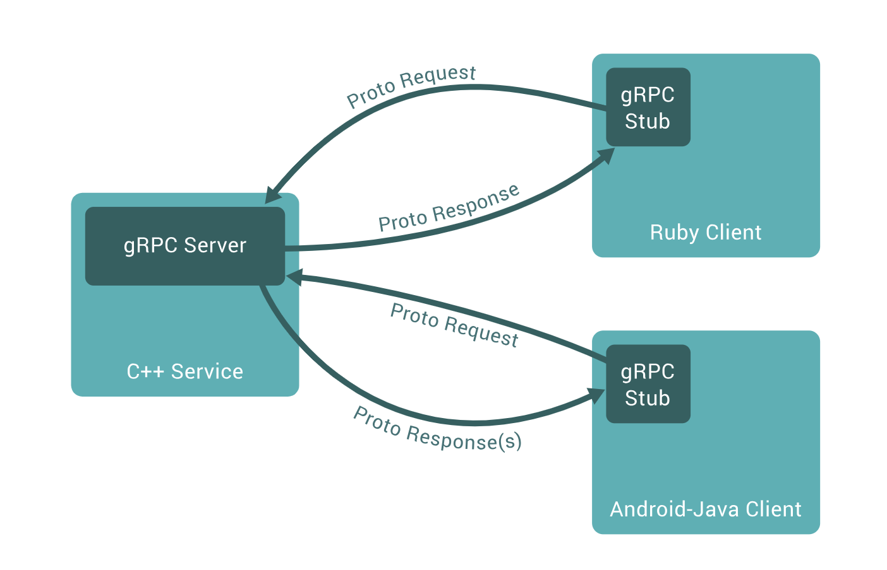
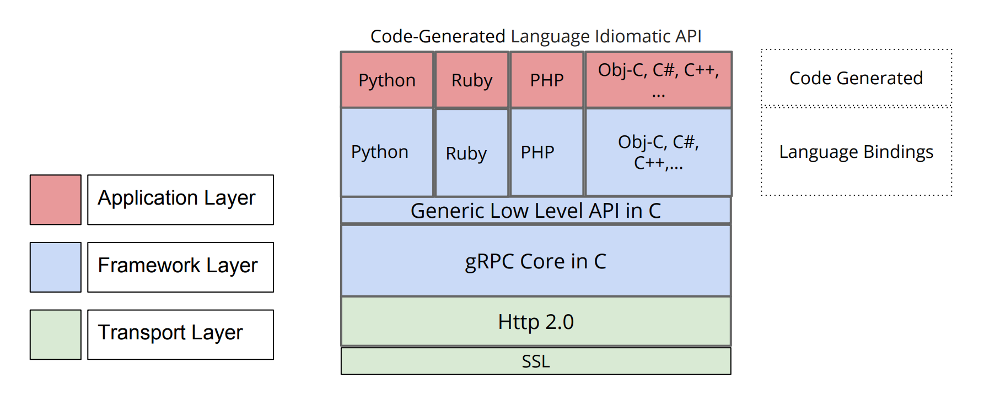
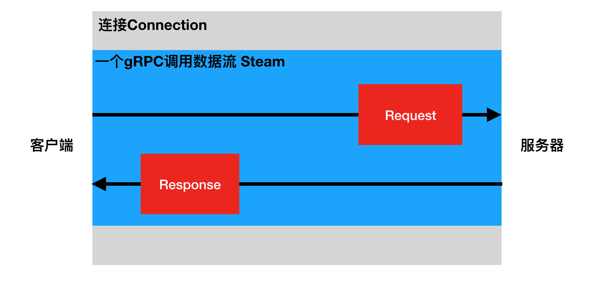
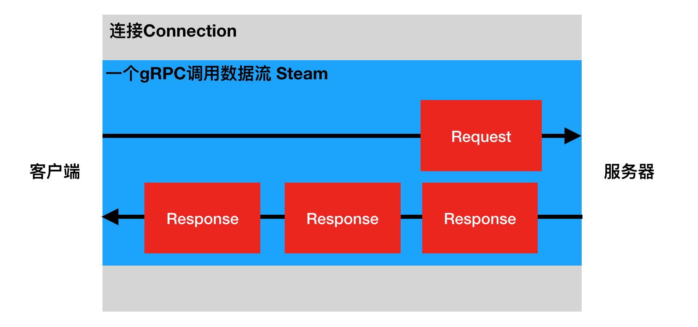
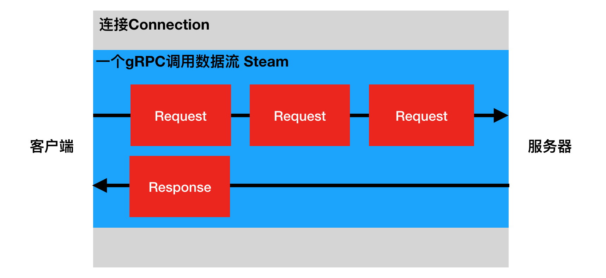
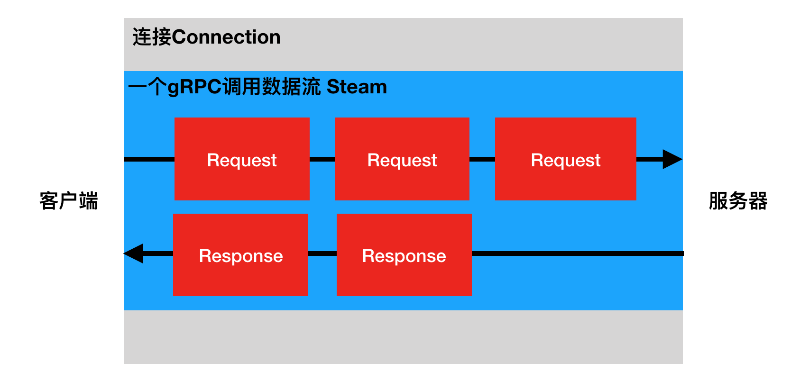

# gRPC

## 简介

gRPC是由Google公司开源的高性能RPC框架。

gRPC支持多语言
```
gRPC原生使用C、Java、Go进行了三种实现，而C语言实现的版本进行封装后又支持C++、C#、Node、ObjC、 Python、Ruby、PHP等开发语言
```
gRPC支持多平台
```
支持的平台包括：Linux、Android、iOS、MacOS、Windows
```
gRPC的消息协议使用Google自家开源的Protocol Buffers协议机制（proto3）

gRPC的传输使用HTTP/2标准，支持双向流和连接多路复用



### 架构

C语言实现的gRPC支持多语言，其架构如下



### 使用

1. 使用Protocol Buffers（proto3）的IDL接口定义语言定义接口服务，编写在文本文件（以`.proto`为后缀名）中。
2. 使用protobuf编译器生成服务器和客户端使用的stub代码
3. 编写补充服务器和客户端逻辑代码

### 安装

安装protobuf编译器和grpc库

```shell
pip install grpcio-tools
```

## HTTP2

gRPC的传输是基于HTTP/2标准协议实现的，我们前面提到gRPC支持双向流和多路复用，实际就是HTTP/2的特性。而且gRPC有四种接口类型，也是依赖HTTP/2协议建立起来的，所以我们有必要先来了解一下HTTP/2协议。

HTTP/2 是HTTP协议的最新版本，我们通过HTTP/1.x与HTTP/2的对比来认识HTTP/2的特性。

### HTTP1

HTTP/1.x 可以说是一个文本协议，可读性很好，但是效率不高。


- 解析

如果要解析一个完整的 HTTP 请求，首先我们需要能正确的读出 HTTP header。HTTP header 各个 fields 使用 \r\n 分隔，然后跟 body 之间使用 \r\n\r\n 分隔。解析完 header 之后，我们才能从 header 里面的 content-length 拿到 body 的 size，从而读取 body。

这套流程其实并不高效，因为我们需要读取多次，才能将一个完整的 HTTP 请求给解析出来，虽然在代码实现上面，有很多优化方式，譬如：
```
一次将一大块数据读取到 buffer 里面避免多次 IO read

读取的时候直接匹配 \r\n 的方式流式解析
```
但上面的方式对于高性能服务来说，终归还是会有开销。其实最主要的问题在于，HTTP/1.x 的协议是 文本协议，是给人看的，对机器不友好，如果要对机器友好，二进制协议才是更好的选择。

- 交互模型

HTTP/1.x 另一个问题就在于它的交互模式，一个连接每次只能一问一答，也就是client 发送了 request 之后，必须等到 response，才能继续发送下一次请求。

这套机制是非常简单，但会造成网络连接利用率不高。如果需要同时进行大量的交互，client 需要跟 server 建立多条连接，但连接的建立也是有开销的，所以为了性能，通常这些连接都是长连接一直保活的，虽然对于 server 来说同时处理百万连接也没啥太大的挑战，但终归效率不高。

- 服务器推送

因为 HTTP/1.x 并没有推送机制。所以通常两种做法：

- Long polling 长轮询方式，也就是直接给 server 挂一个连接，等待一段时间（譬如 1 分钟），如果 server 有返回或者超时，则再次重新 poll。
- WebSocket，通过 upgrade 机制显示的将这条 HTTP 连接变成裸的 TCP，进行双向交互。

### HTTP2

HTTP/2 是一个二进制协议，这也就意味着它的可读性几乎为 0，但是效率很高。

- 二进制分帧层

HTTP/2 所有性能增强的核心在于新的二进制分帧层，它定义了如何封装 HTTP 消息并在客户端与服务器之间传输。


这里所谓的“层”，指的是位于套接字接口与应用可见的高级 HTTP API 之间一个经过优化的新编码机制：HTTP 的语义（包括各种动词、方法、标头）都不受影响，不同的是传输期间对它们的编码方式变了。HTTP/1.x 协议以换行符作为纯文本的分隔符，而 HTTP/2 将所有传输的信息分割为更小的消息和帧，并采用二进制格式对它们编码。

这样一来，客户端和服务器为了相互理解，都必须使用新的二进制编码机制：HTTP/1.x 客户端无法理解只支持 HTTP/2 的服务器，反之亦然。不过不要紧，现有的应用不必担心这些变化，因为客户端和服务器会替我们完成必要的分帧工作。

- 数据流、消息、帧

新的二进制分帧机制改变了客户端与服务器之间交换数据的方式。 为了说明这个过程，我们需要了解 HTTP/2 的三个概念：
```
- 数据流 Stream：已建立的连接内的双向字节流，可以承载一条或多条消息。
- 消息 Message ：与逻辑请求或响应消息对应的完整的一系列帧。
- 帧 Frame：HTTP/2 通信的最小单位，每个帧都包含帧头，至少也会标识出当前帧所属的数据流。
```
这些概念的关系总结如下：
```
- 所有通信都在一个 TCP 连接上完成，此连接可以承载任意数量的双向数据流。
- 每个数据流都有一个唯一的标识符和可选的优先级信息，用于承载双向消息。
- 每条消息都是一条逻辑 HTTP 消息（例如请求或响应），包含一个或多个帧。
- 帧是最小的通信单位，承载着特定类型的数据，例如 HTTP 标头、消息负载，等等。 来自不同数据流的帧可以交错发送，然后再根据每个帧头的数据流标识符重新组装。
```


- 请求与响应复用

在 HTTP/1.x 中，如果客户端要想发起多个并行请求以提升性能，则必须使用多个 TCP 连接。这是 HTTP/1.x 交付模型的直接结果，该模型可以保证每个连接每次只交付一个响应（响应排队）。更糟糕的是，这种模型也会导致队首阻塞，从而造成底层 TCP 连接的效率低下。

HTTP/2 中新的二进制分帧层突破了这些限制，实现了完整的请求和响应复用：客户端和服务器可以将 HTTP 消息分解为互不依赖的帧，然后交错发送，最后再在另一端把它们重新组装起来。


上图展示了同一个连接内并行的多个数据流。客户端正在向服务器传输一个 `DATA` 帧（数据流 5），与此同时，服务器正向客户端交错发送数据流 1 和数据流 3 的一系列帧。因此，一个连接上同时有三个并行数据流。

HTTP/2 通过 stream 支持了连接的多路复用，提高了连接的利用率。Stream 有很多重要特性：

```
- 一条连接可以包含多个 streams，多个 streams 发送的数据互相不影响。
- Stream 可以被 client 和 server 单方面或者共享使用。
- Stream 可以被任意一段关闭。
- Stream 会确定好发送 frame 的顺序，另一端会按照接受到的顺序来处理。
- Stream 用一个唯一 ID 来标识。
```

这里在说一下 Stream ID，如果是 client 创建的 stream，ID 就是奇数，如果是 server 创建的，ID 就是偶数。ID 0x00 和 0x01 都有特定的使用场景，不会用到。

Stream ID 不可能被重复使用，如果一条连接上面 ID 分配完了，client 会新建一条连接。而 server 则会给 client 发送一个 GOAWAY frame 强制让 client 新建一条连接。

将 HTTP 消息分解为独立的帧，交错发送，然后在另一端重新组装是 HTTP 2 最重要的一项增强。事实上，这个机制会在整个网络技术栈中引发一系列连锁反应，从而带来巨大的性能提升，让我们可以：

```
- 并行交错地发送多个请求，请求之间互不影响。
- 并行交错地发送多个响应，响应之间互不干扰。
- 使用一个连接并行发送多个请求和响应。
- 不必再为绕过 HTTP/1.x 限制而做很多工作，例如级联文件、image sprites 和域名分片。
- 消除不必要的延迟和提高现有网络容量的利用率，从而减少页面加载时间。
- 等等…
```

HTTP/2 中的新二进制分帧层解决了 HTTP/1.x 中存在的队首阻塞问题，也消除了并行处理和发送请求及响应时对多个连接的依赖。结果，应用速度更快、开发更简单、部署成本更低。

- 服务器推送

HTTP/2 新增的另一个强大的新功能是，服务器可以对一个客户端请求发送多个响应。 换句话说，除了对最初请求的响应外，服务器还可以向客户端推送额外资源，而无需客户端明确地请求。


- 数据流优先级

因为一条连接允许多个 streams 在上面发送 frame，那么在一些场景下面，我们还是希望 stream 有优先级，方便对端为不同的请求分配不同的资源。譬如对于一个 Web 站点来说，优先加载重要的资源，而对于一些不那么重要的图片啥的，则使用低的优先级。

我们还可以设置 Stream Dependencies，形成一棵 streams priority tree。假设 Stream A 是 parent，Stream B 和 C 都是它的孩子，B 的 weight 是 4，C 的 weight 是 12，假设现在 A 能分配到所有的资源，那么后面 B 能分配到的资源只有 C 的 1/3。

- 数据流控制

HTTP/2 也支持流控，如果 sender 端发送数据太快，receiver 端可能因为太忙，或者压力太大，或者只想给特定的 stream 分配资源，receiver 端就可能不想处理这些数据。譬如，如果 client 给 server 请求了一个视屏，但这时候用户暂停观看了，client 就可能告诉 server 别在发送数据了。

虽然 TCP 也有 flow control，但它仅仅只对一个连接有效果。HTTP/2 在一条连接上面会有多个 streams，有时候，我们仅仅只想对一些 stream 进行控制，所以 HTTP/2 单独提供了流控机制。

## 接口类型

gRPC有4种接口类型：
```
- Unary RPC （一元RPC）
- Server Streaming RPC （ 服务器流式RPC）
- Client Streaming RPC （ 客户端流式RPC）
- Bidirectional Streaming RPC （双向流式RPC）
```
对于底层的HTTP/2而言，这些都是数据流Steam，我们所说的接口类型是指进行一次gRPC调用的数据通讯流程（或数据流Stream的生命周期）。

- Unary RPC

最简单的RPC类型，客户端发送单个请求并返回单个响应。



- Server Streaming RPC

服务器流式RPC类似于我们的简单示例，只是服务器可以返回多个响应信息。一旦客户端拥有所有服务器的响应，客户端就会完成。



- Client Streaming RPC 

客户端流式RPC也类似于我们的简单示例，只是客户端向服务器发送请求流而不是单个请求。服务器发送回单个响应。



- Bidirectional Streaming RPC

在双向流式RPC中，客户端和服务器可以按任何顺序独立的读写数据流。服务器可以在收到所有的请求信息后再返回响应信息，或者收到一个请求信息返回一个响应信息，或者收到一些请求信息再返回一些请求信息，等等都是可以的。



## ProtocolBuffers

Protocol Buffers 是一种与语言无关，平台无关的可扩展机制，用于序列化结构化数据。使用Protocol Buffers 可以一次定义结构化的数据，然后可以使用特殊生成的源代码轻松地在各种数据流中使用各种语言编写和读取结构化数据。

现在有许多框架等在使用Protocol Buffers。gRPC也是基于Protocol Buffers。 Protocol Buffers 目前有2和3两个版本号。

**在gRPC中推荐使用proto3版本。**

### 文档结构

- 版本

Protocol Buffers文档的第一行非注释行，为版本申明，不填写的话默认为版本2。

```protobuf
syntax = "proto3";
或者
syntax = "proto2";
```

- Package包

Protocol Buffers 可以声明package，来防止命名冲突。 Packages是可选的。

```
package foo.bar;
message Open { ... }
```

使用的时候，也要加上命名空间，

```
message Foo {
  ...
  foo.bar.Open open = 1;
  ...
}
```

**注意：对于Python而言，`package`会被忽略处理，因为Python中的包是以文件目录来定义的。**

- 导入

Protocol Buffers 中可以导入其它文件消息等，与Python的import类似。

```
import “myproject/other_protos.proto”;
```

- 注释

```java
// 单行注释
/* 多行注释 */
```

### 数据类型

- 基本数据类型

| .proto   | 说明                                                         | Python   |
| :------- | :----------------------------------------------------------- | :------- |
| double   |                                                              | float    |
| float    |                                                              | float    |
| int32    | 使用变长编码，对负数编码效率低， 如果你的变量可能是负数，可以使用sint32 | int      |
| int64    | 使用变长编码，对负数编码效率低，如果你的变量可能是负数，可以使用sint64 | int/long |
| uint32   | 使用变长编码                                                 | int/long |
| uint64   | 使用变长编码                                                 | int/long |
| sint32   | 使用变长编码，带符号的int类型，对负数编码比int32高效         | int      |
| sint64   | 使用变长编码，带符号的int类型，对负数编码比int64高效         | int/long |
| fixed32  | 4字节编码， 如果变量经常大于2^{28} 的话，会比uint32高效      | int      |
| fixed64  | 8字节编码， 如果变量经常大于2^{56} 的话，会比uint64高效      | int/long |
| sfixed32 | 4字节编码                                                    | int      |
| sfixed64 | 8字节编码                                                    | int/long |
| bool     |                                                              | bool     |
| string   | 必须包含utf-8编码或者7-bit ASCII text                        | str      |
| bytes    | 任意的字节序列                                               | str      |

- 枚举

在 Proto Buffers 中，我们可以定义枚举和枚举类型，

```protobuf
enum Corpus {
    UNIVERSAL = 0;
    WEB = 1;
    IMAGES = 2;
    LOCAL = 3;
    NEWS = 4;
    PRODUCTS = 5;
    VIDEO = 6;
}
Corpus corpus = 4;
```

枚举定义在一个消息内部或消息外部都是可以的，如果枚举是 定义在 message 内部，而其他 message 又想使用，那么可以通过 MessageType.EnumType 的方式引用。

**定义枚举的时候，我们要保证第一个枚举值必须是0，枚举值不能重复，除非使用 option allow_alias = true 选项来开启别名。**

```protobuf
enum EnumAllowingAlias {
    option allow_alias = true;
    UNKNOWN = 0;
    STARTED = 1;
    RUNNING = 1;
}
```

枚举值的范围是32-bit integer，但因为枚举值使用变长编码，所以不推荐使用负数作为枚举值，因为这会带来效率问题。

- map映射

如果要在数据定义中创建关联映射，Protocol Buffers提供了一种方便的语法：

```
map< key_type, value_type> map_field = N ;
```

其中key_type可以是任何整数或字符串类型。请注意，枚举不是有效的key_type。value_type可以是除map映射类型外的任何类型。

例如，如果要创建项目映射，其中每条Project消息都与字符串键相关联，则可以像下面这样定义它：

```
map<string, Project> projects = 3 ;
```

map的字段可以是repeated。

序列化后的顺序和map迭代器的顺序是不确定的，所以你不要期望以固定顺序处理map

当为.proto文件产生生成文本格式的时候，map会按照key 的顺序排序，数值化的key会按照数值排序。

从序列化中解析或者融合时，如果有重复的key则后一个key不会被使用，当从文本格式中解析map时，如果存在重复的key，则解析可能会失败。

如果为映射字段提供键但没有值，则字段序列化时的行为取决于语言。在Python中，使用类型的默认值。

### 消息类型

Protocol Buffers使用message定义消息数据。在Protocol Buffers中使用的数据都是通过message消息数据封装基本类型数据或其他消息数据，对应Python中的类。

```protobuf
message SearchRequest {
  string query = 1;
  int32 page_number = 2;
  int32 result_per_page = 3;
}
```

- 字段编号

消息定义中的每个字段都有唯一的编号。**这些字段编号用于以消息二进制格式标识字段，并且在使用消息类型后不应更改。** 请注意，**1到15范围内的字段编号需要一个字节进行编码，包括字段编号和字段类型**。**16到2047范围内的字段编号占用两个字节**。因此，您应该为非常频繁出现的消息元素保留数字1到15。请记住为将来可能添加的常用元素留出一些空间。

最小的标识号可以从1开始，最大到2^29 - 1,或 536,870,911。不可以使用其中的[19000－19999]的标识号， Protobuf协议实现中对这些进行了预留。如果非要在.proto文件中使用这些预留标识号，编译时就会报警。同样你也不能使用早期保留的标识号。

- 指定字段规则

消息字段可以是以下之一：

**singular**：格式良好的消息可以包含该字段中的零个或一个（但不超过一个）。

**repeated**：此字段可以在格式良好的消息中重复任意次数（包括零）。将保留重复值的顺序。对应Python的列表。

```protobuf
message Result {
  string url = 1;
  string title = 2;
  repeated string snippets = 3;
}
```

- 添加更多消息类型

可以在单个.proto文件中定义多个消息类型。

```protobuf
message SearchRequest {
  string query = 1;
  int32 page_number = 2;
  int32 result_per_page = 3;
}

message SearchResponse {
 ...
}
```

- 保留字段

保留变量不被使用

如果通过完全删除字段或将其注释来更新消息类型，则未来用户可以在对类型进行自己的更新时重用字段编号。如果以后加载相同的旧版本，这可能会导致严重问题，包括数据损坏，隐私错误等。确保不会发生这种情况的一种方法是**指定已删除字段的字段编号（或名称）reserved**。如果将来的任何用户尝试使用这些字段标识符，协议缓冲编译器将会报错。

```protobuf
message Foo {
  reserved 2, 15, 9 to 11;
  reserved "foo", "bar";
}
```

- 默认值

解析消息时，如果编码消息不包含特定的单数元素，则解析对象中的相应字段将设置为该字段的默认值。这些默认值是特定于类型的：
```
- 对于字符串，默认值为空字符串。
- 对于字节，默认值为空字节。
- 对于bools，默认值为false。
- 对于数字类型，默认值为零。
- 对于枚举，默认值是第一个定义的枚举值，该值必须为0。
- 对于消息字段，未设置该字段。它的确切值取决于语言。
- 重复字段的默认值为空（通常是相应语言的空列表）。
```

- 嵌套类型

你可以在其他消息类型中定义、使用消息类型，在下面的例子中，Result消息就定义在SearchResponse消息内，如：

```protobuf
message SearchResponse {
  message Result {
    string url = 1;
    string title = 2;
    repeated string snippets = 3;
  }
  repeated Result results = 1;
}
```

如果要在其父消息类型之外重用此消息类型，使用

```protobuf
SearchResponse.Result
```

- oneof

如果你的消息中有很多可选字段， 并且同时至多一个字段会被设置， 你可以加强这个行为，使用oneof特性节省内存。

为了在.proto定义oneof字段， 你需要在名字前面加上oneof关键字, 比如下面例子的test_oneof:

```protobuf
message SampleMessage {
  oneof test_oneof {
    string name = 4;
    SubMessage sub_message = 9;
  }
}
```

然后你可以增加oneof字段到 oneof 定义中. 你可以增加任意类型的字段, 但是不能使用repeated 关键字。

### 定义服务

一个service中可定义多个方法。
```protobuf
// Unary RPC
rpc SayHello(HelloRequest) returns (HelloResponse){}

// Server Streaming RPC
rpc LotsOfReplies(HelloRequest) returns (stream HelloResponse){}

// Client Streaming RPC
rpc LotsOfGreetings(stream HelloRequest) returns (HelloResponse) {}

// Bidirectional Streaming RPC
rpc BidiHello(stream HelloRequest) returns (stream HelloResponse){}
```

Protocol Buffers使用service定义RPC服务。

```protobuf
message HelloRequest {
  string greeting = 1;
}

message HelloResponse {
  string reply = 1;
}

service HelloService {
  rpc SayHello (HelloRequest) returns (HelloResponse) {}
  // 参数为消息类型，异常被http2请求的状态码所显示
}
```

## 实现案例

### 接口

- 定义 

protos/test.proto

```protobuf
syntax = 'proto3';

message Work {
    int32 num1 = 1;
    int32 num2 = 2;

    enum Operation {
        ADD = 0;
        SUBTRACT = 1;
        MULTIPLY = 2;
        DIVIDE = 3;
    }
    Operation op = 3;
}

message Result {
    int32 val = 1;
}

message City {
    string name = 1;
}

message Subject {
    string name = 1;
}

message Delta {
    int32 val = 1;
}

message Sum {
    int32 val = 1;
}

message Number {
    int32 val = 1;
}

message Answer {
    int32 val = 1;
    string desc = 2;
}

service Demo {
    // unary rpc
    // 计算处理
    rpc Calculate(Work) returns (Result) {}

    // server streaming rpc
    // 根据城市获取传智开设的学科
    rpc GetSubjects(City) returns (stream Subject) {}

    // client streaming rpc
    // 客户端发送多个请求数据，服务端返回这些数据的累计和
    rpc Accumulate(stream Delta) returns (Sum) {}

    // bidirectional streaming rpc
    // 猜数字，客户端向服务端发送多个数据，如果是服务端认可的数据，就返回响应，否则忽略
    rpc GuessNumber(stream Number) returns (stream Answer) {}
}
```

- 生成python代码

安装

```
pip install grpcio-tools
```

编译

```shell
python -m grpc_tools.protoc -I. --python_out=.. --grpc_python_out=.. itcast.proto

# -I表示搜索proto文件中被导入文件的目录
# --python_out表示保存生成Python文件的目录，生成的文件中包含接口定义中的数据类型
# --grpc_python_out表示保存生成Python文件的目录，生成的文件中包含接口定义中的服务类型
```

生成目录

```
- protos
	- test.proto
- test_pb2.py
- test_pb2_grpc.py
- client.py
- server.py
```

### 服务器

```python
# server.py
import test_pb2_grpc
import test_pb2
import grpc
from concurrent import futures
import time


# 实现被调用的方法的具体代码
class DemoServicer(test_pb2_grpc.DemoServicer):
    """通过子类继承重写的方式"""
    def __init__(self):
        self.city_subjects_db = {
            'beijing': ['python', 'c++', 'go', '产品经理', '测试', '运维', 'java', 'php'],
            'shanghai': ['python', 'c++', 'go', '测试', '运维', 'java', 'php'],
            'wuhan': ['python', '测试', 'java', 'php']
        }
        self.answers = list(range(10))

    def Calculate(self, request, context):
        """
        request：调用时请求参数对象
        context：通过此对象可以设置调用返回的异常信息
        """
        if request.op == test_pb2.Work.ADD:
            result = request.num1 + request.num2
            return test_pb2.Result(val=result)
        elif request.op == test_pb2.Work.SUBTRACT:
            result = request.num1 - request.num2
            return test_pb2.Result(val=result)
        elif request.op == test_pb2.Work.MULTIPLY:
            result = request.num1 * request.num2
            return test_pb2.Result(val=result)
        elif request.op == test_pb2.Work.DIVIDE:
            if request.num2 == 0:
                # 通过设置响应状态码和描述字符串来达到抛出异常的目的
                context.set_code(grpc.StatusCode.INVALID_ARGUMENT)
                context.set_details('cannot divide by 0')
                return test_pb2.Result()
            result = request.num1 // request.num2
            return test_pb2.Result(val=result)
        else:
            context.set_code(grpc.StatusCode.INVALID_ARGUMENT)
            context.set_details('invalid operation')
            return test_pb2.Result()

    def GetSubjects(self, request, context):
        city = request.name
        subjects = self.city_subjects_db.get(city)
        for subject in subjects:
            yield test_pb2.Subject(name=subject)  # 服务端stream

    def Accumulate(self, request_iterator, context):
        sum = 0
        for request in request_iterator:
            sum += request.val
        return test_pb2.Sum(val=sum)

    def GuessNumber(self, request_iterator, context):
        for request in request_iterator:
            if request.val in self.answers:
                yield test_pb2.Answer(val=request.val, desc='bingo')  # 服务端stream


# 开启服务器，对外提供rpc调用
def serve():
    # 创建服务器对象, 多线程的服务器
    server = grpc.server(futures.ThreadPoolExecutor(max_workers=10))

    # 注册实现的服务方法到服务器对象中
    test_pb2_grpc.add_DemoServicer_to_server(DemoServicer(), server)

    # 为服务器设置地址
    server.add_insecure_port('127.0.0.1:8888')

    # 开启服务
    print('服务器已开启')
    server.start()  
    
    # start()是非阻塞方法，此处需要加上循环睡眠 防止程序退出
    while True:
        # 关闭服务，使用ctrl+c可以退出服务
    	try:
    	    time.sleep(1000)
    	except KeyboardInterrupt:
    	    server.stop(0)


if __name__ == '__main__':
    serve()
```

### 客户端

```python
# client.py
import grpc
import test_pb2_grpc
import test_pb2
import random


def invoke_calculate(stub):
    work = test_pb2.Work()
    work.num1 = 100
    work.num2 = 20
    work.op = test_pb2.Work.ADD
    result = stub.Calculate(work)
    print('100 + 20 = {}'.format(result.val))

    work.op = test_pb2.Work.SUBTRACT
    result = stub.Calculate(work)
    print('100 - 20 = {}'.format(result.val))

    work.op = test_pb2.Work.MULTIPLY
    result = stub.Calculate(work)
    print('100 * 20 = {}'.format(result.val))

    work.op = test_pb2.Work.DIVIDE
    result = stub.Calculate(work)
    print('100 // 20 = {}'.format(result.val))

    work.num2 = 0
    try:
        result = stub.Calculate(work)
        print('100 // 20 = {}'.format(result.val))
    except grpc.RpcError as e:
        print('{}: {}'.format(e.code(), e.details()))


def invoke_get_subjects(stub):
    city = test_pb2.City(name='beijing')
    subjects = stub.GetSubjects(city)
    for subject in subjects:
        print(subject.name)


def generate_delta():  # 迭代器
    for _ in range(10):
        delta = random.randint(1, 100)
        print(delta)
        yield test_pb2.Delta(val=delta)


def invoke_accumulate(stub):  # 客户端stream
    delta_iterator = generate_delta()
    sum = stub.Accumulate(delta_iterator)
    print('sum={}'.format(sum.val))


def generate_number():  # 迭代器
    for _ in range(10):
        number = random.randint(1, 20)
        print(number)
        yield test_pb2.Number(val=number)


def invoke_guess_number(stub):  # 客户端stream
    number_iterator = generate_number()
    answers = stub.GuessNumber(number_iterator)
    for answer in answers:
        print('{}: {}'.format(answer.desc, answer.val))


def run():
    """调用服务器方法"""
    # 构建连接rpc服务的对象
    with grpc.insecure_channel('127.0.0.1:8888') as channel:
        # 创建辅助客户端调用的stub对象
        stub = test_pb2_grpc.DemoStub(channel)
		# 通过stub进行rpc调用
        # invoke_calculate(stub)
        # invoke_get_subjects(stub)
        # invoke_accumulate(stub)
        invoke_guess_number(stub)


if __name__ == '__main__':
    run()
```


