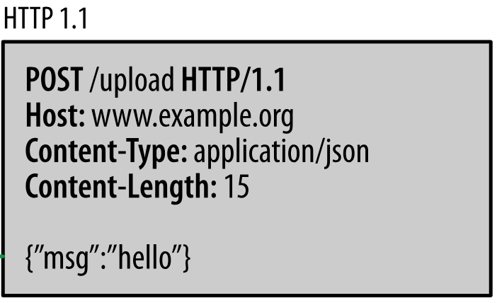
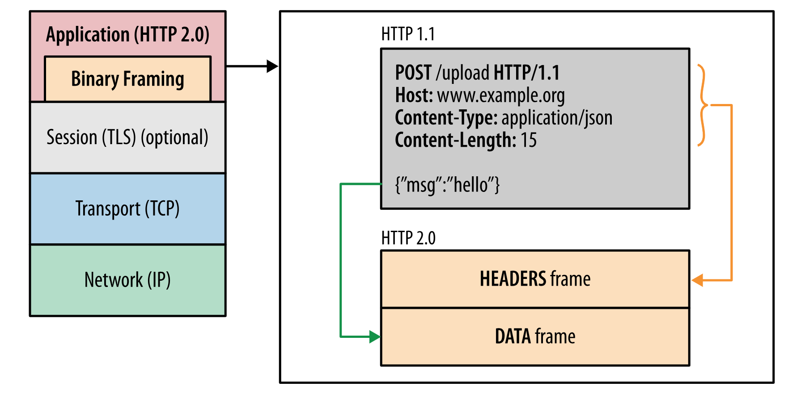
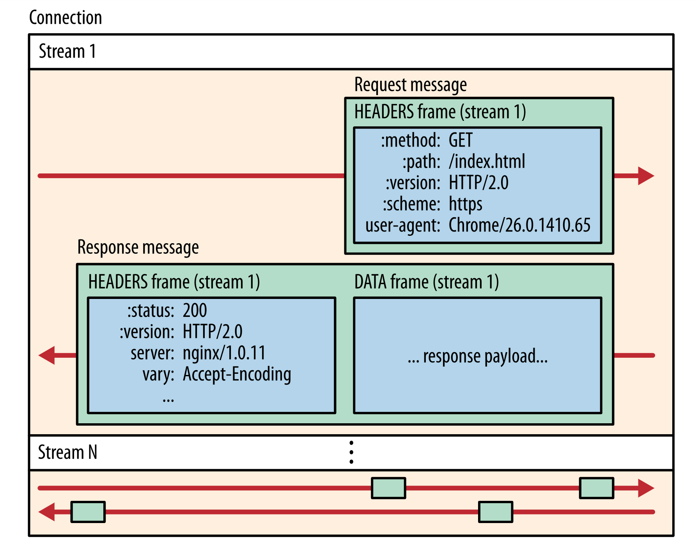
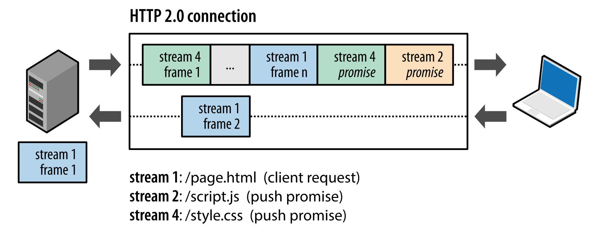
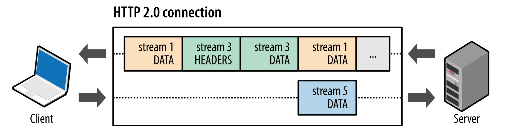

# HTTP通信

流程

```
客户端将请求打包成HTTP的请求报文（HTTP协议格式的请求数据）

采用TCP传输发送给服务器端

服务器接收到请求报文后按照HTTP协议进行解析

服务器根据解析后获知的客户端请求进行逻辑执行

服务器将执行后的结果封装成HTTP的响应报文（HTTP协议格式的响应数据）

采用刚才的TCP连接将响应报文发送给客户端

客户端按照HTTP协议解析响应报文获取结果数据
```

细节

```
客户端
浏览器，PC软件、手机APP、程序等


服务器端：
服务器：与客户端进行tcp通信，接收、解析、打包、发送http格式数据

业务程序：根据解析后的请求数据执行逻辑处理，形成要返回的数据交给服务器

服务器与Python业务程序的配合使用WSGI协议
```

# HTTP协议

在Web应用中，服务器把网页传给浏览器，实际上就是把网页的HTML代码发送给浏览器，让浏览器显示出来。而浏览器和服务器之间的传输协议是HTTP，所以：

- HTML是一种用来定义网页的文本，会HTML，就可以编写网页；
- HTTP是在网络上传输HTML的协议，用于浏览器和服务器的通信。

Web采用的HTTP协议采用了非常简单的请求-响应模式，从而大大简化了开发。当我们编写一个页面时，我们只需要在HTTP请求中把HTML发送出去，不需要考虑如何附带图片、视频等，浏览器如果需要请求图片和视频，它会发送另一个HTTP请求，因此，一个HTTP请求只处理一个资源。

HTTP协议同时具备极强的扩展性，虽然浏览器请求的是http://www.sina.com.cn/的首页，但是新浪在HTML中可以链入其他服务器的资源，比如，从而将请求压力分散到各个服务器上，并且，一个站点可以链接到其他站点，无数个站点互相链接起来，就形成了World Wide Web，简称WWW。

## HTTP请求

跟踪了新浪的首页，我们来总结一下HTTP请求的流程：

```
1：浏览器首先向服务器发送HTTP请求，请求包括：
方法：GET还是POST，GET仅请求资源，POST会附带用户数据；
路径：/full/url/path；
域名：由Host头指定：Host: www.sina.com.cn
以及其他相关的Header；

如果是POST，那么请求还包括一个Body，包含用户数据。

2：服务器向浏览器返回HTTP响应，响应包括：
响应代码：200表示成功，3xx表示重定向，4xx表示客户端发送的请求有错误，5xx表示服务器端处理时发生了错误；
响应类型：由Content-Type指定；
以及其他相关的Header；

通常服务器的HTTP响应会携带内容，也就是有一个Body，包含响应的内容，网页的HTML源码就在Body中。

3：如果浏览器还需要继续向服务器请求其他资源，比如图片，就再次发出HTTP请求，重复步骤1、2。
```

**GET**

 从指定的资源请求数据。请注意，查询字符串（名称/值对）是在 GET 请求的 URL 中发送的：

```
/test/demo_form.asp?name1=value1&name2=value2
```

有关 GET 请求的其他一些注释：

- GET 请求可被缓存
- GET 请求保留在浏览器历史记录中
- GET 请求可被收藏为书签
- GET 请求不应在处理敏感数据时使用
- GET 请求有长度限制
- GET 请求只应当用于取回数据

**POST**

向指定的资源提交要被处理的数据。请注意，查询字符串（名称/值对）是在 POST 请求的 HTTP 消息主体中发送的：

```
POST /test/demo_form.asp HTTP/1.1
Host: w3schools.com
name1=value1&name2=value2
```

有关 POST 请求的其他一些注释：

- POST 请求不会被缓存
- POST 请求不会保留在浏览器历史记录中
- POST 不能被收藏为书签
- POST 请求对数据长度没有要求

**比较GET/POST**

|                  | GET                                                          | POST                                                         |
| ---------------- | ------------------------------------------------------------ | ------------------------------------------------------------ |
| 后退按钮/刷新    | 无害                                                         | 数据会被重新提交（浏览器应该告知用户数据会被重新提交）。     |
| 书签             | 可收藏为书签                                                 | 不可收藏为书签                                               |
| 缓存             | 能被缓存                                                     | 不能缓存                                                     |
| 编码类型         | `application/x-www-form-urlencoded`                          | `application/x-www-form-urlencoded 或 multipart/form-data。`为二进制数据使用多重编码。 |
| 历史             | 参数保留在浏览器历史中。                                     | 参数不会保存在浏览器历史中。                                 |
| 对数据长度的限制 | 是的。当发送数据时，GET 方法向 URL 添加数据；URL 的长度是受限制的（URL 的最大长度是 2048 个字符）。 | 无限制。                                                     |
| 对数据类型的限制 | 只允许 ASCII 字符。                                          | 没有限制。也允许二进制数据。                                 |
| 安全性           | 与 POST 相比，GET 的安全性较差，因为所发送的数据是 URL 的一部分。在发送密码或其他敏感信息时绝不要使用 GET ！ | POST 比 GET 更安全，因为参数不会被保存在浏览器历史或 web 服务器日志中。 |
| 可见性           | 数据在 URL 中对所有人都是可见的。                            | 数据不会显示在 URL 中。                                      |

**其他方法**

下面的表格列出了其他一些 HTTP 请求方法：

| 方法    | 描述                                              |
| ------- | ------------------------------------------------- |
| HEAD    | 与 GET 相同，但只返回 HTTP 报头，不返回文档主体。 |
| PUT     | 上传指定的 URI 表示。                             |
| DELETE  | 删除指定资源。                                    |
| OPTIONS | 返回服务器支持的 HTTP 方法。                      |
| CONNECT | 把请求连接转换到透明的 TCP/IP 通道。              |

## 消息结构

每个HTTP请求和响应都遵循相同的格式，一个HTTP包含Header和Body两部分，其中Body是可选的。

HTTP协议是一种文本协议，所以，它的格式也非常简单。

- HTTP GET请求的格式：

```
GET /path HTTP/1.1
Header1: Value1
Header2: Value2
Header3: Value3
```

每个Header一行一个，换行符是`\r\n`。

- HTTP POST请求的格式：

```
POST /path HTTP/1.1
Header1: Value1
Header2: Value2
Header3: Value3

body data goes here...
```

当遇到连续两个`\r\n`时，Header部分结束，后面的数据全部是Body。

- HTTP响应的格式：

```
HTTP/1.1 200 OK
Header1: Value1
Header2: Value2
Header3: Value3

body data goes here...
```

HTTP响应如果包含body，也是通过`\r\n\r\n`来分隔的。请再次注意，Body的数据类型由`Content-Type`头来确定，如果是网页，Body就是文本，如果是图片，Body就是图片的二进制数据。

当存在`Content-Encoding`时，Body数据是被压缩的，最常见的压缩方式是gzip，所以，看到`Content-Encoding: gzip`时，需要将Body数据先解压缩，才能得到真正的数据。压缩的目的在于减少Body的大小，加快网络传输。

## 常用头字段

HTTP头字段以键值对的方式为服务器或客户端提供对方的信息。HTTP中有一些与定义的头字段经常被用到。

方向列中，Response表示从服务器发送给客户端 ，Request表示从客户端发送给服务器。

| 字段名             | 方向     | 解释                                                         | 可能的值                                                     |
| ------------------ | -------- | ------------------------------------------------------------ | ------------------------------------------------------------ |
| Accept             | Request  | 接收什么类型的介质类型                                       | type/sub-type                                                |
| Accept-Charset     | Request  | 接收的字符集                                                 | ISO-8859-1                                                   |
| Accept-Encoding    | Request  | 接收的编码方法，通常指定压缩方法、是否支持压缩、支持什么压缩方法 | Gzip/deflate/UTF8                                            |
| Accept-Language    | Request  | 接收的语言                                                   | En/cn                                                        |
| Accept-Range       | Request  | 服务器表明自己是否接受获取某个实体的一部分的请求             | bytes：表示接受；none：表示不接受                            |
| Age                | Response | 用该头部表明该实体从产生到现在经过多长时间                   |                                                              |
| Authorization      | Response | 当客户端接收到来自web服务器的www-Authenticate响应时，该头部回应在即的身份验证信息给web服务器 | Username:password                                            |
| Cache-Control      | Requset  | 对服务器的缓存控制                                           | no-cache:不要从缓存中去取，要求现在从web服务器中去取         |
| Cache-Control      | Response | 对客户端的缓存控制                                           | Public：可以从缓存内容回应任何用户；Private：只能从缓存内容回应先前请求该内容的那个用户 |
| Connection         | Request  | 对服务器的连接控制                                           | Close:告诉web服务器在完成本次请求的响应后，断开连接，不要等待本次连接的后续请求了；Keepalive:告诉web服务器在完成本次请求的响应后，保持连接，等待本次请求的后续请求 |
| Connection         | Response | 连接状态通知                                                 | Close：连接已经关闭；Keeplive：连接保持，等待本次连接的后续请求 |
| Etag               | Both     | 内容唯一标识。客户端需要把服务器传来的Etag保留，在下次请求相同的URL时提交给服务器。服务器用Etag值判断同一个URL的内容是否有变化，如有变化则发送更新的内容给客户端 |                                                              |
| Expired            | Response | web服务器表明该实体将在什么时候过期                          | YYYY-MM-DD HH:MM:SS                                          |
| Host               | Request  | 客户端指定自己想访问的服务器的域名、ip地址和端口号           | IP:port                                                      |
| Location           | Response | 访问的对此昂已经被移到别的位置了，应该到头字段指向的地址获取 | http://example.com/list                                      |
| Proxy-Authenticate | Response | 代理服务器响应浏览器，要求其提供代理身份验证信息             |                                                              |
| Proxy-Authenticate | Request  | 提供自己在代理服务器中的身份信息                             | Username:password                                            |
| range              | Request  | 需要获取对象的哪一部分内容                                   | bytes=1024-:获取从第1024个字节到最后的内容                   |
| Referer            | Request  | 浏览器向web服务器表明自己是从哪个URL获得当前请求中的URL的    | http://www.baidu.com                                         |
| Server             | Response | 指明服务器的软件类型及版本                                   | Nginx/1.14                                                   |
| User-Agent         | Request  | 指明浏览器的软件类型及版本                                   | Mozilla/x.x                                                  |
| Via                | Both     | 列出冲客户端到服务器或者相反防线的响应经过了哪些代理服务器，他们用什么协议和版本发送的请求 |                                                              |

## 错误代码

- 1xx: 信息

| 消息:                   | 描述:                                                        |
| ----------------------- | ------------------------------------------------------------ |
| 100 Continue            | 服务器仅接收到部分请求，但是一旦服务器并没有拒绝该请求，客户端应该继续发送其余的请求。 |
| 101 Switching Protocols | 服务器转换协议：服务器将遵从客户的请求转换到另外一种协议。   |

- 2xx: 成功

| 消息:                             | 描述:                                                        |
| --------------------------------- | ------------------------------------------------------------ |
| 200 OK                            | 请求成功（其后是对GET和POST请求的应答文档。）                |
| 201 Created                       | 请求被创建完成，同时新的资源被创建。                         |
| 202 Accepted                      | 供处理的请求已被接受，但是处理未完成。                       |
| 203 Non-authoritative Information | 文档已经正常地返回，但一些应答头可能不正确，因为使用的是文档的拷贝。 |
| 204 No Content                    | 没有新文档。浏览器应该继续显示原来的文档。如果用户定期地刷新页面，而Servlet可以确定用户文档足够新，这个状态代码是很有用的。 |
| 205 Reset Content                 | 没有新文档。但浏览器应该重置它所显示的内容。用来强制浏览器清除表单输入内容。 |
| 206 Partial Content               | 客户发送了一个带有Range头的GET请求，服务器完成了它。         |

- 3xx: 重定向

| 消息:                  | 描述:                                                        |
| ---------------------- | ------------------------------------------------------------ |
| 300 Multiple Choices   | 多重选择。链接列表。用户可以选择某链接到达目的地。最多允许五个地址。 |
| 301 Moved Permanently  | 所请求的页面已经转移至新的url。                              |
| 302 Found              | 所请求的页面已经临时转移至新的url。                          |
| 303 See Other          | 所请求的页面可在别的url下被找到。                            |
| 304 Not Modified       | 未按预期修改文档。客户端有缓冲的文档并发出了一个条件性的请求（一般是提供If-Modified-Since头表示客户只想比指定日期更新的文档）。服务器告诉客户，原来缓冲的文档还可以继续使用。 |
| 305 Use Proxy          | 客户请求的文档应该通过Location头所指明的代理服务器提取。     |
| 306 *Unused*           | 此代码被用于前一版本。目前已不再使用，但是代码依然被保留。   |
| 307 Temporary Redirect | 被请求的页面已经临时移至新的url。                            |

- 4xx: 客户端错误

| 消息:                             | 描述:                                                        |
| --------------------------------- | ------------------------------------------------------------ |
| 400 Bad Request                   | 服务器未能理解请求。                                         |
| 401 Unauthorized                  | 被请求的页面需要用户名和密码。                               |
| 402 Payment Required              | 此代码尚无法使用。                                           |
| 403 Forbidden                     | 对被请求页面的访问被禁止。                                   |
| 404 Not Found                     | 服务器无法找到被请求的页面。                                 |
| 405 Method Not Allowed            | 请求中指定的方法不被允许。                                   |
| 406 Not Acceptable                | 服务器生成的响应无法被客户端所接受。                         |
| 407 Proxy Authentication Required | 用户必须首先使用代理服务器进行验证，这样请求才会被处理。     |
| 408 Request Timeout               | 请求超出了服务器的等待时间。                                 |
| 409 Conflict                      | 由于冲突，请求无法被完成。                                   |
| 410 Gone                          | 被请求的页面不可用。                                         |
| 411 Length Required               | "Content-Length" 未被定义。如果无此内容，服务器不会接受请求。 |
| 412 Precondition Failed           | 请求中的前提条件被服务器评估为失败。                         |
| 413 Request Entity Too Large      | 由于所请求的实体的太大，服务器不会接受请求。                 |
| 414 Request-url Too Long          | 由于url太长，服务器不会接受请求。当post请求被转换为带有很长的查询信息的get请求时，就会发生这种情况。 |
| 415 Unsupported Media Type        | 由于媒介类型不被支持，服务器不会接受请求。                   |
| 416                               | 服务器不能满足客户在请求中指定的Range头。                    |
| 417 Expectation Failed            |                                                              |

- 5xx: 服务器错误

| 消息:                          | 描述:                                              |
| ------------------------------ | -------------------------------------------------- |
| 500 Internal Server Error      | 请求未完成。服务器遇到不可预知的情况。             |
| 501 Not Implemented            | 请求未完成。服务器不支持所请求的功能。             |
| 502 Bad Gateway                | 请求未完成。服务器从上游服务器收到一个无效的响应。 |
| 503 Service Unavailable        | 请求未完成。服务器临时过载或当机。                 |
| 504 Gateway Timeout            | 网关超时。                                         |
| 505 HTTP Version Not Supported | 服务器不支持请求中指明的HTTP协议版本。             |

# HTTP2

HTTP/2 是HTTP协议的最新版本，我们通过HTTP/1.x与HTTP/2的对比来认识HTTP/2的特性。

## HTTP1

HTTP/1.x 可以说是一个文本协议，可读性很好，但是效率不高。



- 解析

如果要解析一个完整的 HTTP 请求，首先我们需要能正确的读出 HTTP header。HTTP header 各个 fields 使用 \r\n 分隔，然后跟 body 之间使用 \r\n\r\n 分隔。解析完 header 之后，我们才能从 header 里面的 content-length 拿到 body 的 size，从而读取 body。

这套流程其实并不高效，因为我们需要读取多次，才能将一个完整的 HTTP 请求给解析出来，虽然在代码实现上面，有很多优化方式，譬如：

```
一次将一大块数据读取到 buffer 里面避免多次 IO read

读取的时候直接匹配 \r\n 的方式流式解析
```

但上面的方式对于高性能服务来说，终归还是会有开销。其实最主要的问题在于，HTTP/1.x 的协议是 文本协议，是给人看的，对机器不友好，如果要对机器友好，二进制协议才是更好的选择。

- 交互模型

HTTP/1.x 另一个问题就在于它的交互模式，一个连接每次只能一问一答，也就是client 发送了 request 之后，必须等到 response，才能继续发送下一次请求。

这套机制是非常简单，但会造成网络连接利用率不高。如果需要同时进行大量的交互，client 需要跟 server 建立多条连接，但连接的建立也是有开销的，所以为了性能，通常这些连接都是长连接一直保活的，虽然对于 server 来说同时处理百万连接也没啥太大的挑战，但终归效率不高。

- 服务器推送

因为 HTTP/1.x 并没有推送机制。所以通常两种做法：

- Long polling 长轮询方式，也就是直接给 server 挂一个连接，等待一段时间（譬如 1 分钟），如果 server 有返回或者超时，则再次重新 poll。
- WebSocket，通过 upgrade 机制显示的将这条 HTTP 连接变成裸的 TCP，进行双向交互。

## HTTP2

HTTP/2 是一个二进制协议，这也就意味着它的可读性几乎为 0，但是效率很高。

- 二进制分帧层

HTTP/2 所有性能增强的核心在于新的二进制分帧层，它定义了如何封装 HTTP 消息并在客户端与服务器之间传输。



这里所谓的“层”，指的是位于套接字接口与应用可见的高级 HTTP API 之间一个经过优化的新编码机制：HTTP 的语义（包括各种动词、方法、标头）都不受影响，不同的是传输期间对它们的编码方式变了。HTTP/1.x 协议以换行符作为纯文本的分隔符，而 HTTP/2 将所有传输的信息分割为更小的消息和帧，并采用二进制格式对它们编码。

这样一来，客户端和服务器为了相互理解，都必须使用新的二进制编码机制：HTTP/1.x 客户端无法理解只支持 HTTP/2 的服务器，反之亦然。不过不要紧，现有的应用不必担心这些变化，因为客户端和服务器会替我们完成必要的分帧工作。

- 数据流、消息、帧

新的二进制分帧机制改变了客户端与服务器之间交换数据的方式。 为了说明这个过程，我们需要了解 HTTP/2 的三个概念：

```
- 数据流 Stream：已建立的连接内的双向字节流，可以承载一条或多条消息。
- 消息 Message ：与逻辑请求或响应消息对应的完整的一系列帧。
- 帧 Frame：HTTP/2 通信的最小单位，每个帧都包含帧头，至少也会标识出当前帧所属的数据流。
```

这些概念的关系总结如下：

```
- 所有通信都在一个 TCP 连接上完成，此连接可以承载任意数量的双向数据流。
- 每个数据流都有一个唯一的标识符和可选的优先级信息，用于承载双向消息。
- 每条消息都是一条逻辑 HTTP 消息（例如请求或响应），包含一个或多个帧。
- 帧是最小的通信单位，承载着特定类型的数据，例如 HTTP 标头、消息负载，等等。 来自不同数据流的帧可以交错发送，然后再根据每个帧头的数据流标识符重新组装。
```





- 请求与响应复用

在 HTTP/1.x 中，如果客户端要想发起多个并行请求以提升性能，则必须使用多个 TCP 连接。这是 HTTP/1.x 交付模型的直接结果，该模型可以保证每个连接每次只交付一个响应（响应排队）。更糟糕的是，这种模型也会导致队首阻塞，从而造成底层 TCP 连接的效率低下。

HTTP/2 中新的二进制分帧层突破了这些限制，实现了完整的请求和响应复用：客户端和服务器可以将 HTTP 消息分解为互不依赖的帧，然后交错发送，最后再在另一端把它们重新组装起来。



上图展示了同一个连接内并行的多个数据流。客户端正在向服务器传输一个 `DATA` 帧（数据流 5），与此同时，服务器正向客户端交错发送数据流 1 和数据流 3 的一系列帧。因此，一个连接上同时有三个并行数据流。

HTTP/2 通过 stream 支持了连接的多路复用，提高了连接的利用率。Stream 有很多重要特性：

```
- 一条连接可以包含多个 streams，多个 streams 发送的数据互相不影响。
- Stream 可以被 client 和 server 单方面或者共享使用。
- Stream 可以被任意一段关闭。
- Stream 会确定好发送 frame 的顺序，另一端会按照接受到的顺序来处理。
- Stream 用一个唯一 ID 来标识。
```

这里在说一下 Stream ID，如果是 client 创建的 stream，ID 就是奇数，如果是 server 创建的，ID 就是偶数。ID 0x00 和 0x01 都有特定的使用场景，不会用到。

Stream ID 不可能被重复使用，如果一条连接上面 ID 分配完了，client 会新建一条连接。而 server 则会给 client 发送一个 GOAWAY frame 强制让 client 新建一条连接。

将 HTTP 消息分解为独立的帧，交错发送，然后在另一端重新组装是 HTTP 2 最重要的一项增强。事实上，这个机制会在整个网络技术栈中引发一系列连锁反应，从而带来巨大的性能提升，让我们可以：

```
- 并行交错地发送多个请求，请求之间互不影响。
- 并行交错地发送多个响应，响应之间互不干扰。
- 使用一个连接并行发送多个请求和响应。
- 不必再为绕过 HTTP/1.x 限制而做很多工作，例如级联文件、image sprites 和域名分片。
- 消除不必要的延迟和提高现有网络容量的利用率，从而减少页面加载时间。
- 等等…
```

HTTP/2 中的新二进制分帧层解决了 HTTP/1.x 中存在的队首阻塞问题，也消除了并行处理和发送请求及响应时对多个连接的依赖。结果，应用速度更快、开发更简单、部署成本更低。

- 服务器推送

HTTP/2 新增的另一个强大的新功能是，服务器可以对一个客户端请求发送多个响应。 换句话说，除了对最初请求的响应外，服务器还可以向客户端推送额外资源，而无需客户端明确地请求。


- 数据流优先级

因为一条连接允许多个 streams 在上面发送 frame，那么在一些场景下面，我们还是希望 stream 有优先级，方便对端为不同的请求分配不同的资源。譬如对于一个 Web 站点来说，优先加载重要的资源，而对于一些不那么重要的图片啥的，则使用低的优先级。

我们还可以设置 Stream Dependencies，形成一棵 streams priority tree。假设 Stream A 是 parent，Stream B 和 C 都是它的孩子，B 的 weight 是 4，C 的 weight 是 12，假设现在 A 能分配到所有的资源，那么后面 B 能分配到的资源只有 C 的 1/3。

- 数据流控制

HTTP/2 也支持流控，如果 sender 端发送数据太快，receiver 端可能因为太忙，或者压力太大，或者只想给特定的 stream 分配资源，receiver 端就可能不想处理这些数据。譬如，如果 client 给 server 请求了一个视屏，但这时候用户暂停观看了，client 就可能告诉 server 别在发送数据了。

虽然 TCP 也有 flow control，但它仅仅只对一个连接有效果。HTTP/2 在一条连接上面会有多个 streams，有时候，我们仅仅只想对一些 stream 进行控制，所以 HTTP/2 单独提供了流控机制。

# URL

静态

```
静态URL类似 域名/news/2012-5-18/110.html 我们一般称为真静态URL，每个网页有真实的物理路径，也就是真实存在服务器里的。

优点是：
网站打开速度快，因为它不用进行运算；另外网址结构比较友好，利于记忆。

缺点是：
最大的缺点是如果是中大型网站，则产生的页面特别多，不好管理。至于有的开发者说占用硬盘空间大，我觉得这个可有忽略不计，占用不了多少空间的，况且目前硬盘空间都比较大。还有的开发者说会伤硬盘，这点也可以忽略不计。
```

动态

```
动态URL类似 域名/NewsMore.asp?id=5 或者 域名/DaiKuan.php?id=17，带有？号的URL，我们一般称为动态网址，每个URL只是一个逻辑地址，并不是真实物理存在服务器硬盘里的。

优点是：
适合中大型网站，修改页面很方便，因为是逻辑地址，所以占用硬盘空间要比纯静态网站小。

缺点是：
因为要进行运算，所以打开速度稍慢，不过这个可有忽略不计，目前有服务器缓存技术可以解决速度问题。最大的缺点是URL结构稍稍复杂，不利于记忆。
```

伪静态

```
伪静态URL类似 域名/course/74.html 这个URL和真静态URL类似。他是通过伪静态规则把动态URL伪装成静态网址。也是逻辑地址，不存在物理地址。

优点是：
URL比较友好，利于记忆。非常适合大中型网站，是个折中方案。

缺点是：
设置麻烦，服务器要支持重写规则，小企业网站或者玩不好的就不要折腾了。另外进行了伪静态网站访问速度并没有变快，因为实质上它会额外的进行运算解释，反正增加了服务器负担，速度反而变慢，不过现在的服务器都很强大，这种影响也可以忽略不计。还有可能会造成动态URL和静态URL都被搜索引擎收录，不过可以用robots禁止掉动态地址。
```

# 